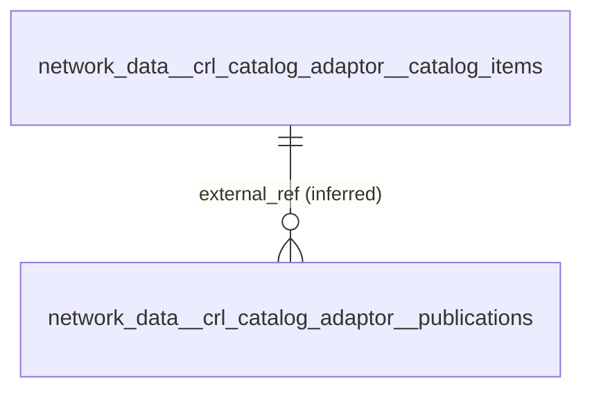
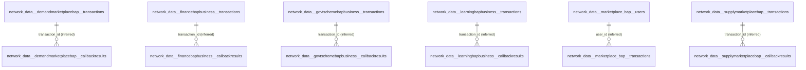
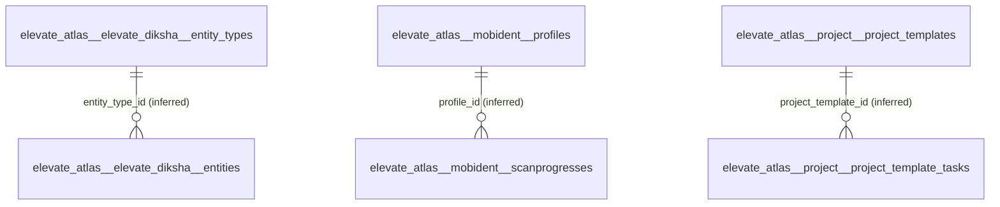
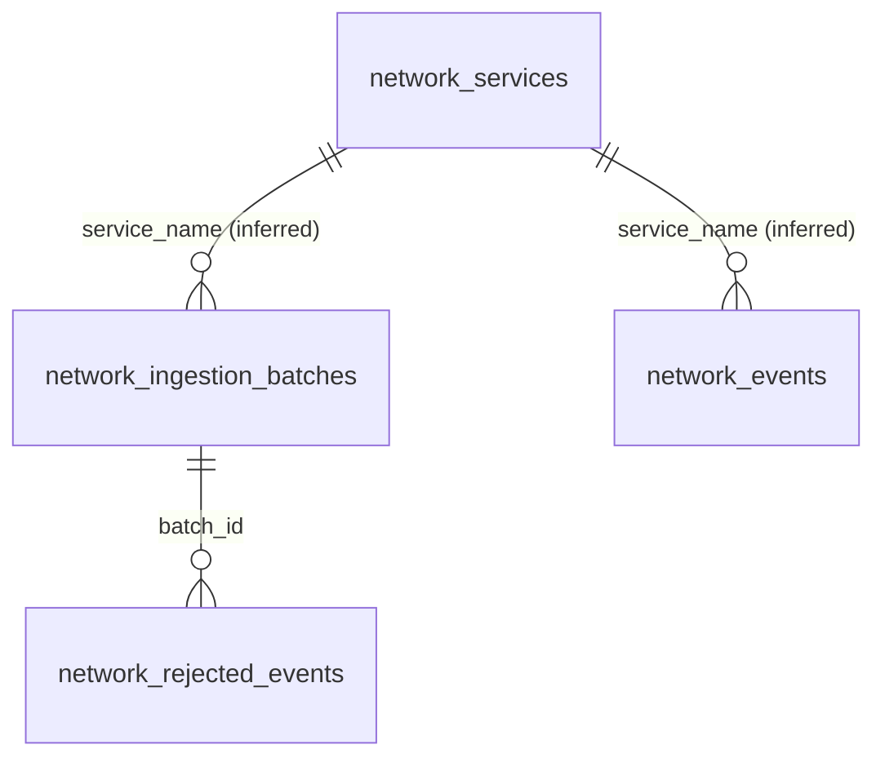

# CRL Master DB - Relational Redesign: Analysis and Implementation Plan

> **Status: ANALYSIS AND PLAN ONLY - awaiting review/approval.** Generated 2026-09-30. Nothing was changed: no code, database, schema, table, data or pipeline setting was modified, no migration was run, no JSON column was dropped and no table was recreated. All findings come from **read-only** queries against the four source systems and `crl_master_db`.

**Source names used in this document**

| Source name | Technical key (`.env` / `source_system`) |
| --- | --- |
| MongoDB #1 — Network Data | `mongodb_network_data` |
| MongoDB #2 — Elevate (Atlas) | `mongodb_elevate_atlas` |
| PostgreSQL #1 — Supabase | `postgresql_supabase` |
| PostgreSQL #2 — Network Telemetry | `postgresql_network_telemetry` |

## Executive summary

- **Today** the Master DB holds **215 `application` tables, 6 `telemetry` tables and 1 audit table that store the source record as one `payload jsonb` column** (plus generic metadata columns). There are **0 foreign keys** in `application`/`telemetry`. This is exactly what the new direction rejects.
- **Sources are far less relational than the target needs to be.** PostgreSQL sources declare only **13 foreign-key constraints** in 67 tables (`mentoring` declares none; `postgres` 5; `scp` 7). MongoDB has no constraints at all. Most relationships therefore have to be **inferred from data**, and this plan separates *Confirmed* from *Inferred* from *Candidate*.
- **Evidence gathered:** 153 Mongo collections (103 with data, 50 empty) analysed document-by-document (8,810 distinct field paths); all 67 source PostgreSQL tables + the 5 network-telemetry tables introspected; every id-like field tested against the key values of every other collection/table.
- **Relationship inventory:** 14 Confirmed, 16 Inferred-High, 51 Inferred-Medium, 176 Candidate (name alone was never accepted as proof), plus 645 structural parent-child links that arise from decomposing arrays.
- **Proposed model:** **859 application tables** (99 MongoDB parent tables, 67 PostgreSQL tables kept 1:1, 324 child tables for arrays of objects, 315 child tables for arrays of scalars, 5 key/value child tables for id-keyed maps, and 49 placeholders for empty collections whose structure cannot be known) and **7 telemetry tables**. **Zero JSON/JSONB columns in `application`.**
- **It is not free of difficulty:** 236 items need a decision or more source evidence (49 empty collections, polymorphic fields, arrays that are always empty, arrays of arrays). The 46 JSON columns that exist *inside the PostgreSQL sources* must also be made relational; 27 of them are empty today, so their structure cannot be verified from data.
- **Decisions needed from you before implementation** are listed in section 11 (biggest: how to model the Beckn payloads that are embedded in many collections, whether the raw source copy is still to be kept anywhere, history vs current-state semantics, naming, and access to source application code for the empty collections).

### How to read the evidence labels

| Label | Meaning | Used for FK? |
| --- | --- | --- |
| **Confirmed** | Declared by the source database (PostgreSQL foreign-key constraint or equivalent structural fact). | Yes |
| **Inferred-High** | No declared FK, but: the field name is aligned with the parent key/entity **and** 100% of distinct child values exist in the parent **and** at least 5 distinct values **and** a single plausible parent. | Yes - proposed FK |
| **Inferred-Medium** | Name-aligned, but some child values have no parent (orphans), or fewer than 5 distinct values, or several aligned parents. | Only with an agreed orphan policy |
| **Candidate** | Values overlap a key of another table but the field name gives no entity hint, or several tables match (typically small integer ids), or the data contradicts the link. | No - documented only |
| **Structural** | Parent-child relation created by the modelling itself (an array inside a document becomes a child table keyed by the parent). | Yes - by construction |

Limits of the evidence: MongoDB samples are the **current** data (103 non-empty collections read in full); a field that is absent today cannot be modelled; containment (`child values ⊆ parent keys`) proves compatibility of values, not business meaning, so it is always combined with name alignment before anything is labelled Inferred.

## 1. Current-State Analysis

### 1.1 Current Master DB structure (`crl_master_db`, 306 MB)

| Schema | Base tables | Tables with JSONB column | JSONB columns | Foreign keys | Approx. rows |
| --- | --- | --- | --- | --- | --- |
| application | 215 | 215 | 215 | 0 | 27,393 |
| telemetry | 6 | 6 | 6 | 0 | 47,352 |
| audit | 7 | 1 | 1 | 2 | (operational) |

`audit` has 7 base tables plus the view `reconciliation_report`.

### 1.2 Current `application` schema

215 tables, one per source table/collection, all with the **same 13 columns** - the source record is not modelled, it is stored whole:

| Column | Type | Purpose |
| --- | --- | --- |
| master_record_id | bigint identity PK | surrogate row id |
| source_system / source_type | text | mongodb_network_data, postgresql_supabase ... |
| source_database / source_schema / source_table / source_collection | text | lineage |
| source_record_id | text | source `_id` / PK as text |
| source_timestamp | timestamptz | source-provided timestamp when available |
| ingestion_id / ingestion_timestamp | text / timestamptz | pipeline run lineage |
| payload_hash | text | SHA-256 of canonical payload (idempotency) |
| **payload** | **jsonb** | **entire source record**  <- not acceptable for `application` |

Naming today: `network_data__<db>__<collection>` / `supabase__<db>__<table>` (lower-cased, no word separators). 4 tables run in *mirror* mode (current state only: 3 application tables `discovery_index`, `discovery_sync_state`, `notifications`, and telemetry `network_services`); the rest are append-only with version history. There are **no keys other than `master_record_id`** and a unique index on `(source_record_id, payload_hash)`; no relationship of any kind exists between application tables.

### 1.3 Current `telemetry` schema

| Table | Rows (approx.) | Source | JSON today |
| --- | --- | --- | --- |
| network_events | 19.5k | postgresql_network_telemetry `global_registry.telemetry.events` | payload jsonb (whole row) |
| network_ingestion_batches | 14.6k | `telemetry.ingestion_batches` | payload jsonb |
| network_services | 9 | `telemetry.services` | payload jsonb |
| network_rejected_events | 0 | `telemetry.rejected_events` | payload jsonb |
| network_schema_migrations | 3 | `telemetry.schema_migrations` | payload jsonb |
| elevate_events | 13.2k | mongodb_elevate_atlas: 5 `telemetry` collections (shared table) | payload jsonb |

### 1.4 Current `audit` schema

Already relational (typed columns). One JSON column: `audit.retired_records.payload` (archive of source-purged events). Tables: `source_registry`, `pipeline_runs`, `job_execution` (FK -> pipeline_runs), `ingestion_batches` (FK -> pipeline_runs), `error_logs`, `retired_records`, `reconciliation` (+ view `reconciliation_report`).

### 1.5 Source systems (verified)

| Env key | Engine | Content (verified) | Objects | Declared constraints |
| --- | --- | --- | --- | --- |
| mongodb_network_data | MongoDB 7 (no auth) | 15 Beckn network databases: catalog/discovery adaptors, demand/supply/finance/govt-scheme/learning BAP+BPP, marketplace | 66 collections, ~22k docs | none (schemaless) |
| mongodb_elevate_atlas | MongoDB 8 (Atlas) | Elevate: samiksha (business plan), project, elevate-diksha, elevate-notification, Mobident, scp_service, crl_telemetry (`sample_mflix` excluded) | 87 collections, ~17k docs (5 are telemetry) | none |
| postgresql_supabase | PostgreSQL 17 (Supabase) | 3 databases: `postgres` (Elevate user service), `mentoring`, `scp` | 67 tables, ~3.5k rows | 12 FK (postgres 5, scp 7, mentoring 0) |
| postgresql_network_telemetry | PostgreSQL 16 | `global_registry.telemetry` (network telemetry) | 5 tables, ~34k rows | 1 FK (rejected_events -> ingestion_batches) |
| API chatbot / interface | REST | **No endpoint, payload sample or credentials exist** in the repo or `.env` | n/a | n/a |

### 1.6 Current source-to-target mappings
225 source objects map 1:1 to 225 tables (see section 2 for the full list with the proposed relational targets). Reconciliation of counts is automated in `audit.reconciliation`.

### 1.7 Current JSON/JSONB usage

222 JSONB columns exist in the Master DB (215 application, 6 telemetry, 1 audit) - section 6 and Appendix D. In addition the **source** PostgreSQL databases contain **46 json/jsonb columns** and `global_registry.telemetry` contains 2 more (`events.attributes`, `rejected_events.safe_details`).

### 1.8 Current relationships

None in `application`/`telemetry`. Sources: 13 declared FK constraints (all listed in 4.1). Everything else is implicit (sections 4.2-4.5).

### 1.9 Current gaps (against the new objective)

- Source records are stored as opaque JSON: no columns, no types, no constraints, no relationships.
- No primary key other than a surrogate; source identifiers are text inside a generic column.
- Nothing prevents orphans or duplicates of the same business entity.
- Mongo arrays/embedded documents (the majority of the data volume) are unmodelled.
- The source PostgreSQL JSON columns (46) would still be JSON if copied 1:1.
- 49 Mongo application collections are empty today (plus 1 empty telemetry collection): their structure is unknowable from data.
- Ingestion, validation and reconciliation are built around `payload` + `payload_hash`; all of them change (section 8).

## 2. Source-to-Master Mapping

Proposed **parent** table for each source object (child tables created from its arrays are counted in the last column and listed in Appendix B). Current table shown for continuity; proposed names use `snake_case` (decision D2).

| Source Database | Source Schema | Source Table/Collection | Master Schema | Master Table (proposed) | Current Master table | Child tables |
| --- | --- | --- | --- | --- | --- | --- |
| mentoring (postgresql_supabase) | public | availabilities | application | supabase__mentoring__availabilities | supabase__mentoring__availabilities | 0 |
| mentoring (postgresql_supabase) | public | connection_requests | application | supabase__mentoring__connection_requests | supabase__mentoring__connection_requests | 0 |
| mentoring (postgresql_supabase) | public | connections | application | supabase__mentoring__connections | supabase__mentoring__connections | 0 |
| mentoring (postgresql_supabase) | public | default_rules | application | supabase__mentoring__default_rules | supabase__mentoring__default_rules | 0 |
| mentoring (postgresql_supabase) | public | entities | application | supabase__mentoring__entities | supabase__mentoring__entities | 0 |
| mentoring (postgresql_supabase) | public | entity_types | application | supabase__mentoring__entity_types | supabase__mentoring__entity_types | 0 |
| mentoring (postgresql_supabase) | public | feedbacks | application | supabase__mentoring__feedbacks | supabase__mentoring__feedbacks | 0 |
| mentoring (postgresql_supabase) | public | file_uploads | application | supabase__mentoring__file_uploads | supabase__mentoring__file_uploads | 0 |
| mentoring (postgresql_supabase) | public | forms | application | supabase__mentoring__forms | supabase__mentoring__forms | 0 |
| mentoring (postgresql_supabase) | public | issues | application | supabase__mentoring__issues | supabase__mentoring__issues | 0 |
| mentoring (postgresql_supabase) | public | modules | application | supabase__mentoring__modules | supabase__mentoring__modules | 0 |
| mentoring (postgresql_supabase) | public | notification_templates | application | supabase__mentoring__notification_templates | supabase__mentoring__notification_templates | 0 |
| mentoring (postgresql_supabase) | public | organization_extension | application | supabase__mentoring__organization_extension | supabase__mentoring__organization_extension | 0 |
| mentoring (postgresql_supabase) | public | permissions | application | supabase__mentoring__permissions | supabase__mentoring__permissions | 0 |
| mentoring (postgresql_supabase) | public | post_session_details | application | supabase__mentoring__post_session_details | supabase__mentoring__post_session_details | 0 |
| mentoring (postgresql_supabase) | public | question_sets | application | supabase__mentoring__question_sets | supabase__mentoring__question_sets | 0 |
| mentoring (postgresql_supabase) | public | questions | application | supabase__mentoring__questions | supabase__mentoring__questions | 0 |
| mentoring (postgresql_supabase) | public | report_queries | application | supabase__mentoring__report_queries | supabase__mentoring__report_queries | 0 |
| mentoring (postgresql_supabase) | public | report_role_mapping | application | supabase__mentoring__report_role_mapping | supabase__mentoring__report_role_mapping | 0 |
| mentoring (postgresql_supabase) | public | report_types | application | supabase__mentoring__report_types | supabase__mentoring__report_types | 0 |
| mentoring (postgresql_supabase) | public | reports | application | supabase__mentoring__reports | supabase__mentoring__reports | 0 |
| mentoring (postgresql_supabase) | public | resources | application | supabase__mentoring__resources | supabase__mentoring__resources | 0 |
| mentoring (postgresql_supabase) | public | role_extensions | application | supabase__mentoring__role_extensions | supabase__mentoring__role_extensions | 0 |
| mentoring (postgresql_supabase) | public | role_permission_mapping | application | supabase__mentoring__role_permission_mapping | supabase__mentoring__role_permission_mapping | 0 |
| mentoring (postgresql_supabase) | public | sequelize_meta | application | supabase__mentoring__sequelize_meta | supabase__mentoring__sequelize_meta | 0 |
| mentoring (postgresql_supabase) | public | session_attendees | application | supabase__mentoring__session_attendees | supabase__mentoring__session_attendees | 0 |
| mentoring (postgresql_supabase) | public | session_enrollments | application | supabase__mentoring__session_enrollments | supabase__mentoring__session_enrollments | 0 |
| mentoring (postgresql_supabase) | public | session_ownerships | application | supabase__mentoring__session_ownerships | supabase__mentoring__session_ownerships | 0 |
| mentoring (postgresql_supabase) | public | session_request | application | supabase__mentoring__session_request | supabase__mentoring__session_request | 0 |
| mentoring (postgresql_supabase) | public | session_request_mapping | application | supabase__mentoring__session_request_mapping | supabase__mentoring__session_request_mapping | 0 |
| mentoring (postgresql_supabase) | public | sessions | application | supabase__mentoring__sessions | supabase__mentoring__sessions | 0 |
| mentoring (postgresql_supabase) | public | user_extensions | application | supabase__mentoring__user_extensions | supabase__mentoring__user_extensions | 0 |
| postgres (postgresql_supabase) | public | entities | application | supabase__postgres__entities | supabase__postgres__entities | 0 |
| postgres (postgresql_supabase) | public | entity_types | application | supabase__postgres__entity_types | supabase__postgres__entity_types | 0 |
| postgres (postgresql_supabase) | public | feature_role_mapping | application | supabase__postgres__feature_role_mapping | supabase__postgres__feature_role_mapping | 0 |
| postgres (postgresql_supabase) | public | features | application | supabase__postgres__features | supabase__postgres__features | 0 |
| postgres (postgresql_supabase) | public | file_uploads | application | supabase__postgres__file_uploads | supabase__postgres__file_uploads | 0 |
| postgres (postgresql_supabase) | public | forms | application | supabase__postgres__forms | supabase__postgres__forms | 0 |
| postgres (postgresql_supabase) | public | invitations | application | supabase__postgres__invitations | supabase__postgres__invitations | 0 |
| postgres (postgresql_supabase) | public | modules | application | supabase__postgres__modules | supabase__postgres__modules | 0 |
| postgres (postgresql_supabase) | public | notification_templates | application | supabase__postgres__notification_templates | supabase__postgres__notification_templates | 0 |
| postgres (postgresql_supabase) | public | permissions | application | supabase__postgres__permissions | supabase__postgres__permissions | 0 |
| postgres (postgresql_supabase) | public | role_permission_mapping | application | supabase__postgres__role_permission_mapping | supabase__postgres__role_permission_mapping | 0 |
| postgres (postgresql_supabase) | public | sequelize_meta | application | supabase__postgres__sequelize_meta | supabase__postgres__sequelize_meta | 0 |
| postgres (postgresql_supabase) | public | user_roles | application | supabase__postgres__user_roles | supabase__postgres__user_roles | 0 |
| postgres (postgresql_supabase) | public | user_sessions | application | supabase__postgres__user_sessions | supabase__postgres__user_sessions | 0 |
| postgres (postgresql_supabase) | public | users | application | supabase__postgres__users | supabase__postgres__users | 0 |
| postgres (postgresql_supabase) | public | users_credentials | application | supabase__postgres__users_credentials | supabase__postgres__users_credentials | 0 |
| scp (postgresql_supabase) | public | actions | application | supabase__scp__actions | supabase__scp__actions | 0 |
| scp (postgresql_supabase) | public | activities | application | supabase__scp__activities | supabase__scp__activities | 0 |
| scp (postgresql_supabase) | public | certificate_base_templates | application | supabase__scp__certificate_base_templates | supabase__scp__certificate_base_templates | 0 |
| scp (postgresql_supabase) | public | comments | application | supabase__scp__comments | supabase__scp__comments | 0 |
| scp (postgresql_supabase) | public | entities | application | supabase__scp__entities | supabase__scp__entities | 0 |
| scp (postgresql_supabase) | public | entities_model_mapping | application | supabase__scp__entities_model_mapping | supabase__scp__entities_model_mapping | 0 |
| scp (postgresql_supabase) | public | entity_types | application | supabase__scp__entity_types | supabase__scp__entity_types | 0 |
| scp (postgresql_supabase) | public | forms | application | supabase__scp__forms | supabase__scp__forms | 0 |
| scp (postgresql_supabase) | public | modules | application | supabase__scp__modules | supabase__scp__modules | 0 |
| scp (postgresql_supabase) | public | organization_configs | application | supabase__scp__organization_configs | supabase__scp__organization_configs | 0 |
| scp (postgresql_supabase) | public | organization_extensions | application | supabase__scp__organization_extensions | supabase__scp__organization_extensions | 0 |
| scp (postgresql_supabase) | public | permissions | application | supabase__scp__permissions | supabase__scp__permissions | 0 |
| scp (postgresql_supabase) | public | program_resource_mapping | application | supabase__scp__program_resource_mapping | supabase__scp__program_resource_mapping | 0 |
| scp (postgresql_supabase) | public | resources | application | supabase__scp__resources | supabase__scp__resources | 0 |
| scp (postgresql_supabase) | public | review_stages | application | supabase__scp__review_stages | supabase__scp__review_stages | 0 |
| scp (postgresql_supabase) | public | reviews | application | supabase__scp__reviews | supabase__scp__reviews | 0 |
| scp (postgresql_supabase) | public | role_permission_mapping | application | supabase__scp__role_permission_mapping | supabase__scp__role_permission_mapping | 0 |
| scp (postgresql_supabase) | public | rollouts | application | supabase__scp__rollouts | supabase__scp__rollouts | 0 |
| scp (postgresql_supabase) | public | sequelize_meta | application | supabase__scp__sequelize_meta | supabase__scp__sequelize_meta | 0 |
| global_registry (postgresql_network_telemetry) | telemetry | events | telemetry | network_events | telemetry.network_events | 0 |
| global_registry (postgresql_network_telemetry) | telemetry | ingestion_batches | telemetry | network_ingestion_batches | telemetry.network_ingestion_batches | 0 |
| global_registry (postgresql_network_telemetry) | telemetry | rejected_events | telemetry | network_rejected_events | telemetry.network_rejected_events | 0 |
| global_registry (postgresql_network_telemetry) | telemetry | schema_migrations | telemetry | network_schema_migrations | telemetry.network_schema_migrations | 0 |
| global_registry (postgresql_network_telemetry) | telemetry | services | telemetry | network_services | telemetry.network_services | 0 |
| crl_catalog_adaptor (mongodb_network_data) | - | catalog_items | application | network_data__crl_catalog_adaptor__catalog_items | network_data__crl_catalog_adaptor__catalog_items | 45 |
| crl_catalog_adaptor (mongodb_network_data) | - | interests  [EMPTY] | application | network_data__crl_catalog_adaptor__interests | network_data__crl_catalog_adaptor__interests | 0 |
| crl_catalog_adaptor (mongodb_network_data) | - | outbox | application | network_data__crl_catalog_adaptor__outbox | network_data__crl_catalog_adaptor__outbox | 0 |
| crl_catalog_adaptor (mongodb_network_data) | - | publications | application | network_data__crl_catalog_adaptor__publications | network_data__crl_catalog_adaptor__publications | 28 |
| crl_catalog_adaptor (mongodb_network_data) | - | selco_items | application | network_data__crl_catalog_adaptor__selco_items | network_data__crl_catalog_adaptor__selco_items | 0 |
| crl_catalog_adaptor (mongodb_network_data) | - | selco_sync_runs | application | network_data__crl_catalog_adaptor__selco_sync_runs | network_data__crl_catalog_adaptor__selco_sync_runs | 2 |
| crl_discovery_adaptor (mongodb_network_data) | - | assignments | application | network_data__crl_discovery_adaptor__assignments | network_data__crl_discovery_adaptor__assignments | 0 |
| crl_discovery_adaptor (mongodb_network_data) | - | discovery_index | application | network_data__crl_discovery_adaptor__discovery_index | network_data__crl_discovery_adaptor__discovery_index | 41 |
| crl_discovery_adaptor (mongodb_network_data) | - | discovery_requests | application | network_data__crl_discovery_adaptor__discovery_requests | network_data__crl_discovery_adaptor__discovery_requests | 5 |
| crl_discovery_adaptor (mongodb_network_data) | - | discovery_sync_state | application | network_data__crl_discovery_adaptor__discovery_sync_state | network_data__crl_discovery_adaptor__discovery_sync_state | 0 |
| demandmarketplacebap (mongodb_network_data) | - | callbackresults | application | network_data__demandmarketplacebap__callbackresults | network_data__demandmarketplacebap__callbackresults | 0 |
| demandmarketplacebap (mongodb_network_data) | - | failedtransactions  [EMPTY] | application | network_data__demandmarketplacebap__failedtransactions | network_data__demandmarketplacebap__failedtransactions | 0 |
| demandmarketplacebap (mongodb_network_data) | - | productcatalog | application | network_data__demandmarketplacebap__productcatalog | network_data__demandmarketplacebap__productcatalog | 10 |
| demandmarketplacebap (mongodb_network_data) | - | transactions | application | network_data__demandmarketplacebap__transactions | network_data__demandmarketplacebap__transactions | 29 |
| demandmarketplacebpp (mongodb_network_data) | - | demand_interests  [EMPTY] | application | network_data__demandmarketplacebpp__demand_interests | network_data__demandmarketplacebpp__demand_interests | 0 |
| demandmarketplacebpp (mongodb_network_data) | - | demand_products | application | network_data__demandmarketplacebpp__demand_products | network_data__demandmarketplacebpp__demand_products | 9 |
| demandmarketplacebpp (mongodb_network_data) | - | orders | application | network_data__demandmarketplacebpp__orders | network_data__demandmarketplacebpp__orders | 1 |
| demandmarketplacebpp (mongodb_network_data) | - | publish_transactions | application | network_data__demandmarketplacebpp__publish_transactions | network_data__demandmarketplacebpp__publish_transactions | 18 |
| demandmarketplacebpp (mongodb_network_data) | - | schema_versions | application | network_data__demandmarketplacebpp__schema_versions | network_data__demandmarketplacebpp__schema_versions | 0 |
| financebapbusiness (mongodb_network_data) | - | callbackresults | application | network_data__financebapbusiness__callbackresults | network_data__financebapbusiness__callbackresults | 0 |
| financebapbusiness (mongodb_network_data) | - | failedtransactions  [EMPTY] | application | network_data__financebapbusiness__failedtransactions | network_data__financebapbusiness__failedtransactions | 0 |
| financebapbusiness (mongodb_network_data) | - | schemeassignments | application | network_data__financebapbusiness__schemeassignments | network_data__financebapbusiness__schemeassignments | 0 |
| financebapbusiness (mongodb_network_data) | - | schemecatalog | application | network_data__financebapbusiness__schemecatalog | network_data__financebapbusiness__schemecatalog | 5 |
| financebapbusiness (mongodb_network_data) | - | transactions | application | network_data__financebapbusiness__transactions | network_data__financebapbusiness__transactions | 23 |
| financebppbusiness (mongodb_network_data) | - | loan_applications | application | network_data__financebppbusiness__loan_applications | network_data__financebppbusiness__loan_applications | 0 |
| financebppbusiness (mongodb_network_data) | - | loan_interests | application | network_data__financebppbusiness__loan_interests | network_data__financebppbusiness__loan_interests | 0 |
| financebppbusiness (mongodb_network_data) | - | loans | application | network_data__financebppbusiness__loans | network_data__financebppbusiness__loans | 5 |
| financebppbusiness (mongodb_network_data) | - | publish_transactions | application | network_data__financebppbusiness__publish_transactions | network_data__financebppbusiness__publish_transactions | 17 |
| govtschemebapbusiness (mongodb_network_data) | - | callbackresults | application | network_data__govtschemebapbusiness__callbackresults | network_data__govtschemebapbusiness__callbackresults | 0 |
| govtschemebapbusiness (mongodb_network_data) | - | failedtransactions  [EMPTY] | application | network_data__govtschemebapbusiness__failedtransactions | network_data__govtschemebapbusiness__failedtransactions | 0 |
| govtschemebapbusiness (mongodb_network_data) | - | schemeassignments | application | network_data__govtschemebapbusiness__schemeassignments | network_data__govtschemebapbusiness__schemeassignments | 0 |
| govtschemebapbusiness (mongodb_network_data) | - | schemecatalog | application | network_data__govtschemebapbusiness__schemecatalog | network_data__govtschemebapbusiness__schemecatalog | 1 |
| govtschemebapbusiness (mongodb_network_data) | - | transactions | application | network_data__govtschemebapbusiness__transactions | network_data__govtschemebapbusiness__transactions | 23 |
| govtschemebppbusiness (mongodb_network_data) | - | govt_scheme_applications  [EMPTY] | application | network_data__govtschemebppbusiness__govt_scheme_applications | network_data__govtschemebppbusiness__govt_scheme_applications | 0 |
| govtschemebppbusiness (mongodb_network_data) | - | govt_scheme_interests  [EMPTY] | application | network_data__govtschemebppbusiness__govt_scheme_interests | network_data__govtschemebppbusiness__govt_scheme_interests | 0 |
| govtschemebppbusiness (mongodb_network_data) | - | govt_schemes | application | network_data__govtschemebppbusiness__govt_schemes | network_data__govtschemebppbusiness__govt_schemes | 1 |
| govtschemebppbusiness (mongodb_network_data) | - | publish_transactions | application | network_data__govtschemebppbusiness__publish_transactions | network_data__govtschemebppbusiness__publish_transactions | 6 |
| learningbapbusiness (mongodb_network_data) | - | callbackresults | application | network_data__learningbapbusiness__callbackresults | network_data__learningbapbusiness__callbackresults | 0 |
| learningbapbusiness (mongodb_network_data) | - | courseassignments | application | network_data__learningbapbusiness__courseassignments | network_data__learningbapbusiness__courseassignments | 0 |
| learningbapbusiness (mongodb_network_data) | - | coursecatalog | application | network_data__learningbapbusiness__coursecatalog | network_data__learningbapbusiness__coursecatalog | 7 |
| learningbapbusiness (mongodb_network_data) | - | failedtransactions  [EMPTY] | application | network_data__learningbapbusiness__failedtransactions | network_data__learningbapbusiness__failedtransactions | 0 |
| learningbapbusiness (mongodb_network_data) | - | transactions | application | network_data__learningbapbusiness__transactions | network_data__learningbapbusiness__transactions | 35 |
| learningbppbusiness (mongodb_network_data) | - | course_interests | application | network_data__learningbppbusiness__course_interests | network_data__learningbppbusiness__course_interests | 0 |
| learningbppbusiness (mongodb_network_data) | - | courses | application | network_data__learningbppbusiness__courses | network_data__learningbppbusiness__courses | 5 |
| learningbppbusiness (mongodb_network_data) | - | providers | application | network_data__learningbppbusiness__providers | network_data__learningbppbusiness__providers | 0 |
| learningbppbusiness (mongodb_network_data) | - | publish_transactions | application | network_data__learningbppbusiness__publish_transactions | network_data__learningbppbusiness__publish_transactions | 29 |
| marketplace-bap (mongodb_network_data) | - | transactions | application | network_data__marketplace_bap__transactions | network_data__marketplace_bap__transactions | 17 |
| marketplace-bap (mongodb_network_data) | - | users | application | network_data__marketplace_bap__users | network_data__marketplace_bap__users | 2 |
| marketplace-bpp (mongodb_network_data) | - | cooperatives | application | network_data__marketplace_bpp__cooperatives | network_data__marketplace_bpp__cooperatives | 1 |
| marketplace-bpp (mongodb_network_data) | - | counters | application | network_data__marketplace_bpp__counters | network_data__marketplace_bpp__counters | 0 |
| marketplace-bpp (mongodb_network_data) | - | interests | application | network_data__marketplace_bpp__interests | network_data__marketplace_bpp__interests | 0 |
| marketplace-bpp (mongodb_network_data) | - | orders | application | network_data__marketplace_bpp__orders | network_data__marketplace_bpp__orders | 2 |
| marketplace-bpp (mongodb_network_data) | - | products | application | network_data__marketplace_bpp__products | network_data__marketplace_bpp__products | 1 |
| supplymarketplacebap (mongodb_network_data) | - | callbackresults | application | network_data__supplymarketplacebap__callbackresults | network_data__supplymarketplacebap__callbackresults | 0 |
| supplymarketplacebap (mongodb_network_data) | - | failedtransactions  [EMPTY] | application | network_data__supplymarketplacebap__failedtransactions | network_data__supplymarketplacebap__failedtransactions | 0 |
| supplymarketplacebap (mongodb_network_data) | - | interests  [EMPTY] | application | network_data__supplymarketplacebap__interests | network_data__supplymarketplacebap__interests | 0 |
| supplymarketplacebap (mongodb_network_data) | - | productcatalog | application | network_data__supplymarketplacebap__productcatalog | network_data__supplymarketplacebap__productcatalog | 6 |
| supplymarketplacebap (mongodb_network_data) | - | transactions | application | network_data__supplymarketplacebap__transactions | network_data__supplymarketplacebap__transactions | 22 |
| supplymarketplacebpp (mongodb_network_data) | - | publish_transactions | application | network_data__supplymarketplacebpp__publish_transactions | network_data__supplymarketplacebpp__publish_transactions | 14 |
| supplymarketplacebpp (mongodb_network_data) | - | schema_versions | application | network_data__supplymarketplacebpp__schema_versions | network_data__supplymarketplacebpp__schema_versions | 0 |
| supplymarketplacebpp (mongodb_network_data) | - | supply_interests | application | network_data__supplymarketplacebpp__supply_interests | network_data__supplymarketplacebpp__supply_interests | 0 |
| supplymarketplacebpp (mongodb_network_data) | - | supply_products | application | network_data__supplymarketplacebpp__supply_products | network_data__supplymarketplacebpp__supply_products | 6 |
| supplymarketplace (mongodb_network_data) | - | publish_transactions | application | network_data__supplymarketplace__publish_transactions | network_data__supplymarketplace__publish_transactions | 8 |
| supplymarketplace (mongodb_network_data) | - | schema_versions | application | network_data__supplymarketplace__schema_versions | network_data__supplymarketplace__schema_versions | 0 |
| supplymarketplace (mongodb_network_data) | - | supply_interests | application | network_data__supplymarketplace__supply_interests | network_data__supplymarketplace__supply_interests | 0 |
| supplymarketplace (mongodb_network_data) | - | supply_products | application | network_data__supplymarketplace__supply_products | network_data__supplymarketplace__supply_products | 4 |
| Mobident (mongodb_elevate_atlas) | - | bookings  [EMPTY] | application | elevate_atlas__mobident__bookings | elevate_atlas__mobident__bookings | 0 |
| Mobident (mongodb_elevate_atlas) | - | otps  [EMPTY] | application | elevate_atlas__mobident__otps | elevate_atlas__mobident__otps | 0 |
| Mobident (mongodb_elevate_atlas) | - | profiles | application | elevate_atlas__mobident__profiles | elevate_atlas__mobident__profiles | 1 |
| Mobident (mongodb_elevate_atlas) | - | scanprogresses | application | elevate_atlas__mobident__scanprogresses | elevate_atlas__mobident__scanprogresses | 0 |
| Mobident (mongodb_elevate_atlas) | - | screenings | application | elevate_atlas__mobident__screenings | elevate_atlas__mobident__screenings | 6 |
| Mobident (mongodb_elevate_atlas) | - | sessions | application | elevate_atlas__mobident__sessions | elevate_atlas__mobident__sessions | 0 |
| Mobident (mongodb_elevate_atlas) | - | users | application | elevate_atlas__mobident__users | elevate_atlas__mobident__users | 0 |
| elevate-diksha (mongodb_elevate_atlas) | - | deletionAuditLogs  [EMPTY] | application | elevate_atlas__elevate_diksha__deletion_audit_logs | elevate_atlas__elevate_diksha__deletionauditlogs | 0 |
| elevate-diksha (mongodb_elevate_atlas) | - | entities | application | elevate_atlas__elevate_diksha__entities | elevate_atlas__elevate_diksha__entities | 6 |
| elevate-diksha (mongodb_elevate_atlas) | - | entityTypes | application | elevate_atlas__elevate_diksha__entity_types | elevate_atlas__elevate_diksha__entitytypes | 2 |
| elevate-diksha (mongodb_elevate_atlas) | - | userRoleExtension  [EMPTY] | application | elevate_atlas__elevate_diksha__user_role_extension | elevate_atlas__elevate_diksha__userroleextension | 0 |
| elevate-notification (mongodb_elevate_atlas) | - | deletionAuditLogs  [EMPTY] | application | elevate_atlas__elevate_notification__deletion_audit_logs | elevate_atlas__elevate_notification__deletionauditlogs | 0 |
| elevate-notification (mongodb_elevate_atlas) | - | deviceTokens | application | elevate_atlas__elevate_notification__device_tokens | elevate_atlas__elevate_notification__devicetokens | 0 |
| elevate-notification (mongodb_elevate_atlas) | - | entities  [EMPTY] | application | elevate_atlas__elevate_notification__entities | elevate_atlas__elevate_notification__entities | 0 |
| elevate-notification (mongodb_elevate_atlas) | - | entityTypes  [EMPTY] | application | elevate_atlas__elevate_notification__entity_types | elevate_atlas__elevate_notification__entitytypes | 0 |
| elevate-notification (mongodb_elevate_atlas) | - | notifications | application | elevate_atlas__elevate_notification__notifications | elevate_atlas__elevate_notification__notifications | 2 |
| elevate-notification (mongodb_elevate_atlas) | - | userRoleExtension  [EMPTY] | application | elevate_atlas__elevate_notification__user_role_extension | elevate_atlas__elevate_notification__userroleextension | 0 |
| project (mongodb_elevate_atlas) | - | certificateTemplates  [EMPTY] | application | elevate_atlas__project__certificate_templates | elevate_atlas__project__certificatetemplates | 0 |
| project (mongodb_elevate_atlas) | - | configurations  [EMPTY] | application | elevate_atlas__project__configurations | elevate_atlas__project__configurations | 0 |
| project (mongodb_elevate_atlas) | - | deletionAuditLogs  [EMPTY] | application | elevate_atlas__project__deletion_audit_logs | elevate_atlas__project__deletionauditlogs | 0 |
| project (mongodb_elevate_atlas) | - | forms | application | elevate_atlas__project__forms | elevate_atlas__project__forms | 3 |
| project (mongodb_elevate_atlas) | - | organizationExtension  [EMPTY] | application | elevate_atlas__project__organization_extension | elevate_atlas__project__organizationextension | 0 |
| project (mongodb_elevate_atlas) | - | programUsers  [EMPTY] | application | elevate_atlas__project__program_users | elevate_atlas__project__programusers | 0 |
| project (mongodb_elevate_atlas) | - | programs | application | elevate_atlas__project__programs | elevate_atlas__project__programs | 2 |
| project (mongodb_elevate_atlas) | - | projectAttributes  [EMPTY] | application | elevate_atlas__project__project_attributes | elevate_atlas__project__projectattributes | 0 |
| project (mongodb_elevate_atlas) | - | projectCategories | application | elevate_atlas__project__project_categories | elevate_atlas__project__projectcategories | 0 |
| project (mongodb_elevate_atlas) | - | projectTemplateTasks | application | elevate_atlas__project__project_template_tasks | elevate_atlas__project__projecttemplatetasks | 0 |
| project (mongodb_elevate_atlas) | - | projectTemplates | application | elevate_atlas__project__project_templates | elevate_atlas__project__projecttemplates | 6 |
| project (mongodb_elevate_atlas) | - | projects | application | elevate_atlas__project__projects | elevate_atlas__project__projects | 5 |
| project (mongodb_elevate_atlas) | - | rollouts  [EMPTY] | application | elevate_atlas__project__rollouts | elevate_atlas__project__rollouts | 0 |
| project (mongodb_elevate_atlas) | - | solutions | application | elevate_atlas__project__solutions | elevate_atlas__project__solutions | 0 |
| project (mongodb_elevate_atlas) | - | userCourses  [EMPTY] | application | elevate_atlas__project__user_courses | elevate_atlas__project__usercourses | 0 |
| project (mongodb_elevate_atlas) | - | userExtension  [EMPTY] | application | elevate_atlas__project__user_extension | elevate_atlas__project__userextension | 0 |
| samiksha (mongodb_elevate_atlas) | - | businessPlanAuditEvents | application | elevate_atlas__samiksha__business_plan_audit_events | elevate_atlas__samiksha__businessplanauditevents | 1 |
| samiksha (mongodb_elevate_atlas) | - | businessPlanMilestones | application | elevate_atlas__samiksha__business_plan_milestones | elevate_atlas__samiksha__businessplanmilestones | 3 |
| samiksha (mongodb_elevate_atlas) | - | businessPlanValidations | application | elevate_atlas__samiksha__business_plan_validations | elevate_atlas__samiksha__businessplanvalidations | 0 |
| samiksha (mongodb_elevate_atlas) | - | businessPlanVersions | application | elevate_atlas__samiksha__business_plan_versions | elevate_atlas__samiksha__businessplanversions | 0 |
| samiksha (mongodb_elevate_atlas) | - | coachProfiles | application | elevate_atlas__samiksha__coach_profiles | elevate_atlas__samiksha__coachprofiles | 5 |
| samiksha (mongodb_elevate_atlas) | - | configurations | application | elevate_atlas__samiksha__configurations | elevate_atlas__samiksha__configurations | 1 |
| samiksha (mongodb_elevate_atlas) | - | criteria | application | elevate_atlas__samiksha__criteria | elevate_atlas__samiksha__criteria | 6 |
| samiksha (mongodb_elevate_atlas) | - | criteriaQuestions | application | elevate_atlas__samiksha__criteria_questions | elevate_atlas__samiksha__criteriaquestions | 10 |
| samiksha (mongodb_elevate_atlas) | - | deletionAuditLogs  [EMPTY] | application | elevate_atlas__samiksha__deletion_audit_logs | elevate_atlas__samiksha__deletionauditlogs | 0 |
| samiksha (mongodb_elevate_atlas) | - | entities | application | elevate_atlas__samiksha__entities | elevate_atlas__samiksha__entities | 0 |
| samiksha (mongodb_elevate_atlas) | - | entityAssessors  [EMPTY] | application | elevate_atlas__samiksha__entity_assessors | elevate_atlas__samiksha__entityassessors | 0 |
| samiksha (mongodb_elevate_atlas) | - | entityAssessorsTrackers  [EMPTY] | application | elevate_atlas__samiksha__entity_assessors_trackers | elevate_atlas__samiksha__entityassessorstrackers | 0 |
| samiksha (mongodb_elevate_atlas) | - | entityTypes | application | elevate_atlas__samiksha__entity_types | elevate_atlas__samiksha__entitytypes | 0 |
| samiksha (mongodb_elevate_atlas) | - | entrepreneurProfiles | application | elevate_atlas__samiksha__entrepreneur_profiles | elevate_atlas__samiksha__entrepreneurprofiles | 0 |
| samiksha (mongodb_elevate_atlas) | - | feedback  [EMPTY] | application | elevate_atlas__samiksha__feedback | elevate_atlas__samiksha__feedback | 0 |
| samiksha (mongodb_elevate_atlas) | - | forms | application | elevate_atlas__samiksha__forms | elevate_atlas__samiksha__forms | 2 |
| samiksha (mongodb_elevate_atlas) | - | frameworks  [EMPTY] | application | elevate_atlas__samiksha__frameworks | elevate_atlas__samiksha__frameworks | 0 |
| samiksha (mongodb_elevate_atlas) | - | growthStageProgress | application | elevate_atlas__samiksha__growth_stage_progress | elevate_atlas__samiksha__growthstageprogress | 1 |
| samiksha (mongodb_elevate_atlas) | - | insights  [EMPTY] | application | elevate_atlas__samiksha__insights | elevate_atlas__samiksha__insights | 0 |
| samiksha (mongodb_elevate_atlas) | - | journeyCatalog | application | elevate_atlas__samiksha__journey_catalog | elevate_atlas__samiksha__journeycatalog | 12 |
| samiksha (mongodb_elevate_atlas) | - | journeySuggestions | application | elevate_atlas__samiksha__journey_suggestions | elevate_atlas__samiksha__journeysuggestions | 23 |
| samiksha (mongodb_elevate_atlas) | - | libraryCategories  [EMPTY] | application | elevate_atlas__samiksha__library_categories | elevate_atlas__samiksha__librarycategories | 0 |
| samiksha (mongodb_elevate_atlas) | - | mediaFiles  [EMPTY] | application | elevate_atlas__samiksha__media_files | elevate_atlas__samiksha__mediafiles | 0 |
| samiksha (mongodb_elevate_atlas) | - | mediaUploads | application | elevate_atlas__samiksha__media_uploads | elevate_atlas__samiksha__mediauploads | 0 |
| samiksha (mongodb_elevate_atlas) | - | migrations | application | elevate_atlas__samiksha__migrations | elevate_atlas__samiksha__migrations | 0 |
| samiksha (mongodb_elevate_atlas) | - | observationAnalytics | application | elevate_atlas__samiksha__observation_analytics | elevate_atlas__samiksha__observationanalytics | 23 |
| samiksha (mongodb_elevate_atlas) | - | observationSubmissions | application | elevate_atlas__samiksha__observation_submissions | elevate_atlas__samiksha__observationsubmissions | 9 |
| samiksha (mongodb_elevate_atlas) | - | observations | application | elevate_atlas__samiksha__observations | elevate_atlas__samiksha__observations | 31 |
| samiksha (mongodb_elevate_atlas) | - | organizationExtension  [EMPTY] | application | elevate_atlas__samiksha__organization_extension | elevate_atlas__samiksha__organizationextension | 0 |
| samiksha (mongodb_elevate_atlas) | - | pollSubmissions  [EMPTY] | application | elevate_atlas__samiksha__poll_submissions | elevate_atlas__samiksha__pollsubmissions | 0 |
| samiksha (mongodb_elevate_atlas) | - | polls  [EMPTY] | application | elevate_atlas__samiksha__polls | elevate_atlas__samiksha__polls | 0 |
| samiksha (mongodb_elevate_atlas) | - | profileQuestionResponses  [EMPTY] | application | elevate_atlas__samiksha__profile_question_responses | elevate_atlas__samiksha__profilequestionresponses | 0 |
| samiksha (mongodb_elevate_atlas) | - | profileQuestionSets | application | elevate_atlas__samiksha__profile_question_sets | elevate_atlas__samiksha__profilequestionsets | 3 |
| samiksha (mongodb_elevate_atlas) | - | programUsers  [EMPTY] | application | elevate_atlas__samiksha__program_users | elevate_atlas__samiksha__programusers | 0 |
| samiksha (mongodb_elevate_atlas) | - | programs | application | elevate_atlas__samiksha__programs | elevate_atlas__samiksha__programs | 4 |
| samiksha (mongodb_elevate_atlas) | - | questions | application | elevate_atlas__samiksha__questions | elevate_atlas__samiksha__questions | 6 |
| samiksha (mongodb_elevate_atlas) | - | recommendationTargets  [EMPTY] | application | elevate_atlas__samiksha__recommendation_targets | elevate_atlas__samiksha__recommendationtargets | 0 |
| samiksha (mongodb_elevate_atlas) | - | reportOptions  [EMPTY] | application | elevate_atlas__samiksha__report_options | elevate_atlas__samiksha__reportoptions | 0 |
| samiksha (mongodb_elevate_atlas) | - | sharedLink  [EMPTY] | application | elevate_atlas__samiksha__shared_link | elevate_atlas__samiksha__sharedlink | 0 |
| samiksha (mongodb_elevate_atlas) | - | solutions | application | elevate_atlas__samiksha__solutions | elevate_atlas__samiksha__solutions | 39 |
| samiksha (mongodb_elevate_atlas) | - | staticLinks  [EMPTY] | application | elevate_atlas__samiksha__static_links | elevate_atlas__samiksha__staticlinks | 0 |
| samiksha (mongodb_elevate_atlas) | - | submissions  [EMPTY] | application | elevate_atlas__samiksha__submissions | elevate_atlas__samiksha__submissions | 0 |
| samiksha (mongodb_elevate_atlas) | - | surveySubmissions | application | elevate_atlas__samiksha__survey_submissions | elevate_atlas__samiksha__surveysubmissions | 4 |
| samiksha (mongodb_elevate_atlas) | - | surveys | application | elevate_atlas__samiksha__surveys | elevate_atlas__samiksha__surveys | 0 |
| samiksha (mongodb_elevate_atlas) | - | taskEvidence  [EMPTY] | application | elevate_atlas__samiksha__task_evidence | elevate_atlas__samiksha__taskevidence | 0 |
| samiksha (mongodb_elevate_atlas) | - | userCourses  [EMPTY] | application | elevate_atlas__samiksha__user_courses | elevate_atlas__samiksha__usercourses | 0 |
| samiksha (mongodb_elevate_atlas) | - | userExtension  [EMPTY] | application | elevate_atlas__samiksha__user_extension | elevate_atlas__samiksha__userextension | 0 |
| samiksha (mongodb_elevate_atlas) | - | userRoles  [EMPTY] | application | elevate_atlas__samiksha__user_roles | elevate_atlas__samiksha__userroles | 0 |
| scp_service (mongodb_elevate_atlas) | - | resources | application | elevate_atlas__scp_service__resources | elevate_atlas__scp_service__resources | 0 |
| crl_telemetry (mongodb_elevate_atlas) | - | telemetry | telemetry | elevate_events | telemetry.elevate_events | 1 |
| elevate-diksha (mongodb_elevate_atlas) | - | telemetry | telemetry | elevate_events | telemetry.elevate_events | (shared) |
| elevate-notification (mongodb_elevate_atlas) | - | telemetry  [EMPTY] | telemetry | elevate_events | telemetry.elevate_events | (shared) |
| project (mongodb_elevate_atlas) | - | telemetry | telemetry | elevate_events | telemetry.elevate_events | (shared) |
| samiksha (mongodb_elevate_atlas) | - | telemetry | telemetry | elevate_events | telemetry.elevate_events | (shared) |

## 3. Column Mapping

The complete column-level mapping for **every** proposed Master table is in **Appendix A** (generated from the data; 7,897 MongoDB-derived columns and 820 PostgreSQL columns). Modelling rules used, so that the appendix can be reviewed rule-by-rule rather than line-by-line:

| # | Rule | Applies to | Transformation recorded as |
| --- | --- | --- | --- |
| R1 | Each source table/collection -> one **parent** table. PostgreSQL tables keep their column names, types, PK, FK, unique and nullability. | all | none |
| R2 | MongoDB `_id` -> primary key column `id` (`char(24)` for ObjectId). | Mongo roots | rename `_id` -> `id` |
| R3 | Scalar field -> typed column. ObjectId->`char(24)`, string->`text`, int->`integer`, long->`bigint`, double->`double precision`, decimal->`numeric`, bool->`boolean`, date->`timestamptz`, binary->`bytea`, uuid-shaped strings->`uuid`. | Mongo | rename (snake_case) only |
| R4 | Nested **object** (1:1) -> flattened into the parent as `outer__inner` columns. | Mongo | flatten nested object |
| R5 | **Array of objects** -> child table, PK = parent PK + `<array>_ordinal`, FK to parent; recursive for arrays inside arrays. | Mongo | array -> child table |
| R6 | **Array of scalars** -> child table `(parent PK, ordinal, value)`; when the values are ids it is a junction table (N:M) once the referenced table is decided. | Mongo | array element -> row |
| R7 | **Id-keyed map** (keys are ObjectIds/uuids/numbers, e.g. `observationSubmissions.answers`) -> key/value child table with `map_key` + typed value columns. | Mongo | dynamic map -> rows |
| R8 | Field with **mixed scalar types** -> `text` and flagged (Appendix C). | Mongo | polymorphic -> text |
| R9 | Field that is **always null / array always empty** -> cannot be typed from data -> flagged, needs source schema. | Mongo | unknown type |
| R10 | Generic lineage columns (`ingestion_id`, `ingestion_timestamp`) are kept on **root** tables only - they are metadata, not application data, and are not repeated in Appendix A. | all roots | added metadata |
| R11 | No transformation of values (no cleansing, conversion of meaning, enrichment) - only the structural ones above. | all | - |


## 4. Relationship Mapping

### 4.1 Confirmed (declared in the source databases)

| Parent Table | Parent Key | Child Table | Child Key | Relationship | Evidence | Confidence |
| --- | --- | --- | --- | --- | --- | --- |
| supabase__postgres__entity_types | id | supabase__postgres__entities | entity_type_id | 1:N | declared FK constraint `entities_entity_type_id_fkey` (ON DELETE NO ACTION); rows in child: 268 | Confirmed |
| supabase__postgres__features | code | supabase__postgres__feature_role_mapping | feature_code | 1:N | declared FK constraint `fk_feature_role_mapping_feature_code` (ON DELETE CASCADE); rows in child: 7 | Confirmed |
| supabase__postgres__permissions | id | supabase__postgres__role_permission_mapping | permission_id | 1:N | declared FK constraint `fk_role_permission_mapping_permission` (ON DELETE CASCADE); rows in child: 94 | Confirmed |
| supabase__postgres__users | id | supabase__postgres__user_sessions | user_id | 1:N | declared FK constraint `user_sessions_user_id_fkey` (ON DELETE CASCADE); rows in child: 1395 | Confirmed |
| supabase__postgres__users | id | supabase__postgres__users_credentials | user_id | 1:N | declared FK constraint `users_credentials_user_id_fkey` (ON DELETE CASCADE); rows in child: 62 | Confirmed |
| supabase__scp__resources | id, organization_code, tenant_code | supabase__scp__comments | resource_id, organization_code, tenant_code | 1:N | declared FK constraint `fk_comments_resources` (ON DELETE CASCADE); rows in child: 0 | Confirmed |
| supabase__scp__entity_types | id, tenant_code | supabase__scp__entities | entity_type_id, tenant_code | 1:N | declared FK constraint `fk_entities_entity_type` (ON DELETE CASCADE); rows in child: 31 | Confirmed |
| supabase__scp__entity_types | id, tenant_code | supabase__scp__entities_model_mapping | entity_type_id, tenant_code | 1:N | declared FK constraint `fk_entities_model_mapping_entity_type` (ON DELETE NO ACTION); rows in child: 50 | Confirmed |
| supabase__scp__resources | id, organization_code, tenant_code | supabase__scp__program_resource_mapping | program_id, organization_code, tenant_code | 1:N | declared FK constraint `fk_program_resource_mapping_program_id` (ON DELETE CASCADE); rows in child: 0 | Confirmed |
| supabase__scp__resources | id, organization_code, tenant_code | supabase__scp__program_resource_mapping | resource_id, organization_code, tenant_code | 1:N | declared FK constraint `fk_program_resource_mapping_resource_id` (ON DELETE CASCADE); rows in child: 0 | Confirmed |
| supabase__scp__resources | id, organization_code, tenant_code | supabase__scp__reviews | resource_id, organization_code, tenant_code | 1:N | declared FK constraint `fk_reviews_resources` (ON DELETE CASCADE); rows in child: 0 | Confirmed |
| supabase__scp__resources | id, organization_code, tenant_code | supabase__scp__rollouts | resource_id, organization_code, tenant_code | 1:N | declared FK constraint `fk_rollouts_resources` (ON DELETE CASCADE); rows in child: 0 | Confirmed |
| network_ingestion_batches | batch_id | network_rejected_events | batch_id | 1:N | declared FK constraint `rejected_events_batch_id_fkey` (ON DELETE CASCADE); rows in child: 0 | Confirmed |
| network_ingestion_batches | batch_id | network_rejected_events | batch_id | 1:N | declared FK constraint in source (0 rows currently) | Confirmed |

### 4.2 Inferred-High (proposed foreign keys)

| Parent Table | Parent Key | Child Table | Child Key | Relationship | Evidence | Confidence |
| --- | --- | --- | --- | --- | --- | --- |
| network_data__crl_catalog_adaptor__catalog_items | external_ref | network_data__crl_catalog_adaptor__publications | external_ref | 1:N | no declared FK; same field name; 1114/1114 distinct child values found in parent key (100.0%), 0 orphan value(s) | Inferred-High |
| network_data__demandmarketplacebap__transactions | transaction_id | network_data__demandmarketplacebap__callbackresults | transaction_id | 1:N | no declared FK; same field name; 509/509 distinct child values found in parent key (100.0%), 0 orphan value(s) | Inferred-High |
| network_data__financebapbusiness__transactions | transaction_id | network_data__financebapbusiness__callbackresults | transaction_id | 1:N | no declared FK; same field name; 485/485 distinct child values found in parent key (100.0%), 0 orphan value(s) | Inferred-High |
| network_data__govtschemebapbusiness__transactions | transaction_id | network_data__govtschemebapbusiness__callbackresults | transaction_id | 1:N | no declared FK; same field name; 483/483 distinct child values found in parent key (100.0%), 0 orphan value(s) | Inferred-High |
| network_data__learningbapbusiness__transactions | transaction_id | network_data__learningbapbusiness__callbackresults | transaction_id | 1:N | no declared FK; same field name; 484/484 distinct child values found in parent key (100.0%), 0 orphan value(s) | Inferred-High |
| network_data__marketplace_bap__users | id | network_data__marketplace_bap__transactions | user_id | 1:N | no declared FK; field name matches parent entity; 6/6 distinct child values found in parent key (100.0%), 0 orphan value(s) | Inferred-High |
| network_data__supplymarketplacebap__transactions | transaction_id | network_data__supplymarketplacebap__callbackresults | transaction_id | 1:N | no declared FK; same field name; 616/616 distinct child values found in parent key (100.0%), 0 orphan value(s) | Inferred-High |
| elevate_atlas__mobident__profiles | id | elevate_atlas__mobident__scanprogresses | profile_id | 1:N | no declared FK; field name matches parent entity; 20/20 distinct child values found in parent key (100.0%), 0 orphan value(s) | Inferred-High |
| elevate_atlas__elevate_diksha__entity_types | id | elevate_atlas__elevate_diksha__entities | entity_type_id | 1:N | no declared FK; field name matches parent entity; 6/6 distinct child values found in parent key (100.0%), 0 orphan value(s) | Inferred-High |
| elevate_atlas__project__project_templates | id | elevate_atlas__project__project_template_tasks | project_template_id | 1:N | no declared FK; field name matches parent entity; 24/24 distinct child values found in parent key (100.0%), 0 orphan value(s) | Inferred-High |
| elevate_atlas__project__project_categories | external_id | elevate_atlas__project__project_templates__categories | external_id | 1:N | no declared FK; same field name; 7/7 distinct child values found in parent key (100.0%), 0 orphan value(s) | Inferred-High |
| elevate_atlas__project__project_template_tasks | id | elevate_atlas__project__project_templates__tasks | value | N:M (via array) | no declared FK; field name matches parent entity; 82/82 distinct child values found in parent key (100.0%), 0 orphan value(s) | Inferred-High |
| elevate_atlas__samiksha__questions | id | elevate_atlas__samiksha__criteria__evidences__sections__questions | value | N:M (via array) | no declared FK; field name matches parent entity; 46/46 distinct child values found in parent key (100.0%), 0 orphan value(s) | Inferred-High |
| elevate_atlas__samiksha__business_plan_versions | assignment_id | elevate_atlas__samiksha__journey_suggestions__assignments | assignment_id | 1:N | no declared FK; same field name; 7/7 distinct child values found in parent key (100.0%), 0 orphan value(s) | Inferred-High |
| network_services | service_name | network_events | service_name | 1:N | no declared FK; 9 distinct values, 100% present in services.service_name | Inferred-High |
| network_services | service_name | network_ingestion_batches | service_name | 1:N | no declared FK; 9 distinct values, 100% present in services.service_name | Inferred-High |

### 4.3 Inferred-Medium (foreign key only with an agreed orphan policy - decision D5)

| Parent Table | Parent Key | Child Table | Child Key | Relationship | Evidence | Confidence |
| --- | --- | --- | --- | --- | --- | --- |
| supabase__mentoring__user_extensions | user_id | supabase__mentoring__availabilities | user_id | 1:N | no declared FK; name-aligned; 1 distinct value(s), 0 orphans across 3 non-null rows; very few distinct values | Inferred-Medium |
| supabase__mentoring__user_extensions | user_id | supabase__mentoring__issues | user_id | 1:N | no declared FK; name-aligned; 1 distinct value(s), 0 orphans across 9 non-null rows; very few distinct values | Inferred-Medium |
| supabase__mentoring__organization_extension | organization_id | supabase__mentoring__report_queries | organization_id | 1:N | no declared FK; name-aligned; 1 distinct value(s), 0 orphans across 12 non-null rows; very few distinct values | Inferred-Medium |
| supabase__mentoring__organization_extension | organization_id | supabase__mentoring__reports | organization_id | 1:N | no declared FK; name-aligned; 1 distinct value(s), 0 orphans across 12 non-null rows; very few distinct values | Inferred-Medium |
| supabase__mentoring__organization_extension | organization_id | supabase__mentoring__role_extensions | organization_id | 1:N | no declared FK; name-aligned; 1 distinct value(s), 0 orphans across 6 non-null rows; very few distinct values | Inferred-Medium |
| supabase__mentoring__organization_extension | organization_id | supabase__mentoring__user_extensions | organization_id | 1:N | no declared FK; name-aligned; 1 distinct value(s), 0 orphans across 3 non-null rows; very few distinct values | Inferred-Medium |
| network_data__crl_catalog_adaptor__outbox | publication_id | network_data__crl_catalog_adaptor__publications | publication_id | 1:N | no declared FK; same field name; 2507/2507 distinct child values found in parent key (100.0%), 0 orphan value(s); capped at Medium because: both sides unique: a 1:1 subset relation, so the data does not show which side is the parent | Inferred-Medium |
| network_data__crl_catalog_adaptor__catalog_items | external_ref | network_data__crl_catalog_adaptor__selco_items | external_ref | 1:N | no declared FK; same field name; 704/704 distinct child values found in parent key (100.0%), 0 orphan value(s); capped at Medium because: both sides unique: a 1:1 subset relation, so the data does not show which side is the parent | Inferred-Medium |
| network_data__crl_catalog_adaptor__catalog_items | external_ref | network_data__crl_catalog_adaptor__selco_sync_runs__failures | external_ref | 1:N | no declared FK; same field name; 3/3 distinct child values found in parent key (100.0%), 0 orphan value(s); capped at Medium because: 2 aligned parents; values are not discriminating: they also fit discovery_index, selco_items | Inferred-Medium |
| network_data__crl_discovery_adaptor__discovery_index | resource_id | network_data__crl_discovery_adaptor__assignments | resource_id | 1:N | no declared FK; same field name; 2/2 distinct child values found in parent key (100.0%), 0 orphan value(s); capped at Medium because: both sides unique: a 1:1 subset relation, so the data does not show which side is the parent; values are not discriminating: they also fit catalog_items | Inferred-Medium |
| network_data__demandmarketplacebpp__demand_products | product_id | network_data__demandmarketplacebap__productcatalog | product_id | 1:N | no declared FK; same field name; 142/149 distinct child values found in parent key (95.3%), 7 orphan value(s); capped at Medium because: 2 aligned parents; both sides unique: a 1:1 subset relation, so the data does not show which side is the parent | Inferred-Medium |
| network_data__demandmarketplacebap__productcatalog | product_id | network_data__demandmarketplacebap__transactions__available_products | product_id | 1:N | no declared FK; same field name; 148/152 distinct child values found in parent key (97.4%), 4 orphan value(s) | Inferred-Medium |
| network_data__demandmarketplacebap__productcatalog | product_id | network_data__demandmarketplacebap__transactions__steps | request__filters__product_id | 1:N | no declared FK; same field name; 20/20 distinct child values found in parent key (100.0%), 0 orphan value(s); capped at Medium because: 3 aligned parents; values are not discriminating: they also fit catalog_items, demand_products, discovery_index | Inferred-Medium |
| network_data__demandmarketplacebpp__publish_transactions | product_id | network_data__demandmarketplacebpp__demand_products | product_id | 1:N | no declared FK; same field name; 718/718 distinct child values found in parent key (100.0%), 0 orphan value(s); capped at Medium because: both sides unique: a 1:1 subset relation, so the data does not show which side is the parent | Inferred-Medium |
| network_data__demandmarketplacebap__productcatalog | product_id | network_data__demandmarketplacebpp__orders__items | product_id | 1:N | no declared FK; same field name; 2/2 distinct child values found in parent key (100.0%), 0 orphan value(s) | Inferred-Medium |
| network_data__demandmarketplacebpp__demand_products | product_id | network_data__demandmarketplacebpp__publish_transactions | product_id | 1:N | no declared FK; same field name; 718/718 distinct child values found in parent key (100.0%), 0 orphan value(s); capped at Medium because: both sides unique: a 1:1 subset relation, so the data does not show which side is the parent | Inferred-Medium |
| supabase__postgres__users | id | network_data__financebapbusiness__schemeassignments | assigned_by_user_id | 1:N | no declared FK; field name matches parent entity; 6/6 distinct child values found in parent key (100.0%), 0 orphan value(s); capped at Medium because: values are not discriminating: they also fit entities | Inferred-Medium |
| network_data__financebapbusiness__callbackresults | message_id | network_data__financebapbusiness__transactions__steps | request__context__message_id | 1:N | no declared FK; same field name; 507/523 distinct child values found in parent key (96.9%), 16 orphan value(s) | Inferred-Medium |
| network_data__crl_discovery_adaptor__discovery_index | resource_id | network_data__govtschemebapbusiness__schemeassignments | resource_id | 1:N | no declared FK; same field name; 7/7 distinct child values found in parent key (100.0%), 0 orphan value(s); capped at Medium because: values are not discriminating: they also fit catalog_items, govt_schemes, publish_transactions; a same-database parent also fits: schemecatalog | Inferred-Medium |
| network_data__govtschemebppbusiness__govt_schemes | scheme_id | network_data__govtschemebapbusiness__schemecatalog | scheme_id | 1:N | no declared FK; same field name; 92/93 distinct child values found in parent key (98.9%), 1 orphan value(s); capped at Medium because: 2 aligned parents; both sides unique: a 1:1 subset relation, so the data does not show which side is the parent | Inferred-Medium |
| network_data__govtschemebppbusiness__publish_transactions | scheme_id | network_data__govtschemebppbusiness__govt_schemes | scheme_id | 1:N | no declared FK; same field name; 92/92 distinct child values found in parent key (100.0%), 0 orphan value(s); capped at Medium because: 2 aligned parents; both sides unique: a 1:1 subset relation, so the data does not show which side is the parent | Inferred-Medium |
| network_data__govtschemebppbusiness__govt_schemes | scheme_id | network_data__govtschemebppbusiness__publish_transactions | scheme_id | 1:N | no declared FK; same field name; 92/93 distinct child values found in parent key (98.9%), 1 orphan value(s); capped at Medium because: 2 aligned parents; both sides unique: a 1:1 subset relation, so the data does not show which side is the parent | Inferred-Medium |
| supabase__postgres__users | id | network_data__learningbapbusiness__courseassignments | assigned_by_user_id | 1:N | no declared FK; field name matches parent entity; 5/5 distinct child values found in parent key (100.0%), 0 orphan value(s); capped at Medium because: values are not discriminating: they also fit entities | Inferred-Medium |
| network_data__learningbppbusiness__courses | course_id | network_data__learningbapbusiness__coursecatalog | course_id | 1:N | no declared FK; same field name; 160/162 distinct child values found in parent key (98.8%), 2 orphan value(s); capped at Medium because: both sides unique: a 1:1 subset relation, so the data does not show which side is the parent | Inferred-Medium |
| network_data__learningbapbusiness__callbackresults | message_id | network_data__learningbapbusiness__transactions__steps | request__context__message_id | 1:N | no declared FK; same field name; 501/520 distinct child values found in parent key (96.3%), 19 orphan value(s) | Inferred-Medium |
| network_data__learningbapbusiness__coursecatalog | course_id | network_data__learningbppbusiness__courses | course_id | 1:N | no declared FK; same field name; 160/160 distinct child values found in parent key (100.0%), 0 orphan value(s); capped at Medium because: both sides unique: a 1:1 subset relation, so the data does not show which side is the parent | Inferred-Medium |
| network_data__supplymarketplacebpp__publish_transactions | product_id | network_data__supplymarketplacebap__productcatalog | product_id | 1:N | no declared FK; same field name; 81/84 distinct child values found in parent key (96.4%), 3 orphan value(s); capped at Medium because: 2 aligned parents; both sides unique: a 1:1 subset relation, so the data does not show which side is the parent | Inferred-Medium |
| network_data__supplymarketplacebpp__publish_transactions | product_id | network_data__supplymarketplacebpp__supply_interests | product_id | 1:N | no declared FK; same field name; 2/2 distinct child values found in parent key (100.0%), 0 orphan value(s); capped at Medium because: both sides unique: a 1:1 subset relation, so the data does not show which side is the parent | Inferred-Medium |
| network_data__supplymarketplacebpp__publish_transactions | product_id | network_data__supplymarketplacebpp__supply_products | product_id | 1:N | no declared FK; same field name; 81/81 distinct child values found in parent key (100.0%), 0 orphan value(s); capped at Medium because: 2 aligned parents; both sides unique: a 1:1 subset relation, so the data does not show which side is the parent | Inferred-Medium |
| network_data__supplymarketplace__supply_products | product_id | network_data__supplymarketplace__publish_transactions | product_id | 1:N | no declared FK; same field name; 3/3 distinct child values found in parent key (100.0%), 0 orphan value(s); capped at Medium because: both sides unique: a 1:1 subset relation, so the data does not show which side is the parent | Inferred-Medium |
| network_data__supplymarketplace__publish_transactions | product_id | network_data__supplymarketplace__supply_products | product_id | 1:N | no declared FK; same field name; 3/3 distinct child values found in parent key (100.0%), 0 orphan value(s); capped at Medium because: both sides unique: a 1:1 subset relation, so the data does not show which side is the parent | Inferred-Medium |
| elevate_atlas__mobident__sessions | user_id | elevate_atlas__mobident__profiles | user_id | 1:N | no declared FK; same field name; 2/2 distinct child values found in parent key (100.0%), 0 orphan value(s); capped at Medium because: 2 aligned parents; values are not discriminating: they also fit users | Inferred-Medium |
| elevate_atlas__mobident__users | id | elevate_atlas__mobident__sessions | user_id | 1:N | no declared FK; field name matches parent entity; 3/3 distinct child values found in parent key (100.0%), 0 orphan value(s) | Inferred-Medium |
| elevate_atlas__elevate_diksha__entity_types | id | elevate_atlas__elevate_diksha__entities__meta_information__ta_f5fde43c | entity_type_id | 1:N | no declared FK; field name matches parent entity; 3/3 distinct child values found in parent key (100.0%), 0 orphan value(s) | Inferred-Medium |
| network_data__crl_discovery_adaptor__assignments | id | elevate_atlas__elevate_notification__notifications | data__assignment_id | 1:N | no declared FK; field name matches parent entity; 2/2 distinct child values found in parent key (100.0%), 0 orphan value(s) | Inferred-Medium |
| network_data__crl_discovery_adaptor__assignments | resource_id | elevate_atlas__elevate_notification__notifications | data__resource_id | 1:N | no declared FK; same field name; 2/2 distinct child values found in parent key (100.0%), 0 orphan value(s); capped at Medium because: 2 aligned parents; values are not discriminating: they also fit catalog_items, discovery_index | Inferred-Medium |
| supabase__postgres__users | id | elevate_atlas__elevate_notification__notifications | user_id | 1:N | no declared FK; field name matches parent entity; 4/4 distinct child values found in parent key (100.0%), 0 orphan value(s); capped at Medium because: values are not discriminating: they also fit entities | Inferred-Medium |
| elevate_atlas__samiksha__observations | id | elevate_atlas__project__programs | meta_information__mapped_observation_id | 1:N | no declared FK; field name matches parent entity; 3/3 distinct child values found in parent key (100.0%), 0 orphan value(s) | Inferred-Medium |
| elevate_atlas__samiksha__criteria_questions | external_id | elevate_atlas__samiksha__criteria | external_id | 1:N | no declared FK; same field name; 10/10 distinct child values found in parent key (100.0%), 0 orphan value(s); capped at Medium because: both sides unique: a 1:1 subset relation, so the data does not show which side is the parent | Inferred-Medium |
| elevate_atlas__samiksha__criteria | id | elevate_atlas__samiksha__criteria_questions__evidences__secti_8aa917de | criteria_id | 1:N | no declared FK; field name matches parent entity; 3/3 distinct child values found in parent key (100.0%), 0 orphan value(s); capped at Medium because: values are not discriminating: they also fit criteriaQuestions | Inferred-Medium |
| elevate_atlas__samiksha__criteria | external_id | elevate_atlas__samiksha__criteria_questions | external_id | 1:N | no declared FK; same field name; 10/10 distinct child values found in parent key (100.0%), 0 orphan value(s); capped at Medium because: both sides unique: a 1:1 subset relation, so the data does not show which side is the parent | Inferred-Medium |
| elevate_atlas__samiksha__entity_types | id | elevate_atlas__samiksha__entities | entity_type_id | 1:N | no declared FK; field name matches parent entity; 2/2 distinct child values found in parent key (100.0%), 0 orphan value(s) | Inferred-Medium |
| elevate_atlas__samiksha__criteria | external_id | elevate_atlas__samiksha__observation_analytics__criteria | external_id | 1:N | no declared FK; same field name; 8/8 distinct child values found in parent key (100.0%), 0 orphan value(s); capped at Medium because: 2 aligned parents; values are not discriminating: they also fit criteriaQuestions | Inferred-Medium |
| elevate_atlas__samiksha__criteria | id | elevate_atlas__samiksha__observation_analytics__observation_i_7eda99f3 | value | N:M (via array) | no declared FK; field name matches parent entity; 8/8 distinct child values found in parent key (100.0%), 0 orphan value(s); capped at Medium because: values are not discriminating: they also fit criteriaQuestions | Inferred-Medium |
| elevate_atlas__samiksha__criteria | id | elevate_atlas__samiksha__observation_analytics__observation_i_62b6d810 | criteria_id | 1:N | no declared FK; field name matches parent entity; 8/8 distinct child values found in parent key (100.0%), 0 orphan value(s); capped at Medium because: values are not discriminating: they also fit criteriaQuestions | Inferred-Medium |
| elevate_atlas__samiksha__criteria | id | elevate_atlas__samiksha__observation_analytics__themes__criteria | criteria_id | 1:N | no declared FK; field name matches parent entity; 8/8 distinct child values found in parent key (100.0%), 0 orphan value(s); capped at Medium because: values are not discriminating: they also fit criteriaQuestions | Inferred-Medium |
| elevate_atlas__samiksha__entities | id | elevate_atlas__samiksha__observations__entities | value | N:M (via array) | no declared FK; field name matches parent entity; 2/2 distinct child values found in parent key (100.0%), 0 orphan value(s) | Inferred-Medium |
| elevate_atlas__samiksha__criteria | id | elevate_atlas__samiksha__questions | criteria_id | 1:N | no declared FK; field name matches parent entity; 9/9 distinct child values found in parent key (100.0%), 0 orphan value(s); capped at Medium because: values are not discriminating: they also fit criteriaQuestions | Inferred-Medium |
| elevate_atlas__samiksha__entities | id | elevate_atlas__samiksha__solutions__entities | value | N:M (via array) | no declared FK; field name matches parent entity; 2/2 distinct child values found in parent key (100.0%), 0 orphan value(s) | Inferred-Medium |
| (Beckn BAP transactions: demandmarketplacebap / financebapbusiness / govtschemebapbusiness / learningbapbusiness / supplymarketplacebap / marketplace-bap ...__transactions) | transaction_id | network_events | beckn_transaction_id | 1:N | no declared FK; 99.7% of 2292 distinct ids found among Beckn transaction ids; the parent is one of several tables (domain in events.domain/service_name selects it) so a single FK is not possible without a transaction supertype | Inferred-Medium |
| (Beckn BAP callbackresults ...__callbackresults) | message_id | network_events | beckn_message_id | 1:N | no declared FK; 99.7% of 2287 distinct ids found in callbackresults.messageId (same multi-table caveat) | Inferred-Medium |

### 4.4 Candidate / not proposed as foreign keys

Kept for the record so the evidence is not lost; none of these becomes a FK without further source evidence (application code, schema docs, or domain confirmation).

| Parent Table | Parent Key | Child Table | Child Key | Relationship | Evidence | Confidence |
| --- | --- | --- | --- | --- | --- | --- |
| supabase__postgres__entities | id | supabase__postgres__entities | updated_by | 1:N | no declared FK; audit-user column; several tables hold matching small integer ids, so the parent cannot be determined from values | Candidate |
| supabase__postgres__users | id | supabase__postgres__entities | updated_by | 1:N | no declared FK; audit-user column; several tables hold matching small integer ids, so the parent cannot be determined from values | Candidate |
| supabase__postgres__entities | id | supabase__postgres__features | created_by | 1:N | no declared FK; audit-user column; several tables hold matching small integer ids, so the parent cannot be determined from values | Candidate |
| supabase__postgres__users | id | supabase__postgres__features | created_by | 1:N | no declared FK; audit-user column; several tables hold matching small integer ids, so the parent cannot be determined from values | Candidate |
| supabase__postgres__entities | id | supabase__postgres__features | updated_by | 1:N | no declared FK; audit-user column; several tables hold matching small integer ids, so the parent cannot be determined from values | Candidate |
| supabase__postgres__users | id | supabase__postgres__features | updated_by | 1:N | no declared FK; audit-user column; several tables hold matching small integer ids, so the parent cannot be determined from values | Candidate |
| supabase__postgres__entities | id | supabase__postgres__file_uploads | created_by | 1:N | no declared FK; audit-user column; several tables hold matching small integer ids, so the parent cannot be determined from values | Candidate |
| supabase__postgres__users | id | supabase__postgres__file_uploads | created_by | 1:N | no declared FK; audit-user column; several tables hold matching small integer ids, so the parent cannot be determined from values | Candidate |
| supabase__postgres__entities | id | supabase__postgres__file_uploads | updated_by | 1:N | no declared FK; audit-user column; several tables hold matching small integer ids, so the parent cannot be determined from values | Candidate |
| supabase__postgres__users | id | supabase__postgres__file_uploads | updated_by | 1:N | no declared FK; audit-user column; several tables hold matching small integer ids, so the parent cannot be determined from values | Candidate |
| supabase__postgres__entities | id | supabase__postgres__users_credentials | organization_id | 1:N | no declared FK; values contained in 9 table(s) - ambiguous (small integer domain) | Candidate |
| supabase__postgres__entity_types | id | supabase__postgres__users_credentials | organization_id | 1:N | no declared FK; values contained in 9 table(s) - ambiguous (small integer domain) | Candidate |
| supabase__mentoring__user_extensions | user_id | supabase__mentoring__availabilities | updated_by | 1:N | no declared FK; audit-user column; several tables hold matching small integer ids, so the parent cannot be determined from values | Candidate |
| supabase__mentoring__user_extensions | user_id | supabase__mentoring__availabilities | created_by | 1:N | no declared FK; audit-user column; several tables hold matching small integer ids, so the parent cannot be determined from values | Candidate |
| supabase__mentoring__user_extensions | user_id | supabase__mentoring__connection_requests | updated_by | 1:N | no declared FK; audit-user column; several tables hold matching small integer ids, so the parent cannot be determined from values | Candidate |
| supabase__mentoring__user_extensions | user_id | supabase__mentoring__connection_requests | created_by | 1:N | no declared FK; audit-user column; several tables hold matching small integer ids, so the parent cannot be determined from values | Candidate |
| supabase__mentoring__user_extensions | user_id | supabase__mentoring__entities | updated_by | 1:N | no declared FK; audit-user column; several tables hold matching small integer ids, so the parent cannot be determined from values | Candidate |
| supabase__mentoring__issues | id | supabase__mentoring__entity_types | parent_id | 1:N | no declared FK; values contained in 7 table(s) - ambiguous (small integer domain) | Candidate |
| supabase__mentoring__modules | id | supabase__mentoring__entity_types | parent_id | 1:N | no declared FK; values contained in 7 table(s) - ambiguous (small integer domain) | Candidate |
| supabase__mentoring__user_extensions | user_id | supabase__mentoring__notification_templates | created_by | 1:N | no declared FK; audit-user column; several tables hold matching small integer ids, so the parent cannot be determined from values | Candidate |
| supabase__mentoring__user_extensions | user_id | supabase__mentoring__notification_templates | updated_by | 1:N | no declared FK; audit-user column; several tables hold matching small integer ids, so the parent cannot be determined from values | Candidate |
| supabase__mentoring__user_extensions | user_id | supabase__mentoring__questions | created_by | 1:N | no declared FK; audit-user column; several tables hold matching small integer ids, so the parent cannot be determined from values | Candidate |
| supabase__mentoring__user_extensions | user_id | supabase__mentoring__questions | updated_by | 1:N | no declared FK; audit-user column; several tables hold matching small integer ids, so the parent cannot be determined from values | Candidate |
| supabase__mentoring__user_extensions | user_id | supabase__mentoring__session_request | updated_by | 1:N | no declared FK; audit-user column; several tables hold matching small integer ids, so the parent cannot be determined from values | Candidate |
| supabase__mentoring__user_extensions | user_id | supabase__mentoring__session_request | created_by | 1:N | no declared FK; audit-user column; several tables hold matching small integer ids, so the parent cannot be determined from values | Candidate |
| supabase__mentoring__user_extensions | user_id | supabase__mentoring__sessions | mentor_id | 1:N | no declared FK; values contained in 1 table(s) - ambiguous (small integer domain) | Candidate |
| supabase__mentoring__organization_extension | organization_id | supabase__mentoring__sessions | mentor_organization_id | 1:N | no declared FK; values contained in 1 table(s) - ambiguous (small integer domain) | Candidate |
| supabase__mentoring__user_extensions | user_id | supabase__mentoring__sessions | created_by | 1:N | no declared FK; audit-user column; several tables hold matching small integer ids, so the parent cannot be determined from values | Candidate |
| supabase__mentoring__user_extensions | user_id | supabase__mentoring__sessions | updated_by | 1:N | no declared FK; audit-user column; several tables hold matching small integer ids, so the parent cannot be determined from values | Candidate |
| network_data__crl_discovery_adaptor__discovery_index | resource_id | network_data__crl_catalog_adaptor__catalog_items__accepted_c_46e04149 | value | N:M (via array) | no declared FK; 796/796 distinct child values found in parent key (100.0%); same field-value domain, different field names; 1 overlapping parent key(s) found | Candidate |
| network_data__crl_discovery_adaptor__discovery_index | resource_id | network_data__crl_catalog_adaptor__catalog_items__accepted_c_00227116 | id_2 | 1:N | no declared FK; 1104/1104 distinct child values found in parent key (100.0%); same field-value domain, different field names; 1 overlapping parent key(s) found | Candidate |
| network_data__crl_discovery_adaptor__discovery_index | resource_id | network_data__crl_catalog_adaptor__catalog_items__accepted_c_00227116 | resource_attributes__identity__sku | 1:N | no declared FK; 703/703 distinct child values found in parent key (100.0%); same field-value domain, different field names; 4 overlapping parent key(s) found | Candidate |
| network_data__crl_catalog_adaptor__selco_items | external_ref | network_data__crl_catalog_adaptor__catalog_items__accepted_c_00227116 | resource_attributes__identity__sku | 1:N | no declared FK; 703/703 distinct child values found in parent key (100.0%); same field-value domain, different field names; 4 overlapping parent key(s) found | Candidate |
| network_data__crl_discovery_adaptor__discovery_index | resource_id | network_data__crl_catalog_adaptor__catalog_items__content__o_702fb72c | value | N:M (via array) | no declared FK; 800/800 distinct child values found in parent key (100.0%); same field-value domain, different field names; 1 overlapping parent key(s) found | Candidate |
| network_data__crl_discovery_adaptor__discovery_index | resource_id | network_data__crl_catalog_adaptor__catalog_items__content__resources | id_2 | 1:N | no declared FK; 1112/1114 distinct child values found in parent key (99.8%); same field-value domain, different field names; 1 overlapping parent key(s) found | Candidate |
| network_data__crl_discovery_adaptor__discovery_index | resource_id | network_data__crl_catalog_adaptor__catalog_items__content__resources | resource_attributes__identity__sku | 1:N | no declared FK; 704/704 distinct child values found in parent key (100.0%); same field-value domain, different field names; 4 overlapping parent key(s) found | Candidate |
| network_data__crl_catalog_adaptor__selco_items | external_ref | network_data__crl_catalog_adaptor__catalog_items__content__resources | resource_attributes__identity__sku | 1:N | no declared FK; 704/704 distinct child values found in parent key (100.0%); same field-value domain, different field names; 4 overlapping parent key(s) found | Candidate |
| network_data__crl_discovery_adaptor__discovery_index | resource_id | network_data__crl_catalog_adaptor__catalog_items | external_ref | 1:N | no declared FK; 1112/1114 distinct child values found in parent key (99.8%); same field-value domain, different field names; 1 overlapping parent key(s) found | Candidate |
| network_data__crl_catalog_adaptor__outbox | publication_id | network_data__crl_catalog_adaptor__catalog_items | latest_publication_id | 1:N | no declared FK; 1114/1114 distinct child values found in parent key (100.0%); same field-value domain, different field names; 2 overlapping parent key(s) found | Candidate |
| network_data__crl_catalog_adaptor__publications | publication_id | network_data__crl_catalog_adaptor__catalog_items | latest_publication_id | 1:N | no declared FK; 1114/1114 distinct child values found in parent key (100.0%); same field-value domain, different field names; 2 overlapping parent key(s) found | Candidate |
| network_data__crl_catalog_adaptor__publications | transaction_id | network_data__crl_catalog_adaptor__catalog_items | latest_transaction_id | 1:N | no declared FK; 1114/1114 distinct child values found in parent key (100.0%); same field-value domain, different field names; 1 overlapping parent key(s) found | Candidate |
| supabase__postgres__entities | id | network_data__crl_catalog_adaptor__catalog_items | published_by | 1:N | no declared FK; 2/2 distinct child values found in parent key (100.0%); values overlap a key of this table; field name gives no entity hint; 1 overlapping parent key(s) found | Candidate |
| network_data__crl_catalog_adaptor__catalog_items | external_ref | network_data__crl_catalog_adaptor__publications__message__ca_fc30ad3b | value | N:M (via array) | no declared FK; 800/800 distinct child values found in parent key (100.0%); same field-value domain, different field names; 2 overlapping parent key(s) found | Candidate |
| network_data__crl_discovery_adaptor__discovery_index | resource_id | network_data__crl_catalog_adaptor__publications__message__ca_fc30ad3b | value | N:M (via array) | no declared FK; 800/800 distinct child values found in parent key (100.0%); same field-value domain, different field names; 2 overlapping parent key(s) found | Candidate |
| network_data__crl_catalog_adaptor__catalog_items | external_ref | network_data__crl_catalog_adaptor__publications__message__ca_476835d1 | id_2 | 1:N | no declared FK; 1114/1114 distinct child values found in parent key (100.0%); same field-value domain, different field names; 2 overlapping parent key(s) found | Candidate |
| network_data__crl_discovery_adaptor__discovery_index | resource_id | network_data__crl_catalog_adaptor__publications__message__ca_476835d1 | id_2 | 1:N | no declared FK; 1112/1114 distinct child values found in parent key (99.8%); same field-value domain, different field names; 2 overlapping parent key(s) found | Candidate |
| network_data__crl_catalog_adaptor__catalog_items | external_ref | network_data__crl_catalog_adaptor__publications__message__ca_476835d1 | resource_attributes__identity__sku | 1:N | no declared FK; 704/704 distinct child values found in parent key (100.0%); same field-value domain, different field names; 5 overlapping parent key(s) found | Candidate |
| network_data__crl_discovery_adaptor__discovery_index | resource_id | network_data__crl_catalog_adaptor__publications__message__ca_476835d1 | resource_attributes__identity__sku | 1:N | no declared FK; 704/704 distinct child values found in parent key (100.0%); same field-value domain, different field names; 5 overlapping parent key(s) found | Candidate |
| network_data__crl_catalog_adaptor__catalog_items | external_ref | network_data__crl_discovery_adaptor__discovery_index | attrs__identity__sku | 1:N | no declared FK; 704/704 distinct child values found in parent key (100.0%); same field-value domain, different field names; 4 overlapping parent key(s) found | Candidate |
| network_data__crl_catalog_adaptor__selco_items | external_ref | network_data__crl_discovery_adaptor__discovery_index | attrs__identity__sku | 1:N | no declared FK; 704/704 distinct child values found in parent key (100.0%); same field-value domain, different field names; 4 overlapping parent key(s) found | Candidate |
| network_data__crl_catalog_adaptor__catalog_items | external_ref | network_data__crl_discovery_adaptor__discovery_index__catalo_31553a35 | value | N:M (via array) | no declared FK; 800/800 distinct child values found in parent key (100.0%); same field-value domain, different field names; 1 overlapping parent key(s) found | Candidate |
| network_data__crl_catalog_adaptor__catalog_items | external_ref | network_data__crl_discovery_adaptor__discovery_index__catalo_192a917c | id_2 | 1:N | no declared FK; 1112/1112 distinct child values found in parent key (100.0%); same field-value domain, different field names; 1 overlapping parent key(s) found | Candidate |
| network_data__crl_catalog_adaptor__catalog_items | external_ref | network_data__crl_discovery_adaptor__discovery_index__catalo_192a917c | resource_attributes__identity__sku | 1:N | no declared FK; 704/704 distinct child values found in parent key (100.0%); same field-value domain, different field names; 4 overlapping parent key(s) found | Candidate |
| network_data__crl_catalog_adaptor__selco_items | external_ref | network_data__crl_discovery_adaptor__discovery_index__catalo_192a917c | resource_attributes__identity__sku | 1:N | no declared FK; 704/704 distinct child values found in parent key (100.0%); same field-value domain, different field names; 4 overlapping parent key(s) found | Candidate |
| network_data__crl_catalog_adaptor__catalog_items | external_ref | network_data__crl_discovery_adaptor__discovery_index | resource_id | 1:N | no declared FK; 1112/1112 distinct child values found in parent key (100.0%); same field-value domain, different field names; 1 overlapping parent key(s) found | Candidate |
| network_data__crl_discovery_adaptor__discovery_requests | id | network_data__crl_discovery_adaptor__discovery_index | source_transaction_id | 1:N | no declared FK; 5/5 distinct child values found in parent key (100.0%); values overlap a key of this table; field name gives no entity hint; 3 overlapping parent key(s) found | Candidate |
| network_data__crl_discovery_adaptor__discovery_sync_state | in_flight_transaction_id | network_data__crl_discovery_adaptor__discovery_index | source_transaction_id | 1:N | no declared FK; 5/5 distinct child values found in parent key (100.0%); same field-value domain, different field names; 3 overlapping parent key(s) found | Candidate |
| network_data__crl_catalog_adaptor__catalog_items | external_ref | network_data__crl_discovery_adaptor__discovery_requests__resource_ids | value | N:M (via array) | no declared FK; 67/67 distinct child values found in parent key (100.0%); same field-value domain, different field names; 5 overlapping parent key(s) found | Candidate |
| network_data__crl_discovery_adaptor__discovery_index | resource_id | network_data__crl_discovery_adaptor__discovery_requests__resource_ids | value | N:M (via array) | no declared FK; 67/67 distinct child values found in parent key (100.0%); same field-value domain, different field names; 5 overlapping parent key(s) found | Candidate |
| network_data__crl_catalog_adaptor__catalog_items | external_ref | network_data__crl_discovery_adaptor__discovery_requests__result_ids | value | N:M (via array) | no declared FK; 897/897 distinct child values found in parent key (100.0%); same field-value domain, different field names; 2 overlapping parent key(s) found | Candidate |
| network_data__crl_discovery_adaptor__discovery_index | resource_id | network_data__crl_discovery_adaptor__discovery_requests__result_ids | value | N:M (via array) | no declared FK; 897/897 distinct child values found in parent key (100.0%); same field-value domain, different field names; 2 overlapping parent key(s) found | Candidate |
| network_data__crl_discovery_adaptor__discovery_requests | id | network_data__crl_discovery_adaptor__discovery_sync_state | in_flight_transaction_id | 1:N | no declared FK; 6/6 distinct child values found in parent key (100.0%); values overlap a key of this table; field name gives no entity hint; 1 overlapping parent key(s) found | Candidate |
| network_data__crl_discovery_adaptor__discovery_requests | id | network_data__crl_discovery_adaptor__discovery_sync_state | last_transaction_id | 1:N | no declared FK; 6/6 distinct child values found in parent key (100.0%); values overlap a key of this table; field name gives no entity hint; 1 overlapping parent key(s) found | Candidate |
| network_data__demandmarketplacebpp__demand_products | product_id | network_data__demandmarketplacebap__productcatalog__catalog__d7adc3a2 | value | N:M (via array) | no declared FK; 142/149 distinct child values found in parent key (95.3%); same field-value domain, different field names; 2 overlapping parent key(s) found | Candidate |
| network_data__demandmarketplacebpp__publish_transactions | product_id | network_data__demandmarketplacebap__productcatalog__catalog__d7adc3a2 | value | N:M (via array) | no declared FK; 142/149 distinct child values found in parent key (95.3%); same field-value domain, different field names; 2 overlapping parent key(s) found | Candidate |
| network_data__demandmarketplacebpp__demand_products | product_id | network_data__demandmarketplacebap__productcatalog__catalog__b7abaa6e | id_2 | 1:N | no declared FK; 142/149 distinct child values found in parent key (95.3%); same field-value domain, different field names; 2 overlapping parent key(s) found | Candidate |
| network_data__demandmarketplacebpp__publish_transactions | product_id | network_data__demandmarketplacebap__productcatalog__catalog__b7abaa6e | id_2 | 1:N | no declared FK; 142/149 distinct child values found in parent key (95.3%); same field-value domain, different field names; 2 overlapping parent key(s) found | Candidate |
| network_data__crl_catalog_adaptor__catalog_items | external_ref | network_data__demandmarketplacebap__productcatalog__catalog__b7abaa6e | resource_attributes__identity__sku | 1:N | no declared FK; 124/124 distinct child values found in parent key (100.0%); same field-value domain, different field names; 5 overlapping parent key(s) found | Candidate |
| network_data__crl_discovery_adaptor__discovery_index | resource_id | network_data__demandmarketplacebap__productcatalog__catalog__b7abaa6e | resource_attributes__identity__sku | 1:N | no declared FK; 124/124 distinct child values found in parent key (100.0%); same field-value domain, different field names; 5 overlapping parent key(s) found | Candidate |
| network_data__demandmarketplacebap__productcatalog | product_id | network_data__demandmarketplacebap__transactions__available__1167cad7 | value | N:M (via array) | no declared FK; 148/148 distinct child values found in parent key (100.0%); same field-value domain, different field names; 3 overlapping parent key(s) found | Candidate |
| network_data__demandmarketplacebpp__demand_products | product_id | network_data__demandmarketplacebap__transactions__available__1167cad7 | value | N:M (via array) | no declared FK; 142/148 distinct child values found in parent key (95.9%); same field-value domain, different field names; 3 overlapping parent key(s) found | Candidate |
| network_data__demandmarketplacebap__productcatalog | product_id | network_data__demandmarketplacebap__transactions__available__e733e00c | id_2 | 1:N | no declared FK; 148/148 distinct child values found in parent key (100.0%); same field-value domain, different field names; 3 overlapping parent key(s) found | Candidate |
| network_data__demandmarketplacebpp__demand_products | product_id | network_data__demandmarketplacebap__transactions__available__e733e00c | id_2 | 1:N | no declared FK; 142/148 distinct child values found in parent key (95.9%); same field-value domain, different field names; 3 overlapping parent key(s) found | Candidate |
| network_data__crl_catalog_adaptor__catalog_items | external_ref | network_data__demandmarketplacebap__transactions__available__e733e00c | resource_attributes__identity__sku | 1:N | no declared FK; 124/124 distinct child values found in parent key (100.0%); same field-value domain, different field names; 6 overlapping parent key(s) found | Candidate |
| network_data__crl_discovery_adaptor__discovery_index | resource_id | network_data__demandmarketplacebap__transactions__available__e733e00c | resource_attributes__identity__sku | 1:N | no declared FK; 124/124 distinct child values found in parent key (100.0%); same field-value domain, different field names; 6 overlapping parent key(s) found | Candidate |
| network_data__demandmarketplacebap__callbackresults | message_id | network_data__demandmarketplacebap__transactions | pending_message_ids__discover | 1:N | no declared FK; 22/22 distinct child values found in parent key (100.0%); same field-value domain, different field names; 1 overlapping parent key(s) found | Candidate |
| network_data__demandmarketplacebap__productcatalog | product_id | network_data__demandmarketplacebap__transactions__steps__req_c97570f1 | value | N:M (via array) | no declared FK; 140/144 distinct child values found in parent key (97.2%); same field-value domain, different field names; 1 overlapping parent key(s) found | Candidate |
| network_data__demandmarketplacebap__productcatalog | product_id | network_data__demandmarketplacebap__transactions__steps__req_a32bb3cc | id_2 | 1:N | no declared FK; 140/144 distinct child values found in parent key (97.2%); same field-value domain, different field names; 1 overlapping parent key(s) found | Candidate |
| network_data__crl_catalog_adaptor__catalog_items | external_ref | network_data__demandmarketplacebap__transactions__steps__req_a32bb3cc | resource_attributes__identity__sku | 1:N | no declared FK; 115/115 distinct child values found in parent key (100.0%); same field-value domain, different field names; 6 overlapping parent key(s) found | Candidate |
| network_data__crl_discovery_adaptor__discovery_index | resource_id | network_data__demandmarketplacebap__transactions__steps__req_a32bb3cc | resource_attributes__identity__sku | 1:N | no declared FK; 115/115 distinct child values found in parent key (100.0%); same field-value domain, different field names; 6 overlapping parent key(s) found | Candidate |
| network_data__demandmarketplacebpp__publish_transactions | product_id | network_data__demandmarketplacebpp__demand_products__catalog_866a67b0 | value | N:M (via array) | no declared FK; 718/718 distinct child values found in parent key (100.0%); same field-value domain, different field names; 4 overlapping parent key(s) found | Candidate |
| network_data__crl_catalog_adaptor__catalog_items | external_ref | network_data__demandmarketplacebpp__demand_products__catalog_866a67b0 | value | N:M (via array) | no declared FK; 714/718 distinct child values found in parent key (99.4%); same field-value domain, different field names; 4 overlapping parent key(s) found | Candidate |
| network_data__demandmarketplacebpp__publish_transactions | product_id | network_data__demandmarketplacebpp__demand_products__catalog_ab980831 | id_2 | 1:N | no declared FK; 718/718 distinct child values found in parent key (100.0%); same field-value domain, different field names; 4 overlapping parent key(s) found | Candidate |
| network_data__crl_catalog_adaptor__catalog_items | external_ref | network_data__demandmarketplacebpp__demand_products__catalog_ab980831 | id_2 | 1:N | no declared FK; 714/718 distinct child values found in parent key (99.4%); same field-value domain, different field names; 4 overlapping parent key(s) found | Candidate |
| network_data__demandmarketplacebpp__publish_transactions | product_id | network_data__demandmarketplacebpp__demand_products__catalog_ab980831 | resource_attributes__identity__sku | 1:N | no declared FK; 700/700 distinct child values found in parent key (100.0%); same field-value domain, different field names; 4 overlapping parent key(s) found | Candidate |
| network_data__crl_catalog_adaptor__catalog_items | external_ref | network_data__demandmarketplacebpp__demand_products__catalog_ab980831 | resource_attributes__identity__sku | 1:N | no declared FK; 699/700 distinct child values found in parent key (99.9%); same field-value domain, different field names; 4 overlapping parent key(s) found | Candidate |
| network_data__demandmarketplacebpp__demand_products | product_id | network_data__demandmarketplacebpp__publish_transactions__ou_59082356 | value | N:M (via array) | no declared FK; 718/718 distinct child values found in parent key (100.0%); same field-value domain, different field names; 4 overlapping parent key(s) found | Candidate |
| network_data__crl_catalog_adaptor__catalog_items | external_ref | network_data__demandmarketplacebpp__publish_transactions__ou_59082356 | value | N:M (via array) | no declared FK; 714/718 distinct child values found in parent key (99.4%); same field-value domain, different field names; 4 overlapping parent key(s) found | Candidate |
| network_data__demandmarketplacebpp__demand_products | product_id | network_data__demandmarketplacebpp__publish_transactions__ou_f73b6c6f | id_2 | 1:N | no declared FK; 718/718 distinct child values found in parent key (100.0%); same field-value domain, different field names; 4 overlapping parent key(s) found | Candidate |
| network_data__crl_catalog_adaptor__catalog_items | external_ref | network_data__demandmarketplacebpp__publish_transactions__ou_f73b6c6f | id_2 | 1:N | no declared FK; 714/718 distinct child values found in parent key (99.4%); same field-value domain, different field names; 4 overlapping parent key(s) found | Candidate |
| network_data__demandmarketplacebpp__demand_products | product_id | network_data__demandmarketplacebpp__publish_transactions__ou_f73b6c6f | resource_attributes__identity__sku | 1:N | no declared FK; 700/700 distinct child values found in parent key (100.0%); same field-value domain, different field names; 4 overlapping parent key(s) found | Candidate |
| network_data__crl_catalog_adaptor__catalog_items | external_ref | network_data__demandmarketplacebpp__publish_transactions__ou_f73b6c6f | resource_attributes__identity__sku | 1:N | no declared FK; 699/700 distinct child values found in parent key (99.9%); same field-value domain, different field names; 4 overlapping parent key(s) found | Candidate |
| supabase__postgres__entities | id | network_data__financebapbusiness__schemeassignments | entrepreneur_id | 1:N | no declared FK; 10/10 distinct child values found in parent key (100.0%); values overlap a key of this table; field name gives no entity hint; 1 overlapping parent key(s) found | Candidate |
| network_data__crl_catalog_adaptor__catalog_items | external_ref | network_data__financebapbusiness__schemecatalog__catalog__resources | id_2 | 1:N | no declared FK; 50/51 distinct child values found in parent key (98.0%); same field-value domain, different field names; 3 overlapping parent key(s) found | Candidate |
| network_data__crl_discovery_adaptor__discovery_index | resource_id | network_data__financebapbusiness__schemecatalog__catalog__resources | id_2 | 1:N | no declared FK; 50/51 distinct child values found in parent key (98.0%); same field-value domain, different field names; 3 overlapping parent key(s) found | Candidate |
| network_data__crl_catalog_adaptor__catalog_items | external_ref | network_data__financebapbusiness__schemecatalog | scheme_id | 1:N | no declared FK; 50/52 distinct child values found in parent key (96.2%); same field-value domain, different field names; 3 overlapping parent key(s) found | Candidate |
| network_data__crl_discovery_adaptor__discovery_index | resource_id | network_data__financebapbusiness__schemecatalog | scheme_id | 1:N | no declared FK; 50/52 distinct child values found in parent key (96.2%); same field-value domain, different field names; 3 overlapping parent key(s) found | Candidate |
| network_data__financebapbusiness__callbackresults | message_id | network_data__financebapbusiness__transactions | pending_message_ids__cancel | 1:N | no declared FK; 2/2 distinct child values found in parent key (100.0%); same field-value domain, different field names; 1 overlapping parent key(s) found | Candidate |
| network_data__financebapbusiness__callbackresults | message_id | network_data__financebapbusiness__transactions | pending_message_ids__confirm | 1:N | no declared FK; 7/7 distinct child values found in parent key (100.0%); same field-value domain, different field names; 1 overlapping parent key(s) found | Candidate |
| network_data__financebapbusiness__callbackresults | message_id | network_data__financebapbusiness__transactions | pending_message_ids__discover | 1:N | no declared FK; 10/10 distinct child values found in parent key (100.0%); same field-value domain, different field names; 1 overlapping parent key(s) found | Candidate |
| network_data__financebapbusiness__callbackresults | message_id | network_data__financebapbusiness__transactions | pending_message_ids__init | 1:N | no declared FK; 10/10 distinct child values found in parent key (100.0%); same field-value domain, different field names; 1 overlapping parent key(s) found | Candidate |
| network_data__financebapbusiness__callbackresults | message_id | network_data__financebapbusiness__transactions | pending_message_ids__status | 1:N | no declared FK; 2/2 distinct child values found in parent key (100.0%); same field-value domain, different field names; 1 overlapping parent key(s) found | Candidate |
| network_data__crl_catalog_adaptor__catalog_items | external_ref | network_data__financebppbusiness__loans__catalog__resources | id_2 | 1:N | no declared FK; 50/50 distinct child values found in parent key (100.0%); same field-value domain, different field names; 3 overlapping parent key(s) found | Candidate |
| network_data__crl_discovery_adaptor__discovery_index | resource_id | network_data__financebppbusiness__loans__catalog__resources | id_2 | 1:N | no declared FK; 50/50 distinct child values found in parent key (100.0%); same field-value domain, different field names; 3 overlapping parent key(s) found | Candidate |
| network_data__crl_catalog_adaptor__catalog_items | external_ref | network_data__financebppbusiness__loans | loan_id | 1:N | no declared FK; 50/50 distinct child values found in parent key (100.0%); same field-value domain, different field names; 3 overlapping parent key(s) found | Candidate |
| network_data__crl_discovery_adaptor__discovery_index | resource_id | network_data__financebppbusiness__loans | loan_id | 1:N | no declared FK; 50/50 distinct child values found in parent key (100.0%); same field-value domain, different field names; 3 overlapping parent key(s) found | Candidate |
| supabase__postgres__entities | id | network_data__govtschemebapbusiness__schemeassignments | entrepreneur_id | 1:N | no declared FK; 2/2 distinct child values found in parent key (100.0%); values overlap a key of this table; field name gives no entity hint; 1 overlapping parent key(s) found | Candidate |
| network_data__crl_catalog_adaptor__catalog_items | external_ref | network_data__govtschemebapbusiness__schemecatalog__catalog__48c7095f | id_2 | 1:N | no declared FK; 92/93 distinct child values found in parent key (98.9%); same field-value domain, different field names; 4 overlapping parent key(s) found | Candidate |
| network_data__crl_discovery_adaptor__discovery_index | resource_id | network_data__govtschemebapbusiness__schemecatalog__catalog__48c7095f | id_2 | 1:N | no declared FK; 92/93 distinct child values found in parent key (98.9%); same field-value domain, different field names; 4 overlapping parent key(s) found | Candidate |
| network_data__govtschemebapbusiness__callbackresults | message_id | network_data__govtschemebapbusiness__transactions | pending_message_ids__discover | 1:N | no declared FK; 96/96 distinct child values found in parent key (100.0%); same field-value domain, different field names; 1 overlapping parent key(s) found | Candidate |
| network_data__crl_catalog_adaptor__catalog_items | external_ref | network_data__govtschemebppbusiness__govt_schemes__catalog__resources | id_2 | 1:N | no declared FK; 92/92 distinct child values found in parent key (100.0%); same field-value domain, different field names; 4 overlapping parent key(s) found | Candidate |
| network_data__crl_discovery_adaptor__discovery_index | resource_id | network_data__govtschemebppbusiness__govt_schemes__catalog__resources | id_2 | 1:N | no declared FK; 92/92 distinct child values found in parent key (100.0%); same field-value domain, different field names; 4 overlapping parent key(s) found | Candidate |
| network_data__crl_catalog_adaptor__catalog_items | external_ref | network_data__govtschemebppbusiness__publish_transactions__o_1209f48c | id_2 | 1:N | no declared FK; 92/93 distinct child values found in parent key (98.9%); same field-value domain, different field names; 4 overlapping parent key(s) found | Candidate |
| network_data__crl_discovery_adaptor__discovery_index | resource_id | network_data__govtschemebppbusiness__publish_transactions__o_1209f48c | id_2 | 1:N | no declared FK; 92/93 distinct child values found in parent key (98.9%); same field-value domain, different field names; 4 overlapping parent key(s) found | Candidate |
| supabase__postgres__entities | id | network_data__learningbapbusiness__courseassignments | entrepreneur_id | 1:N | no declared FK; 5/5 distinct child values found in parent key (100.0%); values overlap a key of this table; field name gives no entity hint; 1 overlapping parent key(s) found | Candidate |
| network_data__crl_catalog_adaptor__catalog_items | external_ref | network_data__learningbapbusiness__coursecatalog__catalog__resources | id_2 | 1:N | no declared FK; 160/161 distinct child values found in parent key (99.4%); same field-value domain, different field names; 3 overlapping parent key(s) found | Candidate |
| network_data__crl_discovery_adaptor__discovery_index | resource_id | network_data__learningbapbusiness__coursecatalog__catalog__resources | id_2 | 1:N | no declared FK; 160/161 distinct child values found in parent key (99.4%); same field-value domain, different field names; 3 overlapping parent key(s) found | Candidate |
| network_data__learningbapbusiness__callbackresults | message_id | network_data__learningbapbusiness__transactions | pending_message_ids__cancel | 1:N | no declared FK; 2/2 distinct child values found in parent key (100.0%); same field-value domain, different field names; 1 overlapping parent key(s) found | Candidate |
| network_data__learningbapbusiness__callbackresults | message_id | network_data__learningbapbusiness__transactions | pending_message_ids__confirm | 1:N | no declared FK; 2/2 distinct child values found in parent key (100.0%); same field-value domain, different field names; 1 overlapping parent key(s) found | Candidate |
| network_data__learningbapbusiness__callbackresults | message_id | network_data__learningbapbusiness__transactions | pending_message_ids__discover | 1:N | no declared FK; 10/10 distinct child values found in parent key (100.0%); same field-value domain, different field names; 1 overlapping parent key(s) found | Candidate |
| network_data__learningbapbusiness__callbackresults | message_id | network_data__learningbapbusiness__transactions | pending_message_ids__init | 1:N | no declared FK; 2/2 distinct child values found in parent key (100.0%); same field-value domain, different field names; 1 overlapping parent key(s) found | Candidate |
| network_data__learningbapbusiness__callbackresults | message_id | network_data__learningbapbusiness__transactions | pending_message_ids__status | 1:N | no declared FK; 2/2 distinct child values found in parent key (100.0%); same field-value domain, different field names; 1 overlapping parent key(s) found | Candidate |
| network_data__crl_catalog_adaptor__catalog_items | external_ref | network_data__learningbppbusiness__courses__catalog__resources | id_2 | 1:N | no declared FK; 160/160 distinct child values found in parent key (100.0%); same field-value domain, different field names; 3 overlapping parent key(s) found | Candidate |
| network_data__crl_discovery_adaptor__discovery_index | resource_id | network_data__learningbppbusiness__courses__catalog__resources | id_2 | 1:N | no declared FK; 160/160 distinct child values found in parent key (100.0%); same field-value domain, different field names; 3 overlapping parent key(s) found | Candidate |
| elevate_atlas__samiksha__media_uploads | id | network_data__learningbppbusiness__publish_transactions__out_8da21e9f | resource_attributes__cover_photo | 1:N | no declared FK; 2/2 distinct child values found in parent key (100.0%); values overlap a key of this table; field name gives no entity hint; 1 overlapping parent key(s) found | Candidate |
| supabase__postgres__entities | id | network_data__marketplace_bpp__cooperatives | cooperative_id | 1:N | no declared FK; 6/6 distinct child values found in parent key (100.0%); values overlap a key of this table; field name gives no entity hint; 9 overlapping parent key(s) found | Candidate |
| supabase__scp__permissions | id | network_data__marketplace_bpp__cooperatives | cooperative_id | 1:N | no declared FK; 6/6 distinct child values found in parent key (100.0%); values overlap a key of this table; field name gives no entity hint; 9 overlapping parent key(s) found | Candidate |
| network_data__supplymarketplacebpp__publish_transactions | product_id | network_data__supplymarketplacebap__productcatalog__catalog__2023131b | value | N:M (via array) | no declared FK; 81/84 distinct child values found in parent key (96.4%); same field-value domain, different field names; 2 overlapping parent key(s) found | Candidate |
| network_data__supplymarketplacebpp__supply_products | product_id | network_data__supplymarketplacebap__productcatalog__catalog__2023131b | value | N:M (via array) | no declared FK; 81/84 distinct child values found in parent key (96.4%); same field-value domain, different field names; 2 overlapping parent key(s) found | Candidate |
| network_data__supplymarketplacebpp__publish_transactions | product_id | network_data__supplymarketplacebap__productcatalog__catalog__f8c43586 | id_2 | 1:N | no declared FK; 81/83 distinct child values found in parent key (97.6%); same field-value domain, different field names; 2 overlapping parent key(s) found | Candidate |
| network_data__supplymarketplacebpp__supply_products | product_id | network_data__supplymarketplacebap__productcatalog__catalog__f8c43586 | id_2 | 1:N | no declared FK; 81/83 distinct child values found in parent key (97.6%); same field-value domain, different field names; 2 overlapping parent key(s) found | Candidate |
| network_data__supplymarketplacebap__callbackresults | message_id | network_data__supplymarketplacebap__transactions | pending_message_ids__cancel | 1:N | no declared FK; 9/9 distinct child values found in parent key (100.0%); same field-value domain, different field names; 1 overlapping parent key(s) found | Candidate |
| network_data__supplymarketplacebap__callbackresults | message_id | network_data__supplymarketplacebap__transactions | pending_message_ids__discover | 1:N | no declared FK; 7/7 distinct child values found in parent key (100.0%); same field-value domain, different field names; 1 overlapping parent key(s) found | Candidate |
| network_data__supplymarketplacebap__callbackresults | message_id | network_data__supplymarketplacebap__transactions | pending_message_ids__status | 1:N | no declared FK; 9/9 distinct child values found in parent key (100.0%); same field-value domain, different field names; 1 overlapping parent key(s) found | Candidate |
| elevate_atlas__samiksha__media_uploads | id | network_data__supplymarketplacebpp__publish_transactions__ou_3432ef52 | resource_attributes__product_image | 1:N | no declared FK; 3/3 distinct child values found in parent key (100.0%); values overlap a key of this table; field name gives no entity hint; 1 overlapping parent key(s) found | Candidate |
| network_data__supplymarketplacebpp__publish_transactions | product_id | network_data__supplymarketplacebpp__supply_products__catalog_daae053e | value | N:M (via array) | no declared FK; 81/81 distinct child values found in parent key (100.0%); same field-value domain, different field names; 4 overlapping parent key(s) found | Candidate |
| network_data__supplymarketplacebap__productcatalog | product_id | network_data__supplymarketplacebpp__supply_products__catalog_daae053e | value | N:M (via array) | no declared FK; 81/81 distinct child values found in parent key (100.0%); same field-value domain, different field names; 4 overlapping parent key(s) found | Candidate |
| network_data__supplymarketplacebpp__publish_transactions | product_id | network_data__supplymarketplacebpp__supply_products__catalog_7bcdb04c | id_2 | 1:N | no declared FK; 81/81 distinct child values found in parent key (100.0%); same field-value domain, different field names; 4 overlapping parent key(s) found | Candidate |
| network_data__supplymarketplacebap__productcatalog | product_id | network_data__supplymarketplacebpp__supply_products__catalog_7bcdb04c | id_2 | 1:N | no declared FK; 81/81 distinct child values found in parent key (100.0%); same field-value domain, different field names; 4 overlapping parent key(s) found | Candidate |
| network_data__supplymarketplace__supply_products | product_id | network_data__supplymarketplace__publish_transactions__outbo_ba70f633 | value | N:M (via array) | no declared FK; 3/3 distinct child values found in parent key (100.0%); same field-value domain, different field names; 1 overlapping parent key(s) found | Candidate |
| network_data__supplymarketplace__supply_products | product_id | network_data__supplymarketplace__publish_transactions__outbo_91171bd1 | id_2 | 1:N | no declared FK; 3/3 distinct child values found in parent key (100.0%); same field-value domain, different field names; 1 overlapping parent key(s) found | Candidate |
| network_data__supplymarketplace__publish_transactions | product_id | network_data__supplymarketplace__supply_products__catalog__o_17bf137e | value | N:M (via array) | no declared FK; 3/3 distinct child values found in parent key (100.0%); same field-value domain, different field names; 1 overlapping parent key(s) found | Candidate |
| network_data__supplymarketplace__publish_transactions | product_id | network_data__supplymarketplace__supply_products__catalog__resources | id_2 | 1:N | no declared FK; 3/3 distinct child values found in parent key (100.0%); same field-value domain, different field names; 1 overlapping parent key(s) found | Candidate |
| elevate_atlas__elevate_diksha__entities | id | elevate_events | object__id | 1:N | no declared FK; 54/56 distinct child values found in parent key (96.4%); values overlap a key of this table; field name gives no entity hint; 1 overlapping parent key(s) found | Candidate |
| elevate_atlas__elevate_diksha__entities | id | elevate_atlas__elevate_diksha__entities__groups__block | value | N:M (via array) | no declared FK; 42/42 distinct child values found in parent key (100.0%); values overlap a key of this table; field name gives no entity hint; 1 overlapping parent key(s) found | Candidate |
| elevate_atlas__elevate_diksha__entities | id | elevate_atlas__elevate_diksha__entities__groups__district | value | N:M (via array) | no declared FK; 12/12 distinct child values found in parent key (100.0%); values overlap a key of this table; field name gives no entity hint; 1 overlapping parent key(s) found | Candidate |
| elevate_atlas__elevate_diksha__entities | id | elevate_atlas__elevate_diksha__entities__groups__village | value | N:M (via array) | no declared FK; 46/46 distinct child values found in parent key (100.0%); values overlap a key of this table; field name gives no entity hint; 1 overlapping parent key(s) found | Candidate |
| elevate_atlas__samiksha__solutions | id | elevate_atlas__project__programs | meta_information__mapped_survey_id | 1:N | no declared FK; 2/2 distinct child values found in parent key (100.0%); values overlap a key of this table; field name gives no entity hint; 1 overlapping parent key(s) found | Candidate |
| elevate_atlas__project__project_templates | external_id | elevate_atlas__project__project_template_tasks | project_template_external_id | 1:N | no declared FK; 24/24 distinct child values found in parent key (100.0%); same field-value domain, different field names; 1 overlapping parent key(s) found | Candidate |
| elevate_atlas__project__project_categories | id | elevate_atlas__project__project_templates__categories | id_2 | 1:N | no declared FK; 7/7 distinct child values found in parent key (100.0%); values overlap a key of this table; field name gives no entity hint; 1 overlapping parent key(s) found | Candidate |
| supabase__postgres__entities | id | elevate_atlas__samiksha__business_plan_milestones | created_by | 1:N | no declared FK; 3/3 distinct child values found in parent key (100.0%); values overlap a key of this table; field name gives no entity hint; 2 overlapping parent key(s) found | Candidate |
| supabase__postgres__users | id | elevate_atlas__samiksha__business_plan_milestones | created_by | 1:N | no declared FK; 3/3 distinct child values found in parent key (100.0%); values overlap a key of this table; field name gives no entity hint; 2 overlapping parent key(s) found | Candidate |
| supabase__postgres__entities | id | elevate_atlas__samiksha__coach_profiles__mentees | entrepreneur_id | 1:N | no declared FK; 12/12 distinct child values found in parent key (100.0%); values overlap a key of this table; field name gives no entity hint; 1 overlapping parent key(s) found | Candidate |
| supabase__postgres__entities | id | elevate_atlas__samiksha__coach_profiles | user_id | 1:N | no declared FK; 14/14 distinct child values found in parent key (100.0%); values overlap a key of this table; field name gives no entity hint; 1 overlapping parent key(s) found | Candidate |
| elevate_atlas__samiksha__questions | id | elevate_atlas__samiksha__criteria_questions__evidences__secti_8aa917de | id_2 | 1:N | no declared FK; 46/46 distinct child values found in parent key (100.0%); values overlap a key of this table; field name gives no entity hint; 1 overlapping parent key(s) found | Candidate |
| supabase__postgres__entities | id | elevate_atlas__samiksha__entrepreneur_profiles | user_id | 1:N | no declared FK; 21/21 distinct child values found in parent key (100.0%); values overlap a key of this table; field name gives no entity hint; 2 overlapping parent key(s) found | Candidate |
| elevate_atlas__samiksha__journey_suggestions | entrepreneur_id | elevate_atlas__samiksha__entrepreneur_profiles | user_id | 1:N | no declared FK; 20/21 distinct child values found in parent key (95.2%); same field-value domain, different field names; 2 overlapping parent key(s) found | Candidate |
| supabase__postgres__entities | id | elevate_atlas__samiksha__growth_stage_progress | user_id | 1:N | no declared FK; 2/2 distinct child values found in parent key (100.0%); values overlap a key of this table; field name gives no entity hint; 2 overlapping parent key(s) found | Candidate |
| elevate_atlas__samiksha__journey_suggestions | entrepreneur_id | elevate_atlas__samiksha__growth_stage_progress | user_id | 1:N | no declared FK; 2/2 distinct child values found in parent key (100.0%); same field-value domain, different field names; 2 overlapping parent key(s) found | Candidate |
| supabase__postgres__entities | id | elevate_atlas__samiksha__observation_analytics | created_by | 1:N | no declared FK; 2/2 distinct child values found in parent key (100.0%); values overlap a key of this table; field name gives no entity hint; 8 overlapping parent key(s) found | Candidate |
| supabase__postgres__users | id | elevate_atlas__samiksha__observation_analytics | created_by | 1:N | no declared FK; 2/2 distinct child values found in parent key (100.0%); values overlap a key of this table; field name gives no entity hint; 8 overlapping parent key(s) found | Candidate |
| elevate_atlas__samiksha__criteria | id | elevate_atlas__samiksha__observation_analytics__criteria | id_2 | 1:N | no declared FK; 8/8 distinct child values found in parent key (100.0%); values overlap a key of this table; field name gives no entity hint; 2 overlapping parent key(s) found | Candidate |
| elevate_atlas__samiksha__criteria_questions | id | elevate_atlas__samiksha__observation_analytics__criteria | id_2 | 1:N | no declared FK; 8/8 distinct child values found in parent key (100.0%); values overlap a key of this table; field name gives no entity hint; 2 overlapping parent key(s) found | Candidate |
| supabase__postgres__entities | id | elevate_atlas__samiksha__observation_analytics | observation_information__created_by | 1:N | no declared FK; 2/2 distinct child values found in parent key (100.0%); values overlap a key of this table; field name gives no entity hint; 8 overlapping parent key(s) found | Candidate |
| supabase__postgres__users | id | elevate_atlas__samiksha__observation_analytics | observation_information__created_by | 1:N | no declared FK; 2/2 distinct child values found in parent key (100.0%); values overlap a key of this table; field name gives no entity hint; 8 overlapping parent key(s) found | Candidate |
| supabase__postgres__entities | id | elevate_atlas__samiksha__observation_analytics | observation_information__updated_by | 1:N | no declared FK; 2/2 distinct child values found in parent key (100.0%); values overlap a key of this table; field name gives no entity hint; 8 overlapping parent key(s) found | Candidate |
| supabase__postgres__users | id | elevate_atlas__samiksha__observation_analytics | observation_information__updated_by | 1:N | no declared FK; 2/2 distinct child values found in parent key (100.0%); values overlap a key of this table; field name gives no entity hint; 8 overlapping parent key(s) found | Candidate |
| supabase__postgres__entities | id | elevate_atlas__samiksha__observation_submissions | entity_external_id | 1:N | no declared FK; 24/24 distinct child values found in parent key (100.0%); values overlap a key of this table; field name gives no entity hint; 1 overlapping parent key(s) found | Candidate |
| supabase__postgres__entities | id | elevate_atlas__samiksha__observation_submissions | reviewed_by | 1:N | no declared FK; 8/8 distinct child values found in parent key (100.0%); values overlap a key of this table; field name gives no entity hint; 1 overlapping parent key(s) found | Candidate |
| elevate_atlas__samiksha__solutions | external_id | elevate_atlas__samiksha__observation_submissions | solution_external_id | 1:N | no declared FK; 25/26 distinct child values found in parent key (96.2%); same field-value domain, different field names; 1 overlapping parent key(s) found | Candidate |
| supabase__postgres__entities | id | elevate_atlas__samiksha__programs | created_by | 1:N | no declared FK; 2/2 distinct child values found in parent key (100.0%); values overlap a key of this table; field name gives no entity hint; 12 overlapping parent key(s) found | Candidate |
| supabase__postgres__users | id | elevate_atlas__samiksha__programs | created_by | 1:N | no declared FK; 2/2 distinct child values found in parent key (100.0%); values overlap a key of this table; field name gives no entity hint; 12 overlapping parent key(s) found | Candidate |
| supabase__postgres__entities | id | elevate_atlas__samiksha__solutions | created_by | 1:N | no declared FK; 3/3 distinct child values found in parent key (100.0%); values overlap a key of this table; field name gives no entity hint; 2 overlapping parent key(s) found | Candidate |
| supabase__postgres__users | id | elevate_atlas__samiksha__solutions | created_by | 1:N | no declared FK; 3/3 distinct child values found in parent key (100.0%); values overlap a key of this table; field name gives no entity hint; 2 overlapping parent key(s) found | Candidate |
| supabase__postgres__users (or supabase__postgres__entities) | id | elevate_events | actor_id | 1:N | no declared FK; actor.id is numeric for logged-in users but also 'anonymous', 'qa-ent', etc.; only 46-83% of distinct actor ids exist in users.id (and ids overlap entities.id): NOT a safe FK | Candidate |
| elevate_events (object_type = API path) | - | (various application tables) | object_id | - | object.type holds request paths such as /user/v1/user/read/106; ids embedded in URLs cannot be assumed to reference an entity without parsing rules - not proposed | Candidate |

### 4.5 Structural relationships (array decomposition)

645 parent-child links are created by rules R5-R7 (324 arrays of objects, 315 arrays of scalars, 5 id-keyed maps, 1 telemetry array). They are 1:N by construction, every child PK starts with the full parent PK, and each is listed in Appendix B. Note: **arrays of ids that point to other entities** (for example `discovery_requests.resultIds[]`, `project_templates.tasks[]`) are N:M *candidates*; they are in 4.2-4.4 with the evidence, and their child tables become junction tables once the target entity is agreed.

### 4.6 Observations that shape the model

- **Beckn transaction chain (confirmed by data, 100% containment):** `callbackresults.transactionId -> transactions.transactionId` in all five BAP domains (demand, finance, govt-scheme, learning, supply), and `transactions.pendingMessageIds.* / steps[].request.context.messageId -> callbackresults.messageId` (96-100%).
- **Beckn catalog chain:** `publish_transactions.productId`/`schemeId`/`courseId` (BPP) relate to the BAP `productcatalog`/`schemecatalog`/`coursecatalog` and to `demand_products`/`courses`/`govt_schemes`; values overlap 95-100% but some BAP rows reference items absent from BPP (orphans) - hence Medium.
- **Catalog adaptor:** `catalog_items.externalRef` = `discovery_index.resourceId` = `publications.externalRef` (99.8-100% overlap; different field names -> Candidate unless confirmed); `outbox.publicationId -> publications.publicationId` and `catalog_items.latestPublicationId -> publications.publicationId` are High.
- **Elevate user service (`postgres`)**: `user_sessions.user_id -> users.id`, `users_credentials.user_id -> users.id`, `entities.entity_type_id -> entity_types.id`, `role_permission_mapping.permission_id -> permissions.id` are declared. `created_by/updated_by` match both `users.id` and `entities.id` (overlapping small integer ids) -> Candidate.
- **Cross-system user references:** Mongo `userId`/`createdBy`/`entrepreneurId` (samiksha, project, notification) and `mentoring`/`scp` `user_id` values are numeric ids that fall inside `postgres.users.id` **and** `postgres.entities.id` (1-131 vs 1-268). Values cannot tell which table is meant. Name alignment points at `users`, the Elevate convention, but this is **not proven**: the classifier therefore caps these at Inferred-Medium/Candidate (evidence column says why) until confirmed with the application code (D8).
- **Mentoring has no declared FK at all**, yet `*_user_id`/`user_id`/`mentor_id` -> `user_extensions.user_id` and `organization_id -> organization_extension.organization_id` hold 100% (small tables).
- **Telemetry:** `events.service_name -> services.service_name` is exact (9/9). `events.beckn_transaction_id` and `beckn_message_id` match Beckn transaction/callback ids at 99.7% - but the parent is one of several transaction tables (one per domain), so a real FK needs a decision (supertype table or no FK). Elevate telemetry `actor.id` does **not** reliably reference users (46-83%; values such as `anonymous`).

## 5. Entity Relationship Model (logical)

Diagrams show **Confirmed and Inferred-High** relationships only, at table level (child tables generated from arrays are omitted for readability; see Appendix B). Mermaid `erDiagram` notation; cardinality `||--o{` = one parent, many children.

**Catalog and discovery adaptors (mongodb_network_data)**



**Beckn network domains (mongodb_network_data)**



**Elevate document services (mongodb_elevate_atlas)**



**Elevate user / mentoring / scp services (postgresql_supabase)**

```mermaid
erDiagram
    supabase__postgres__entity_types ||--o{ supabase__postgres__entities : "entity_type_id"
    supabase__postgres__features ||--o{ supabase__postgres__feature_role_mapping : "feature_code"
    supabase__postgres__permissions ||--o{ supabase__postgres__role_permission_mapping : "permission_id"
    supabase__postgres__users ||--o{ supabase__postgres__user_sessions : "user_id"
    supabase__postgres__users ||--o{ supabase__postgres__users_credentials : "user_id"
    supabase__scp__entity_types ||--o{ supabase__scp__entities : "entity_type_id, tenant_code"
    supabase__scp__entity_types ||--o{ supabase__scp__entities_model_mapping : "entity_type_id, tenant_code"
    supabase__scp__resources ||--o{ supabase__scp__comments : "resource_id, organization_code, tenant_c"
    supabase__scp__resources ||--o{ supabase__scp__program_resource_mapping : "program_id, organization_code, tenant_co"
    supabase__scp__resources ||--o{ supabase__scp__program_resource_mapping : "resource_id, organization_code, tenant_c"
    supabase__scp__resources ||--o{ supabase__scp__reviews : "resource_id, organization_code, tenant_c"
    supabase__scp__resources ||--o{ supabase__scp__rollouts : "resource_id, organization_code, tenant_c"
```



**Network telemetry (postgresql_network_telemetry)**



**Domain view (text).**

```text
Identity & access (postgres)      users 1-N user_sessions, users 1-1 users_credentials, permissions 1-N role_permission_mapping,
                                  features 1-N feature_role_mapping, entity_types 1-N entities   [all declared]
Mentoring (mentoring)             user_extensions 1-N {availabilities, sessions(mentor_id), issues, connection_requests ...}; organization_extension 1-N {reports, report_queries, role_extensions, user_extensions}  [inferred]
SCP (scp)                         entity_types 1-N {entities, entities_model_mapping}; resources 1-N {comments, reviews, rollouts, program_resource_mapping}  [declared]
Beckn BAP flow (per domain)       transactions 1-N callbackresults (transactionId); transactions.steps[] (child table); messageId links steps <-> callbackresults
Beckn BPP flow (per domain)       products/courses/schemes 1-N publish_transactions (productId/courseId/schemeId); BAP catalogs reference BPP items (95-100%)
Catalog adaptor                   catalog_items N-1 publications (latestPublicationId), publications 1-N outbox, catalog_items.externalRef ~ discovery_index.resourceId
Business plan (samiksha)          businessPlanVersions <-> journeySuggestions.assignments[].assignmentId; criteria 1-N questions; solutions/observations -> entities
Projects (project)                projectTemplates 1-N projectTemplateTasks; projectTemplates N-M projectCategories (categories[]); programs -> samiksha observations/solutions
Telemetry                         network_services 1-N {network_events, network_ingestion_batches}; ingestion_batches 1-N rejected_events; events ~ Beckn transactions (multi-parent)
```

## 6. JSON/JSONB Assessment

### 6.1 Current Master DB (`payload jsonb`)

| Schema | Table(s) | Column | Current purpose | Can be relational? | Recommendation |
| --- | --- | --- | --- | --- | --- |
| application | 6 tables (mongodb_network_data / crl_catalog_adaptor) | payload | entire source record | Yes - columns/child tables per section 3 | **Remove** (application must not hold JSON) |
| application | 4 tables (mongodb_network_data / crl_discovery_adaptor) | payload | entire source record | Yes - columns/child tables per section 3 | **Remove** (application must not hold JSON) |
| application | 4 tables (mongodb_network_data / demandmarketplacebap) | payload | entire source record | Yes - columns/child tables per section 3 | **Remove** (application must not hold JSON) |
| application | 5 tables (mongodb_network_data / demandmarketplacebpp) | payload | entire source record | Yes - columns/child tables per section 3 | **Remove** (application must not hold JSON) |
| application | 5 tables (mongodb_network_data / financebapbusiness) | payload | entire source record | Yes - columns/child tables per section 3 | **Remove** (application must not hold JSON) |
| application | 4 tables (mongodb_network_data / financebppbusiness) | payload | entire source record | Yes - columns/child tables per section 3 | **Remove** (application must not hold JSON) |
| application | 5 tables (mongodb_network_data / govtschemebapbusiness) | payload | entire source record | Yes - columns/child tables per section 3 | **Remove** (application must not hold JSON) |
| application | 4 tables (mongodb_network_data / govtschemebppbusiness) | payload | entire source record | Yes - columns/child tables per section 3 | **Remove** (application must not hold JSON) |
| application | 5 tables (mongodb_network_data / learningbapbusiness) | payload | entire source record | Yes - columns/child tables per section 3 | **Remove** (application must not hold JSON) |
| application | 4 tables (mongodb_network_data / learningbppbusiness) | payload | entire source record | Yes - columns/child tables per section 3 | **Remove** (application must not hold JSON) |
| application | 2 tables (mongodb_network_data / marketplace-bap) | payload | entire source record | Yes - columns/child tables per section 3 | **Remove** (application must not hold JSON) |
| application | 5 tables (mongodb_network_data / marketplace-bpp) | payload | entire source record | Yes - columns/child tables per section 3 | **Remove** (application must not hold JSON) |
| application | 4 tables (mongodb_network_data / supplymarketplace) | payload | entire source record | Yes - columns/child tables per section 3 | **Remove** (application must not hold JSON) |
| application | 5 tables (mongodb_network_data / supplymarketplacebap) | payload | entire source record | Yes - columns/child tables per section 3 | **Remove** (application must not hold JSON) |
| application | 4 tables (mongodb_network_data / supplymarketplacebpp) | payload | entire source record | Yes - columns/child tables per section 3 | **Remove** (application must not hold JSON) |
| application | 7 tables (mongodb_elevate_atlas / Mobident) | payload | entire source record | Yes - columns/child tables per section 3 | **Remove** (application must not hold JSON) |
| application | 4 tables (mongodb_elevate_atlas / elevate-diksha) | payload | entire source record | Yes - columns/child tables per section 3 | **Remove** (application must not hold JSON) |
| application | 6 tables (mongodb_elevate_atlas / elevate-notification) | payload | entire source record | Yes - columns/child tables per section 3 | **Remove** (application must not hold JSON) |
| application | 16 tables (mongodb_elevate_atlas / project) | payload | entire source record | Yes - columns/child tables per section 3 | **Remove** (application must not hold JSON) |
| application | 48 tables (mongodb_elevate_atlas / samiksha) | payload | entire source record | Yes - columns/child tables per section 3 | **Remove** (application must not hold JSON) |
| application | 1 tables (mongodb_elevate_atlas / scp_service) | payload | entire source record | Yes - columns/child tables per section 3 | **Remove** (application must not hold JSON) |
| application | 32 tables (pg1 / mentoring) | payload | entire source record | Yes - columns/child tables per section 3 | **Remove** (application must not hold JSON) |
| application | 16 tables (pg1 / postgres) | payload | entire source record | Yes - columns/child tables per section 3 | **Remove** (application must not hold JSON) |
| application | 19 tables (pg1 / scp) | payload | entire source record | Yes - columns/child tables per section 3 | **Remove** (application must not hold JSON) |

Every individual application table is listed in Appendix D. The 5 Elevate `telemetry` collections counted above land in `telemetry.elevate_events`, not in application tables.

### 6.2 JSON columns inside the source PostgreSQL databases (must become relational too)

| Source DB | Table | Column | Observed content | Can be relational? | Recommendation |
| --- | --- | --- | --- | --- | --- |
| postgres | entity_types | meta | no non-null value today | Not verifiable from data | Empty in source: structure must come from the application's model/schema (Sequelize). Create the relational shape only after it is known; until then ingest nothing for this column and record the gap in audit (D3). |
| postgres | features | meta | no non-null value today | Not verifiable from data | Empty in source: structure must come from the application's model/schema (Sequelize). Create the relational shape only after it is known; until then ingest nothing for this column and record the gap in audit (D3). |
| postgres | forms | data | object, 2 observed key(s): template_name, fields | Yes | Stable small key set -> typed columns (flatten, R4); nested arrays/objects inside -> child tables (R5). |
| postgres | forms | roles | array in 6 row(s); sample ["Coach"] | Yes | Array -> child table `(parent PK, ordinal, value/fields)` (R5/R6). |
| postgres | user_roles | translations | no non-null value today | Not verifiable from data | Empty in source: structure must come from the application's model/schema (Sequelize). Create the relational shape only after it is known; until then ingest nothing for this column and record the gap in audit (D3). |
| postgres | user_sessions | device_info | object, 7 observed key(s): type, osName, browserName, platformType, os, browser, browserVersion | Yes | Stable small key set -> typed columns (flatten, R4). |
| postgres | users | custom_entity_text | no non-null value today | Not verifiable from data | Empty in source: structure must come from the application's model/schema (Sequelize). Create the relational shape only after it is known; until then ingest nothing for this column and record the gap in audit (D3). |
| postgres | users | meta | object, 20 observed key(s): last_name, first_name, district, block, village, is_reset_pin, state, registration_mode | Yes | Stable small key set -> typed columns (flatten, R4). |
| postgres | users | configs | no non-null value today | Not verifiable from data | Empty in source: structure must come from the application's model/schema (Sequelize). Create the relational shape only after it is known; until then ingest nothing for this column and record the gap in audit (D3). |
| postgres | users_credentials | meta | no non-null value today | Not verifiable from data | Empty in source: structure must come from the application's model/schema (Sequelize). Create the relational shape only after it is known; until then ingest nothing for this column and record the gap in audit (D3). |
| mentoring | availabilities | exceptions | no non-null value today | Not verifiable from data | Empty in source: structure must come from the application's model/schema (Sequelize). Create the relational shape only after it is known; until then ingest nothing for this column and record the gap in audit (D3). |
| mentoring | connection_requests | meta | object, 1 observed key(s): message | Yes | Stable small key set -> typed columns (flatten, R4). |
| mentoring | connections | meta | no non-null value today | Not verifiable from data | Empty in source: structure must come from the application's model/schema (Sequelize). Create the relational shape only after it is known; until then ingest nothing for this column and record the gap in audit (D3). |
| mentoring | default_rules | field_configs | no non-null value today | Not verifiable from data | Empty in source: structure must come from the application's model/schema (Sequelize). Create the relational shape only after it is known; until then ingest nothing for this column and record the gap in audit (D3). |
| mentoring | default_rules | requester_roles_config | no non-null value today | Not verifiable from data | Empty in source: structure must come from the application's model/schema (Sequelize). Create the relational shape only after it is known; until then ingest nothing for this column and record the gap in audit (D3). |
| mentoring | entity_types | meta | object, 3 observed key(s): label, visible, visibility | Yes | Stable small key set -> typed columns (flatten, R4). |
| mentoring | feedbacks | meta | no non-null value today | Not verifiable from data | Empty in source: structure must come from the application's model/schema (Sequelize). Create the relational shape only after it is known; until then ingest nothing for this column and record the gap in audit (D3). |
| mentoring | forms | data | object, 2 observed key(s): fields, template_name | Yes | Stable small key set -> typed columns (flatten, R4); nested arrays/objects inside -> child tables (R5). |
| mentoring | issues | meta_data | no non-null value today | Not verifiable from data | Empty in source: structure must come from the application's model/schema (Sequelize). Create the relational shape only after it is known; until then ingest nothing for this column and record the gap in audit (D3). |
| mentoring | organization_extension | uploads | no non-null value today | Not verifiable from data | Empty in source: structure must come from the application's model/schema (Sequelize). Create the relational shape only after it is known; until then ingest nothing for this column and record the gap in audit (D3). |
| mentoring | organization_extension | theme | object, 1 observed key(s): theme | Yes | Stable small key set -> typed columns (flatten, R4); nested arrays/objects inside -> child tables (R5). |
| mentoring | post_session_details | recording | no non-null value today | Not verifiable from data | Empty in source: structure must come from the application's model/schema (Sequelize). Create the relational shape only after it is known; until then ingest nothing for this column and record the gap in audit (D3). |
| mentoring | post_session_details | meta | no non-null value today | Not verifiable from data | Empty in source: structure must come from the application's model/schema (Sequelize). Create the relational shape only after it is known; until then ingest nothing for this column and record the gap in audit (D3). |
| mentoring | question_sets | meta | no non-null value today | Not verifiable from data | Empty in source: structure must come from the application's model/schema (Sequelize). Create the relational shape only after it is known; until then ingest nothing for this column and record the gap in audit (D3). |
| mentoring | questions | category | object, 1 observed key(s): evaluating | Yes | Stable small key set -> typed columns (flatten, R4). |
| mentoring | questions | rendering_data | object, 4 observed key(s): validators, disable, visible, class | Yes | Stable small key set -> typed columns (flatten, R4); nested arrays/objects inside -> child tables (R5). |
| mentoring | questions | meta | no non-null value today | Not verifiable from data | Empty in source: structure must come from the application's model/schema (Sequelize). Create the relational shape only after it is known; until then ingest nothing for this column and record the gap in audit (D3). |
| mentoring | reports | config | object, 1 observed key(s): columns | Yes | Stable small key set -> typed columns (flatten, R4). |
| mentoring | session_attendees | meeting_info | no non-null value today | Not verifiable from data | Empty in source: structure must come from the application's model/schema (Sequelize). Create the relational shape only after it is known; until then ingest nothing for this column and record the gap in audit (D3). |
| mentoring | session_request | meta | no non-null value today | Not verifiable from data | Empty in source: structure must come from the application's model/schema (Sequelize). Create the relational shape only after it is known; until then ingest nothing for this column and record the gap in audit (D3). |
| mentoring | sessions | meeting_info | object, 2 observed key(s): value, platform | Yes | Stable small key set -> typed columns (flatten, R4). |
| mentoring | sessions | meta | no non-null value today | Not verifiable from data | Empty in source: structure must come from the application's model/schema (Sequelize). Create the relational shape only after it is known; until then ingest nothing for this column and record the gap in audit (D3). |
| mentoring | sessions | custom_entity_text | no non-null value today | Not verifiable from data | Empty in source: structure must come from the application's model/schema (Sequelize). Create the relational shape only after it is known; until then ingest nothing for this column and record the gap in audit (D3). |
| mentoring | user_extensions | rating | no non-null value today | Not verifiable from data | Empty in source: structure must come from the application's model/schema (Sequelize). Create the relational shape only after it is known; until then ingest nothing for this column and record the gap in audit (D3). |
| mentoring | user_extensions | meta | object, 1 observed key(s): about | Yes | Stable small key set -> typed columns (flatten, R4). |
| mentoring | user_extensions | stats | no non-null value today | Not verifiable from data | Empty in source: structure must come from the application's model/schema (Sequelize). Create the relational shape only after it is known; until then ingest nothing for this column and record the gap in audit (D3). |
| mentoring | user_extensions | configs | no non-null value today | Not verifiable from data | Empty in source: structure must come from the application's model/schema (Sequelize). Create the relational shape only after it is known; until then ingest nothing for this column and record the gap in audit (D3). |
| mentoring | user_extensions | custom_entity_text | no non-null value today | Not verifiable from data | Empty in source: structure must come from the application's model/schema (Sequelize). Create the relational shape only after it is known; until then ingest nothing for this column and record the gap in audit (D3). |
| mentoring | user_extensions | settings | object, 1 observed key(s): chat_enabled | Yes | Stable small key set -> typed columns (flatten, R4). |
| scp | certificate_base_templates | meta | no non-null value today | Not verifiable from data | Empty in source: structure must come from the application's model/schema (Sequelize). Create the relational shape only after it is known; until then ingest nothing for this column and record the gap in audit (D3). |
| scp | entity_types | validations | {'list': 29, 'dict': 7}, 0 keys; sample [{"type": "regex", "value": "^(https?:\\/\\/)?([\\w-]+\\.)+[ | Yes, but structurally complex | Deeply nested UI/config document (forms, rendering, blob): decompose arrays into child tables (R5), flatten stable objects (R4); mixed string/object values (e.g. `mentoring.forms.data` is an object in 9 rows and a string in 3) need a polymorphism decision (D4). |
| scp | entity_types | config | object, 4 observed key(s): api, depended_on, is_external, is_dependent | Yes | Stable small key set -> typed columns (flatten, R4); nested arrays/objects inside -> child tables (R5). |
| scp | forms | data | no non-null value today | Not verifiable from data | Empty in source: structure must come from the application's model/schema (Sequelize). Create the relational shape only after it is known; until then ingest nothing for this column and record the gap in audit (D3). |
| scp | organization_configs | meta | object, 1 observed key(s): targeting_criteria | Yes | Stable small key set -> typed columns (flatten, R4); nested arrays/objects inside -> child tables (R5). |
| scp | resources | meta | object, 7 observed key(s): tasks, title, keywords, objective, categories, recommended_for, learning_resources | Yes | Stable small key set -> typed columns (flatten, R4). |
| scp | resources | blob_data | object, 8 observed key(s): tasks, title, keywords, objective, categories, recommended_for, learning_resources, slug | Yes | Stable small key set -> typed columns (flatten, R4); nested arrays/objects inside -> child tables (R5). |

### 6.3 JSON in `telemetry` and `audit`

`telemetry.events.attributes` (19.5k rows) contains only **7 distinct keys**: `serviceVersion` (19548 rows), `loginType` (99 rows), `hasProgram` (99 rows), `hasDepartment` (99 rows), `isCoachManaged` (85 rows), `updatedCount` (41 rows), `approvalStatus` (41 rows). The key set is tiny and stable, so JSON is **not technically necessary**.

Elevate telemetry (13.2k documents, all with the same 12 top-level fields) `edata` keys by event type: **IMPRESSION**: `type`(4055), `method`(4055), `path`(4055), `url`(4055), `status`(4055), `duration`(4055), `lang`(4055), `err`(4055); **INTERACT**: `type`(3917), `method`(3861), `path`(3861), `url`(3861), `status`(3861), `duration`(3861), `lang`(3861), `err`(3861), `fields`(13), `tierChanged`(9), `title`(4), `actionType`(3), `milestoneId`(21), `taskIndex`(30), `evidenceType`(11), `decision`(9); **ERROR**: `type`(4849), `method`(4849), `path`(4849), `url`(4849), `status`(4849), `duration`(4849), `lang`(4849), `err`(4849); **AUDIT**: `type`(385), `state`(385), `props`(385), `prevstate`(51). `context` always has `channel, pdata, env, sid, did, cdata, rollup`.

| Schema | Table | Column | Current purpose | Can be relational? | Recommendation |
| --- | --- | --- | --- | --- | --- |
| telemetry | network_events | payload | whole source row (31 typed source columns + attributes) | Yes - the source row already has typed columns | **Remove**; use the source's own columns as typed columns (event_id, event_time, received_at, service_name, trace/request ids, http_*, beckn_* ...) |
| telemetry | network_events (source column `attributes`) | attributes | 7 optional service attributes | Yes (7 stable keys) | Typed nullable columns (`service_version`, `login_type`, `has_program`, `has_department`, `is_coach_managed`, `updated_count`, `approval_status`) **or** a tiny `network_event_attributes(event_id, key, value)` table. JSON not needed. |
| telemetry | network_rejected_events (source `safe_details`) | safe_details | rejection details | Not verifiable (0 rows) | Decide after rows exist; default to key/value child table. |
| telemetry | network_ingestion_batches / network_services / network_schema_migrations / network_rejected_events | payload | whole source row | Yes (already typed at source) | **Remove**; typed columns 1:1 from source. |
| telemetry | elevate_events | payload | whole Elevate event | Yes - 12 stable top-level fields; `actor`, `object`, `context`, `edata` are small objects; `tags` array | **Remove**; typed columns (`eid, ets, ver, mid, actor_id, actor_type, object_id, object_type, context_*`, `edata_*` sparse by event type), `tags` -> child table, `context.cdata` -> child table. `edata.props/state/prevstate` (AUDIT events) need a structure check (D4). |
| audit | retired_records | payload | archive of a purged source row | Yes | After the typed telemetry tables exist, archive into a typed `retired_*` mirror of the row (same columns) - or drop the archive if the new design keeps history elsewhere (D6). |

### 6.4 MongoDB structures with no fixed relational shape

- **Id-keyed maps (5):** `elevate_atlas__project__project_templates__ratings` (from `ratings`); `elevate_atlas__samiksha__observation_analytics__answers` (from `answers`); `elevate_atlas__samiksha__observation_analytics__evidences__s1_3aa9f506` (from `evidences.S1.submissions[].answers`); `elevate_atlas__samiksha__observation_submissions__answers` (from `answers`); `elevate_atlas__samiksha__observation_submissions__evidences` (from `evidences`). Keys are entity ids (for `samiksha.observationSubmissions.answers` they are ObjectIds of *questions*, which makes the map a natural `(submission_id, question_id -> questions.id, answer ...)` table - Candidate FK to confirm).
- **Wide sparse structures:** Beckn `resourceAttributes` (42-60 distinct JSON-LD keys such as `@context`, `@type`, `benefits`, `category`, `certificates`, nested `identity.sku`) is a union of many resource types. It is modelled as typed sparse columns (rule R4) - large tables, but **no JSON**. The alternative (EAV key/value rows) is decision D1.
- **Polymorphic fields:** 201 paths hold more than one type; they are listed in Appendix C with the proposed handling (`text`).

### 6.5 Conclusion

`application`: **0 JSON/JSONB columns** in the target model. `telemetry`: none required (attributes and edata are small and stable). `audit`: 1 (`retired_records.payload`) to be replaced or retired. JSON stays only in source systems and is not stored.

## 7. Data Integrity Strategy

| Topic | Strategy |
| --- | --- |
| Primary keys | PostgreSQL tables: source PK preserved (composite where the source is composite). Mongo roots: `id` = source `_id` (char(24)). Child tables: composite PK = full parent PK + ordinal (or `map_key`). Tables without a source PK (check `supabase__*` junctions) get a documented candidate key or a surrogate - decided per table in Phase 3. |
| Foreign keys | Create FK constraints for **Confirmed** and **Inferred-High** only. **Inferred-Medium** only after an orphan policy is agreed (D5). **Candidate** never becomes a FK. Structural (child -> parent) FKs are always created with `ON DELETE CASCADE`. |
| Load-order / orphans | FKs are `DEFERRABLE INITIALLY DEFERRED`; each source batch is loaded in one transaction parent-first so constraints are checked at commit. Orphans that exist **in the source** (e.g. BAP catalog items absent from BPP) cannot satisfy a FK: they are loaded with the FK column NULL + original id kept in an `_unresolved_<col>` text column, and listed in `audit.orphan_report` (decision D5). |
| Unique / candidate keys | Unique constraints on source-declared uniques (PG) and on business keys that were unique in 100% of rows and are referenced by others (42 columns found, e.g. `transactions.transaction_id`, `callbackresults.message_id`, `catalog_items.external_ref`, `*.external_id`). Listed in Appendix A as *UQ candidate*; they become constraints only if the source application guarantees them. |
| NOT NULL | Only PK, parent-key columns, ordinals, `map_key` and columns that are NOT NULL in the PostgreSQL source. Mongo fields are nullable by default even when 100% present today (schemaless source); Appendix A marks those `NOT NULL*` as candidates, and tightening is a later step once the source application guarantees them. |
| Duplicate handling | PK uniqueness replaces `(source_record_id, payload_hash)`. Loads are `INSERT ... ON CONFLICT (pk) DO UPDATE` (current state). Child rows of a changed parent are replaced in the same transaction. Duplicate *business* keys are detected by validation (section 10), not silently merged. |
| Source identifier preservation | The source `_id`/PK is the primary key value itself (not hidden in metadata). Lineage (`ingestion_id`, `ingestion_timestamp`) stays on root tables; `source_system/database/collection` move to `audit.source_registry` (already holds the mapping). |
| History | Relational PK semantics mean **current state** by default. Version history (today's append-only behaviour) would need an explicit history design - decision D6. |

## 8. Ingestion Impact

```text
Source -> Extract -> Relational mapper (per-source mapping spec) -> Loader (parents, then children, one txn) -> Master DB -> Audit/Reconciliation
```

| Component | Today | After the change |
| --- | --- | --- |
| Extraction | reads a document/row, serialises whole record | unchanged reads; returns the native document/row |
| Transformation | none (canonical JSON + hash) | **new mapping layer**: one declarative mapping per source object generated from Appendix A: flatten objects, explode arrays into child rows with ordinals, expand id-keyed maps, cast types (BSON->PG). Pure structural - no business logic. |
| Load | `INSERT ... ON CONFLICT DO NOTHING` on `(source_record_id, payload_hash)` | parent `UPSERT` by PK; `DELETE`+`INSERT` of that parent's child rows; parents before children; single transaction per batch; FKs deferred |
| Idempotency | payload hash | PK upsert + optional `row_hash` column on roots (a metadata hash of the typed values, not of JSON) to skip unchanged records cheaply |
| Incremental | watermark (updatedAt / ObjectId / received_at) | unchanged; child tables are refreshed whenever their parent is re-read |
| Mirror / retire / versions | mirror for 4 tables; archive of purged events; history elsewhere | natural current-state semantics; purge handling = delete parent (children cascade) + optional archive table; history only if D6 chooses it |
| Schema evolution | none needed (JSON absorbs change) | **new requirement**: a Mongo field not in the mapping must be detected and reported (`audit.schema_drift`), then added via migration - otherwise data is silently dropped |
| Audit | batch counts | same tables + `audit.schema_migrations`, `audit.schema_drift`, `audit.orphan_report`, `audit.data_quality` |
| Reconciliation | source count vs target count (1 row per collection) | parent counts (as today) **plus** child counts: Σ array lengths in source = child rows; per-FK orphan counts; per-table PK duplicates |
| Cron / run_pipeline.py | unchanged entry point | unchanged entry point; run time grows with child-row volume |

**How a MongoDB document becomes rows** (worked example from the data, `demandmarketplacebap.transactions`: 18 top-level fields, 20 arrays of objects, 85 nested objects):

```text
transaction document (_id, transactionId, state, domain, bapId, bppId, ..., availableProducts[], selectedItems[], steps[], pendingMessageIds{...})
  -> network_data__demandmarketplacebap__transactions                 1 row   (scalars + flattened objects, PK id)
  -> ..._transactions__available_products            N rows  (PK id, available_products_ordinal)
       -> ..._available_products__catalog_resources   N rows  (resources[] inside each product)  [PK id, available_products_ordinal, resources_ordinal]
  -> ..._transactions__steps                          N rows  (request/response flattened)
       -> ..._steps__request_message_catalogs ...     grandchild tables for nested catalogs/resources/offers
callbackresults.transaction_id  -> transactions.transaction_id      (Inferred-High, FK after agreement)
```

The deep Beckn messages are the main volume driver: the same catalog structure (`catalogs[].resources[]...`) appears in ~10 collections and would be materialised once per context (decision D1).

## 9. Implementation Plan

### Phase 1 - Source discovery (complete for current data; re-run before build)
- **Objective:** Freeze the evidence: structure, constraints and samples of every source object.
- **Activities:**
  - Re-run the read-only analysis (Mongo field trees, PG catalogs) and diff against this document
  - Obtain source application code/schemas (Mongoose/Sequelize models, API specs) for the empty collections and the empty JSON columns
  - Obtain chatbot/interface API endpoints and sample payloads
- **Expected output:** Signed-off source inventory v2; list of still-unknown structures
- **Validation criteria:** Every source object has either verified structure or a recorded 'unknown' with owner

### Phase 2 - Relationship analysis
- **Objective:** Turn candidates into decisions.
- **Activities:**
  - Confirm each Inferred-Medium and top Candidate with application owners/code
  - Decide supertype vs no-FK for Beckn transaction tables (telemetry events link)
  - Decide users vs entities for cross-system `userId`/`createdBy` references
  - Define orphan policy (D5)
- **Expected output:** Approved relationship register (each row: Confirmed/Approved/Rejected)
- **Validation criteria:** No FK is created from an unapproved relationship

### Phase 3 - Target data model
- **Objective:** Produce the approved relational DDL.
- **Activities:**
  - Resolve decisions D1-D9
  - Finalise table/column names (D2) and types; define PK/FK/UQ/NOT NULL per table
  - Design JSON-to-relational shapes for the PostgreSQL JSON columns and telemetry attributes/edata
  - Generate DDL + mapping specs from Appendix A after corrections
- **Expected output:** DDL scripts, mapping specs, ER diagrams, data dictionary
- **Validation criteria:** Design review passed; DDL applies cleanly to an empty scratch database

### Phase 4 - Migration / schema changes
- **Objective:** Create the new structures without touching live ones.
- **Activities:**
  - Create new tables in a migration-controlled way (new versioned migration files, `audit.schema_migrations`)
  - Keep current JSON tables untouched until validation passes (side-by-side), then retire them by explicit approval
  - Create audit additions (schema_drift, orphan_report, data_quality)
- **Expected output:** Empty, constrained relational schema in `crl_master_db`
- **Validation criteria:** Schema verification script: all tables, PKs, FKs, types present; 0 JSON columns in `application`

### Phase 5 - Ingestion changes
- **Objective:** Teach the pipeline to load relationally.
- **Activities:**
  - Add mapping layer + loader (parent/child, upsert, deferred FKs)
  - Add schema-drift detection
  - Adapt audit/reconciliation to parent+child counts
  - Keep the orchestrator, cron entry and audit model
- **Expected output:** Pipeline that fills the relational tables; old JSON loaders disabled by config, not deleted
- **Validation criteria:** Unit tests for every mapping rule; dry-run on a copy; second run inserts 0 new rows

### Phase 6 - Data validation
- **Objective:** Prove completeness and fidelity.
- **Activities:**
  - Row counts parent and child; reconstruct source documents from relational rows and compare field-by-field
  - Type compatibility checks; null/empty-array handling
- **Expected output:** Validation report per table
- **Validation criteria:** 100% of source records present; 0 unexplained differences

### Phase 7 - Relationship validation
- **Objective:** Prove the relationships.
- **Activities:**
  - Orphan and duplicate queries for every FK/PK
  - Compare with the approved relationship register; review Candidate findings that appear in new data
- **Expected output:** Relationship validation report
- **Validation criteria:** 0 orphans for enforced FKs (or every orphan explained and recorded); 0 PK duplicates

### Phase 8 - End-to-end testing and cut-over
- **Objective:** Operate it like production.
- **Activities:**
  - Full cron-style runs (WSL), failure injection (source down, bad data), restart/rerun safety
  - Performance: run time vs the current ~2 min
  - Approval to retire the JSON tables and `payload` lineage
- **Expected output:** Test report, runbook, updated README
- **Validation criteria:** All runs succeed; failure cases audited; sign-off

## 10. Validation Plan

### Row counts
```text
Source Row Count | Target Row Count | Difference | Status   -- per parent table (as today)
plus for every child table:  expected = SUM(array length per parent) computed on the source; actual = count(*) on the child
```
Reported in `audit.reconciliation` (extended with a `table_level` column: parent/child). Rule: Difference = Source - Target; PASS when 0.

### Data completeness
Reconstruct each source record from its relational rows (inverse of the mapping) and compare to the source document/row **field-by-field**, for 100% of records (volumes are small: ~75k records). Missing source `_id`s and extra target PKs are listed.

### Relationships / referential integrity
```sql
-- orphans for an enforced or candidate relationship
SELECT count(*) FROM child c LEFT JOIN parent p ON p.key = c.fk WHERE c.fk IS NOT NULL AND p.key IS NULL;
-- PK/business-key duplicates
SELECT key, count(*) FROM t GROUP BY key HAVING count(*) > 1;
```
Run for every row of section 4.1-4.3 (must be 0 or explained) and for 4.4 (informational, to decide whether the candidate is real).

### Data types
Compare `pg_typeof`/column type with the BSON/PG source type from the mapping; fail on lossy casts (Int64 -> integer, Decimal128 -> double, date precision). Report polymorphic (text) columns separately.

### Pipeline audit
Every run has a `pipeline_runs` row, one `job_execution` per source, one `ingestion_batches` row per object; `Σ(inserted - deleted) = target rows` per object; `error_logs` empty on success; schema-drift table empty.

## 11. Decisions Required and Risks

| ID | Decision / risk | Options | Recommendation |
| --- | --- | --- | --- |
| D1 | Beckn payloads embedded in ~10 collections (catalog/resources/offers, steps[].request/response): one set of tables per context vs a central shared entity; `resourceAttributes` sparse columns vs key/value rows. | A) replicate per source collection (faithful, many tables); B) central `resource`/`offer` tables referenced by messages (fewer tables, is entity resolution); EAV for attributes | A for the first load (source-faithful, no business resolution); revisit B as a later consolidation. Sparse typed columns for attributes, EAV only where keys are truly dynamic. |
| D2 | Naming: snake_case (Postgres-friendly) vs preserving source camelCase with quoted identifiers. | snake_case + recorded mapping / quoted source names | snake_case; the source path is recorded in Appendix A and `audit.column_lineage`. |
| D3 | 49 empty collections and 27 empty JSON columns have no data to infer structure; chatbot/interface APIs have no spec. | model from application code / schema docs / wait for data | Obtain source models (Mongoose/Sequelize) and API specs (Phase 1). Placeholders only until then. |
| D4 | Polymorphic fields (mixed types) and arrays of arrays. | text + flag / split typed columns / child table per shape | Case-by-case review of Appendix C; default text. |
| D5 | Orphans that exist in the source and FK enforcement level. | enforce only High; Medium with NULL+unresolved column; or no FK | FK for Confirmed/High; Medium via `_unresolved_*` + orphan report. |
| D6 | History vs current state (today: append-only history + 4 mirrored tables + archive of purged events). | current state; SCD2 history; change-log table | Current state in `application`; if history is required keep it in `audit` as a typed change log, not JSON. |
| D7 | Is a **raw source copy** still required anywhere? Dropping `payload` removes the byte-exact 'what did the source give us' guarantee (original brief, principle #9). | keep raw elsewhere (separate DB/schema); drop; keep hash only | Needs your explicit decision; note the brief limited the DB to 3 schemas. |
| D8 | Cross-system user references (`userId`, `createdBy`, `entrepreneurId`, mentoring `user_id`): `users` vs `entities`. | users / entities / unresolved | Confirm with application code; no FK until confirmed. |
| D9 | Volume/complexity: ~860 application tables (was 215); wide sparse tables; long table names (truncated with hash where >63 chars). | as proposed / consolidate via D1-B | Accept for Phase 1; measure load time and review naming. |
| R1 | Schema drift: new Mongo fields appear and are silently ignored by a fixed mapping. | - | Mandatory drift detection (section 8). |
| R2 | Mongo source `mongodb_network_data` accepts unauthenticated connections. | - | Source-side security issue; out of scope but to be reported. |
| R3 | Credential/OTP/session tables are copied (user decision earlier). | - | Keep access to `crl_master_db` restricted; consider excluding secrets columns in the relational model. |

## Appendix A - Column mapping for every proposed Master table

Generated from the data. `Key Type`: PK, FK (with evidence class), *ref (candidate)*, *UQ candidate*. `Data Type`: `NOT NULL` = required (PostgreSQL source constraint, key, ordinal, array value); **`NOT NULL*` = observed present and non-null in 100% of today's documents** - a *candidate* for NOT NULL, created nullable at first because the MongoDB source does not guarantee it (section 7). Source Column for Mongo = document path (`a.b[].c`).

### `application.network_data__crl_catalog_adaptor__catalog_items`
Source: `mongodb_network_data` / `crl_catalog_adaptor` / collection `catalog_items` - MongoDB parent table

| Source Column | Target Column | Data Type | Key Type | Transformation |
| --- | --- | --- | --- | --- |
| _id | id | char(24) NOT NULL | PK | rename `_id` -> `id` |
| acceptedContent.descriptor.name | accepted_content__descriptor__name | text |  | flatten nested object + rename |
| acceptedContent.provider.descriptor.longDesc | accepted_content__provider__descriptor__long_desc | text |  | flatten nested object + rename |
| acceptedContent.provider.descriptor.name | accepted_content__provider__descriptor__name | text |  | flatten nested object + rename |
| acceptedContent.provider.descriptor.thumbnailImage | accepted_content__provider__descriptor__thumbnail_image | text |  | flatten nested object + rename |
| acceptedContent.provider.id | accepted_content__provider__id | text |  | flatten nested object + rename |
| acceptedContent.provider.providerAttributes.@context | accepted_content__provider__provider_attributes__at_context | text |  | flatten nested object + rename |
| acceptedContent.provider.providerAttributes.@type | accepted_content__provider__provider_attributes__at_type | text |  | flatten nested object + rename |
| acceptedContent.provider.providerAttributes.city | accepted_content__provider__provider_attributes__city | text |  | flatten nested object + rename |
| acceptedContent.provider.providerAttributes.country | accepted_content__provider__provider_attributes__country | text |  | flatten nested object + rename |
| acceptedContent.provider.providerAttributes.establishedIn | accepted_content__provider__provider_attributes__established_in | integer |  | flatten nested object + rename |
| acceptedContent.provider.providerAttributes.experienceYears | accepted_content__provider__provider_attributes__experience_years | integer |  | flatten nested object + rename |
| acceptedContent.provider.providerAttributes.state | accepted_content__provider__provider_attributes__state | text |  | flatten nested object + rename |
| acceptedContent.provider.providerAttributes.website | accepted_content__provider__provider_attributes__website | text |  | flatten nested object + rename |
| catalogId | catalog_id | text NOT NULL* |  | rename |
| content.descriptor.name | content__descriptor__name | text |  | flatten nested object + rename |
| content.provider.descriptor.longDesc | content__provider__descriptor__long_desc | text |  | flatten nested object + rename |
| content.provider.descriptor.name | content__provider__descriptor__name | text NOT NULL* |  | flatten nested object + rename |
| content.provider.descriptor.thumbnailImage | content__provider__descriptor__thumbnail_image | text |  | flatten nested object + rename |
| content.provider.id | content__provider__id | text NOT NULL* |  | flatten nested object + rename |
| content.provider.providerAttributes.@context | content__provider__provider_attributes__at_context | text |  | flatten nested object + rename |
| content.provider.providerAttributes.@type | content__provider__provider_attributes__at_type | text |  | flatten nested object + rename |
| content.provider.providerAttributes.city | content__provider__provider_attributes__city | text |  | flatten nested object + rename |
| content.provider.providerAttributes.country | content__provider__provider_attributes__country | text |  | flatten nested object + rename |
| content.provider.providerAttributes.establishedIn | content__provider__provider_attributes__established_in | integer |  | flatten nested object + rename |
| content.provider.providerAttributes.experienceYears | content__provider__provider_attributes__experience_years | integer |  | flatten nested object + rename |
| content.provider.providerAttributes.state | content__provider__provider_attributes__state | text |  | flatten nested object + rename |
| content.provider.providerAttributes.website | content__provider__provider_attributes__website | text |  | flatten nested object + rename |
| createdAt | created_at | timestamptz NOT NULL* |  | rename |
| desiredState | desired_state | text NOT NULL* |  | rename |
| digest | digest | text NOT NULL* |  | none |
| externalRef | external_ref | text NOT NULL* | reference (candidate - no FK) -> network_data__crl_discovery_adaptor__discovery_index.resource_id; UQ candidate | rename |
| failureKind | failure_kind | text |  | rename; always null in data (type unknown) |
| lastAcceptedVersion | last_accepted_version | integer |  | rename |
| lastError | last_error | text |  | rename; always null in data (type unknown) |
| latestPublicationId | latest_publication_id | uuid NOT NULL* | reference (candidate - no FK) -> network_data__crl_catalog_adaptor__outbox.publication_id | rename |
| latestPublicationVersion | latest_publication_version | integer NOT NULL* |  | rename |
| latestTransactionId | latest_transaction_id | uuid NOT NULL* | reference (candidate - no FK) -> network_data__crl_catalog_adaptor__publications.transaction_id | rename |
| profile | profile | text NOT NULL* |  | none |
| providerId | provider_id | text NOT NULL* |  | rename |
| publishedBy | published_by | text | reference (candidate - no FK) -> supabase__postgres__entities.id | rename |
| resolvedAt | resolved_at | timestamptz NOT NULL* |  | rename |
| stats.digest | stats__digest | text |  | flatten nested object + rename |
| stats.entryVersion | stats__entry_version | integer |  | flatten nested object + rename |
| stats.mode | stats__mode | text |  | flatten nested object + rename |
| stats.version | stats__version | integer |  | flatten nested object + rename |
| status | status | text NOT NULL* |  | none |
| tenant | tenant | text NOT NULL* |  | none |
| updatedAt | updated_at | timestamptz NOT NULL* |  | rename |
| version | version | integer NOT NULL* |  | none |
| visibleTo | visible_to | text |  | rename; always null in data (type unknown) |

### `application.network_data__crl_catalog_adaptor__catalog_items__accepted_c_00227116`
Child of `network_data__crl_catalog_adaptor__catalog_items` (child-array) from path `acceptedContent.resources[]`; FK: (id) -> `network_data__crl_catalog_adaptor__catalog_items` (id)

| Source Column | Target Column | Data Type | Key Type | Transformation |
| --- | --- | --- | --- | --- |
| (parent id) | id | char(24) NOT NULL | PK + FK -> parent | added to link child to parent |
| (array position / map key) | resources_ordinal | integer NOT NULL | PK (part) | array ordinal |
| acceptedContent.resources[].descriptor.longDesc | descriptor__long_desc | text |  | flatten nested object + rename |
| acceptedContent.resources[].descriptor.name | descriptor__name | text NOT NULL* |  | flatten nested object + rename |
| acceptedContent.resources[].descriptor.shortDesc | descriptor__short_desc | text |  | flatten nested object + rename |
| acceptedContent.resources[].descriptor.thumbnailImage | descriptor__thumbnail_image | text |  | flatten nested object + rename |
| acceptedContent.resources[].id | id_2 | text NOT NULL* | reference (candidate - no FK) -> network_data__crl_discovery_adaptor__discovery_index.resource_id | none |
| acceptedContent.resources[].quantity.available.count | quantity__available__count | integer |  | flatten nested object + rename |
| acceptedContent.resources[].quantity.available.unit | quantity__available__unit | text |  | flatten nested object + rename |
| acceptedContent.resources[].quantity.minimum.count | quantity__minimum__count | integer |  | flatten nested object + rename |
| acceptedContent.resources[].resourceAttributes.@context | resource_attributes__at_context | text |  | flatten nested object + rename |
| acceptedContent.resources[].resourceAttributes.@type | resource_attributes__at_type | text |  | flatten nested object + rename |
| acceptedContent.resources[].resourceAttributes.benefits | resource_attributes__benefits | text |  | flatten nested object + rename |
| acceptedContent.resources[].resourceAttributes.category | resource_attributes__category | text |  | flatten nested object + rename; also object in same field |
| acceptedContent.resources[].resourceAttributes.category.@type | resource_attributes__category__at_type | text |  | flatten nested object + rename |
| acceptedContent.resources[].resourceAttributes.category.schema:codeValue | resource_attributes__category__schema_code_value | text |  | flatten nested object + rename |
| acceptedContent.resources[].resourceAttributes.category.schema:name | resource_attributes__category__schema_name | text |  | flatten nested object + rename |
| acceptedContent.resources[].resourceAttributes.contentType | resource_attributes__content_type | text |  | flatten nested object + rename |
| acceptedContent.resources[].resourceAttributes.description | resource_attributes__description | text |  | flatten nested object + rename |
| acceptedContent.resources[].resourceAttributes.difficulty | resource_attributes__difficulty | text |  | flatten nested object + rename |
| acceptedContent.resources[].resourceAttributes.documentsRequired | resource_attributes__documents_required | text |  | flatten nested object + rename; also array in same field |
| acceptedContent.resources[].resourceAttributes.duration | resource_attributes__duration | text |  | flatten nested object + rename |
| acceptedContent.resources[].resourceAttributes.durationDays | resource_attributes__duration_days | integer |  | flatten nested object + rename |
| acceptedContent.resources[].resourceAttributes.eligibility | resource_attributes__eligibility | text |  | flatten nested object + rename |
| acceptedContent.resources[].resourceAttributes.eligibilityCriteria | resource_attributes__eligibility_criteria | text |  | flatten nested object + rename; also array in same field |
| acceptedContent.resources[].resourceAttributes.entityType | resource_attributes__entity_type | text |  | flatten nested object + rename |
| acceptedContent.resources[].resourceAttributes.farmingMethod | resource_attributes__farming_method | text |  | flatten nested object + rename |
| acceptedContent.resources[].resourceAttributes.format | resource_attributes__format | text |  | flatten nested object + rename |
| acceptedContent.resources[].resourceAttributes.fullDetail | resource_attributes__full_detail | text |  | flatten nested object + rename |
| acceptedContent.resources[].resourceAttributes.howToApply | resource_attributes__how_to_apply | text |  | flatten nested object + rename |
| acceptedContent.resources[].resourceAttributes.hsnCode | resource_attributes__hsn_code | text |  | flatten nested object + rename |
| acceptedContent.resources[].resourceAttributes.identity.brand | resource_attributes__identity__brand | text |  | flatten nested object + rename |
| acceptedContent.resources[].resourceAttributes.identity.model | resource_attributes__identity__model | text |  | flatten nested object + rename |
| acceptedContent.resources[].resourceAttributes.identity.originCountry | resource_attributes__identity__origin_country | text |  | flatten nested object + rename |
| acceptedContent.resources[].resourceAttributes.identity.sku | resource_attributes__identity__sku | char(24) | reference (candidate - no FK) -> network_data__crl_discovery_adaptor__discovery_index.resource_id | flatten nested object + rename |
| acceptedContent.resources[].resourceAttributes.implementingDepartment | resource_attributes__implementing_department | text |  | flatten nested object + rename |
| acceptedContent.resources[].resourceAttributes.interestRate | resource_attributes__interest_rate | double precision |  | flatten nested object + rename |
| acceptedContent.resources[].resourceAttributes.isActive | resource_attributes__is_active | boolean |  | flatten nested object + rename |
| acceptedContent.resources[].resourceAttributes.isExpired | resource_attributes__is_expired | boolean |  | flatten nested object + rename |
| acceptedContent.resources[].resourceAttributes.journey.appliesTo | resource_attributes__journey__applies_to | text |  | flatten nested object + rename |
| acceptedContent.resources[].resourceAttributes.journey.defaultAssignment | resource_attributes__journey__default_assignment | text |  | flatten nested object + rename |
| acceptedContent.resources[].resourceAttributes.journey.journeyId | resource_attributes__journey__journey_id | text |  | flatten nested object + rename |
| acceptedContent.resources[].resourceAttributes.journey.journeyName | resource_attributes__journey__journey_name | text |  | flatten nested object + rename |
| acceptedContent.resources[].resourceAttributes.journey.journeyType | resource_attributes__journey__journey_type | text |  | flatten nested object + rename |
| acceptedContent.resources[].resourceAttributes.journey.sectorKey | resource_attributes__journey__sector_key | text |  | flatten nested object + rename |
| acceptedContent.resources[].resourceAttributes.journey.stageCount | resource_attributes__journey__stage_count | integer |  | flatten nested object + rename |
| acceptedContent.resources[].resourceAttributes.listedAt | resource_attributes__listed_at | text NOT NULL* |  | flatten nested object + rename |
| acceptedContent.resources[].resourceAttributes.listingType | resource_attributes__listing_type | text |  | flatten nested object + rename |
| acceptedContent.resources[].resourceAttributes.location | resource_attributes__location | text |  | flatten nested object + rename |
| acceptedContent.resources[].resourceAttributes.maxAmount | resource_attributes__max_amount | integer |  | flatten nested object + rename |
| acceptedContent.resources[].resourceAttributes.minAmount | resource_attributes__min_amount | integer |  | flatten nested object + rename |
| acceptedContent.resources[].resourceAttributes.mode | resource_attributes__mode | text |  | flatten nested object + rename |
| acceptedContent.resources[].resourceAttributes.negotiationAllowed | resource_attributes__negotiation_allowed | boolean |  | flatten nested object + rename |
| acceptedContent.resources[].resourceAttributes.origin.district | resource_attributes__origin__district | text |  | flatten nested object + rename |
| acceptedContent.resources[].resourceAttributes.origin.state | resource_attributes__origin__state | text |  | flatten nested object + rename |
| acceptedContent.resources[].resourceAttributes.origin.village | resource_attributes__origin__village | text |  | flatten nested object + rename |
| acceptedContent.resources[].resourceAttributes.physical.appearance.material | resource_attributes__physical__appearance__material | text |  | flatten nested object + rename |
| acceptedContent.resources[].resourceAttributes.physical.dimensions.breadth | resource_attributes__physical__dimensions__breadth | double precision |  | flatten nested object + rename |
| acceptedContent.resources[].resourceAttributes.physical.dimensions.height | resource_attributes__physical__dimensions__height | double precision |  | flatten nested object + rename |
| acceptedContent.resources[].resourceAttributes.physical.dimensions.length | resource_attributes__physical__dimensions__length | double precision |  | flatten nested object + rename |
| acceptedContent.resources[].resourceAttributes.physical.dimensions.unit | resource_attributes__physical__dimensions__unit | text |  | flatten nested object + rename |
| acceptedContent.resources[].resourceAttributes.processingType | resource_attributes__processing_type | text |  | flatten nested object + rename |
| acceptedContent.resources[].resourceAttributes.productImage | resource_attributes__product_image | integer |  | flatten nested object + rename |
| acceptedContent.resources[].resourceAttributes.qualityGrade | resource_attributes__quality_grade | text |  | flatten nested object + rename |
| acceptedContent.resources[].resourceAttributes.rateable | resource_attributes__rateable | boolean |  | flatten nested object + rename |
| acceptedContent.resources[].resourceAttributes.rating.average | resource_attributes__rating__average | integer |  | flatten nested object + rename |
| acceptedContent.resources[].resourceAttributes.rating.count | resource_attributes__rating__count | integer |  | flatten nested object + rename |
| acceptedContent.resources[].resourceAttributes.schemeType | resource_attributes__scheme_type | text |  | flatten nested object + rename |
| acceptedContent.resources[].resourceAttributes.sector | resource_attributes__sector | text |  | flatten nested object + rename |
| acceptedContent.resources[].resourceAttributes.startDate | resource_attributes__start_date | text |  | flatten nested object + rename |
| acceptedContent.resources[].resourceAttributes.subCategory | resource_attributes__sub_category | text |  | flatten nested object + rename |
| acceptedContent.resources[].resourceAttributes.targetBeneficiaries | resource_attributes__target_beneficiaries | text |  | flatten nested object + rename |
| acceptedContent.resources[].resourceAttributes.template.assignmentSnapshotRecommended | resource_attributes__template__assignment_snapshot_recommended | boolean |  | flatten nested object + rename |
| acceptedContent.resources[].resourceAttributes.template.coachPermissions.assignToEntrepreneur | resource_attributes__template__coach_permissions__assign_to_entrepreneur | boolean |  | flatten nested object + rename |
| acceptedContent.resources[].resourceAttributes.template.coachPermissions.clone | resource_attributes__template__coach_permissions__clone | boolean |  | flatten nested object + rename |
| acceptedContent.resources[].resourceAttributes.template.coachPermissions.customizeDerivedCopy | resource_attributes__template__coach_permissions__customize_derived_copy | boolean |  | flatten nested object + rename |
| acceptedContent.resources[].resourceAttributes.template.coachPermissions.discover | resource_attributes__template__coach_permissions__discover | boolean |  | flatten nested object + rename |
| acceptedContent.resources[].resourceAttributes.template.coachPermissions.modifyMaster | resource_attributes__template__coach_permissions__modify_master | boolean |  | flatten nested object + rename |
| acceptedContent.resources[].resourceAttributes.template.coachPermissions.view | resource_attributes__template__coach_permissions__view | boolean |  | flatten nested object + rename |
| acceptedContent.resources[].resourceAttributes.template.customizationMode | resource_attributes__template__customization_mode | text |  | flatten nested object + rename |
| acceptedContent.resources[].resourceAttributes.template.master | resource_attributes__template__master | boolean |  | flatten nested object + rename |
| acceptedContent.resources[].resourceAttributes.template.ownerRole | resource_attributes__template__owner_role | text |  | flatten nested object + rename |
| acceptedContent.resources[].resourceAttributes.template.scope | resource_attributes__template__scope | text |  | flatten nested object + rename |
| acceptedContent.resources[].resourceAttributes.template.status | resource_attributes__template__status | text |  | flatten nested object + rename |
| acceptedContent.resources[].resourceAttributes.template.templateCode | resource_attributes__template__template_code | text |  | flatten nested object + rename |
| acceptedContent.resources[].resourceAttributes.template.version | resource_attributes__template__version | text |  | flatten nested object + rename |
| acceptedContent.resources[].resourceAttributes.tenureMonths | resource_attributes__tenure_months | integer |  | flatten nested object + rename |
| acceptedContent.resources[].resourceAttributes.totalSeats | resource_attributes__total_seats | integer |  | flatten nested object + rename |
| acceptedContent.resources[].resourceAttributes.usage.application | resource_attributes__usage__application | text |  | flatten nested object + rename |
| acceptedContent.resources[].resourceAttributes.usage.testingTime | resource_attributes__usage__testing_time | text |  | flatten nested object + rename |
| acceptedContent.resources[].resourceAttributes.variety | resource_attributes__variety | text |  | flatten nested object + rename |
| acceptedContent.resources[].resourceAttributes.warranty.duration | resource_attributes__warranty__duration | text |  | flatten nested object + rename |
| acceptedContent.resources[].resourceAttributes.warranty.type | resource_attributes__warranty__type | text |  | flatten nested object + rename |

### `application.network_data__crl_catalog_adaptor__catalog_items__accepted_c_0c4445d3`
Child of `network_data__crl_catalog_adaptor__catalog_items__accepted_c_00227116` (child-scalar-array) from path `acceptedContent.resources[].resourceAttributes.languages[]`; FK: (id, resources_ordinal) -> `network_data__crl_catalog_adaptor__catalog_items__accepted_c_00227116` (id, resources_ordinal)

| Source Column | Target Column | Data Type | Key Type | Transformation |
| --- | --- | --- | --- | --- |
| (parent id) | id | char(24) NOT NULL | PK + FK -> parent | added to link child to parent |
| (parent resources_ordinal) | resources_ordinal | integer NOT NULL | PK + FK -> parent | added to link child to parent |
| (array position / map key) | languages_ordinal | integer NOT NULL | PK (part) | array ordinal |
| acceptedContent.resources[].resourceAttributes.languages[] | value | text NOT NULL |  | array element -> row |

### `application.network_data__crl_catalog_adaptor__catalog_items__accepted_c_171dfe8a`
Child of `network_data__crl_catalog_adaptor__catalog_items__accepted_c_00227116` (child-scalar-array) from path `acceptedContent.resources[].resourceAttributes.uploadImages[]`; FK: (id, resources_ordinal) -> `network_data__crl_catalog_adaptor__catalog_items__accepted_c_00227116` (id, resources_ordinal)

| Source Column | Target Column | Data Type | Key Type | Transformation |
| --- | --- | --- | --- | --- |
| (parent id) | id | char(24) NOT NULL | PK + FK -> parent | added to link child to parent |
| (parent resources_ordinal) | resources_ordinal | integer NOT NULL | PK + FK -> parent | added to link child to parent |
| (array position / map key) | upload_images_ordinal | integer NOT NULL | PK (part) | array ordinal |
| acceptedContent.resources[].resourceAttributes.uploadImages[] | value | uuid NOT NULL |  | array element -> row |

### `application.network_data__crl_catalog_adaptor__catalog_items__accepted_c_1b97f5c6`
Child of `network_data__crl_catalog_adaptor__catalog_items__accepted_c_de15ad5b` (child-scalar-array) from path `acceptedContent.resources[].resourceAttributes.journey.stages[].tips[]`; FK: (id, resources_ordinal, stages_ordinal) -> `network_data__crl_catalog_adaptor__catalog_items__accepted_c_de15ad5b` (id, resources_ordinal, stages_ordinal)

| Source Column | Target Column | Data Type | Key Type | Transformation |
| --- | --- | --- | --- | --- |
| (parent id) | id | char(24) NOT NULL | PK + FK -> parent | added to link child to parent |
| (parent resources_ordinal) | resources_ordinal | integer NOT NULL | PK + FK -> parent | added to link child to parent |
| (parent stages_ordinal) | stages_ordinal | integer NOT NULL | PK + FK -> parent | added to link child to parent |
| (array position / map key) | tips_ordinal | integer NOT NULL | PK (part) | array ordinal |
| acceptedContent.resources[].resourceAttributes.journey.stages[].tips[] | value | text NOT NULL |  | array element -> row |

### `application.network_data__crl_catalog_adaptor__catalog_items__accepted_c_22136388`
Child of `network_data__crl_catalog_adaptor__catalog_items__accepted_c_00227116` (child-array) from path `acceptedContent.resources[].descriptor.mediaFile[]`; FK: (id, resources_ordinal) -> `network_data__crl_catalog_adaptor__catalog_items__accepted_c_00227116` (id, resources_ordinal)

| Source Column | Target Column | Data Type | Key Type | Transformation |
| --- | --- | --- | --- | --- |
| (parent id) | id | char(24) NOT NULL | PK + FK -> parent | added to link child to parent |
| (parent resources_ordinal) | resources_ordinal | integer NOT NULL | PK + FK -> parent | added to link child to parent |
| (array position / map key) | media_file_ordinal | integer NOT NULL | PK (part) | array ordinal |
| acceptedContent.resources[].descriptor.mediaFile[].label | label | text NOT NULL* |  | none |
| acceptedContent.resources[].descriptor.mediaFile[].mimeType | mime_type | text NOT NULL* |  | rename |
| acceptedContent.resources[].descriptor.mediaFile[].uri | uri | text NOT NULL* |  | none |

### `application.network_data__crl_catalog_adaptor__catalog_items__accepted_c_3117825a`
Child of `network_data__crl_catalog_adaptor__catalog_items__accepted_c_00227116` (child-scalar-array) from path `acceptedContent.resources[].resourceAttributes.regions[]`; FK: (id, resources_ordinal) -> `network_data__crl_catalog_adaptor__catalog_items__accepted_c_00227116` (id, resources_ordinal)

| Source Column | Target Column | Data Type | Key Type | Transformation |
| --- | --- | --- | --- | --- |
| (parent id) | id | char(24) NOT NULL | PK + FK -> parent | added to link child to parent |
| (parent resources_ordinal) | resources_ordinal | integer NOT NULL | PK + FK -> parent | added to link child to parent |
| (array position / map key) | regions_ordinal | integer NOT NULL | PK (part) | array ordinal |
| acceptedContent.resources[].resourceAttributes.regions[] | value | text NOT NULL |  | array element -> row |

### `application.network_data__crl_catalog_adaptor__catalog_items__accepted_c_46e04149`
Child of `network_data__crl_catalog_adaptor__catalog_items__accepted_c_a8fc46d1` (child-scalar-array) from path `acceptedContent.offers[].resourceIds[]`; FK: (id, offers_ordinal) -> `network_data__crl_catalog_adaptor__catalog_items__accepted_c_a8fc46d1` (id, offers_ordinal)

| Source Column | Target Column | Data Type | Key Type | Transformation |
| --- | --- | --- | --- | --- |
| (parent id) | id | char(24) NOT NULL | PK + FK -> parent | added to link child to parent |
| (parent offers_ordinal) | offers_ordinal | integer NOT NULL | PK + FK -> parent | added to link child to parent |
| (array position / map key) | resource_ids_ordinal | integer NOT NULL | PK (part) | array ordinal |
| acceptedContent.offers[].resourceIds[] | value | text NOT NULL | reference (candidate - no FK) -> network_data__crl_discovery_adaptor__discovery_index.resource_id | array element -> row |

### `application.network_data__crl_catalog_adaptor__catalog_items__accepted_c_522e512a`
Child of `network_data__crl_catalog_adaptor__catalog_items__accepted_c_00227116` (child-array) from path `acceptedContent.resources[].descriptor.docs[]`; FK: (id, resources_ordinal) -> `network_data__crl_catalog_adaptor__catalog_items__accepted_c_00227116` (id, resources_ordinal)

| Source Column | Target Column | Data Type | Key Type | Transformation |
| --- | --- | --- | --- | --- |
| (parent id) | id | char(24) NOT NULL | PK + FK -> parent | added to link child to parent |
| (parent resources_ordinal) | resources_ordinal | integer NOT NULL | PK + FK -> parent | added to link child to parent |
| (array position / map key) | docs_ordinal | integer NOT NULL | PK (part) | array ordinal |
| acceptedContent.resources[].descriptor.docs[].label | label | text NOT NULL* |  | none |
| acceptedContent.resources[].descriptor.docs[].mimeType | mime_type | text NOT NULL* |  | rename |
| acceptedContent.resources[].descriptor.docs[].url | url | text NOT NULL* |  | none |

### `application.network_data__crl_catalog_adaptor__catalog_items__accepted_c_67ba354a`
Child of `network_data__crl_catalog_adaptor__catalog_items__accepted_c_00227116` (child-scalar-array) from path `acceptedContent.resources[].resourceAttributes.livelihoods[]`; FK: (id, resources_ordinal) -> `network_data__crl_catalog_adaptor__catalog_items__accepted_c_00227116` (id, resources_ordinal)

| Source Column | Target Column | Data Type | Key Type | Transformation |
| --- | --- | --- | --- | --- |
| (parent id) | id | char(24) NOT NULL | PK + FK -> parent | added to link child to parent |
| (parent resources_ordinal) | resources_ordinal | integer NOT NULL | PK + FK -> parent | added to link child to parent |
| (array position / map key) | livelihoods_ordinal | integer NOT NULL | PK (part) | array ordinal |
| acceptedContent.resources[].resourceAttributes.livelihoods[] | value | text NOT NULL |  | array element -> row |

### `application.network_data__crl_catalog_adaptor__catalog_items__accepted_c_69394e15`
Child of `network_data__crl_catalog_adaptor__catalog_items__accepted_c_00227116` (child-array) from path `acceptedContent.resources[].resourceAttributes.certificates[]`; FK: (id, resources_ordinal) -> `network_data__crl_catalog_adaptor__catalog_items__accepted_c_00227116` (id, resources_ordinal)

| Source Column | Target Column | Data Type | Key Type | Transformation |
| --- | --- | --- | --- | --- |
| (parent id) | id | char(24) NOT NULL | PK + FK -> parent | added to link child to parent |
| (parent resources_ordinal) | resources_ordinal | integer NOT NULL | PK + FK -> parent | added to link child to parent |
| (array position / map key) | certificates_ordinal | integer NOT NULL | PK (part) | array ordinal |
| acceptedContent.resources[].resourceAttributes.certificates[].name | name | text NOT NULL* |  | none |

### `application.network_data__crl_catalog_adaptor__catalog_items__accepted_c_83f083e9`
Child of `network_data__crl_catalog_adaptor__catalog_items__accepted_c_00227116` (child-scalar-array) from path `acceptedContent.resources[].resourceAttributes.documentsRequired[]`; FK: (id, resources_ordinal) -> `network_data__crl_catalog_adaptor__catalog_items__accepted_c_00227116` (id, resources_ordinal)

| Source Column | Target Column | Data Type | Key Type | Transformation |
| --- | --- | --- | --- | --- |
| (parent id) | id | char(24) NOT NULL | PK + FK -> parent | added to link child to parent |
| (parent resources_ordinal) | resources_ordinal | integer NOT NULL | PK + FK -> parent | added to link child to parent |
| (array position / map key) | documents_required_ordinal | integer NOT NULL | PK (part) | array ordinal |
| acceptedContent.resources[].resourceAttributes.documentsRequired[] | value | text NOT NULL |  | array element -> row |

### `application.network_data__crl_catalog_adaptor__catalog_items__accepted_c_8fa1648d`
Child of `network_data__crl_catalog_adaptor__catalog_items__accepted_c_d4d3394f` (child-scalar-array) from path `acceptedContent.resources[].resourceAttributes.schemes[].regions[]`; FK: (id, resources_ordinal, schemes_ordinal) -> `network_data__crl_catalog_adaptor__catalog_items__accepted_c_d4d3394f` (id, resources_ordinal, schemes_ordinal)

| Source Column | Target Column | Data Type | Key Type | Transformation |
| --- | --- | --- | --- | --- |
| (parent id) | id | char(24) NOT NULL | PK + FK -> parent | added to link child to parent |
| (parent resources_ordinal) | resources_ordinal | integer NOT NULL | PK + FK -> parent | added to link child to parent |
| (parent schemes_ordinal) | schemes_ordinal | integer NOT NULL | PK + FK -> parent | added to link child to parent |
| (array position / map key) | regions_ordinal | integer NOT NULL | PK (part) | array ordinal |
| acceptedContent.resources[].resourceAttributes.schemes[].regions[] | value | text NOT NULL |  | array element -> row |

### `application.network_data__crl_catalog_adaptor__catalog_items__accepted_c_a05d29da`
Child of `network_data__crl_catalog_adaptor__catalog_items` (child-scalar-array) from path `acceptedContent.provider.providerAttributes.serviceCoverage[]`; FK: (id) -> `network_data__crl_catalog_adaptor__catalog_items` (id)

| Source Column | Target Column | Data Type | Key Type | Transformation |
| --- | --- | --- | --- | --- |
| (parent id) | id | char(24) NOT NULL | PK + FK -> parent | added to link child to parent |
| (array position / map key) | service_coverage_ordinal | integer NOT NULL | PK (part) | array ordinal |
| acceptedContent.provider.providerAttributes.serviceCoverage[] | value | text NOT NULL |  | array element -> row |

### `application.network_data__crl_catalog_adaptor__catalog_items__accepted_c_a274c86b`
Child of `network_data__crl_catalog_adaptor__catalog_items__accepted_c_a8fc46d1` (child-array) from path `acceptedContent.offers[].considerations[]`; FK: (id, offers_ordinal) -> `network_data__crl_catalog_adaptor__catalog_items__accepted_c_a8fc46d1` (id, offers_ordinal)

| Source Column | Target Column | Data Type | Key Type | Transformation |
| --- | --- | --- | --- | --- |
| (parent id) | id | char(24) NOT NULL | PK + FK -> parent | added to link child to parent |
| (parent offers_ordinal) | offers_ordinal | integer NOT NULL | PK + FK -> parent | added to link child to parent |
| (array position / map key) | considerations_ordinal | integer NOT NULL | PK (part) | array ordinal |
| acceptedContent.offers[].considerations[].considerationAttributes.@context | consideration_attributes__at_context | text NOT NULL* |  | flatten nested object + rename |
| acceptedContent.offers[].considerations[].considerationAttributes.@type | consideration_attributes__at_type | text NOT NULL* |  | flatten nested object + rename |
| acceptedContent.offers[].considerations[].considerationAttributes.price.currency | consideration_attributes__price__currency | text NOT NULL* |  | flatten nested object + rename |
| acceptedContent.offers[].considerations[].considerationAttributes.price.unit | consideration_attributes__price__unit | text NOT NULL* |  | flatten nested object + rename |
| acceptedContent.offers[].considerations[].considerationAttributes.price.value | consideration_attributes__price__value | text NOT NULL* |  | flatten nested object + rename |
| acceptedContent.offers[].considerations[].id | id_2 | text NOT NULL* |  | none |

### `application.network_data__crl_catalog_adaptor__catalog_items__accepted_c_a8fc46d1`
Child of `network_data__crl_catalog_adaptor__catalog_items` (child-array) from path `acceptedContent.offers[]`; FK: (id) -> `network_data__crl_catalog_adaptor__catalog_items` (id)

| Source Column | Target Column | Data Type | Key Type | Transformation |
| --- | --- | --- | --- | --- |
| (parent id) | id | char(24) NOT NULL | PK + FK -> parent | added to link child to parent |
| (array position / map key) | offers_ordinal | integer NOT NULL | PK (part) | array ordinal |
| acceptedContent.offers[].descriptor.name | descriptor__name | text NOT NULL* |  | flatten nested object + rename |
| acceptedContent.offers[].descriptor.shortDesc | descriptor__short_desc | text |  | flatten nested object + rename |
| acceptedContent.offers[].id | id_2 | text NOT NULL* |  | none |
| acceptedContent.offers[].offerAttributes.@context | offer_attributes__at_context | text |  | flatten nested object + rename |
| acceptedContent.offers[].offerAttributes.@type | offer_attributes__at_type | text |  | flatten nested object + rename |
| acceptedContent.offers[].offerAttributes.isActive | offer_attributes__is_active | boolean |  | flatten nested object + rename |
| acceptedContent.offers[].offerAttributes.price.currency | offer_attributes__price__currency | text |  | flatten nested object + rename |
| acceptedContent.offers[].offerAttributes.price.value | offer_attributes__price__value | text |  | flatten nested object + rename |
| acceptedContent.offers[].provider.descriptor.name | provider__descriptor__name | text |  | flatten nested object + rename |
| acceptedContent.offers[].provider.id | provider__id | char(24) |  | flatten nested object + rename |

### `application.network_data__crl_catalog_adaptor__catalog_items__accepted_c_b6ace19f`
Child of `network_data__crl_catalog_adaptor__catalog_items__accepted_c_00227116` (child-scalar-array) from path `acceptedContent.resources[].resourceAttributes.features[]`; FK: (id, resources_ordinal) -> `network_data__crl_catalog_adaptor__catalog_items__accepted_c_00227116` (id, resources_ordinal)

| Source Column | Target Column | Data Type | Key Type | Transformation |
| --- | --- | --- | --- | --- |
| (parent id) | id | char(24) NOT NULL | PK + FK -> parent | added to link child to parent |
| (parent resources_ordinal) | resources_ordinal | integer NOT NULL | PK + FK -> parent | added to link child to parent |
| (array position / map key) | features_ordinal | integer NOT NULL | PK (part) | array ordinal |
| acceptedContent.resources[].resourceAttributes.features[] | value | text NOT NULL |  | array element -> row |

### `application.network_data__crl_catalog_adaptor__catalog_items__accepted_c_c23b9248`
Child of `network_data__crl_catalog_adaptor__catalog_items__accepted_c_00227116` (child-array) from path `acceptedContent.resources[].resourceAttributes.hierarchies[]`; FK: (id, resources_ordinal) -> `network_data__crl_catalog_adaptor__catalog_items__accepted_c_00227116` (id, resources_ordinal)

| Source Column | Target Column | Data Type | Key Type | Transformation |
| --- | --- | --- | --- | --- |
| (parent id) | id | char(24) NOT NULL | PK + FK -> parent | added to link child to parent |
| (parent resources_ordinal) | resources_ordinal | integer NOT NULL | PK + FK -> parent | added to link child to parent |
| (array position / map key) | hierarchies_ordinal | integer NOT NULL | PK (part) | array ordinal |
| acceptedContent.resources[].resourceAttributes.hierarchies[].activity.id | activity__id | char(24) NOT NULL* |  | flatten nested object + rename |
| acceptedContent.resources[].resourceAttributes.hierarchies[].activity.name | activity__name | text NOT NULL* |  | flatten nested object + rename |
| acceptedContent.resources[].resourceAttributes.hierarchies[].sector.id | sector__id | char(24) NOT NULL* |  | flatten nested object + rename |
| acceptedContent.resources[].resourceAttributes.hierarchies[].sector.name | sector__name | text NOT NULL* |  | flatten nested object + rename |
| acceptedContent.resources[].resourceAttributes.hierarchies[].subSector.id | sub_sector__id | char(24) NOT NULL* |  | flatten nested object + rename |
| acceptedContent.resources[].resourceAttributes.hierarchies[].subSector.name | sub_sector__name | text NOT NULL* |  | flatten nested object + rename |
| acceptedContent.resources[].resourceAttributes.hierarchies[].technology.id | technology__id | char(24) NOT NULL* |  | flatten nested object + rename |
| acceptedContent.resources[].resourceAttributes.hierarchies[].technology.name | technology__name | text NOT NULL* |  | flatten nested object + rename |

### `application.network_data__crl_catalog_adaptor__catalog_items__accepted_c_cc2f8071`
Child of `network_data__crl_catalog_adaptor__catalog_items__accepted_c_00227116` (child-array) from path `acceptedContent.resources[].resourceAttributes.technicalSpecifications[]`; FK: (id, resources_ordinal) -> `network_data__crl_catalog_adaptor__catalog_items__accepted_c_00227116` (id, resources_ordinal)

| Source Column | Target Column | Data Type | Key Type | Transformation |
| --- | --- | --- | --- | --- |
| (parent id) | id | char(24) NOT NULL | PK + FK -> parent | added to link child to parent |
| (parent resources_ordinal) | resources_ordinal | integer NOT NULL | PK + FK -> parent | added to link child to parent |
| (array position / map key) | technical_specifications_ordinal | integer NOT NULL | PK (part) | array ordinal |
| acceptedContent.resources[].resourceAttributes.technicalSpecifications[].name | name | text NOT NULL* |  | none |
| acceptedContent.resources[].resourceAttributes.technicalSpecifications[].unit | unit | text |  | none |
| acceptedContent.resources[].resourceAttributes.technicalSpecifications[].value | value | text NOT NULL* |  | none; polymorphic scalar types double/int/string -> text |

### `application.network_data__crl_catalog_adaptor__catalog_items__accepted_c_d4d3394f`
Child of `network_data__crl_catalog_adaptor__catalog_items__accepted_c_00227116` (child-array) from path `acceptedContent.resources[].resourceAttributes.schemes[]`; FK: (id, resources_ordinal) -> `network_data__crl_catalog_adaptor__catalog_items__accepted_c_00227116` (id, resources_ordinal)

| Source Column | Target Column | Data Type | Key Type | Transformation |
| --- | --- | --- | --- | --- |
| (parent id) | id | char(24) NOT NULL | PK + FK -> parent | added to link child to parent |
| (parent resources_ordinal) | resources_ordinal | integer NOT NULL | PK + FK -> parent | added to link child to parent |
| (array position / map key) | schemes_ordinal | integer NOT NULL | PK (part) | array ordinal |
| acceptedContent.resources[].resourceAttributes.schemes[].id | id_2 | char(24) NOT NULL* |  | none |
| acceptedContent.resources[].resourceAttributes.schemes[].name | name | text NOT NULL* |  | none |

### `application.network_data__crl_catalog_adaptor__catalog_items__accepted_c_dcb56ac6`
Child of `network_data__crl_catalog_adaptor__catalog_items__accepted_c_00227116` (child-scalar-array) from path `acceptedContent.resources[].resourceAttributes.eligibilityCriteria[]`; FK: (id, resources_ordinal) -> `network_data__crl_catalog_adaptor__catalog_items__accepted_c_00227116` (id, resources_ordinal)

| Source Column | Target Column | Data Type | Key Type | Transformation |
| --- | --- | --- | --- | --- |
| (parent id) | id | char(24) NOT NULL | PK + FK -> parent | added to link child to parent |
| (parent resources_ordinal) | resources_ordinal | integer NOT NULL | PK + FK -> parent | added to link child to parent |
| (array position / map key) | eligibility_criteria_ordinal | integer NOT NULL | PK (part) | array ordinal |
| acceptedContent.resources[].resourceAttributes.eligibilityCriteria[] | value | text NOT NULL |  | array element -> row |

### `application.network_data__crl_catalog_adaptor__catalog_items__accepted_c_de15ad5b`
Child of `network_data__crl_catalog_adaptor__catalog_items__accepted_c_00227116` (child-array) from path `acceptedContent.resources[].resourceAttributes.journey.stages[]`; FK: (id, resources_ordinal) -> `network_data__crl_catalog_adaptor__catalog_items__accepted_c_00227116` (id, resources_ordinal)

| Source Column | Target Column | Data Type | Key Type | Transformation |
| --- | --- | --- | --- | --- |
| (parent id) | id | char(24) NOT NULL | PK + FK -> parent | added to link child to parent |
| (parent resources_ordinal) | resources_ordinal | integer NOT NULL | PK + FK -> parent | added to link child to parent |
| (array position / map key) | stages_ordinal | integer NOT NULL | PK (part) | array ordinal |
| acceptedContent.resources[].resourceAttributes.journey.stages[].completionOutcome | completion_outcome | text NOT NULL* |  | rename |
| acceptedContent.resources[].resourceAttributes.journey.stages[].description | description | text NOT NULL* |  | none |
| acceptedContent.resources[].resourceAttributes.journey.stages[].indicativeTime | indicative_time | text NOT NULL* |  | rename |
| acceptedContent.resources[].resourceAttributes.journey.stages[].referenceResource.label | reference_resource__label | text |  | flatten nested object + rename |
| acceptedContent.resources[].resourceAttributes.journey.stages[].referenceResource.url | reference_resource__url | text |  | flatten nested object + rename |
| acceptedContent.resources[].resourceAttributes.journey.stages[].sequence | sequence | integer NOT NULL* |  | none |
| acceptedContent.resources[].resourceAttributes.journey.stages[].stageId | stage_id | text NOT NULL* |  | rename |
| acceptedContent.resources[].resourceAttributes.journey.stages[].title | title | text NOT NULL* |  | none |

### `application.network_data__crl_catalog_adaptor__catalog_items__accepted_c_e371250b`
Child of `network_data__crl_catalog_adaptor__catalog_items__accepted_c_de15ad5b` (child-scalar-array) from path `acceptedContent.resources[].resourceAttributes.journey.stages[].actions[]`; FK: (id, resources_ordinal, stages_ordinal) -> `network_data__crl_catalog_adaptor__catalog_items__accepted_c_de15ad5b` (id, resources_ordinal, stages_ordinal)

| Source Column | Target Column | Data Type | Key Type | Transformation |
| --- | --- | --- | --- | --- |
| (parent id) | id | char(24) NOT NULL | PK + FK -> parent | added to link child to parent |
| (parent resources_ordinal) | resources_ordinal | integer NOT NULL | PK + FK -> parent | added to link child to parent |
| (parent stages_ordinal) | stages_ordinal | integer NOT NULL | PK + FK -> parent | added to link child to parent |
| (array position / map key) | actions_ordinal | integer NOT NULL | PK (part) | array ordinal |
| acceptedContent.resources[].resourceAttributes.journey.stages[].actions[] | value | text NOT NULL |  | array element -> row |

### `application.network_data__crl_catalog_adaptor__catalog_items__content__o_1e2163f2`
Child of `network_data__crl_catalog_adaptor__catalog_items__content__offers` (child-array) from path `content.offers[].considerations[]`; FK: (id, offers_ordinal) -> `network_data__crl_catalog_adaptor__catalog_items__content__offers` (id, offers_ordinal)

| Source Column | Target Column | Data Type | Key Type | Transformation |
| --- | --- | --- | --- | --- |
| (parent id) | id | char(24) NOT NULL | PK + FK -> parent | added to link child to parent |
| (parent offers_ordinal) | offers_ordinal | integer NOT NULL | PK + FK -> parent | added to link child to parent |
| (array position / map key) | considerations_ordinal | integer NOT NULL | PK (part) | array ordinal |
| content.offers[].considerations[].considerationAttributes.@context | consideration_attributes__at_context | text |  | flatten nested object + rename |
| content.offers[].considerations[].considerationAttributes.@type | consideration_attributes__at_type | text |  | flatten nested object + rename |
| content.offers[].considerations[].considerationAttributes.price.currency | consideration_attributes__price__currency | text NOT NULL* |  | flatten nested object + rename |
| content.offers[].considerations[].considerationAttributes.price.unit | consideration_attributes__price__unit | text NOT NULL* |  | flatten nested object + rename |
| content.offers[].considerations[].considerationAttributes.price.value | consideration_attributes__price__value | text NOT NULL* |  | flatten nested object + rename |
| content.offers[].considerations[].id | id_2 | text NOT NULL* |  | none |

### `application.network_data__crl_catalog_adaptor__catalog_items__content__o_702fb72c`
Child of `network_data__crl_catalog_adaptor__catalog_items__content__offers` (child-scalar-array) from path `content.offers[].resourceIds[]`; FK: (id, offers_ordinal) -> `network_data__crl_catalog_adaptor__catalog_items__content__offers` (id, offers_ordinal)

| Source Column | Target Column | Data Type | Key Type | Transformation |
| --- | --- | --- | --- | --- |
| (parent id) | id | char(24) NOT NULL | PK + FK -> parent | added to link child to parent |
| (parent offers_ordinal) | offers_ordinal | integer NOT NULL | PK + FK -> parent | added to link child to parent |
| (array position / map key) | resource_ids_ordinal | integer NOT NULL | PK (part) | array ordinal |
| content.offers[].resourceIds[] | value | text NOT NULL | reference (candidate - no FK) -> network_data__crl_discovery_adaptor__discovery_index.resource_id | array element -> row |

### `application.network_data__crl_catalog_adaptor__catalog_items__content__offers`
Child of `network_data__crl_catalog_adaptor__catalog_items` (child-array) from path `content.offers[]`; FK: (id) -> `network_data__crl_catalog_adaptor__catalog_items` (id)

| Source Column | Target Column | Data Type | Key Type | Transformation |
| --- | --- | --- | --- | --- |
| (parent id) | id | char(24) NOT NULL | PK + FK -> parent | added to link child to parent |
| (array position / map key) | offers_ordinal | integer NOT NULL | PK (part) | array ordinal |
| content.offers[].descriptor.name | descriptor__name | text NOT NULL* |  | flatten nested object + rename |
| content.offers[].descriptor.shortDesc | descriptor__short_desc | text |  | flatten nested object + rename |
| content.offers[].id | id_2 | text NOT NULL* |  | none |
| content.offers[].offerAttributes.@context | offer_attributes__at_context | text |  | flatten nested object + rename |
| content.offers[].offerAttributes.@type | offer_attributes__at_type | text |  | flatten nested object + rename |
| content.offers[].offerAttributes.isActive | offer_attributes__is_active | boolean |  | flatten nested object + rename |
| content.offers[].offerAttributes.price.currency | offer_attributes__price__currency | text |  | flatten nested object + rename |
| content.offers[].offerAttributes.price.value | offer_attributes__price__value | text |  | flatten nested object + rename |
| content.offers[].provider.descriptor.name | provider__descriptor__name | text |  | flatten nested object + rename |
| content.offers[].provider.id | provider__id | char(24) |  | flatten nested object + rename |

### `application.network_data__crl_catalog_adaptor__catalog_items__content__p_5f171736`
Child of `network_data__crl_catalog_adaptor__catalog_items` (child-scalar-array) from path `content.provider.providerAttributes.serviceCoverage[]`; FK: (id) -> `network_data__crl_catalog_adaptor__catalog_items` (id)

| Source Column | Target Column | Data Type | Key Type | Transformation |
| --- | --- | --- | --- | --- |
| (parent id) | id | char(24) NOT NULL | PK + FK -> parent | added to link child to parent |
| (array position / map key) | service_coverage_ordinal | integer NOT NULL | PK (part) | array ordinal |
| content.provider.providerAttributes.serviceCoverage[] | value | text NOT NULL |  | array element -> row |

### `application.network_data__crl_catalog_adaptor__catalog_items__content__r_02e28219`
Child of `network_data__crl_catalog_adaptor__catalog_items__content__resources` (child-array) from path `content.resources[].descriptor.mediaFile[]`; FK: (id, resources_ordinal) -> `network_data__crl_catalog_adaptor__catalog_items__content__resources` (id, resources_ordinal)

| Source Column | Target Column | Data Type | Key Type | Transformation |
| --- | --- | --- | --- | --- |
| (parent id) | id | char(24) NOT NULL | PK + FK -> parent | added to link child to parent |
| (parent resources_ordinal) | resources_ordinal | integer NOT NULL | PK + FK -> parent | added to link child to parent |
| (array position / map key) | media_file_ordinal | integer NOT NULL | PK (part) | array ordinal |
| content.resources[].descriptor.mediaFile[].label | label | text NOT NULL* |  | none |
| content.resources[].descriptor.mediaFile[].mimeType | mime_type | text NOT NULL* |  | rename |
| content.resources[].descriptor.mediaFile[].uri | uri | text NOT NULL* |  | none |

### `application.network_data__crl_catalog_adaptor__catalog_items__content__r_14cf0d69`
Child of `network_data__crl_catalog_adaptor__catalog_items__content__resources` (child-scalar-array) from path `content.resources[].resourceAttributes.documentsRequired[]`; FK: (id, resources_ordinal) -> `network_data__crl_catalog_adaptor__catalog_items__content__resources` (id, resources_ordinal)

| Source Column | Target Column | Data Type | Key Type | Transformation |
| --- | --- | --- | --- | --- |
| (parent id) | id | char(24) NOT NULL | PK + FK -> parent | added to link child to parent |
| (parent resources_ordinal) | resources_ordinal | integer NOT NULL | PK + FK -> parent | added to link child to parent |
| (array position / map key) | documents_required_ordinal | integer NOT NULL | PK (part) | array ordinal |
| content.resources[].resourceAttributes.documentsRequired[] | value | text NOT NULL |  | array element -> row |

### `application.network_data__crl_catalog_adaptor__catalog_items__content__r_25c560c2`
Child of `network_data__crl_catalog_adaptor__catalog_items__content__resources` (child-scalar-array) from path `content.resources[].resourceAttributes.eligibilityCriteria[]`; FK: (id, resources_ordinal) -> `network_data__crl_catalog_adaptor__catalog_items__content__resources` (id, resources_ordinal)

| Source Column | Target Column | Data Type | Key Type | Transformation |
| --- | --- | --- | --- | --- |
| (parent id) | id | char(24) NOT NULL | PK + FK -> parent | added to link child to parent |
| (parent resources_ordinal) | resources_ordinal | integer NOT NULL | PK + FK -> parent | added to link child to parent |
| (array position / map key) | eligibility_criteria_ordinal | integer NOT NULL | PK (part) | array ordinal |
| content.resources[].resourceAttributes.eligibilityCriteria[] | value | text NOT NULL |  | array element -> row |

### `application.network_data__crl_catalog_adaptor__catalog_items__content__r_51b8a31a`
Child of `network_data__crl_catalog_adaptor__catalog_items__content__resources` (child-array) from path `content.resources[].resourceAttributes.journey.stages[]`; FK: (id, resources_ordinal) -> `network_data__crl_catalog_adaptor__catalog_items__content__resources` (id, resources_ordinal)

| Source Column | Target Column | Data Type | Key Type | Transformation |
| --- | --- | --- | --- | --- |
| (parent id) | id | char(24) NOT NULL | PK + FK -> parent | added to link child to parent |
| (parent resources_ordinal) | resources_ordinal | integer NOT NULL | PK + FK -> parent | added to link child to parent |
| (array position / map key) | stages_ordinal | integer NOT NULL | PK (part) | array ordinal |
| content.resources[].resourceAttributes.journey.stages[].completionOutcome | completion_outcome | text NOT NULL* |  | rename |
| content.resources[].resourceAttributes.journey.stages[].description | description | text NOT NULL* |  | none |
| content.resources[].resourceAttributes.journey.stages[].indicativeTime | indicative_time | text NOT NULL* |  | rename |
| content.resources[].resourceAttributes.journey.stages[].referenceResource.label | reference_resource__label | text |  | flatten nested object + rename |
| content.resources[].resourceAttributes.journey.stages[].referenceResource.url | reference_resource__url | text |  | flatten nested object + rename |
| content.resources[].resourceAttributes.journey.stages[].sequence | sequence | integer NOT NULL* |  | none |
| content.resources[].resourceAttributes.journey.stages[].stageId | stage_id | text NOT NULL* |  | rename |
| content.resources[].resourceAttributes.journey.stages[].title | title | text NOT NULL* |  | none |

### `application.network_data__crl_catalog_adaptor__catalog_items__content__r_572914c5`
Child of `network_data__crl_catalog_adaptor__catalog_items__content__resources` (child-scalar-array) from path `content.resources[].resourceAttributes.regions[]`; FK: (id, resources_ordinal) -> `network_data__crl_catalog_adaptor__catalog_items__content__resources` (id, resources_ordinal)

| Source Column | Target Column | Data Type | Key Type | Transformation |
| --- | --- | --- | --- | --- |
| (parent id) | id | char(24) NOT NULL | PK + FK -> parent | added to link child to parent |
| (parent resources_ordinal) | resources_ordinal | integer NOT NULL | PK + FK -> parent | added to link child to parent |
| (array position / map key) | regions_ordinal | integer NOT NULL | PK (part) | array ordinal |
| content.resources[].resourceAttributes.regions[] | value | text NOT NULL |  | array element -> row |

### `application.network_data__crl_catalog_adaptor__catalog_items__content__r_7092ddb7`
Child of `network_data__crl_catalog_adaptor__catalog_items__content__r_51b8a31a` (child-scalar-array) from path `content.resources[].resourceAttributes.journey.stages[].actions[]`; FK: (id, resources_ordinal, stages_ordinal) -> `network_data__crl_catalog_adaptor__catalog_items__content__r_51b8a31a` (id, resources_ordinal, stages_ordinal)

| Source Column | Target Column | Data Type | Key Type | Transformation |
| --- | --- | --- | --- | --- |
| (parent id) | id | char(24) NOT NULL | PK + FK -> parent | added to link child to parent |
| (parent resources_ordinal) | resources_ordinal | integer NOT NULL | PK + FK -> parent | added to link child to parent |
| (parent stages_ordinal) | stages_ordinal | integer NOT NULL | PK + FK -> parent | added to link child to parent |
| (array position / map key) | actions_ordinal | integer NOT NULL | PK (part) | array ordinal |
| content.resources[].resourceAttributes.journey.stages[].actions[] | value | text NOT NULL |  | array element -> row |

### `application.network_data__crl_catalog_adaptor__catalog_items__content__r_782d13aa`
Child of `network_data__crl_catalog_adaptor__catalog_items__content__resources` (child-scalar-array) from path `content.resources[].resourceAttributes.features[]`; FK: (id, resources_ordinal) -> `network_data__crl_catalog_adaptor__catalog_items__content__resources` (id, resources_ordinal)

| Source Column | Target Column | Data Type | Key Type | Transformation |
| --- | --- | --- | --- | --- |
| (parent id) | id | char(24) NOT NULL | PK + FK -> parent | added to link child to parent |
| (parent resources_ordinal) | resources_ordinal | integer NOT NULL | PK + FK -> parent | added to link child to parent |
| (array position / map key) | features_ordinal | integer NOT NULL | PK (part) | array ordinal |
| content.resources[].resourceAttributes.features[] | value | text NOT NULL |  | array element -> row |

### `application.network_data__crl_catalog_adaptor__catalog_items__content__r_88bce51d`
Child of `network_data__crl_catalog_adaptor__catalog_items__content__r_93065d78` (child-scalar-array) from path `content.resources[].resourceAttributes.schemes[].regions[]`; FK: (id, resources_ordinal, schemes_ordinal) -> `network_data__crl_catalog_adaptor__catalog_items__content__r_93065d78` (id, resources_ordinal, schemes_ordinal)

| Source Column | Target Column | Data Type | Key Type | Transformation |
| --- | --- | --- | --- | --- |
| (parent id) | id | char(24) NOT NULL | PK + FK -> parent | added to link child to parent |
| (parent resources_ordinal) | resources_ordinal | integer NOT NULL | PK + FK -> parent | added to link child to parent |
| (parent schemes_ordinal) | schemes_ordinal | integer NOT NULL | PK + FK -> parent | added to link child to parent |
| (array position / map key) | regions_ordinal | integer NOT NULL | PK (part) | array ordinal |
| content.resources[].resourceAttributes.schemes[].regions[] | value | text NOT NULL |  | array element -> row |

### `application.network_data__crl_catalog_adaptor__catalog_items__content__r_8968dd8d`
Child of `network_data__crl_catalog_adaptor__catalog_items__content__resources` (child-array) from path `content.resources[].resourceAttributes.certificates[]`; FK: (id, resources_ordinal) -> `network_data__crl_catalog_adaptor__catalog_items__content__resources` (id, resources_ordinal)

| Source Column | Target Column | Data Type | Key Type | Transformation |
| --- | --- | --- | --- | --- |
| (parent id) | id | char(24) NOT NULL | PK + FK -> parent | added to link child to parent |
| (parent resources_ordinal) | resources_ordinal | integer NOT NULL | PK + FK -> parent | added to link child to parent |
| (array position / map key) | certificates_ordinal | integer NOT NULL | PK (part) | array ordinal |
| content.resources[].resourceAttributes.certificates[].name | name | text NOT NULL* |  | none |

### `application.network_data__crl_catalog_adaptor__catalog_items__content__r_8aee1f60`
Child of `network_data__crl_catalog_adaptor__catalog_items__content__resources` (child-scalar-array) from path `content.resources[].resourceAttributes.uploadImages[]`; FK: (id, resources_ordinal) -> `network_data__crl_catalog_adaptor__catalog_items__content__resources` (id, resources_ordinal)

| Source Column | Target Column | Data Type | Key Type | Transformation |
| --- | --- | --- | --- | --- |
| (parent id) | id | char(24) NOT NULL | PK + FK -> parent | added to link child to parent |
| (parent resources_ordinal) | resources_ordinal | integer NOT NULL | PK + FK -> parent | added to link child to parent |
| (array position / map key) | upload_images_ordinal | integer NOT NULL | PK (part) | array ordinal |
| content.resources[].resourceAttributes.uploadImages[] | value | uuid NOT NULL |  | array element -> row |

### `application.network_data__crl_catalog_adaptor__catalog_items__content__r_8df1a100`
Child of `network_data__crl_catalog_adaptor__catalog_items__content__resources` (child-scalar-array) from path `content.resources[].resourceAttributes.livelihoods[]`; FK: (id, resources_ordinal) -> `network_data__crl_catalog_adaptor__catalog_items__content__resources` (id, resources_ordinal)

| Source Column | Target Column | Data Type | Key Type | Transformation |
| --- | --- | --- | --- | --- |
| (parent id) | id | char(24) NOT NULL | PK + FK -> parent | added to link child to parent |
| (parent resources_ordinal) | resources_ordinal | integer NOT NULL | PK + FK -> parent | added to link child to parent |
| (array position / map key) | livelihoods_ordinal | integer NOT NULL | PK (part) | array ordinal |
| content.resources[].resourceAttributes.livelihoods[] | value | text NOT NULL |  | array element -> row |

### `application.network_data__crl_catalog_adaptor__catalog_items__content__r_93065d78`
Child of `network_data__crl_catalog_adaptor__catalog_items__content__resources` (child-array) from path `content.resources[].resourceAttributes.schemes[]`; FK: (id, resources_ordinal) -> `network_data__crl_catalog_adaptor__catalog_items__content__resources` (id, resources_ordinal)

| Source Column | Target Column | Data Type | Key Type | Transformation |
| --- | --- | --- | --- | --- |
| (parent id) | id | char(24) NOT NULL | PK + FK -> parent | added to link child to parent |
| (parent resources_ordinal) | resources_ordinal | integer NOT NULL | PK + FK -> parent | added to link child to parent |
| (array position / map key) | schemes_ordinal | integer NOT NULL | PK (part) | array ordinal |
| content.resources[].resourceAttributes.schemes[].id | id_2 | char(24) NOT NULL* |  | none |
| content.resources[].resourceAttributes.schemes[].name | name | text NOT NULL* |  | none |

### `application.network_data__crl_catalog_adaptor__catalog_items__content__r_a02a3614`
Child of `network_data__crl_catalog_adaptor__catalog_items__content__r_51b8a31a` (child-scalar-array) from path `content.resources[].resourceAttributes.journey.stages[].tips[]`; FK: (id, resources_ordinal, stages_ordinal) -> `network_data__crl_catalog_adaptor__catalog_items__content__r_51b8a31a` (id, resources_ordinal, stages_ordinal)

| Source Column | Target Column | Data Type | Key Type | Transformation |
| --- | --- | --- | --- | --- |
| (parent id) | id | char(24) NOT NULL | PK + FK -> parent | added to link child to parent |
| (parent resources_ordinal) | resources_ordinal | integer NOT NULL | PK + FK -> parent | added to link child to parent |
| (parent stages_ordinal) | stages_ordinal | integer NOT NULL | PK + FK -> parent | added to link child to parent |
| (array position / map key) | tips_ordinal | integer NOT NULL | PK (part) | array ordinal |
| content.resources[].resourceAttributes.journey.stages[].tips[] | value | text NOT NULL |  | array element -> row |

### `application.network_data__crl_catalog_adaptor__catalog_items__content__r_abb6a0b7`
Child of `network_data__crl_catalog_adaptor__catalog_items__content__resources` (child-array) from path `content.resources[].resourceAttributes.technicalSpecifications[]`; FK: (id, resources_ordinal) -> `network_data__crl_catalog_adaptor__catalog_items__content__resources` (id, resources_ordinal)

| Source Column | Target Column | Data Type | Key Type | Transformation |
| --- | --- | --- | --- | --- |
| (parent id) | id | char(24) NOT NULL | PK + FK -> parent | added to link child to parent |
| (parent resources_ordinal) | resources_ordinal | integer NOT NULL | PK + FK -> parent | added to link child to parent |
| (array position / map key) | technical_specifications_ordinal | integer NOT NULL | PK (part) | array ordinal |
| content.resources[].resourceAttributes.technicalSpecifications[].name | name | text NOT NULL* |  | none |
| content.resources[].resourceAttributes.technicalSpecifications[].unit | unit | text |  | none |
| content.resources[].resourceAttributes.technicalSpecifications[].value | value | text NOT NULL* |  | none; polymorphic scalar types double/int/string -> text |

### `application.network_data__crl_catalog_adaptor__catalog_items__content__r_b23f78c0`
Child of `network_data__crl_catalog_adaptor__catalog_items__content__resources` (child-array) from path `content.resources[].descriptor.docs[]`; FK: (id, resources_ordinal) -> `network_data__crl_catalog_adaptor__catalog_items__content__resources` (id, resources_ordinal)

| Source Column | Target Column | Data Type | Key Type | Transformation |
| --- | --- | --- | --- | --- |
| (parent id) | id | char(24) NOT NULL | PK + FK -> parent | added to link child to parent |
| (parent resources_ordinal) | resources_ordinal | integer NOT NULL | PK + FK -> parent | added to link child to parent |
| (array position / map key) | docs_ordinal | integer NOT NULL | PK (part) | array ordinal |
| content.resources[].descriptor.docs[].label | label | text NOT NULL* |  | none |
| content.resources[].descriptor.docs[].mimeType | mime_type | text NOT NULL* |  | rename |
| content.resources[].descriptor.docs[].url | url | text NOT NULL* |  | none |

### `application.network_data__crl_catalog_adaptor__catalog_items__content__r_ca77fc79`
Child of `network_data__crl_catalog_adaptor__catalog_items__content__resources` (child-scalar-array) from path `content.resources[].resourceAttributes.languages[]`; FK: (id, resources_ordinal) -> `network_data__crl_catalog_adaptor__catalog_items__content__resources` (id, resources_ordinal)

| Source Column | Target Column | Data Type | Key Type | Transformation |
| --- | --- | --- | --- | --- |
| (parent id) | id | char(24) NOT NULL | PK + FK -> parent | added to link child to parent |
| (parent resources_ordinal) | resources_ordinal | integer NOT NULL | PK + FK -> parent | added to link child to parent |
| (array position / map key) | languages_ordinal | integer NOT NULL | PK (part) | array ordinal |
| content.resources[].resourceAttributes.languages[] | value | text NOT NULL |  | array element -> row |

### `application.network_data__crl_catalog_adaptor__catalog_items__content__r_edab376a`
Child of `network_data__crl_catalog_adaptor__catalog_items__content__resources` (child-array) from path `content.resources[].resourceAttributes.hierarchies[]`; FK: (id, resources_ordinal) -> `network_data__crl_catalog_adaptor__catalog_items__content__resources` (id, resources_ordinal)

| Source Column | Target Column | Data Type | Key Type | Transformation |
| --- | --- | --- | --- | --- |
| (parent id) | id | char(24) NOT NULL | PK + FK -> parent | added to link child to parent |
| (parent resources_ordinal) | resources_ordinal | integer NOT NULL | PK + FK -> parent | added to link child to parent |
| (array position / map key) | hierarchies_ordinal | integer NOT NULL | PK (part) | array ordinal |
| content.resources[].resourceAttributes.hierarchies[].activity.id | activity__id | char(24) NOT NULL* |  | flatten nested object + rename |
| content.resources[].resourceAttributes.hierarchies[].activity.name | activity__name | text NOT NULL* |  | flatten nested object + rename |
| content.resources[].resourceAttributes.hierarchies[].sector.id | sector__id | char(24) NOT NULL* |  | flatten nested object + rename |
| content.resources[].resourceAttributes.hierarchies[].sector.name | sector__name | text NOT NULL* |  | flatten nested object + rename |
| content.resources[].resourceAttributes.hierarchies[].subSector.id | sub_sector__id | char(24) NOT NULL* |  | flatten nested object + rename |
| content.resources[].resourceAttributes.hierarchies[].subSector.name | sub_sector__name | text NOT NULL* |  | flatten nested object + rename |
| content.resources[].resourceAttributes.hierarchies[].technology.id | technology__id | char(24) NOT NULL* |  | flatten nested object + rename |
| content.resources[].resourceAttributes.hierarchies[].technology.name | technology__name | text NOT NULL* |  | flatten nested object + rename |

### `application.network_data__crl_catalog_adaptor__catalog_items__content__resources`
Child of `network_data__crl_catalog_adaptor__catalog_items` (child-array) from path `content.resources[]`; FK: (id) -> `network_data__crl_catalog_adaptor__catalog_items` (id)

| Source Column | Target Column | Data Type | Key Type | Transformation |
| --- | --- | --- | --- | --- |
| (parent id) | id | char(24) NOT NULL | PK + FK -> parent | added to link child to parent |
| (array position / map key) | resources_ordinal | integer NOT NULL | PK (part) | array ordinal |
| content.resources[].descriptor.longDesc | descriptor__long_desc | text |  | flatten nested object + rename |
| content.resources[].descriptor.name | descriptor__name | text NOT NULL* |  | flatten nested object + rename |
| content.resources[].descriptor.shortDesc | descriptor__short_desc | text |  | flatten nested object + rename |
| content.resources[].descriptor.thumbnailImage | descriptor__thumbnail_image | text |  | flatten nested object + rename |
| content.resources[].id | id_2 | text NOT NULL* | reference (candidate - no FK) -> network_data__crl_discovery_adaptor__discovery_index.resource_id | none |
| content.resources[].quantity.available.count | quantity__available__count | integer |  | flatten nested object + rename |
| content.resources[].quantity.available.unit | quantity__available__unit | text |  | flatten nested object + rename |
| content.resources[].quantity.minimum.count | quantity__minimum__count | integer |  | flatten nested object + rename |
| content.resources[].resourceAttributes.@context | resource_attributes__at_context | text |  | flatten nested object + rename |
| content.resources[].resourceAttributes.@type | resource_attributes__at_type | text |  | flatten nested object + rename |
| content.resources[].resourceAttributes.benefits | resource_attributes__benefits | text |  | flatten nested object + rename |
| content.resources[].resourceAttributes.category | resource_attributes__category | text |  | flatten nested object + rename; also object in same field |
| content.resources[].resourceAttributes.category.@type | resource_attributes__category__at_type | text |  | flatten nested object + rename |
| content.resources[].resourceAttributes.category.schema:codeValue | resource_attributes__category__schema_code_value | text |  | flatten nested object + rename |
| content.resources[].resourceAttributes.category.schema:name | resource_attributes__category__schema_name | text |  | flatten nested object + rename |
| content.resources[].resourceAttributes.contentType | resource_attributes__content_type | text |  | flatten nested object + rename |
| content.resources[].resourceAttributes.description | resource_attributes__description | text |  | flatten nested object + rename |
| content.resources[].resourceAttributes.difficulty | resource_attributes__difficulty | text |  | flatten nested object + rename |
| content.resources[].resourceAttributes.documentsRequired | resource_attributes__documents_required | text |  | flatten nested object + rename; also array in same field |
| content.resources[].resourceAttributes.duration | resource_attributes__duration | text |  | flatten nested object + rename |
| content.resources[].resourceAttributes.durationDays | resource_attributes__duration_days | integer |  | flatten nested object + rename |
| content.resources[].resourceAttributes.eligibility | resource_attributes__eligibility | text |  | flatten nested object + rename |
| content.resources[].resourceAttributes.eligibilityCriteria | resource_attributes__eligibility_criteria | text |  | flatten nested object + rename; also array in same field |
| content.resources[].resourceAttributes.entityType | resource_attributes__entity_type | text |  | flatten nested object + rename |
| content.resources[].resourceAttributes.eventDate | resource_attributes__event_date | text |  | flatten nested object + rename |
| content.resources[].resourceAttributes.farmingMethod | resource_attributes__farming_method | text |  | flatten nested object + rename |
| content.resources[].resourceAttributes.format | resource_attributes__format | text |  | flatten nested object + rename |
| content.resources[].resourceAttributes.fullDetail | resource_attributes__full_detail | text |  | flatten nested object + rename |
| content.resources[].resourceAttributes.howToApply | resource_attributes__how_to_apply | text |  | flatten nested object + rename |
| content.resources[].resourceAttributes.hsnCode | resource_attributes__hsn_code | text |  | flatten nested object + rename |
| content.resources[].resourceAttributes.identity.brand | resource_attributes__identity__brand | text |  | flatten nested object + rename |
| content.resources[].resourceAttributes.identity.model | resource_attributes__identity__model | text |  | flatten nested object + rename |
| content.resources[].resourceAttributes.identity.originCountry | resource_attributes__identity__origin_country | text |  | flatten nested object + rename |
| content.resources[].resourceAttributes.identity.sku | resource_attributes__identity__sku | char(24) | reference (candidate - no FK) -> network_data__crl_discovery_adaptor__discovery_index.resource_id | flatten nested object + rename |
| content.resources[].resourceAttributes.implementingDepartment | resource_attributes__implementing_department | text |  | flatten nested object + rename |
| content.resources[].resourceAttributes.interestRate | resource_attributes__interest_rate | double precision |  | flatten nested object + rename |
| content.resources[].resourceAttributes.isActive | resource_attributes__is_active | boolean |  | flatten nested object + rename |
| content.resources[].resourceAttributes.isExpired | resource_attributes__is_expired | boolean |  | flatten nested object + rename |
| content.resources[].resourceAttributes.journey.appliesTo | resource_attributes__journey__applies_to | text |  | flatten nested object + rename |
| content.resources[].resourceAttributes.journey.defaultAssignment | resource_attributes__journey__default_assignment | text |  | flatten nested object + rename |
| content.resources[].resourceAttributes.journey.journeyId | resource_attributes__journey__journey_id | text |  | flatten nested object + rename |
| content.resources[].resourceAttributes.journey.journeyName | resource_attributes__journey__journey_name | text |  | flatten nested object + rename |
| content.resources[].resourceAttributes.journey.journeyType | resource_attributes__journey__journey_type | text |  | flatten nested object + rename |
| content.resources[].resourceAttributes.journey.sectorKey | resource_attributes__journey__sector_key | text |  | flatten nested object + rename |
| content.resources[].resourceAttributes.journey.stageCount | resource_attributes__journey__stage_count | integer |  | flatten nested object + rename |
| content.resources[].resourceAttributes.listedAt | resource_attributes__listed_at | text NOT NULL* |  | flatten nested object + rename |
| content.resources[].resourceAttributes.listingType | resource_attributes__listing_type | text |  | flatten nested object + rename |
| content.resources[].resourceAttributes.location | resource_attributes__location | text |  | flatten nested object + rename |
| content.resources[].resourceAttributes.maxAmount | resource_attributes__max_amount | integer |  | flatten nested object + rename |
| content.resources[].resourceAttributes.minAmount | resource_attributes__min_amount | integer |  | flatten nested object + rename |
| content.resources[].resourceAttributes.mode | resource_attributes__mode | text |  | flatten nested object + rename |
| content.resources[].resourceAttributes.negotiationAllowed | resource_attributes__negotiation_allowed | boolean |  | flatten nested object + rename |
| content.resources[].resourceAttributes.origin.district | resource_attributes__origin__district | text |  | flatten nested object + rename |
| content.resources[].resourceAttributes.origin.state | resource_attributes__origin__state | text |  | flatten nested object + rename |
| content.resources[].resourceAttributes.origin.village | resource_attributes__origin__village | text |  | flatten nested object + rename |
| content.resources[].resourceAttributes.physical.appearance.material | resource_attributes__physical__appearance__material | text |  | flatten nested object + rename |
| content.resources[].resourceAttributes.physical.dimensions.breadth | resource_attributes__physical__dimensions__breadth | double precision |  | flatten nested object + rename |
| content.resources[].resourceAttributes.physical.dimensions.height | resource_attributes__physical__dimensions__height | double precision |  | flatten nested object + rename |
| content.resources[].resourceAttributes.physical.dimensions.length | resource_attributes__physical__dimensions__length | double precision |  | flatten nested object + rename |
| content.resources[].resourceAttributes.physical.dimensions.unit | resource_attributes__physical__dimensions__unit | text |  | flatten nested object + rename |
| content.resources[].resourceAttributes.processingType | resource_attributes__processing_type | text |  | flatten nested object + rename |
| content.resources[].resourceAttributes.productImage | resource_attributes__product_image | integer |  | flatten nested object + rename |
| content.resources[].resourceAttributes.qualityGrade | resource_attributes__quality_grade | text |  | flatten nested object + rename |
| content.resources[].resourceAttributes.rateable | resource_attributes__rateable | boolean |  | flatten nested object + rename |
| content.resources[].resourceAttributes.rating.average | resource_attributes__rating__average | integer |  | flatten nested object + rename |
| content.resources[].resourceAttributes.rating.count | resource_attributes__rating__count | integer |  | flatten nested object + rename |
| content.resources[].resourceAttributes.schemeType | resource_attributes__scheme_type | text |  | flatten nested object + rename |
| content.resources[].resourceAttributes.sector | resource_attributes__sector | text |  | flatten nested object + rename |
| content.resources[].resourceAttributes.startDate | resource_attributes__start_date | text |  | flatten nested object + rename |
| content.resources[].resourceAttributes.startTime | resource_attributes__start_time | text |  | flatten nested object + rename |
| content.resources[].resourceAttributes.subCategory | resource_attributes__sub_category | text |  | flatten nested object + rename |
| content.resources[].resourceAttributes.targetBeneficiaries | resource_attributes__target_beneficiaries | text |  | flatten nested object + rename |
| content.resources[].resourceAttributes.template.assignmentSnapshotRecommended | resource_attributes__template__assignment_snapshot_recommended | boolean |  | flatten nested object + rename |
| content.resources[].resourceAttributes.template.coachPermissions.assignToEntrepreneur | resource_attributes__template__coach_permissions__assign_to_entrepreneur | boolean |  | flatten nested object + rename |
| content.resources[].resourceAttributes.template.coachPermissions.clone | resource_attributes__template__coach_permissions__clone | boolean |  | flatten nested object + rename |
| content.resources[].resourceAttributes.template.coachPermissions.customizeDerivedCopy | resource_attributes__template__coach_permissions__customize_derived_copy | boolean |  | flatten nested object + rename |
| content.resources[].resourceAttributes.template.coachPermissions.discover | resource_attributes__template__coach_permissions__discover | boolean |  | flatten nested object + rename |
| content.resources[].resourceAttributes.template.coachPermissions.modifyMaster | resource_attributes__template__coach_permissions__modify_master | boolean |  | flatten nested object + rename |
| content.resources[].resourceAttributes.template.coachPermissions.view | resource_attributes__template__coach_permissions__view | boolean |  | flatten nested object + rename |
| content.resources[].resourceAttributes.template.customizationMode | resource_attributes__template__customization_mode | text |  | flatten nested object + rename |
| content.resources[].resourceAttributes.template.master | resource_attributes__template__master | boolean |  | flatten nested object + rename |
| content.resources[].resourceAttributes.template.ownerRole | resource_attributes__template__owner_role | text |  | flatten nested object + rename |
| content.resources[].resourceAttributes.template.scope | resource_attributes__template__scope | text |  | flatten nested object + rename |
| content.resources[].resourceAttributes.template.status | resource_attributes__template__status | text |  | flatten nested object + rename |
| content.resources[].resourceAttributes.template.templateCode | resource_attributes__template__template_code | text |  | flatten nested object + rename |
| content.resources[].resourceAttributes.template.version | resource_attributes__template__version | text |  | flatten nested object + rename |
| content.resources[].resourceAttributes.tenureMonths | resource_attributes__tenure_months | integer |  | flatten nested object + rename |
| content.resources[].resourceAttributes.totalSeats | resource_attributes__total_seats | integer |  | flatten nested object + rename |
| content.resources[].resourceAttributes.usage.application | resource_attributes__usage__application | text |  | flatten nested object + rename |
| content.resources[].resourceAttributes.usage.testingTime | resource_attributes__usage__testing_time | text |  | flatten nested object + rename |
| content.resources[].resourceAttributes.variety | resource_attributes__variety | text |  | flatten nested object + rename |
| content.resources[].resourceAttributes.warranty.duration | resource_attributes__warranty__duration | text |  | flatten nested object + rename |
| content.resources[].resourceAttributes.warranty.type | resource_attributes__warranty__type | text |  | flatten nested object + rename |

### `application.network_data__crl_catalog_adaptor__catalog_items__result_errors`
Child of `network_data__crl_catalog_adaptor__catalog_items` (child-array) from path `resultErrors[]`; FK: (id) -> `network_data__crl_catalog_adaptor__catalog_items` (id)

| Source Column | Target Column | Data Type | Key Type | Transformation |
| --- | --- | --- | --- | --- |
| (parent id) | id | char(24) NOT NULL | PK + FK -> parent | added to link child to parent |
| (array position / map key) | result_errors_ordinal | integer NOT NULL | PK (part) | array ordinal |
| resultErrors[].code | code | text NOT NULL* |  | none |
| resultErrors[].message | message | text NOT NULL* |  | none |

### `application.network_data__crl_catalog_adaptor__interests`
Source: `mongodb_network_data` / `crl_catalog_adaptor` / collection `interests` - **EMPTY: no document to infer structure from** (Appendix C, D3)

| Source Column | Target Column | Data Type | Key Type | Transformation |
| --- | --- | --- | --- | --- |
| _id | id | char(24) NOT NULL | PK | rename `_id` -> `id` |

### `application.network_data__crl_catalog_adaptor__outbox`
Source: `mongodb_network_data` / `crl_catalog_adaptor` / collection `outbox` - MongoDB parent table

| Source Column | Target Column | Data Type | Key Type | Transformation |
| --- | --- | --- | --- | --- |
| _id | id | char(24) NOT NULL | PK | rename `_id` -> `id` |
| attempts | attempts | integer NOT NULL* |  | none |
| claimedAt | claimed_at | timestamptz NOT NULL* |  | rename |
| claimedBy | claimed_by | text |  | rename; always null in data (type unknown) |
| createdAt | created_at | timestamptz NOT NULL* |  | rename |
| doneAt | done_at | timestamptz NOT NULL* |  | rename |
| nextAttemptAt | next_attempt_at | timestamptz NOT NULL* |  | rename |
| publicationId | publication_id | uuid NOT NULL* | UQ candidate | rename |
| status | status | text NOT NULL* |  | none |
| tenant | tenant | text NOT NULL* |  | none |
| updatedAt | updated_at | timestamptz NOT NULL* |  | rename |

### `application.network_data__crl_catalog_adaptor__publications`
Source: `mongodb_network_data` / `crl_catalog_adaptor` / collection `publications` - MongoDB parent table

| Source Column | Target Column | Data Type | Key Type | Transformation |
| --- | --- | --- | --- | --- |
| _id | id | char(24) NOT NULL | PK | rename `_id` -> `id` |
| attempts | attempts | integer NOT NULL* |  | none |
| catalogId | catalog_id | text NOT NULL* |  | rename |
| createdAt | created_at | timestamptz NOT NULL* |  | rename |
| externalRef | external_ref | text NOT NULL* | FK (proposed, high) -> network_data__crl_catalog_adaptor__catalog_items.external_ref | rename |
| failureKind | failure_kind | text |  | rename; always null in data (type unknown) |
| lastError | last_error | text |  | rename; always null in data (type unknown) |
| lastHttpStatus | last_http_status | text |  | rename; always null in data (type unknown) |
| lastMessageId | last_message_id | uuid NOT NULL* |  | rename |
| operation | operation | text NOT NULL* |  | none |
| publicationId | publication_id | uuid NOT NULL* | FK (proposed, medium - needs orphan policy) -> network_data__crl_catalog_adaptor__outbox.publication_id; UQ candidate | rename |
| resolvedAt | resolved_at | timestamptz NOT NULL* |  | rename |
| result.stats.digest | result__stats__digest | text |  | flatten nested object + rename |
| result.stats.entryVersion | result__stats__entry_version | integer |  | flatten nested object + rename |
| result.stats.mode | result__stats__mode | text |  | flatten nested object + rename |
| result.stats.version | result__stats__version | integer |  | flatten nested object + rename |
| sentAt | sent_at | timestamptz NOT NULL* |  | rename |
| stats.digest | stats__digest | text |  | flatten nested object + rename |
| stats.entryVersion | stats__entry_version | integer |  | flatten nested object + rename |
| stats.mode | stats__mode | text |  | flatten nested object + rename |
| stats.version | stats__version | integer |  | flatten nested object + rename |
| status | status | text NOT NULL* |  | none |
| tenant | tenant | text NOT NULL* |  | none |
| transactionId | transaction_id | uuid NOT NULL* | UQ candidate | rename |
| updatedAt | updated_at | timestamptz NOT NULL* |  | rename |
| version | version | integer NOT NULL* |  | none |

### `application.network_data__crl_catalog_adaptor__publications__message__ca_0bad29f6`
Child of `network_data__crl_catalog_adaptor__publications__message__ca_476835d1` (child-array) from path `message.catalogs[].resources[].resourceAttributes.hierarchies[]`; FK: (id, catalogs_ordinal, resources_ordinal) -> `network_data__crl_catalog_adaptor__publications__message__ca_476835d1` (id, catalogs_ordinal, resources_ordinal)

| Source Column | Target Column | Data Type | Key Type | Transformation |
| --- | --- | --- | --- | --- |
| (parent id) | id | char(24) NOT NULL | PK + FK -> parent | added to link child to parent |
| (parent catalogs_ordinal) | catalogs_ordinal | integer NOT NULL | PK + FK -> parent | added to link child to parent |
| (parent resources_ordinal) | resources_ordinal | integer NOT NULL | PK + FK -> parent | added to link child to parent |
| (array position / map key) | hierarchies_ordinal | integer NOT NULL | PK (part) | array ordinal |
| message.catalogs[].resources[].resourceAttributes.hierarchies[].activity.id | activity__id | char(24) NOT NULL* |  | flatten nested object + rename |
| message.catalogs[].resources[].resourceAttributes.hierarchies[].activity.name | activity__name | text NOT NULL* |  | flatten nested object + rename |
| message.catalogs[].resources[].resourceAttributes.hierarchies[].sector.id | sector__id | char(24) NOT NULL* |  | flatten nested object + rename |
| message.catalogs[].resources[].resourceAttributes.hierarchies[].sector.name | sector__name | text NOT NULL* |  | flatten nested object + rename |
| message.catalogs[].resources[].resourceAttributes.hierarchies[].subSector.id | sub_sector__id | char(24) NOT NULL* |  | flatten nested object + rename |
| message.catalogs[].resources[].resourceAttributes.hierarchies[].subSector.name | sub_sector__name | text NOT NULL* |  | flatten nested object + rename |
| message.catalogs[].resources[].resourceAttributes.hierarchies[].technology.id | technology__id | char(24) NOT NULL* |  | flatten nested object + rename |
| message.catalogs[].resources[].resourceAttributes.hierarchies[].technology.name | technology__name | text NOT NULL* |  | flatten nested object + rename |

### `application.network_data__crl_catalog_adaptor__publications__message__ca_25e78e98`
Child of `network_data__crl_catalog_adaptor__publications__message__ca_476835d1` (child-scalar-array) from path `message.catalogs[].resources[].resourceAttributes.eligibilityCriteria[]`; FK: (id, catalogs_ordinal, resources_ordinal) -> `network_data__crl_catalog_adaptor__publications__message__ca_476835d1` (id, catalogs_ordinal, resources_ordinal)

| Source Column | Target Column | Data Type | Key Type | Transformation |
| --- | --- | --- | --- | --- |
| (parent id) | id | char(24) NOT NULL | PK + FK -> parent | added to link child to parent |
| (parent catalogs_ordinal) | catalogs_ordinal | integer NOT NULL | PK + FK -> parent | added to link child to parent |
| (parent resources_ordinal) | resources_ordinal | integer NOT NULL | PK + FK -> parent | added to link child to parent |
| (array position / map key) | eligibility_criteria_ordinal | integer NOT NULL | PK (part) | array ordinal |
| message.catalogs[].resources[].resourceAttributes.eligibilityCriteria[] | value | text NOT NULL |  | array element -> row |

### `application.network_data__crl_catalog_adaptor__publications__message__ca_2a2c5027`
Child of `network_data__crl_catalog_adaptor__publications__message__catalogs` (child-scalar-array) from path `message.catalogs[].provider.providerAttributes.serviceCoverage[]`; FK: (id, catalogs_ordinal) -> `network_data__crl_catalog_adaptor__publications__message__catalogs` (id, catalogs_ordinal)

| Source Column | Target Column | Data Type | Key Type | Transformation |
| --- | --- | --- | --- | --- |
| (parent id) | id | char(24) NOT NULL | PK + FK -> parent | added to link child to parent |
| (parent catalogs_ordinal) | catalogs_ordinal | integer NOT NULL | PK + FK -> parent | added to link child to parent |
| (array position / map key) | service_coverage_ordinal | integer NOT NULL | PK (part) | array ordinal |
| message.catalogs[].provider.providerAttributes.serviceCoverage[] | value | text NOT NULL |  | array element -> row |

### `application.network_data__crl_catalog_adaptor__publications__message__ca_3e7268d9`
Child of `network_data__crl_catalog_adaptor__publications__message__ca_8eb4a0d9` (child-scalar-array) from path `message.catalogs[].resources[].resourceAttributes.schemes[].regions[]`; FK: (id, catalogs_ordinal, resources_ordinal, schemes_ordinal) -> `network_data__crl_catalog_adaptor__publications__message__ca_8eb4a0d9` (id, catalogs_ordinal, resources_ordinal, schemes_ordinal)

| Source Column | Target Column | Data Type | Key Type | Transformation |
| --- | --- | --- | --- | --- |
| (parent id) | id | char(24) NOT NULL | PK + FK -> parent | added to link child to parent |
| (parent catalogs_ordinal) | catalogs_ordinal | integer NOT NULL | PK + FK -> parent | added to link child to parent |
| (parent resources_ordinal) | resources_ordinal | integer NOT NULL | PK + FK -> parent | added to link child to parent |
| (parent schemes_ordinal) | schemes_ordinal | integer NOT NULL | PK + FK -> parent | added to link child to parent |
| (array position / map key) | regions_ordinal | integer NOT NULL | PK (part) | array ordinal |
| message.catalogs[].resources[].resourceAttributes.schemes[].regions[] | value | text NOT NULL |  | array element -> row |

### `application.network_data__crl_catalog_adaptor__publications__message__ca_40f212c9`
Child of `network_data__crl_catalog_adaptor__publications__message__ca_476835d1` (child-scalar-array) from path `message.catalogs[].resources[].resourceAttributes.regions[]`; FK: (id, catalogs_ordinal, resources_ordinal) -> `network_data__crl_catalog_adaptor__publications__message__ca_476835d1` (id, catalogs_ordinal, resources_ordinal)

| Source Column | Target Column | Data Type | Key Type | Transformation |
| --- | --- | --- | --- | --- |
| (parent id) | id | char(24) NOT NULL | PK + FK -> parent | added to link child to parent |
| (parent catalogs_ordinal) | catalogs_ordinal | integer NOT NULL | PK + FK -> parent | added to link child to parent |
| (parent resources_ordinal) | resources_ordinal | integer NOT NULL | PK + FK -> parent | added to link child to parent |
| (array position / map key) | regions_ordinal | integer NOT NULL | PK (part) | array ordinal |
| message.catalogs[].resources[].resourceAttributes.regions[] | value | text NOT NULL |  | array element -> row |

### `application.network_data__crl_catalog_adaptor__publications__message__ca_476835d1`
Child of `network_data__crl_catalog_adaptor__publications__message__catalogs` (child-array) from path `message.catalogs[].resources[]`; FK: (id, catalogs_ordinal) -> `network_data__crl_catalog_adaptor__publications__message__catalogs` (id, catalogs_ordinal)

| Source Column | Target Column | Data Type | Key Type | Transformation |
| --- | --- | --- | --- | --- |
| (parent id) | id | char(24) NOT NULL | PK + FK -> parent | added to link child to parent |
| (parent catalogs_ordinal) | catalogs_ordinal | integer NOT NULL | PK + FK -> parent | added to link child to parent |
| (array position / map key) | resources_ordinal | integer NOT NULL | PK (part) | array ordinal |
| message.catalogs[].resources[].descriptor.longDesc | descriptor__long_desc | text |  | flatten nested object + rename |
| message.catalogs[].resources[].descriptor.name | descriptor__name | text NOT NULL* |  | flatten nested object + rename |
| message.catalogs[].resources[].descriptor.shortDesc | descriptor__short_desc | text |  | flatten nested object + rename |
| message.catalogs[].resources[].descriptor.thumbnailImage | descriptor__thumbnail_image | text |  | flatten nested object + rename |
| message.catalogs[].resources[].id | id_2 | text NOT NULL* | reference (candidate - no FK) -> network_data__crl_catalog_adaptor__catalog_items.external_ref | none |
| message.catalogs[].resources[].quantity.available.count | quantity__available__count | integer |  | flatten nested object + rename |
| message.catalogs[].resources[].quantity.available.unit | quantity__available__unit | text |  | flatten nested object + rename |
| message.catalogs[].resources[].quantity.minimum.count | quantity__minimum__count | integer |  | flatten nested object + rename |
| message.catalogs[].resources[].resourceAttributes.@context | resource_attributes__at_context | text NOT NULL* |  | flatten nested object + rename |
| message.catalogs[].resources[].resourceAttributes.@type | resource_attributes__at_type | text NOT NULL* |  | flatten nested object + rename |
| message.catalogs[].resources[].resourceAttributes.benefits | resource_attributes__benefits | text |  | flatten nested object + rename |
| message.catalogs[].resources[].resourceAttributes.category | resource_attributes__category | text |  | flatten nested object + rename; also object in same field |
| message.catalogs[].resources[].resourceAttributes.category.@type | resource_attributes__category__at_type | text |  | flatten nested object + rename |
| message.catalogs[].resources[].resourceAttributes.category.schema:codeValue | resource_attributes__category__schema_code_value | text |  | flatten nested object + rename |
| message.catalogs[].resources[].resourceAttributes.category.schema:name | resource_attributes__category__schema_name | text |  | flatten nested object + rename |
| message.catalogs[].resources[].resourceAttributes.contentType | resource_attributes__content_type | text |  | flatten nested object + rename |
| message.catalogs[].resources[].resourceAttributes.description | resource_attributes__description | text |  | flatten nested object + rename |
| message.catalogs[].resources[].resourceAttributes.difficulty | resource_attributes__difficulty | text |  | flatten nested object + rename |
| message.catalogs[].resources[].resourceAttributes.documentsRequired | resource_attributes__documents_required | text |  | flatten nested object + rename; also array in same field |
| message.catalogs[].resources[].resourceAttributes.duration | resource_attributes__duration | text |  | flatten nested object + rename |
| message.catalogs[].resources[].resourceAttributes.durationDays | resource_attributes__duration_days | integer |  | flatten nested object + rename |
| message.catalogs[].resources[].resourceAttributes.eligibility | resource_attributes__eligibility | text |  | flatten nested object + rename |
| message.catalogs[].resources[].resourceAttributes.eligibilityCriteria | resource_attributes__eligibility_criteria | text |  | flatten nested object + rename; also array in same field |
| message.catalogs[].resources[].resourceAttributes.entityType | resource_attributes__entity_type | text |  | flatten nested object + rename |
| message.catalogs[].resources[].resourceAttributes.eventDate | resource_attributes__event_date | text |  | flatten nested object + rename |
| message.catalogs[].resources[].resourceAttributes.farmingMethod | resource_attributes__farming_method | text |  | flatten nested object + rename |
| message.catalogs[].resources[].resourceAttributes.format | resource_attributes__format | text |  | flatten nested object + rename |
| message.catalogs[].resources[].resourceAttributes.fullDetail | resource_attributes__full_detail | text |  | flatten nested object + rename |
| message.catalogs[].resources[].resourceAttributes.howToApply | resource_attributes__how_to_apply | text |  | flatten nested object + rename |
| message.catalogs[].resources[].resourceAttributes.hsnCode | resource_attributes__hsn_code | text |  | flatten nested object + rename |
| message.catalogs[].resources[].resourceAttributes.identity.brand | resource_attributes__identity__brand | text |  | flatten nested object + rename |
| message.catalogs[].resources[].resourceAttributes.identity.model | resource_attributes__identity__model | text |  | flatten nested object + rename |
| message.catalogs[].resources[].resourceAttributes.identity.originCountry | resource_attributes__identity__origin_country | text |  | flatten nested object + rename |
| message.catalogs[].resources[].resourceAttributes.identity.sku | resource_attributes__identity__sku | char(24) | reference (candidate - no FK) -> network_data__crl_catalog_adaptor__catalog_items.external_ref | flatten nested object + rename |
| message.catalogs[].resources[].resourceAttributes.implementingDepartment | resource_attributes__implementing_department | text |  | flatten nested object + rename |
| message.catalogs[].resources[].resourceAttributes.interestRate | resource_attributes__interest_rate | double precision |  | flatten nested object + rename |
| message.catalogs[].resources[].resourceAttributes.isActive | resource_attributes__is_active | boolean |  | flatten nested object + rename |
| message.catalogs[].resources[].resourceAttributes.isExpired | resource_attributes__is_expired | boolean NOT NULL* |  | flatten nested object + rename |
| message.catalogs[].resources[].resourceAttributes.journey.appliesTo | resource_attributes__journey__applies_to | text |  | flatten nested object + rename |
| message.catalogs[].resources[].resourceAttributes.journey.defaultAssignment | resource_attributes__journey__default_assignment | text |  | flatten nested object + rename |
| message.catalogs[].resources[].resourceAttributes.journey.journeyId | resource_attributes__journey__journey_id | text |  | flatten nested object + rename |
| message.catalogs[].resources[].resourceAttributes.journey.journeyName | resource_attributes__journey__journey_name | text |  | flatten nested object + rename |
| message.catalogs[].resources[].resourceAttributes.journey.journeyType | resource_attributes__journey__journey_type | text |  | flatten nested object + rename |
| message.catalogs[].resources[].resourceAttributes.journey.sectorKey | resource_attributes__journey__sector_key | text |  | flatten nested object + rename |
| message.catalogs[].resources[].resourceAttributes.journey.stageCount | resource_attributes__journey__stage_count | integer |  | flatten nested object + rename |
| message.catalogs[].resources[].resourceAttributes.listedAt | resource_attributes__listed_at | text |  | flatten nested object + rename |
| message.catalogs[].resources[].resourceAttributes.listingType | resource_attributes__listing_type | text |  | flatten nested object + rename |
| message.catalogs[].resources[].resourceAttributes.location | resource_attributes__location | text |  | flatten nested object + rename |
| message.catalogs[].resources[].resourceAttributes.maxAmount | resource_attributes__max_amount | integer |  | flatten nested object + rename |
| message.catalogs[].resources[].resourceAttributes.minAmount | resource_attributes__min_amount | integer |  | flatten nested object + rename |
| message.catalogs[].resources[].resourceAttributes.mode | resource_attributes__mode | text |  | flatten nested object + rename |
| message.catalogs[].resources[].resourceAttributes.negotiationAllowed | resource_attributes__negotiation_allowed | boolean |  | flatten nested object + rename |
| message.catalogs[].resources[].resourceAttributes.origin.district | resource_attributes__origin__district | text |  | flatten nested object + rename |
| message.catalogs[].resources[].resourceAttributes.origin.state | resource_attributes__origin__state | text |  | flatten nested object + rename |
| message.catalogs[].resources[].resourceAttributes.origin.village | resource_attributes__origin__village | text |  | flatten nested object + rename |
| message.catalogs[].resources[].resourceAttributes.physical.appearance.material | resource_attributes__physical__appearance__material | text |  | flatten nested object + rename |
| message.catalogs[].resources[].resourceAttributes.physical.dimensions.breadth | resource_attributes__physical__dimensions__breadth | double precision |  | flatten nested object + rename |
| message.catalogs[].resources[].resourceAttributes.physical.dimensions.height | resource_attributes__physical__dimensions__height | double precision |  | flatten nested object + rename |
| message.catalogs[].resources[].resourceAttributes.physical.dimensions.length | resource_attributes__physical__dimensions__length | double precision |  | flatten nested object + rename |
| message.catalogs[].resources[].resourceAttributes.physical.dimensions.unit | resource_attributes__physical__dimensions__unit | text |  | flatten nested object + rename |
| message.catalogs[].resources[].resourceAttributes.processingType | resource_attributes__processing_type | text |  | flatten nested object + rename |
| message.catalogs[].resources[].resourceAttributes.productImage | resource_attributes__product_image | integer |  | flatten nested object + rename |
| message.catalogs[].resources[].resourceAttributes.qualityGrade | resource_attributes__quality_grade | text |  | flatten nested object + rename |
| message.catalogs[].resources[].resourceAttributes.rateable | resource_attributes__rateable | boolean |  | flatten nested object + rename |
| message.catalogs[].resources[].resourceAttributes.rating.average | resource_attributes__rating__average | integer |  | flatten nested object + rename |
| message.catalogs[].resources[].resourceAttributes.rating.count | resource_attributes__rating__count | integer |  | flatten nested object + rename |
| message.catalogs[].resources[].resourceAttributes.schemeType | resource_attributes__scheme_type | text |  | flatten nested object + rename |
| message.catalogs[].resources[].resourceAttributes.sector | resource_attributes__sector | text |  | flatten nested object + rename |
| message.catalogs[].resources[].resourceAttributes.startDate | resource_attributes__start_date | text |  | flatten nested object + rename |
| message.catalogs[].resources[].resourceAttributes.startTime | resource_attributes__start_time | text |  | flatten nested object + rename |
| message.catalogs[].resources[].resourceAttributes.subCategory | resource_attributes__sub_category | text |  | flatten nested object + rename |
| message.catalogs[].resources[].resourceAttributes.targetBeneficiaries | resource_attributes__target_beneficiaries | text |  | flatten nested object + rename |
| message.catalogs[].resources[].resourceAttributes.template.assignmentSnapshotRecommended | resource_attributes__template__assignment_snapshot_recommended | boolean |  | flatten nested object + rename |
| message.catalogs[].resources[].resourceAttributes.template.coachPermissions.assignToEntrepreneur | resource_attributes__template__coach_permissions__assign_to_entrepreneur | boolean |  | flatten nested object + rename |
| message.catalogs[].resources[].resourceAttributes.template.coachPermissions.clone | resource_attributes__template__coach_permissions__clone | boolean |  | flatten nested object + rename |
| message.catalogs[].resources[].resourceAttributes.template.coachPermissions.customizeDerivedCopy | resource_attributes__template__coach_permissions__customize_derived_copy | boolean |  | flatten nested object + rename |
| message.catalogs[].resources[].resourceAttributes.template.coachPermissions.discover | resource_attributes__template__coach_permissions__discover | boolean |  | flatten nested object + rename |
| message.catalogs[].resources[].resourceAttributes.template.coachPermissions.modifyMaster | resource_attributes__template__coach_permissions__modify_master | boolean |  | flatten nested object + rename |
| message.catalogs[].resources[].resourceAttributes.template.coachPermissions.view | resource_attributes__template__coach_permissions__view | boolean |  | flatten nested object + rename |
| message.catalogs[].resources[].resourceAttributes.template.customizationMode | resource_attributes__template__customization_mode | text |  | flatten nested object + rename |
| message.catalogs[].resources[].resourceAttributes.template.master | resource_attributes__template__master | boolean |  | flatten nested object + rename |
| message.catalogs[].resources[].resourceAttributes.template.ownerRole | resource_attributes__template__owner_role | text |  | flatten nested object + rename |
| message.catalogs[].resources[].resourceAttributes.template.scope | resource_attributes__template__scope | text |  | flatten nested object + rename |
| message.catalogs[].resources[].resourceAttributes.template.status | resource_attributes__template__status | text |  | flatten nested object + rename |
| message.catalogs[].resources[].resourceAttributes.template.templateCode | resource_attributes__template__template_code | text |  | flatten nested object + rename |
| message.catalogs[].resources[].resourceAttributes.template.version | resource_attributes__template__version | text |  | flatten nested object + rename |
| message.catalogs[].resources[].resourceAttributes.tenureMonths | resource_attributes__tenure_months | integer |  | flatten nested object + rename |
| message.catalogs[].resources[].resourceAttributes.totalSeats | resource_attributes__total_seats | integer |  | flatten nested object + rename |
| message.catalogs[].resources[].resourceAttributes.usage.application | resource_attributes__usage__application | text |  | flatten nested object + rename |
| message.catalogs[].resources[].resourceAttributes.usage.testingTime | resource_attributes__usage__testing_time | text |  | flatten nested object + rename |
| message.catalogs[].resources[].resourceAttributes.variety | resource_attributes__variety | text |  | flatten nested object + rename |
| message.catalogs[].resources[].resourceAttributes.warranty.duration | resource_attributes__warranty__duration | text |  | flatten nested object + rename |
| message.catalogs[].resources[].resourceAttributes.warranty.type | resource_attributes__warranty__type | text |  | flatten nested object + rename |

### `application.network_data__crl_catalog_adaptor__publications__message__ca_4bd64e0d`
Child of `network_data__crl_catalog_adaptor__publications__message__ca_476835d1` (child-array) from path `message.catalogs[].resources[].resourceAttributes.certificates[]`; FK: (id, catalogs_ordinal, resources_ordinal) -> `network_data__crl_catalog_adaptor__publications__message__ca_476835d1` (id, catalogs_ordinal, resources_ordinal)

| Source Column | Target Column | Data Type | Key Type | Transformation |
| --- | --- | --- | --- | --- |
| (parent id) | id | char(24) NOT NULL | PK + FK -> parent | added to link child to parent |
| (parent catalogs_ordinal) | catalogs_ordinal | integer NOT NULL | PK + FK -> parent | added to link child to parent |
| (parent resources_ordinal) | resources_ordinal | integer NOT NULL | PK + FK -> parent | added to link child to parent |
| (array position / map key) | certificates_ordinal | integer NOT NULL | PK (part) | array ordinal |
| message.catalogs[].resources[].resourceAttributes.certificates[].name | name | text NOT NULL* |  | none |

### `application.network_data__crl_catalog_adaptor__publications__message__ca_4befc1b3`
Child of `network_data__crl_catalog_adaptor__publications__message__catalogs` (child-array) from path `message.catalogs[].offers[]`; FK: (id, catalogs_ordinal) -> `network_data__crl_catalog_adaptor__publications__message__catalogs` (id, catalogs_ordinal)

| Source Column | Target Column | Data Type | Key Type | Transformation |
| --- | --- | --- | --- | --- |
| (parent id) | id | char(24) NOT NULL | PK + FK -> parent | added to link child to parent |
| (parent catalogs_ordinal) | catalogs_ordinal | integer NOT NULL | PK + FK -> parent | added to link child to parent |
| (array position / map key) | offers_ordinal | integer NOT NULL | PK (part) | array ordinal |
| message.catalogs[].offers[].descriptor.name | descriptor__name | text NOT NULL* |  | flatten nested object + rename |
| message.catalogs[].offers[].descriptor.shortDesc | descriptor__short_desc | text |  | flatten nested object + rename |
| message.catalogs[].offers[].id | id_2 | text NOT NULL* |  | none |
| message.catalogs[].offers[].offerAttributes.@context | offer_attributes__at_context | text |  | flatten nested object + rename |
| message.catalogs[].offers[].offerAttributes.@type | offer_attributes__at_type | text |  | flatten nested object + rename |
| message.catalogs[].offers[].offerAttributes.isActive | offer_attributes__is_active | boolean |  | flatten nested object + rename |
| message.catalogs[].offers[].offerAttributes.price.currency | offer_attributes__price__currency | text |  | flatten nested object + rename |
| message.catalogs[].offers[].offerAttributes.price.value | offer_attributes__price__value | text |  | flatten nested object + rename |
| message.catalogs[].offers[].provider.descriptor.name | provider__descriptor__name | text |  | flatten nested object + rename |
| message.catalogs[].offers[].provider.id | provider__id | char(24) |  | flatten nested object + rename |

### `application.network_data__crl_catalog_adaptor__publications__message__ca_555052db`
Child of `network_data__crl_catalog_adaptor__publications__message__ca_476835d1` (child-array) from path `message.catalogs[].resources[].resourceAttributes.technicalSpecifications[]`; FK: (id, catalogs_ordinal, resources_ordinal) -> `network_data__crl_catalog_adaptor__publications__message__ca_476835d1` (id, catalogs_ordinal, resources_ordinal)

| Source Column | Target Column | Data Type | Key Type | Transformation |
| --- | --- | --- | --- | --- |
| (parent id) | id | char(24) NOT NULL | PK + FK -> parent | added to link child to parent |
| (parent catalogs_ordinal) | catalogs_ordinal | integer NOT NULL | PK + FK -> parent | added to link child to parent |
| (parent resources_ordinal) | resources_ordinal | integer NOT NULL | PK + FK -> parent | added to link child to parent |
| (array position / map key) | technical_specifications_ordinal | integer NOT NULL | PK (part) | array ordinal |
| message.catalogs[].resources[].resourceAttributes.technicalSpecifications[].name | name | text NOT NULL* |  | none |
| message.catalogs[].resources[].resourceAttributes.technicalSpecifications[].unit | unit | text |  | none |
| message.catalogs[].resources[].resourceAttributes.technicalSpecifications[].value | value | text NOT NULL* |  | none; polymorphic scalar types double/int/string -> text |

### `application.network_data__crl_catalog_adaptor__publications__message__ca_5a3560db`
Child of `network_data__crl_catalog_adaptor__publications__message__ca_cbbfbdd8` (child-scalar-array) from path `message.catalogs[].resources[].resourceAttributes.journey.stages[].tips[]`; FK: (id, catalogs_ordinal, resources_ordinal, stages_ordinal) -> `network_data__crl_catalog_adaptor__publications__message__ca_cbbfbdd8` (id, catalogs_ordinal, resources_ordinal, stages_ordinal)

| Source Column | Target Column | Data Type | Key Type | Transformation |
| --- | --- | --- | --- | --- |
| (parent id) | id | char(24) NOT NULL | PK + FK -> parent | added to link child to parent |
| (parent catalogs_ordinal) | catalogs_ordinal | integer NOT NULL | PK + FK -> parent | added to link child to parent |
| (parent resources_ordinal) | resources_ordinal | integer NOT NULL | PK + FK -> parent | added to link child to parent |
| (parent stages_ordinal) | stages_ordinal | integer NOT NULL | PK + FK -> parent | added to link child to parent |
| (array position / map key) | tips_ordinal | integer NOT NULL | PK (part) | array ordinal |
| message.catalogs[].resources[].resourceAttributes.journey.stages[].tips[] | value | text NOT NULL |  | array element -> row |

### `application.network_data__crl_catalog_adaptor__publications__message__ca_5b7cb44e`
Child of `network_data__crl_catalog_adaptor__publications__message__ca_476835d1` (child-scalar-array) from path `message.catalogs[].resources[].resourceAttributes.livelihoods[]`; FK: (id, catalogs_ordinal, resources_ordinal) -> `network_data__crl_catalog_adaptor__publications__message__ca_476835d1` (id, catalogs_ordinal, resources_ordinal)

| Source Column | Target Column | Data Type | Key Type | Transformation |
| --- | --- | --- | --- | --- |
| (parent id) | id | char(24) NOT NULL | PK + FK -> parent | added to link child to parent |
| (parent catalogs_ordinal) | catalogs_ordinal | integer NOT NULL | PK + FK -> parent | added to link child to parent |
| (parent resources_ordinal) | resources_ordinal | integer NOT NULL | PK + FK -> parent | added to link child to parent |
| (array position / map key) | livelihoods_ordinal | integer NOT NULL | PK (part) | array ordinal |
| message.catalogs[].resources[].resourceAttributes.livelihoods[] | value | text NOT NULL |  | array element -> row |

### `application.network_data__crl_catalog_adaptor__publications__message__ca_5c697f73`
Child of `network_data__crl_catalog_adaptor__publications__message__ca_476835d1` (child-scalar-array) from path `message.catalogs[].resources[].resourceAttributes.languages[]`; FK: (id, catalogs_ordinal, resources_ordinal) -> `network_data__crl_catalog_adaptor__publications__message__ca_476835d1` (id, catalogs_ordinal, resources_ordinal)

| Source Column | Target Column | Data Type | Key Type | Transformation |
| --- | --- | --- | --- | --- |
| (parent id) | id | char(24) NOT NULL | PK + FK -> parent | added to link child to parent |
| (parent catalogs_ordinal) | catalogs_ordinal | integer NOT NULL | PK + FK -> parent | added to link child to parent |
| (parent resources_ordinal) | resources_ordinal | integer NOT NULL | PK + FK -> parent | added to link child to parent |
| (array position / map key) | languages_ordinal | integer NOT NULL | PK (part) | array ordinal |
| message.catalogs[].resources[].resourceAttributes.languages[] | value | text NOT NULL |  | array element -> row |

### `application.network_data__crl_catalog_adaptor__publications__message__ca_69126988`
Child of `network_data__crl_catalog_adaptor__publications__message__ca_476835d1` (child-scalar-array) from path `message.catalogs[].resources[].resourceAttributes.uploadImages[]`; FK: (id, catalogs_ordinal, resources_ordinal) -> `network_data__crl_catalog_adaptor__publications__message__ca_476835d1` (id, catalogs_ordinal, resources_ordinal)

| Source Column | Target Column | Data Type | Key Type | Transformation |
| --- | --- | --- | --- | --- |
| (parent id) | id | char(24) NOT NULL | PK + FK -> parent | added to link child to parent |
| (parent catalogs_ordinal) | catalogs_ordinal | integer NOT NULL | PK + FK -> parent | added to link child to parent |
| (parent resources_ordinal) | resources_ordinal | integer NOT NULL | PK + FK -> parent | added to link child to parent |
| (array position / map key) | upload_images_ordinal | integer NOT NULL | PK (part) | array ordinal |
| message.catalogs[].resources[].resourceAttributes.uploadImages[] | value | uuid NOT NULL |  | array element -> row |

### `application.network_data__crl_catalog_adaptor__publications__message__ca_8eb4a0d9`
Child of `network_data__crl_catalog_adaptor__publications__message__ca_476835d1` (child-array) from path `message.catalogs[].resources[].resourceAttributes.schemes[]`; FK: (id, catalogs_ordinal, resources_ordinal) -> `network_data__crl_catalog_adaptor__publications__message__ca_476835d1` (id, catalogs_ordinal, resources_ordinal)

| Source Column | Target Column | Data Type | Key Type | Transformation |
| --- | --- | --- | --- | --- |
| (parent id) | id | char(24) NOT NULL | PK + FK -> parent | added to link child to parent |
| (parent catalogs_ordinal) | catalogs_ordinal | integer NOT NULL | PK + FK -> parent | added to link child to parent |
| (parent resources_ordinal) | resources_ordinal | integer NOT NULL | PK + FK -> parent | added to link child to parent |
| (array position / map key) | schemes_ordinal | integer NOT NULL | PK (part) | array ordinal |
| message.catalogs[].resources[].resourceAttributes.schemes[].id | id_2 | char(24) NOT NULL* |  | none |
| message.catalogs[].resources[].resourceAttributes.schemes[].name | name | text NOT NULL* |  | none |

### `application.network_data__crl_catalog_adaptor__publications__message__ca_9f91e4df`
Child of `network_data__crl_catalog_adaptor__publications__message__ca_cbbfbdd8` (child-scalar-array) from path `message.catalogs[].resources[].resourceAttributes.journey.stages[].actions[]`; FK: (id, catalogs_ordinal, resources_ordinal, stages_ordinal) -> `network_data__crl_catalog_adaptor__publications__message__ca_cbbfbdd8` (id, catalogs_ordinal, resources_ordinal, stages_ordinal)

| Source Column | Target Column | Data Type | Key Type | Transformation |
| --- | --- | --- | --- | --- |
| (parent id) | id | char(24) NOT NULL | PK + FK -> parent | added to link child to parent |
| (parent catalogs_ordinal) | catalogs_ordinal | integer NOT NULL | PK + FK -> parent | added to link child to parent |
| (parent resources_ordinal) | resources_ordinal | integer NOT NULL | PK + FK -> parent | added to link child to parent |
| (parent stages_ordinal) | stages_ordinal | integer NOT NULL | PK + FK -> parent | added to link child to parent |
| (array position / map key) | actions_ordinal | integer NOT NULL | PK (part) | array ordinal |
| message.catalogs[].resources[].resourceAttributes.journey.stages[].actions[] | value | text NOT NULL |  | array element -> row |

### `application.network_data__crl_catalog_adaptor__publications__message__ca_c0e18d14`
Child of `network_data__crl_catalog_adaptor__publications__message__ca_476835d1` (child-array) from path `message.catalogs[].resources[].descriptor.docs[]`; FK: (id, catalogs_ordinal, resources_ordinal) -> `network_data__crl_catalog_adaptor__publications__message__ca_476835d1` (id, catalogs_ordinal, resources_ordinal)

| Source Column | Target Column | Data Type | Key Type | Transformation |
| --- | --- | --- | --- | --- |
| (parent id) | id | char(24) NOT NULL | PK + FK -> parent | added to link child to parent |
| (parent catalogs_ordinal) | catalogs_ordinal | integer NOT NULL | PK + FK -> parent | added to link child to parent |
| (parent resources_ordinal) | resources_ordinal | integer NOT NULL | PK + FK -> parent | added to link child to parent |
| (array position / map key) | docs_ordinal | integer NOT NULL | PK (part) | array ordinal |
| message.catalogs[].resources[].descriptor.docs[].label | label | text NOT NULL* |  | none |
| message.catalogs[].resources[].descriptor.docs[].mimeType | mime_type | text NOT NULL* |  | rename |
| message.catalogs[].resources[].descriptor.docs[].url | url | text NOT NULL* |  | none |

### `application.network_data__crl_catalog_adaptor__publications__message__ca_cbbfbdd8`
Child of `network_data__crl_catalog_adaptor__publications__message__ca_476835d1` (child-array) from path `message.catalogs[].resources[].resourceAttributes.journey.stages[]`; FK: (id, catalogs_ordinal, resources_ordinal) -> `network_data__crl_catalog_adaptor__publications__message__ca_476835d1` (id, catalogs_ordinal, resources_ordinal)

| Source Column | Target Column | Data Type | Key Type | Transformation |
| --- | --- | --- | --- | --- |
| (parent id) | id | char(24) NOT NULL | PK + FK -> parent | added to link child to parent |
| (parent catalogs_ordinal) | catalogs_ordinal | integer NOT NULL | PK + FK -> parent | added to link child to parent |
| (parent resources_ordinal) | resources_ordinal | integer NOT NULL | PK + FK -> parent | added to link child to parent |
| (array position / map key) | stages_ordinal | integer NOT NULL | PK (part) | array ordinal |
| message.catalogs[].resources[].resourceAttributes.journey.stages[].completionOutcome | completion_outcome | text NOT NULL* |  | rename |
| message.catalogs[].resources[].resourceAttributes.journey.stages[].description | description | text NOT NULL* |  | none |
| message.catalogs[].resources[].resourceAttributes.journey.stages[].indicativeTime | indicative_time | text NOT NULL* |  | rename |
| message.catalogs[].resources[].resourceAttributes.journey.stages[].referenceResource.label | reference_resource__label | text |  | flatten nested object + rename |
| message.catalogs[].resources[].resourceAttributes.journey.stages[].referenceResource.url | reference_resource__url | text |  | flatten nested object + rename |
| message.catalogs[].resources[].resourceAttributes.journey.stages[].sequence | sequence | integer NOT NULL* |  | none |
| message.catalogs[].resources[].resourceAttributes.journey.stages[].stageId | stage_id | text NOT NULL* |  | rename |
| message.catalogs[].resources[].resourceAttributes.journey.stages[].title | title | text NOT NULL* |  | none |

### `application.network_data__crl_catalog_adaptor__publications__message__ca_d0c9c49e`
Child of `network_data__crl_catalog_adaptor__publications__message__ca_4befc1b3` (child-array) from path `message.catalogs[].offers[].considerations[]`; FK: (id, catalogs_ordinal, offers_ordinal) -> `network_data__crl_catalog_adaptor__publications__message__ca_4befc1b3` (id, catalogs_ordinal, offers_ordinal)

| Source Column | Target Column | Data Type | Key Type | Transformation |
| --- | --- | --- | --- | --- |
| (parent id) | id | char(24) NOT NULL | PK + FK -> parent | added to link child to parent |
| (parent catalogs_ordinal) | catalogs_ordinal | integer NOT NULL | PK + FK -> parent | added to link child to parent |
| (parent offers_ordinal) | offers_ordinal | integer NOT NULL | PK + FK -> parent | added to link child to parent |
| (array position / map key) | considerations_ordinal | integer NOT NULL | PK (part) | array ordinal |
| message.catalogs[].offers[].considerations[].considerationAttributes.@context | consideration_attributes__at_context | text NOT NULL* |  | flatten nested object + rename |
| message.catalogs[].offers[].considerations[].considerationAttributes.@type | consideration_attributes__at_type | text NOT NULL* |  | flatten nested object + rename |
| message.catalogs[].offers[].considerations[].considerationAttributes.price.currency | consideration_attributes__price__currency | text NOT NULL* |  | flatten nested object + rename |
| message.catalogs[].offers[].considerations[].considerationAttributes.price.unit | consideration_attributes__price__unit | text NOT NULL* |  | flatten nested object + rename |
| message.catalogs[].offers[].considerations[].considerationAttributes.price.value | consideration_attributes__price__value | text NOT NULL* |  | flatten nested object + rename |
| message.catalogs[].offers[].considerations[].id | id_2 | text |  | none |

### `application.network_data__crl_catalog_adaptor__publications__message__ca_d1736474`
Child of `network_data__crl_catalog_adaptor__publications__message__ca_476835d1` (child-scalar-array) from path `message.catalogs[].resources[].resourceAttributes.documentsRequired[]`; FK: (id, catalogs_ordinal, resources_ordinal) -> `network_data__crl_catalog_adaptor__publications__message__ca_476835d1` (id, catalogs_ordinal, resources_ordinal)

| Source Column | Target Column | Data Type | Key Type | Transformation |
| --- | --- | --- | --- | --- |
| (parent id) | id | char(24) NOT NULL | PK + FK -> parent | added to link child to parent |
| (parent catalogs_ordinal) | catalogs_ordinal | integer NOT NULL | PK + FK -> parent | added to link child to parent |
| (parent resources_ordinal) | resources_ordinal | integer NOT NULL | PK + FK -> parent | added to link child to parent |
| (array position / map key) | documents_required_ordinal | integer NOT NULL | PK (part) | array ordinal |
| message.catalogs[].resources[].resourceAttributes.documentsRequired[] | value | text NOT NULL |  | array element -> row |

### `application.network_data__crl_catalog_adaptor__publications__message__ca_d35321bb`
Child of `network_data__crl_catalog_adaptor__publications__message__ca_476835d1` (child-scalar-array) from path `message.catalogs[].resources[].resourceAttributes.features[]`; FK: (id, catalogs_ordinal, resources_ordinal) -> `network_data__crl_catalog_adaptor__publications__message__ca_476835d1` (id, catalogs_ordinal, resources_ordinal)

| Source Column | Target Column | Data Type | Key Type | Transformation |
| --- | --- | --- | --- | --- |
| (parent id) | id | char(24) NOT NULL | PK + FK -> parent | added to link child to parent |
| (parent catalogs_ordinal) | catalogs_ordinal | integer NOT NULL | PK + FK -> parent | added to link child to parent |
| (parent resources_ordinal) | resources_ordinal | integer NOT NULL | PK + FK -> parent | added to link child to parent |
| (array position / map key) | features_ordinal | integer NOT NULL | PK (part) | array ordinal |
| message.catalogs[].resources[].resourceAttributes.features[] | value | text NOT NULL |  | array element -> row |

### `application.network_data__crl_catalog_adaptor__publications__message__ca_f6d031e0`
Child of `network_data__crl_catalog_adaptor__publications__message__ca_476835d1` (child-array) from path `message.catalogs[].resources[].descriptor.mediaFile[]`; FK: (id, catalogs_ordinal, resources_ordinal) -> `network_data__crl_catalog_adaptor__publications__message__ca_476835d1` (id, catalogs_ordinal, resources_ordinal)

| Source Column | Target Column | Data Type | Key Type | Transformation |
| --- | --- | --- | --- | --- |
| (parent id) | id | char(24) NOT NULL | PK + FK -> parent | added to link child to parent |
| (parent catalogs_ordinal) | catalogs_ordinal | integer NOT NULL | PK + FK -> parent | added to link child to parent |
| (parent resources_ordinal) | resources_ordinal | integer NOT NULL | PK + FK -> parent | added to link child to parent |
| (array position / map key) | media_file_ordinal | integer NOT NULL | PK (part) | array ordinal |
| message.catalogs[].resources[].descriptor.mediaFile[].label | label | text NOT NULL* |  | none |
| message.catalogs[].resources[].descriptor.mediaFile[].mimeType | mime_type | text NOT NULL* |  | rename |
| message.catalogs[].resources[].descriptor.mediaFile[].uri | uri | text NOT NULL* |  | none |

### `application.network_data__crl_catalog_adaptor__publications__message__ca_fc30ad3b`
Child of `network_data__crl_catalog_adaptor__publications__message__ca_4befc1b3` (child-scalar-array) from path `message.catalogs[].offers[].resourceIds[]`; FK: (id, catalogs_ordinal, offers_ordinal) -> `network_data__crl_catalog_adaptor__publications__message__ca_4befc1b3` (id, catalogs_ordinal, offers_ordinal)

| Source Column | Target Column | Data Type | Key Type | Transformation |
| --- | --- | --- | --- | --- |
| (parent id) | id | char(24) NOT NULL | PK + FK -> parent | added to link child to parent |
| (parent catalogs_ordinal) | catalogs_ordinal | integer NOT NULL | PK + FK -> parent | added to link child to parent |
| (parent offers_ordinal) | offers_ordinal | integer NOT NULL | PK + FK -> parent | added to link child to parent |
| (array position / map key) | resource_ids_ordinal | integer NOT NULL | PK (part) | array ordinal |
| message.catalogs[].offers[].resourceIds[] | value | text NOT NULL | reference (candidate - no FK) -> network_data__crl_catalog_adaptor__catalog_items.external_ref | array element -> row |

### `application.network_data__crl_catalog_adaptor__publications__message__catalogs`
Child of `network_data__crl_catalog_adaptor__publications` (child-array) from path `message.catalogs[]`; FK: (id) -> `network_data__crl_catalog_adaptor__publications` (id)

| Source Column | Target Column | Data Type | Key Type | Transformation |
| --- | --- | --- | --- | --- |
| (parent id) | id | char(24) NOT NULL | PK + FK -> parent | added to link child to parent |
| (array position / map key) | catalogs_ordinal | integer NOT NULL | PK (part) | array ordinal |
| message.catalogs[].bppId | bpp_id | text NOT NULL* |  | rename |
| message.catalogs[].bppUri | bpp_uri | text NOT NULL* |  | rename |
| message.catalogs[].descriptor.name | descriptor__name | text NOT NULL* |  | flatten nested object + rename |
| message.catalogs[].id | id_2 | text NOT NULL* |  | none |
| message.catalogs[].isActive | is_active | boolean NOT NULL* |  | rename |
| message.catalogs[].provider.descriptor.longDesc | provider__descriptor__long_desc | text |  | flatten nested object + rename |
| message.catalogs[].provider.descriptor.name | provider__descriptor__name | text NOT NULL* |  | flatten nested object + rename |
| message.catalogs[].provider.descriptor.thumbnailImage | provider__descriptor__thumbnail_image | text |  | flatten nested object + rename |
| message.catalogs[].provider.id | provider__id | text NOT NULL* |  | flatten nested object + rename |
| message.catalogs[].provider.providerAttributes.@context | provider__provider_attributes__at_context | text |  | flatten nested object + rename |
| message.catalogs[].provider.providerAttributes.@type | provider__provider_attributes__at_type | text |  | flatten nested object + rename |
| message.catalogs[].provider.providerAttributes.city | provider__provider_attributes__city | text |  | flatten nested object + rename |
| message.catalogs[].provider.providerAttributes.country | provider__provider_attributes__country | text |  | flatten nested object + rename |
| message.catalogs[].provider.providerAttributes.establishedIn | provider__provider_attributes__established_in | integer |  | flatten nested object + rename |
| message.catalogs[].provider.providerAttributes.experienceYears | provider__provider_attributes__experience_years | integer |  | flatten nested object + rename |
| message.catalogs[].provider.providerAttributes.state | provider__provider_attributes__state | text |  | flatten nested object + rename |
| message.catalogs[].provider.providerAttributes.website | provider__provider_attributes__website | text |  | flatten nested object + rename |

### `application.network_data__crl_catalog_adaptor__publications__message__pu_34430bdc`
Child of `network_data__crl_catalog_adaptor__publications` (child-array) from path `message.publishDirectives[]`; FK: (id) -> `network_data__crl_catalog_adaptor__publications` (id)

| Source Column | Target Column | Data Type | Key Type | Transformation |
| --- | --- | --- | --- | --- |
| (parent id) | id | char(24) NOT NULL | PK + FK -> parent | added to link child to parent |
| (array position / map key) | publish_directives_ordinal | integer NOT NULL | PK (part) | array ordinal |
| message.publishDirectives[].catalogId | catalog_id | text NOT NULL* |  | rename |
| message.publishDirectives[].catalogType | catalog_type | text NOT NULL* |  | rename |
| message.publishDirectives[].updateMode | update_mode | text NOT NULL* |  | rename |

### `application.network_data__crl_catalog_adaptor__publications__message__pu_46934446`
Child of `network_data__crl_catalog_adaptor__publications__message__pu_34430bdc` (child-scalar-array) from path `message.publishDirectives[].visibleTo[]`; FK: (id, publish_directives_ordinal) -> `network_data__crl_catalog_adaptor__publications__message__pu_34430bdc` (id, publish_directives_ordinal)

| Source Column | Target Column | Data Type | Key Type | Transformation |
| --- | --- | --- | --- | --- |
| (parent id) | id | char(24) NOT NULL | PK + FK -> parent | added to link child to parent |
| (parent publish_directives_ordinal) | publish_directives_ordinal | integer NOT NULL | PK + FK -> parent | added to link child to parent |
| (array position / map key) | visible_to_ordinal | integer NOT NULL | PK (part) | array ordinal |
| message.publishDirectives[].visibleTo[] | value | text NOT NULL |  | array element -> row |

### `application.network_data__crl_catalog_adaptor__publications__result__res_f1a06484`
Child of `network_data__crl_catalog_adaptor__publications__result__results` (child-array) from path `result.results[].errors[]`; FK: (id, results_ordinal) -> `network_data__crl_catalog_adaptor__publications__result__results` (id, results_ordinal)

| Source Column | Target Column | Data Type | Key Type | Transformation |
| --- | --- | --- | --- | --- |
| (parent id) | id | char(24) NOT NULL | PK + FK -> parent | added to link child to parent |
| (parent results_ordinal) | results_ordinal | integer NOT NULL | PK + FK -> parent | added to link child to parent |
| (array position / map key) | errors_ordinal | integer NOT NULL | PK (part) | array ordinal |
| result.results[].errors[].code | code | text NOT NULL* |  | none |
| result.results[].errors[].message | message | text NOT NULL* |  | none |

### `application.network_data__crl_catalog_adaptor__publications__result__results`
Child of `network_data__crl_catalog_adaptor__publications` (child-array) from path `result.results[]`; FK: (id) -> `network_data__crl_catalog_adaptor__publications` (id)

| Source Column | Target Column | Data Type | Key Type | Transformation |
| --- | --- | --- | --- | --- |
| (parent id) | id | char(24) NOT NULL | PK + FK -> parent | added to link child to parent |
| (array position / map key) | results_ordinal | integer NOT NULL | PK (part) | array ordinal |
| result.results[].catalogId | catalog_id | text NOT NULL* |  | rename |
| result.results[].status | status | text NOT NULL* |  | none |

### `application.network_data__crl_catalog_adaptor__publications__result_errors`
Child of `network_data__crl_catalog_adaptor__publications` (child-array) from path `resultErrors[]`; FK: (id) -> `network_data__crl_catalog_adaptor__publications` (id)

| Source Column | Target Column | Data Type | Key Type | Transformation |
| --- | --- | --- | --- | --- |
| (parent id) | id | char(24) NOT NULL | PK + FK -> parent | added to link child to parent |
| (array position / map key) | result_errors_ordinal | integer NOT NULL | PK (part) | array ordinal |
| resultErrors[].code | code | text NOT NULL* |  | none |
| resultErrors[].message | message | text NOT NULL* |  | none |

### `application.network_data__crl_catalog_adaptor__selco_items`
Source: `mongodb_network_data` / `crl_catalog_adaptor` / collection `selco_items` - MongoDB parent table

| Source Column | Target Column | Data Type | Key Type | Transformation |
| --- | --- | --- | --- | --- |
| _id | id | char(24) NOT NULL | PK | rename `_id` -> `id` |
| active | active | boolean NOT NULL* |  | none |
| externalRef | external_ref | char(24) NOT NULL* | FK (proposed, medium - needs orphan policy) -> network_data__crl_catalog_adaptor__catalog_items.external_ref; UQ candidate | rename |
| lastSyncedAt | last_synced_at | timestamptz NOT NULL* |  | rename |
| tenant | tenant | text NOT NULL* |  | none |
| vendorId | vendor_id | char(24) |  | rename |

### `application.network_data__crl_catalog_adaptor__selco_sync_runs`
Source: `mongodb_network_data` / `crl_catalog_adaptor` / collection `selco_sync_runs` - MongoDB parent table

| Source Column | Target Column | Data Type | Key Type | Transformation |
| --- | --- | --- | --- | --- |
| _id | id | char(24) NOT NULL | PK | rename `_id` -> `id` |
| counts.active | counts__active | integer NOT NULL* |  | flatten nested object + rename |
| counts.failed | counts__failed | integer NOT NULL* |  | flatten nested object + rename |
| counts.fetched | counts__fetched | integer NOT NULL* |  | flatten nested object + rename |
| counts.published | counts__published | integer NOT NULL* |  | flatten nested object + rename |
| counts.unchanged | counts__unchanged | integer NOT NULL* |  | flatten nested object + rename |
| counts.withdrawn | counts__withdrawn | integer NOT NULL* |  | flatten nested object + rename |
| finishedAt | finished_at | timestamptz NOT NULL* |  | rename |
| limit | limit | integer |  | none |
| runId | run_id | uuid NOT NULL* |  | rename |
| startedAt | started_at | timestamptz NOT NULL* |  | rename |
| status | status | text NOT NULL* |  | none |
| tenant | tenant | text NOT NULL* |  | none |
| trigger | trigger | text NOT NULL* |  | none |

### `application.network_data__crl_catalog_adaptor__selco_sync_runs__failures`
Child of `network_data__crl_catalog_adaptor__selco_sync_runs` (child-array) from path `failures[]`; FK: (id) -> `network_data__crl_catalog_adaptor__selco_sync_runs` (id)

| Source Column | Target Column | Data Type | Key Type | Transformation |
| --- | --- | --- | --- | --- |
| (parent id) | id | char(24) NOT NULL | PK + FK -> parent | added to link child to parent |
| (array position / map key) | failures_ordinal | integer NOT NULL | PK (part) | array ordinal |
| failures[].error | error | text NOT NULL* |  | none |
| failures[].externalRef | external_ref | char(24) NOT NULL* | FK (proposed, medium - needs orphan policy) -> network_data__crl_catalog_adaptor__catalog_items.external_ref | rename |

### `application.network_data__crl_catalog_adaptor__selco_sync_runs__notes`
Child of `network_data__crl_catalog_adaptor__selco_sync_runs` (child-scalar-array) from path `notes[]`; FK: (id) -> `network_data__crl_catalog_adaptor__selco_sync_runs` (id)

| Source Column | Target Column | Data Type | Key Type | Transformation |
| --- | --- | --- | --- | --- |
| (parent id) | id | char(24) NOT NULL | PK + FK -> parent | added to link child to parent |
| (array position / map key) | notes_ordinal | integer NOT NULL | PK (part) | array ordinal |
| notes[] | value | text NOT NULL |  | array element -> row |

### `application.network_data__crl_discovery_adaptor__assignments`
Source: `mongodb_network_data` / `crl_discovery_adaptor` / collection `assignments` - MongoDB parent table

| Source Column | Target Column | Data Type | Key Type | Transformation |
| --- | --- | --- | --- | --- |
| _id | id | char(24) NOT NULL | PK | rename `_id` -> `id` |
| assignedAt | assigned_at | timestamptz NOT NULL* |  | rename |
| assignedByRoleId | assigned_by_role_id | text |  | rename; always null in data (type unknown) |
| assignedByRoleName | assigned_by_role_name | text NOT NULL* |  | rename |
| assignedByType | assigned_by_type | text NOT NULL* |  | rename |
| assignedByUserId | assigned_by_user_id | text NOT NULL* |  | rename |
| createdAt | created_at | timestamptz NOT NULL* |  | rename |
| entrepreneurId | entrepreneur_id | text NOT NULL* |  | rename |
| notification.at | notification__at | timestamptz NOT NULL* |  | flatten nested object + rename |
| notification.error | notification__error | text |  | rename; always null in data (type unknown) |
| notification.groupId | notification__group_id | uuid NOT NULL* |  | flatten nested object + rename |
| notification.httpStatus | notification__http_status | integer NOT NULL* |  | flatten nested object + rename |
| notification.inboxed | notification__inboxed | integer NOT NULL* |  | flatten nested object + rename |
| notification.sent | notification__sent | integer NOT NULL* |  | flatten nested object + rename |
| notification.status | notification__status | text NOT NULL* |  | flatten nested object + rename |
| resourceId | resource_id | uuid NOT NULL* | FK (proposed, medium - needs orphan policy) -> network_data__crl_discovery_adaptor__discovery_index.resource_id; UQ candidate | rename |
| tenant | tenant | text NOT NULL* |  | none |
| updatedAt | updated_at | timestamptz NOT NULL* |  | rename |

### `application.network_data__crl_discovery_adaptor__discovery_index`
Source: `mongodb_network_data` / `crl_discovery_adaptor` / collection `discovery_index` - MongoDB parent table

| Source Column | Target Column | Data Type | Key Type | Transformation |
| --- | --- | --- | --- | --- |
| _id | id | char(24) NOT NULL | PK | rename `_id` -> `id` |
| attrs.@context | attrs__at_context | text NOT NULL* |  | flatten nested object + rename |
| attrs.@type | attrs__at_type | text NOT NULL* |  | flatten nested object + rename |
| attrs.benefits | attrs__benefits | text |  | flatten nested object + rename |
| attrs.category | attrs__category | text |  | flatten nested object + rename; also object in same field |
| attrs.category.@type | attrs__category__at_type | text |  | flatten nested object + rename |
| attrs.category.schema:codeValue | attrs__category__schema_code_value | text |  | flatten nested object + rename |
| attrs.category.schema:name | attrs__category__schema_name | text |  | flatten nested object + rename |
| attrs.contentType | attrs__content_type | text |  | flatten nested object + rename |
| attrs.description | attrs__description | text |  | flatten nested object + rename |
| attrs.difficulty | attrs__difficulty | text |  | flatten nested object + rename |
| attrs.documentsRequired | attrs__documents_required | text |  | flatten nested object + rename; also array in same field |
| attrs.duration | attrs__duration | text |  | flatten nested object + rename |
| attrs.durationDays | attrs__duration_days | integer |  | flatten nested object + rename |
| attrs.eligibility | attrs__eligibility | text |  | flatten nested object + rename |
| attrs.eligibilityCriteria | attrs__eligibility_criteria | text |  | flatten nested object + rename; also array in same field |
| attrs.entityType | attrs__entity_type | text |  | flatten nested object + rename |
| attrs.farmingMethod | attrs__farming_method | text |  | flatten nested object + rename |
| attrs.format | attrs__format | text |  | flatten nested object + rename |
| attrs.fullDetail | attrs__full_detail | text |  | flatten nested object + rename |
| attrs.howToApply | attrs__how_to_apply | text |  | flatten nested object + rename |
| attrs.hsnCode | attrs__hsn_code | text |  | flatten nested object + rename |
| attrs.identity.brand | attrs__identity__brand | text |  | flatten nested object + rename |
| attrs.identity.model | attrs__identity__model | text |  | flatten nested object + rename |
| attrs.identity.originCountry | attrs__identity__origin_country | text |  | flatten nested object + rename |
| attrs.identity.sku | attrs__identity__sku | char(24) | reference (candidate - no FK) -> network_data__crl_catalog_adaptor__catalog_items.external_ref | flatten nested object + rename |
| attrs.implementingDepartment | attrs__implementing_department | text |  | flatten nested object + rename |
| attrs.interestRate | attrs__interest_rate | double precision |  | flatten nested object + rename |
| attrs.isActive | attrs__is_active | boolean |  | flatten nested object + rename |
| attrs.isExpired | attrs__is_expired | boolean NOT NULL* |  | flatten nested object + rename |
| attrs.journey.appliesTo | attrs__journey__applies_to | text |  | flatten nested object + rename |
| attrs.journey.defaultAssignment | attrs__journey__default_assignment | text |  | flatten nested object + rename |
| attrs.journey.journeyId | attrs__journey__journey_id | text |  | flatten nested object + rename |
| attrs.journey.journeyName | attrs__journey__journey_name | text |  | flatten nested object + rename |
| attrs.journey.journeyType | attrs__journey__journey_type | text |  | flatten nested object + rename |
| attrs.journey.sectorKey | attrs__journey__sector_key | text |  | flatten nested object + rename |
| attrs.journey.stageCount | attrs__journey__stage_count | integer |  | flatten nested object + rename |
| attrs.listedAt | attrs__listed_at | text NOT NULL* |  | flatten nested object + rename |
| attrs.listingType | attrs__listing_type | text |  | flatten nested object + rename |
| attrs.location | attrs__location | text |  | flatten nested object + rename |
| attrs.maxAmount | attrs__max_amount | integer |  | flatten nested object + rename |
| attrs.minAmount | attrs__min_amount | integer |  | flatten nested object + rename |
| attrs.mode | attrs__mode | text |  | flatten nested object + rename |
| attrs.negotiationAllowed | attrs__negotiation_allowed | boolean |  | flatten nested object + rename |
| attrs.origin.district | attrs__origin__district | text |  | flatten nested object + rename |
| attrs.origin.state | attrs__origin__state | text |  | flatten nested object + rename |
| attrs.origin.village | attrs__origin__village | text |  | flatten nested object + rename |
| attrs.physical.appearance.material | attrs__physical__appearance__material | text |  | flatten nested object + rename |
| attrs.physical.dimensions.breadth | attrs__physical__dimensions__breadth | double precision |  | flatten nested object + rename |
| attrs.physical.dimensions.height | attrs__physical__dimensions__height | double precision |  | flatten nested object + rename |
| attrs.physical.dimensions.length | attrs__physical__dimensions__length | double precision |  | flatten nested object + rename |
| attrs.physical.dimensions.unit | attrs__physical__dimensions__unit | text |  | flatten nested object + rename |
| attrs.processingType | attrs__processing_type | text |  | flatten nested object + rename |
| attrs.productImage | attrs__product_image | integer |  | flatten nested object + rename |
| attrs.qualityGrade | attrs__quality_grade | text |  | flatten nested object + rename |
| attrs.rateable | attrs__rateable | boolean |  | flatten nested object + rename |
| attrs.rating.average | attrs__rating__average | integer |  | flatten nested object + rename |
| attrs.rating.count | attrs__rating__count | integer |  | flatten nested object + rename |
| attrs.schemeType | attrs__scheme_type | text |  | flatten nested object + rename |
| attrs.sector | attrs__sector | text |  | flatten nested object + rename |
| attrs.startDate | attrs__start_date | text |  | flatten nested object + rename |
| attrs.subCategory | attrs__sub_category | text |  | flatten nested object + rename |
| attrs.targetBeneficiaries | attrs__target_beneficiaries | text |  | flatten nested object + rename |
| attrs.template.assignmentSnapshotRecommended | attrs__template__assignment_snapshot_recommended | boolean |  | flatten nested object + rename |
| attrs.template.coachPermissions.assignToEntrepreneur | attrs__template__coach_permissions__assign_to_entrepreneur | boolean |  | flatten nested object + rename |
| attrs.template.coachPermissions.clone | attrs__template__coach_permissions__clone | boolean |  | flatten nested object + rename |
| attrs.template.coachPermissions.customizeDerivedCopy | attrs__template__coach_permissions__customize_derived_copy | boolean |  | flatten nested object + rename |
| attrs.template.coachPermissions.discover | attrs__template__coach_permissions__discover | boolean |  | flatten nested object + rename |
| attrs.template.coachPermissions.modifyMaster | attrs__template__coach_permissions__modify_master | boolean |  | flatten nested object + rename |
| attrs.template.coachPermissions.view | attrs__template__coach_permissions__view | boolean |  | flatten nested object + rename |
| attrs.template.customizationMode | attrs__template__customization_mode | text |  | flatten nested object + rename |
| attrs.template.master | attrs__template__master | boolean |  | flatten nested object + rename |
| attrs.template.ownerRole | attrs__template__owner_role | text |  | flatten nested object + rename |
| attrs.template.scope | attrs__template__scope | text |  | flatten nested object + rename |
| attrs.template.status | attrs__template__status | text |  | flatten nested object + rename |
| attrs.template.templateCode | attrs__template__template_code | text |  | flatten nested object + rename |
| attrs.template.version | attrs__template__version | text |  | flatten nested object + rename |
| attrs.tenureMonths | attrs__tenure_months | integer |  | flatten nested object + rename |
| attrs.totalSeats | attrs__total_seats | integer |  | flatten nested object + rename |
| attrs.usage.application | attrs__usage__application | text |  | flatten nested object + rename |
| attrs.usage.testingTime | attrs__usage__testing_time | text |  | flatten nested object + rename |
| attrs.variety | attrs__variety | text |  | flatten nested object + rename |
| attrs.warranty.duration | attrs__warranty__duration | text |  | flatten nested object + rename |
| attrs.warranty.type | attrs__warranty__type | text |  | flatten nested object + rename |
| bppId | bpp_id | text NOT NULL* |  | rename |
| bppUri | bpp_uri | text NOT NULL* |  | rename |
| catalog.bppId | catalog__bpp_id | text NOT NULL* |  | flatten nested object + rename |
| catalog.bppUri | catalog__bpp_uri | text NOT NULL* |  | flatten nested object + rename |
| catalog.descriptor.name | catalog__descriptor__name | text NOT NULL* |  | flatten nested object + rename |
| catalog.id | catalog__id | text NOT NULL* |  | flatten nested object + rename |
| catalog.isActive | catalog__is_active | boolean NOT NULL* |  | flatten nested object + rename |
| catalog.provider.descriptor.longDesc | catalog__provider__descriptor__long_desc | text |  | flatten nested object + rename |
| catalog.provider.descriptor.name | catalog__provider__descriptor__name | text NOT NULL* |  | flatten nested object + rename |
| catalog.provider.descriptor.thumbnailImage | catalog__provider__descriptor__thumbnail_image | text |  | flatten nested object + rename |
| catalog.provider.id | catalog__provider__id | text NOT NULL* |  | flatten nested object + rename |
| catalog.provider.providerAttributes.@context | catalog__provider__provider_attributes__at_context | text |  | flatten nested object + rename |
| catalog.provider.providerAttributes.@type | catalog__provider__provider_attributes__at_type | text |  | flatten nested object + rename |
| catalog.provider.providerAttributes.city | catalog__provider__provider_attributes__city | text |  | flatten nested object + rename |
| catalog.provider.providerAttributes.country | catalog__provider__provider_attributes__country | text |  | flatten nested object + rename |
| catalog.provider.providerAttributes.establishedIn | catalog__provider__provider_attributes__established_in | integer |  | flatten nested object + rename |
| catalog.provider.providerAttributes.experienceYears | catalog__provider__provider_attributes__experience_years | integer |  | flatten nested object + rename |
| catalog.provider.providerAttributes.state | catalog__provider__provider_attributes__state | text |  | flatten nested object + rename |
| catalog.provider.providerAttributes.website | catalog__provider__provider_attributes__website | text |  | flatten nested object + rename |
| catalogId | catalog_id | text NOT NULL* |  | rename |
| currency | currency | text |  | none |
| derived.category | derived__category | text |  | flatten nested object + rename |
| derived.categoryName | derived__category_name | text |  | flatten nested object + rename |
| derived.contentType | derived__content_type | text |  | flatten nested object + rename |
| derived.sector | derived__sector | text |  | flatten nested object + rename |
| derived.sectorName | derived__sector_name | text |  | flatten nested object + rename |
| descriptorName | descriptor_name | text NOT NULL* |  | rename |
| listedPrice | listed_price | integer |  | rename |
| providerId | provider_id | text NOT NULL* |  | rename |
| resourceId | resource_id | text NOT NULL* | reference (candidate - no FK) -> network_data__crl_catalog_adaptor__catalog_items.external_ref; UQ candidate | rename |
| searchText | search_text | text NOT NULL* |  | rename |
| seenAt | seen_at | timestamptz NOT NULL* |  | rename |
| sourceTransactionId | source_transaction_id | uuid NOT NULL* | reference (candidate - no FK) -> network_data__crl_discovery_adaptor__discovery_requests.id | rename |
| tenant | tenant | text NOT NULL* |  | none |

### `application.network_data__crl_discovery_adaptor__discovery_index__attrs__19050cf5`
Child of `network_data__crl_discovery_adaptor__discovery_index` (child-scalar-array) from path `attrs.uploadImages[]`; FK: (id) -> `network_data__crl_discovery_adaptor__discovery_index` (id)

| Source Column | Target Column | Data Type | Key Type | Transformation |
| --- | --- | --- | --- | --- |
| (parent id) | id | char(24) NOT NULL | PK + FK -> parent | added to link child to parent |
| (array position / map key) | upload_images_ordinal | integer NOT NULL | PK (part) | array ordinal |
| attrs.uploadImages[] | value | uuid NOT NULL |  | array element -> row |

### `application.network_data__crl_discovery_adaptor__discovery_index__attrs__33e87ca9`
Child of `network_data__crl_discovery_adaptor__discovery_index__attrs__9708013a` (child-scalar-array) from path `attrs.journey.stages[].actions[]`; FK: (id, stages_ordinal) -> `network_data__crl_discovery_adaptor__discovery_index__attrs__9708013a` (id, stages_ordinal)

| Source Column | Target Column | Data Type | Key Type | Transformation |
| --- | --- | --- | --- | --- |
| (parent id) | id | char(24) NOT NULL | PK + FK -> parent | added to link child to parent |
| (parent stages_ordinal) | stages_ordinal | integer NOT NULL | PK + FK -> parent | added to link child to parent |
| (array position / map key) | actions_ordinal | integer NOT NULL | PK (part) | array ordinal |
| attrs.journey.stages[].actions[] | value | text NOT NULL |  | array element -> row |

### `application.network_data__crl_discovery_adaptor__discovery_index__attrs__3c66ea03`
Child of `network_data__crl_discovery_adaptor__discovery_index` (child-array) from path `attrs.hierarchies[]`; FK: (id) -> `network_data__crl_discovery_adaptor__discovery_index` (id)

| Source Column | Target Column | Data Type | Key Type | Transformation |
| --- | --- | --- | --- | --- |
| (parent id) | id | char(24) NOT NULL | PK + FK -> parent | added to link child to parent |
| (array position / map key) | hierarchies_ordinal | integer NOT NULL | PK (part) | array ordinal |
| attrs.hierarchies[].activity.id | activity__id | char(24) NOT NULL* |  | flatten nested object + rename |
| attrs.hierarchies[].activity.name | activity__name | text NOT NULL* |  | flatten nested object + rename |
| attrs.hierarchies[].sector.id | sector__id | char(24) NOT NULL* |  | flatten nested object + rename |
| attrs.hierarchies[].sector.name | sector__name | text NOT NULL* |  | flatten nested object + rename |
| attrs.hierarchies[].subSector.id | sub_sector__id | char(24) NOT NULL* |  | flatten nested object + rename |
| attrs.hierarchies[].subSector.name | sub_sector__name | text NOT NULL* |  | flatten nested object + rename |
| attrs.hierarchies[].technology.id | technology__id | char(24) NOT NULL* |  | flatten nested object + rename |
| attrs.hierarchies[].technology.name | technology__name | text NOT NULL* |  | flatten nested object + rename |

### `application.network_data__crl_discovery_adaptor__discovery_index__attrs__4dde83b9`
Child of `network_data__crl_discovery_adaptor__discovery_index` (child-array) from path `attrs.certificates[]`; FK: (id) -> `network_data__crl_discovery_adaptor__discovery_index` (id)

| Source Column | Target Column | Data Type | Key Type | Transformation |
| --- | --- | --- | --- | --- |
| (parent id) | id | char(24) NOT NULL | PK + FK -> parent | added to link child to parent |
| (array position / map key) | certificates_ordinal | integer NOT NULL | PK (part) | array ordinal |
| attrs.certificates[].name | name | text NOT NULL* |  | none |

### `application.network_data__crl_discovery_adaptor__discovery_index__attrs__540e5f13`
Child of `network_data__crl_discovery_adaptor__discovery_index` (child-scalar-array) from path `attrs.documentsRequired[]`; FK: (id) -> `network_data__crl_discovery_adaptor__discovery_index` (id)

| Source Column | Target Column | Data Type | Key Type | Transformation |
| --- | --- | --- | --- | --- |
| (parent id) | id | char(24) NOT NULL | PK + FK -> parent | added to link child to parent |
| (array position / map key) | documents_required_ordinal | integer NOT NULL | PK (part) | array ordinal |
| attrs.documentsRequired[] | value | text NOT NULL |  | array element -> row |

### `application.network_data__crl_discovery_adaptor__discovery_index__attrs__8c7035fe`
Child of `network_data__crl_discovery_adaptor__discovery_index` (child-scalar-array) from path `attrs.languages[]`; FK: (id) -> `network_data__crl_discovery_adaptor__discovery_index` (id)

| Source Column | Target Column | Data Type | Key Type | Transformation |
| --- | --- | --- | --- | --- |
| (parent id) | id | char(24) NOT NULL | PK + FK -> parent | added to link child to parent |
| (array position / map key) | languages_ordinal | integer NOT NULL | PK (part) | array ordinal |
| attrs.languages[] | value | text NOT NULL |  | array element -> row |

### `application.network_data__crl_discovery_adaptor__discovery_index__attrs__9708013a`
Child of `network_data__crl_discovery_adaptor__discovery_index` (child-array) from path `attrs.journey.stages[]`; FK: (id) -> `network_data__crl_discovery_adaptor__discovery_index` (id)

| Source Column | Target Column | Data Type | Key Type | Transformation |
| --- | --- | --- | --- | --- |
| (parent id) | id | char(24) NOT NULL | PK + FK -> parent | added to link child to parent |
| (array position / map key) | stages_ordinal | integer NOT NULL | PK (part) | array ordinal |
| attrs.journey.stages[].completionOutcome | completion_outcome | text NOT NULL* |  | rename |
| attrs.journey.stages[].description | description | text NOT NULL* |  | none |
| attrs.journey.stages[].indicativeTime | indicative_time | text NOT NULL* |  | rename |
| attrs.journey.stages[].referenceResource.label | reference_resource__label | text |  | flatten nested object + rename |
| attrs.journey.stages[].referenceResource.url | reference_resource__url | text |  | flatten nested object + rename |
| attrs.journey.stages[].sequence | sequence | integer NOT NULL* |  | none |
| attrs.journey.stages[].stageId | stage_id | text NOT NULL* |  | rename |
| attrs.journey.stages[].title | title | text NOT NULL* |  | none |

### `application.network_data__crl_discovery_adaptor__discovery_index__attrs__aa3b36e0`
Child of `network_data__crl_discovery_adaptor__discovery_index` (child-array) from path `attrs.technicalSpecifications[]`; FK: (id) -> `network_data__crl_discovery_adaptor__discovery_index` (id)

| Source Column | Target Column | Data Type | Key Type | Transformation |
| --- | --- | --- | --- | --- |
| (parent id) | id | char(24) NOT NULL | PK + FK -> parent | added to link child to parent |
| (array position / map key) | technical_specifications_ordinal | integer NOT NULL | PK (part) | array ordinal |
| attrs.technicalSpecifications[].name | name | text NOT NULL* |  | none |
| attrs.technicalSpecifications[].unit | unit | text |  | none |
| attrs.technicalSpecifications[].value | value | text NOT NULL* |  | none; polymorphic scalar types double/int/string -> text |

### `application.network_data__crl_discovery_adaptor__discovery_index__attrs__c921ac78`
Child of `network_data__crl_discovery_adaptor__discovery_index` (child-scalar-array) from path `attrs.livelihoods[]`; FK: (id) -> `network_data__crl_discovery_adaptor__discovery_index` (id)

| Source Column | Target Column | Data Type | Key Type | Transformation |
| --- | --- | --- | --- | --- |
| (parent id) | id | char(24) NOT NULL | PK + FK -> parent | added to link child to parent |
| (array position / map key) | livelihoods_ordinal | integer NOT NULL | PK (part) | array ordinal |
| attrs.livelihoods[] | value | text NOT NULL |  | array element -> row |

### `application.network_data__crl_discovery_adaptor__discovery_index__attrs__d6e0f3d1`
Child of `network_data__crl_discovery_adaptor__discovery_index__attrs__schemes` (child-scalar-array) from path `attrs.schemes[].regions[]`; FK: (id, schemes_ordinal) -> `network_data__crl_discovery_adaptor__discovery_index__attrs__schemes` (id, schemes_ordinal)

| Source Column | Target Column | Data Type | Key Type | Transformation |
| --- | --- | --- | --- | --- |
| (parent id) | id | char(24) NOT NULL | PK + FK -> parent | added to link child to parent |
| (parent schemes_ordinal) | schemes_ordinal | integer NOT NULL | PK + FK -> parent | added to link child to parent |
| (array position / map key) | regions_ordinal | integer NOT NULL | PK (part) | array ordinal |
| attrs.schemes[].regions[] | value | text NOT NULL |  | array element -> row |

### `application.network_data__crl_discovery_adaptor__discovery_index__attrs__da3801f1`
Child of `network_data__crl_discovery_adaptor__discovery_index` (child-scalar-array) from path `attrs.eligibilityCriteria[]`; FK: (id) -> `network_data__crl_discovery_adaptor__discovery_index` (id)

| Source Column | Target Column | Data Type | Key Type | Transformation |
| --- | --- | --- | --- | --- |
| (parent id) | id | char(24) NOT NULL | PK + FK -> parent | added to link child to parent |
| (array position / map key) | eligibility_criteria_ordinal | integer NOT NULL | PK (part) | array ordinal |
| attrs.eligibilityCriteria[] | value | text NOT NULL |  | array element -> row |

### `application.network_data__crl_discovery_adaptor__discovery_index__attrs__f65912c9`
Child of `network_data__crl_discovery_adaptor__discovery_index__attrs__9708013a` (child-scalar-array) from path `attrs.journey.stages[].tips[]`; FK: (id, stages_ordinal) -> `network_data__crl_discovery_adaptor__discovery_index__attrs__9708013a` (id, stages_ordinal)

| Source Column | Target Column | Data Type | Key Type | Transformation |
| --- | --- | --- | --- | --- |
| (parent id) | id | char(24) NOT NULL | PK + FK -> parent | added to link child to parent |
| (parent stages_ordinal) | stages_ordinal | integer NOT NULL | PK + FK -> parent | added to link child to parent |
| (array position / map key) | tips_ordinal | integer NOT NULL | PK (part) | array ordinal |
| attrs.journey.stages[].tips[] | value | text NOT NULL |  | array element -> row |

### `application.network_data__crl_discovery_adaptor__discovery_index__attrs__features`
Child of `network_data__crl_discovery_adaptor__discovery_index` (child-scalar-array) from path `attrs.features[]`; FK: (id) -> `network_data__crl_discovery_adaptor__discovery_index` (id)

| Source Column | Target Column | Data Type | Key Type | Transformation |
| --- | --- | --- | --- | --- |
| (parent id) | id | char(24) NOT NULL | PK + FK -> parent | added to link child to parent |
| (array position / map key) | features_ordinal | integer NOT NULL | PK (part) | array ordinal |
| attrs.features[] | value | text NOT NULL |  | array element -> row |

### `application.network_data__crl_discovery_adaptor__discovery_index__attrs__regions`
Child of `network_data__crl_discovery_adaptor__discovery_index` (child-scalar-array) from path `attrs.regions[]`; FK: (id) -> `network_data__crl_discovery_adaptor__discovery_index` (id)

| Source Column | Target Column | Data Type | Key Type | Transformation |
| --- | --- | --- | --- | --- |
| (parent id) | id | char(24) NOT NULL | PK + FK -> parent | added to link child to parent |
| (array position / map key) | regions_ordinal | integer NOT NULL | PK (part) | array ordinal |
| attrs.regions[] | value | text NOT NULL |  | array element -> row |

### `application.network_data__crl_discovery_adaptor__discovery_index__attrs__schemes`
Child of `network_data__crl_discovery_adaptor__discovery_index` (child-array) from path `attrs.schemes[]`; FK: (id) -> `network_data__crl_discovery_adaptor__discovery_index` (id)

| Source Column | Target Column | Data Type | Key Type | Transformation |
| --- | --- | --- | --- | --- |
| (parent id) | id | char(24) NOT NULL | PK + FK -> parent | added to link child to parent |
| (array position / map key) | schemes_ordinal | integer NOT NULL | PK (part) | array ordinal |
| attrs.schemes[].id | id_2 | char(24) NOT NULL* |  | none |
| attrs.schemes[].name | name | text NOT NULL* |  | none |

### `application.network_data__crl_discovery_adaptor__discovery_index__catalo_192a917c`
Child of `network_data__crl_discovery_adaptor__discovery_index` (child-array) from path `catalog.resources[]`; FK: (id) -> `network_data__crl_discovery_adaptor__discovery_index` (id)

| Source Column | Target Column | Data Type | Key Type | Transformation |
| --- | --- | --- | --- | --- |
| (parent id) | id | char(24) NOT NULL | PK + FK -> parent | added to link child to parent |
| (array position / map key) | resources_ordinal | integer NOT NULL | PK (part) | array ordinal |
| catalog.resources[].descriptor.longDesc | descriptor__long_desc | text |  | flatten nested object + rename |
| catalog.resources[].descriptor.name | descriptor__name | text NOT NULL* |  | flatten nested object + rename |
| catalog.resources[].descriptor.shortDesc | descriptor__short_desc | text |  | flatten nested object + rename |
| catalog.resources[].descriptor.thumbnailImage | descriptor__thumbnail_image | text |  | flatten nested object + rename |
| catalog.resources[].id | id_2 | text NOT NULL* | reference (candidate - no FK) -> network_data__crl_catalog_adaptor__catalog_items.external_ref | none |
| catalog.resources[].quantity.available.count | quantity__available__count | integer |  | flatten nested object + rename |
| catalog.resources[].quantity.available.unit | quantity__available__unit | text |  | flatten nested object + rename |
| catalog.resources[].quantity.minimum.count | quantity__minimum__count | integer |  | flatten nested object + rename |
| catalog.resources[].resourceAttributes.@context | resource_attributes__at_context | text NOT NULL* |  | flatten nested object + rename |
| catalog.resources[].resourceAttributes.@type | resource_attributes__at_type | text NOT NULL* |  | flatten nested object + rename |
| catalog.resources[].resourceAttributes.benefits | resource_attributes__benefits | text |  | flatten nested object + rename |
| catalog.resources[].resourceAttributes.category | resource_attributes__category | text |  | flatten nested object + rename; also object in same field |
| catalog.resources[].resourceAttributes.category.@type | resource_attributes__category__at_type | text |  | flatten nested object + rename |
| catalog.resources[].resourceAttributes.category.schema:codeValue | resource_attributes__category__schema_code_value | text |  | flatten nested object + rename |
| catalog.resources[].resourceAttributes.category.schema:name | resource_attributes__category__schema_name | text |  | flatten nested object + rename |
| catalog.resources[].resourceAttributes.contentType | resource_attributes__content_type | text |  | flatten nested object + rename |
| catalog.resources[].resourceAttributes.description | resource_attributes__description | text |  | flatten nested object + rename |
| catalog.resources[].resourceAttributes.difficulty | resource_attributes__difficulty | text |  | flatten nested object + rename |
| catalog.resources[].resourceAttributes.documentsRequired | resource_attributes__documents_required | text |  | flatten nested object + rename; also array in same field |
| catalog.resources[].resourceAttributes.duration | resource_attributes__duration | text |  | flatten nested object + rename |
| catalog.resources[].resourceAttributes.durationDays | resource_attributes__duration_days | integer |  | flatten nested object + rename |
| catalog.resources[].resourceAttributes.eligibility | resource_attributes__eligibility | text |  | flatten nested object + rename |
| catalog.resources[].resourceAttributes.eligibilityCriteria | resource_attributes__eligibility_criteria | text |  | flatten nested object + rename; also array in same field |
| catalog.resources[].resourceAttributes.entityType | resource_attributes__entity_type | text |  | flatten nested object + rename |
| catalog.resources[].resourceAttributes.farmingMethod | resource_attributes__farming_method | text |  | flatten nested object + rename |
| catalog.resources[].resourceAttributes.format | resource_attributes__format | text |  | flatten nested object + rename |
| catalog.resources[].resourceAttributes.fullDetail | resource_attributes__full_detail | text |  | flatten nested object + rename |
| catalog.resources[].resourceAttributes.howToApply | resource_attributes__how_to_apply | text |  | flatten nested object + rename |
| catalog.resources[].resourceAttributes.hsnCode | resource_attributes__hsn_code | text |  | flatten nested object + rename |
| catalog.resources[].resourceAttributes.identity.brand | resource_attributes__identity__brand | text |  | flatten nested object + rename |
| catalog.resources[].resourceAttributes.identity.model | resource_attributes__identity__model | text |  | flatten nested object + rename |
| catalog.resources[].resourceAttributes.identity.originCountry | resource_attributes__identity__origin_country | text |  | flatten nested object + rename |
| catalog.resources[].resourceAttributes.identity.sku | resource_attributes__identity__sku | char(24) | reference (candidate - no FK) -> network_data__crl_catalog_adaptor__catalog_items.external_ref | flatten nested object + rename |
| catalog.resources[].resourceAttributes.implementingDepartment | resource_attributes__implementing_department | text |  | flatten nested object + rename |
| catalog.resources[].resourceAttributes.interestRate | resource_attributes__interest_rate | double precision |  | flatten nested object + rename |
| catalog.resources[].resourceAttributes.isActive | resource_attributes__is_active | boolean |  | flatten nested object + rename |
| catalog.resources[].resourceAttributes.isExpired | resource_attributes__is_expired | boolean NOT NULL* |  | flatten nested object + rename |
| catalog.resources[].resourceAttributes.journey.appliesTo | resource_attributes__journey__applies_to | text |  | flatten nested object + rename |
| catalog.resources[].resourceAttributes.journey.defaultAssignment | resource_attributes__journey__default_assignment | text |  | flatten nested object + rename |
| catalog.resources[].resourceAttributes.journey.journeyId | resource_attributes__journey__journey_id | text |  | flatten nested object + rename |
| catalog.resources[].resourceAttributes.journey.journeyName | resource_attributes__journey__journey_name | text |  | flatten nested object + rename |
| catalog.resources[].resourceAttributes.journey.journeyType | resource_attributes__journey__journey_type | text |  | flatten nested object + rename |
| catalog.resources[].resourceAttributes.journey.sectorKey | resource_attributes__journey__sector_key | text |  | flatten nested object + rename |
| catalog.resources[].resourceAttributes.journey.stageCount | resource_attributes__journey__stage_count | integer |  | flatten nested object + rename |
| catalog.resources[].resourceAttributes.listedAt | resource_attributes__listed_at | text NOT NULL* |  | flatten nested object + rename |
| catalog.resources[].resourceAttributes.listingType | resource_attributes__listing_type | text |  | flatten nested object + rename |
| catalog.resources[].resourceAttributes.location | resource_attributes__location | text |  | flatten nested object + rename |
| catalog.resources[].resourceAttributes.maxAmount | resource_attributes__max_amount | integer |  | flatten nested object + rename |
| catalog.resources[].resourceAttributes.minAmount | resource_attributes__min_amount | integer |  | flatten nested object + rename |
| catalog.resources[].resourceAttributes.mode | resource_attributes__mode | text |  | flatten nested object + rename |
| catalog.resources[].resourceAttributes.negotiationAllowed | resource_attributes__negotiation_allowed | boolean |  | flatten nested object + rename |
| catalog.resources[].resourceAttributes.origin.district | resource_attributes__origin__district | text |  | flatten nested object + rename |
| catalog.resources[].resourceAttributes.origin.state | resource_attributes__origin__state | text |  | flatten nested object + rename |
| catalog.resources[].resourceAttributes.origin.village | resource_attributes__origin__village | text |  | flatten nested object + rename |
| catalog.resources[].resourceAttributes.physical.appearance.material | resource_attributes__physical__appearance__material | text |  | flatten nested object + rename |
| catalog.resources[].resourceAttributes.physical.dimensions.breadth | resource_attributes__physical__dimensions__breadth | double precision |  | flatten nested object + rename |
| catalog.resources[].resourceAttributes.physical.dimensions.height | resource_attributes__physical__dimensions__height | double precision |  | flatten nested object + rename |
| catalog.resources[].resourceAttributes.physical.dimensions.length | resource_attributes__physical__dimensions__length | double precision |  | flatten nested object + rename |
| catalog.resources[].resourceAttributes.physical.dimensions.unit | resource_attributes__physical__dimensions__unit | text |  | flatten nested object + rename |
| catalog.resources[].resourceAttributes.processingType | resource_attributes__processing_type | text |  | flatten nested object + rename |
| catalog.resources[].resourceAttributes.productImage | resource_attributes__product_image | integer |  | flatten nested object + rename |
| catalog.resources[].resourceAttributes.qualityGrade | resource_attributes__quality_grade | text |  | flatten nested object + rename |
| catalog.resources[].resourceAttributes.rateable | resource_attributes__rateable | boolean |  | flatten nested object + rename |
| catalog.resources[].resourceAttributes.rating.average | resource_attributes__rating__average | integer |  | flatten nested object + rename |
| catalog.resources[].resourceAttributes.rating.count | resource_attributes__rating__count | integer |  | flatten nested object + rename |
| catalog.resources[].resourceAttributes.schemeType | resource_attributes__scheme_type | text |  | flatten nested object + rename |
| catalog.resources[].resourceAttributes.sector | resource_attributes__sector | text |  | flatten nested object + rename |
| catalog.resources[].resourceAttributes.startDate | resource_attributes__start_date | text |  | flatten nested object + rename |
| catalog.resources[].resourceAttributes.subCategory | resource_attributes__sub_category | text |  | flatten nested object + rename |
| catalog.resources[].resourceAttributes.targetBeneficiaries | resource_attributes__target_beneficiaries | text |  | flatten nested object + rename |
| catalog.resources[].resourceAttributes.template.assignmentSnapshotRecommended | resource_attributes__template__assignment_snapshot_recommended | boolean |  | flatten nested object + rename |
| catalog.resources[].resourceAttributes.template.coachPermissions.assignToEntrepreneur | resource_attributes__template__coach_permissions__assign_to_entrepreneur | boolean |  | flatten nested object + rename |
| catalog.resources[].resourceAttributes.template.coachPermissions.clone | resource_attributes__template__coach_permissions__clone | boolean |  | flatten nested object + rename |
| catalog.resources[].resourceAttributes.template.coachPermissions.customizeDerivedCopy | resource_attributes__template__coach_permissions__customize_derived_copy | boolean |  | flatten nested object + rename |
| catalog.resources[].resourceAttributes.template.coachPermissions.discover | resource_attributes__template__coach_permissions__discover | boolean |  | flatten nested object + rename |
| catalog.resources[].resourceAttributes.template.coachPermissions.modifyMaster | resource_attributes__template__coach_permissions__modify_master | boolean |  | flatten nested object + rename |
| catalog.resources[].resourceAttributes.template.coachPermissions.view | resource_attributes__template__coach_permissions__view | boolean |  | flatten nested object + rename |
| catalog.resources[].resourceAttributes.template.customizationMode | resource_attributes__template__customization_mode | text |  | flatten nested object + rename |
| catalog.resources[].resourceAttributes.template.master | resource_attributes__template__master | boolean |  | flatten nested object + rename |
| catalog.resources[].resourceAttributes.template.ownerRole | resource_attributes__template__owner_role | text |  | flatten nested object + rename |
| catalog.resources[].resourceAttributes.template.scope | resource_attributes__template__scope | text |  | flatten nested object + rename |
| catalog.resources[].resourceAttributes.template.status | resource_attributes__template__status | text |  | flatten nested object + rename |
| catalog.resources[].resourceAttributes.template.templateCode | resource_attributes__template__template_code | text |  | flatten nested object + rename |
| catalog.resources[].resourceAttributes.template.version | resource_attributes__template__version | text |  | flatten nested object + rename |
| catalog.resources[].resourceAttributes.tenureMonths | resource_attributes__tenure_months | integer |  | flatten nested object + rename |
| catalog.resources[].resourceAttributes.totalSeats | resource_attributes__total_seats | integer |  | flatten nested object + rename |
| catalog.resources[].resourceAttributes.usage.application | resource_attributes__usage__application | text |  | flatten nested object + rename |
| catalog.resources[].resourceAttributes.usage.testingTime | resource_attributes__usage__testing_time | text |  | flatten nested object + rename |
| catalog.resources[].resourceAttributes.variety | resource_attributes__variety | text |  | flatten nested object + rename |
| catalog.resources[].resourceAttributes.warranty.duration | resource_attributes__warranty__duration | text |  | flatten nested object + rename |
| catalog.resources[].resourceAttributes.warranty.type | resource_attributes__warranty__type | text |  | flatten nested object + rename |

### `application.network_data__crl_discovery_adaptor__discovery_index__catalo_1a9d70fe`
Child of `network_data__crl_discovery_adaptor__discovery_index__catalo_192a917c` (child-scalar-array) from path `catalog.resources[].resourceAttributes.uploadImages[]`; FK: (id, resources_ordinal) -> `network_data__crl_discovery_adaptor__discovery_index__catalo_192a917c` (id, resources_ordinal)

| Source Column | Target Column | Data Type | Key Type | Transformation |
| --- | --- | --- | --- | --- |
| (parent id) | id | char(24) NOT NULL | PK + FK -> parent | added to link child to parent |
| (parent resources_ordinal) | resources_ordinal | integer NOT NULL | PK + FK -> parent | added to link child to parent |
| (array position / map key) | upload_images_ordinal | integer NOT NULL | PK (part) | array ordinal |
| catalog.resources[].resourceAttributes.uploadImages[] | value | uuid NOT NULL |  | array element -> row |

### `application.network_data__crl_discovery_adaptor__discovery_index__catalo_1c037262`
Child of `network_data__crl_discovery_adaptor__discovery_index__catalo_192a917c` (child-array) from path `catalog.resources[].resourceAttributes.journey.stages[]`; FK: (id, resources_ordinal) -> `network_data__crl_discovery_adaptor__discovery_index__catalo_192a917c` (id, resources_ordinal)

| Source Column | Target Column | Data Type | Key Type | Transformation |
| --- | --- | --- | --- | --- |
| (parent id) | id | char(24) NOT NULL | PK + FK -> parent | added to link child to parent |
| (parent resources_ordinal) | resources_ordinal | integer NOT NULL | PK + FK -> parent | added to link child to parent |
| (array position / map key) | stages_ordinal | integer NOT NULL | PK (part) | array ordinal |
| catalog.resources[].resourceAttributes.journey.stages[].completionOutcome | completion_outcome | text NOT NULL* |  | rename |
| catalog.resources[].resourceAttributes.journey.stages[].description | description | text NOT NULL* |  | none |
| catalog.resources[].resourceAttributes.journey.stages[].indicativeTime | indicative_time | text NOT NULL* |  | rename |
| catalog.resources[].resourceAttributes.journey.stages[].referenceResource.label | reference_resource__label | text |  | flatten nested object + rename |
| catalog.resources[].resourceAttributes.journey.stages[].referenceResource.url | reference_resource__url | text |  | flatten nested object + rename |
| catalog.resources[].resourceAttributes.journey.stages[].sequence | sequence | integer NOT NULL* |  | none |
| catalog.resources[].resourceAttributes.journey.stages[].stageId | stage_id | text NOT NULL* |  | rename |
| catalog.resources[].resourceAttributes.journey.stages[].title | title | text NOT NULL* |  | none |

### `application.network_data__crl_discovery_adaptor__discovery_index__catalo_2dd7e8c2`
Child of `network_data__crl_discovery_adaptor__discovery_index__catalo_192a917c` (child-array) from path `catalog.resources[].resourceAttributes.technicalSpecifications[]`; FK: (id, resources_ordinal) -> `network_data__crl_discovery_adaptor__discovery_index__catalo_192a917c` (id, resources_ordinal)

| Source Column | Target Column | Data Type | Key Type | Transformation |
| --- | --- | --- | --- | --- |
| (parent id) | id | char(24) NOT NULL | PK + FK -> parent | added to link child to parent |
| (parent resources_ordinal) | resources_ordinal | integer NOT NULL | PK + FK -> parent | added to link child to parent |
| (array position / map key) | technical_specifications_ordinal | integer NOT NULL | PK (part) | array ordinal |
| catalog.resources[].resourceAttributes.technicalSpecifications[].name | name | text NOT NULL* |  | none |
| catalog.resources[].resourceAttributes.technicalSpecifications[].unit | unit | text |  | none |
| catalog.resources[].resourceAttributes.technicalSpecifications[].value | value | text NOT NULL* |  | none; polymorphic scalar types double/int/string -> text |

### `application.network_data__crl_discovery_adaptor__discovery_index__catalo_31553a35`
Child of `network_data__crl_discovery_adaptor__discovery_index__catalog__offers` (child-scalar-array) from path `catalog.offers[].resourceIds[]`; FK: (id, offers_ordinal) -> `network_data__crl_discovery_adaptor__discovery_index__catalog__offers` (id, offers_ordinal)

| Source Column | Target Column | Data Type | Key Type | Transformation |
| --- | --- | --- | --- | --- |
| (parent id) | id | char(24) NOT NULL | PK + FK -> parent | added to link child to parent |
| (parent offers_ordinal) | offers_ordinal | integer NOT NULL | PK + FK -> parent | added to link child to parent |
| (array position / map key) | resource_ids_ordinal | integer NOT NULL | PK (part) | array ordinal |
| catalog.offers[].resourceIds[] | value | text NOT NULL | reference (candidate - no FK) -> network_data__crl_catalog_adaptor__catalog_items.external_ref | array element -> row |

### `application.network_data__crl_discovery_adaptor__discovery_index__catalo_4fe86c2b`
Child of `network_data__crl_discovery_adaptor__discovery_index__catalo_192a917c` (child-scalar-array) from path `catalog.resources[].resourceAttributes.eligibilityCriteria[]`; FK: (id, resources_ordinal) -> `network_data__crl_discovery_adaptor__discovery_index__catalo_192a917c` (id, resources_ordinal)

| Source Column | Target Column | Data Type | Key Type | Transformation |
| --- | --- | --- | --- | --- |
| (parent id) | id | char(24) NOT NULL | PK + FK -> parent | added to link child to parent |
| (parent resources_ordinal) | resources_ordinal | integer NOT NULL | PK + FK -> parent | added to link child to parent |
| (array position / map key) | eligibility_criteria_ordinal | integer NOT NULL | PK (part) | array ordinal |
| catalog.resources[].resourceAttributes.eligibilityCriteria[] | value | text NOT NULL |  | array element -> row |

### `application.network_data__crl_discovery_adaptor__discovery_index__catalo_58d8da8d`
Child of `network_data__crl_discovery_adaptor__discovery_index__catalo_192a917c` (child-array) from path `catalog.resources[].descriptor.docs[]`; FK: (id, resources_ordinal) -> `network_data__crl_discovery_adaptor__discovery_index__catalo_192a917c` (id, resources_ordinal)

| Source Column | Target Column | Data Type | Key Type | Transformation |
| --- | --- | --- | --- | --- |
| (parent id) | id | char(24) NOT NULL | PK + FK -> parent | added to link child to parent |
| (parent resources_ordinal) | resources_ordinal | integer NOT NULL | PK + FK -> parent | added to link child to parent |
| (array position / map key) | docs_ordinal | integer NOT NULL | PK (part) | array ordinal |
| catalog.resources[].descriptor.docs[].label | label | text NOT NULL* |  | none |
| catalog.resources[].descriptor.docs[].mimeType | mime_type | text NOT NULL* |  | rename |
| catalog.resources[].descriptor.docs[].url | url | text NOT NULL* |  | none |

### `application.network_data__crl_discovery_adaptor__discovery_index__catalo_5e440696`
Child of `network_data__crl_discovery_adaptor__discovery_index__catalo_192a917c` (child-scalar-array) from path `catalog.resources[].resourceAttributes.regions[]`; FK: (id, resources_ordinal) -> `network_data__crl_discovery_adaptor__discovery_index__catalo_192a917c` (id, resources_ordinal)

| Source Column | Target Column | Data Type | Key Type | Transformation |
| --- | --- | --- | --- | --- |
| (parent id) | id | char(24) NOT NULL | PK + FK -> parent | added to link child to parent |
| (parent resources_ordinal) | resources_ordinal | integer NOT NULL | PK + FK -> parent | added to link child to parent |
| (array position / map key) | regions_ordinal | integer NOT NULL | PK (part) | array ordinal |
| catalog.resources[].resourceAttributes.regions[] | value | text NOT NULL |  | array element -> row |

### `application.network_data__crl_discovery_adaptor__discovery_index__catalo_6242581c`
Child of `network_data__crl_discovery_adaptor__discovery_index__catalo_192a917c` (child-array) from path `catalog.resources[].resourceAttributes.certificates[]`; FK: (id, resources_ordinal) -> `network_data__crl_discovery_adaptor__discovery_index__catalo_192a917c` (id, resources_ordinal)

| Source Column | Target Column | Data Type | Key Type | Transformation |
| --- | --- | --- | --- | --- |
| (parent id) | id | char(24) NOT NULL | PK + FK -> parent | added to link child to parent |
| (parent resources_ordinal) | resources_ordinal | integer NOT NULL | PK + FK -> parent | added to link child to parent |
| (array position / map key) | certificates_ordinal | integer NOT NULL | PK (part) | array ordinal |
| catalog.resources[].resourceAttributes.certificates[].name | name | text NOT NULL* |  | none |

### `application.network_data__crl_discovery_adaptor__discovery_index__catalo_68871545`
Child of `network_data__crl_discovery_adaptor__discovery_index__catalo_192a917c` (child-scalar-array) from path `catalog.resources[].resourceAttributes.documentsRequired[]`; FK: (id, resources_ordinal) -> `network_data__crl_discovery_adaptor__discovery_index__catalo_192a917c` (id, resources_ordinal)

| Source Column | Target Column | Data Type | Key Type | Transformation |
| --- | --- | --- | --- | --- |
| (parent id) | id | char(24) NOT NULL | PK + FK -> parent | added to link child to parent |
| (parent resources_ordinal) | resources_ordinal | integer NOT NULL | PK + FK -> parent | added to link child to parent |
| (array position / map key) | documents_required_ordinal | integer NOT NULL | PK (part) | array ordinal |
| catalog.resources[].resourceAttributes.documentsRequired[] | value | text NOT NULL |  | array element -> row |

### `application.network_data__crl_discovery_adaptor__discovery_index__catalo_8db849d5`
Child of `network_data__crl_discovery_adaptor__discovery_index__catalo_192a917c` (child-array) from path `catalog.resources[].descriptor.mediaFile[]`; FK: (id, resources_ordinal) -> `network_data__crl_discovery_adaptor__discovery_index__catalo_192a917c` (id, resources_ordinal)

| Source Column | Target Column | Data Type | Key Type | Transformation |
| --- | --- | --- | --- | --- |
| (parent id) | id | char(24) NOT NULL | PK + FK -> parent | added to link child to parent |
| (parent resources_ordinal) | resources_ordinal | integer NOT NULL | PK + FK -> parent | added to link child to parent |
| (array position / map key) | media_file_ordinal | integer NOT NULL | PK (part) | array ordinal |
| catalog.resources[].descriptor.mediaFile[].label | label | text NOT NULL* |  | none |
| catalog.resources[].descriptor.mediaFile[].mimeType | mime_type | text NOT NULL* |  | rename |
| catalog.resources[].descriptor.mediaFile[].uri | uri | text NOT NULL* |  | none |

### `application.network_data__crl_discovery_adaptor__discovery_index__catalo_8efa1bf4`
Child of `network_data__crl_discovery_adaptor__discovery_index__catalo_192a917c` (child-array) from path `catalog.resources[].resourceAttributes.schemes[]`; FK: (id, resources_ordinal) -> `network_data__crl_discovery_adaptor__discovery_index__catalo_192a917c` (id, resources_ordinal)

| Source Column | Target Column | Data Type | Key Type | Transformation |
| --- | --- | --- | --- | --- |
| (parent id) | id | char(24) NOT NULL | PK + FK -> parent | added to link child to parent |
| (parent resources_ordinal) | resources_ordinal | integer NOT NULL | PK + FK -> parent | added to link child to parent |
| (array position / map key) | schemes_ordinal | integer NOT NULL | PK (part) | array ordinal |
| catalog.resources[].resourceAttributes.schemes[].id | id_2 | char(24) NOT NULL* |  | none |
| catalog.resources[].resourceAttributes.schemes[].name | name | text NOT NULL* |  | none |

### `application.network_data__crl_discovery_adaptor__discovery_index__catalo_90a4f3b7`
Child of `network_data__crl_discovery_adaptor__discovery_index__catalo_1c037262` (child-scalar-array) from path `catalog.resources[].resourceAttributes.journey.stages[].actions[]`; FK: (id, resources_ordinal, stages_ordinal) -> `network_data__crl_discovery_adaptor__discovery_index__catalo_1c037262` (id, resources_ordinal, stages_ordinal)

| Source Column | Target Column | Data Type | Key Type | Transformation |
| --- | --- | --- | --- | --- |
| (parent id) | id | char(24) NOT NULL | PK + FK -> parent | added to link child to parent |
| (parent resources_ordinal) | resources_ordinal | integer NOT NULL | PK + FK -> parent | added to link child to parent |
| (parent stages_ordinal) | stages_ordinal | integer NOT NULL | PK + FK -> parent | added to link child to parent |
| (array position / map key) | actions_ordinal | integer NOT NULL | PK (part) | array ordinal |
| catalog.resources[].resourceAttributes.journey.stages[].actions[] | value | text NOT NULL |  | array element -> row |

### `application.network_data__crl_discovery_adaptor__discovery_index__catalo_98cb090e`
Child of `network_data__crl_discovery_adaptor__discovery_index__catalo_192a917c` (child-array) from path `catalog.resources[].resourceAttributes.hierarchies[]`; FK: (id, resources_ordinal) -> `network_data__crl_discovery_adaptor__discovery_index__catalo_192a917c` (id, resources_ordinal)

| Source Column | Target Column | Data Type | Key Type | Transformation |
| --- | --- | --- | --- | --- |
| (parent id) | id | char(24) NOT NULL | PK + FK -> parent | added to link child to parent |
| (parent resources_ordinal) | resources_ordinal | integer NOT NULL | PK + FK -> parent | added to link child to parent |
| (array position / map key) | hierarchies_ordinal | integer NOT NULL | PK (part) | array ordinal |
| catalog.resources[].resourceAttributes.hierarchies[].activity.id | activity__id | char(24) NOT NULL* |  | flatten nested object + rename |
| catalog.resources[].resourceAttributes.hierarchies[].activity.name | activity__name | text NOT NULL* |  | flatten nested object + rename |
| catalog.resources[].resourceAttributes.hierarchies[].sector.id | sector__id | char(24) NOT NULL* |  | flatten nested object + rename |
| catalog.resources[].resourceAttributes.hierarchies[].sector.name | sector__name | text NOT NULL* |  | flatten nested object + rename |
| catalog.resources[].resourceAttributes.hierarchies[].subSector.id | sub_sector__id | char(24) NOT NULL* |  | flatten nested object + rename |
| catalog.resources[].resourceAttributes.hierarchies[].subSector.name | sub_sector__name | text NOT NULL* |  | flatten nested object + rename |
| catalog.resources[].resourceAttributes.hierarchies[].technology.id | technology__id | char(24) NOT NULL* |  | flatten nested object + rename |
| catalog.resources[].resourceAttributes.hierarchies[].technology.name | technology__name | text NOT NULL* |  | flatten nested object + rename |

### `application.network_data__crl_discovery_adaptor__discovery_index__catalo_adc8e3cc`
Child of `network_data__crl_discovery_adaptor__discovery_index__catalo_1c037262` (child-scalar-array) from path `catalog.resources[].resourceAttributes.journey.stages[].tips[]`; FK: (id, resources_ordinal, stages_ordinal) -> `network_data__crl_discovery_adaptor__discovery_index__catalo_1c037262` (id, resources_ordinal, stages_ordinal)

| Source Column | Target Column | Data Type | Key Type | Transformation |
| --- | --- | --- | --- | --- |
| (parent id) | id | char(24) NOT NULL | PK + FK -> parent | added to link child to parent |
| (parent resources_ordinal) | resources_ordinal | integer NOT NULL | PK + FK -> parent | added to link child to parent |
| (parent stages_ordinal) | stages_ordinal | integer NOT NULL | PK + FK -> parent | added to link child to parent |
| (array position / map key) | tips_ordinal | integer NOT NULL | PK (part) | array ordinal |
| catalog.resources[].resourceAttributes.journey.stages[].tips[] | value | text NOT NULL |  | array element -> row |

### `application.network_data__crl_discovery_adaptor__discovery_index__catalo_c857c4b3`
Child of `network_data__crl_discovery_adaptor__discovery_index` (child-scalar-array) from path `catalog.provider.providerAttributes.serviceCoverage[]`; FK: (id) -> `network_data__crl_discovery_adaptor__discovery_index` (id)

| Source Column | Target Column | Data Type | Key Type | Transformation |
| --- | --- | --- | --- | --- |
| (parent id) | id | char(24) NOT NULL | PK + FK -> parent | added to link child to parent |
| (array position / map key) | service_coverage_ordinal | integer NOT NULL | PK (part) | array ordinal |
| catalog.provider.providerAttributes.serviceCoverage[] | value | text NOT NULL |  | array element -> row |

### `application.network_data__crl_discovery_adaptor__discovery_index__catalo_d49e0008`
Child of `network_data__crl_discovery_adaptor__discovery_index__catalog__offers` (child-array) from path `catalog.offers[].considerations[]`; FK: (id, offers_ordinal) -> `network_data__crl_discovery_adaptor__discovery_index__catalog__offers` (id, offers_ordinal)

| Source Column | Target Column | Data Type | Key Type | Transformation |
| --- | --- | --- | --- | --- |
| (parent id) | id | char(24) NOT NULL | PK + FK -> parent | added to link child to parent |
| (parent offers_ordinal) | offers_ordinal | integer NOT NULL | PK + FK -> parent | added to link child to parent |
| (array position / map key) | considerations_ordinal | integer NOT NULL | PK (part) | array ordinal |
| catalog.offers[].considerations[].considerationAttributes.@context | consideration_attributes__at_context | text NOT NULL* |  | flatten nested object + rename |
| catalog.offers[].considerations[].considerationAttributes.@type | consideration_attributes__at_type | text NOT NULL* |  | flatten nested object + rename |
| catalog.offers[].considerations[].considerationAttributes.price.currency | consideration_attributes__price__currency | text NOT NULL* |  | flatten nested object + rename |
| catalog.offers[].considerations[].considerationAttributes.price.unit | consideration_attributes__price__unit | text NOT NULL* |  | flatten nested object + rename |
| catalog.offers[].considerations[].considerationAttributes.price.value | consideration_attributes__price__value | text NOT NULL* |  | flatten nested object + rename |
| catalog.offers[].considerations[].id | id_2 | text NOT NULL* |  | none |

### `application.network_data__crl_discovery_adaptor__discovery_index__catalo_d7c28c87`
Child of `network_data__crl_discovery_adaptor__discovery_index__catalo_192a917c` (child-scalar-array) from path `catalog.resources[].resourceAttributes.languages[]`; FK: (id, resources_ordinal) -> `network_data__crl_discovery_adaptor__discovery_index__catalo_192a917c` (id, resources_ordinal)

| Source Column | Target Column | Data Type | Key Type | Transformation |
| --- | --- | --- | --- | --- |
| (parent id) | id | char(24) NOT NULL | PK + FK -> parent | added to link child to parent |
| (parent resources_ordinal) | resources_ordinal | integer NOT NULL | PK + FK -> parent | added to link child to parent |
| (array position / map key) | languages_ordinal | integer NOT NULL | PK (part) | array ordinal |
| catalog.resources[].resourceAttributes.languages[] | value | text NOT NULL |  | array element -> row |

### `application.network_data__crl_discovery_adaptor__discovery_index__catalo_f927a77e`
Child of `network_data__crl_discovery_adaptor__discovery_index__catalo_8efa1bf4` (child-scalar-array) from path `catalog.resources[].resourceAttributes.schemes[].regions[]`; FK: (id, resources_ordinal, schemes_ordinal) -> `network_data__crl_discovery_adaptor__discovery_index__catalo_8efa1bf4` (id, resources_ordinal, schemes_ordinal)

| Source Column | Target Column | Data Type | Key Type | Transformation |
| --- | --- | --- | --- | --- |
| (parent id) | id | char(24) NOT NULL | PK + FK -> parent | added to link child to parent |
| (parent resources_ordinal) | resources_ordinal | integer NOT NULL | PK + FK -> parent | added to link child to parent |
| (parent schemes_ordinal) | schemes_ordinal | integer NOT NULL | PK + FK -> parent | added to link child to parent |
| (array position / map key) | regions_ordinal | integer NOT NULL | PK (part) | array ordinal |
| catalog.resources[].resourceAttributes.schemes[].regions[] | value | text NOT NULL |  | array element -> row |

### `application.network_data__crl_discovery_adaptor__discovery_index__catalo_fdd98c7a`
Child of `network_data__crl_discovery_adaptor__discovery_index__catalo_192a917c` (child-scalar-array) from path `catalog.resources[].resourceAttributes.features[]`; FK: (id, resources_ordinal) -> `network_data__crl_discovery_adaptor__discovery_index__catalo_192a917c` (id, resources_ordinal)

| Source Column | Target Column | Data Type | Key Type | Transformation |
| --- | --- | --- | --- | --- |
| (parent id) | id | char(24) NOT NULL | PK + FK -> parent | added to link child to parent |
| (parent resources_ordinal) | resources_ordinal | integer NOT NULL | PK + FK -> parent | added to link child to parent |
| (array position / map key) | features_ordinal | integer NOT NULL | PK (part) | array ordinal |
| catalog.resources[].resourceAttributes.features[] | value | text NOT NULL |  | array element -> row |

### `application.network_data__crl_discovery_adaptor__discovery_index__catalo_fec64ab3`
Child of `network_data__crl_discovery_adaptor__discovery_index__catalo_192a917c` (child-scalar-array) from path `catalog.resources[].resourceAttributes.livelihoods[]`; FK: (id, resources_ordinal) -> `network_data__crl_discovery_adaptor__discovery_index__catalo_192a917c` (id, resources_ordinal)

| Source Column | Target Column | Data Type | Key Type | Transformation |
| --- | --- | --- | --- | --- |
| (parent id) | id | char(24) NOT NULL | PK + FK -> parent | added to link child to parent |
| (parent resources_ordinal) | resources_ordinal | integer NOT NULL | PK + FK -> parent | added to link child to parent |
| (array position / map key) | livelihoods_ordinal | integer NOT NULL | PK (part) | array ordinal |
| catalog.resources[].resourceAttributes.livelihoods[] | value | text NOT NULL |  | array element -> row |

### `application.network_data__crl_discovery_adaptor__discovery_index__catalog__offers`
Child of `network_data__crl_discovery_adaptor__discovery_index` (child-array) from path `catalog.offers[]`; FK: (id) -> `network_data__crl_discovery_adaptor__discovery_index` (id)

| Source Column | Target Column | Data Type | Key Type | Transformation |
| --- | --- | --- | --- | --- |
| (parent id) | id | char(24) NOT NULL | PK + FK -> parent | added to link child to parent |
| (array position / map key) | offers_ordinal | integer NOT NULL | PK (part) | array ordinal |
| catalog.offers[].descriptor.name | descriptor__name | text NOT NULL* |  | flatten nested object + rename |
| catalog.offers[].descriptor.shortDesc | descriptor__short_desc | text |  | flatten nested object + rename |
| catalog.offers[].id | id_2 | text NOT NULL* |  | none |
| catalog.offers[].offerAttributes.@context | offer_attributes__at_context | text |  | flatten nested object + rename |
| catalog.offers[].offerAttributes.@type | offer_attributes__at_type | text |  | flatten nested object + rename |
| catalog.offers[].offerAttributes.isActive | offer_attributes__is_active | boolean |  | flatten nested object + rename |
| catalog.offers[].offerAttributes.price.currency | offer_attributes__price__currency | text |  | flatten nested object + rename |
| catalog.offers[].offerAttributes.price.value | offer_attributes__price__value | text |  | flatten nested object + rename |
| catalog.offers[].provider.descriptor.name | provider__descriptor__name | text |  | flatten nested object + rename |
| catalog.offers[].provider.id | provider__id | char(24) |  | flatten nested object + rename |

### `application.network_data__crl_discovery_adaptor__discovery_index__derive_0f50baac`
Child of `network_data__crl_discovery_adaptor__discovery_index` (child-scalar-array) from path `derived.sectorIds[]`; FK: (id) -> `network_data__crl_discovery_adaptor__discovery_index` (id)

| Source Column | Target Column | Data Type | Key Type | Transformation |
| --- | --- | --- | --- | --- |
| (parent id) | id | char(24) NOT NULL | PK + FK -> parent | added to link child to parent |
| (array position / map key) | sector_ids_ordinal | integer NOT NULL | PK (part) | array ordinal |
| derived.sectorIds[] | value | char(24) NOT NULL |  | array element -> row |

### `application.network_data__crl_discovery_adaptor__discovery_index__derive_85eb2a2f`
Child of `network_data__crl_discovery_adaptor__discovery_index` (child-scalar-array) from path `derived.activityIds[]`; FK: (id) -> `network_data__crl_discovery_adaptor__discovery_index` (id)

| Source Column | Target Column | Data Type | Key Type | Transformation |
| --- | --- | --- | --- | --- |
| (parent id) | id | char(24) NOT NULL | PK + FK -> parent | added to link child to parent |
| (array position / map key) | activity_ids_ordinal | integer NOT NULL | PK (part) | array ordinal |
| derived.activityIds[] | value | char(24) NOT NULL |  | array element -> row |

### `application.network_data__crl_discovery_adaptor__discovery_index__derive_df30c7b9`
Child of `network_data__crl_discovery_adaptor__discovery_index` (child-scalar-array) from path `derived.subSectorIds[]`; FK: (id) -> `network_data__crl_discovery_adaptor__discovery_index` (id)

| Source Column | Target Column | Data Type | Key Type | Transformation |
| --- | --- | --- | --- | --- |
| (parent id) | id | char(24) NOT NULL | PK + FK -> parent | added to link child to parent |
| (array position / map key) | sub_sector_ids_ordinal | integer NOT NULL | PK (part) | array ordinal |
| derived.subSectorIds[] | value | char(24) NOT NULL |  | array element -> row |

### `application.network_data__crl_discovery_adaptor__discovery_index__derive_e49251dc`
Child of `network_data__crl_discovery_adaptor__discovery_index` (child-scalar-array) from path `derived.technologyIds[]`; FK: (id) -> `network_data__crl_discovery_adaptor__discovery_index` (id)

| Source Column | Target Column | Data Type | Key Type | Transformation |
| --- | --- | --- | --- | --- |
| (parent id) | id | char(24) NOT NULL | PK + FK -> parent | added to link child to parent |
| (array position / map key) | technology_ids_ordinal | integer NOT NULL | PK (part) | array ordinal |
| derived.technologyIds[] | value | char(24) NOT NULL |  | array element -> row |

### `application.network_data__crl_discovery_adaptor__discovery_requests`
Source: `mongodb_network_data` / `crl_discovery_adaptor` / collection `discovery_requests` - MongoDB parent table

| Source Column | Target Column | Data Type | Key Type | Transformation |
| --- | --- | --- | --- | --- |
| _id | id | uuid NOT NULL | PK | rename `_id` -> `id` |
| catalogsReceived | catalogs_received | integer NOT NULL* |  | rename |
| createdAt | created_at | timestamptz NOT NULL* |  | rename |
| error | error | text |  | none |
| expiresAt | expires_at | timestamptz NOT NULL* |  | rename |
| kind | kind | text NOT NULL* |  | none |
| request.filters.activity | request__filters__activity | char(24) |  | flatten nested object + rename |
| request.filters.category | request__filters__category | text |  | flatten nested object + rename |
| request.filters.contentType | request__filters__content_type | text |  | flatten nested object + rename |
| request.filters.department | request__filters__department | text |  | flatten nested object + rename |
| request.filters.format | request__filters__format | text |  | flatten nested object + rename |
| request.filters.listingType | request__filters__listing_type | text |  | flatten nested object + rename |
| request.filters.productId | request__filters__product_id | text |  | flatten nested object + rename |
| request.filters.providerId | request__filters__provider_id | text |  | flatten nested object + rename |
| request.filters.schemeType | request__filters__scheme_type | text |  | flatten nested object + rename |
| request.filters.sector | request__filters__sector | text |  | flatten nested object + rename; also array in same field |
| request.filters.subCategory | request__filters__sub_category | text |  | flatten nested object + rename |
| request.filters.subSector | request__filters__sub_sector | char(24) |  | flatten nested object + rename |
| request.filters.technology | request__filters__technology | char(24) |  | flatten nested object + rename; also array in same field |
| request.filters.visibleOnly | request__filters__visible_only | boolean |  | flatten nested object + rename |
| request.mode | request__mode | text |  | flatten nested object + rename |
| request.page.number | request__page__number | integer |  | flatten nested object + rename |
| request.page.size | request__page__size | integer |  | flatten nested object + rename |
| request.pagination.limit | request__pagination__limit | integer |  | flatten nested object + rename |
| request.pagination.page | request__pagination__page | integer |  | flatten nested object + rename |
| request.sortBy | request__sort_by | text |  | flatten nested object + rename |
| request.textSearch | request__text_search | text |  | flatten nested object + rename |
| resolvedAt | resolved_at | timestamptz NOT NULL* |  | rename |
| resourcesUpserted | resources_upserted | integer NOT NULL* |  | rename |
| source | source | text |  | none |
| status | status | text NOT NULL* |  | none |
| tenant | tenant | text NOT NULL* |  | none |
| total | total | integer |  | none |
| updatedAt | updated_at | timestamptz NOT NULL* |  | rename |

### `application.network_data__crl_discovery_adaptor__discovery_requests__req_291e2dd8`
Child of `network_data__crl_discovery_adaptor__discovery_requests` (child-scalar-array) from path `request.filters.technology[]`; FK: (id) -> `network_data__crl_discovery_adaptor__discovery_requests` (id)

| Source Column | Target Column | Data Type | Key Type | Transformation |
| --- | --- | --- | --- | --- |
| (parent id) | id | uuid NOT NULL | PK + FK -> parent | added to link child to parent |
| (array position / map key) | technology_ordinal | integer NOT NULL | PK (part) | array ordinal |
| request.filters.technology[] | value | char(24) NOT NULL |  | array element -> row |

### `application.network_data__crl_discovery_adaptor__discovery_requests__req_bcbd6361`
Child of `network_data__crl_discovery_adaptor__discovery_requests` (child-scalar-array) from path `request.filters.regions[]`; FK: (id) -> `network_data__crl_discovery_adaptor__discovery_requests` (id)

| Source Column | Target Column | Data Type | Key Type | Transformation |
| --- | --- | --- | --- | --- |
| (parent id) | id | uuid NOT NULL | PK + FK -> parent | added to link child to parent |
| (array position / map key) | regions_ordinal | integer NOT NULL | PK (part) | array ordinal |
| request.filters.regions[] | value | text NOT NULL |  | array element -> row |

### `application.network_data__crl_discovery_adaptor__discovery_requests__req_f0998d86`
Child of `network_data__crl_discovery_adaptor__discovery_requests` (child-scalar-array) from path `request.filters.sector[]`; FK: (id) -> `network_data__crl_discovery_adaptor__discovery_requests` (id)

| Source Column | Target Column | Data Type | Key Type | Transformation |
| --- | --- | --- | --- | --- |
| (parent id) | id | uuid NOT NULL | PK + FK -> parent | added to link child to parent |
| (array position / map key) | sector_ordinal | integer NOT NULL | PK (part) | array ordinal |
| request.filters.sector[] | value | text NOT NULL |  | array element -> row |

### `application.network_data__crl_discovery_adaptor__discovery_requests__resource_ids`
Child of `network_data__crl_discovery_adaptor__discovery_requests` (child-scalar-array) from path `resourceIds[]`; FK: (id) -> `network_data__crl_discovery_adaptor__discovery_requests` (id)

| Source Column | Target Column | Data Type | Key Type | Transformation |
| --- | --- | --- | --- | --- |
| (parent id) | id | uuid NOT NULL | PK + FK -> parent | added to link child to parent |
| (array position / map key) | resource_ids_ordinal | integer NOT NULL | PK (part) | array ordinal |
| resourceIds[] | value | char(24) NOT NULL | reference (candidate - no FK) -> network_data__crl_catalog_adaptor__catalog_items.external_ref | array element -> row |

### `application.network_data__crl_discovery_adaptor__discovery_requests__result_ids`
Child of `network_data__crl_discovery_adaptor__discovery_requests` (child-scalar-array) from path `resultIds[]`; FK: (id) -> `network_data__crl_discovery_adaptor__discovery_requests` (id)

| Source Column | Target Column | Data Type | Key Type | Transformation |
| --- | --- | --- | --- | --- |
| (parent id) | id | uuid NOT NULL | PK + FK -> parent | added to link child to parent |
| (array position / map key) | result_ids_ordinal | integer NOT NULL | PK (part) | array ordinal |
| resultIds[] | value | text NOT NULL | reference (candidate - no FK) -> network_data__crl_catalog_adaptor__catalog_items.external_ref | array element -> row |

### `application.network_data__crl_discovery_adaptor__discovery_sync_state`
Source: `mongodb_network_data` / `crl_discovery_adaptor` / collection `discovery_sync_state` - MongoDB parent table

| Source Column | Target Column | Data Type | Key Type | Transformation |
| --- | --- | --- | --- | --- |
| _id | id | text NOT NULL | PK | rename `_id` -> `id` |
| inFlightTransactionId | in_flight_transaction_id | uuid NOT NULL* | reference (candidate - no FK) -> network_data__crl_discovery_adaptor__discovery_requests.id; UQ candidate | rename |
| inFlightUntil | in_flight_until | text |  | rename; always null in data (type unknown) |
| lastCatalogsReceived | last_catalogs_received | integer NOT NULL* |  | rename |
| lastCompletedAt | last_completed_at | timestamptz NOT NULL* |  | rename |
| lastError | last_error | text NOT NULL* |  | rename |
| lastErrorAt | last_error_at | timestamptz NOT NULL* |  | rename |
| lastRequestedAt | last_requested_at | timestamptz NOT NULL* |  | rename |
| lastResourcesUpserted | last_resources_upserted | integer NOT NULL* |  | rename |
| lastTransactionId | last_transaction_id | uuid NOT NULL* | reference (candidate - no FK) -> network_data__crl_discovery_adaptor__discovery_requests.id; UQ candidate | rename |

### `application.network_data__demandmarketplacebap__callbackresults`
Source: `mongodb_network_data` / `demandmarketplacebap` / collection `callbackresults` - MongoDB parent table

| Source Column | Target Column | Data Type | Key Type | Transformation |
| --- | --- | --- | --- | --- |
| _id | id | char(24) NOT NULL | PK | rename `_id` -> `id` |
| __v | v | integer NOT NULL* |  | rename |
| action | action | text NOT NULL* |  | none |
| createdAt | created_at | timestamptz NOT NULL* |  | rename |
| delivered | delivered | boolean NOT NULL* |  | none |
| messageId | message_id | uuid NOT NULL* | UQ candidate | rename |
| payload.catalogsReceived | payload__catalogs_received | integer |  | flatten nested object + rename |
| payload.currentOrder.orderId | payload__current_order__order_id | uuid |  | flatten nested object + rename |
| payload.currentOrder.state | payload__current_order__state | text |  | flatten nested object + rename |
| payload.currentOrder.total | payload__current_order__total | integer |  | flatten nested object + rename |
| payload.productsUpserted | payload__products_upserted | integer |  | flatten nested object + rename |
| payload.state | payload__state | text |  | flatten nested object + rename |
| status | status | text NOT NULL* |  | none |
| transactionId | transaction_id | uuid NOT NULL* | FK (proposed, high) -> network_data__demandmarketplacebap__transactions.transaction_id | rename |
| updatedAt | updated_at | timestamptz NOT NULL* |  | rename |

### `application.network_data__demandmarketplacebap__failedtransactions`
Source: `mongodb_network_data` / `demandmarketplacebap` / collection `failedtransactions` - **EMPTY: no document to infer structure from** (Appendix C, D3)

| Source Column | Target Column | Data Type | Key Type | Transformation |
| --- | --- | --- | --- | --- |
| _id | id | char(24) NOT NULL | PK | rename `_id` -> `id` |

### `application.network_data__demandmarketplacebap__productcatalog`
Source: `mongodb_network_data` / `demandmarketplacebap` / collection `productcatalog` - MongoDB parent table

| Source Column | Target Column | Data Type | Key Type | Transformation |
| --- | --- | --- | --- | --- |
| _id | id | char(24) NOT NULL | PK | rename `_id` -> `id` |
| __v | v | integer |  | rename |
| catalog.descriptor.name | catalog__descriptor__name | text NOT NULL* |  | flatten nested object + rename |
| catalog.descriptor.shortDesc | catalog__descriptor__short_desc | text |  | flatten nested object + rename |
| catalog.id | catalog__id | text NOT NULL* |  | flatten nested object + rename |
| catalog.provider.descriptor.longDesc | catalog__provider__descriptor__long_desc | text |  | flatten nested object + rename |
| catalog.provider.descriptor.name | catalog__provider__descriptor__name | text NOT NULL* |  | flatten nested object + rename |
| catalog.provider.descriptor.thumbnailImage | catalog__provider__descriptor__thumbnail_image | text |  | flatten nested object + rename |
| catalog.provider.id | catalog__provider__id | text NOT NULL* |  | flatten nested object + rename |
| catalog.provider.providerAttributes.@context | catalog__provider__provider_attributes__at_context | text |  | flatten nested object + rename |
| catalog.provider.providerAttributes.@type | catalog__provider__provider_attributes__at_type | text |  | flatten nested object + rename |
| catalog.provider.providerAttributes.city | catalog__provider__provider_attributes__city | text |  | flatten nested object + rename |
| catalog.provider.providerAttributes.country | catalog__provider__provider_attributes__country | text |  | flatten nested object + rename |
| catalog.provider.providerAttributes.establishedIn | catalog__provider__provider_attributes__established_in | integer |  | flatten nested object + rename |
| catalog.provider.providerAttributes.experienceYears | catalog__provider__provider_attributes__experience_years | integer |  | flatten nested object + rename |
| catalog.provider.providerAttributes.state | catalog__provider__provider_attributes__state | text |  | flatten nested object + rename |
| catalog.provider.providerAttributes.website | catalog__provider__provider_attributes__website | text |  | flatten nested object + rename |
| createdAt | created_at | timestamptz |  | rename |
| listedPrice | listed_price | integer NOT NULL* |  | rename |
| productId | product_id | text NOT NULL* | FK (proposed, medium - needs orphan policy) -> network_data__demandmarketplacebpp__demand_products.product_id; UQ candidate | rename |
| providerId | provider_id | text NOT NULL* |  | rename |
| updatedAt | updated_at | timestamptz |  | rename |

### `application.network_data__demandmarketplacebap__productcatalog__catalog__00c25030`
Child of `network_data__demandmarketplacebap__productcatalog__catalog__b7abaa6e` (child-array) from path `catalog.resources[].resourceAttributes.technicalSpecifications[]`; FK: (id, resources_ordinal) -> `network_data__demandmarketplacebap__productcatalog__catalog__b7abaa6e` (id, resources_ordinal)

| Source Column | Target Column | Data Type | Key Type | Transformation |
| --- | --- | --- | --- | --- |
| (parent id) | id | char(24) NOT NULL | PK + FK -> parent | added to link child to parent |
| (parent resources_ordinal) | resources_ordinal | integer NOT NULL | PK + FK -> parent | added to link child to parent |
| (array position / map key) | technical_specifications_ordinal | integer NOT NULL | PK (part) | array ordinal |
| catalog.resources[].resourceAttributes.technicalSpecifications[].name | name | text NOT NULL* |  | none |
| catalog.resources[].resourceAttributes.technicalSpecifications[].unit | unit | text |  | none |
| catalog.resources[].resourceAttributes.technicalSpecifications[].value | value | text NOT NULL* |  | none; polymorphic scalar types double/int/string -> text |

### `application.network_data__demandmarketplacebap__productcatalog__catalog__239fe21f`
Child of `network_data__demandmarketplacebap__productcatalog__catalog__b7abaa6e` (child-array) from path `catalog.resources[].descriptor.mediaFile[]`; FK: (id, resources_ordinal) -> `network_data__demandmarketplacebap__productcatalog__catalog__b7abaa6e` (id, resources_ordinal)

| Source Column | Target Column | Data Type | Key Type | Transformation |
| --- | --- | --- | --- | --- |
| (parent id) | id | char(24) NOT NULL | PK + FK -> parent | added to link child to parent |
| (parent resources_ordinal) | resources_ordinal | integer NOT NULL | PK + FK -> parent | added to link child to parent |
| (array position / map key) | media_file_ordinal | integer NOT NULL | PK (part) | array ordinal |
| catalog.resources[].descriptor.mediaFile[].label | label | text NOT NULL* |  | none |
| catalog.resources[].descriptor.mediaFile[].mimeType | mime_type | text NOT NULL* |  | rename |
| catalog.resources[].descriptor.mediaFile[].uri | uri | text NOT NULL* |  | none |

### `application.network_data__demandmarketplacebap__productcatalog__catalog__49c97277`
Child of `network_data__demandmarketplacebap__productcatalog` (child-scalar-array) from path `catalog.provider.providerAttributes.serviceCoverage[]`; FK: (id) -> `network_data__demandmarketplacebap__productcatalog` (id)

| Source Column | Target Column | Data Type | Key Type | Transformation |
| --- | --- | --- | --- | --- |
| (parent id) | id | char(24) NOT NULL | PK + FK -> parent | added to link child to parent |
| (array position / map key) | service_coverage_ordinal | integer NOT NULL | PK (part) | array ordinal |
| catalog.provider.providerAttributes.serviceCoverage[] | value | text NOT NULL |  | array element -> row |

### `application.network_data__demandmarketplacebap__productcatalog__catalog__6074f1f2`
Child of `network_data__demandmarketplacebap__productcatalog__catalog__b7abaa6e` (child-scalar-array) from path `catalog.resources[].resourceAttributes.uploadImages[]`; FK: (id, resources_ordinal) -> `network_data__demandmarketplacebap__productcatalog__catalog__b7abaa6e` (id, resources_ordinal)

| Source Column | Target Column | Data Type | Key Type | Transformation |
| --- | --- | --- | --- | --- |
| (parent id) | id | char(24) NOT NULL | PK + FK -> parent | added to link child to parent |
| (parent resources_ordinal) | resources_ordinal | integer NOT NULL | PK + FK -> parent | added to link child to parent |
| (array position / map key) | upload_images_ordinal | integer NOT NULL | PK (part) | array ordinal |
| catalog.resources[].resourceAttributes.uploadImages[] | value | uuid NOT NULL |  | array element -> row |

### `application.network_data__demandmarketplacebap__productcatalog__catalog__77cb8676`
Child of `network_data__demandmarketplacebap__productcatalog__catalog__b7abaa6e` (child-array) from path `catalog.resources[].descriptor.docs[]`; FK: (id, resources_ordinal) -> `network_data__demandmarketplacebap__productcatalog__catalog__b7abaa6e` (id, resources_ordinal)

| Source Column | Target Column | Data Type | Key Type | Transformation |
| --- | --- | --- | --- | --- |
| (parent id) | id | char(24) NOT NULL | PK + FK -> parent | added to link child to parent |
| (parent resources_ordinal) | resources_ordinal | integer NOT NULL | PK + FK -> parent | added to link child to parent |
| (array position / map key) | docs_ordinal | integer NOT NULL | PK (part) | array ordinal |
| catalog.resources[].descriptor.docs[].label | label | text NOT NULL* |  | none |
| catalog.resources[].descriptor.docs[].mimeType | mime_type | text NOT NULL* |  | rename |
| catalog.resources[].descriptor.docs[].url | url | text NOT NULL* |  | none |

### `application.network_data__demandmarketplacebap__productcatalog__catalog__7abd7653`
Child of `network_data__demandmarketplacebap__productcatalog__catalog__b7abaa6e` (child-scalar-array) from path `catalog.resources[].resourceAttributes.features[]`; FK: (id, resources_ordinal) -> `network_data__demandmarketplacebap__productcatalog__catalog__b7abaa6e` (id, resources_ordinal)

| Source Column | Target Column | Data Type | Key Type | Transformation |
| --- | --- | --- | --- | --- |
| (parent id) | id | char(24) NOT NULL | PK + FK -> parent | added to link child to parent |
| (parent resources_ordinal) | resources_ordinal | integer NOT NULL | PK + FK -> parent | added to link child to parent |
| (array position / map key) | features_ordinal | integer NOT NULL | PK (part) | array ordinal |
| catalog.resources[].resourceAttributes.features[] | value | text NOT NULL |  | array element -> row |

### `application.network_data__demandmarketplacebap__productcatalog__catalog__aac5717c`
Child of `network_data__demandmarketplacebap__productcatalog__catalog__offers` (child-array) from path `catalog.offers[].considerations[]`; FK: (id, offers_ordinal) -> `network_data__demandmarketplacebap__productcatalog__catalog__offers` (id, offers_ordinal)

| Source Column | Target Column | Data Type | Key Type | Transformation |
| --- | --- | --- | --- | --- |
| (parent id) | id | char(24) NOT NULL | PK + FK -> parent | added to link child to parent |
| (parent offers_ordinal) | offers_ordinal | integer NOT NULL | PK + FK -> parent | added to link child to parent |
| (array position / map key) | considerations_ordinal | integer NOT NULL | PK (part) | array ordinal |
| catalog.offers[].considerations[].considerationAttributes.@context | consideration_attributes__at_context | text NOT NULL* |  | flatten nested object + rename |
| catalog.offers[].considerations[].considerationAttributes.@type | consideration_attributes__at_type | text NOT NULL* |  | flatten nested object + rename |
| catalog.offers[].considerations[].considerationAttributes.price.currency | consideration_attributes__price__currency | text NOT NULL* |  | flatten nested object + rename |
| catalog.offers[].considerations[].considerationAttributes.price.unit | consideration_attributes__price__unit | text NOT NULL* |  | flatten nested object + rename |
| catalog.offers[].considerations[].considerationAttributes.price.value | consideration_attributes__price__value | text NOT NULL* |  | flatten nested object + rename |
| catalog.offers[].considerations[].id | id_2 | text NOT NULL* |  | none |

### `application.network_data__demandmarketplacebap__productcatalog__catalog__b7abaa6e`
Child of `network_data__demandmarketplacebap__productcatalog` (child-array) from path `catalog.resources[]`; FK: (id) -> `network_data__demandmarketplacebap__productcatalog` (id)

| Source Column | Target Column | Data Type | Key Type | Transformation |
| --- | --- | --- | --- | --- |
| (parent id) | id | char(24) NOT NULL | PK + FK -> parent | added to link child to parent |
| (array position / map key) | resources_ordinal | integer NOT NULL | PK (part) | array ordinal |
| catalog.resources[].descriptor.longDesc | descriptor__long_desc | text |  | flatten nested object + rename |
| catalog.resources[].descriptor.name | descriptor__name | text NOT NULL* |  | flatten nested object + rename |
| catalog.resources[].descriptor.shortDesc | descriptor__short_desc | text |  | flatten nested object + rename |
| catalog.resources[].descriptor.thumbnailImage | descriptor__thumbnail_image | text |  | flatten nested object + rename |
| catalog.resources[].id | id_2 | text NOT NULL* | reference (candidate - no FK) -> network_data__demandmarketplacebpp__demand_products.product_id | none |
| catalog.resources[].quantity.available.count | quantity__available__count | integer |  | flatten nested object + rename |
| catalog.resources[].quantity.available.unit | quantity__available__unit | text |  | flatten nested object + rename |
| catalog.resources[].resourceAttributes.@context | resource_attributes__at_context | text NOT NULL* |  | flatten nested object + rename |
| catalog.resources[].resourceAttributes.@type | resource_attributes__at_type | text NOT NULL* |  | flatten nested object + rename |
| catalog.resources[].resourceAttributes.additionalRequirements | resource_attributes__additional_requirements | text |  | flatten nested object + rename |
| catalog.resources[].resourceAttributes.category | resource_attributes__category | text |  | flatten nested object + rename; also object in same field |
| catalog.resources[].resourceAttributes.category.@type | resource_attributes__category__at_type | text |  | flatten nested object + rename |
| catalog.resources[].resourceAttributes.category.schema:codeValue | resource_attributes__category__schema_code_value | text |  | flatten nested object + rename |
| catalog.resources[].resourceAttributes.category.schema:name | resource_attributes__category__schema_name | text |  | flatten nested object + rename |
| catalog.resources[].resourceAttributes.deliveryLocation.city | resource_attributes__delivery_location__city | text |  | flatten nested object + rename |
| catalog.resources[].resourceAttributes.deliveryLocation.district | resource_attributes__delivery_location__district | text |  | flatten nested object + rename |
| catalog.resources[].resourceAttributes.deliveryLocation.pinCode | resource_attributes__delivery_location__pin_code | text |  | flatten nested object + rename |
| catalog.resources[].resourceAttributes.deliveryLocation.state | resource_attributes__delivery_location__state | text |  | flatten nested object + rename |
| catalog.resources[].resourceAttributes.deliveryRequired | resource_attributes__delivery_required | boolean |  | flatten nested object + rename |
| catalog.resources[].resourceAttributes.entityType | resource_attributes__entity_type | text NOT NULL* |  | flatten nested object + rename |
| catalog.resources[].resourceAttributes.identity.brand | resource_attributes__identity__brand | text |  | flatten nested object + rename |
| catalog.resources[].resourceAttributes.identity.model | resource_attributes__identity__model | text |  | flatten nested object + rename |
| catalog.resources[].resourceAttributes.identity.originCountry | resource_attributes__identity__origin_country | text |  | flatten nested object + rename |
| catalog.resources[].resourceAttributes.identity.sku | resource_attributes__identity__sku | char(24) | reference (candidate - no FK) -> network_data__crl_catalog_adaptor__catalog_items.external_ref | flatten nested object + rename |
| catalog.resources[].resourceAttributes.isActive | resource_attributes__is_active | boolean |  | flatten nested object + rename |
| catalog.resources[].resourceAttributes.listingType | resource_attributes__listing_type | text NOT NULL* |  | flatten nested object + rename |
| catalog.resources[].resourceAttributes.minimumSupplierQuantity.unit | resource_attributes__minimum_supplier_quantity__unit | text |  | flatten nested object + rename |
| catalog.resources[].resourceAttributes.minimumSupplierQuantity.value | resource_attributes__minimum_supplier_quantity__value | integer |  | flatten nested object + rename |
| catalog.resources[].resourceAttributes.negotiationAllowed | resource_attributes__negotiation_allowed | boolean |  | flatten nested object + rename |
| catalog.resources[].resourceAttributes.origin.district | resource_attributes__origin__district | text |  | flatten nested object + rename |
| catalog.resources[].resourceAttributes.origin.state | resource_attributes__origin__state | text |  | flatten nested object + rename |
| catalog.resources[].resourceAttributes.origin.village | resource_attributes__origin__village | text |  | flatten nested object + rename |
| catalog.resources[].resourceAttributes.packagingRequirement | resource_attributes__packaging_requirement | text |  | flatten nested object + rename |
| catalog.resources[].resourceAttributes.partialFulfillmentAllowed | resource_attributes__partial_fulfillment_allowed | boolean |  | flatten nested object + rename |
| catalog.resources[].resourceAttributes.physical.appearance.material | resource_attributes__physical__appearance__material | text |  | flatten nested object + rename |
| catalog.resources[].resourceAttributes.physical.dimensions.breadth | resource_attributes__physical__dimensions__breadth | double precision |  | flatten nested object + rename |
| catalog.resources[].resourceAttributes.physical.dimensions.height | resource_attributes__physical__dimensions__height | double precision |  | flatten nested object + rename |
| catalog.resources[].resourceAttributes.physical.dimensions.length | resource_attributes__physical__dimensions__length | double precision |  | flatten nested object + rename |
| catalog.resources[].resourceAttributes.physical.dimensions.unit | resource_attributes__physical__dimensions__unit | text |  | flatten nested object + rename |
| catalog.resources[].resourceAttributes.productCategory | resource_attributes__product_category | text |  | flatten nested object + rename |
| catalog.resources[].resourceAttributes.productImage | resource_attributes__product_image | integer |  | flatten nested object + rename |
| catalog.resources[].resourceAttributes.productName | resource_attributes__product_name | text |  | flatten nested object + rename |
| catalog.resources[].resourceAttributes.qualityRequirement | resource_attributes__quality_requirement | text |  | flatten nested object + rename |
| catalog.resources[].resourceAttributes.rateable | resource_attributes__rateable | boolean |  | flatten nested object + rename |
| catalog.resources[].resourceAttributes.requiredBy | resource_attributes__required_by | text |  | flatten nested object + rename |
| catalog.resources[].resourceAttributes.requiredQuantity.unit | resource_attributes__required_quantity__unit | text |  | flatten nested object + rename |
| catalog.resources[].resourceAttributes.requiredQuantity.value | resource_attributes__required_quantity__value | integer |  | flatten nested object + rename |
| catalog.resources[].resourceAttributes.responseDeadline | resource_attributes__response_deadline | text |  | flatten nested object + rename |
| catalog.resources[].resourceAttributes.subCategory | resource_attributes__sub_category | text |  | flatten nested object + rename |
| catalog.resources[].resourceAttributes.usage.application | resource_attributes__usage__application | text |  | flatten nested object + rename |
| catalog.resources[].resourceAttributes.usage.testingTime | resource_attributes__usage__testing_time | text |  | flatten nested object + rename |
| catalog.resources[].resourceAttributes.variety | resource_attributes__variety | text |  | flatten nested object + rename |
| catalog.resources[].resourceAttributes.warranty.duration | resource_attributes__warranty__duration | text |  | flatten nested object + rename |
| catalog.resources[].resourceAttributes.warranty.type | resource_attributes__warranty__type | text |  | flatten nested object + rename |

### `application.network_data__demandmarketplacebap__productcatalog__catalog__d7adc3a2`
Child of `network_data__demandmarketplacebap__productcatalog__catalog__offers` (child-scalar-array) from path `catalog.offers[].resourceIds[]`; FK: (id, offers_ordinal) -> `network_data__demandmarketplacebap__productcatalog__catalog__offers` (id, offers_ordinal)

| Source Column | Target Column | Data Type | Key Type | Transformation |
| --- | --- | --- | --- | --- |
| (parent id) | id | char(24) NOT NULL | PK + FK -> parent | added to link child to parent |
| (parent offers_ordinal) | offers_ordinal | integer NOT NULL | PK + FK -> parent | added to link child to parent |
| (array position / map key) | resource_ids_ordinal | integer NOT NULL | PK (part) | array ordinal |
| catalog.offers[].resourceIds[] | value | text NOT NULL | reference (candidate - no FK) -> network_data__demandmarketplacebpp__demand_products.product_id | array element -> row |

### `application.network_data__demandmarketplacebap__productcatalog__catalog__offers`
Child of `network_data__demandmarketplacebap__productcatalog` (child-array) from path `catalog.offers[]`; FK: (id) -> `network_data__demandmarketplacebap__productcatalog` (id)

| Source Column | Target Column | Data Type | Key Type | Transformation |
| --- | --- | --- | --- | --- |
| (parent id) | id | char(24) NOT NULL | PK + FK -> parent | added to link child to parent |
| (array position / map key) | offers_ordinal | integer NOT NULL | PK (part) | array ordinal |
| catalog.offers[].descriptor.name | descriptor__name | text NOT NULL* |  | flatten nested object + rename |
| catalog.offers[].descriptor.shortDesc | descriptor__short_desc | text |  | flatten nested object + rename |
| catalog.offers[].id | id_2 | text NOT NULL* |  | none |
| catalog.offers[].offerAttributes.@context | offer_attributes__at_context | text |  | flatten nested object + rename |
| catalog.offers[].offerAttributes.@type | offer_attributes__at_type | text |  | flatten nested object + rename |
| catalog.offers[].offerAttributes.isActive | offer_attributes__is_active | boolean |  | flatten nested object + rename |
| catalog.offers[].offerAttributes.minimumSupplierQuantity.unit | offer_attributes__minimum_supplier_quantity__unit | text |  | flatten nested object + rename |
| catalog.offers[].offerAttributes.minimumSupplierQuantity.value | offer_attributes__minimum_supplier_quantity__value | integer |  | flatten nested object + rename |
| catalog.offers[].offerAttributes.negotiationAllowed | offer_attributes__negotiation_allowed | boolean |  | flatten nested object + rename |
| catalog.offers[].offerAttributes.partialFulfillmentAllowed | offer_attributes__partial_fulfillment_allowed | boolean |  | flatten nested object + rename |
| catalog.offers[].offerAttributes.price.currency | offer_attributes__price__currency | text |  | flatten nested object + rename |
| catalog.offers[].offerAttributes.price.value | offer_attributes__price__value | text |  | flatten nested object + rename |
| catalog.offers[].offerAttributes.targetUnitPrice.amount | offer_attributes__target_unit_price__amount | integer |  | flatten nested object + rename |
| catalog.offers[].offerAttributes.targetUnitPrice.currency | offer_attributes__target_unit_price__currency | text |  | flatten nested object + rename |
| catalog.offers[].offerAttributes.targetUnitPrice.unit | offer_attributes__target_unit_price__unit | text |  | flatten nested object + rename |
| catalog.offers[].provider.descriptor.name | provider__descriptor__name | text |  | flatten nested object + rename |
| catalog.offers[].provider.id | provider__id | char(24) |  | flatten nested object + rename |

### `application.network_data__demandmarketplacebap__transactions`
Source: `mongodb_network_data` / `demandmarketplacebap` / collection `transactions` - MongoDB parent table

| Source Column | Target Column | Data Type | Key Type | Transformation |
| --- | --- | --- | --- | --- |
| _id | id | char(24) NOT NULL | PK | rename `_id` -> `id` |
| __v | v | integer NOT NULL* |  | rename |
| bapId | bap_id | text NOT NULL* |  | rename |
| bppId | bpp_id | text NOT NULL* |  | rename |
| bppUri | bpp_uri | text NOT NULL* |  | rename |
| buyerInfo.email | buyer_info__email | text |  | flatten nested object + rename |
| buyerInfo.name | buyer_info__name | text |  | flatten nested object + rename |
| buyerInfo.phone | buyer_info__phone | text |  | flatten nested object + rename |
| createdAt | created_at | timestamptz NOT NULL* |  | rename |
| currentOrder.orderId | current_order__order_id | text |  | flatten nested object + rename |
| currentOrder.state | current_order__state | text |  | flatten nested object + rename |
| currentOrder.total | current_order__total | integer |  | flatten nested object + rename |
| domain | domain | text NOT NULL* |  | none |
| interactionType | interaction_type | text NOT NULL* |  | rename |
| listingType | listing_type | text NOT NULL* |  | rename |
| pendingMessageIds.cancel | pending_message_ids__cancel | uuid |  | flatten nested object + rename |
| pendingMessageIds.confirm | pending_message_ids__confirm | uuid |  | flatten nested object + rename |
| pendingMessageIds.discover | pending_message_ids__discover | uuid | reference (candidate - no FK) -> network_data__demandmarketplacebap__callbackresults.message_id | flatten nested object + rename |
| pendingMessageIds.init | pending_message_ids__init | uuid |  | flatten nested object + rename |
| pendingMessageIds.select | pending_message_ids__select | uuid |  | flatten nested object + rename |
| pendingMessageIds.status | pending_message_ids__status | uuid |  | flatten nested object + rename |
| state | state | text NOT NULL* |  | none |
| transactionId | transaction_id | uuid NOT NULL* | UQ candidate | rename |
| updatedAt | updated_at | timestamptz NOT NULL* |  | rename |

### `application.network_data__demandmarketplacebap__transactions__available__085dc283`
Child of `network_data__demandmarketplacebap__transactions__available__e733e00c` (child-array) from path `availableProducts[].catalog.resources[].resourceAttributes.technicalSpecifications[]`; FK: (id, available_products_ordinal, resources_ordinal) -> `network_data__demandmarketplacebap__transactions__available__e733e00c` (id, available_products_ordinal, resources_ordinal)

| Source Column | Target Column | Data Type | Key Type | Transformation |
| --- | --- | --- | --- | --- |
| (parent id) | id | char(24) NOT NULL | PK + FK -> parent | added to link child to parent |
| (parent available_products_ordinal) | available_products_ordinal | integer NOT NULL | PK + FK -> parent | added to link child to parent |
| (parent resources_ordinal) | resources_ordinal | integer NOT NULL | PK + FK -> parent | added to link child to parent |
| (array position / map key) | technical_specifications_ordinal | integer NOT NULL | PK (part) | array ordinal |
| availableProducts[].catalog.resources[].resourceAttributes.technicalSpecifications[].name | name | text NOT NULL* |  | none |
| availableProducts[].catalog.resources[].resourceAttributes.technicalSpecifications[].unit | unit | text |  | none |
| availableProducts[].catalog.resources[].resourceAttributes.technicalSpecifications[].value | value | text NOT NULL* |  | none; polymorphic scalar types double/int/string -> text |

### `application.network_data__demandmarketplacebap__transactions__available__0a6827f3`
Child of `network_data__demandmarketplacebap__transactions__available__e733e00c` (child-array) from path `availableProducts[].catalog.resources[].descriptor.docs[]`; FK: (id, available_products_ordinal, resources_ordinal) -> `network_data__demandmarketplacebap__transactions__available__e733e00c` (id, available_products_ordinal, resources_ordinal)

| Source Column | Target Column | Data Type | Key Type | Transformation |
| --- | --- | --- | --- | --- |
| (parent id) | id | char(24) NOT NULL | PK + FK -> parent | added to link child to parent |
| (parent available_products_ordinal) | available_products_ordinal | integer NOT NULL | PK + FK -> parent | added to link child to parent |
| (parent resources_ordinal) | resources_ordinal | integer NOT NULL | PK + FK -> parent | added to link child to parent |
| (array position / map key) | docs_ordinal | integer NOT NULL | PK (part) | array ordinal |
| availableProducts[].catalog.resources[].descriptor.docs[].label | label | text NOT NULL* |  | none |
| availableProducts[].catalog.resources[].descriptor.docs[].mimeType | mime_type | text NOT NULL* |  | rename |
| availableProducts[].catalog.resources[].descriptor.docs[].url | url | text NOT NULL* |  | none |

### `application.network_data__demandmarketplacebap__transactions__available__1167cad7`
Child of `network_data__demandmarketplacebap__transactions__available__302801e0` (child-scalar-array) from path `availableProducts[].catalog.offers[].resourceIds[]`; FK: (id, available_products_ordinal, offers_ordinal) -> `network_data__demandmarketplacebap__transactions__available__302801e0` (id, available_products_ordinal, offers_ordinal)

| Source Column | Target Column | Data Type | Key Type | Transformation |
| --- | --- | --- | --- | --- |
| (parent id) | id | char(24) NOT NULL | PK + FK -> parent | added to link child to parent |
| (parent available_products_ordinal) | available_products_ordinal | integer NOT NULL | PK + FK -> parent | added to link child to parent |
| (parent offers_ordinal) | offers_ordinal | integer NOT NULL | PK + FK -> parent | added to link child to parent |
| (array position / map key) | resource_ids_ordinal | integer NOT NULL | PK (part) | array ordinal |
| availableProducts[].catalog.offers[].resourceIds[] | value | text NOT NULL | reference (candidate - no FK) -> network_data__demandmarketplacebap__productcatalog.product_id | array element -> row |

### `application.network_data__demandmarketplacebap__transactions__available__11f16db5`
Child of `network_data__demandmarketplacebap__transactions__available__e733e00c` (child-array) from path `availableProducts[].catalog.resources[].descriptor.mediaFile[]`; FK: (id, available_products_ordinal, resources_ordinal) -> `network_data__demandmarketplacebap__transactions__available__e733e00c` (id, available_products_ordinal, resources_ordinal)

| Source Column | Target Column | Data Type | Key Type | Transformation |
| --- | --- | --- | --- | --- |
| (parent id) | id | char(24) NOT NULL | PK + FK -> parent | added to link child to parent |
| (parent available_products_ordinal) | available_products_ordinal | integer NOT NULL | PK + FK -> parent | added to link child to parent |
| (parent resources_ordinal) | resources_ordinal | integer NOT NULL | PK + FK -> parent | added to link child to parent |
| (array position / map key) | media_file_ordinal | integer NOT NULL | PK (part) | array ordinal |
| availableProducts[].catalog.resources[].descriptor.mediaFile[].label | label | text NOT NULL* |  | none |
| availableProducts[].catalog.resources[].descriptor.mediaFile[].mimeType | mime_type | text NOT NULL* |  | rename |
| availableProducts[].catalog.resources[].descriptor.mediaFile[].uri | uri | text NOT NULL* |  | none |

### `application.network_data__demandmarketplacebap__transactions__available__1d4f3c4f`
Child of `network_data__demandmarketplacebap__transactions__available_products` (child-scalar-array) from path `availableProducts[].catalog.provider.providerAttributes.serviceCoverage[]`; FK: (id, available_products_ordinal) -> `network_data__demandmarketplacebap__transactions__available_products` (id, available_products_ordinal)

| Source Column | Target Column | Data Type | Key Type | Transformation |
| --- | --- | --- | --- | --- |
| (parent id) | id | char(24) NOT NULL | PK + FK -> parent | added to link child to parent |
| (parent available_products_ordinal) | available_products_ordinal | integer NOT NULL | PK + FK -> parent | added to link child to parent |
| (array position / map key) | service_coverage_ordinal | integer NOT NULL | PK (part) | array ordinal |
| availableProducts[].catalog.provider.providerAttributes.serviceCoverage[] | value | text NOT NULL |  | array element -> row |

### `application.network_data__demandmarketplacebap__transactions__available__302801e0`
Child of `network_data__demandmarketplacebap__transactions__available_products` (child-array) from path `availableProducts[].catalog.offers[]`; FK: (id, available_products_ordinal) -> `network_data__demandmarketplacebap__transactions__available_products` (id, available_products_ordinal)

| Source Column | Target Column | Data Type | Key Type | Transformation |
| --- | --- | --- | --- | --- |
| (parent id) | id | char(24) NOT NULL | PK + FK -> parent | added to link child to parent |
| (parent available_products_ordinal) | available_products_ordinal | integer NOT NULL | PK + FK -> parent | added to link child to parent |
| (array position / map key) | offers_ordinal | integer NOT NULL | PK (part) | array ordinal |
| availableProducts[].catalog.offers[].descriptor.name | descriptor__name | text NOT NULL* |  | flatten nested object + rename |
| availableProducts[].catalog.offers[].descriptor.shortDesc | descriptor__short_desc | text |  | flatten nested object + rename |
| availableProducts[].catalog.offers[].id | id_2 | text NOT NULL* |  | none |
| availableProducts[].catalog.offers[].offerAttributes.@context | offer_attributes__at_context | text |  | flatten nested object + rename |
| availableProducts[].catalog.offers[].offerAttributes.@type | offer_attributes__at_type | text |  | flatten nested object + rename |
| availableProducts[].catalog.offers[].offerAttributes.isActive | offer_attributes__is_active | boolean |  | flatten nested object + rename |
| availableProducts[].catalog.offers[].offerAttributes.price.currency | offer_attributes__price__currency | text |  | flatten nested object + rename |
| availableProducts[].catalog.offers[].offerAttributes.price.value | offer_attributes__price__value | text |  | flatten nested object + rename |
| availableProducts[].catalog.offers[].provider.descriptor.name | provider__descriptor__name | text |  | flatten nested object + rename |
| availableProducts[].catalog.offers[].provider.id | provider__id | char(24) |  | flatten nested object + rename |

### `application.network_data__demandmarketplacebap__transactions__available__9306d435`
Child of `network_data__demandmarketplacebap__transactions__available__302801e0` (child-array) from path `availableProducts[].catalog.offers[].considerations[]`; FK: (id, available_products_ordinal, offers_ordinal) -> `network_data__demandmarketplacebap__transactions__available__302801e0` (id, available_products_ordinal, offers_ordinal)

| Source Column | Target Column | Data Type | Key Type | Transformation |
| --- | --- | --- | --- | --- |
| (parent id) | id | char(24) NOT NULL | PK + FK -> parent | added to link child to parent |
| (parent available_products_ordinal) | available_products_ordinal | integer NOT NULL | PK + FK -> parent | added to link child to parent |
| (parent offers_ordinal) | offers_ordinal | integer NOT NULL | PK + FK -> parent | added to link child to parent |
| (array position / map key) | considerations_ordinal | integer NOT NULL | PK (part) | array ordinal |
| availableProducts[].catalog.offers[].considerations[].considerationAttributes.@context | consideration_attributes__at_context | text NOT NULL* |  | flatten nested object + rename |
| availableProducts[].catalog.offers[].considerations[].considerationAttributes.@type | consideration_attributes__at_type | text NOT NULL* |  | flatten nested object + rename |
| availableProducts[].catalog.offers[].considerations[].considerationAttributes.price.currency | consideration_attributes__price__currency | text NOT NULL* |  | flatten nested object + rename |
| availableProducts[].catalog.offers[].considerations[].considerationAttributes.price.unit | consideration_attributes__price__unit | text NOT NULL* |  | flatten nested object + rename |
| availableProducts[].catalog.offers[].considerations[].considerationAttributes.price.value | consideration_attributes__price__value | text NOT NULL* |  | flatten nested object + rename |
| availableProducts[].catalog.offers[].considerations[].id | id_2 | text NOT NULL* |  | none |

### `application.network_data__demandmarketplacebap__transactions__available__adbce931`
Child of `network_data__demandmarketplacebap__transactions__available__e733e00c` (child-scalar-array) from path `availableProducts[].catalog.resources[].resourceAttributes.features[]`; FK: (id, available_products_ordinal, resources_ordinal) -> `network_data__demandmarketplacebap__transactions__available__e733e00c` (id, available_products_ordinal, resources_ordinal)

| Source Column | Target Column | Data Type | Key Type | Transformation |
| --- | --- | --- | --- | --- |
| (parent id) | id | char(24) NOT NULL | PK + FK -> parent | added to link child to parent |
| (parent available_products_ordinal) | available_products_ordinal | integer NOT NULL | PK + FK -> parent | added to link child to parent |
| (parent resources_ordinal) | resources_ordinal | integer NOT NULL | PK + FK -> parent | added to link child to parent |
| (array position / map key) | features_ordinal | integer NOT NULL | PK (part) | array ordinal |
| availableProducts[].catalog.resources[].resourceAttributes.features[] | value | text NOT NULL |  | array element -> row |

### `application.network_data__demandmarketplacebap__transactions__available__caa72f8b`
Child of `network_data__demandmarketplacebap__transactions__available__e733e00c` (child-scalar-array) from path `availableProducts[].catalog.resources[].resourceAttributes.uploadImages[]`; FK: (id, available_products_ordinal, resources_ordinal) -> `network_data__demandmarketplacebap__transactions__available__e733e00c` (id, available_products_ordinal, resources_ordinal)

| Source Column | Target Column | Data Type | Key Type | Transformation |
| --- | --- | --- | --- | --- |
| (parent id) | id | char(24) NOT NULL | PK + FK -> parent | added to link child to parent |
| (parent available_products_ordinal) | available_products_ordinal | integer NOT NULL | PK + FK -> parent | added to link child to parent |
| (parent resources_ordinal) | resources_ordinal | integer NOT NULL | PK + FK -> parent | added to link child to parent |
| (array position / map key) | upload_images_ordinal | integer NOT NULL | PK (part) | array ordinal |
| availableProducts[].catalog.resources[].resourceAttributes.uploadImages[] | value | uuid NOT NULL |  | array element -> row |

### `application.network_data__demandmarketplacebap__transactions__available__e733e00c`
Child of `network_data__demandmarketplacebap__transactions__available_products` (child-array) from path `availableProducts[].catalog.resources[]`; FK: (id, available_products_ordinal) -> `network_data__demandmarketplacebap__transactions__available_products` (id, available_products_ordinal)

| Source Column | Target Column | Data Type | Key Type | Transformation |
| --- | --- | --- | --- | --- |
| (parent id) | id | char(24) NOT NULL | PK + FK -> parent | added to link child to parent |
| (parent available_products_ordinal) | available_products_ordinal | integer NOT NULL | PK + FK -> parent | added to link child to parent |
| (array position / map key) | resources_ordinal | integer NOT NULL | PK (part) | array ordinal |
| availableProducts[].catalog.resources[].descriptor.longDesc | descriptor__long_desc | text |  | flatten nested object + rename |
| availableProducts[].catalog.resources[].descriptor.name | descriptor__name | text NOT NULL* |  | flatten nested object + rename |
| availableProducts[].catalog.resources[].descriptor.shortDesc | descriptor__short_desc | text |  | flatten nested object + rename |
| availableProducts[].catalog.resources[].descriptor.thumbnailImage | descriptor__thumbnail_image | text |  | flatten nested object + rename |
| availableProducts[].catalog.resources[].id | id_2 | text NOT NULL* | reference (candidate - no FK) -> network_data__demandmarketplacebap__productcatalog.product_id | none |
| availableProducts[].catalog.resources[].quantity.available.count | quantity__available__count | integer NOT NULL* |  | flatten nested object + rename |
| availableProducts[].catalog.resources[].quantity.available.unit | quantity__available__unit | text NOT NULL* |  | flatten nested object + rename |
| availableProducts[].catalog.resources[].resourceAttributes.@context | resource_attributes__at_context | text NOT NULL* |  | flatten nested object + rename |
| availableProducts[].catalog.resources[].resourceAttributes.@type | resource_attributes__at_type | text NOT NULL* |  | flatten nested object + rename |
| availableProducts[].catalog.resources[].resourceAttributes.category | resource_attributes__category | text |  | flatten nested object + rename; also object in same field |
| availableProducts[].catalog.resources[].resourceAttributes.category.@type | resource_attributes__category__at_type | text |  | flatten nested object + rename |
| availableProducts[].catalog.resources[].resourceAttributes.category.schema:codeValue | resource_attributes__category__schema_code_value | text |  | flatten nested object + rename |
| availableProducts[].catalog.resources[].resourceAttributes.category.schema:name | resource_attributes__category__schema_name | text |  | flatten nested object + rename |
| availableProducts[].catalog.resources[].resourceAttributes.entityType | resource_attributes__entity_type | text NOT NULL* |  | flatten nested object + rename |
| availableProducts[].catalog.resources[].resourceAttributes.identity.brand | resource_attributes__identity__brand | text |  | flatten nested object + rename |
| availableProducts[].catalog.resources[].resourceAttributes.identity.model | resource_attributes__identity__model | text |  | flatten nested object + rename |
| availableProducts[].catalog.resources[].resourceAttributes.identity.originCountry | resource_attributes__identity__origin_country | text |  | flatten nested object + rename |
| availableProducts[].catalog.resources[].resourceAttributes.identity.sku | resource_attributes__identity__sku | char(24) | reference (candidate - no FK) -> network_data__crl_catalog_adaptor__catalog_items.external_ref | flatten nested object + rename |
| availableProducts[].catalog.resources[].resourceAttributes.isActive | resource_attributes__is_active | boolean |  | flatten nested object + rename |
| availableProducts[].catalog.resources[].resourceAttributes.listingType | resource_attributes__listing_type | text NOT NULL* |  | flatten nested object + rename |
| availableProducts[].catalog.resources[].resourceAttributes.negotiationAllowed | resource_attributes__negotiation_allowed | boolean |  | flatten nested object + rename |
| availableProducts[].catalog.resources[].resourceAttributes.origin.district | resource_attributes__origin__district | text |  | flatten nested object + rename |
| availableProducts[].catalog.resources[].resourceAttributes.origin.state | resource_attributes__origin__state | text |  | flatten nested object + rename |
| availableProducts[].catalog.resources[].resourceAttributes.origin.village | resource_attributes__origin__village | text |  | flatten nested object + rename |
| availableProducts[].catalog.resources[].resourceAttributes.physical.appearance.material | resource_attributes__physical__appearance__material | text |  | flatten nested object + rename |
| availableProducts[].catalog.resources[].resourceAttributes.physical.dimensions.breadth | resource_attributes__physical__dimensions__breadth | double precision |  | flatten nested object + rename |
| availableProducts[].catalog.resources[].resourceAttributes.physical.dimensions.height | resource_attributes__physical__dimensions__height | double precision |  | flatten nested object + rename |
| availableProducts[].catalog.resources[].resourceAttributes.physical.dimensions.length | resource_attributes__physical__dimensions__length | double precision |  | flatten nested object + rename |
| availableProducts[].catalog.resources[].resourceAttributes.physical.dimensions.unit | resource_attributes__physical__dimensions__unit | text |  | flatten nested object + rename |
| availableProducts[].catalog.resources[].resourceAttributes.productImage | resource_attributes__product_image | integer |  | flatten nested object + rename |
| availableProducts[].catalog.resources[].resourceAttributes.rateable | resource_attributes__rateable | boolean |  | flatten nested object + rename |
| availableProducts[].catalog.resources[].resourceAttributes.subCategory | resource_attributes__sub_category | text |  | flatten nested object + rename |
| availableProducts[].catalog.resources[].resourceAttributes.usage.application | resource_attributes__usage__application | text |  | flatten nested object + rename |
| availableProducts[].catalog.resources[].resourceAttributes.usage.testingTime | resource_attributes__usage__testing_time | text |  | flatten nested object + rename |
| availableProducts[].catalog.resources[].resourceAttributes.variety | resource_attributes__variety | text |  | flatten nested object + rename |
| availableProducts[].catalog.resources[].resourceAttributes.warranty.duration | resource_attributes__warranty__duration | text |  | flatten nested object + rename |
| availableProducts[].catalog.resources[].resourceAttributes.warranty.type | resource_attributes__warranty__type | text |  | flatten nested object + rename |

### `application.network_data__demandmarketplacebap__transactions__available_products`
Child of `network_data__demandmarketplacebap__transactions` (child-array) from path `availableProducts[]`; FK: (id) -> `network_data__demandmarketplacebap__transactions` (id)

| Source Column | Target Column | Data Type | Key Type | Transformation |
| --- | --- | --- | --- | --- |
| (parent id) | id | char(24) NOT NULL | PK + FK -> parent | added to link child to parent |
| (array position / map key) | available_products_ordinal | integer NOT NULL | PK (part) | array ordinal |
| availableProducts[].availableQty | available_qty | integer |  | rename |
| availableProducts[].bppId | bpp_id | text NOT NULL* |  | rename |
| availableProducts[].bppUri | bpp_uri | text NOT NULL* |  | rename |
| availableProducts[].catalog.descriptor.name | catalog__descriptor__name | text |  | flatten nested object + rename |
| availableProducts[].catalog.id | catalog__id | text |  | flatten nested object + rename |
| availableProducts[].catalog.provider.descriptor.longDesc | catalog__provider__descriptor__long_desc | text |  | flatten nested object + rename |
| availableProducts[].catalog.provider.descriptor.name | catalog__provider__descriptor__name | text |  | flatten nested object + rename |
| availableProducts[].catalog.provider.descriptor.thumbnailImage | catalog__provider__descriptor__thumbnail_image | text |  | flatten nested object + rename |
| availableProducts[].catalog.provider.id | catalog__provider__id | text |  | flatten nested object + rename |
| availableProducts[].catalog.provider.providerAttributes.@context | catalog__provider__provider_attributes__at_context | text |  | flatten nested object + rename |
| availableProducts[].catalog.provider.providerAttributes.@type | catalog__provider__provider_attributes__at_type | text |  | flatten nested object + rename |
| availableProducts[].catalog.provider.providerAttributes.city | catalog__provider__provider_attributes__city | text |  | flatten nested object + rename |
| availableProducts[].catalog.provider.providerAttributes.country | catalog__provider__provider_attributes__country | text |  | flatten nested object + rename |
| availableProducts[].catalog.provider.providerAttributes.establishedIn | catalog__provider__provider_attributes__established_in | integer |  | flatten nested object + rename |
| availableProducts[].catalog.provider.providerAttributes.experienceYears | catalog__provider__provider_attributes__experience_years | integer |  | flatten nested object + rename |
| availableProducts[].catalog.provider.providerAttributes.state | catalog__provider__provider_attributes__state | text |  | flatten nested object + rename |
| availableProducts[].catalog.provider.providerAttributes.website | catalog__provider__provider_attributes__website | text |  | flatten nested object + rename |
| availableProducts[].category | category | text |  | none; also object in same field |
| availableProducts[].category.@type | category__at_type | text |  | flatten nested object + rename |
| availableProducts[].category.schema:codeValue | category__schema_code_value | text |  | flatten nested object + rename |
| availableProducts[].category.schema:name | category__schema_name | text |  | flatten nested object + rename |
| availableProducts[].entityType | entity_type | text |  | rename |
| availableProducts[].farmingMethod | farming_method | text |  | rename |
| availableProducts[].growthDuration | growth_duration | text |  | rename |
| availableProducts[].hsnCode | hsn_code | text |  | rename |
| availableProducts[].listedPrice | listed_price | integer NOT NULL* |  | rename |
| availableProducts[].listingType | listing_type | text |  | rename |
| availableProducts[].longDesc | long_desc | text |  | rename |
| availableProducts[].minOrderQty | min_order_qty | integer |  | rename |
| availableProducts[].minPrice | min_price | integer |  | rename |
| availableProducts[].name | name | text |  | none |
| availableProducts[].negotiationAllowed | negotiation_allowed | boolean |  | rename |
| availableProducts[].origin.district | origin__district | text |  | flatten nested object + rename |
| availableProducts[].origin.state | origin__state | text |  | flatten nested object + rename |
| availableProducts[].processingType | processing_type | text |  | rename |
| availableProducts[].productId | product_id | text NOT NULL* | FK (proposed, medium - needs orphan policy) -> network_data__demandmarketplacebap__productcatalog.product_id | rename |
| availableProducts[].providerId | provider_id | text NOT NULL* |  | rename |
| availableProducts[].providerName | provider_name | text |  | rename |
| availableProducts[].qualityGrade | quality_grade | text |  | rename |
| availableProducts[].shortDesc | short_desc | text |  | rename |
| availableProducts[].unit | unit | text |  | none |
| availableProducts[].variety | variety | text |  | none |

### `application.network_data__demandmarketplacebap__transactions__selected_items`
Child of `network_data__demandmarketplacebap__transactions` (child-array) from path `selectedItems[]`; FK: (id) -> `network_data__demandmarketplacebap__transactions` (id)

| Source Column | Target Column | Data Type | Key Type | Transformation |
| --- | --- | --- | --- | --- |
| (parent id) | id | char(24) NOT NULL | PK + FK -> parent | added to link child to parent |
| (array position / map key) | selected_items_ordinal | integer NOT NULL | PK (part) | array ordinal |
| selectedItems[].listedPrice | listed_price | integer NOT NULL* |  | rename |
| selectedItems[].name | name | text NOT NULL* |  | none |
| selectedItems[].productId | product_id | text NOT NULL* |  | rename |
| selectedItems[].qty | qty | integer NOT NULL* |  | none |

### `application.network_data__demandmarketplacebap__transactions__steps`
Child of `network_data__demandmarketplacebap__transactions` (child-array) from path `steps[]`; FK: (id) -> `network_data__demandmarketplacebap__transactions` (id)

| Source Column | Target Column | Data Type | Key Type | Transformation |
| --- | --- | --- | --- | --- |
| (parent id) | id | char(24) NOT NULL | PK + FK -> parent | added to link child to parent |
| (array position / map key) | steps_ordinal | integer NOT NULL | PK (part) | array ordinal |
| steps[].action | action | text NOT NULL* |  | none |
| steps[].request.context.action | request__context__action | text |  | flatten nested object + rename |
| steps[].request.context.bapId | request__context__bap_id | text |  | flatten nested object + rename |
| steps[].request.context.bapUri | request__context__bap_uri | text |  | flatten nested object + rename |
| steps[].request.context.bppId | request__context__bpp_id | text |  | flatten nested object + rename |
| steps[].request.context.bppUri | request__context__bpp_uri | text |  | flatten nested object + rename |
| steps[].request.context.domain | request__context__domain | text |  | flatten nested object + rename |
| steps[].request.context.messageId | request__context__message_id | uuid |  | flatten nested object + rename |
| steps[].request.context.networkId | request__context__network_id | text |  | flatten nested object + rename |
| steps[].request.context.requestDigest.digest | request__context__request_digest__digest | text |  | flatten nested object + rename |
| steps[].request.context.timestamp | request__context__timestamp | text |  | flatten nested object + rename |
| steps[].request.context.transactionId | request__context__transaction_id | uuid |  | flatten nested object + rename |
| steps[].request.context.ttl | request__context__ttl | text |  | flatten nested object + rename |
| steps[].request.context.version | request__context__version | text |  | flatten nested object + rename |
| steps[].request.error.code | request__error__code | text |  | flatten nested object + rename |
| steps[].request.error.message | request__error__message | text |  | flatten nested object + rename |
| steps[].request.filters.category | request__filters__category | text |  | flatten nested object + rename |
| steps[].request.filters.listingType | request__filters__listing_type | text |  | flatten nested object + rename |
| steps[].request.filters.maxPrice | request__filters__max_price | integer |  | flatten nested object + rename |
| steps[].request.filters.minPrice | request__filters__min_price | integer |  | flatten nested object + rename |
| steps[].request.filters.productId | request__filters__product_id | text | FK (proposed, medium - needs orphan policy) -> network_data__demandmarketplacebap__productcatalog.product_id | flatten nested object + rename |
| steps[].request.intent.textSearch | request__intent__text_search | text |  | flatten nested object + rename |
| steps[].request.message.contract.id | request__message__contract__id | text |  | flatten nested object + rename |
| steps[].request.message.contract.status.code | request__message__contract__status__code | text |  | flatten nested object + rename |
| steps[].request.message.intent.textSearch | request__message__intent__text_search | text |  | flatten nested object + rename |
| steps[].request.pagination.limit | request__pagination__limit | integer |  | flatten nested object + rename |
| steps[].request.pagination.page | request__pagination__page | integer |  | flatten nested object + rename |
| steps[].request.textSearch | request__text_search | text |  | flatten nested object + rename |
| steps[].request.userId | request__user_id | text |  | flatten nested object + rename |
| steps[].response.limit | response__limit | integer |  | flatten nested object + rename |
| steps[].response.message.ack.status | response__message__ack__status | text |  | flatten nested object + rename |
| steps[].response.message.messageId | response__message__message_id | uuid |  | flatten nested object + rename |
| steps[].response.message.status | response__message__status | text |  | flatten nested object + rename |
| steps[].response.page | response__page | integer |  | flatten nested object + rename |
| steps[].response.status | response__status | text |  | flatten nested object + rename |
| steps[].response.total | response__total | integer |  | flatten nested object + rename |
| steps[].status | status | text NOT NULL* |  | none |
| steps[].timestamp | timestamp | timestamptz NOT NULL* |  | none |

### `application.network_data__demandmarketplacebap__transactions__steps__req_23b2d03c`
Child of `network_data__demandmarketplacebap__transactions__steps__req_a32bb3cc` (child-scalar-array) from path `steps[].request.message.catalogs[].resources[].resourceAttributes.features[]`; FK: (id, steps_ordinal, catalogs_ordinal, resources_ordinal) -> `network_data__demandmarketplacebap__transactions__steps__req_a32bb3cc` (id, steps_ordinal, catalogs_ordinal, resources_ordinal)

| Source Column | Target Column | Data Type | Key Type | Transformation |
| --- | --- | --- | --- | --- |
| (parent id) | id | char(24) NOT NULL | PK + FK -> parent | added to link child to parent |
| (parent steps_ordinal) | steps_ordinal | integer NOT NULL | PK + FK -> parent | added to link child to parent |
| (parent catalogs_ordinal) | catalogs_ordinal | integer NOT NULL | PK + FK -> parent | added to link child to parent |
| (parent resources_ordinal) | resources_ordinal | integer NOT NULL | PK + FK -> parent | added to link child to parent |
| (array position / map key) | features_ordinal | integer NOT NULL | PK (part) | array ordinal |
| steps[].request.message.catalogs[].resources[].resourceAttributes.features[] | value | text NOT NULL |  | array element -> row |

### `application.network_data__demandmarketplacebap__transactions__steps__req_31c0507f`
Child of `network_data__demandmarketplacebap__transactions__steps__req_5937ef78` (child-scalar-array) from path `steps[].request.message.catalogs[].provider.providerAttributes.serviceCoverage[]`; FK: (id, steps_ordinal, catalogs_ordinal) -> `network_data__demandmarketplacebap__transactions__steps__req_5937ef78` (id, steps_ordinal, catalogs_ordinal)

| Source Column | Target Column | Data Type | Key Type | Transformation |
| --- | --- | --- | --- | --- |
| (parent id) | id | char(24) NOT NULL | PK + FK -> parent | added to link child to parent |
| (parent steps_ordinal) | steps_ordinal | integer NOT NULL | PK + FK -> parent | added to link child to parent |
| (parent catalogs_ordinal) | catalogs_ordinal | integer NOT NULL | PK + FK -> parent | added to link child to parent |
| (array position / map key) | service_coverage_ordinal | integer NOT NULL | PK (part) | array ordinal |
| steps[].request.message.catalogs[].provider.providerAttributes.serviceCoverage[] | value | text NOT NULL |  | array element -> row |

### `application.network_data__demandmarketplacebap__transactions__steps__req_3c58951b`
Child of `network_data__demandmarketplacebap__transactions__steps` (child-array) from path `steps[].request.message.contract.commitments[]`; FK: (id, steps_ordinal) -> `network_data__demandmarketplacebap__transactions__steps` (id, steps_ordinal)

| Source Column | Target Column | Data Type | Key Type | Transformation |
| --- | --- | --- | --- | --- |
| (parent id) | id | char(24) NOT NULL | PK + FK -> parent | added to link child to parent |
| (parent steps_ordinal) | steps_ordinal | integer NOT NULL | PK + FK -> parent | added to link child to parent |
| (array position / map key) | commitments_ordinal | integer NOT NULL | PK (part) | array ordinal |
| steps[].request.message.contract.commitments[].billing.address | billing__address | text |  | flatten nested object + rename |
| steps[].request.message.contract.commitments[].billing.name | billing__name | text |  | flatten nested object + rename |
| steps[].request.message.contract.commitments[].billing.phone | billing__phone | text |  | flatten nested object + rename |
| steps[].request.message.contract.commitments[].fulfillment.state.descriptor.code | fulfillment__state__descriptor__code | text |  | flatten nested object + rename |
| steps[].request.message.contract.commitments[].fulfillment.type | fulfillment__type | text |  | flatten nested object + rename |
| steps[].request.message.contract.commitments[].offer.id | offer__id | text |  | flatten nested object + rename |
| steps[].request.message.contract.commitments[].payment.params.amount | payment__params__amount | text |  | flatten nested object + rename |
| steps[].request.message.contract.commitments[].payment.params.currency | payment__params__currency | text |  | flatten nested object + rename |
| steps[].request.message.contract.commitments[].payment.params.transactionId | payment__params__transaction_id | text |  | flatten nested object + rename |
| steps[].request.message.contract.commitments[].payment.status | payment__status | text |  | flatten nested object + rename |
| steps[].request.message.contract.commitments[].payment.type | payment__type | text |  | flatten nested object + rename |
| steps[].request.message.contract.commitments[].quote.price.currency | quote__price__currency | text |  | flatten nested object + rename |
| steps[].request.message.contract.commitments[].quote.price.value | quote__price__value | text |  | flatten nested object + rename |
| steps[].request.message.contract.commitments[].status.code | status__code | text |  | flatten nested object + rename |
| steps[].request.message.contract.commitments[].status.descriptor.code | status__descriptor__code | text |  | flatten nested object + rename |

### `application.network_data__demandmarketplacebap__transactions__steps__req_4611088d`
Child of `network_data__demandmarketplacebap__transactions__steps__req_a32bb3cc` (child-scalar-array) from path `steps[].request.message.catalogs[].resources[].resourceAttributes.uploadImages[]`; FK: (id, steps_ordinal, catalogs_ordinal, resources_ordinal) -> `network_data__demandmarketplacebap__transactions__steps__req_a32bb3cc` (id, steps_ordinal, catalogs_ordinal, resources_ordinal)

| Source Column | Target Column | Data Type | Key Type | Transformation |
| --- | --- | --- | --- | --- |
| (parent id) | id | char(24) NOT NULL | PK + FK -> parent | added to link child to parent |
| (parent steps_ordinal) | steps_ordinal | integer NOT NULL | PK + FK -> parent | added to link child to parent |
| (parent catalogs_ordinal) | catalogs_ordinal | integer NOT NULL | PK + FK -> parent | added to link child to parent |
| (parent resources_ordinal) | resources_ordinal | integer NOT NULL | PK + FK -> parent | added to link child to parent |
| (array position / map key) | upload_images_ordinal | integer NOT NULL | PK (part) | array ordinal |
| steps[].request.message.catalogs[].resources[].resourceAttributes.uploadImages[] | value | uuid NOT NULL |  | array element -> row |

### `application.network_data__demandmarketplacebap__transactions__steps__req_52551ad2`
Child of `network_data__demandmarketplacebap__transactions__steps__req_5cc569cf` (child-array) from path `steps[].request.message.catalogs[].offers[].considerations[]`; FK: (id, steps_ordinal, catalogs_ordinal, offers_ordinal) -> `network_data__demandmarketplacebap__transactions__steps__req_5cc569cf` (id, steps_ordinal, catalogs_ordinal, offers_ordinal)

| Source Column | Target Column | Data Type | Key Type | Transformation |
| --- | --- | --- | --- | --- |
| (parent id) | id | char(24) NOT NULL | PK + FK -> parent | added to link child to parent |
| (parent steps_ordinal) | steps_ordinal | integer NOT NULL | PK + FK -> parent | added to link child to parent |
| (parent catalogs_ordinal) | catalogs_ordinal | integer NOT NULL | PK + FK -> parent | added to link child to parent |
| (parent offers_ordinal) | offers_ordinal | integer NOT NULL | PK + FK -> parent | added to link child to parent |
| (array position / map key) | considerations_ordinal | integer NOT NULL | PK (part) | array ordinal |
| steps[].request.message.catalogs[].offers[].considerations[].considerationAttributes.@context | consideration_attributes__at_context | text NOT NULL* |  | flatten nested object + rename |
| steps[].request.message.catalogs[].offers[].considerations[].considerationAttributes.@type | consideration_attributes__at_type | text NOT NULL* |  | flatten nested object + rename |
| steps[].request.message.catalogs[].offers[].considerations[].considerationAttributes.price.currency | consideration_attributes__price__currency | text NOT NULL* |  | flatten nested object + rename |
| steps[].request.message.catalogs[].offers[].considerations[].considerationAttributes.price.unit | consideration_attributes__price__unit | text NOT NULL* |  | flatten nested object + rename |
| steps[].request.message.catalogs[].offers[].considerations[].considerationAttributes.price.value | consideration_attributes__price__value | text NOT NULL* |  | flatten nested object + rename |
| steps[].request.message.catalogs[].offers[].considerations[].id | id_2 | text NOT NULL* |  | none |

### `application.network_data__demandmarketplacebap__transactions__steps__req_5937ef78`
Child of `network_data__demandmarketplacebap__transactions__steps` (child-array) from path `steps[].request.message.catalogs[]`; FK: (id, steps_ordinal) -> `network_data__demandmarketplacebap__transactions__steps` (id, steps_ordinal)

| Source Column | Target Column | Data Type | Key Type | Transformation |
| --- | --- | --- | --- | --- |
| (parent id) | id | char(24) NOT NULL | PK + FK -> parent | added to link child to parent |
| (parent steps_ordinal) | steps_ordinal | integer NOT NULL | PK + FK -> parent | added to link child to parent |
| (array position / map key) | catalogs_ordinal | integer NOT NULL | PK (part) | array ordinal |
| steps[].request.message.catalogs[].bppId | bpp_id | text NOT NULL* |  | rename |
| steps[].request.message.catalogs[].bppUri | bpp_uri | text NOT NULL* |  | rename |
| steps[].request.message.catalogs[].descriptor.name | descriptor__name | text NOT NULL* |  | flatten nested object + rename |
| steps[].request.message.catalogs[].descriptor.shortDesc | descriptor__short_desc | text |  | flatten nested object + rename |
| steps[].request.message.catalogs[].id | id_2 | text NOT NULL* |  | none |
| steps[].request.message.catalogs[].isActive | is_active | boolean |  | rename |
| steps[].request.message.catalogs[].provider.descriptor.longDesc | provider__descriptor__long_desc | text |  | flatten nested object + rename |
| steps[].request.message.catalogs[].provider.descriptor.name | provider__descriptor__name | text NOT NULL* |  | flatten nested object + rename |
| steps[].request.message.catalogs[].provider.descriptor.thumbnailImage | provider__descriptor__thumbnail_image | text |  | flatten nested object + rename |
| steps[].request.message.catalogs[].provider.id | provider__id | text NOT NULL* |  | flatten nested object + rename |
| steps[].request.message.catalogs[].provider.providerAttributes.@context | provider__provider_attributes__at_context | text |  | flatten nested object + rename |
| steps[].request.message.catalogs[].provider.providerAttributes.@type | provider__provider_attributes__at_type | text |  | flatten nested object + rename |
| steps[].request.message.catalogs[].provider.providerAttributes.city | provider__provider_attributes__city | text |  | flatten nested object + rename |
| steps[].request.message.catalogs[].provider.providerAttributes.country | provider__provider_attributes__country | text |  | flatten nested object + rename |
| steps[].request.message.catalogs[].provider.providerAttributes.establishedIn | provider__provider_attributes__established_in | integer |  | flatten nested object + rename |
| steps[].request.message.catalogs[].provider.providerAttributes.experienceYears | provider__provider_attributes__experience_years | integer |  | flatten nested object + rename |
| steps[].request.message.catalogs[].provider.providerAttributes.state | provider__provider_attributes__state | text |  | flatten nested object + rename |
| steps[].request.message.catalogs[].provider.providerAttributes.website | provider__provider_attributes__website | text |  | flatten nested object + rename |

### `application.network_data__demandmarketplacebap__transactions__steps__req_5cc569cf`
Child of `network_data__demandmarketplacebap__transactions__steps__req_5937ef78` (child-array) from path `steps[].request.message.catalogs[].offers[]`; FK: (id, steps_ordinal, catalogs_ordinal) -> `network_data__demandmarketplacebap__transactions__steps__req_5937ef78` (id, steps_ordinal, catalogs_ordinal)

| Source Column | Target Column | Data Type | Key Type | Transformation |
| --- | --- | --- | --- | --- |
| (parent id) | id | char(24) NOT NULL | PK + FK -> parent | added to link child to parent |
| (parent steps_ordinal) | steps_ordinal | integer NOT NULL | PK + FK -> parent | added to link child to parent |
| (parent catalogs_ordinal) | catalogs_ordinal | integer NOT NULL | PK + FK -> parent | added to link child to parent |
| (array position / map key) | offers_ordinal | integer NOT NULL | PK (part) | array ordinal |
| steps[].request.message.catalogs[].offers[].descriptor.name | descriptor__name | text NOT NULL* |  | flatten nested object + rename |
| steps[].request.message.catalogs[].offers[].descriptor.shortDesc | descriptor__short_desc | text |  | flatten nested object + rename |
| steps[].request.message.catalogs[].offers[].id | id_2 | text NOT NULL* |  | none |
| steps[].request.message.catalogs[].offers[].offerAttributes.@context | offer_attributes__at_context | text |  | flatten nested object + rename |
| steps[].request.message.catalogs[].offers[].offerAttributes.@type | offer_attributes__at_type | text |  | flatten nested object + rename |
| steps[].request.message.catalogs[].offers[].offerAttributes.isActive | offer_attributes__is_active | boolean |  | flatten nested object + rename |
| steps[].request.message.catalogs[].offers[].offerAttributes.minimumSupplierQuantity.unit | offer_attributes__minimum_supplier_quantity__unit | text |  | flatten nested object + rename |
| steps[].request.message.catalogs[].offers[].offerAttributes.minimumSupplierQuantity.value | offer_attributes__minimum_supplier_quantity__value | integer |  | flatten nested object + rename |
| steps[].request.message.catalogs[].offers[].offerAttributes.negotiationAllowed | offer_attributes__negotiation_allowed | boolean |  | flatten nested object + rename |
| steps[].request.message.catalogs[].offers[].offerAttributes.partialFulfillmentAllowed | offer_attributes__partial_fulfillment_allowed | boolean |  | flatten nested object + rename |
| steps[].request.message.catalogs[].offers[].offerAttributes.price.currency | offer_attributes__price__currency | text |  | flatten nested object + rename |
| steps[].request.message.catalogs[].offers[].offerAttributes.price.value | offer_attributes__price__value | text |  | flatten nested object + rename |
| steps[].request.message.catalogs[].offers[].offerAttributes.targetUnitPrice.amount | offer_attributes__target_unit_price__amount | integer |  | flatten nested object + rename |
| steps[].request.message.catalogs[].offers[].offerAttributes.targetUnitPrice.currency | offer_attributes__target_unit_price__currency | text |  | flatten nested object + rename |
| steps[].request.message.catalogs[].offers[].offerAttributes.targetUnitPrice.unit | offer_attributes__target_unit_price__unit | text |  | flatten nested object + rename |
| steps[].request.message.catalogs[].offers[].provider.descriptor.name | provider__descriptor__name | text |  | flatten nested object + rename |
| steps[].request.message.catalogs[].offers[].provider.id | provider__id | char(24) |  | flatten nested object + rename |

### `application.network_data__demandmarketplacebap__transactions__steps__req_64e3e511`
Child of `network_data__demandmarketplacebap__transactions__steps__req_a32bb3cc` (child-array) from path `steps[].request.message.catalogs[].resources[].descriptor.mediaFile[]`; FK: (id, steps_ordinal, catalogs_ordinal, resources_ordinal) -> `network_data__demandmarketplacebap__transactions__steps__req_a32bb3cc` (id, steps_ordinal, catalogs_ordinal, resources_ordinal)

| Source Column | Target Column | Data Type | Key Type | Transformation |
| --- | --- | --- | --- | --- |
| (parent id) | id | char(24) NOT NULL | PK + FK -> parent | added to link child to parent |
| (parent steps_ordinal) | steps_ordinal | integer NOT NULL | PK + FK -> parent | added to link child to parent |
| (parent catalogs_ordinal) | catalogs_ordinal | integer NOT NULL | PK + FK -> parent | added to link child to parent |
| (parent resources_ordinal) | resources_ordinal | integer NOT NULL | PK + FK -> parent | added to link child to parent |
| (array position / map key) | media_file_ordinal | integer NOT NULL | PK (part) | array ordinal |
| steps[].request.message.catalogs[].resources[].descriptor.mediaFile[].label | label | text NOT NULL* |  | none |
| steps[].request.message.catalogs[].resources[].descriptor.mediaFile[].mimeType | mime_type | text NOT NULL* |  | rename |
| steps[].request.message.catalogs[].resources[].descriptor.mediaFile[].uri | uri | text NOT NULL* |  | none |

### `application.network_data__demandmarketplacebap__transactions__steps__req_76f7b85a`
Child of `network_data__demandmarketplacebap__transactions__steps__req_a32bb3cc` (child-array) from path `steps[].request.message.catalogs[].resources[].resourceAttributes.technicalSpecifications[]`; FK: (id, steps_ordinal, catalogs_ordinal, resources_ordinal) -> `network_data__demandmarketplacebap__transactions__steps__req_a32bb3cc` (id, steps_ordinal, catalogs_ordinal, resources_ordinal)

| Source Column | Target Column | Data Type | Key Type | Transformation |
| --- | --- | --- | --- | --- |
| (parent id) | id | char(24) NOT NULL | PK + FK -> parent | added to link child to parent |
| (parent steps_ordinal) | steps_ordinal | integer NOT NULL | PK + FK -> parent | added to link child to parent |
| (parent catalogs_ordinal) | catalogs_ordinal | integer NOT NULL | PK + FK -> parent | added to link child to parent |
| (parent resources_ordinal) | resources_ordinal | integer NOT NULL | PK + FK -> parent | added to link child to parent |
| (array position / map key) | technical_specifications_ordinal | integer NOT NULL | PK (part) | array ordinal |
| steps[].request.message.catalogs[].resources[].resourceAttributes.technicalSpecifications[].name | name | text NOT NULL* |  | none |
| steps[].request.message.catalogs[].resources[].resourceAttributes.technicalSpecifications[].unit | unit | text |  | none |
| steps[].request.message.catalogs[].resources[].resourceAttributes.technicalSpecifications[].value | value | text NOT NULL* |  | none; polymorphic scalar types double/int/string -> text |

### `application.network_data__demandmarketplacebap__transactions__steps__req_7c3623ca`
Child of `network_data__demandmarketplacebap__transactions__steps__req_3c58951b` (child-scalar-array) from path `steps[].request.message.contract.commitments[].offer.resourceIds[]`; FK: (id, steps_ordinal, commitments_ordinal) -> `network_data__demandmarketplacebap__transactions__steps__req_3c58951b` (id, steps_ordinal, commitments_ordinal)

| Source Column | Target Column | Data Type | Key Type | Transformation |
| --- | --- | --- | --- | --- |
| (parent id) | id | char(24) NOT NULL | PK + FK -> parent | added to link child to parent |
| (parent steps_ordinal) | steps_ordinal | integer NOT NULL | PK + FK -> parent | added to link child to parent |
| (parent commitments_ordinal) | commitments_ordinal | integer NOT NULL | PK + FK -> parent | added to link child to parent |
| (array position / map key) | resource_ids_ordinal | integer NOT NULL | PK (part) | array ordinal |
| steps[].request.message.contract.commitments[].offer.resourceIds[] | value | text NOT NULL |  | array element -> row |

### `application.network_data__demandmarketplacebap__transactions__steps__req_958e2a90`
Child of `network_data__demandmarketplacebap__transactions__steps__req_3c58951b` (child-array) from path `steps[].request.message.contract.commitments[].fulfillment.stops[]`; FK: (id, steps_ordinal, commitments_ordinal) -> `network_data__demandmarketplacebap__transactions__steps__req_3c58951b` (id, steps_ordinal, commitments_ordinal)

| Source Column | Target Column | Data Type | Key Type | Transformation |
| --- | --- | --- | --- | --- |
| (parent id) | id | char(24) NOT NULL | PK + FK -> parent | added to link child to parent |
| (parent steps_ordinal) | steps_ordinal | integer NOT NULL | PK + FK -> parent | added to link child to parent |
| (parent commitments_ordinal) | commitments_ordinal | integer NOT NULL | PK + FK -> parent | added to link child to parent |
| (array position / map key) | stops_ordinal | integer NOT NULL | PK (part) | array ordinal |
| steps[].request.message.contract.commitments[].fulfillment.stops[].location.address | location__address | text |  | flatten nested object + rename |
| steps[].request.message.contract.commitments[].fulfillment.stops[].type | type | text NOT NULL* |  | none |

### `application.network_data__demandmarketplacebap__transactions__steps__req_a32bb3cc`
Child of `network_data__demandmarketplacebap__transactions__steps__req_5937ef78` (child-array) from path `steps[].request.message.catalogs[].resources[]`; FK: (id, steps_ordinal, catalogs_ordinal) -> `network_data__demandmarketplacebap__transactions__steps__req_5937ef78` (id, steps_ordinal, catalogs_ordinal)

| Source Column | Target Column | Data Type | Key Type | Transformation |
| --- | --- | --- | --- | --- |
| (parent id) | id | char(24) NOT NULL | PK + FK -> parent | added to link child to parent |
| (parent steps_ordinal) | steps_ordinal | integer NOT NULL | PK + FK -> parent | added to link child to parent |
| (parent catalogs_ordinal) | catalogs_ordinal | integer NOT NULL | PK + FK -> parent | added to link child to parent |
| (array position / map key) | resources_ordinal | integer NOT NULL | PK (part) | array ordinal |
| steps[].request.message.catalogs[].resources[].descriptor.longDesc | descriptor__long_desc | text |  | flatten nested object + rename |
| steps[].request.message.catalogs[].resources[].descriptor.name | descriptor__name | text NOT NULL* |  | flatten nested object + rename |
| steps[].request.message.catalogs[].resources[].descriptor.shortDesc | descriptor__short_desc | text |  | flatten nested object + rename |
| steps[].request.message.catalogs[].resources[].descriptor.thumbnailImage | descriptor__thumbnail_image | text |  | flatten nested object + rename |
| steps[].request.message.catalogs[].resources[].id | id_2 | text NOT NULL* | reference (candidate - no FK) -> network_data__demandmarketplacebap__productcatalog.product_id | none |
| steps[].request.message.catalogs[].resources[].quantity.available.count | quantity__available__count | integer |  | flatten nested object + rename |
| steps[].request.message.catalogs[].resources[].quantity.available.unit | quantity__available__unit | text |  | flatten nested object + rename |
| steps[].request.message.catalogs[].resources[].resourceAttributes.@context | resource_attributes__at_context | text NOT NULL* |  | flatten nested object + rename |
| steps[].request.message.catalogs[].resources[].resourceAttributes.@type | resource_attributes__at_type | text NOT NULL* |  | flatten nested object + rename |
| steps[].request.message.catalogs[].resources[].resourceAttributes.additionalRequirements | resource_attributes__additional_requirements | text |  | flatten nested object + rename |
| steps[].request.message.catalogs[].resources[].resourceAttributes.category | resource_attributes__category | text |  | flatten nested object + rename; also object in same field |
| steps[].request.message.catalogs[].resources[].resourceAttributes.category.@type | resource_attributes__category__at_type | text |  | flatten nested object + rename |
| steps[].request.message.catalogs[].resources[].resourceAttributes.category.schema:codeValue | resource_attributes__category__schema_code_value | text |  | flatten nested object + rename |
| steps[].request.message.catalogs[].resources[].resourceAttributes.category.schema:name | resource_attributes__category__schema_name | text |  | flatten nested object + rename |
| steps[].request.message.catalogs[].resources[].resourceAttributes.deliveryLocation.city | resource_attributes__delivery_location__city | text |  | flatten nested object + rename |
| steps[].request.message.catalogs[].resources[].resourceAttributes.deliveryLocation.district | resource_attributes__delivery_location__district | text |  | flatten nested object + rename |
| steps[].request.message.catalogs[].resources[].resourceAttributes.deliveryLocation.pinCode | resource_attributes__delivery_location__pin_code | text |  | flatten nested object + rename |
| steps[].request.message.catalogs[].resources[].resourceAttributes.deliveryLocation.state | resource_attributes__delivery_location__state | text |  | flatten nested object + rename |
| steps[].request.message.catalogs[].resources[].resourceAttributes.deliveryRequired | resource_attributes__delivery_required | boolean |  | flatten nested object + rename |
| steps[].request.message.catalogs[].resources[].resourceAttributes.entityType | resource_attributes__entity_type | text NOT NULL* |  | flatten nested object + rename |
| steps[].request.message.catalogs[].resources[].resourceAttributes.identity.brand | resource_attributes__identity__brand | text |  | flatten nested object + rename |
| steps[].request.message.catalogs[].resources[].resourceAttributes.identity.model | resource_attributes__identity__model | text |  | flatten nested object + rename |
| steps[].request.message.catalogs[].resources[].resourceAttributes.identity.originCountry | resource_attributes__identity__origin_country | text |  | flatten nested object + rename |
| steps[].request.message.catalogs[].resources[].resourceAttributes.identity.sku | resource_attributes__identity__sku | char(24) | reference (candidate - no FK) -> network_data__crl_catalog_adaptor__catalog_items.external_ref | flatten nested object + rename |
| steps[].request.message.catalogs[].resources[].resourceAttributes.isActive | resource_attributes__is_active | boolean |  | flatten nested object + rename |
| steps[].request.message.catalogs[].resources[].resourceAttributes.listingType | resource_attributes__listing_type | text NOT NULL* |  | flatten nested object + rename |
| steps[].request.message.catalogs[].resources[].resourceAttributes.minimumSupplierQuantity.unit | resource_attributes__minimum_supplier_quantity__unit | text |  | flatten nested object + rename |
| steps[].request.message.catalogs[].resources[].resourceAttributes.minimumSupplierQuantity.value | resource_attributes__minimum_supplier_quantity__value | integer |  | flatten nested object + rename |
| steps[].request.message.catalogs[].resources[].resourceAttributes.negotiationAllowed | resource_attributes__negotiation_allowed | boolean |  | flatten nested object + rename |
| steps[].request.message.catalogs[].resources[].resourceAttributes.origin.district | resource_attributes__origin__district | text |  | flatten nested object + rename |
| steps[].request.message.catalogs[].resources[].resourceAttributes.origin.state | resource_attributes__origin__state | text |  | flatten nested object + rename |
| steps[].request.message.catalogs[].resources[].resourceAttributes.origin.village | resource_attributes__origin__village | text |  | flatten nested object + rename |
| steps[].request.message.catalogs[].resources[].resourceAttributes.packagingRequirement | resource_attributes__packaging_requirement | text |  | flatten nested object + rename |
| steps[].request.message.catalogs[].resources[].resourceAttributes.partialFulfillmentAllowed | resource_attributes__partial_fulfillment_allowed | boolean |  | flatten nested object + rename |
| steps[].request.message.catalogs[].resources[].resourceAttributes.physical.appearance.material | resource_attributes__physical__appearance__material | text |  | flatten nested object + rename |
| steps[].request.message.catalogs[].resources[].resourceAttributes.physical.dimensions.breadth | resource_attributes__physical__dimensions__breadth | double precision |  | flatten nested object + rename |
| steps[].request.message.catalogs[].resources[].resourceAttributes.physical.dimensions.height | resource_attributes__physical__dimensions__height | double precision |  | flatten nested object + rename |
| steps[].request.message.catalogs[].resources[].resourceAttributes.physical.dimensions.length | resource_attributes__physical__dimensions__length | double precision |  | flatten nested object + rename |
| steps[].request.message.catalogs[].resources[].resourceAttributes.physical.dimensions.unit | resource_attributes__physical__dimensions__unit | text |  | flatten nested object + rename |
| steps[].request.message.catalogs[].resources[].resourceAttributes.productCategory | resource_attributes__product_category | text |  | flatten nested object + rename |
| steps[].request.message.catalogs[].resources[].resourceAttributes.productImage | resource_attributes__product_image | integer |  | flatten nested object + rename |
| steps[].request.message.catalogs[].resources[].resourceAttributes.productName | resource_attributes__product_name | text |  | flatten nested object + rename |
| steps[].request.message.catalogs[].resources[].resourceAttributes.qualityRequirement | resource_attributes__quality_requirement | text |  | flatten nested object + rename |
| steps[].request.message.catalogs[].resources[].resourceAttributes.rateable | resource_attributes__rateable | boolean |  | flatten nested object + rename |
| steps[].request.message.catalogs[].resources[].resourceAttributes.requiredBy | resource_attributes__required_by | text |  | flatten nested object + rename |
| steps[].request.message.catalogs[].resources[].resourceAttributes.requiredQuantity.unit | resource_attributes__required_quantity__unit | text |  | flatten nested object + rename |
| steps[].request.message.catalogs[].resources[].resourceAttributes.requiredQuantity.value | resource_attributes__required_quantity__value | integer |  | flatten nested object + rename |
| steps[].request.message.catalogs[].resources[].resourceAttributes.responseDeadline | resource_attributes__response_deadline | text |  | flatten nested object + rename |
| steps[].request.message.catalogs[].resources[].resourceAttributes.subCategory | resource_attributes__sub_category | text |  | flatten nested object + rename |
| steps[].request.message.catalogs[].resources[].resourceAttributes.usage.application | resource_attributes__usage__application | text |  | flatten nested object + rename |
| steps[].request.message.catalogs[].resources[].resourceAttributes.usage.testingTime | resource_attributes__usage__testing_time | text |  | flatten nested object + rename |
| steps[].request.message.catalogs[].resources[].resourceAttributes.variety | resource_attributes__variety | text |  | flatten nested object + rename |
| steps[].request.message.catalogs[].resources[].resourceAttributes.warranty.duration | resource_attributes__warranty__duration | text |  | flatten nested object + rename |
| steps[].request.message.catalogs[].resources[].resourceAttributes.warranty.type | resource_attributes__warranty__type | text |  | flatten nested object + rename |

### `application.network_data__demandmarketplacebap__transactions__steps__req_a86bce88`
Child of `network_data__demandmarketplacebap__transactions__steps__req_3c58951b` (child-array) from path `steps[].request.message.contract.commitments[].quote.breakup[]`; FK: (id, steps_ordinal, commitments_ordinal) -> `network_data__demandmarketplacebap__transactions__steps__req_3c58951b` (id, steps_ordinal, commitments_ordinal)

| Source Column | Target Column | Data Type | Key Type | Transformation |
| --- | --- | --- | --- | --- |
| (parent id) | id | char(24) NOT NULL | PK + FK -> parent | added to link child to parent |
| (parent steps_ordinal) | steps_ordinal | integer NOT NULL | PK + FK -> parent | added to link child to parent |
| (parent commitments_ordinal) | commitments_ordinal | integer NOT NULL | PK + FK -> parent | added to link child to parent |
| (array position / map key) | breakup_ordinal | integer NOT NULL | PK (part) | array ordinal |
| steps[].request.message.contract.commitments[].quote.breakup[].price.currency | price__currency | text NOT NULL* |  | flatten nested object + rename |
| steps[].request.message.contract.commitments[].quote.breakup[].price.value | price__value | text NOT NULL* |  | flatten nested object + rename |
| steps[].request.message.contract.commitments[].quote.breakup[].title | title | text NOT NULL* |  | none |

### `application.network_data__demandmarketplacebap__transactions__steps__req_be2d5875`
Child of `network_data__demandmarketplacebap__transactions__steps__req_3c58951b` (child-array) from path `steps[].request.message.contract.commitments[].resources[]`; FK: (id, steps_ordinal, commitments_ordinal) -> `network_data__demandmarketplacebap__transactions__steps__req_3c58951b` (id, steps_ordinal, commitments_ordinal)

| Source Column | Target Column | Data Type | Key Type | Transformation |
| --- | --- | --- | --- | --- |
| (parent id) | id | char(24) NOT NULL | PK + FK -> parent | added to link child to parent |
| (parent steps_ordinal) | steps_ordinal | integer NOT NULL | PK + FK -> parent | added to link child to parent |
| (parent commitments_ordinal) | commitments_ordinal | integer NOT NULL | PK + FK -> parent | added to link child to parent |
| (array position / map key) | resources_ordinal | integer NOT NULL | PK (part) | array ordinal |
| steps[].request.message.contract.commitments[].resources[].id | id_2 | text NOT NULL* |  | none |
| steps[].request.message.contract.commitments[].resources[].quantity.count | quantity__count | integer NOT NULL* |  | flatten nested object + rename |

### `application.network_data__demandmarketplacebap__transactions__steps__req_c97570f1`
Child of `network_data__demandmarketplacebap__transactions__steps__req_5cc569cf` (child-scalar-array) from path `steps[].request.message.catalogs[].offers[].resourceIds[]`; FK: (id, steps_ordinal, catalogs_ordinal, offers_ordinal) -> `network_data__demandmarketplacebap__transactions__steps__req_5cc569cf` (id, steps_ordinal, catalogs_ordinal, offers_ordinal)

| Source Column | Target Column | Data Type | Key Type | Transformation |
| --- | --- | --- | --- | --- |
| (parent id) | id | char(24) NOT NULL | PK + FK -> parent | added to link child to parent |
| (parent steps_ordinal) | steps_ordinal | integer NOT NULL | PK + FK -> parent | added to link child to parent |
| (parent catalogs_ordinal) | catalogs_ordinal | integer NOT NULL | PK + FK -> parent | added to link child to parent |
| (parent offers_ordinal) | offers_ordinal | integer NOT NULL | PK + FK -> parent | added to link child to parent |
| (array position / map key) | resource_ids_ordinal | integer NOT NULL | PK (part) | array ordinal |
| steps[].request.message.catalogs[].offers[].resourceIds[] | value | text NOT NULL | reference (candidate - no FK) -> network_data__demandmarketplacebap__productcatalog.product_id | array element -> row |

### `application.network_data__demandmarketplacebap__transactions__steps__req_e8edb62a`
Child of `network_data__demandmarketplacebap__transactions__steps__req_a32bb3cc` (child-array) from path `steps[].request.message.catalogs[].resources[].descriptor.docs[]`; FK: (id, steps_ordinal, catalogs_ordinal, resources_ordinal) -> `network_data__demandmarketplacebap__transactions__steps__req_a32bb3cc` (id, steps_ordinal, catalogs_ordinal, resources_ordinal)

| Source Column | Target Column | Data Type | Key Type | Transformation |
| --- | --- | --- | --- | --- |
| (parent id) | id | char(24) NOT NULL | PK + FK -> parent | added to link child to parent |
| (parent steps_ordinal) | steps_ordinal | integer NOT NULL | PK + FK -> parent | added to link child to parent |
| (parent catalogs_ordinal) | catalogs_ordinal | integer NOT NULL | PK + FK -> parent | added to link child to parent |
| (parent resources_ordinal) | resources_ordinal | integer NOT NULL | PK + FK -> parent | added to link child to parent |
| (array position / map key) | docs_ordinal | integer NOT NULL | PK (part) | array ordinal |
| steps[].request.message.catalogs[].resources[].descriptor.docs[].label | label | text NOT NULL* |  | none |
| steps[].request.message.catalogs[].resources[].descriptor.docs[].mimeType | mime_type | text NOT NULL* |  | rename |
| steps[].request.message.catalogs[].resources[].descriptor.docs[].url | url | text NOT NULL* |  | none |

### `application.network_data__demandmarketplacebpp__demand_interests`
Source: `mongodb_network_data` / `demandmarketplacebpp` / collection `demand_interests` - **EMPTY: no document to infer structure from** (Appendix C, D3)

| Source Column | Target Column | Data Type | Key Type | Transformation |
| --- | --- | --- | --- | --- |
| _id | id | char(24) NOT NULL | PK | rename `_id` -> `id` |

### `application.network_data__demandmarketplacebpp__demand_products`
Source: `mongodb_network_data` / `demandmarketplacebpp` / collection `demand_products` - MongoDB parent table

| Source Column | Target Column | Data Type | Key Type | Transformation |
| --- | --- | --- | --- | --- |
| _id | id | char(24) NOT NULL | PK | rename `_id` -> `id` |
| __v | v | integer NOT NULL* |  | rename |
| catalog.descriptor.name | catalog__descriptor__name | text NOT NULL* |  | flatten nested object + rename |
| catalog.id | catalog__id | text NOT NULL* |  | flatten nested object + rename |
| catalog.provider.descriptor.longDesc | catalog__provider__descriptor__long_desc | text |  | flatten nested object + rename |
| catalog.provider.descriptor.name | catalog__provider__descriptor__name | text NOT NULL* |  | flatten nested object + rename |
| catalog.provider.descriptor.thumbnailImage | catalog__provider__descriptor__thumbnail_image | text |  | flatten nested object + rename |
| catalog.provider.id | catalog__provider__id | text NOT NULL* |  | flatten nested object + rename |
| catalog.provider.providerAttributes.@context | catalog__provider__provider_attributes__at_context | text |  | flatten nested object + rename |
| catalog.provider.providerAttributes.@type | catalog__provider__provider_attributes__at_type | text |  | flatten nested object + rename |
| catalog.provider.providerAttributes.city | catalog__provider__provider_attributes__city | text |  | flatten nested object + rename |
| catalog.provider.providerAttributes.country | catalog__provider__provider_attributes__country | text |  | flatten nested object + rename |
| catalog.provider.providerAttributes.establishedIn | catalog__provider__provider_attributes__established_in | integer |  | flatten nested object + rename |
| catalog.provider.providerAttributes.experienceYears | catalog__provider__provider_attributes__experience_years | integer |  | flatten nested object + rename |
| catalog.provider.providerAttributes.state | catalog__provider__provider_attributes__state | text |  | flatten nested object + rename |
| catalog.provider.providerAttributes.website | catalog__provider__provider_attributes__website | text |  | flatten nested object + rename |
| createdAt | created_at | timestamptz NOT NULL* |  | rename |
| listingType | listing_type | text NOT NULL* |  | rename |
| productId | product_id | text NOT NULL* | FK (proposed, medium - needs orphan policy) -> network_data__demandmarketplacebpp__publish_transactions.product_id; UQ candidate | rename |
| providerId | provider_id | text NOT NULL* |  | rename |
| status | status | text NOT NULL* |  | none |
| updatedAt | updated_at | timestamptz NOT NULL* |  | rename |

### `application.network_data__demandmarketplacebpp__demand_products__catalog_5511127b`
Child of `network_data__demandmarketplacebpp__demand_products__catalog__offers` (child-array) from path `catalog.offers[].considerations[]`; FK: (id, offers_ordinal) -> `network_data__demandmarketplacebpp__demand_products__catalog__offers` (id, offers_ordinal)

| Source Column | Target Column | Data Type | Key Type | Transformation |
| --- | --- | --- | --- | --- |
| (parent id) | id | char(24) NOT NULL | PK + FK -> parent | added to link child to parent |
| (parent offers_ordinal) | offers_ordinal | integer NOT NULL | PK + FK -> parent | added to link child to parent |
| (array position / map key) | considerations_ordinal | integer NOT NULL | PK (part) | array ordinal |
| catalog.offers[].considerations[].considerationAttributes.@context | consideration_attributes__at_context | text NOT NULL* |  | flatten nested object + rename |
| catalog.offers[].considerations[].considerationAttributes.@type | consideration_attributes__at_type | text NOT NULL* |  | flatten nested object + rename |
| catalog.offers[].considerations[].considerationAttributes.price.currency | consideration_attributes__price__currency | text NOT NULL* |  | flatten nested object + rename |
| catalog.offers[].considerations[].considerationAttributes.price.unit | consideration_attributes__price__unit | text NOT NULL* |  | flatten nested object + rename |
| catalog.offers[].considerations[].considerationAttributes.price.value | consideration_attributes__price__value | text NOT NULL* |  | flatten nested object + rename |
| catalog.offers[].considerations[].id | id_2 | text NOT NULL* |  | none |

### `application.network_data__demandmarketplacebpp__demand_products__catalog_866a67b0`
Child of `network_data__demandmarketplacebpp__demand_products__catalog__offers` (child-scalar-array) from path `catalog.offers[].resourceIds[]`; FK: (id, offers_ordinal) -> `network_data__demandmarketplacebpp__demand_products__catalog__offers` (id, offers_ordinal)

| Source Column | Target Column | Data Type | Key Type | Transformation |
| --- | --- | --- | --- | --- |
| (parent id) | id | char(24) NOT NULL | PK + FK -> parent | added to link child to parent |
| (parent offers_ordinal) | offers_ordinal | integer NOT NULL | PK + FK -> parent | added to link child to parent |
| (array position / map key) | resource_ids_ordinal | integer NOT NULL | PK (part) | array ordinal |
| catalog.offers[].resourceIds[] | value | text NOT NULL | reference (candidate - no FK) -> network_data__demandmarketplacebpp__publish_transactions.product_id | array element -> row |

### `application.network_data__demandmarketplacebpp__demand_products__catalog__offers`
Child of `network_data__demandmarketplacebpp__demand_products` (child-array) from path `catalog.offers[]`; FK: (id) -> `network_data__demandmarketplacebpp__demand_products` (id)

| Source Column | Target Column | Data Type | Key Type | Transformation |
| --- | --- | --- | --- | --- |
| (parent id) | id | char(24) NOT NULL | PK + FK -> parent | added to link child to parent |
| (array position / map key) | offers_ordinal | integer NOT NULL | PK (part) | array ordinal |
| catalog.offers[].descriptor.name | descriptor__name | text NOT NULL* |  | flatten nested object + rename |
| catalog.offers[].descriptor.shortDesc | descriptor__short_desc | text |  | flatten nested object + rename |
| catalog.offers[].id | id_2 | text NOT NULL* |  | none |
| catalog.offers[].offerAttributes.@context | offer_attributes__at_context | text |  | flatten nested object + rename |
| catalog.offers[].offerAttributes.@type | offer_attributes__at_type | text |  | flatten nested object + rename |
| catalog.offers[].offerAttributes.isActive | offer_attributes__is_active | boolean |  | flatten nested object + rename |
| catalog.offers[].offerAttributes.price.currency | offer_attributes__price__currency | text |  | flatten nested object + rename |
| catalog.offers[].offerAttributes.price.value | offer_attributes__price__value | text |  | flatten nested object + rename |
| catalog.offers[].provider.descriptor.name | provider__descriptor__name | text |  | flatten nested object + rename |
| catalog.offers[].provider.id | provider__id | char(24) |  | flatten nested object + rename |

### `application.network_data__demandmarketplacebpp__demand_products__catalog_a35347f6`
Child of `network_data__demandmarketplacebpp__demand_products__catalog_ab980831` (child-array) from path `catalog.resources[].resourceAttributes.technicalSpecifications[]`; FK: (id, resources_ordinal) -> `network_data__demandmarketplacebpp__demand_products__catalog_ab980831` (id, resources_ordinal)

| Source Column | Target Column | Data Type | Key Type | Transformation |
| --- | --- | --- | --- | --- |
| (parent id) | id | char(24) NOT NULL | PK + FK -> parent | added to link child to parent |
| (parent resources_ordinal) | resources_ordinal | integer NOT NULL | PK + FK -> parent | added to link child to parent |
| (array position / map key) | technical_specifications_ordinal | integer NOT NULL | PK (part) | array ordinal |
| catalog.resources[].resourceAttributes.technicalSpecifications[].name | name | text NOT NULL* |  | none |
| catalog.resources[].resourceAttributes.technicalSpecifications[].unit | unit | text |  | none |
| catalog.resources[].resourceAttributes.technicalSpecifications[].value | value | text NOT NULL* |  | none; polymorphic scalar types double/int/string -> text |

### `application.network_data__demandmarketplacebpp__demand_products__catalog_ab980831`
Child of `network_data__demandmarketplacebpp__demand_products` (child-array) from path `catalog.resources[]`; FK: (id) -> `network_data__demandmarketplacebpp__demand_products` (id)

| Source Column | Target Column | Data Type | Key Type | Transformation |
| --- | --- | --- | --- | --- |
| (parent id) | id | char(24) NOT NULL | PK + FK -> parent | added to link child to parent |
| (array position / map key) | resources_ordinal | integer NOT NULL | PK (part) | array ordinal |
| catalog.resources[].descriptor.longDesc | descriptor__long_desc | text |  | flatten nested object + rename |
| catalog.resources[].descriptor.name | descriptor__name | text NOT NULL* |  | flatten nested object + rename |
| catalog.resources[].descriptor.shortDesc | descriptor__short_desc | text |  | flatten nested object + rename |
| catalog.resources[].descriptor.thumbnailImage | descriptor__thumbnail_image | text |  | flatten nested object + rename |
| catalog.resources[].id | id_2 | text NOT NULL* | reference (candidate - no FK) -> network_data__demandmarketplacebpp__publish_transactions.product_id | none |
| catalog.resources[].quantity.available.count | quantity__available__count | integer NOT NULL* |  | flatten nested object + rename |
| catalog.resources[].quantity.available.unit | quantity__available__unit | text NOT NULL* |  | flatten nested object + rename |
| catalog.resources[].resourceAttributes.@context | resource_attributes__at_context | text NOT NULL* |  | flatten nested object + rename |
| catalog.resources[].resourceAttributes.@type | resource_attributes__at_type | text NOT NULL* |  | flatten nested object + rename |
| catalog.resources[].resourceAttributes.category | resource_attributes__category | text |  | flatten nested object + rename; also object in same field |
| catalog.resources[].resourceAttributes.category.@type | resource_attributes__category__at_type | text |  | flatten nested object + rename |
| catalog.resources[].resourceAttributes.category.schema:codeValue | resource_attributes__category__schema_code_value | text |  | flatten nested object + rename |
| catalog.resources[].resourceAttributes.category.schema:name | resource_attributes__category__schema_name | text |  | flatten nested object + rename |
| catalog.resources[].resourceAttributes.entityType | resource_attributes__entity_type | text NOT NULL* |  | flatten nested object + rename |
| catalog.resources[].resourceAttributes.identity.brand | resource_attributes__identity__brand | text |  | flatten nested object + rename |
| catalog.resources[].resourceAttributes.identity.model | resource_attributes__identity__model | text |  | flatten nested object + rename |
| catalog.resources[].resourceAttributes.identity.originCountry | resource_attributes__identity__origin_country | text |  | flatten nested object + rename |
| catalog.resources[].resourceAttributes.identity.sku | resource_attributes__identity__sku | char(24) | reference (candidate - no FK) -> network_data__demandmarketplacebpp__publish_transactions.product_id | flatten nested object + rename |
| catalog.resources[].resourceAttributes.isActive | resource_attributes__is_active | boolean |  | flatten nested object + rename |
| catalog.resources[].resourceAttributes.listingType | resource_attributes__listing_type | text NOT NULL* |  | flatten nested object + rename |
| catalog.resources[].resourceAttributes.negotiationAllowed | resource_attributes__negotiation_allowed | boolean |  | flatten nested object + rename |
| catalog.resources[].resourceAttributes.origin.district | resource_attributes__origin__district | text |  | flatten nested object + rename |
| catalog.resources[].resourceAttributes.physical.appearance.material | resource_attributes__physical__appearance__material | text |  | flatten nested object + rename |
| catalog.resources[].resourceAttributes.physical.dimensions.breadth | resource_attributes__physical__dimensions__breadth | double precision |  | flatten nested object + rename |
| catalog.resources[].resourceAttributes.physical.dimensions.height | resource_attributes__physical__dimensions__height | double precision |  | flatten nested object + rename |
| catalog.resources[].resourceAttributes.physical.dimensions.length | resource_attributes__physical__dimensions__length | double precision |  | flatten nested object + rename |
| catalog.resources[].resourceAttributes.physical.dimensions.unit | resource_attributes__physical__dimensions__unit | text |  | flatten nested object + rename |
| catalog.resources[].resourceAttributes.rateable | resource_attributes__rateable | boolean |  | flatten nested object + rename |
| catalog.resources[].resourceAttributes.usage.application | resource_attributes__usage__application | text |  | flatten nested object + rename |
| catalog.resources[].resourceAttributes.usage.testingTime | resource_attributes__usage__testing_time | text |  | flatten nested object + rename |
| catalog.resources[].resourceAttributes.warranty.duration | resource_attributes__warranty__duration | text |  | flatten nested object + rename |
| catalog.resources[].resourceAttributes.warranty.type | resource_attributes__warranty__type | text |  | flatten nested object + rename |

### `application.network_data__demandmarketplacebpp__demand_products__catalog_acf34f57`
Child of `network_data__demandmarketplacebpp__demand_products__catalog_ab980831` (child-array) from path `catalog.resources[].descriptor.mediaFile[]`; FK: (id, resources_ordinal) -> `network_data__demandmarketplacebpp__demand_products__catalog_ab980831` (id, resources_ordinal)

| Source Column | Target Column | Data Type | Key Type | Transformation |
| --- | --- | --- | --- | --- |
| (parent id) | id | char(24) NOT NULL | PK + FK -> parent | added to link child to parent |
| (parent resources_ordinal) | resources_ordinal | integer NOT NULL | PK + FK -> parent | added to link child to parent |
| (array position / map key) | media_file_ordinal | integer NOT NULL | PK (part) | array ordinal |
| catalog.resources[].descriptor.mediaFile[].label | label | text NOT NULL* |  | none |
| catalog.resources[].descriptor.mediaFile[].mimeType | mime_type | text NOT NULL* |  | rename |
| catalog.resources[].descriptor.mediaFile[].uri | uri | text NOT NULL* |  | none |

### `application.network_data__demandmarketplacebpp__demand_products__catalog_e1fd8b19`
Child of `network_data__demandmarketplacebpp__demand_products__catalog_ab980831` (child-scalar-array) from path `catalog.resources[].resourceAttributes.features[]`; FK: (id, resources_ordinal) -> `network_data__demandmarketplacebpp__demand_products__catalog_ab980831` (id, resources_ordinal)

| Source Column | Target Column | Data Type | Key Type | Transformation |
| --- | --- | --- | --- | --- |
| (parent id) | id | char(24) NOT NULL | PK + FK -> parent | added to link child to parent |
| (parent resources_ordinal) | resources_ordinal | integer NOT NULL | PK + FK -> parent | added to link child to parent |
| (array position / map key) | features_ordinal | integer NOT NULL | PK (part) | array ordinal |
| catalog.resources[].resourceAttributes.features[] | value | text NOT NULL |  | array element -> row |

### `application.network_data__demandmarketplacebpp__demand_products__catalog_e2b18f8c`
Child of `network_data__demandmarketplacebpp__demand_products__catalog_ab980831` (child-array) from path `catalog.resources[].descriptor.docs[]`; FK: (id, resources_ordinal) -> `network_data__demandmarketplacebpp__demand_products__catalog_ab980831` (id, resources_ordinal)

| Source Column | Target Column | Data Type | Key Type | Transformation |
| --- | --- | --- | --- | --- |
| (parent id) | id | char(24) NOT NULL | PK + FK -> parent | added to link child to parent |
| (parent resources_ordinal) | resources_ordinal | integer NOT NULL | PK + FK -> parent | added to link child to parent |
| (array position / map key) | docs_ordinal | integer NOT NULL | PK (part) | array ordinal |
| catalog.resources[].descriptor.docs[].label | label | text NOT NULL* |  | none |
| catalog.resources[].descriptor.docs[].mimeType | mime_type | text NOT NULL* |  | rename |
| catalog.resources[].descriptor.docs[].url | url | text NOT NULL* |  | none |

### `application.network_data__demandmarketplacebpp__demand_products__catalog_f0eb9696`
Child of `network_data__demandmarketplacebpp__demand_products` (child-scalar-array) from path `catalog.provider.providerAttributes.serviceCoverage[]`; FK: (id) -> `network_data__demandmarketplacebpp__demand_products` (id)

| Source Column | Target Column | Data Type | Key Type | Transformation |
| --- | --- | --- | --- | --- |
| (parent id) | id | char(24) NOT NULL | PK + FK -> parent | added to link child to parent |
| (array position / map key) | service_coverage_ordinal | integer NOT NULL | PK (part) | array ordinal |
| catalog.provider.providerAttributes.serviceCoverage[] | value | text NOT NULL |  | array element -> row |

### `application.network_data__demandmarketplacebpp__orders`
Source: `mongodb_network_data` / `demandmarketplacebpp` / collection `orders` - MongoDB parent table

| Source Column | Target Column | Data Type | Key Type | Transformation |
| --- | --- | --- | --- | --- |
| _id | id | char(24) NOT NULL | PK | rename `_id` -> `id` |
| __v | v | integer NOT NULL* |  | rename |
| bapId | bap_id | text NOT NULL* |  | rename |
| bapUri | bap_uri | text NOT NULL* |  | rename |
| billing.address | billing__address | text |  | flatten nested object + rename |
| billing.email | billing__email | text |  | flatten nested object + rename |
| billing.name | billing__name | text |  | flatten nested object + rename |
| billing.phone | billing__phone | text |  | flatten nested object + rename |
| createdAt | created_at | timestamptz NOT NULL* |  | rename |
| fulfillment.address | fulfillment__address | text |  | flatten nested object + rename |
| fulfillment.type | fulfillment__type | text |  | flatten nested object + rename |
| messageId | message_id | text NOT NULL* |  | rename |
| orderId | order_id | uuid |  | rename |
| payment.amount | payment__amount | integer |  | flatten nested object + rename |
| payment.status | payment__status | text |  | flatten nested object + rename |
| payment.transactionId | payment__transaction_id | text |  | flatten nested object + rename |
| quote.deliveryCharge | quote__delivery_charge | integer NOT NULL* |  | flatten nested object + rename |
| quote.subtotal | quote__subtotal | integer NOT NULL* |  | flatten nested object + rename |
| quote.total | quote__total | integer NOT NULL* |  | flatten nested object + rename |
| state | state | text NOT NULL* |  | none |
| transactionId | transaction_id | text NOT NULL* |  | rename |
| updatedAt | updated_at | timestamptz NOT NULL* |  | rename |

### `application.network_data__demandmarketplacebpp__orders__items`
Child of `network_data__demandmarketplacebpp__orders` (child-array) from path `items[]`; FK: (id) -> `network_data__demandmarketplacebpp__orders` (id)

| Source Column | Target Column | Data Type | Key Type | Transformation |
| --- | --- | --- | --- | --- |
| (parent id) | id | char(24) NOT NULL | PK + FK -> parent | added to link child to parent |
| (array position / map key) | items_ordinal | integer NOT NULL | PK (part) | array ordinal |
| items[].listedPrice | listed_price | integer NOT NULL* |  | rename |
| items[].name | name | text NOT NULL* |  | none |
| items[].negotiatedPrice | negotiated_price | integer NOT NULL* |  | rename |
| items[].productId | product_id | uuid NOT NULL* | FK (proposed, medium - needs orphan policy) -> network_data__demandmarketplacebap__productcatalog.product_id | rename |
| items[].qty | qty | integer NOT NULL* |  | none |

### `application.network_data__demandmarketplacebpp__publish_transactions`
Source: `mongodb_network_data` / `demandmarketplacebpp` / collection `publish_transactions` - MongoDB parent table

| Source Column | Target Column | Data Type | Key Type | Transformation |
| --- | --- | --- | --- | --- |
| _id | id | char(24) NOT NULL | PK | rename `_id` -> `id` |
| __v | v | integer NOT NULL* |  | rename |
| action | action | text NOT NULL* |  | none |
| createdAt | created_at | timestamptz NOT NULL* |  | rename |
| onPublishPayload.context.action | on_publish_payload__context__action | text |  | flatten nested object + rename |
| onPublishPayload.context.bppId | on_publish_payload__context__bpp_id | text |  | flatten nested object + rename |
| onPublishPayload.context.bppUri | on_publish_payload__context__bpp_uri | text |  | flatten nested object + rename |
| onPublishPayload.context.messageId | on_publish_payload__context__message_id | text |  | flatten nested object + rename |
| onPublishPayload.context.timestamp | on_publish_payload__context__timestamp | text |  | flatten nested object + rename |
| onPublishPayload.context.transactionId | on_publish_payload__context__transaction_id | uuid |  | flatten nested object + rename |
| onPublishPayload.context.version | on_publish_payload__context__version | text |  | flatten nested object + rename |
| onPublishPayload.error.message.error.code | on_publish_payload__error__message__error__code | text |  | flatten nested object + rename |
| onPublishPayload.error.message.error.message | on_publish_payload__error__message__error__message | text |  | flatten nested object + rename |
| onPublishPayload.error.message.error.paths | on_publish_payload__error__message__error__paths | text |  | flatten nested object + rename |
| onPublishPayload.error.message.messageId | on_publish_payload__error__message__message_id | uuid |  | flatten nested object + rename |
| onPublishPayload.error.message.status | on_publish_payload__error__message__status | text |  | flatten nested object + rename |
| onPublishPayload.message.stats.categoryCount | on_publish_payload__message__stats__category_count | integer |  | flatten nested object + rename |
| onPublishPayload.message.stats.itemCount | on_publish_payload__message__stats__item_count | integer |  | flatten nested object + rename |
| onPublishPayload.message.stats.providerCount | on_publish_payload__message__stats__provider_count | integer |  | flatten nested object + rename |
| onPublishReceivedAt | on_publish_received_at | timestamptz NOT NULL* |  | rename |
| outboundPayload.context.action | outbound_payload__context__action | text NOT NULL* |  | flatten nested object + rename |
| outboundPayload.context.bppId | outbound_payload__context__bpp_id | text NOT NULL* |  | flatten nested object + rename |
| outboundPayload.context.bppUri | outbound_payload__context__bpp_uri | text NOT NULL* |  | flatten nested object + rename |
| outboundPayload.context.messageId | outbound_payload__context__message_id | uuid NOT NULL* |  | flatten nested object + rename |
| outboundPayload.context.timestamp | outbound_payload__context__timestamp | text NOT NULL* |  | flatten nested object + rename |
| outboundPayload.context.transactionId | outbound_payload__context__transaction_id | uuid NOT NULL* |  | flatten nested object + rename |
| outboundPayload.context.version | outbound_payload__context__version | text NOT NULL* |  | flatten nested object + rename |
| previousCatalog.descriptor.name | previous_catalog__descriptor__name | text |  | flatten nested object + rename |
| previousCatalog.id | previous_catalog__id | text |  | flatten nested object + rename |
| previousCatalog.provider.descriptor.name | previous_catalog__provider__descriptor__name | text |  | flatten nested object + rename |
| previousCatalog.provider.id | previous_catalog__provider__id | text |  | flatten nested object + rename |
| previousStatus | previous_status | text |  | rename |
| productId | product_id | text NOT NULL* | FK (proposed, medium - needs orphan policy) -> network_data__demandmarketplacebpp__demand_products.product_id; UQ candidate | rename |
| providerId | provider_id | text NOT NULL* |  | rename |
| publishTransactionId | publish_transaction_id | uuid NOT NULL* |  | rename |
| status | status | text NOT NULL* |  | none |
| updateMode | update_mode | text NOT NULL* |  | rename |
| updatedAt | updated_at | timestamptz NOT NULL* |  | rename |

### `application.network_data__demandmarketplacebpp__publish_transactions__on_cfe4bfd5`
Child of `network_data__demandmarketplacebpp__publish_transactions` (child-array) from path `onPublishPayload.message.results[]`; FK: (id) -> `network_data__demandmarketplacebpp__publish_transactions` (id)

| Source Column | Target Column | Data Type | Key Type | Transformation |
| --- | --- | --- | --- | --- |
| (parent id) | id | char(24) NOT NULL | PK + FK -> parent | added to link child to parent |
| (array position / map key) | results_ordinal | integer NOT NULL | PK (part) | array ordinal |
| onPublishPayload.message.results[].catalogId | catalog_id | text NOT NULL* |  | rename |
| onPublishPayload.message.results[].status | status | text NOT NULL* |  | none |

### `application.network_data__demandmarketplacebpp__publish_transactions__on_d6ea7d22`
Child of `network_data__demandmarketplacebpp__publish_transactions__on_cfe4bfd5` (child-array) from path `onPublishPayload.message.results[].errors[]`; FK: (id, results_ordinal) -> `network_data__demandmarketplacebpp__publish_transactions__on_cfe4bfd5` (id, results_ordinal)

| Source Column | Target Column | Data Type | Key Type | Transformation |
| --- | --- | --- | --- | --- |
| (parent id) | id | char(24) NOT NULL | PK + FK -> parent | added to link child to parent |
| (parent results_ordinal) | results_ordinal | integer NOT NULL | PK + FK -> parent | added to link child to parent |
| (array position / map key) | errors_ordinal | integer NOT NULL | PK (part) | array ordinal |
| onPublishPayload.message.results[].errors[].code | code | text NOT NULL* |  | none |
| onPublishPayload.message.results[].errors[].message | message | text NOT NULL* |  | none |

### `application.network_data__demandmarketplacebpp__publish_transactions__ou_1d6b2b22`
Child of `network_data__demandmarketplacebpp__publish_transactions__ou_b46c9d56` (child-array) from path `outboundPayload.message.catalogs[].offers[].considerations[]`; FK: (id, catalogs_ordinal, offers_ordinal) -> `network_data__demandmarketplacebpp__publish_transactions__ou_b46c9d56` (id, catalogs_ordinal, offers_ordinal)

| Source Column | Target Column | Data Type | Key Type | Transformation |
| --- | --- | --- | --- | --- |
| (parent id) | id | char(24) NOT NULL | PK + FK -> parent | added to link child to parent |
| (parent catalogs_ordinal) | catalogs_ordinal | integer NOT NULL | PK + FK -> parent | added to link child to parent |
| (parent offers_ordinal) | offers_ordinal | integer NOT NULL | PK + FK -> parent | added to link child to parent |
| (array position / map key) | considerations_ordinal | integer NOT NULL | PK (part) | array ordinal |
| outboundPayload.message.catalogs[].offers[].considerations[].considerationAttributes.@context | consideration_attributes__at_context | text NOT NULL* |  | flatten nested object + rename |
| outboundPayload.message.catalogs[].offers[].considerations[].considerationAttributes.@type | consideration_attributes__at_type | text NOT NULL* |  | flatten nested object + rename |
| outboundPayload.message.catalogs[].offers[].considerations[].considerationAttributes.price.currency | consideration_attributes__price__currency | text NOT NULL* |  | flatten nested object + rename |
| outboundPayload.message.catalogs[].offers[].considerations[].considerationAttributes.price.unit | consideration_attributes__price__unit | text NOT NULL* |  | flatten nested object + rename |
| outboundPayload.message.catalogs[].offers[].considerations[].considerationAttributes.price.value | consideration_attributes__price__value | text NOT NULL* |  | flatten nested object + rename |
| outboundPayload.message.catalogs[].offers[].considerations[].id | id_2 | text NOT NULL* |  | none |

### `application.network_data__demandmarketplacebpp__publish_transactions__ou_3a408312`
Child of `network_data__demandmarketplacebpp__publish_transactions` (child-array) from path `outboundPayload.message.publishDirectives[]`; FK: (id) -> `network_data__demandmarketplacebpp__publish_transactions` (id)

| Source Column | Target Column | Data Type | Key Type | Transformation |
| --- | --- | --- | --- | --- |
| (parent id) | id | char(24) NOT NULL | PK + FK -> parent | added to link child to parent |
| (array position / map key) | publish_directives_ordinal | integer NOT NULL | PK (part) | array ordinal |
| outboundPayload.message.publishDirectives[].catalogId | catalog_id | text NOT NULL* |  | rename |
| outboundPayload.message.publishDirectives[].catalogType | catalog_type | text NOT NULL* |  | rename |
| outboundPayload.message.publishDirectives[].updateMode | update_mode | text NOT NULL* |  | rename |

### `application.network_data__demandmarketplacebpp__publish_transactions__ou_433c222b`
Child of `network_data__demandmarketplacebpp__publish_transactions__ou_8d9fd174` (child-scalar-array) from path `outboundPayload.message.catalogs[].provider.providerAttributes.serviceCoverage[]`; FK: (id, catalogs_ordinal) -> `network_data__demandmarketplacebpp__publish_transactions__ou_8d9fd174` (id, catalogs_ordinal)

| Source Column | Target Column | Data Type | Key Type | Transformation |
| --- | --- | --- | --- | --- |
| (parent id) | id | char(24) NOT NULL | PK + FK -> parent | added to link child to parent |
| (parent catalogs_ordinal) | catalogs_ordinal | integer NOT NULL | PK + FK -> parent | added to link child to parent |
| (array position / map key) | service_coverage_ordinal | integer NOT NULL | PK (part) | array ordinal |
| outboundPayload.message.catalogs[].provider.providerAttributes.serviceCoverage[] | value | text NOT NULL |  | array element -> row |

### `application.network_data__demandmarketplacebpp__publish_transactions__ou_59082356`
Child of `network_data__demandmarketplacebpp__publish_transactions__ou_b46c9d56` (child-scalar-array) from path `outboundPayload.message.catalogs[].offers[].resourceIds[]`; FK: (id, catalogs_ordinal, offers_ordinal) -> `network_data__demandmarketplacebpp__publish_transactions__ou_b46c9d56` (id, catalogs_ordinal, offers_ordinal)

| Source Column | Target Column | Data Type | Key Type | Transformation |
| --- | --- | --- | --- | --- |
| (parent id) | id | char(24) NOT NULL | PK + FK -> parent | added to link child to parent |
| (parent catalogs_ordinal) | catalogs_ordinal | integer NOT NULL | PK + FK -> parent | added to link child to parent |
| (parent offers_ordinal) | offers_ordinal | integer NOT NULL | PK + FK -> parent | added to link child to parent |
| (array position / map key) | resource_ids_ordinal | integer NOT NULL | PK (part) | array ordinal |
| outboundPayload.message.catalogs[].offers[].resourceIds[] | value | text NOT NULL | reference (candidate - no FK) -> network_data__demandmarketplacebpp__demand_products.product_id | array element -> row |

### `application.network_data__demandmarketplacebpp__publish_transactions__ou_73176e15`
Child of `network_data__demandmarketplacebpp__publish_transactions__ou_f73b6c6f` (child-scalar-array) from path `outboundPayload.message.catalogs[].resources[].resourceAttributes.features[]`; FK: (id, catalogs_ordinal, resources_ordinal) -> `network_data__demandmarketplacebpp__publish_transactions__ou_f73b6c6f` (id, catalogs_ordinal, resources_ordinal)

| Source Column | Target Column | Data Type | Key Type | Transformation |
| --- | --- | --- | --- | --- |
| (parent id) | id | char(24) NOT NULL | PK + FK -> parent | added to link child to parent |
| (parent catalogs_ordinal) | catalogs_ordinal | integer NOT NULL | PK + FK -> parent | added to link child to parent |
| (parent resources_ordinal) | resources_ordinal | integer NOT NULL | PK + FK -> parent | added to link child to parent |
| (array position / map key) | features_ordinal | integer NOT NULL | PK (part) | array ordinal |
| outboundPayload.message.catalogs[].resources[].resourceAttributes.features[] | value | text NOT NULL |  | array element -> row |

### `application.network_data__demandmarketplacebpp__publish_transactions__ou_8d9fd174`
Child of `network_data__demandmarketplacebpp__publish_transactions` (child-array) from path `outboundPayload.message.catalogs[]`; FK: (id) -> `network_data__demandmarketplacebpp__publish_transactions` (id)

| Source Column | Target Column | Data Type | Key Type | Transformation |
| --- | --- | --- | --- | --- |
| (parent id) | id | char(24) NOT NULL | PK + FK -> parent | added to link child to parent |
| (array position / map key) | catalogs_ordinal | integer NOT NULL | PK (part) | array ordinal |
| outboundPayload.message.catalogs[].descriptor.name | descriptor__name | text NOT NULL* |  | flatten nested object + rename |
| outboundPayload.message.catalogs[].id | id_2 | text NOT NULL* |  | none |
| outboundPayload.message.catalogs[].provider.descriptor.longDesc | provider__descriptor__long_desc | text |  | flatten nested object + rename |
| outboundPayload.message.catalogs[].provider.descriptor.name | provider__descriptor__name | text NOT NULL* |  | flatten nested object + rename |
| outboundPayload.message.catalogs[].provider.descriptor.thumbnailImage | provider__descriptor__thumbnail_image | text |  | flatten nested object + rename |
| outboundPayload.message.catalogs[].provider.id | provider__id | text NOT NULL* |  | flatten nested object + rename |
| outboundPayload.message.catalogs[].provider.providerAttributes.@context | provider__provider_attributes__at_context | text |  | flatten nested object + rename |
| outboundPayload.message.catalogs[].provider.providerAttributes.@type | provider__provider_attributes__at_type | text |  | flatten nested object + rename |
| outboundPayload.message.catalogs[].provider.providerAttributes.city | provider__provider_attributes__city | text |  | flatten nested object + rename |
| outboundPayload.message.catalogs[].provider.providerAttributes.country | provider__provider_attributes__country | text |  | flatten nested object + rename |
| outboundPayload.message.catalogs[].provider.providerAttributes.establishedIn | provider__provider_attributes__established_in | integer |  | flatten nested object + rename |
| outboundPayload.message.catalogs[].provider.providerAttributes.experienceYears | provider__provider_attributes__experience_years | integer |  | flatten nested object + rename |
| outboundPayload.message.catalogs[].provider.providerAttributes.state | provider__provider_attributes__state | text |  | flatten nested object + rename |
| outboundPayload.message.catalogs[].provider.providerAttributes.website | provider__provider_attributes__website | text |  | flatten nested object + rename |

### `application.network_data__demandmarketplacebpp__publish_transactions__ou_997ae7b4`
Child of `network_data__demandmarketplacebpp__publish_transactions__ou_f73b6c6f` (child-array) from path `outboundPayload.message.catalogs[].resources[].descriptor.mediaFile[]`; FK: (id, catalogs_ordinal, resources_ordinal) -> `network_data__demandmarketplacebpp__publish_transactions__ou_f73b6c6f` (id, catalogs_ordinal, resources_ordinal)

| Source Column | Target Column | Data Type | Key Type | Transformation |
| --- | --- | --- | --- | --- |
| (parent id) | id | char(24) NOT NULL | PK + FK -> parent | added to link child to parent |
| (parent catalogs_ordinal) | catalogs_ordinal | integer NOT NULL | PK + FK -> parent | added to link child to parent |
| (parent resources_ordinal) | resources_ordinal | integer NOT NULL | PK + FK -> parent | added to link child to parent |
| (array position / map key) | media_file_ordinal | integer NOT NULL | PK (part) | array ordinal |
| outboundPayload.message.catalogs[].resources[].descriptor.mediaFile[].label | label | text NOT NULL* |  | none |
| outboundPayload.message.catalogs[].resources[].descriptor.mediaFile[].mimeType | mime_type | text NOT NULL* |  | rename |
| outboundPayload.message.catalogs[].resources[].descriptor.mediaFile[].uri | uri | text NOT NULL* |  | none |

### `application.network_data__demandmarketplacebpp__publish_transactions__ou_9c494da7`
Child of `network_data__demandmarketplacebpp__publish_transactions__ou_3a408312` (child-scalar-array) from path `outboundPayload.message.publishDirectives[].visibleTo[]`; FK: (id, publish_directives_ordinal) -> `network_data__demandmarketplacebpp__publish_transactions__ou_3a408312` (id, publish_directives_ordinal)

| Source Column | Target Column | Data Type | Key Type | Transformation |
| --- | --- | --- | --- | --- |
| (parent id) | id | char(24) NOT NULL | PK + FK -> parent | added to link child to parent |
| (parent publish_directives_ordinal) | publish_directives_ordinal | integer NOT NULL | PK + FK -> parent | added to link child to parent |
| (array position / map key) | visible_to_ordinal | integer NOT NULL | PK (part) | array ordinal |
| outboundPayload.message.publishDirectives[].visibleTo[] | value | text NOT NULL |  | array element -> row |

### `application.network_data__demandmarketplacebpp__publish_transactions__ou_a6a86904`
Child of `network_data__demandmarketplacebpp__publish_transactions__ou_f73b6c6f` (child-array) from path `outboundPayload.message.catalogs[].resources[].descriptor.docs[]`; FK: (id, catalogs_ordinal, resources_ordinal) -> `network_data__demandmarketplacebpp__publish_transactions__ou_f73b6c6f` (id, catalogs_ordinal, resources_ordinal)

| Source Column | Target Column | Data Type | Key Type | Transformation |
| --- | --- | --- | --- | --- |
| (parent id) | id | char(24) NOT NULL | PK + FK -> parent | added to link child to parent |
| (parent catalogs_ordinal) | catalogs_ordinal | integer NOT NULL | PK + FK -> parent | added to link child to parent |
| (parent resources_ordinal) | resources_ordinal | integer NOT NULL | PK + FK -> parent | added to link child to parent |
| (array position / map key) | docs_ordinal | integer NOT NULL | PK (part) | array ordinal |
| outboundPayload.message.catalogs[].resources[].descriptor.docs[].label | label | text NOT NULL* |  | none |
| outboundPayload.message.catalogs[].resources[].descriptor.docs[].mimeType | mime_type | text NOT NULL* |  | rename |
| outboundPayload.message.catalogs[].resources[].descriptor.docs[].url | url | text NOT NULL* |  | none |

### `application.network_data__demandmarketplacebpp__publish_transactions__ou_b46c9d56`
Child of `network_data__demandmarketplacebpp__publish_transactions__ou_8d9fd174` (child-array) from path `outboundPayload.message.catalogs[].offers[]`; FK: (id, catalogs_ordinal) -> `network_data__demandmarketplacebpp__publish_transactions__ou_8d9fd174` (id, catalogs_ordinal)

| Source Column | Target Column | Data Type | Key Type | Transformation |
| --- | --- | --- | --- | --- |
| (parent id) | id | char(24) NOT NULL | PK + FK -> parent | added to link child to parent |
| (parent catalogs_ordinal) | catalogs_ordinal | integer NOT NULL | PK + FK -> parent | added to link child to parent |
| (array position / map key) | offers_ordinal | integer NOT NULL | PK (part) | array ordinal |
| outboundPayload.message.catalogs[].offers[].descriptor.name | descriptor__name | text NOT NULL* |  | flatten nested object + rename |
| outboundPayload.message.catalogs[].offers[].descriptor.shortDesc | descriptor__short_desc | text |  | flatten nested object + rename |
| outboundPayload.message.catalogs[].offers[].id | id_2 | text NOT NULL* |  | none |
| outboundPayload.message.catalogs[].offers[].offerAttributes.@context | offer_attributes__at_context | text |  | flatten nested object + rename |
| outboundPayload.message.catalogs[].offers[].offerAttributes.@type | offer_attributes__at_type | text |  | flatten nested object + rename |
| outboundPayload.message.catalogs[].offers[].offerAttributes.isActive | offer_attributes__is_active | boolean |  | flatten nested object + rename |
| outboundPayload.message.catalogs[].offers[].offerAttributes.price.currency | offer_attributes__price__currency | text |  | flatten nested object + rename |
| outboundPayload.message.catalogs[].offers[].offerAttributes.price.value | offer_attributes__price__value | text |  | flatten nested object + rename |
| outboundPayload.message.catalogs[].offers[].provider.descriptor.name | provider__descriptor__name | text |  | flatten nested object + rename |
| outboundPayload.message.catalogs[].offers[].provider.id | provider__id | char(24) |  | flatten nested object + rename |

### `application.network_data__demandmarketplacebpp__publish_transactions__ou_e25ac3b4`
Child of `network_data__demandmarketplacebpp__publish_transactions__ou_f73b6c6f` (child-array) from path `outboundPayload.message.catalogs[].resources[].resourceAttributes.technicalSpecifications[]`; FK: (id, catalogs_ordinal, resources_ordinal) -> `network_data__demandmarketplacebpp__publish_transactions__ou_f73b6c6f` (id, catalogs_ordinal, resources_ordinal)

| Source Column | Target Column | Data Type | Key Type | Transformation |
| --- | --- | --- | --- | --- |
| (parent id) | id | char(24) NOT NULL | PK + FK -> parent | added to link child to parent |
| (parent catalogs_ordinal) | catalogs_ordinal | integer NOT NULL | PK + FK -> parent | added to link child to parent |
| (parent resources_ordinal) | resources_ordinal | integer NOT NULL | PK + FK -> parent | added to link child to parent |
| (array position / map key) | technical_specifications_ordinal | integer NOT NULL | PK (part) | array ordinal |
| outboundPayload.message.catalogs[].resources[].resourceAttributes.technicalSpecifications[].name | name | text NOT NULL* |  | none |
| outboundPayload.message.catalogs[].resources[].resourceAttributes.technicalSpecifications[].unit | unit | text |  | none |
| outboundPayload.message.catalogs[].resources[].resourceAttributes.technicalSpecifications[].value | value | text NOT NULL* |  | none; polymorphic scalar types double/int/string -> text |

### `application.network_data__demandmarketplacebpp__publish_transactions__ou_f73b6c6f`
Child of `network_data__demandmarketplacebpp__publish_transactions__ou_8d9fd174` (child-array) from path `outboundPayload.message.catalogs[].resources[]`; FK: (id, catalogs_ordinal) -> `network_data__demandmarketplacebpp__publish_transactions__ou_8d9fd174` (id, catalogs_ordinal)

| Source Column | Target Column | Data Type | Key Type | Transformation |
| --- | --- | --- | --- | --- |
| (parent id) | id | char(24) NOT NULL | PK + FK -> parent | added to link child to parent |
| (parent catalogs_ordinal) | catalogs_ordinal | integer NOT NULL | PK + FK -> parent | added to link child to parent |
| (array position / map key) | resources_ordinal | integer NOT NULL | PK (part) | array ordinal |
| outboundPayload.message.catalogs[].resources[].descriptor.longDesc | descriptor__long_desc | text |  | flatten nested object + rename |
| outboundPayload.message.catalogs[].resources[].descriptor.name | descriptor__name | text NOT NULL* |  | flatten nested object + rename |
| outboundPayload.message.catalogs[].resources[].descriptor.shortDesc | descriptor__short_desc | text |  | flatten nested object + rename |
| outboundPayload.message.catalogs[].resources[].descriptor.thumbnailImage | descriptor__thumbnail_image | text |  | flatten nested object + rename |
| outboundPayload.message.catalogs[].resources[].id | id_2 | text NOT NULL* | reference (candidate - no FK) -> network_data__demandmarketplacebpp__demand_products.product_id | none |
| outboundPayload.message.catalogs[].resources[].quantity.available.count | quantity__available__count | integer NOT NULL* |  | flatten nested object + rename |
| outboundPayload.message.catalogs[].resources[].quantity.available.unit | quantity__available__unit | text NOT NULL* |  | flatten nested object + rename |
| outboundPayload.message.catalogs[].resources[].resourceAttributes.@context | resource_attributes__at_context | text NOT NULL* |  | flatten nested object + rename |
| outboundPayload.message.catalogs[].resources[].resourceAttributes.@type | resource_attributes__at_type | text NOT NULL* |  | flatten nested object + rename |
| outboundPayload.message.catalogs[].resources[].resourceAttributes.category | resource_attributes__category | text |  | flatten nested object + rename; also object in same field |
| outboundPayload.message.catalogs[].resources[].resourceAttributes.category.@type | resource_attributes__category__at_type | text |  | flatten nested object + rename |
| outboundPayload.message.catalogs[].resources[].resourceAttributes.category.schema:codeValue | resource_attributes__category__schema_code_value | text |  | flatten nested object + rename |
| outboundPayload.message.catalogs[].resources[].resourceAttributes.category.schema:name | resource_attributes__category__schema_name | text |  | flatten nested object + rename |
| outboundPayload.message.catalogs[].resources[].resourceAttributes.entityType | resource_attributes__entity_type | text NOT NULL* |  | flatten nested object + rename |
| outboundPayload.message.catalogs[].resources[].resourceAttributes.identity.brand | resource_attributes__identity__brand | text |  | flatten nested object + rename |
| outboundPayload.message.catalogs[].resources[].resourceAttributes.identity.model | resource_attributes__identity__model | text |  | flatten nested object + rename |
| outboundPayload.message.catalogs[].resources[].resourceAttributes.identity.originCountry | resource_attributes__identity__origin_country | text |  | flatten nested object + rename |
| outboundPayload.message.catalogs[].resources[].resourceAttributes.identity.sku | resource_attributes__identity__sku | char(24) | reference (candidate - no FK) -> network_data__demandmarketplacebpp__demand_products.product_id | flatten nested object + rename |
| outboundPayload.message.catalogs[].resources[].resourceAttributes.isActive | resource_attributes__is_active | boolean |  | flatten nested object + rename |
| outboundPayload.message.catalogs[].resources[].resourceAttributes.listingType | resource_attributes__listing_type | text NOT NULL* |  | flatten nested object + rename |
| outboundPayload.message.catalogs[].resources[].resourceAttributes.negotiationAllowed | resource_attributes__negotiation_allowed | boolean |  | flatten nested object + rename |
| outboundPayload.message.catalogs[].resources[].resourceAttributes.origin.district | resource_attributes__origin__district | text |  | flatten nested object + rename |
| outboundPayload.message.catalogs[].resources[].resourceAttributes.physical.appearance.material | resource_attributes__physical__appearance__material | text |  | flatten nested object + rename |
| outboundPayload.message.catalogs[].resources[].resourceAttributes.physical.dimensions.breadth | resource_attributes__physical__dimensions__breadth | double precision |  | flatten nested object + rename |
| outboundPayload.message.catalogs[].resources[].resourceAttributes.physical.dimensions.height | resource_attributes__physical__dimensions__height | double precision |  | flatten nested object + rename |
| outboundPayload.message.catalogs[].resources[].resourceAttributes.physical.dimensions.length | resource_attributes__physical__dimensions__length | double precision |  | flatten nested object + rename |
| outboundPayload.message.catalogs[].resources[].resourceAttributes.physical.dimensions.unit | resource_attributes__physical__dimensions__unit | text |  | flatten nested object + rename |
| outboundPayload.message.catalogs[].resources[].resourceAttributes.rateable | resource_attributes__rateable | boolean |  | flatten nested object + rename |
| outboundPayload.message.catalogs[].resources[].resourceAttributes.usage.application | resource_attributes__usage__application | text |  | flatten nested object + rename |
| outboundPayload.message.catalogs[].resources[].resourceAttributes.usage.testingTime | resource_attributes__usage__testing_time | text |  | flatten nested object + rename |
| outboundPayload.message.catalogs[].resources[].resourceAttributes.warranty.duration | resource_attributes__warranty__duration | text |  | flatten nested object + rename |
| outboundPayload.message.catalogs[].resources[].resourceAttributes.warranty.type | resource_attributes__warranty__type | text |  | flatten nested object + rename |

### `application.network_data__demandmarketplacebpp__publish_transactions__pr_3bdac848`
Child of `network_data__demandmarketplacebpp__publish_transactions__pr_b13c1658` (child-array) from path `previousCatalog.offers[].considerations[]`; FK: (id, offers_ordinal) -> `network_data__demandmarketplacebpp__publish_transactions__pr_b13c1658` (id, offers_ordinal)

| Source Column | Target Column | Data Type | Key Type | Transformation |
| --- | --- | --- | --- | --- |
| (parent id) | id | char(24) NOT NULL | PK + FK -> parent | added to link child to parent |
| (parent offers_ordinal) | offers_ordinal | integer NOT NULL | PK + FK -> parent | added to link child to parent |
| (array position / map key) | considerations_ordinal | integer NOT NULL | PK (part) | array ordinal |
| previousCatalog.offers[].considerations[].considerationAttributes.@context | consideration_attributes__at_context | text NOT NULL* |  | flatten nested object + rename |
| previousCatalog.offers[].considerations[].considerationAttributes.@type | consideration_attributes__at_type | text NOT NULL* |  | flatten nested object + rename |
| previousCatalog.offers[].considerations[].considerationAttributes.price.currency | consideration_attributes__price__currency | text NOT NULL* |  | flatten nested object + rename |
| previousCatalog.offers[].considerations[].considerationAttributes.price.unit | consideration_attributes__price__unit | text NOT NULL* |  | flatten nested object + rename |
| previousCatalog.offers[].considerations[].considerationAttributes.price.value | consideration_attributes__price__value | text NOT NULL* |  | flatten nested object + rename |
| previousCatalog.offers[].considerations[].id | id_2 | text NOT NULL* |  | none |

### `application.network_data__demandmarketplacebpp__publish_transactions__pr_91c7f1b3`
Child of `network_data__demandmarketplacebpp__publish_transactions__pr_b13c1658` (child-scalar-array) from path `previousCatalog.offers[].resourceIds[]`; FK: (id, offers_ordinal) -> `network_data__demandmarketplacebpp__publish_transactions__pr_b13c1658` (id, offers_ordinal)

| Source Column | Target Column | Data Type | Key Type | Transformation |
| --- | --- | --- | --- | --- |
| (parent id) | id | char(24) NOT NULL | PK + FK -> parent | added to link child to parent |
| (parent offers_ordinal) | offers_ordinal | integer NOT NULL | PK + FK -> parent | added to link child to parent |
| (array position / map key) | resource_ids_ordinal | integer NOT NULL | PK (part) | array ordinal |
| previousCatalog.offers[].resourceIds[] | value | uuid NOT NULL |  | array element -> row |

### `application.network_data__demandmarketplacebpp__publish_transactions__pr_b13c1658`
Child of `network_data__demandmarketplacebpp__publish_transactions` (child-array) from path `previousCatalog.offers[]`; FK: (id) -> `network_data__demandmarketplacebpp__publish_transactions` (id)

| Source Column | Target Column | Data Type | Key Type | Transformation |
| --- | --- | --- | --- | --- |
| (parent id) | id | char(24) NOT NULL | PK + FK -> parent | added to link child to parent |
| (array position / map key) | offers_ordinal | integer NOT NULL | PK (part) | array ordinal |
| previousCatalog.offers[].descriptor.name | descriptor__name | text NOT NULL* |  | flatten nested object + rename |
| previousCatalog.offers[].id | id_2 | text NOT NULL* |  | none |

### `application.network_data__demandmarketplacebpp__publish_transactions__pr_fa97f48c`
Child of `network_data__demandmarketplacebpp__publish_transactions` (child-array) from path `previousCatalog.resources[]`; FK: (id) -> `network_data__demandmarketplacebpp__publish_transactions` (id)

| Source Column | Target Column | Data Type | Key Type | Transformation |
| --- | --- | --- | --- | --- |
| (parent id) | id | char(24) NOT NULL | PK + FK -> parent | added to link child to parent |
| (array position / map key) | resources_ordinal | integer NOT NULL | PK (part) | array ordinal |
| previousCatalog.resources[].descriptor.name | descriptor__name | text NOT NULL* |  | flatten nested object + rename |
| previousCatalog.resources[].id | id_2 | uuid NOT NULL* |  | none |
| previousCatalog.resources[].quantity.available.count | quantity__available__count | integer NOT NULL* |  | flatten nested object + rename |
| previousCatalog.resources[].quantity.available.unit | quantity__available__unit | text NOT NULL* |  | flatten nested object + rename |
| previousCatalog.resources[].resourceAttributes.@context | resource_attributes__at_context | text NOT NULL* |  | flatten nested object + rename |
| previousCatalog.resources[].resourceAttributes.@type | resource_attributes__at_type | text NOT NULL* |  | flatten nested object + rename |
| previousCatalog.resources[].resourceAttributes.category | resource_attributes__category | text NOT NULL* |  | flatten nested object + rename |
| previousCatalog.resources[].resourceAttributes.entityType | resource_attributes__entity_type | text NOT NULL* |  | flatten nested object + rename |
| previousCatalog.resources[].resourceAttributes.listingType | resource_attributes__listing_type | text NOT NULL* |  | flatten nested object + rename |

### `application.network_data__demandmarketplacebpp__schema_versions`
Source: `mongodb_network_data` / `demandmarketplacebpp` / collection `schema_versions` - MongoDB parent table

| Source Column | Target Column | Data Type | Key Type | Transformation |
| --- | --- | --- | --- | --- |
| _id | id | char(24) NOT NULL | PK | rename `_id` -> `id` |
| __v | v | integer NOT NULL* |  | rename |
| checksum | checksum | text NOT NULL* |  | none |
| createdAt | created_at | timestamptz NOT NULL* |  | rename |
| schemaContent | schema_content | text NOT NULL* |  | rename |
| versionNumber | version_number | integer NOT NULL* |  | rename |

### `application.network_data__financebapbusiness__callbackresults`
Source: `mongodb_network_data` / `financebapbusiness` / collection `callbackresults` - MongoDB parent table

| Source Column | Target Column | Data Type | Key Type | Transformation |
| --- | --- | --- | --- | --- |
| _id | id | char(24) NOT NULL | PK | rename `_id` -> `id` |
| __v | v | integer NOT NULL* |  | rename |
| action | action | text NOT NULL* |  | none |
| createdAt | created_at | timestamptz NOT NULL* |  | rename |
| delivered | delivered | boolean NOT NULL* |  | none |
| messageId | message_id | uuid NOT NULL* | UQ candidate | rename |
| payload.catalogsReceived | payload__catalogs_received | integer |  | flatten nested object + rename |
| payload.currentOrder.orderId | payload__current_order__order_id | text |  | flatten nested object + rename |
| payload.currentOrder.state | payload__current_order__state | text |  | flatten nested object + rename |
| payload.productsUpserted | payload__products_upserted | integer |  | flatten nested object + rename |
| payload.state | payload__state | text |  | flatten nested object + rename |
| status | status | text NOT NULL* |  | none |
| transactionId | transaction_id | uuid NOT NULL* | FK (proposed, high) -> network_data__financebapbusiness__transactions.transaction_id | rename |
| updatedAt | updated_at | timestamptz NOT NULL* |  | rename |

### `application.network_data__financebapbusiness__failedtransactions`
Source: `mongodb_network_data` / `financebapbusiness` / collection `failedtransactions` - **EMPTY: no document to infer structure from** (Appendix C, D3)

| Source Column | Target Column | Data Type | Key Type | Transformation |
| --- | --- | --- | --- | --- |
| _id | id | char(24) NOT NULL | PK | rename `_id` -> `id` |

### `application.network_data__financebapbusiness__schemeassignments`
Source: `mongodb_network_data` / `financebapbusiness` / collection `schemeassignments` - MongoDB parent table

| Source Column | Target Column | Data Type | Key Type | Transformation |
| --- | --- | --- | --- | --- |
| _id | id | char(24) NOT NULL | PK | rename `_id` -> `id` |
| __v | v | integer NOT NULL* |  | rename |
| assignedAt | assigned_at | timestamptz NOT NULL* |  | rename |
| assignedByRoleId | assigned_by_role_id | integer |  | rename |
| assignedByRoleName | assigned_by_role_name | text NOT NULL* |  | rename |
| assignedByType | assigned_by_type | text NOT NULL* |  | rename |
| assignedByUserId | assigned_by_user_id | integer NOT NULL* | FK (proposed, medium - needs orphan policy) -> supabase__postgres__users.id | rename |
| createdAt | created_at | timestamptz NOT NULL* |  | rename |
| entrepreneurId | entrepreneur_id | integer NOT NULL* | reference (candidate - no FK) -> supabase__postgres__entities.id | rename |
| resourceId | resource_id | uuid NOT NULL* |  | rename |
| updatedAt | updated_at | timestamptz NOT NULL* |  | rename |

### `application.network_data__financebapbusiness__schemecatalog`
Source: `mongodb_network_data` / `financebapbusiness` / collection `schemecatalog` - MongoDB parent table

| Source Column | Target Column | Data Type | Key Type | Transformation |
| --- | --- | --- | --- | --- |
| _id | id | char(24) NOT NULL | PK | rename `_id` -> `id` |
| __v | v | integer NOT NULL* |  | rename |
| catalog.descriptor.name | catalog__descriptor__name | text NOT NULL* |  | flatten nested object + rename |
| catalog.descriptor.shortDesc | catalog__descriptor__short_desc | text |  | flatten nested object + rename |
| catalog.id | catalog__id | text NOT NULL* |  | flatten nested object + rename |
| catalog.provider.descriptor.name | catalog__provider__descriptor__name | text NOT NULL* |  | flatten nested object + rename |
| catalog.provider.id | catalog__provider__id | text NOT NULL* |  | flatten nested object + rename |
| createdAt | created_at | timestamptz NOT NULL* |  | rename |
| providerId | provider_id | text NOT NULL* |  | rename |
| schemeId | scheme_id | text NOT NULL* | reference (candidate - no FK) -> network_data__crl_catalog_adaptor__catalog_items.external_ref; UQ candidate | rename |
| updatedAt | updated_at | timestamptz NOT NULL* |  | rename |

### `application.network_data__financebapbusiness__schemecatalog__catalog__re_7d03b6e1`
Child of `network_data__financebapbusiness__schemecatalog__catalog__resources` (child-scalar-array) from path `catalog.resources[].resourceAttributes.livelihoods[]`; FK: (id, resources_ordinal) -> `network_data__financebapbusiness__schemecatalog__catalog__resources` (id, resources_ordinal)

| Source Column | Target Column | Data Type | Key Type | Transformation |
| --- | --- | --- | --- | --- |
| (parent id) | id | char(24) NOT NULL | PK + FK -> parent | added to link child to parent |
| (parent resources_ordinal) | resources_ordinal | integer NOT NULL | PK + FK -> parent | added to link child to parent |
| (array position / map key) | livelihoods_ordinal | integer NOT NULL | PK (part) | array ordinal |
| catalog.resources[].resourceAttributes.livelihoods[] | value | text NOT NULL |  | array element -> row |

### `application.network_data__financebapbusiness__schemecatalog__catalog__re_ab967b87`
Child of `network_data__financebapbusiness__schemecatalog__catalog__resources` (child-scalar-array) from path `catalog.resources[].resourceAttributes.regions[]`; FK: (id, resources_ordinal) -> `network_data__financebapbusiness__schemecatalog__catalog__resources` (id, resources_ordinal)

| Source Column | Target Column | Data Type | Key Type | Transformation |
| --- | --- | --- | --- | --- |
| (parent id) | id | char(24) NOT NULL | PK + FK -> parent | added to link child to parent |
| (parent resources_ordinal) | resources_ordinal | integer NOT NULL | PK + FK -> parent | added to link child to parent |
| (array position / map key) | regions_ordinal | integer NOT NULL | PK (part) | array ordinal |
| catalog.resources[].resourceAttributes.regions[] | value | text NOT NULL |  | array element -> row |

### `application.network_data__financebapbusiness__schemecatalog__catalog__re_b6ba8918`
Child of `network_data__financebapbusiness__schemecatalog__catalog__resources` (child-scalar-array) from path `catalog.resources[].resourceAttributes.eligibilityCriteria[]`; FK: (id, resources_ordinal) -> `network_data__financebapbusiness__schemecatalog__catalog__resources` (id, resources_ordinal)

| Source Column | Target Column | Data Type | Key Type | Transformation |
| --- | --- | --- | --- | --- |
| (parent id) | id | char(24) NOT NULL | PK + FK -> parent | added to link child to parent |
| (parent resources_ordinal) | resources_ordinal | integer NOT NULL | PK + FK -> parent | added to link child to parent |
| (array position / map key) | eligibility_criteria_ordinal | integer NOT NULL | PK (part) | array ordinal |
| catalog.resources[].resourceAttributes.eligibilityCriteria[] | value | text NOT NULL |  | array element -> row |

### `application.network_data__financebapbusiness__schemecatalog__catalog__re_cbf1a49a`
Child of `network_data__financebapbusiness__schemecatalog__catalog__resources` (child-scalar-array) from path `catalog.resources[].resourceAttributes.documentsRequired[]`; FK: (id, resources_ordinal) -> `network_data__financebapbusiness__schemecatalog__catalog__resources` (id, resources_ordinal)

| Source Column | Target Column | Data Type | Key Type | Transformation |
| --- | --- | --- | --- | --- |
| (parent id) | id | char(24) NOT NULL | PK + FK -> parent | added to link child to parent |
| (parent resources_ordinal) | resources_ordinal | integer NOT NULL | PK + FK -> parent | added to link child to parent |
| (array position / map key) | documents_required_ordinal | integer NOT NULL | PK (part) | array ordinal |
| catalog.resources[].resourceAttributes.documentsRequired[] | value | text NOT NULL |  | array element -> row |

### `application.network_data__financebapbusiness__schemecatalog__catalog__resources`
Child of `network_data__financebapbusiness__schemecatalog` (child-array) from path `catalog.resources[]`; FK: (id) -> `network_data__financebapbusiness__schemecatalog` (id)

| Source Column | Target Column | Data Type | Key Type | Transformation |
| --- | --- | --- | --- | --- |
| (parent id) | id | char(24) NOT NULL | PK + FK -> parent | added to link child to parent |
| (array position / map key) | resources_ordinal | integer NOT NULL | PK (part) | array ordinal |
| catalog.resources[].descriptor.longDesc | descriptor__long_desc | text |  | flatten nested object + rename |
| catalog.resources[].descriptor.name | descriptor__name | text NOT NULL* |  | flatten nested object + rename |
| catalog.resources[].descriptor.shortDesc | descriptor__short_desc | text |  | flatten nested object + rename |
| catalog.resources[].id | id_2 | text NOT NULL* | reference (candidate - no FK) -> network_data__crl_catalog_adaptor__catalog_items.external_ref | none |
| catalog.resources[].resourceAttributes.@context | resource_attributes__at_context | text NOT NULL* |  | flatten nested object + rename |
| catalog.resources[].resourceAttributes.@type | resource_attributes__at_type | text NOT NULL* |  | flatten nested object + rename |
| catalog.resources[].resourceAttributes.additionalRequirements | resource_attributes__additional_requirements | text |  | flatten nested object + rename |
| catalog.resources[].resourceAttributes.category | resource_attributes__category | text |  | flatten nested object + rename |
| catalog.resources[].resourceAttributes.deliveryLocation.city | resource_attributes__delivery_location__city | text |  | flatten nested object + rename |
| catalog.resources[].resourceAttributes.deliveryLocation.district | resource_attributes__delivery_location__district | text |  | flatten nested object + rename |
| catalog.resources[].resourceAttributes.deliveryLocation.pinCode | resource_attributes__delivery_location__pin_code | text |  | flatten nested object + rename |
| catalog.resources[].resourceAttributes.deliveryLocation.state | resource_attributes__delivery_location__state | text |  | flatten nested object + rename |
| catalog.resources[].resourceAttributes.deliveryRequired | resource_attributes__delivery_required | boolean |  | flatten nested object + rename |
| catalog.resources[].resourceAttributes.entityType | resource_attributes__entity_type | text |  | flatten nested object + rename |
| catalog.resources[].resourceAttributes.interestRate | resource_attributes__interest_rate | double precision |  | flatten nested object + rename |
| catalog.resources[].resourceAttributes.isExpired | resource_attributes__is_expired | boolean |  | flatten nested object + rename |
| catalog.resources[].resourceAttributes.listingType | resource_attributes__listing_type | text |  | flatten nested object + rename |
| catalog.resources[].resourceAttributes.maxAmount | resource_attributes__max_amount | integer |  | flatten nested object + rename |
| catalog.resources[].resourceAttributes.minAmount | resource_attributes__min_amount | integer |  | flatten nested object + rename |
| catalog.resources[].resourceAttributes.minimumSupplierQuantity.unit | resource_attributes__minimum_supplier_quantity__unit | text |  | flatten nested object + rename |
| catalog.resources[].resourceAttributes.minimumSupplierQuantity.value | resource_attributes__minimum_supplier_quantity__value | integer |  | flatten nested object + rename |
| catalog.resources[].resourceAttributes.negotiationAllowed | resource_attributes__negotiation_allowed | boolean |  | flatten nested object + rename |
| catalog.resources[].resourceAttributes.packagingRequirement | resource_attributes__packaging_requirement | text |  | flatten nested object + rename |
| catalog.resources[].resourceAttributes.partialFulfillmentAllowed | resource_attributes__partial_fulfillment_allowed | boolean |  | flatten nested object + rename |
| catalog.resources[].resourceAttributes.productCategory | resource_attributes__product_category | text |  | flatten nested object + rename |
| catalog.resources[].resourceAttributes.productName | resource_attributes__product_name | text |  | flatten nested object + rename |
| catalog.resources[].resourceAttributes.qualityRequirement | resource_attributes__quality_requirement | text |  | flatten nested object + rename |
| catalog.resources[].resourceAttributes.requiredBy | resource_attributes__required_by | text |  | flatten nested object + rename |
| catalog.resources[].resourceAttributes.requiredQuantity.unit | resource_attributes__required_quantity__unit | text |  | flatten nested object + rename |
| catalog.resources[].resourceAttributes.requiredQuantity.value | resource_attributes__required_quantity__value | integer |  | flatten nested object + rename |
| catalog.resources[].resourceAttributes.responseDeadline | resource_attributes__response_deadline | text |  | flatten nested object + rename |
| catalog.resources[].resourceAttributes.schemeType | resource_attributes__scheme_type | text |  | flatten nested object + rename |
| catalog.resources[].resourceAttributes.tenureMonths | resource_attributes__tenure_months | integer |  | flatten nested object + rename |

### `application.network_data__financebapbusiness__transactions`
Source: `mongodb_network_data` / `financebapbusiness` / collection `transactions` - MongoDB parent table

| Source Column | Target Column | Data Type | Key Type | Transformation |
| --- | --- | --- | --- | --- |
| _id | id | char(24) NOT NULL | PK | rename `_id` -> `id` |
| __v | v | integer NOT NULL* |  | rename |
| applicantInfo.businessDetails | applicant_info__business_details | text |  | flatten nested object + rename |
| applicantInfo.businessName | applicant_info__business_name | text |  | flatten nested object + rename |
| applicantInfo.email | applicant_info__email | text |  | flatten nested object + rename |
| applicantInfo.livelihood | applicant_info__livelihood | text |  | flatten nested object + rename |
| applicantInfo.name | applicant_info__name | text |  | flatten nested object + rename |
| applicantInfo.phone | applicant_info__phone | text |  | flatten nested object + rename |
| bapId | bap_id | text NOT NULL* |  | rename |
| bppId | bpp_id | text NOT NULL* |  | rename |
| bppUri | bpp_uri | text NOT NULL* |  | rename |
| createdAt | created_at | timestamptz NOT NULL* |  | rename |
| currentOrder.orderId | current_order__order_id | text |  | flatten nested object + rename |
| currentOrder.state | current_order__state | text |  | flatten nested object + rename |
| expiresAt | expires_at | timestamptz |  | rename |
| ownerKey | owner_key | text |  | rename |
| pendingMessageIds.cancel | pending_message_ids__cancel | uuid | reference (candidate - no FK) -> network_data__financebapbusiness__callbackresults.message_id | flatten nested object + rename |
| pendingMessageIds.confirm | pending_message_ids__confirm | uuid | reference (candidate - no FK) -> network_data__financebapbusiness__callbackresults.message_id | flatten nested object + rename |
| pendingMessageIds.discover | pending_message_ids__discover | uuid | reference (candidate - no FK) -> network_data__financebapbusiness__callbackresults.message_id | flatten nested object + rename |
| pendingMessageIds.init | pending_message_ids__init | uuid | reference (candidate - no FK) -> network_data__financebapbusiness__callbackresults.message_id | flatten nested object + rename |
| pendingMessageIds.select | pending_message_ids__select | text |  | rename; always null in data (type unknown) |
| pendingMessageIds.status | pending_message_ids__status | uuid | reference (candidate - no FK) -> network_data__financebapbusiness__callbackresults.message_id | flatten nested object + rename |
| state | state | text NOT NULL* |  | none |
| transactionId | transaction_id | uuid NOT NULL* | UQ candidate | rename |
| updatedAt | updated_at | timestamptz NOT NULL* |  | rename |

### `application.network_data__financebapbusiness__transactions__available_sc_0a84814f`
Child of `network_data__financebapbusiness__transactions__available_sc_f8890a71` (child-scalar-array) from path `availableSchemes[].catalog.resources[].resourceAttributes.uploadImages[]`; FK: (id, available_schemes_ordinal, resources_ordinal) -> `network_data__financebapbusiness__transactions__available_sc_f8890a71` (id, available_schemes_ordinal, resources_ordinal)

| Source Column | Target Column | Data Type | Key Type | Transformation |
| --- | --- | --- | --- | --- |
| (parent id) | id | char(24) NOT NULL | PK + FK -> parent | added to link child to parent |
| (parent available_schemes_ordinal) | available_schemes_ordinal | integer NOT NULL | PK + FK -> parent | added to link child to parent |
| (parent resources_ordinal) | resources_ordinal | integer NOT NULL | PK + FK -> parent | added to link child to parent |
| (array position / map key) | upload_images_ordinal | integer NOT NULL | PK (part) | array ordinal |
| availableSchemes[].catalog.resources[].resourceAttributes.uploadImages[] | value | uuid NOT NULL |  | array element -> row |

### `application.network_data__financebapbusiness__transactions__available_sc_638b8973`
Child of `network_data__financebapbusiness__transactions__available_sc_f8890a71` (child-scalar-array) from path `availableSchemes[].catalog.resources[].resourceAttributes.regions[]`; FK: (id, available_schemes_ordinal, resources_ordinal) -> `network_data__financebapbusiness__transactions__available_sc_f8890a71` (id, available_schemes_ordinal, resources_ordinal)

| Source Column | Target Column | Data Type | Key Type | Transformation |
| --- | --- | --- | --- | --- |
| (parent id) | id | char(24) NOT NULL | PK + FK -> parent | added to link child to parent |
| (parent available_schemes_ordinal) | available_schemes_ordinal | integer NOT NULL | PK + FK -> parent | added to link child to parent |
| (parent resources_ordinal) | resources_ordinal | integer NOT NULL | PK + FK -> parent | added to link child to parent |
| (array position / map key) | regions_ordinal | integer NOT NULL | PK (part) | array ordinal |
| availableSchemes[].catalog.resources[].resourceAttributes.regions[] | value | text NOT NULL |  | array element -> row |

### `application.network_data__financebapbusiness__transactions__available_sc_65318a39`
Child of `network_data__financebapbusiness__transactions__available_sc_f8890a71` (child-scalar-array) from path `availableSchemes[].catalog.resources[].resourceAttributes.documentsRequired[]`; FK: (id, available_schemes_ordinal, resources_ordinal) -> `network_data__financebapbusiness__transactions__available_sc_f8890a71` (id, available_schemes_ordinal, resources_ordinal)

| Source Column | Target Column | Data Type | Key Type | Transformation |
| --- | --- | --- | --- | --- |
| (parent id) | id | char(24) NOT NULL | PK + FK -> parent | added to link child to parent |
| (parent available_schemes_ordinal) | available_schemes_ordinal | integer NOT NULL | PK + FK -> parent | added to link child to parent |
| (parent resources_ordinal) | resources_ordinal | integer NOT NULL | PK + FK -> parent | added to link child to parent |
| (array position / map key) | documents_required_ordinal | integer NOT NULL | PK (part) | array ordinal |
| availableSchemes[].catalog.resources[].resourceAttributes.documentsRequired[] | value | text NOT NULL |  | array element -> row |

### `application.network_data__financebapbusiness__transactions__available_sc_6b4d9f53`
Child of `network_data__financebapbusiness__transactions__available_sc_f8890a71` (child-scalar-array) from path `availableSchemes[].catalog.resources[].resourceAttributes.livelihoods[]`; FK: (id, available_schemes_ordinal, resources_ordinal) -> `network_data__financebapbusiness__transactions__available_sc_f8890a71` (id, available_schemes_ordinal, resources_ordinal)

| Source Column | Target Column | Data Type | Key Type | Transformation |
| --- | --- | --- | --- | --- |
| (parent id) | id | char(24) NOT NULL | PK + FK -> parent | added to link child to parent |
| (parent available_schemes_ordinal) | available_schemes_ordinal | integer NOT NULL | PK + FK -> parent | added to link child to parent |
| (parent resources_ordinal) | resources_ordinal | integer NOT NULL | PK + FK -> parent | added to link child to parent |
| (array position / map key) | livelihoods_ordinal | integer NOT NULL | PK (part) | array ordinal |
| availableSchemes[].catalog.resources[].resourceAttributes.livelihoods[] | value | text NOT NULL |  | array element -> row |

### `application.network_data__financebapbusiness__transactions__available_sc_78ba2e5a`
Child of `network_data__financebapbusiness__transactions__available_sc_f8890a71` (child-scalar-array) from path `availableSchemes[].catalog.resources[].resourceAttributes.eligibilityCriteria[]`; FK: (id, available_schemes_ordinal, resources_ordinal) -> `network_data__financebapbusiness__transactions__available_sc_f8890a71` (id, available_schemes_ordinal, resources_ordinal)

| Source Column | Target Column | Data Type | Key Type | Transformation |
| --- | --- | --- | --- | --- |
| (parent id) | id | char(24) NOT NULL | PK + FK -> parent | added to link child to parent |
| (parent available_schemes_ordinal) | available_schemes_ordinal | integer NOT NULL | PK + FK -> parent | added to link child to parent |
| (parent resources_ordinal) | resources_ordinal | integer NOT NULL | PK + FK -> parent | added to link child to parent |
| (array position / map key) | eligibility_criteria_ordinal | integer NOT NULL | PK (part) | array ordinal |
| availableSchemes[].catalog.resources[].resourceAttributes.eligibilityCriteria[] | value | text NOT NULL |  | array element -> row |

### `application.network_data__financebapbusiness__transactions__available_sc_ee93b09c`
Child of `network_data__financebapbusiness__transactions__available_sc_f8890a71` (child-scalar-array) from path `availableSchemes[].catalog.resources[].resourceAttributes.documentGroups[]`; FK: (id, available_schemes_ordinal, resources_ordinal) -> `network_data__financebapbusiness__transactions__available_sc_f8890a71` (id, available_schemes_ordinal, resources_ordinal)

| Source Column | Target Column | Data Type | Key Type | Transformation |
| --- | --- | --- | --- | --- |
| (parent id) | id | char(24) NOT NULL | PK + FK -> parent | added to link child to parent |
| (parent available_schemes_ordinal) | available_schemes_ordinal | integer NOT NULL | PK + FK -> parent | added to link child to parent |
| (parent resources_ordinal) | resources_ordinal | integer NOT NULL | PK + FK -> parent | added to link child to parent |
| (array position / map key) | document_groups_ordinal | integer NOT NULL | PK (part) | array ordinal |
| availableSchemes[].catalog.resources[].resourceAttributes.documentGroups[] | value | text NOT NULL |  | array element -> row |

### `application.network_data__financebapbusiness__transactions__available_sc_f8890a71`
Child of `network_data__financebapbusiness__transactions__available_schemes` (child-array) from path `availableSchemes[].catalog.resources[]`; FK: (id, available_schemes_ordinal) -> `network_data__financebapbusiness__transactions__available_schemes` (id, available_schemes_ordinal)

| Source Column | Target Column | Data Type | Key Type | Transformation |
| --- | --- | --- | --- | --- |
| (parent id) | id | char(24) NOT NULL | PK + FK -> parent | added to link child to parent |
| (parent available_schemes_ordinal) | available_schemes_ordinal | integer NOT NULL | PK + FK -> parent | added to link child to parent |
| (array position / map key) | resources_ordinal | integer NOT NULL | PK (part) | array ordinal |
| availableSchemes[].catalog.resources[].descriptor.longDesc | descriptor__long_desc | text |  | flatten nested object + rename |
| availableSchemes[].catalog.resources[].descriptor.name | descriptor__name | text NOT NULL* |  | flatten nested object + rename |
| availableSchemes[].catalog.resources[].descriptor.shortDesc | descriptor__short_desc | text |  | flatten nested object + rename |
| availableSchemes[].catalog.resources[].id | id_2 | uuid NOT NULL* |  | none |
| availableSchemes[].catalog.resources[].resourceAttributes.@context | resource_attributes__at_context | text NOT NULL* |  | flatten nested object + rename |
| availableSchemes[].catalog.resources[].resourceAttributes.@type | resource_attributes__at_type | text NOT NULL* |  | flatten nested object + rename |
| availableSchemes[].catalog.resources[].resourceAttributes.agency | resource_attributes__agency | text |  | flatten nested object + rename |
| availableSchemes[].catalog.resources[].resourceAttributes.category | resource_attributes__category | text NOT NULL* |  | flatten nested object + rename |
| availableSchemes[].catalog.resources[].resourceAttributes.financialFocus | resource_attributes__financial_focus | text |  | flatten nested object + rename |
| availableSchemes[].catalog.resources[].resourceAttributes.interestFrameworkLabel | resource_attributes__interest_framework_label | text |  | flatten nested object + rename |
| availableSchemes[].catalog.resources[].resourceAttributes.interestRate | resource_attributes__interest_rate | double precision |  | flatten nested object + rename |
| availableSchemes[].catalog.resources[].resourceAttributes.isExpired | resource_attributes__is_expired | boolean |  | flatten nested object + rename |
| availableSchemes[].catalog.resources[].resourceAttributes.maxAmount | resource_attributes__max_amount | integer |  | flatten nested object + rename |
| availableSchemes[].catalog.resources[].resourceAttributes.maxLoanLimitLabel | resource_attributes__max_loan_limit_label | text |  | flatten nested object + rename |
| availableSchemes[].catalog.resources[].resourceAttributes.minAmount | resource_attributes__min_amount | integer |  | flatten nested object + rename |
| availableSchemes[].catalog.resources[].resourceAttributes.minLoanLimitLabel | resource_attributes__min_loan_limit_label | text |  | flatten nested object + rename |
| availableSchemes[].catalog.resources[].resourceAttributes.schemeType | resource_attributes__scheme_type | text NOT NULL* |  | flatten nested object + rename |
| availableSchemes[].catalog.resources[].resourceAttributes.tenureMonths | resource_attributes__tenure_months | integer |  | flatten nested object + rename |
| availableSchemes[].catalog.resources[].resourceAttributes.tenureYears | resource_attributes__tenure_years | integer |  | flatten nested object + rename |
| availableSchemes[].catalog.resources[].resourceAttributes.tone | resource_attributes__tone | text |  | flatten nested object + rename |
| availableSchemes[].catalog.resources[].resourceAttributes.uiStatus | resource_attributes__ui_status | text |  | flatten nested object + rename |

### `application.network_data__financebapbusiness__transactions__available_schemes`
Child of `network_data__financebapbusiness__transactions` (child-array) from path `availableSchemes[]`; FK: (id) -> `network_data__financebapbusiness__transactions` (id)

| Source Column | Target Column | Data Type | Key Type | Transformation |
| --- | --- | --- | --- | --- |
| (parent id) | id | char(24) NOT NULL | PK + FK -> parent | added to link child to parent |
| (array position / map key) | available_schemes_ordinal | integer NOT NULL | PK (part) | array ordinal |
| availableSchemes[].bppId | bpp_id | text NOT NULL* |  | rename |
| availableSchemes[].bppUri | bpp_uri | text NOT NULL* |  | rename |
| availableSchemes[].catalog.descriptor.name | catalog__descriptor__name | text NOT NULL* |  | flatten nested object + rename |
| availableSchemes[].catalog.id | catalog__id | text NOT NULL* |  | flatten nested object + rename |
| availableSchemes[].catalog.provider.descriptor.name | catalog__provider__descriptor__name | text NOT NULL* |  | flatten nested object + rename |
| availableSchemes[].catalog.provider.id | catalog__provider__id | text NOT NULL* |  | flatten nested object + rename |
| availableSchemes[].providerId | provider_id | text NOT NULL* |  | rename |
| availableSchemes[].schemeId | scheme_id | uuid NOT NULL* |  | rename |

### `application.network_data__financebapbusiness__transactions__selected_items`
Child of `network_data__financebapbusiness__transactions` (child-array) from path `selectedItems[]`; FK: (id) -> `network_data__financebapbusiness__transactions` (id)

| Source Column | Target Column | Data Type | Key Type | Transformation |
| --- | --- | --- | --- | --- |
| (parent id) | id | char(24) NOT NULL | PK + FK -> parent | added to link child to parent |
| (array position / map key) | selected_items_ordinal | integer NOT NULL | PK (part) | array ordinal |
| selectedItems[].listedPrice | listed_price | text |  | rename; always null in data (type unknown) |
| selectedItems[].name | name | text NOT NULL* |  | none |
| selectedItems[].schemeId | scheme_id | uuid NOT NULL* |  | rename |

### `application.network_data__financebapbusiness__transactions__steps`
Child of `network_data__financebapbusiness__transactions` (child-array) from path `steps[]`; FK: (id) -> `network_data__financebapbusiness__transactions` (id)

| Source Column | Target Column | Data Type | Key Type | Transformation |
| --- | --- | --- | --- | --- |
| (parent id) | id | char(24) NOT NULL | PK + FK -> parent | added to link child to parent |
| (array position / map key) | steps_ordinal | integer NOT NULL | PK (part) | array ordinal |
| steps[].action | action | text NOT NULL* |  | none |
| steps[].request.context.action | request__context__action | text |  | flatten nested object + rename |
| steps[].request.context.bapId | request__context__bap_id | text |  | flatten nested object + rename |
| steps[].request.context.bapUri | request__context__bap_uri | text |  | flatten nested object + rename |
| steps[].request.context.bppId | request__context__bpp_id | text |  | flatten nested object + rename |
| steps[].request.context.bppUri | request__context__bpp_uri | text |  | flatten nested object + rename |
| steps[].request.context.domain | request__context__domain | text |  | flatten nested object + rename |
| steps[].request.context.messageId | request__context__message_id | text | FK (proposed, medium - needs orphan policy) -> network_data__financebapbusiness__callbackresults.message_id | flatten nested object + rename |
| steps[].request.context.networkId | request__context__network_id | text |  | flatten nested object + rename |
| steps[].request.context.requestDigest.digest | request__context__request_digest__digest | text |  | flatten nested object + rename |
| steps[].request.context.timestamp | request__context__timestamp | text |  | flatten nested object + rename |
| steps[].request.context.transactionId | request__context__transaction_id | uuid |  | flatten nested object + rename |
| steps[].request.context.ttl | request__context__ttl | text |  | flatten nested object + rename |
| steps[].request.context.version | request__context__version | text |  | flatten nested object + rename |
| steps[].request.error.code | request__error__code | text |  | flatten nested object + rename |
| steps[].request.error.message | request__error__message | text |  | flatten nested object + rename |
| steps[].request.filters.maxAmount | request__filters__max_amount | integer |  | flatten nested object + rename |
| steps[].request.filters.maxInterestRate | request__filters__max_interest_rate | integer |  | flatten nested object + rename |
| steps[].request.filters.minAmount | request__filters__min_amount | integer |  | flatten nested object + rename |
| steps[].request.filters.minInterestRate | request__filters__min_interest_rate | integer |  | flatten nested object + rename |
| steps[].request.filters.providerId | request__filters__provider_id | text |  | flatten nested object + rename |
| steps[].request.filters.schemeId | request__filters__scheme_id | text |  | flatten nested object + rename |
| steps[].request.filters.schemeType | request__filters__scheme_type | text |  | flatten nested object + rename |
| steps[].request.filters.textSearch | request__filters__text_search | text |  | flatten nested object + rename |
| steps[].request.intent.textSearch | request__intent__text_search | text |  | flatten nested object + rename |
| steps[].request.limit | request__limit | integer |  | flatten nested object + rename |
| steps[].request.message.contract.id | request__message__contract__id | text |  | flatten nested object + rename |
| steps[].request.message.intent.textSearch | request__message__intent__text_search | text |  | flatten nested object + rename |
| steps[].request.page | request__page | integer |  | flatten nested object + rename |
| steps[].request.pagination.limit | request__pagination__limit | text |  | flatten nested object + rename; polymorphic scalar types int/string -> text |
| steps[].request.pagination.page | request__pagination__page | text |  | flatten nested object + rename; polymorphic scalar types int/string -> text |
| steps[].request.sort.by | request__sort__by | text |  | flatten nested object + rename |
| steps[].request.textSearch | request__text_search | text |  | flatten nested object + rename |
| steps[].request.userId | request__user_id | text |  | flatten nested object + rename |
| steps[].response.limit | response__limit | integer |  | flatten nested object + rename |
| steps[].response.page | response__page | integer |  | flatten nested object + rename |
| steps[].response.status | response__status | text |  | flatten nested object + rename |
| steps[].response.total | response__total | integer |  | flatten nested object + rename |
| steps[].status | status | text NOT NULL* |  | none |
| steps[].timestamp | timestamp | timestamptz NOT NULL* |  | none |

### `application.network_data__financebapbusiness__transactions__steps__reque_0786946c`
Child of `network_data__financebapbusiness__transactions__steps__reque_e3563cf3` (child-scalar-array) from path `steps[].request.message.contract.commitments[].offer.resourceIds[]`; FK: (id, steps_ordinal, commitments_ordinal) -> `network_data__financebapbusiness__transactions__steps__reque_e3563cf3` (id, steps_ordinal, commitments_ordinal)

| Source Column | Target Column | Data Type | Key Type | Transformation |
| --- | --- | --- | --- | --- |
| (parent id) | id | char(24) NOT NULL | PK + FK -> parent | added to link child to parent |
| (parent steps_ordinal) | steps_ordinal | integer NOT NULL | PK + FK -> parent | added to link child to parent |
| (parent commitments_ordinal) | commitments_ordinal | integer NOT NULL | PK + FK -> parent | added to link child to parent |
| (array position / map key) | resource_ids_ordinal | integer NOT NULL | PK (part) | array ordinal |
| steps[].request.message.contract.commitments[].offer.resourceIds[] | value | uuid NOT NULL |  | array element -> row |

### `application.network_data__financebapbusiness__transactions__steps__reque_12d3bce9`
Child of `network_data__financebapbusiness__transactions__steps__reque_1df92f94` (child-scalar-array) from path `steps[].request.message.catalogs[].resources[].resourceAttributes.eligibilityCriteria[]`; FK: (id, steps_ordinal, catalogs_ordinal, resources_ordinal) -> `network_data__financebapbusiness__transactions__steps__reque_1df92f94` (id, steps_ordinal, catalogs_ordinal, resources_ordinal)

| Source Column | Target Column | Data Type | Key Type | Transformation |
| --- | --- | --- | --- | --- |
| (parent id) | id | char(24) NOT NULL | PK + FK -> parent | added to link child to parent |
| (parent steps_ordinal) | steps_ordinal | integer NOT NULL | PK + FK -> parent | added to link child to parent |
| (parent catalogs_ordinal) | catalogs_ordinal | integer NOT NULL | PK + FK -> parent | added to link child to parent |
| (parent resources_ordinal) | resources_ordinal | integer NOT NULL | PK + FK -> parent | added to link child to parent |
| (array position / map key) | eligibility_criteria_ordinal | integer NOT NULL | PK (part) | array ordinal |
| steps[].request.message.catalogs[].resources[].resourceAttributes.eligibilityCriteria[] | value | text NOT NULL |  | array element -> row |

### `application.network_data__financebapbusiness__transactions__steps__reque_1df92f94`
Child of `network_data__financebapbusiness__transactions__steps__reque_fa42d5ba` (child-array) from path `steps[].request.message.catalogs[].resources[]`; FK: (id, steps_ordinal, catalogs_ordinal) -> `network_data__financebapbusiness__transactions__steps__reque_fa42d5ba` (id, steps_ordinal, catalogs_ordinal)

| Source Column | Target Column | Data Type | Key Type | Transformation |
| --- | --- | --- | --- | --- |
| (parent id) | id | char(24) NOT NULL | PK + FK -> parent | added to link child to parent |
| (parent steps_ordinal) | steps_ordinal | integer NOT NULL | PK + FK -> parent | added to link child to parent |
| (parent catalogs_ordinal) | catalogs_ordinal | integer NOT NULL | PK + FK -> parent | added to link child to parent |
| (array position / map key) | resources_ordinal | integer NOT NULL | PK (part) | array ordinal |
| steps[].request.message.catalogs[].resources[].descriptor.longDesc | descriptor__long_desc | text |  | flatten nested object + rename |
| steps[].request.message.catalogs[].resources[].descriptor.name | descriptor__name | text NOT NULL* |  | flatten nested object + rename |
| steps[].request.message.catalogs[].resources[].descriptor.shortDesc | descriptor__short_desc | text |  | flatten nested object + rename |
| steps[].request.message.catalogs[].resources[].id | id_2 | text NOT NULL* |  | none |
| steps[].request.message.catalogs[].resources[].resourceAttributes.@context | resource_attributes__at_context | text NOT NULL* |  | flatten nested object + rename |
| steps[].request.message.catalogs[].resources[].resourceAttributes.@type | resource_attributes__at_type | text NOT NULL* |  | flatten nested object + rename |
| steps[].request.message.catalogs[].resources[].resourceAttributes.additionalRequirements | resource_attributes__additional_requirements | text |  | flatten nested object + rename |
| steps[].request.message.catalogs[].resources[].resourceAttributes.agency | resource_attributes__agency | text |  | flatten nested object + rename |
| steps[].request.message.catalogs[].resources[].resourceAttributes.category | resource_attributes__category | text |  | flatten nested object + rename |
| steps[].request.message.catalogs[].resources[].resourceAttributes.deliveryLocation.city | resource_attributes__delivery_location__city | text |  | flatten nested object + rename |
| steps[].request.message.catalogs[].resources[].resourceAttributes.deliveryLocation.district | resource_attributes__delivery_location__district | text |  | flatten nested object + rename |
| steps[].request.message.catalogs[].resources[].resourceAttributes.deliveryLocation.pinCode | resource_attributes__delivery_location__pin_code | text |  | flatten nested object + rename |
| steps[].request.message.catalogs[].resources[].resourceAttributes.deliveryLocation.state | resource_attributes__delivery_location__state | text |  | flatten nested object + rename |
| steps[].request.message.catalogs[].resources[].resourceAttributes.deliveryRequired | resource_attributes__delivery_required | boolean |  | flatten nested object + rename |
| steps[].request.message.catalogs[].resources[].resourceAttributes.entityType | resource_attributes__entity_type | text |  | flatten nested object + rename |
| steps[].request.message.catalogs[].resources[].resourceAttributes.financialFocus | resource_attributes__financial_focus | text |  | flatten nested object + rename |
| steps[].request.message.catalogs[].resources[].resourceAttributes.interestFrameworkLabel | resource_attributes__interest_framework_label | text |  | flatten nested object + rename |
| steps[].request.message.catalogs[].resources[].resourceAttributes.interestRate | resource_attributes__interest_rate | double precision |  | flatten nested object + rename |
| steps[].request.message.catalogs[].resources[].resourceAttributes.isExpired | resource_attributes__is_expired | boolean |  | flatten nested object + rename |
| steps[].request.message.catalogs[].resources[].resourceAttributes.listingType | resource_attributes__listing_type | text |  | flatten nested object + rename |
| steps[].request.message.catalogs[].resources[].resourceAttributes.maxAmount | resource_attributes__max_amount | integer |  | flatten nested object + rename |
| steps[].request.message.catalogs[].resources[].resourceAttributes.maxLoanLimitLabel | resource_attributes__max_loan_limit_label | text |  | flatten nested object + rename |
| steps[].request.message.catalogs[].resources[].resourceAttributes.minAmount | resource_attributes__min_amount | integer |  | flatten nested object + rename |
| steps[].request.message.catalogs[].resources[].resourceAttributes.minLoanLimitLabel | resource_attributes__min_loan_limit_label | text |  | flatten nested object + rename |
| steps[].request.message.catalogs[].resources[].resourceAttributes.minimumSupplierQuantity.unit | resource_attributes__minimum_supplier_quantity__unit | text |  | flatten nested object + rename |
| steps[].request.message.catalogs[].resources[].resourceAttributes.minimumSupplierQuantity.value | resource_attributes__minimum_supplier_quantity__value | integer |  | flatten nested object + rename |
| steps[].request.message.catalogs[].resources[].resourceAttributes.negotiationAllowed | resource_attributes__negotiation_allowed | boolean |  | flatten nested object + rename |
| steps[].request.message.catalogs[].resources[].resourceAttributes.packagingRequirement | resource_attributes__packaging_requirement | text |  | flatten nested object + rename |
| steps[].request.message.catalogs[].resources[].resourceAttributes.partialFulfillmentAllowed | resource_attributes__partial_fulfillment_allowed | boolean |  | flatten nested object + rename |
| steps[].request.message.catalogs[].resources[].resourceAttributes.productCategory | resource_attributes__product_category | text |  | flatten nested object + rename |
| steps[].request.message.catalogs[].resources[].resourceAttributes.productName | resource_attributes__product_name | text |  | flatten nested object + rename |
| steps[].request.message.catalogs[].resources[].resourceAttributes.qualityRequirement | resource_attributes__quality_requirement | text |  | flatten nested object + rename |
| steps[].request.message.catalogs[].resources[].resourceAttributes.requiredBy | resource_attributes__required_by | text |  | flatten nested object + rename |
| steps[].request.message.catalogs[].resources[].resourceAttributes.requiredQuantity.unit | resource_attributes__required_quantity__unit | text |  | flatten nested object + rename |
| steps[].request.message.catalogs[].resources[].resourceAttributes.requiredQuantity.value | resource_attributes__required_quantity__value | integer |  | flatten nested object + rename |
| steps[].request.message.catalogs[].resources[].resourceAttributes.responseDeadline | resource_attributes__response_deadline | text |  | flatten nested object + rename |
| steps[].request.message.catalogs[].resources[].resourceAttributes.schemeType | resource_attributes__scheme_type | text |  | flatten nested object + rename |
| steps[].request.message.catalogs[].resources[].resourceAttributes.tenureMonths | resource_attributes__tenure_months | integer |  | flatten nested object + rename |
| steps[].request.message.catalogs[].resources[].resourceAttributes.tenureYears | resource_attributes__tenure_years | integer |  | flatten nested object + rename |
| steps[].request.message.catalogs[].resources[].resourceAttributes.tone | resource_attributes__tone | text |  | flatten nested object + rename |
| steps[].request.message.catalogs[].resources[].resourceAttributes.uiStatus | resource_attributes__ui_status | text |  | flatten nested object + rename |

### `application.network_data__financebapbusiness__transactions__steps__reque_2a26cbcc`
Child of `network_data__financebapbusiness__transactions__steps__reque_e3563cf3` (child-array) from path `steps[].request.message.contract.commitments[].resources[]`; FK: (id, steps_ordinal, commitments_ordinal) -> `network_data__financebapbusiness__transactions__steps__reque_e3563cf3` (id, steps_ordinal, commitments_ordinal)

| Source Column | Target Column | Data Type | Key Type | Transformation |
| --- | --- | --- | --- | --- |
| (parent id) | id | char(24) NOT NULL | PK + FK -> parent | added to link child to parent |
| (parent steps_ordinal) | steps_ordinal | integer NOT NULL | PK + FK -> parent | added to link child to parent |
| (parent commitments_ordinal) | commitments_ordinal | integer NOT NULL | PK + FK -> parent | added to link child to parent |
| (array position / map key) | resources_ordinal | integer NOT NULL | PK (part) | array ordinal |
| steps[].request.message.contract.commitments[].resources[].id | id_2 | uuid NOT NULL* |  | none |
| steps[].request.message.contract.commitments[].resources[].quantity.count | quantity__count | integer NOT NULL* |  | flatten nested object + rename |

### `application.network_data__financebapbusiness__transactions__steps__reque_45126b1c`
Child of `network_data__financebapbusiness__transactions__steps__reque_1df92f94` (child-scalar-array) from path `steps[].request.message.catalogs[].resources[].resourceAttributes.regions[]`; FK: (id, steps_ordinal, catalogs_ordinal, resources_ordinal) -> `network_data__financebapbusiness__transactions__steps__reque_1df92f94` (id, steps_ordinal, catalogs_ordinal, resources_ordinal)

| Source Column | Target Column | Data Type | Key Type | Transformation |
| --- | --- | --- | --- | --- |
| (parent id) | id | char(24) NOT NULL | PK + FK -> parent | added to link child to parent |
| (parent steps_ordinal) | steps_ordinal | integer NOT NULL | PK + FK -> parent | added to link child to parent |
| (parent catalogs_ordinal) | catalogs_ordinal | integer NOT NULL | PK + FK -> parent | added to link child to parent |
| (parent resources_ordinal) | resources_ordinal | integer NOT NULL | PK + FK -> parent | added to link child to parent |
| (array position / map key) | regions_ordinal | integer NOT NULL | PK (part) | array ordinal |
| steps[].request.message.catalogs[].resources[].resourceAttributes.regions[] | value | text NOT NULL |  | array element -> row |

### `application.network_data__financebapbusiness__transactions__steps__reque_64fa91f0`
Child of `network_data__financebapbusiness__transactions__steps__reque_1df92f94` (child-scalar-array) from path `steps[].request.message.catalogs[].resources[].resourceAttributes.documentsRequired[]`; FK: (id, steps_ordinal, catalogs_ordinal, resources_ordinal) -> `network_data__financebapbusiness__transactions__steps__reque_1df92f94` (id, steps_ordinal, catalogs_ordinal, resources_ordinal)

| Source Column | Target Column | Data Type | Key Type | Transformation |
| --- | --- | --- | --- | --- |
| (parent id) | id | char(24) NOT NULL | PK + FK -> parent | added to link child to parent |
| (parent steps_ordinal) | steps_ordinal | integer NOT NULL | PK + FK -> parent | added to link child to parent |
| (parent catalogs_ordinal) | catalogs_ordinal | integer NOT NULL | PK + FK -> parent | added to link child to parent |
| (parent resources_ordinal) | resources_ordinal | integer NOT NULL | PK + FK -> parent | added to link child to parent |
| (array position / map key) | documents_required_ordinal | integer NOT NULL | PK (part) | array ordinal |
| steps[].request.message.catalogs[].resources[].resourceAttributes.documentsRequired[] | value | text NOT NULL |  | array element -> row |

### `application.network_data__financebapbusiness__transactions__steps__reque_7336105e`
Child of `network_data__financebapbusiness__transactions__steps__reque_b9ed9c6a` (child-scalar-array) from path `steps[].request.message.catalogs[].offers[].resourceIds[]`; FK: (id, steps_ordinal, catalogs_ordinal, offers_ordinal) -> `network_data__financebapbusiness__transactions__steps__reque_b9ed9c6a` (id, steps_ordinal, catalogs_ordinal, offers_ordinal)

| Source Column | Target Column | Data Type | Key Type | Transformation |
| --- | --- | --- | --- | --- |
| (parent id) | id | char(24) NOT NULL | PK + FK -> parent | added to link child to parent |
| (parent steps_ordinal) | steps_ordinal | integer NOT NULL | PK + FK -> parent | added to link child to parent |
| (parent catalogs_ordinal) | catalogs_ordinal | integer NOT NULL | PK + FK -> parent | added to link child to parent |
| (parent offers_ordinal) | offers_ordinal | integer NOT NULL | PK + FK -> parent | added to link child to parent |
| (array position / map key) | resource_ids_ordinal | integer NOT NULL | PK (part) | array ordinal |
| steps[].request.message.catalogs[].offers[].resourceIds[] | value | uuid NOT NULL |  | array element -> row |

### `application.network_data__financebapbusiness__transactions__steps__reque_73d8c9ad`
Child of `network_data__financebapbusiness__transactions__steps__reque_1df92f94` (child-scalar-array) from path `steps[].request.message.catalogs[].resources[].resourceAttributes.livelihoods[]`; FK: (id, steps_ordinal, catalogs_ordinal, resources_ordinal) -> `network_data__financebapbusiness__transactions__steps__reque_1df92f94` (id, steps_ordinal, catalogs_ordinal, resources_ordinal)

| Source Column | Target Column | Data Type | Key Type | Transformation |
| --- | --- | --- | --- | --- |
| (parent id) | id | char(24) NOT NULL | PK + FK -> parent | added to link child to parent |
| (parent steps_ordinal) | steps_ordinal | integer NOT NULL | PK + FK -> parent | added to link child to parent |
| (parent catalogs_ordinal) | catalogs_ordinal | integer NOT NULL | PK + FK -> parent | added to link child to parent |
| (parent resources_ordinal) | resources_ordinal | integer NOT NULL | PK + FK -> parent | added to link child to parent |
| (array position / map key) | livelihoods_ordinal | integer NOT NULL | PK (part) | array ordinal |
| steps[].request.message.catalogs[].resources[].resourceAttributes.livelihoods[] | value | text NOT NULL |  | array element -> row |

### `application.network_data__financebapbusiness__transactions__steps__reque_84c1fbd1`
Child of `network_data__financebapbusiness__transactions__steps__reque_1df92f94` (child-scalar-array) from path `steps[].request.message.catalogs[].resources[].resourceAttributes.uploadImages[]`; FK: (id, steps_ordinal, catalogs_ordinal, resources_ordinal) -> `network_data__financebapbusiness__transactions__steps__reque_1df92f94` (id, steps_ordinal, catalogs_ordinal, resources_ordinal)

| Source Column | Target Column | Data Type | Key Type | Transformation |
| --- | --- | --- | --- | --- |
| (parent id) | id | char(24) NOT NULL | PK + FK -> parent | added to link child to parent |
| (parent steps_ordinal) | steps_ordinal | integer NOT NULL | PK + FK -> parent | added to link child to parent |
| (parent catalogs_ordinal) | catalogs_ordinal | integer NOT NULL | PK + FK -> parent | added to link child to parent |
| (parent resources_ordinal) | resources_ordinal | integer NOT NULL | PK + FK -> parent | added to link child to parent |
| (array position / map key) | upload_images_ordinal | integer NOT NULL | PK (part) | array ordinal |
| steps[].request.message.catalogs[].resources[].resourceAttributes.uploadImages[] | value | uuid NOT NULL |  | array element -> row |

### `application.network_data__financebapbusiness__transactions__steps__reque_af750030`
Child of `network_data__financebapbusiness__transactions__steps__reque_1df92f94` (child-scalar-array) from path `steps[].request.message.catalogs[].resources[].resourceAttributes.documentGroups[]`; FK: (id, steps_ordinal, catalogs_ordinal, resources_ordinal) -> `network_data__financebapbusiness__transactions__steps__reque_1df92f94` (id, steps_ordinal, catalogs_ordinal, resources_ordinal)

| Source Column | Target Column | Data Type | Key Type | Transformation |
| --- | --- | --- | --- | --- |
| (parent id) | id | char(24) NOT NULL | PK + FK -> parent | added to link child to parent |
| (parent steps_ordinal) | steps_ordinal | integer NOT NULL | PK + FK -> parent | added to link child to parent |
| (parent catalogs_ordinal) | catalogs_ordinal | integer NOT NULL | PK + FK -> parent | added to link child to parent |
| (parent resources_ordinal) | resources_ordinal | integer NOT NULL | PK + FK -> parent | added to link child to parent |
| (array position / map key) | document_groups_ordinal | integer NOT NULL | PK (part) | array ordinal |
| steps[].request.message.catalogs[].resources[].resourceAttributes.documentGroups[] | value | text NOT NULL |  | array element -> row |

### `application.network_data__financebapbusiness__transactions__steps__reque_b9ed9c6a`
Child of `network_data__financebapbusiness__transactions__steps__reque_fa42d5ba` (child-array) from path `steps[].request.message.catalogs[].offers[]`; FK: (id, steps_ordinal, catalogs_ordinal) -> `network_data__financebapbusiness__transactions__steps__reque_fa42d5ba` (id, steps_ordinal, catalogs_ordinal)

| Source Column | Target Column | Data Type | Key Type | Transformation |
| --- | --- | --- | --- | --- |
| (parent id) | id | char(24) NOT NULL | PK + FK -> parent | added to link child to parent |
| (parent steps_ordinal) | steps_ordinal | integer NOT NULL | PK + FK -> parent | added to link child to parent |
| (parent catalogs_ordinal) | catalogs_ordinal | integer NOT NULL | PK + FK -> parent | added to link child to parent |
| (array position / map key) | offers_ordinal | integer NOT NULL | PK (part) | array ordinal |
| steps[].request.message.catalogs[].offers[].descriptor.name | descriptor__name | text NOT NULL* |  | flatten nested object + rename |
| steps[].request.message.catalogs[].offers[].id | id_2 | text NOT NULL* |  | none |
| steps[].request.message.catalogs[].offers[].offerAttributes.@context | offer_attributes__at_context | text NOT NULL* |  | flatten nested object + rename |
| steps[].request.message.catalogs[].offers[].offerAttributes.@type | offer_attributes__at_type | text NOT NULL* |  | flatten nested object + rename |
| steps[].request.message.catalogs[].offers[].offerAttributes.minimumSupplierQuantity.unit | offer_attributes__minimum_supplier_quantity__unit | text NOT NULL* |  | flatten nested object + rename |
| steps[].request.message.catalogs[].offers[].offerAttributes.minimumSupplierQuantity.value | offer_attributes__minimum_supplier_quantity__value | integer NOT NULL* |  | flatten nested object + rename |
| steps[].request.message.catalogs[].offers[].offerAttributes.negotiationAllowed | offer_attributes__negotiation_allowed | boolean NOT NULL* |  | flatten nested object + rename |
| steps[].request.message.catalogs[].offers[].offerAttributes.partialFulfillmentAllowed | offer_attributes__partial_fulfillment_allowed | boolean NOT NULL* |  | flatten nested object + rename |
| steps[].request.message.catalogs[].offers[].offerAttributes.targetUnitPrice.amount | offer_attributes__target_unit_price__amount | integer NOT NULL* |  | flatten nested object + rename |
| steps[].request.message.catalogs[].offers[].offerAttributes.targetUnitPrice.currency | offer_attributes__target_unit_price__currency | text NOT NULL* |  | flatten nested object + rename |
| steps[].request.message.catalogs[].offers[].offerAttributes.targetUnitPrice.unit | offer_attributes__target_unit_price__unit | text NOT NULL* |  | flatten nested object + rename |

### `application.network_data__financebapbusiness__transactions__steps__reque_e3563cf3`
Child of `network_data__financebapbusiness__transactions__steps` (child-array) from path `steps[].request.message.contract.commitments[]`; FK: (id, steps_ordinal) -> `network_data__financebapbusiness__transactions__steps` (id, steps_ordinal)

| Source Column | Target Column | Data Type | Key Type | Transformation |
| --- | --- | --- | --- | --- |
| (parent id) | id | char(24) NOT NULL | PK + FK -> parent | added to link child to parent |
| (parent steps_ordinal) | steps_ordinal | integer NOT NULL | PK + FK -> parent | added to link child to parent |
| (array position / map key) | commitments_ordinal | integer NOT NULL | PK (part) | array ordinal |
| steps[].request.message.contract.commitments[].billing.email | billing__email | text |  | flatten nested object + rename |
| steps[].request.message.contract.commitments[].billing.name | billing__name | text |  | flatten nested object + rename |
| steps[].request.message.contract.commitments[].billing.phone | billing__phone | text |  | flatten nested object + rename |
| steps[].request.message.contract.commitments[].fulfillment.applicantAttributes.businessDetails | fulfillment__applicant_attributes__business_details | text |  | flatten nested object + rename |
| steps[].request.message.contract.commitments[].fulfillment.applicantAttributes.businessName | fulfillment__applicant_attributes__business_name | text |  | flatten nested object + rename |
| steps[].request.message.contract.commitments[].fulfillment.applicantAttributes.livelihood | fulfillment__applicant_attributes__livelihood | text |  | flatten nested object + rename |
| steps[].request.message.contract.commitments[].fulfillment.type | fulfillment__type | text |  | flatten nested object + rename |
| steps[].request.message.contract.commitments[].offer.id | offer__id | text |  | flatten nested object + rename |
| steps[].request.message.contract.commitments[].payment.params.currency | payment__params__currency | text |  | flatten nested object + rename |
| steps[].request.message.contract.commitments[].payment.params.transactionId | payment__params__transaction_id | text |  | flatten nested object + rename |
| steps[].request.message.contract.commitments[].payment.status | payment__status | text |  | flatten nested object + rename |
| steps[].request.message.contract.commitments[].payment.type | payment__type | text |  | flatten nested object + rename |
| steps[].request.message.contract.commitments[].status.descriptor.code | status__descriptor__code | text NOT NULL* |  | flatten nested object + rename |

### `application.network_data__financebapbusiness__transactions__steps__reque_fa42d5ba`
Child of `network_data__financebapbusiness__transactions__steps` (child-array) from path `steps[].request.message.catalogs[]`; FK: (id, steps_ordinal) -> `network_data__financebapbusiness__transactions__steps` (id, steps_ordinal)

| Source Column | Target Column | Data Type | Key Type | Transformation |
| --- | --- | --- | --- | --- |
| (parent id) | id | char(24) NOT NULL | PK + FK -> parent | added to link child to parent |
| (parent steps_ordinal) | steps_ordinal | integer NOT NULL | PK + FK -> parent | added to link child to parent |
| (array position / map key) | catalogs_ordinal | integer NOT NULL | PK (part) | array ordinal |
| steps[].request.message.catalogs[].bppId | bpp_id | text NOT NULL* |  | rename |
| steps[].request.message.catalogs[].bppUri | bpp_uri | text NOT NULL* |  | rename |
| steps[].request.message.catalogs[].descriptor.name | descriptor__name | text NOT NULL* |  | flatten nested object + rename |
| steps[].request.message.catalogs[].descriptor.shortDesc | descriptor__short_desc | text |  | flatten nested object + rename |
| steps[].request.message.catalogs[].id | id_2 | text NOT NULL* |  | none |
| steps[].request.message.catalogs[].isActive | is_active | boolean |  | rename |
| steps[].request.message.catalogs[].provider.descriptor.name | provider__descriptor__name | text NOT NULL* |  | flatten nested object + rename |
| steps[].request.message.catalogs[].provider.id | provider__id | text NOT NULL* |  | flatten nested object + rename |

### `application.network_data__financebppbusiness__loan_applications`
Source: `mongodb_network_data` / `financebppbusiness` / collection `loan_applications` - MongoDB parent table

| Source Column | Target Column | Data Type | Key Type | Transformation |
| --- | --- | --- | --- | --- |
| _id | id | char(24) NOT NULL | PK | rename `_id` -> `id` |
| __v | v | integer NOT NULL* |  | rename |
| applicantEmail | applicant_email | text NOT NULL* |  | rename |
| applicantName | applicant_name | text NOT NULL* |  | rename |
| applicantPhone | applicant_phone | text NOT NULL* |  | rename |
| businessDetails | business_details | text NOT NULL* |  | rename |
| businessName | business_name | text NOT NULL* |  | rename |
| createdAt | created_at | timestamptz NOT NULL* |  | rename |
| livelihood | livelihood | text NOT NULL* |  | none |
| loanId | loan_id | uuid NOT NULL* |  | rename |
| loanName | loan_name | text NOT NULL* |  | rename |
| state | state | text NOT NULL* |  | none |
| transactionId | transaction_id | text NOT NULL* |  | rename |
| updatedAt | updated_at | timestamptz NOT NULL* |  | rename |

### `application.network_data__financebppbusiness__loan_interests`
Source: `mongodb_network_data` / `financebppbusiness` / collection `loan_interests` - MongoDB parent table

| Source Column | Target Column | Data Type | Key Type | Transformation |
| --- | --- | --- | --- | --- |
| _id | id | char(24) NOT NULL | PK | rename `_id` -> `id` |
| __v | v | integer NOT NULL* |  | rename |
| coach | coach | text NOT NULL* |  | none |
| createdAt | created_at | timestamptz NOT NULL* |  | rename |
| deletedAt | deleted_at | text |  | rename; always null in data (type unknown) |
| interestId | interest_id | uuid NOT NULL* |  | rename |
| isDeleted | is_deleted | boolean NOT NULL* |  | rename |
| loanId | loan_id | uuid NOT NULL* |  | rename |
| message | message | text NOT NULL* |  | none |
| phoneNumber | phone_number | text NOT NULL* |  | rename |
| providerId | provider_id | text NOT NULL* |  | rename |
| status | status | text NOT NULL* |  | none |
| updatedAt | updated_at | timestamptz NOT NULL* |  | rename |
| userId | user_id | text NOT NULL* |  | rename |
| userName | user_name | text NOT NULL* |  | rename |

### `application.network_data__financebppbusiness__loans`
Source: `mongodb_network_data` / `financebppbusiness` / collection `loans` - MongoDB parent table

| Source Column | Target Column | Data Type | Key Type | Transformation |
| --- | --- | --- | --- | --- |
| _id | id | char(24) NOT NULL | PK | rename `_id` -> `id` |
| __v | v | integer NOT NULL* |  | rename |
| catalog.descriptor.name | catalog__descriptor__name | text NOT NULL* |  | flatten nested object + rename |
| catalog.id | catalog__id | text NOT NULL* |  | flatten nested object + rename |
| catalog.provider.descriptor.name | catalog__provider__descriptor__name | text NOT NULL* |  | flatten nested object + rename |
| catalog.provider.id | catalog__provider__id | text NOT NULL* |  | flatten nested object + rename |
| createdAt | created_at | timestamptz NOT NULL* |  | rename |
| loanId | loan_id | uuid NOT NULL* | reference (candidate - no FK) -> network_data__crl_catalog_adaptor__catalog_items.external_ref; UQ candidate | rename |
| providerId | provider_id | text NOT NULL* |  | rename |
| status | status | text NOT NULL* |  | none |
| updatedAt | updated_at | timestamptz NOT NULL* |  | rename |

### `application.network_data__financebppbusiness__loans__catalog__resources`
Child of `network_data__financebppbusiness__loans` (child-array) from path `catalog.resources[]`; FK: (id) -> `network_data__financebppbusiness__loans` (id)

| Source Column | Target Column | Data Type | Key Type | Transformation |
| --- | --- | --- | --- | --- |
| (parent id) | id | char(24) NOT NULL | PK + FK -> parent | added to link child to parent |
| (array position / map key) | resources_ordinal | integer NOT NULL | PK (part) | array ordinal |
| catalog.resources[].descriptor.name | descriptor__name | text NOT NULL* |  | flatten nested object + rename |
| catalog.resources[].descriptor.shortDesc | descriptor__short_desc | text NOT NULL* |  | flatten nested object + rename |
| catalog.resources[].id | id_2 | uuid NOT NULL* | reference (candidate - no FK) -> network_data__crl_catalog_adaptor__catalog_items.external_ref | none |
| catalog.resources[].resourceAttributes.@context | resource_attributes__at_context | text NOT NULL* |  | flatten nested object + rename |
| catalog.resources[].resourceAttributes.@type | resource_attributes__at_type | text NOT NULL* |  | flatten nested object + rename |
| catalog.resources[].resourceAttributes.category | resource_attributes__category | text NOT NULL* |  | flatten nested object + rename |
| catalog.resources[].resourceAttributes.interestRate | resource_attributes__interest_rate | double precision NOT NULL* |  | flatten nested object + rename |
| catalog.resources[].resourceAttributes.isExpired | resource_attributes__is_expired | boolean NOT NULL* |  | flatten nested object + rename |
| catalog.resources[].resourceAttributes.maxAmount | resource_attributes__max_amount | integer NOT NULL* |  | flatten nested object + rename |
| catalog.resources[].resourceAttributes.minAmount | resource_attributes__min_amount | integer NOT NULL* |  | flatten nested object + rename |
| catalog.resources[].resourceAttributes.schemeType | resource_attributes__scheme_type | text NOT NULL* |  | flatten nested object + rename |
| catalog.resources[].resourceAttributes.tenureMonths | resource_attributes__tenure_months | integer NOT NULL* |  | flatten nested object + rename |

### `application.network_data__financebppbusiness__loans__catalog__resources__884182ac`
Child of `network_data__financebppbusiness__loans__catalog__resources` (child-scalar-array) from path `catalog.resources[].resourceAttributes.regions[]`; FK: (id, resources_ordinal) -> `network_data__financebppbusiness__loans__catalog__resources` (id, resources_ordinal)

| Source Column | Target Column | Data Type | Key Type | Transformation |
| --- | --- | --- | --- | --- |
| (parent id) | id | char(24) NOT NULL | PK + FK -> parent | added to link child to parent |
| (parent resources_ordinal) | resources_ordinal | integer NOT NULL | PK + FK -> parent | added to link child to parent |
| (array position / map key) | regions_ordinal | integer NOT NULL | PK (part) | array ordinal |
| catalog.resources[].resourceAttributes.regions[] | value | text NOT NULL |  | array element -> row |

### `application.network_data__financebppbusiness__loans__catalog__resources__8c33a753`
Child of `network_data__financebppbusiness__loans__catalog__resources` (child-scalar-array) from path `catalog.resources[].resourceAttributes.eligibilityCriteria[]`; FK: (id, resources_ordinal) -> `network_data__financebppbusiness__loans__catalog__resources` (id, resources_ordinal)

| Source Column | Target Column | Data Type | Key Type | Transformation |
| --- | --- | --- | --- | --- |
| (parent id) | id | char(24) NOT NULL | PK + FK -> parent | added to link child to parent |
| (parent resources_ordinal) | resources_ordinal | integer NOT NULL | PK + FK -> parent | added to link child to parent |
| (array position / map key) | eligibility_criteria_ordinal | integer NOT NULL | PK (part) | array ordinal |
| catalog.resources[].resourceAttributes.eligibilityCriteria[] | value | text NOT NULL |  | array element -> row |

### `application.network_data__financebppbusiness__loans__catalog__resources__b3469833`
Child of `network_data__financebppbusiness__loans__catalog__resources` (child-scalar-array) from path `catalog.resources[].resourceAttributes.documentsRequired[]`; FK: (id, resources_ordinal) -> `network_data__financebppbusiness__loans__catalog__resources` (id, resources_ordinal)

| Source Column | Target Column | Data Type | Key Type | Transformation |
| --- | --- | --- | --- | --- |
| (parent id) | id | char(24) NOT NULL | PK + FK -> parent | added to link child to parent |
| (parent resources_ordinal) | resources_ordinal | integer NOT NULL | PK + FK -> parent | added to link child to parent |
| (array position / map key) | documents_required_ordinal | integer NOT NULL | PK (part) | array ordinal |
| catalog.resources[].resourceAttributes.documentsRequired[] | value | text NOT NULL |  | array element -> row |

### `application.network_data__financebppbusiness__loans__catalog__resources__da4f371a`
Child of `network_data__financebppbusiness__loans__catalog__resources` (child-scalar-array) from path `catalog.resources[].resourceAttributes.livelihoods[]`; FK: (id, resources_ordinal) -> `network_data__financebppbusiness__loans__catalog__resources` (id, resources_ordinal)

| Source Column | Target Column | Data Type | Key Type | Transformation |
| --- | --- | --- | --- | --- |
| (parent id) | id | char(24) NOT NULL | PK + FK -> parent | added to link child to parent |
| (parent resources_ordinal) | resources_ordinal | integer NOT NULL | PK + FK -> parent | added to link child to parent |
| (array position / map key) | livelihoods_ordinal | integer NOT NULL | PK (part) | array ordinal |
| catalog.resources[].resourceAttributes.livelihoods[] | value | text NOT NULL |  | array element -> row |

### `application.network_data__financebppbusiness__publish_transactions`
Source: `mongodb_network_data` / `financebppbusiness` / collection `publish_transactions` - MongoDB parent table

| Source Column | Target Column | Data Type | Key Type | Transformation |
| --- | --- | --- | --- | --- |
| _id | id | char(24) NOT NULL | PK | rename `_id` -> `id` |
| __v | v | integer NOT NULL* |  | rename |
| action | action | text NOT NULL* |  | none |
| createdAt | created_at | timestamptz NOT NULL* |  | rename |
| loanId | loan_id | uuid NOT NULL* |  | rename |
| onPublishPayload.context.action | on_publish_payload__context__action | text |  | flatten nested object + rename |
| onPublishPayload.context.bppId | on_publish_payload__context__bpp_id | text |  | flatten nested object + rename |
| onPublishPayload.context.bppUri | on_publish_payload__context__bpp_uri | text |  | flatten nested object + rename |
| onPublishPayload.context.messageId | on_publish_payload__context__message_id | text |  | flatten nested object + rename |
| onPublishPayload.context.timestamp | on_publish_payload__context__timestamp | text |  | flatten nested object + rename |
| onPublishPayload.context.transactionId | on_publish_payload__context__transaction_id | uuid |  | flatten nested object + rename |
| onPublishPayload.context.version | on_publish_payload__context__version | text |  | flatten nested object + rename |
| onPublishPayload.error.message.error.code | on_publish_payload__error__message__error__code | text |  | flatten nested object + rename |
| onPublishPayload.error.message.error.message | on_publish_payload__error__message__error__message | text |  | flatten nested object + rename |
| onPublishPayload.error.message.error.paths | on_publish_payload__error__message__error__paths | text |  | flatten nested object + rename |
| onPublishPayload.error.message.messageId | on_publish_payload__error__message__message_id | uuid |  | flatten nested object + rename |
| onPublishPayload.error.message.status | on_publish_payload__error__message__status | text |  | flatten nested object + rename |
| onPublishPayload.message.stats.categoryCount | on_publish_payload__message__stats__category_count | integer |  | flatten nested object + rename |
| onPublishPayload.message.stats.itemCount | on_publish_payload__message__stats__item_count | integer |  | flatten nested object + rename |
| onPublishPayload.message.stats.providerCount | on_publish_payload__message__stats__provider_count | integer |  | flatten nested object + rename |
| onPublishReceivedAt | on_publish_received_at | timestamptz |  | rename |
| outboundPayload.context.action | outbound_payload__context__action | text NOT NULL* |  | flatten nested object + rename |
| outboundPayload.context.bppId | outbound_payload__context__bpp_id | text NOT NULL* |  | flatten nested object + rename |
| outboundPayload.context.bppUri | outbound_payload__context__bpp_uri | text NOT NULL* |  | flatten nested object + rename |
| outboundPayload.context.messageId | outbound_payload__context__message_id | uuid NOT NULL* |  | flatten nested object + rename |
| outboundPayload.context.timestamp | outbound_payload__context__timestamp | text NOT NULL* |  | flatten nested object + rename |
| outboundPayload.context.transactionId | outbound_payload__context__transaction_id | uuid NOT NULL* |  | flatten nested object + rename |
| outboundPayload.context.ttl | outbound_payload__context__ttl | text NOT NULL* |  | flatten nested object + rename |
| outboundPayload.context.version | outbound_payload__context__version | text NOT NULL* |  | flatten nested object + rename |
| previousCatalog.descriptor.name | previous_catalog__descriptor__name | text |  | flatten nested object + rename |
| previousCatalog.id | previous_catalog__id | text |  | flatten nested object + rename |
| previousCatalog.provider.descriptor.name | previous_catalog__provider__descriptor__name | text |  | flatten nested object + rename |
| previousCatalog.provider.id | previous_catalog__provider__id | text |  | flatten nested object + rename |
| previousStatus | previous_status | text |  | rename |
| providerId | provider_id | text NOT NULL* |  | rename |
| publishTransactionId | publish_transaction_id | uuid NOT NULL* |  | rename |
| status | status | text NOT NULL* |  | none |
| updateMode | update_mode | text NOT NULL* |  | rename |
| updatedAt | updated_at | timestamptz NOT NULL* |  | rename |

### `application.network_data__financebppbusiness__publish_transactions__on_p_524fff54`
Child of `network_data__financebppbusiness__publish_transactions` (child-array) from path `onPublishPayload.message.results[]`; FK: (id) -> `network_data__financebppbusiness__publish_transactions` (id)

| Source Column | Target Column | Data Type | Key Type | Transformation |
| --- | --- | --- | --- | --- |
| (parent id) | id | char(24) NOT NULL | PK + FK -> parent | added to link child to parent |
| (array position / map key) | results_ordinal | integer NOT NULL | PK (part) | array ordinal |
| onPublishPayload.message.results[].catalogId | catalog_id | text NOT NULL* |  | rename |
| onPublishPayload.message.results[].status | status | text NOT NULL* |  | none |

### `application.network_data__financebppbusiness__publish_transactions__outb_0925f835`
Child of `network_data__financebppbusiness__publish_transactions__outb_e9b7c496` (child-scalar-array) from path `outboundPayload.message.publishDirectives[].visibleTo[]`; FK: (id, publish_directives_ordinal) -> `network_data__financebppbusiness__publish_transactions__outb_e9b7c496` (id, publish_directives_ordinal)

| Source Column | Target Column | Data Type | Key Type | Transformation |
| --- | --- | --- | --- | --- |
| (parent id) | id | char(24) NOT NULL | PK + FK -> parent | added to link child to parent |
| (parent publish_directives_ordinal) | publish_directives_ordinal | integer NOT NULL | PK + FK -> parent | added to link child to parent |
| (array position / map key) | visible_to_ordinal | integer NOT NULL | PK (part) | array ordinal |
| outboundPayload.message.publishDirectives[].visibleTo[] | value | text NOT NULL |  | array element -> row |

### `application.network_data__financebppbusiness__publish_transactions__outb_4fd5f822`
Child of `network_data__financebppbusiness__publish_transactions` (child-array) from path `outboundPayload.message.catalogs[]`; FK: (id) -> `network_data__financebppbusiness__publish_transactions` (id)

| Source Column | Target Column | Data Type | Key Type | Transformation |
| --- | --- | --- | --- | --- |
| (parent id) | id | char(24) NOT NULL | PK + FK -> parent | added to link child to parent |
| (array position / map key) | catalogs_ordinal | integer NOT NULL | PK (part) | array ordinal |
| outboundPayload.message.catalogs[].descriptor.name | descriptor__name | text NOT NULL* |  | flatten nested object + rename |
| outboundPayload.message.catalogs[].id | id_2 | text NOT NULL* |  | none |
| outboundPayload.message.catalogs[].provider.descriptor.name | provider__descriptor__name | text |  | flatten nested object + rename |
| outboundPayload.message.catalogs[].provider.id | provider__id | text NOT NULL* |  | flatten nested object + rename |

### `application.network_data__financebppbusiness__publish_transactions__outb_610cc939`
Child of `network_data__financebppbusiness__publish_transactions__outb_4fd5f822` (child-array) from path `outboundPayload.message.catalogs[].resources[]`; FK: (id, catalogs_ordinal) -> `network_data__financebppbusiness__publish_transactions__outb_4fd5f822` (id, catalogs_ordinal)

| Source Column | Target Column | Data Type | Key Type | Transformation |
| --- | --- | --- | --- | --- |
| (parent id) | id | char(24) NOT NULL | PK + FK -> parent | added to link child to parent |
| (parent catalogs_ordinal) | catalogs_ordinal | integer NOT NULL | PK + FK -> parent | added to link child to parent |
| (array position / map key) | resources_ordinal | integer NOT NULL | PK (part) | array ordinal |
| outboundPayload.message.catalogs[].resources[].descriptor.longDesc | descriptor__long_desc | text |  | flatten nested object + rename |
| outboundPayload.message.catalogs[].resources[].descriptor.name | descriptor__name | text NOT NULL* |  | flatten nested object + rename |
| outboundPayload.message.catalogs[].resources[].descriptor.shortDesc | descriptor__short_desc | text |  | flatten nested object + rename |
| outboundPayload.message.catalogs[].resources[].descriptor.short_desc | descriptor__short_desc_2 | text |  | flatten nested object + rename |
| outboundPayload.message.catalogs[].resources[].id | id_2 | uuid NOT NULL* |  | none |
| outboundPayload.message.catalogs[].resources[].resourceAttributes.@context | resource_attributes__at_context | text NOT NULL* |  | flatten nested object + rename |
| outboundPayload.message.catalogs[].resources[].resourceAttributes.@type | resource_attributes__at_type | text NOT NULL* |  | flatten nested object + rename |
| outboundPayload.message.catalogs[].resources[].resourceAttributes.agency | resource_attributes__agency | text |  | flatten nested object + rename |
| outboundPayload.message.catalogs[].resources[].resourceAttributes.category | resource_attributes__category | text |  | flatten nested object + rename |
| outboundPayload.message.catalogs[].resources[].resourceAttributes.financialFocus | resource_attributes__financial_focus | text |  | flatten nested object + rename |
| outboundPayload.message.catalogs[].resources[].resourceAttributes.interestFrameworkLabel | resource_attributes__interest_framework_label | text |  | flatten nested object + rename |
| outboundPayload.message.catalogs[].resources[].resourceAttributes.interestRate | resource_attributes__interest_rate | double precision |  | flatten nested object + rename |
| outboundPayload.message.catalogs[].resources[].resourceAttributes.isExpired | resource_attributes__is_expired | boolean |  | flatten nested object + rename |
| outboundPayload.message.catalogs[].resources[].resourceAttributes.maxAmount | resource_attributes__max_amount | integer |  | flatten nested object + rename |
| outboundPayload.message.catalogs[].resources[].resourceAttributes.maxLoanLimitLabel | resource_attributes__max_loan_limit_label | text |  | flatten nested object + rename |
| outboundPayload.message.catalogs[].resources[].resourceAttributes.minAmount | resource_attributes__min_amount | integer |  | flatten nested object + rename |
| outboundPayload.message.catalogs[].resources[].resourceAttributes.minLoanLimitLabel | resource_attributes__min_loan_limit_label | text |  | flatten nested object + rename |
| outboundPayload.message.catalogs[].resources[].resourceAttributes.schemeType | resource_attributes__scheme_type | text NOT NULL* |  | flatten nested object + rename |
| outboundPayload.message.catalogs[].resources[].resourceAttributes.tenureMonths | resource_attributes__tenure_months | integer |  | flatten nested object + rename |
| outboundPayload.message.catalogs[].resources[].resourceAttributes.tenureYears | resource_attributes__tenure_years | integer |  | flatten nested object + rename |
| outboundPayload.message.catalogs[].resources[].resourceAttributes.tone | resource_attributes__tone | text |  | flatten nested object + rename |
| outboundPayload.message.catalogs[].resources[].resourceAttributes.uiStatus | resource_attributes__ui_status | text |  | flatten nested object + rename |

### `application.network_data__financebppbusiness__publish_transactions__outb_6d6eb546`
Child of `network_data__financebppbusiness__publish_transactions__outb_610cc939` (child-scalar-array) from path `outboundPayload.message.catalogs[].resources[].resourceAttributes.livelihoods[]`; FK: (id, catalogs_ordinal, resources_ordinal) -> `network_data__financebppbusiness__publish_transactions__outb_610cc939` (id, catalogs_ordinal, resources_ordinal)

| Source Column | Target Column | Data Type | Key Type | Transformation |
| --- | --- | --- | --- | --- |
| (parent id) | id | char(24) NOT NULL | PK + FK -> parent | added to link child to parent |
| (parent catalogs_ordinal) | catalogs_ordinal | integer NOT NULL | PK + FK -> parent | added to link child to parent |
| (parent resources_ordinal) | resources_ordinal | integer NOT NULL | PK + FK -> parent | added to link child to parent |
| (array position / map key) | livelihoods_ordinal | integer NOT NULL | PK (part) | array ordinal |
| outboundPayload.message.catalogs[].resources[].resourceAttributes.livelihoods[] | value | text NOT NULL |  | array element -> row |

### `application.network_data__financebppbusiness__publish_transactions__outb_7771c4ce`
Child of `network_data__financebppbusiness__publish_transactions__outb_610cc939` (child-scalar-array) from path `outboundPayload.message.catalogs[].resources[].resourceAttributes.regions[]`; FK: (id, catalogs_ordinal, resources_ordinal) -> `network_data__financebppbusiness__publish_transactions__outb_610cc939` (id, catalogs_ordinal, resources_ordinal)

| Source Column | Target Column | Data Type | Key Type | Transformation |
| --- | --- | --- | --- | --- |
| (parent id) | id | char(24) NOT NULL | PK + FK -> parent | added to link child to parent |
| (parent catalogs_ordinal) | catalogs_ordinal | integer NOT NULL | PK + FK -> parent | added to link child to parent |
| (parent resources_ordinal) | resources_ordinal | integer NOT NULL | PK + FK -> parent | added to link child to parent |
| (array position / map key) | regions_ordinal | integer NOT NULL | PK (part) | array ordinal |
| outboundPayload.message.catalogs[].resources[].resourceAttributes.regions[] | value | text NOT NULL |  | array element -> row |

### `application.network_data__financebppbusiness__publish_transactions__outb_8bbba5d3`
Child of `network_data__financebppbusiness__publish_transactions__outb_610cc939` (child-scalar-array) from path `outboundPayload.message.catalogs[].resources[].resourceAttributes.uploadImages[]`; FK: (id, catalogs_ordinal, resources_ordinal) -> `network_data__financebppbusiness__publish_transactions__outb_610cc939` (id, catalogs_ordinal, resources_ordinal)

| Source Column | Target Column | Data Type | Key Type | Transformation |
| --- | --- | --- | --- | --- |
| (parent id) | id | char(24) NOT NULL | PK + FK -> parent | added to link child to parent |
| (parent catalogs_ordinal) | catalogs_ordinal | integer NOT NULL | PK + FK -> parent | added to link child to parent |
| (parent resources_ordinal) | resources_ordinal | integer NOT NULL | PK + FK -> parent | added to link child to parent |
| (array position / map key) | upload_images_ordinal | integer NOT NULL | PK (part) | array ordinal |
| outboundPayload.message.catalogs[].resources[].resourceAttributes.uploadImages[] | value | uuid NOT NULL |  | array element -> row |

### `application.network_data__financebppbusiness__publish_transactions__outb_d76c8503`
Child of `network_data__financebppbusiness__publish_transactions__outb_610cc939` (child-scalar-array) from path `outboundPayload.message.catalogs[].resources[].resourceAttributes.eligibilityCriteria[]`; FK: (id, catalogs_ordinal, resources_ordinal) -> `network_data__financebppbusiness__publish_transactions__outb_610cc939` (id, catalogs_ordinal, resources_ordinal)

| Source Column | Target Column | Data Type | Key Type | Transformation |
| --- | --- | --- | --- | --- |
| (parent id) | id | char(24) NOT NULL | PK + FK -> parent | added to link child to parent |
| (parent catalogs_ordinal) | catalogs_ordinal | integer NOT NULL | PK + FK -> parent | added to link child to parent |
| (parent resources_ordinal) | resources_ordinal | integer NOT NULL | PK + FK -> parent | added to link child to parent |
| (array position / map key) | eligibility_criteria_ordinal | integer NOT NULL | PK (part) | array ordinal |
| outboundPayload.message.catalogs[].resources[].resourceAttributes.eligibilityCriteria[] | value | text NOT NULL |  | array element -> row |

### `application.network_data__financebppbusiness__publish_transactions__outb_e9b7c496`
Child of `network_data__financebppbusiness__publish_transactions` (child-array) from path `outboundPayload.message.publishDirectives[]`; FK: (id) -> `network_data__financebppbusiness__publish_transactions` (id)

| Source Column | Target Column | Data Type | Key Type | Transformation |
| --- | --- | --- | --- | --- |
| (parent id) | id | char(24) NOT NULL | PK + FK -> parent | added to link child to parent |
| (array position / map key) | publish_directives_ordinal | integer NOT NULL | PK (part) | array ordinal |
| outboundPayload.message.publishDirectives[].catalogId | catalog_id | text NOT NULL* |  | rename |
| outboundPayload.message.publishDirectives[].catalogType | catalog_type | text NOT NULL* |  | rename |
| outboundPayload.message.publishDirectives[].updateMode | update_mode | text NOT NULL* |  | rename |

### `application.network_data__financebppbusiness__publish_transactions__outb_ed79aaf4`
Child of `network_data__financebppbusiness__publish_transactions__outb_610cc939` (child-scalar-array) from path `outboundPayload.message.catalogs[].resources[].resourceAttributes.documentGroups[]`; FK: (id, catalogs_ordinal, resources_ordinal) -> `network_data__financebppbusiness__publish_transactions__outb_610cc939` (id, catalogs_ordinal, resources_ordinal)

| Source Column | Target Column | Data Type | Key Type | Transformation |
| --- | --- | --- | --- | --- |
| (parent id) | id | char(24) NOT NULL | PK + FK -> parent | added to link child to parent |
| (parent catalogs_ordinal) | catalogs_ordinal | integer NOT NULL | PK + FK -> parent | added to link child to parent |
| (parent resources_ordinal) | resources_ordinal | integer NOT NULL | PK + FK -> parent | added to link child to parent |
| (array position / map key) | document_groups_ordinal | integer NOT NULL | PK (part) | array ordinal |
| outboundPayload.message.catalogs[].resources[].resourceAttributes.documentGroups[] | value | text NOT NULL |  | array element -> row |

### `application.network_data__financebppbusiness__publish_transactions__outb_ef479bd6`
Child of `network_data__financebppbusiness__publish_transactions__outb_610cc939` (child-scalar-array) from path `outboundPayload.message.catalogs[].resources[].resourceAttributes.documentsRequired[]`; FK: (id, catalogs_ordinal, resources_ordinal) -> `network_data__financebppbusiness__publish_transactions__outb_610cc939` (id, catalogs_ordinal, resources_ordinal)

| Source Column | Target Column | Data Type | Key Type | Transformation |
| --- | --- | --- | --- | --- |
| (parent id) | id | char(24) NOT NULL | PK + FK -> parent | added to link child to parent |
| (parent catalogs_ordinal) | catalogs_ordinal | integer NOT NULL | PK + FK -> parent | added to link child to parent |
| (parent resources_ordinal) | resources_ordinal | integer NOT NULL | PK + FK -> parent | added to link child to parent |
| (array position / map key) | documents_required_ordinal | integer NOT NULL | PK (part) | array ordinal |
| outboundPayload.message.catalogs[].resources[].resourceAttributes.documentsRequired[] | value | text NOT NULL |  | array element -> row |

### `application.network_data__financebppbusiness__publish_transactions__prev_41070030`
Child of `network_data__financebppbusiness__publish_transactions__prev_ab5c1045` (child-scalar-array) from path `previousCatalog.resources[].resourceAttributes.regions[]`; FK: (id, resources_ordinal) -> `network_data__financebppbusiness__publish_transactions__prev_ab5c1045` (id, resources_ordinal)

| Source Column | Target Column | Data Type | Key Type | Transformation |
| --- | --- | --- | --- | --- |
| (parent id) | id | char(24) NOT NULL | PK + FK -> parent | added to link child to parent |
| (parent resources_ordinal) | resources_ordinal | integer NOT NULL | PK + FK -> parent | added to link child to parent |
| (array position / map key) | regions_ordinal | integer NOT NULL | PK (part) | array ordinal |
| previousCatalog.resources[].resourceAttributes.regions[] | value | text NOT NULL |  | array element -> row |

### `application.network_data__financebppbusiness__publish_transactions__prev_a0c452ba`
Child of `network_data__financebppbusiness__publish_transactions__prev_ab5c1045` (child-scalar-array) from path `previousCatalog.resources[].resourceAttributes.uploadImages[]`; FK: (id, resources_ordinal) -> `network_data__financebppbusiness__publish_transactions__prev_ab5c1045` (id, resources_ordinal)

| Source Column | Target Column | Data Type | Key Type | Transformation |
| --- | --- | --- | --- | --- |
| (parent id) | id | char(24) NOT NULL | PK + FK -> parent | added to link child to parent |
| (parent resources_ordinal) | resources_ordinal | integer NOT NULL | PK + FK -> parent | added to link child to parent |
| (array position / map key) | upload_images_ordinal | integer NOT NULL | PK (part) | array ordinal |
| previousCatalog.resources[].resourceAttributes.uploadImages[] | value | uuid NOT NULL |  | array element -> row |

### `application.network_data__financebppbusiness__publish_transactions__prev_a90869aa`
Child of `network_data__financebppbusiness__publish_transactions__prev_ab5c1045` (child-scalar-array) from path `previousCatalog.resources[].resourceAttributes.eligibilityCriteria[]`; FK: (id, resources_ordinal) -> `network_data__financebppbusiness__publish_transactions__prev_ab5c1045` (id, resources_ordinal)

| Source Column | Target Column | Data Type | Key Type | Transformation |
| --- | --- | --- | --- | --- |
| (parent id) | id | char(24) NOT NULL | PK + FK -> parent | added to link child to parent |
| (parent resources_ordinal) | resources_ordinal | integer NOT NULL | PK + FK -> parent | added to link child to parent |
| (array position / map key) | eligibility_criteria_ordinal | integer NOT NULL | PK (part) | array ordinal |
| previousCatalog.resources[].resourceAttributes.eligibilityCriteria[] | value | text NOT NULL |  | array element -> row |

### `application.network_data__financebppbusiness__publish_transactions__prev_ab5c1045`
Child of `network_data__financebppbusiness__publish_transactions` (child-array) from path `previousCatalog.resources[]`; FK: (id) -> `network_data__financebppbusiness__publish_transactions` (id)

| Source Column | Target Column | Data Type | Key Type | Transformation |
| --- | --- | --- | --- | --- |
| (parent id) | id | char(24) NOT NULL | PK + FK -> parent | added to link child to parent |
| (array position / map key) | resources_ordinal | integer NOT NULL | PK (part) | array ordinal |
| previousCatalog.resources[].descriptor.name | descriptor__name | text NOT NULL* |  | flatten nested object + rename |
| previousCatalog.resources[].descriptor.shortDesc | descriptor__short_desc | text NOT NULL* |  | flatten nested object + rename |
| previousCatalog.resources[].id | id_2 | uuid NOT NULL* |  | none |
| previousCatalog.resources[].resourceAttributes.@context | resource_attributes__at_context | text NOT NULL* |  | flatten nested object + rename |
| previousCatalog.resources[].resourceAttributes.@type | resource_attributes__at_type | text NOT NULL* |  | flatten nested object + rename |
| previousCatalog.resources[].resourceAttributes.category | resource_attributes__category | text NOT NULL* |  | flatten nested object + rename |
| previousCatalog.resources[].resourceAttributes.interestRate | resource_attributes__interest_rate | double precision NOT NULL* |  | flatten nested object + rename |
| previousCatalog.resources[].resourceAttributes.isExpired | resource_attributes__is_expired | boolean |  | flatten nested object + rename |
| previousCatalog.resources[].resourceAttributes.maxAmount | resource_attributes__max_amount | integer NOT NULL* |  | flatten nested object + rename |
| previousCatalog.resources[].resourceAttributes.minAmount | resource_attributes__min_amount | integer NOT NULL* |  | flatten nested object + rename |
| previousCatalog.resources[].resourceAttributes.schemeType | resource_attributes__scheme_type | text NOT NULL* |  | flatten nested object + rename |
| previousCatalog.resources[].resourceAttributes.tenureMonths | resource_attributes__tenure_months | integer NOT NULL* |  | flatten nested object + rename |

### `application.network_data__financebppbusiness__publish_transactions__prev_b97dca30`
Child of `network_data__financebppbusiness__publish_transactions__prev_ab5c1045` (child-scalar-array) from path `previousCatalog.resources[].resourceAttributes.documentsRequired[]`; FK: (id, resources_ordinal) -> `network_data__financebppbusiness__publish_transactions__prev_ab5c1045` (id, resources_ordinal)

| Source Column | Target Column | Data Type | Key Type | Transformation |
| --- | --- | --- | --- | --- |
| (parent id) | id | char(24) NOT NULL | PK + FK -> parent | added to link child to parent |
| (parent resources_ordinal) | resources_ordinal | integer NOT NULL | PK + FK -> parent | added to link child to parent |
| (array position / map key) | documents_required_ordinal | integer NOT NULL | PK (part) | array ordinal |
| previousCatalog.resources[].resourceAttributes.documentsRequired[] | value | text NOT NULL |  | array element -> row |

### `application.network_data__financebppbusiness__publish_transactions__prev_e8c349cf`
Child of `network_data__financebppbusiness__publish_transactions__prev_ab5c1045` (child-scalar-array) from path `previousCatalog.resources[].resourceAttributes.livelihoods[]`; FK: (id, resources_ordinal) -> `network_data__financebppbusiness__publish_transactions__prev_ab5c1045` (id, resources_ordinal)

| Source Column | Target Column | Data Type | Key Type | Transformation |
| --- | --- | --- | --- | --- |
| (parent id) | id | char(24) NOT NULL | PK + FK -> parent | added to link child to parent |
| (parent resources_ordinal) | resources_ordinal | integer NOT NULL | PK + FK -> parent | added to link child to parent |
| (array position / map key) | livelihoods_ordinal | integer NOT NULL | PK (part) | array ordinal |
| previousCatalog.resources[].resourceAttributes.livelihoods[] | value | text NOT NULL |  | array element -> row |

### `application.network_data__govtschemebapbusiness__callbackresults`
Source: `mongodb_network_data` / `govtschemebapbusiness` / collection `callbackresults` - MongoDB parent table

| Source Column | Target Column | Data Type | Key Type | Transformation |
| --- | --- | --- | --- | --- |
| _id | id | char(24) NOT NULL | PK | rename `_id` -> `id` |
| __v | v | integer NOT NULL* |  | rename |
| action | action | text NOT NULL* |  | none |
| createdAt | created_at | timestamptz NOT NULL* |  | rename |
| delivered | delivered | boolean NOT NULL* |  | none |
| messageId | message_id | uuid NOT NULL* | UQ candidate | rename |
| payload.catalogsReceived | payload__catalogs_received | integer |  | flatten nested object + rename |
| payload.currentOrder.orderId | payload__current_order__order_id | text |  | flatten nested object + rename |
| payload.currentOrder.state | payload__current_order__state | text |  | flatten nested object + rename |
| payload.productsUpserted | payload__products_upserted | integer |  | flatten nested object + rename |
| payload.state | payload__state | text |  | flatten nested object + rename |
| status | status | text NOT NULL* |  | none |
| transactionId | transaction_id | uuid NOT NULL* | FK (proposed, high) -> network_data__govtschemebapbusiness__transactions.transaction_id | rename |
| updatedAt | updated_at | timestamptz NOT NULL* |  | rename |

### `application.network_data__govtschemebapbusiness__failedtransactions`
Source: `mongodb_network_data` / `govtschemebapbusiness` / collection `failedtransactions` - **EMPTY: no document to infer structure from** (Appendix C, D3)

| Source Column | Target Column | Data Type | Key Type | Transformation |
| --- | --- | --- | --- | --- |
| _id | id | char(24) NOT NULL | PK | rename `_id` -> `id` |

### `application.network_data__govtschemebapbusiness__schemeassignments`
Source: `mongodb_network_data` / `govtschemebapbusiness` / collection `schemeassignments` - MongoDB parent table

| Source Column | Target Column | Data Type | Key Type | Transformation |
| --- | --- | --- | --- | --- |
| _id | id | char(24) NOT NULL | PK | rename `_id` -> `id` |
| __v | v | integer NOT NULL* |  | rename |
| assignedAt | assigned_at | timestamptz NOT NULL* |  | rename |
| assignedByRoleId | assigned_by_role_id | text |  | rename; always null in data (type unknown) |
| assignedByRoleName | assigned_by_role_name | text NOT NULL* |  | rename |
| assignedByType | assigned_by_type | text NOT NULL* |  | rename |
| assignedByUserId | assigned_by_user_id | integer NOT NULL* |  | rename |
| createdAt | created_at | timestamptz NOT NULL* |  | rename |
| entrepreneurId | entrepreneur_id | integer NOT NULL* | reference (candidate - no FK) -> supabase__postgres__entities.id | rename |
| resourceId | resource_id | uuid NOT NULL* | FK (proposed, medium - needs orphan policy) -> network_data__crl_discovery_adaptor__discovery_index.resource_id | rename |
| updatedAt | updated_at | timestamptz NOT NULL* |  | rename |

### `application.network_data__govtschemebapbusiness__schemecatalog`
Source: `mongodb_network_data` / `govtschemebapbusiness` / collection `schemecatalog` - MongoDB parent table

| Source Column | Target Column | Data Type | Key Type | Transformation |
| --- | --- | --- | --- | --- |
| _id | id | char(24) NOT NULL | PK | rename `_id` -> `id` |
| __v | v | integer NOT NULL* |  | rename |
| catalog.descriptor.name | catalog__descriptor__name | text NOT NULL* |  | flatten nested object + rename |
| catalog.descriptor.shortDesc | catalog__descriptor__short_desc | text |  | flatten nested object + rename |
| catalog.id | catalog__id | text NOT NULL* |  | flatten nested object + rename |
| catalog.provider.descriptor.name | catalog__provider__descriptor__name | text NOT NULL* |  | flatten nested object + rename |
| catalog.provider.id | catalog__provider__id | text NOT NULL* |  | flatten nested object + rename |
| createdAt | created_at | timestamptz NOT NULL* |  | rename |
| providerId | provider_id | text NOT NULL* |  | rename |
| schemeId | scheme_id | uuid NOT NULL* | FK (proposed, medium - needs orphan policy) -> network_data__govtschemebppbusiness__govt_schemes.scheme_id; UQ candidate | rename |
| updatedAt | updated_at | timestamptz NOT NULL* |  | rename |

### `application.network_data__govtschemebapbusiness__schemecatalog__catalog__48c7095f`
Child of `network_data__govtschemebapbusiness__schemecatalog` (child-array) from path `catalog.resources[]`; FK: (id) -> `network_data__govtschemebapbusiness__schemecatalog` (id)

| Source Column | Target Column | Data Type | Key Type | Transformation |
| --- | --- | --- | --- | --- |
| (parent id) | id | char(24) NOT NULL | PK + FK -> parent | added to link child to parent |
| (array position / map key) | resources_ordinal | integer NOT NULL | PK (part) | array ordinal |
| catalog.resources[].descriptor.longDesc | descriptor__long_desc | text |  | flatten nested object + rename |
| catalog.resources[].descriptor.name | descriptor__name | text NOT NULL* |  | flatten nested object + rename |
| catalog.resources[].descriptor.shortDesc | descriptor__short_desc | text |  | flatten nested object + rename |
| catalog.resources[].id | id_2 | uuid NOT NULL* | reference (candidate - no FK) -> network_data__crl_catalog_adaptor__catalog_items.external_ref | none |
| catalog.resources[].resourceAttributes.@context | resource_attributes__at_context | text NOT NULL* |  | flatten nested object + rename |
| catalog.resources[].resourceAttributes.@type | resource_attributes__at_type | text NOT NULL* |  | flatten nested object + rename |
| catalog.resources[].resourceAttributes.additionalRequirements | resource_attributes__additional_requirements | text |  | flatten nested object + rename |
| catalog.resources[].resourceAttributes.benefits | resource_attributes__benefits | text |  | flatten nested object + rename |
| catalog.resources[].resourceAttributes.deliveryLocation.city | resource_attributes__delivery_location__city | text |  | flatten nested object + rename |
| catalog.resources[].resourceAttributes.deliveryLocation.district | resource_attributes__delivery_location__district | text |  | flatten nested object + rename |
| catalog.resources[].resourceAttributes.deliveryLocation.pinCode | resource_attributes__delivery_location__pin_code | text |  | flatten nested object + rename |
| catalog.resources[].resourceAttributes.deliveryLocation.state | resource_attributes__delivery_location__state | text |  | flatten nested object + rename |
| catalog.resources[].resourceAttributes.deliveryRequired | resource_attributes__delivery_required | boolean |  | flatten nested object + rename |
| catalog.resources[].resourceAttributes.documentsRequired | resource_attributes__documents_required | text |  | flatten nested object + rename |
| catalog.resources[].resourceAttributes.eligibilityCriteria | resource_attributes__eligibility_criteria | text |  | flatten nested object + rename |
| catalog.resources[].resourceAttributes.entityType | resource_attributes__entity_type | text |  | flatten nested object + rename |
| catalog.resources[].resourceAttributes.fullDetail | resource_attributes__full_detail | text |  | flatten nested object + rename |
| catalog.resources[].resourceAttributes.howToApply | resource_attributes__how_to_apply | text |  | flatten nested object + rename |
| catalog.resources[].resourceAttributes.implementingDepartment | resource_attributes__implementing_department | text |  | flatten nested object + rename |
| catalog.resources[].resourceAttributes.isExpired | resource_attributes__is_expired | boolean |  | flatten nested object + rename |
| catalog.resources[].resourceAttributes.listingType | resource_attributes__listing_type | text |  | flatten nested object + rename |
| catalog.resources[].resourceAttributes.minimumSupplierQuantity.unit | resource_attributes__minimum_supplier_quantity__unit | text |  | flatten nested object + rename |
| catalog.resources[].resourceAttributes.minimumSupplierQuantity.value | resource_attributes__minimum_supplier_quantity__value | integer |  | flatten nested object + rename |
| catalog.resources[].resourceAttributes.negotiationAllowed | resource_attributes__negotiation_allowed | boolean |  | flatten nested object + rename |
| catalog.resources[].resourceAttributes.packagingRequirement | resource_attributes__packaging_requirement | text |  | flatten nested object + rename |
| catalog.resources[].resourceAttributes.partialFulfillmentAllowed | resource_attributes__partial_fulfillment_allowed | boolean |  | flatten nested object + rename |
| catalog.resources[].resourceAttributes.productCategory | resource_attributes__product_category | text |  | flatten nested object + rename |
| catalog.resources[].resourceAttributes.productName | resource_attributes__product_name | text |  | flatten nested object + rename |
| catalog.resources[].resourceAttributes.qualityRequirement | resource_attributes__quality_requirement | text |  | flatten nested object + rename |
| catalog.resources[].resourceAttributes.requiredBy | resource_attributes__required_by | text |  | flatten nested object + rename |
| catalog.resources[].resourceAttributes.requiredQuantity.unit | resource_attributes__required_quantity__unit | text |  | flatten nested object + rename |
| catalog.resources[].resourceAttributes.requiredQuantity.value | resource_attributes__required_quantity__value | integer |  | flatten nested object + rename |
| catalog.resources[].resourceAttributes.responseDeadline | resource_attributes__response_deadline | text |  | flatten nested object + rename |
| catalog.resources[].resourceAttributes.targetBeneficiaries | resource_attributes__target_beneficiaries | text |  | flatten nested object + rename |

### `application.network_data__govtschemebapbusiness__transactions`
Source: `mongodb_network_data` / `govtschemebapbusiness` / collection `transactions` - MongoDB parent table

| Source Column | Target Column | Data Type | Key Type | Transformation |
| --- | --- | --- | --- | --- |
| _id | id | char(24) NOT NULL | PK | rename `_id` -> `id` |
| __v | v | integer NOT NULL* |  | rename |
| applicantInfo.cropOrLivestock | applicant_info__crop_or_livestock | text |  | flatten nested object + rename |
| applicantInfo.email | applicant_info__email | text |  | flatten nested object + rename |
| applicantInfo.landHectares | applicant_info__land_hectares | double precision |  | flatten nested object + rename |
| applicantInfo.name | applicant_info__name | text |  | flatten nested object + rename |
| applicantInfo.phone | applicant_info__phone | text |  | flatten nested object + rename |
| bapId | bap_id | text NOT NULL* |  | rename |
| bppId | bpp_id | text NOT NULL* |  | rename |
| bppUri | bpp_uri | text NOT NULL* |  | rename |
| createdAt | created_at | timestamptz NOT NULL* |  | rename |
| currentOrder.orderId | current_order__order_id | text |  | flatten nested object + rename |
| currentOrder.state | current_order__state | text |  | flatten nested object + rename |
| ownerKey | owner_key | text |  | rename |
| pendingMessageIds.cancel | pending_message_ids__cancel | text |  | rename; always null in data (type unknown) |
| pendingMessageIds.confirm | pending_message_ids__confirm | text |  | rename; always null in data (type unknown) |
| pendingMessageIds.discover | pending_message_ids__discover | uuid | reference (candidate - no FK) -> network_data__govtschemebapbusiness__callbackresults.message_id | flatten nested object + rename |
| pendingMessageIds.init | pending_message_ids__init | text |  | rename; always null in data (type unknown) |
| pendingMessageIds.select | pending_message_ids__select | text |  | rename; always null in data (type unknown) |
| pendingMessageIds.status | pending_message_ids__status | text |  | rename; always null in data (type unknown) |
| state | state | text NOT NULL* |  | none |
| transactionId | transaction_id | uuid NOT NULL* | UQ candidate | rename |
| updatedAt | updated_at | timestamptz NOT NULL* |  | rename |

### `application.network_data__govtschemebapbusiness__transactions__available_146c16cf`
Child of `network_data__govtschemebapbusiness__transactions__available_dbfc9d8a` (child-scalar-array) from path `availableSchemes[].catalog.resources[].resourceAttributes.targetCrops[]`; FK: (id, available_schemes_ordinal, resources_ordinal) -> `network_data__govtschemebapbusiness__transactions__available_dbfc9d8a` (id, available_schemes_ordinal, resources_ordinal)

| Source Column | Target Column | Data Type | Key Type | Transformation |
| --- | --- | --- | --- | --- |
| (parent id) | id | char(24) NOT NULL | PK + FK -> parent | added to link child to parent |
| (parent available_schemes_ordinal) | available_schemes_ordinal | integer NOT NULL | PK + FK -> parent | added to link child to parent |
| (parent resources_ordinal) | resources_ordinal | integer NOT NULL | PK + FK -> parent | added to link child to parent |
| (array position / map key) | target_crops_ordinal | integer NOT NULL | PK (part) | array ordinal |
| availableSchemes[].catalog.resources[].resourceAttributes.targetCrops[] | value | text NOT NULL |  | array element -> row |

### `application.network_data__govtschemebapbusiness__transactions__available_4be943b5`
Child of `network_data__govtschemebapbusiness__transactions__available_dbfc9d8a` (child-scalar-array) from path `availableSchemes[].catalog.resources[].resourceAttributes.uploadImages[]`; FK: (id, available_schemes_ordinal, resources_ordinal) -> `network_data__govtschemebapbusiness__transactions__available_dbfc9d8a` (id, available_schemes_ordinal, resources_ordinal)

| Source Column | Target Column | Data Type | Key Type | Transformation |
| --- | --- | --- | --- | --- |
| (parent id) | id | char(24) NOT NULL | PK + FK -> parent | added to link child to parent |
| (parent available_schemes_ordinal) | available_schemes_ordinal | integer NOT NULL | PK + FK -> parent | added to link child to parent |
| (parent resources_ordinal) | resources_ordinal | integer NOT NULL | PK + FK -> parent | added to link child to parent |
| (array position / map key) | upload_images_ordinal | integer NOT NULL | PK (part) | array ordinal |
| availableSchemes[].catalog.resources[].resourceAttributes.uploadImages[] | value | text NOT NULL |  | array element -> row |

### `application.network_data__govtschemebapbusiness__transactions__available_a1fdad43`
Child of `network_data__govtschemebapbusiness__transactions__available_dbfc9d8a` (child-scalar-array) from path `availableSchemes[].catalog.resources[].resourceAttributes.regions[]`; FK: (id, available_schemes_ordinal, resources_ordinal) -> `network_data__govtschemebapbusiness__transactions__available_dbfc9d8a` (id, available_schemes_ordinal, resources_ordinal)

| Source Column | Target Column | Data Type | Key Type | Transformation |
| --- | --- | --- | --- | --- |
| (parent id) | id | char(24) NOT NULL | PK + FK -> parent | added to link child to parent |
| (parent available_schemes_ordinal) | available_schemes_ordinal | integer NOT NULL | PK + FK -> parent | added to link child to parent |
| (parent resources_ordinal) | resources_ordinal | integer NOT NULL | PK + FK -> parent | added to link child to parent |
| (array position / map key) | regions_ordinal | integer NOT NULL | PK (part) | array ordinal |
| availableSchemes[].catalog.resources[].resourceAttributes.regions[] | value | text NOT NULL |  | array element -> row |

### `application.network_data__govtschemebapbusiness__transactions__available_ab22dbab`
Child of `network_data__govtschemebapbusiness__transactions__available_dbfc9d8a` (child-scalar-array) from path `availableSchemes[].catalog.resources[].resourceAttributes.documentsRequired[]`; FK: (id, available_schemes_ordinal, resources_ordinal) -> `network_data__govtschemebapbusiness__transactions__available_dbfc9d8a` (id, available_schemes_ordinal, resources_ordinal)

| Source Column | Target Column | Data Type | Key Type | Transformation |
| --- | --- | --- | --- | --- |
| (parent id) | id | char(24) NOT NULL | PK + FK -> parent | added to link child to parent |
| (parent available_schemes_ordinal) | available_schemes_ordinal | integer NOT NULL | PK + FK -> parent | added to link child to parent |
| (parent resources_ordinal) | resources_ordinal | integer NOT NULL | PK + FK -> parent | added to link child to parent |
| (array position / map key) | documents_required_ordinal | integer NOT NULL | PK (part) | array ordinal |
| availableSchemes[].catalog.resources[].resourceAttributes.documentsRequired[] | value | text NOT NULL |  | array element -> row |

### `application.network_data__govtschemebapbusiness__transactions__available_d89cbd51`
Child of `network_data__govtschemebapbusiness__transactions__available_dbfc9d8a` (child-scalar-array) from path `availableSchemes[].catalog.resources[].resourceAttributes.eligibilityCriteria[]`; FK: (id, available_schemes_ordinal, resources_ordinal) -> `network_data__govtschemebapbusiness__transactions__available_dbfc9d8a` (id, available_schemes_ordinal, resources_ordinal)

| Source Column | Target Column | Data Type | Key Type | Transformation |
| --- | --- | --- | --- | --- |
| (parent id) | id | char(24) NOT NULL | PK + FK -> parent | added to link child to parent |
| (parent available_schemes_ordinal) | available_schemes_ordinal | integer NOT NULL | PK + FK -> parent | added to link child to parent |
| (parent resources_ordinal) | resources_ordinal | integer NOT NULL | PK + FK -> parent | added to link child to parent |
| (array position / map key) | eligibility_criteria_ordinal | integer NOT NULL | PK (part) | array ordinal |
| availableSchemes[].catalog.resources[].resourceAttributes.eligibilityCriteria[] | value | text NOT NULL |  | array element -> row |

### `application.network_data__govtschemebapbusiness__transactions__available_dbfc9d8a`
Child of `network_data__govtschemebapbusiness__transactions__available_schemes` (child-array) from path `availableSchemes[].catalog.resources[]`; FK: (id, available_schemes_ordinal) -> `network_data__govtschemebapbusiness__transactions__available_schemes` (id, available_schemes_ordinal)

| Source Column | Target Column | Data Type | Key Type | Transformation |
| --- | --- | --- | --- | --- |
| (parent id) | id | char(24) NOT NULL | PK + FK -> parent | added to link child to parent |
| (parent available_schemes_ordinal) | available_schemes_ordinal | integer NOT NULL | PK + FK -> parent | added to link child to parent |
| (array position / map key) | resources_ordinal | integer NOT NULL | PK (part) | array ordinal |
| availableSchemes[].catalog.resources[].descriptor.name | descriptor__name | text NOT NULL* |  | flatten nested object + rename |
| availableSchemes[].catalog.resources[].descriptor.shortDesc | descriptor__short_desc | text |  | flatten nested object + rename |
| availableSchemes[].catalog.resources[].id | id_2 | uuid NOT NULL* |  | none |
| availableSchemes[].catalog.resources[].resourceAttributes.@context | resource_attributes__at_context | text NOT NULL* |  | flatten nested object + rename |
| availableSchemes[].catalog.resources[].resourceAttributes.@type | resource_attributes__at_type | text NOT NULL* |  | flatten nested object + rename |
| availableSchemes[].catalog.resources[].resourceAttributes.applicantCategory | resource_attributes__applicant_category | text |  | flatten nested object + rename |
| availableSchemes[].catalog.resources[].resourceAttributes.benefitType | resource_attributes__benefit_type | text |  | flatten nested object + rename |
| availableSchemes[].catalog.resources[].resourceAttributes.benefits | resource_attributes__benefits | text |  | flatten nested object + rename |
| availableSchemes[].catalog.resources[].resourceAttributes.category | resource_attributes__category | text |  | flatten nested object + rename |
| availableSchemes[].catalog.resources[].resourceAttributes.documentsRequired | resource_attributes__documents_required | text |  | flatten nested object + rename; also array in same field |
| availableSchemes[].catalog.resources[].resourceAttributes.eligibilityCriteria | resource_attributes__eligibility_criteria | text |  | flatten nested object + rename; also array in same field |
| availableSchemes[].catalog.resources[].resourceAttributes.fullDetail | resource_attributes__full_detail | text |  | flatten nested object + rename |
| availableSchemes[].catalog.resources[].resourceAttributes.howToApply | resource_attributes__how_to_apply | text |  | flatten nested object + rename |
| availableSchemes[].catalog.resources[].resourceAttributes.implementingDepartment | resource_attributes__implementing_department | text |  | flatten nested object + rename |
| availableSchemes[].catalog.resources[].resourceAttributes.isExpired | resource_attributes__is_expired | boolean |  | flatten nested object + rename |
| availableSchemes[].catalog.resources[].resourceAttributes.minLandHectares | resource_attributes__min_land_hectares | double precision |  | flatten nested object + rename |
| availableSchemes[].catalog.resources[].resourceAttributes.subsidyPercentage | resource_attributes__subsidy_percentage | integer |  | flatten nested object + rename |
| availableSchemes[].catalog.resources[].resourceAttributes.targetBeneficiaries | resource_attributes__target_beneficiaries | text |  | flatten nested object + rename |

### `application.network_data__govtschemebapbusiness__transactions__available_schemes`
Child of `network_data__govtschemebapbusiness__transactions` (child-array) from path `availableSchemes[]`; FK: (id) -> `network_data__govtschemebapbusiness__transactions` (id)

| Source Column | Target Column | Data Type | Key Type | Transformation |
| --- | --- | --- | --- | --- |
| (parent id) | id | char(24) NOT NULL | PK + FK -> parent | added to link child to parent |
| (array position / map key) | available_schemes_ordinal | integer NOT NULL | PK (part) | array ordinal |
| availableSchemes[].bppId | bpp_id | text NOT NULL* |  | rename |
| availableSchemes[].bppUri | bpp_uri | text NOT NULL* |  | rename |
| availableSchemes[].catalog.descriptor.name | catalog__descriptor__name | text NOT NULL* |  | flatten nested object + rename |
| availableSchemes[].catalog.id | catalog__id | text NOT NULL* |  | flatten nested object + rename |
| availableSchemes[].catalog.provider.descriptor.name | catalog__provider__descriptor__name | text NOT NULL* |  | flatten nested object + rename |
| availableSchemes[].catalog.provider.id | catalog__provider__id | text NOT NULL* |  | flatten nested object + rename |
| availableSchemes[].providerId | provider_id | text NOT NULL* |  | rename |
| availableSchemes[].schemeId | scheme_id | uuid NOT NULL* |  | rename |

### `application.network_data__govtschemebapbusiness__transactions__selected_items`
Child of `network_data__govtschemebapbusiness__transactions` (child-array) from path `selectedItems[]`; FK: (id) -> `network_data__govtschemebapbusiness__transactions` (id)

| Source Column | Target Column | Data Type | Key Type | Transformation |
| --- | --- | --- | --- | --- |
| (parent id) | id | char(24) NOT NULL | PK + FK -> parent | added to link child to parent |
| (array position / map key) | selected_items_ordinal | integer NOT NULL | PK (part) | array ordinal |
| selectedItems[].name | name | text NOT NULL* |  | none |
| selectedItems[].schemeId | scheme_id | uuid NOT NULL* |  | rename |

### `application.network_data__govtschemebapbusiness__transactions__steps`
Child of `network_data__govtschemebapbusiness__transactions` (child-array) from path `steps[]`; FK: (id) -> `network_data__govtschemebapbusiness__transactions` (id)

| Source Column | Target Column | Data Type | Key Type | Transformation |
| --- | --- | --- | --- | --- |
| (parent id) | id | char(24) NOT NULL | PK + FK -> parent | added to link child to parent |
| (array position / map key) | steps_ordinal | integer NOT NULL | PK (part) | array ordinal |
| steps[].action | action | text NOT NULL* |  | none |
| steps[].request.benefitType | request__benefit_type | text |  | flatten nested object + rename |
| steps[].request.category | request__category | text |  | flatten nested object + rename |
| steps[].request.context.action | request__context__action | text |  | flatten nested object + rename |
| steps[].request.context.bapId | request__context__bap_id | text |  | flatten nested object + rename |
| steps[].request.context.bapUri | request__context__bap_uri | text |  | flatten nested object + rename |
| steps[].request.context.bppId | request__context__bpp_id | text |  | flatten nested object + rename |
| steps[].request.context.bppUri | request__context__bpp_uri | text |  | flatten nested object + rename |
| steps[].request.context.domain | request__context__domain | text |  | flatten nested object + rename |
| steps[].request.context.messageId | request__context__message_id | uuid |  | flatten nested object + rename |
| steps[].request.context.networkId | request__context__network_id | text |  | flatten nested object + rename |
| steps[].request.context.requestDigest.digest | request__context__request_digest__digest | text |  | flatten nested object + rename |
| steps[].request.context.timestamp | request__context__timestamp | text |  | flatten nested object + rename |
| steps[].request.context.transactionId | request__context__transaction_id | uuid |  | flatten nested object + rename |
| steps[].request.context.ttl | request__context__ttl | text |  | flatten nested object + rename |
| steps[].request.context.version | request__context__version | text |  | flatten nested object + rename |
| steps[].request.error.code | request__error__code | text |  | flatten nested object + rename |
| steps[].request.error.message | request__error__message | text |  | flatten nested object + rename |
| steps[].request.filters.benefitType | request__filters__benefit_type | text |  | flatten nested object + rename; also array in same field |
| steps[].request.filters.category | request__filters__category | text |  | flatten nested object + rename; also array in same field |
| steps[].request.filters.textSearch | request__filters__text_search | text |  | flatten nested object + rename |
| steps[].request.intent.textSearch | request__intent__text_search | text |  | flatten nested object + rename |
| steps[].request.limit | request__limit | integer |  | flatten nested object + rename |
| steps[].request.message.contract.id | request__message__contract__id | text |  | flatten nested object + rename |
| steps[].request.message.intent.textSearch | request__message__intent__text_search | text |  | flatten nested object + rename |
| steps[].request.page | request__page | integer |  | flatten nested object + rename |
| steps[].request.pagination.limit | request__pagination__limit | text |  | flatten nested object + rename; polymorphic scalar types int/string -> text |
| steps[].request.pagination.page | request__pagination__page | text |  | flatten nested object + rename; polymorphic scalar types int/string -> text |
| steps[].request.sortBy | request__sort_by | text |  | flatten nested object + rename |
| steps[].request.textSearch | request__text_search | text |  | flatten nested object + rename |
| steps[].response.limit | response__limit | integer |  | flatten nested object + rename |
| steps[].response.page | response__page | integer |  | flatten nested object + rename |
| steps[].response.status | response__status | text |  | flatten nested object + rename |
| steps[].response.total | response__total | integer |  | flatten nested object + rename |
| steps[].status | status | text NOT NULL* |  | none |
| steps[].timestamp | timestamp | timestamptz NOT NULL* |  | none |

### `application.network_data__govtschemebapbusiness__transactions__steps__re_025494fc`
Child of `network_data__govtschemebapbusiness__transactions__steps__re_b1c79423` (child-scalar-array) from path `steps[].request.message.contract.commitments[].offer.resourceIds[]`; FK: (id, steps_ordinal, commitments_ordinal) -> `network_data__govtschemebapbusiness__transactions__steps__re_b1c79423` (id, steps_ordinal, commitments_ordinal)

| Source Column | Target Column | Data Type | Key Type | Transformation |
| --- | --- | --- | --- | --- |
| (parent id) | id | char(24) NOT NULL | PK + FK -> parent | added to link child to parent |
| (parent steps_ordinal) | steps_ordinal | integer NOT NULL | PK + FK -> parent | added to link child to parent |
| (parent commitments_ordinal) | commitments_ordinal | integer NOT NULL | PK + FK -> parent | added to link child to parent |
| (array position / map key) | resource_ids_ordinal | integer NOT NULL | PK (part) | array ordinal |
| steps[].request.message.contract.commitments[].offer.resourceIds[] | value | uuid NOT NULL |  | array element -> row |

### `application.network_data__govtschemebapbusiness__transactions__steps__re_1698473e`
Child of `network_data__govtschemebapbusiness__transactions__steps__re_a1bf5499` (child-array) from path `steps[].request.message.catalogs[].offers[]`; FK: (id, steps_ordinal, catalogs_ordinal) -> `network_data__govtschemebapbusiness__transactions__steps__re_a1bf5499` (id, steps_ordinal, catalogs_ordinal)

| Source Column | Target Column | Data Type | Key Type | Transformation |
| --- | --- | --- | --- | --- |
| (parent id) | id | char(24) NOT NULL | PK + FK -> parent | added to link child to parent |
| (parent steps_ordinal) | steps_ordinal | integer NOT NULL | PK + FK -> parent | added to link child to parent |
| (parent catalogs_ordinal) | catalogs_ordinal | integer NOT NULL | PK + FK -> parent | added to link child to parent |
| (array position / map key) | offers_ordinal | integer NOT NULL | PK (part) | array ordinal |
| steps[].request.message.catalogs[].offers[].descriptor.name | descriptor__name | text NOT NULL* |  | flatten nested object + rename |
| steps[].request.message.catalogs[].offers[].id | id_2 | text NOT NULL* |  | none |
| steps[].request.message.catalogs[].offers[].offerAttributes.@context | offer_attributes__at_context | text NOT NULL* |  | flatten nested object + rename |
| steps[].request.message.catalogs[].offers[].offerAttributes.@type | offer_attributes__at_type | text NOT NULL* |  | flatten nested object + rename |
| steps[].request.message.catalogs[].offers[].offerAttributes.minimumSupplierQuantity.unit | offer_attributes__minimum_supplier_quantity__unit | text NOT NULL* |  | flatten nested object + rename |
| steps[].request.message.catalogs[].offers[].offerAttributes.minimumSupplierQuantity.value | offer_attributes__minimum_supplier_quantity__value | integer NOT NULL* |  | flatten nested object + rename |
| steps[].request.message.catalogs[].offers[].offerAttributes.negotiationAllowed | offer_attributes__negotiation_allowed | boolean NOT NULL* |  | flatten nested object + rename |
| steps[].request.message.catalogs[].offers[].offerAttributes.partialFulfillmentAllowed | offer_attributes__partial_fulfillment_allowed | boolean NOT NULL* |  | flatten nested object + rename |
| steps[].request.message.catalogs[].offers[].offerAttributes.targetUnitPrice.amount | offer_attributes__target_unit_price__amount | integer NOT NULL* |  | flatten nested object + rename |
| steps[].request.message.catalogs[].offers[].offerAttributes.targetUnitPrice.currency | offer_attributes__target_unit_price__currency | text NOT NULL* |  | flatten nested object + rename |
| steps[].request.message.catalogs[].offers[].offerAttributes.targetUnitPrice.unit | offer_attributes__target_unit_price__unit | text NOT NULL* |  | flatten nested object + rename |

### `application.network_data__govtschemebapbusiness__transactions__steps__re_179dd096`
Child of `network_data__govtschemebapbusiness__transactions__steps__re_a1bf5499` (child-array) from path `steps[].request.message.catalogs[].resources[]`; FK: (id, steps_ordinal, catalogs_ordinal) -> `network_data__govtschemebapbusiness__transactions__steps__re_a1bf5499` (id, steps_ordinal, catalogs_ordinal)

| Source Column | Target Column | Data Type | Key Type | Transformation |
| --- | --- | --- | --- | --- |
| (parent id) | id | char(24) NOT NULL | PK + FK -> parent | added to link child to parent |
| (parent steps_ordinal) | steps_ordinal | integer NOT NULL | PK + FK -> parent | added to link child to parent |
| (parent catalogs_ordinal) | catalogs_ordinal | integer NOT NULL | PK + FK -> parent | added to link child to parent |
| (array position / map key) | resources_ordinal | integer NOT NULL | PK (part) | array ordinal |
| steps[].request.message.catalogs[].resources[].descriptor.longDesc | descriptor__long_desc | text |  | flatten nested object + rename |
| steps[].request.message.catalogs[].resources[].descriptor.name | descriptor__name | text NOT NULL* |  | flatten nested object + rename |
| steps[].request.message.catalogs[].resources[].descriptor.shortDesc | descriptor__short_desc | text |  | flatten nested object + rename |
| steps[].request.message.catalogs[].resources[].id | id_2 | uuid NOT NULL* |  | none |
| steps[].request.message.catalogs[].resources[].resourceAttributes.@context | resource_attributes__at_context | text NOT NULL* |  | flatten nested object + rename |
| steps[].request.message.catalogs[].resources[].resourceAttributes.@type | resource_attributes__at_type | text NOT NULL* |  | flatten nested object + rename |
| steps[].request.message.catalogs[].resources[].resourceAttributes.additionalRequirements | resource_attributes__additional_requirements | text |  | flatten nested object + rename |
| steps[].request.message.catalogs[].resources[].resourceAttributes.applicantCategory | resource_attributes__applicant_category | text |  | flatten nested object + rename |
| steps[].request.message.catalogs[].resources[].resourceAttributes.benefitType | resource_attributes__benefit_type | text |  | flatten nested object + rename |
| steps[].request.message.catalogs[].resources[].resourceAttributes.benefits | resource_attributes__benefits | text |  | flatten nested object + rename |
| steps[].request.message.catalogs[].resources[].resourceAttributes.category | resource_attributes__category | text |  | flatten nested object + rename |
| steps[].request.message.catalogs[].resources[].resourceAttributes.deliveryLocation.city | resource_attributes__delivery_location__city | text |  | flatten nested object + rename |
| steps[].request.message.catalogs[].resources[].resourceAttributes.deliveryLocation.district | resource_attributes__delivery_location__district | text |  | flatten nested object + rename |
| steps[].request.message.catalogs[].resources[].resourceAttributes.deliveryLocation.pinCode | resource_attributes__delivery_location__pin_code | text |  | flatten nested object + rename |
| steps[].request.message.catalogs[].resources[].resourceAttributes.deliveryLocation.state | resource_attributes__delivery_location__state | text |  | flatten nested object + rename |
| steps[].request.message.catalogs[].resources[].resourceAttributes.deliveryRequired | resource_attributes__delivery_required | boolean |  | flatten nested object + rename |
| steps[].request.message.catalogs[].resources[].resourceAttributes.documentsRequired | resource_attributes__documents_required | text |  | flatten nested object + rename; also array in same field |
| steps[].request.message.catalogs[].resources[].resourceAttributes.eligibilityCriteria | resource_attributes__eligibility_criteria | text |  | flatten nested object + rename; also array in same field |
| steps[].request.message.catalogs[].resources[].resourceAttributes.entityType | resource_attributes__entity_type | text |  | flatten nested object + rename |
| steps[].request.message.catalogs[].resources[].resourceAttributes.fullDetail | resource_attributes__full_detail | text |  | flatten nested object + rename |
| steps[].request.message.catalogs[].resources[].resourceAttributes.howToApply | resource_attributes__how_to_apply | text |  | flatten nested object + rename |
| steps[].request.message.catalogs[].resources[].resourceAttributes.implementingDepartment | resource_attributes__implementing_department | text |  | flatten nested object + rename |
| steps[].request.message.catalogs[].resources[].resourceAttributes.isExpired | resource_attributes__is_expired | boolean |  | flatten nested object + rename |
| steps[].request.message.catalogs[].resources[].resourceAttributes.listingType | resource_attributes__listing_type | text |  | flatten nested object + rename |
| steps[].request.message.catalogs[].resources[].resourceAttributes.minLandHectares | resource_attributes__min_land_hectares | double precision |  | flatten nested object + rename |
| steps[].request.message.catalogs[].resources[].resourceAttributes.minimumSupplierQuantity.unit | resource_attributes__minimum_supplier_quantity__unit | text |  | flatten nested object + rename |
| steps[].request.message.catalogs[].resources[].resourceAttributes.minimumSupplierQuantity.value | resource_attributes__minimum_supplier_quantity__value | integer |  | flatten nested object + rename |
| steps[].request.message.catalogs[].resources[].resourceAttributes.negotiationAllowed | resource_attributes__negotiation_allowed | boolean |  | flatten nested object + rename |
| steps[].request.message.catalogs[].resources[].resourceAttributes.packagingRequirement | resource_attributes__packaging_requirement | text |  | flatten nested object + rename |
| steps[].request.message.catalogs[].resources[].resourceAttributes.partialFulfillmentAllowed | resource_attributes__partial_fulfillment_allowed | boolean |  | flatten nested object + rename |
| steps[].request.message.catalogs[].resources[].resourceAttributes.productCategory | resource_attributes__product_category | text |  | flatten nested object + rename |
| steps[].request.message.catalogs[].resources[].resourceAttributes.productName | resource_attributes__product_name | text |  | flatten nested object + rename |
| steps[].request.message.catalogs[].resources[].resourceAttributes.qualityRequirement | resource_attributes__quality_requirement | text |  | flatten nested object + rename |
| steps[].request.message.catalogs[].resources[].resourceAttributes.requiredBy | resource_attributes__required_by | text |  | flatten nested object + rename |
| steps[].request.message.catalogs[].resources[].resourceAttributes.requiredQuantity.unit | resource_attributes__required_quantity__unit | text |  | flatten nested object + rename |
| steps[].request.message.catalogs[].resources[].resourceAttributes.requiredQuantity.value | resource_attributes__required_quantity__value | integer |  | flatten nested object + rename |
| steps[].request.message.catalogs[].resources[].resourceAttributes.responseDeadline | resource_attributes__response_deadline | text |  | flatten nested object + rename |
| steps[].request.message.catalogs[].resources[].resourceAttributes.subsidyPercentage | resource_attributes__subsidy_percentage | integer |  | flatten nested object + rename |
| steps[].request.message.catalogs[].resources[].resourceAttributes.targetBeneficiaries | resource_attributes__target_beneficiaries | text |  | flatten nested object + rename |

### `application.network_data__govtschemebapbusiness__transactions__steps__re_25144cfb`
Child of `network_data__govtschemebapbusiness__transactions__steps__re_b1c79423` (child-array) from path `steps[].request.message.contract.commitments[].resources[]`; FK: (id, steps_ordinal, commitments_ordinal) -> `network_data__govtschemebapbusiness__transactions__steps__re_b1c79423` (id, steps_ordinal, commitments_ordinal)

| Source Column | Target Column | Data Type | Key Type | Transformation |
| --- | --- | --- | --- | --- |
| (parent id) | id | char(24) NOT NULL | PK + FK -> parent | added to link child to parent |
| (parent steps_ordinal) | steps_ordinal | integer NOT NULL | PK + FK -> parent | added to link child to parent |
| (parent commitments_ordinal) | commitments_ordinal | integer NOT NULL | PK + FK -> parent | added to link child to parent |
| (array position / map key) | resources_ordinal | integer NOT NULL | PK (part) | array ordinal |
| steps[].request.message.contract.commitments[].resources[].id | id_2 | uuid NOT NULL* |  | none |
| steps[].request.message.contract.commitments[].resources[].quantity.count | quantity__count | integer NOT NULL* |  | flatten nested object + rename |

### `application.network_data__govtschemebapbusiness__transactions__steps__re_45373e40`
Child of `network_data__govtschemebapbusiness__transactions__steps__re_179dd096` (child-scalar-array) from path `steps[].request.message.catalogs[].resources[].resourceAttributes.targetCrops[]`; FK: (id, steps_ordinal, catalogs_ordinal, resources_ordinal) -> `network_data__govtschemebapbusiness__transactions__steps__re_179dd096` (id, steps_ordinal, catalogs_ordinal, resources_ordinal)

| Source Column | Target Column | Data Type | Key Type | Transformation |
| --- | --- | --- | --- | --- |
| (parent id) | id | char(24) NOT NULL | PK + FK -> parent | added to link child to parent |
| (parent steps_ordinal) | steps_ordinal | integer NOT NULL | PK + FK -> parent | added to link child to parent |
| (parent catalogs_ordinal) | catalogs_ordinal | integer NOT NULL | PK + FK -> parent | added to link child to parent |
| (parent resources_ordinal) | resources_ordinal | integer NOT NULL | PK + FK -> parent | added to link child to parent |
| (array position / map key) | target_crops_ordinal | integer NOT NULL | PK (part) | array ordinal |
| steps[].request.message.catalogs[].resources[].resourceAttributes.targetCrops[] | value | text NOT NULL |  | array element -> row |

### `application.network_data__govtschemebapbusiness__transactions__steps__re_60870191`
Child of `network_data__govtschemebapbusiness__transactions__steps__re_179dd096` (child-scalar-array) from path `steps[].request.message.catalogs[].resources[].resourceAttributes.regions[]`; FK: (id, steps_ordinal, catalogs_ordinal, resources_ordinal) -> `network_data__govtschemebapbusiness__transactions__steps__re_179dd096` (id, steps_ordinal, catalogs_ordinal, resources_ordinal)

| Source Column | Target Column | Data Type | Key Type | Transformation |
| --- | --- | --- | --- | --- |
| (parent id) | id | char(24) NOT NULL | PK + FK -> parent | added to link child to parent |
| (parent steps_ordinal) | steps_ordinal | integer NOT NULL | PK + FK -> parent | added to link child to parent |
| (parent catalogs_ordinal) | catalogs_ordinal | integer NOT NULL | PK + FK -> parent | added to link child to parent |
| (parent resources_ordinal) | resources_ordinal | integer NOT NULL | PK + FK -> parent | added to link child to parent |
| (array position / map key) | regions_ordinal | integer NOT NULL | PK (part) | array ordinal |
| steps[].request.message.catalogs[].resources[].resourceAttributes.regions[] | value | text NOT NULL |  | array element -> row |

### `application.network_data__govtschemebapbusiness__transactions__steps__re_647a7f7e`
Child of `network_data__govtschemebapbusiness__transactions__steps` (child-scalar-array) from path `steps[].request.filters.category[]`; FK: (id, steps_ordinal) -> `network_data__govtschemebapbusiness__transactions__steps` (id, steps_ordinal)

| Source Column | Target Column | Data Type | Key Type | Transformation |
| --- | --- | --- | --- | --- |
| (parent id) | id | char(24) NOT NULL | PK + FK -> parent | added to link child to parent |
| (parent steps_ordinal) | steps_ordinal | integer NOT NULL | PK + FK -> parent | added to link child to parent |
| (array position / map key) | category_ordinal | integer NOT NULL | PK (part) | array ordinal |
| steps[].request.filters.category[] | value | text NOT NULL |  | array element -> row |

### `application.network_data__govtschemebapbusiness__transactions__steps__re_676c810c`
Child of `network_data__govtschemebapbusiness__transactions__steps` (child-scalar-array) from path `steps[].request.filters.benefitType[]`; FK: (id, steps_ordinal) -> `network_data__govtschemebapbusiness__transactions__steps` (id, steps_ordinal)

| Source Column | Target Column | Data Type | Key Type | Transformation |
| --- | --- | --- | --- | --- |
| (parent id) | id | char(24) NOT NULL | PK + FK -> parent | added to link child to parent |
| (parent steps_ordinal) | steps_ordinal | integer NOT NULL | PK + FK -> parent | added to link child to parent |
| (array position / map key) | benefit_type_ordinal | integer NOT NULL | PK (part) | array ordinal |
| steps[].request.filters.benefitType[] | value | text NOT NULL |  | array element -> row |

### `application.network_data__govtschemebapbusiness__transactions__steps__re_856e8eb2`
Child of `network_data__govtschemebapbusiness__transactions__steps__re_1698473e` (child-scalar-array) from path `steps[].request.message.catalogs[].offers[].resourceIds[]`; FK: (id, steps_ordinal, catalogs_ordinal, offers_ordinal) -> `network_data__govtschemebapbusiness__transactions__steps__re_1698473e` (id, steps_ordinal, catalogs_ordinal, offers_ordinal)

| Source Column | Target Column | Data Type | Key Type | Transformation |
| --- | --- | --- | --- | --- |
| (parent id) | id | char(24) NOT NULL | PK + FK -> parent | added to link child to parent |
| (parent steps_ordinal) | steps_ordinal | integer NOT NULL | PK + FK -> parent | added to link child to parent |
| (parent catalogs_ordinal) | catalogs_ordinal | integer NOT NULL | PK + FK -> parent | added to link child to parent |
| (parent offers_ordinal) | offers_ordinal | integer NOT NULL | PK + FK -> parent | added to link child to parent |
| (array position / map key) | resource_ids_ordinal | integer NOT NULL | PK (part) | array ordinal |
| steps[].request.message.catalogs[].offers[].resourceIds[] | value | uuid NOT NULL |  | array element -> row |

### `application.network_data__govtschemebapbusiness__transactions__steps__re_a1bf5499`
Child of `network_data__govtschemebapbusiness__transactions__steps` (child-array) from path `steps[].request.message.catalogs[]`; FK: (id, steps_ordinal) -> `network_data__govtschemebapbusiness__transactions__steps` (id, steps_ordinal)

| Source Column | Target Column | Data Type | Key Type | Transformation |
| --- | --- | --- | --- | --- |
| (parent id) | id | char(24) NOT NULL | PK + FK -> parent | added to link child to parent |
| (parent steps_ordinal) | steps_ordinal | integer NOT NULL | PK + FK -> parent | added to link child to parent |
| (array position / map key) | catalogs_ordinal | integer NOT NULL | PK (part) | array ordinal |
| steps[].request.message.catalogs[].bppId | bpp_id | text NOT NULL* |  | rename |
| steps[].request.message.catalogs[].bppUri | bpp_uri | text NOT NULL* |  | rename |
| steps[].request.message.catalogs[].descriptor.name | descriptor__name | text NOT NULL* |  | flatten nested object + rename |
| steps[].request.message.catalogs[].descriptor.shortDesc | descriptor__short_desc | text |  | flatten nested object + rename |
| steps[].request.message.catalogs[].id | id_2 | text NOT NULL* |  | none |
| steps[].request.message.catalogs[].isActive | is_active | boolean |  | rename |
| steps[].request.message.catalogs[].provider.descriptor.name | provider__descriptor__name | text NOT NULL* |  | flatten nested object + rename |
| steps[].request.message.catalogs[].provider.id | provider__id | text NOT NULL* |  | flatten nested object + rename |

### `application.network_data__govtschemebapbusiness__transactions__steps__re_a5366684`
Child of `network_data__govtschemebapbusiness__transactions__steps__re_179dd096` (child-scalar-array) from path `steps[].request.message.catalogs[].resources[].resourceAttributes.uploadImages[]`; FK: (id, steps_ordinal, catalogs_ordinal, resources_ordinal) -> `network_data__govtschemebapbusiness__transactions__steps__re_179dd096` (id, steps_ordinal, catalogs_ordinal, resources_ordinal)

| Source Column | Target Column | Data Type | Key Type | Transformation |
| --- | --- | --- | --- | --- |
| (parent id) | id | char(24) NOT NULL | PK + FK -> parent | added to link child to parent |
| (parent steps_ordinal) | steps_ordinal | integer NOT NULL | PK + FK -> parent | added to link child to parent |
| (parent catalogs_ordinal) | catalogs_ordinal | integer NOT NULL | PK + FK -> parent | added to link child to parent |
| (parent resources_ordinal) | resources_ordinal | integer NOT NULL | PK + FK -> parent | added to link child to parent |
| (array position / map key) | upload_images_ordinal | integer NOT NULL | PK (part) | array ordinal |
| steps[].request.message.catalogs[].resources[].resourceAttributes.uploadImages[] | value | text NOT NULL |  | array element -> row |

### `application.network_data__govtschemebapbusiness__transactions__steps__re_aca2cd00`
Child of `network_data__govtschemebapbusiness__transactions__steps__re_179dd096` (child-scalar-array) from path `steps[].request.message.catalogs[].resources[].resourceAttributes.eligibilityCriteria[]`; FK: (id, steps_ordinal, catalogs_ordinal, resources_ordinal) -> `network_data__govtschemebapbusiness__transactions__steps__re_179dd096` (id, steps_ordinal, catalogs_ordinal, resources_ordinal)

| Source Column | Target Column | Data Type | Key Type | Transformation |
| --- | --- | --- | --- | --- |
| (parent id) | id | char(24) NOT NULL | PK + FK -> parent | added to link child to parent |
| (parent steps_ordinal) | steps_ordinal | integer NOT NULL | PK + FK -> parent | added to link child to parent |
| (parent catalogs_ordinal) | catalogs_ordinal | integer NOT NULL | PK + FK -> parent | added to link child to parent |
| (parent resources_ordinal) | resources_ordinal | integer NOT NULL | PK + FK -> parent | added to link child to parent |
| (array position / map key) | eligibility_criteria_ordinal | integer NOT NULL | PK (part) | array ordinal |
| steps[].request.message.catalogs[].resources[].resourceAttributes.eligibilityCriteria[] | value | text NOT NULL |  | array element -> row |

### `application.network_data__govtschemebapbusiness__transactions__steps__re_ae81bbab`
Child of `network_data__govtschemebapbusiness__transactions__steps__re_179dd096` (child-scalar-array) from path `steps[].request.message.catalogs[].resources[].resourceAttributes.documentsRequired[]`; FK: (id, steps_ordinal, catalogs_ordinal, resources_ordinal) -> `network_data__govtschemebapbusiness__transactions__steps__re_179dd096` (id, steps_ordinal, catalogs_ordinal, resources_ordinal)

| Source Column | Target Column | Data Type | Key Type | Transformation |
| --- | --- | --- | --- | --- |
| (parent id) | id | char(24) NOT NULL | PK + FK -> parent | added to link child to parent |
| (parent steps_ordinal) | steps_ordinal | integer NOT NULL | PK + FK -> parent | added to link child to parent |
| (parent catalogs_ordinal) | catalogs_ordinal | integer NOT NULL | PK + FK -> parent | added to link child to parent |
| (parent resources_ordinal) | resources_ordinal | integer NOT NULL | PK + FK -> parent | added to link child to parent |
| (array position / map key) | documents_required_ordinal | integer NOT NULL | PK (part) | array ordinal |
| steps[].request.message.catalogs[].resources[].resourceAttributes.documentsRequired[] | value | text NOT NULL |  | array element -> row |

### `application.network_data__govtschemebapbusiness__transactions__steps__re_b1c79423`
Child of `network_data__govtschemebapbusiness__transactions__steps` (child-array) from path `steps[].request.message.contract.commitments[]`; FK: (id, steps_ordinal) -> `network_data__govtschemebapbusiness__transactions__steps` (id, steps_ordinal)

| Source Column | Target Column | Data Type | Key Type | Transformation |
| --- | --- | --- | --- | --- |
| (parent id) | id | char(24) NOT NULL | PK + FK -> parent | added to link child to parent |
| (parent steps_ordinal) | steps_ordinal | integer NOT NULL | PK + FK -> parent | added to link child to parent |
| (array position / map key) | commitments_ordinal | integer NOT NULL | PK (part) | array ordinal |
| steps[].request.message.contract.commitments[].billing.email | billing__email | text |  | flatten nested object + rename |
| steps[].request.message.contract.commitments[].billing.name | billing__name | text |  | flatten nested object + rename |
| steps[].request.message.contract.commitments[].billing.phone | billing__phone | text |  | flatten nested object + rename |
| steps[].request.message.contract.commitments[].fulfillment.applicantAttributes.cropOrLivestock | fulfillment__applicant_attributes__crop_or_livestock | text |  | flatten nested object + rename |
| steps[].request.message.contract.commitments[].fulfillment.applicantAttributes.landHectares | fulfillment__applicant_attributes__land_hectares | double precision |  | flatten nested object + rename |
| steps[].request.message.contract.commitments[].fulfillment.type | fulfillment__type | text |  | flatten nested object + rename |
| steps[].request.message.contract.commitments[].offer.id | offer__id | text NOT NULL* |  | flatten nested object + rename |
| steps[].request.message.contract.commitments[].payment.params.currency | payment__params__currency | text |  | flatten nested object + rename |
| steps[].request.message.contract.commitments[].payment.params.transactionId | payment__params__transaction_id | text |  | flatten nested object + rename |
| steps[].request.message.contract.commitments[].payment.status | payment__status | text |  | flatten nested object + rename |
| steps[].request.message.contract.commitments[].payment.type | payment__type | text |  | flatten nested object + rename |
| steps[].request.message.contract.commitments[].status.descriptor.code | status__descriptor__code | text NOT NULL* |  | flatten nested object + rename |

### `application.network_data__govtschemebppbusiness__govt_scheme_applications`
Source: `mongodb_network_data` / `govtschemebppbusiness` / collection `govt_scheme_applications` - **EMPTY: no document to infer structure from** (Appendix C, D3)

| Source Column | Target Column | Data Type | Key Type | Transformation |
| --- | --- | --- | --- | --- |
| _id | id | char(24) NOT NULL | PK | rename `_id` -> `id` |

### `application.network_data__govtschemebppbusiness__govt_scheme_interests`
Source: `mongodb_network_data` / `govtschemebppbusiness` / collection `govt_scheme_interests` - **EMPTY: no document to infer structure from** (Appendix C, D3)

| Source Column | Target Column | Data Type | Key Type | Transformation |
| --- | --- | --- | --- | --- |
| _id | id | char(24) NOT NULL | PK | rename `_id` -> `id` |

### `application.network_data__govtschemebppbusiness__govt_schemes`
Source: `mongodb_network_data` / `govtschemebppbusiness` / collection `govt_schemes` - MongoDB parent table

| Source Column | Target Column | Data Type | Key Type | Transformation |
| --- | --- | --- | --- | --- |
| _id | id | char(24) NOT NULL | PK | rename `_id` -> `id` |
| __v | v | integer NOT NULL* |  | rename |
| catalog.descriptor.name | catalog__descriptor__name | text NOT NULL* |  | flatten nested object + rename |
| catalog.id | catalog__id | text NOT NULL* |  | flatten nested object + rename |
| catalog.provider.descriptor.name | catalog__provider__descriptor__name | text NOT NULL* |  | flatten nested object + rename |
| catalog.provider.id | catalog__provider__id | text NOT NULL* |  | flatten nested object + rename |
| createdAt | created_at | timestamptz NOT NULL* |  | rename |
| providerId | provider_id | text NOT NULL* |  | rename |
| schemeId | scheme_id | uuid NOT NULL* | FK (proposed, medium - needs orphan policy) -> network_data__govtschemebppbusiness__publish_transactions.scheme_id; UQ candidate | rename |
| status | status | text NOT NULL* |  | none |
| updatedAt | updated_at | timestamptz NOT NULL* |  | rename |

### `application.network_data__govtschemebppbusiness__govt_schemes__catalog__resources`
Child of `network_data__govtschemebppbusiness__govt_schemes` (child-array) from path `catalog.resources[]`; FK: (id) -> `network_data__govtschemebppbusiness__govt_schemes` (id)

| Source Column | Target Column | Data Type | Key Type | Transformation |
| --- | --- | --- | --- | --- |
| (parent id) | id | char(24) NOT NULL | PK + FK -> parent | added to link child to parent |
| (array position / map key) | resources_ordinal | integer NOT NULL | PK (part) | array ordinal |
| catalog.resources[].descriptor.name | descriptor__name | text NOT NULL* |  | flatten nested object + rename |
| catalog.resources[].id | id_2 | uuid NOT NULL* | reference (candidate - no FK) -> network_data__crl_catalog_adaptor__catalog_items.external_ref | none |
| catalog.resources[].resourceAttributes.@context | resource_attributes__at_context | text NOT NULL* |  | flatten nested object + rename |
| catalog.resources[].resourceAttributes.@type | resource_attributes__at_type | text NOT NULL* |  | flatten nested object + rename |
| catalog.resources[].resourceAttributes.benefits | resource_attributes__benefits | text NOT NULL* |  | flatten nested object + rename |
| catalog.resources[].resourceAttributes.documentsRequired | resource_attributes__documents_required | text NOT NULL* |  | flatten nested object + rename |
| catalog.resources[].resourceAttributes.eligibilityCriteria | resource_attributes__eligibility_criteria | text NOT NULL* |  | flatten nested object + rename |
| catalog.resources[].resourceAttributes.fullDetail | resource_attributes__full_detail | text |  | flatten nested object + rename |
| catalog.resources[].resourceAttributes.howToApply | resource_attributes__how_to_apply | text NOT NULL* |  | flatten nested object + rename |
| catalog.resources[].resourceAttributes.implementingDepartment | resource_attributes__implementing_department | text NOT NULL* |  | flatten nested object + rename |
| catalog.resources[].resourceAttributes.isExpired | resource_attributes__is_expired | boolean NOT NULL* |  | flatten nested object + rename |
| catalog.resources[].resourceAttributes.targetBeneficiaries | resource_attributes__target_beneficiaries | text NOT NULL* |  | flatten nested object + rename |

### `application.network_data__govtschemebppbusiness__publish_transactions`
Source: `mongodb_network_data` / `govtschemebppbusiness` / collection `publish_transactions` - MongoDB parent table

| Source Column | Target Column | Data Type | Key Type | Transformation |
| --- | --- | --- | --- | --- |
| _id | id | char(24) NOT NULL | PK | rename `_id` -> `id` |
| __v | v | integer NOT NULL* |  | rename |
| action | action | text NOT NULL* |  | none |
| createdAt | created_at | timestamptz NOT NULL* |  | rename |
| onPublishPayload.context.action | on_publish_payload__context__action | text NOT NULL* |  | flatten nested object + rename |
| onPublishPayload.context.bppId | on_publish_payload__context__bpp_id | text NOT NULL* |  | flatten nested object + rename |
| onPublishPayload.context.bppUri | on_publish_payload__context__bpp_uri | text NOT NULL* |  | flatten nested object + rename |
| onPublishPayload.context.messageId | on_publish_payload__context__message_id | uuid NOT NULL* |  | flatten nested object + rename |
| onPublishPayload.context.timestamp | on_publish_payload__context__timestamp | text NOT NULL* |  | flatten nested object + rename |
| onPublishPayload.context.transactionId | on_publish_payload__context__transaction_id | uuid NOT NULL* |  | flatten nested object + rename |
| onPublishPayload.context.version | on_publish_payload__context__version | text NOT NULL* |  | flatten nested object + rename |
| onPublishPayload.message.stats.categoryCount | on_publish_payload__message__stats__category_count | integer NOT NULL* |  | flatten nested object + rename |
| onPublishPayload.message.stats.itemCount | on_publish_payload__message__stats__item_count | integer NOT NULL* |  | flatten nested object + rename |
| onPublishPayload.message.stats.providerCount | on_publish_payload__message__stats__provider_count | integer NOT NULL* |  | flatten nested object + rename |
| onPublishReceivedAt | on_publish_received_at | timestamptz NOT NULL* |  | rename |
| outboundPayload.context.action | outbound_payload__context__action | text NOT NULL* |  | flatten nested object + rename |
| outboundPayload.context.bppId | outbound_payload__context__bpp_id | text NOT NULL* |  | flatten nested object + rename |
| outboundPayload.context.bppUri | outbound_payload__context__bpp_uri | text NOT NULL* |  | flatten nested object + rename |
| outboundPayload.context.messageId | outbound_payload__context__message_id | uuid NOT NULL* |  | flatten nested object + rename |
| outboundPayload.context.timestamp | outbound_payload__context__timestamp | text NOT NULL* |  | flatten nested object + rename |
| outboundPayload.context.transactionId | outbound_payload__context__transaction_id | uuid NOT NULL* |  | flatten nested object + rename |
| outboundPayload.context.ttl | outbound_payload__context__ttl | text NOT NULL* |  | flatten nested object + rename |
| outboundPayload.context.version | outbound_payload__context__version | text NOT NULL* |  | flatten nested object + rename |
| previousCatalog.descriptor.name | previous_catalog__descriptor__name | text |  | flatten nested object + rename |
| previousCatalog.id | previous_catalog__id | text |  | flatten nested object + rename |
| previousCatalog.provider.descriptor.name | previous_catalog__provider__descriptor__name | text |  | flatten nested object + rename |
| previousCatalog.provider.id | previous_catalog__provider__id | text |  | flatten nested object + rename |
| previousStatus | previous_status | text |  | rename |
| providerId | provider_id | text NOT NULL* |  | rename |
| publishTransactionId | publish_transaction_id | uuid NOT NULL* |  | rename |
| schemeId | scheme_id | uuid NOT NULL* | FK (proposed, medium - needs orphan policy) -> network_data__govtschemebppbusiness__govt_schemes.scheme_id; UQ candidate | rename |
| status | status | text NOT NULL* |  | none |
| updateMode | update_mode | text NOT NULL* |  | rename |
| updatedAt | updated_at | timestamptz NOT NULL* |  | rename |

### `application.network_data__govtschemebppbusiness__publish_transactions__o_1209f48c`
Child of `network_data__govtschemebppbusiness__publish_transactions__o_8e9783b6` (child-array) from path `outboundPayload.message.catalogs[].resources[]`; FK: (id, catalogs_ordinal) -> `network_data__govtschemebppbusiness__publish_transactions__o_8e9783b6` (id, catalogs_ordinal)

| Source Column | Target Column | Data Type | Key Type | Transformation |
| --- | --- | --- | --- | --- |
| (parent id) | id | char(24) NOT NULL | PK + FK -> parent | added to link child to parent |
| (parent catalogs_ordinal) | catalogs_ordinal | integer NOT NULL | PK + FK -> parent | added to link child to parent |
| (array position / map key) | resources_ordinal | integer NOT NULL | PK (part) | array ordinal |
| outboundPayload.message.catalogs[].resources[].descriptor.name | descriptor__name | text NOT NULL* |  | flatten nested object + rename |
| outboundPayload.message.catalogs[].resources[].id | id_2 | uuid NOT NULL* | reference (candidate - no FK) -> network_data__crl_catalog_adaptor__catalog_items.external_ref | none |
| outboundPayload.message.catalogs[].resources[].resourceAttributes.@context | resource_attributes__at_context | text NOT NULL* |  | flatten nested object + rename |
| outboundPayload.message.catalogs[].resources[].resourceAttributes.@type | resource_attributes__at_type | text NOT NULL* |  | flatten nested object + rename |
| outboundPayload.message.catalogs[].resources[].resourceAttributes.benefits | resource_attributes__benefits | text NOT NULL* |  | flatten nested object + rename |
| outboundPayload.message.catalogs[].resources[].resourceAttributes.documentsRequired | resource_attributes__documents_required | text NOT NULL* |  | flatten nested object + rename |
| outboundPayload.message.catalogs[].resources[].resourceAttributes.eligibilityCriteria | resource_attributes__eligibility_criteria | text NOT NULL* |  | flatten nested object + rename |
| outboundPayload.message.catalogs[].resources[].resourceAttributes.fullDetail | resource_attributes__full_detail | text |  | flatten nested object + rename |
| outboundPayload.message.catalogs[].resources[].resourceAttributes.howToApply | resource_attributes__how_to_apply | text NOT NULL* |  | flatten nested object + rename |
| outboundPayload.message.catalogs[].resources[].resourceAttributes.implementingDepartment | resource_attributes__implementing_department | text NOT NULL* |  | flatten nested object + rename |
| outboundPayload.message.catalogs[].resources[].resourceAttributes.isExpired | resource_attributes__is_expired | boolean NOT NULL* |  | flatten nested object + rename |
| outboundPayload.message.catalogs[].resources[].resourceAttributes.targetBeneficiaries | resource_attributes__target_beneficiaries | text NOT NULL* |  | flatten nested object + rename |

### `application.network_data__govtschemebppbusiness__publish_transactions__o_44877914`
Child of `network_data__govtschemebppbusiness__publish_transactions` (child-array) from path `onPublishPayload.message.results[]`; FK: (id) -> `network_data__govtschemebppbusiness__publish_transactions` (id)

| Source Column | Target Column | Data Type | Key Type | Transformation |
| --- | --- | --- | --- | --- |
| (parent id) | id | char(24) NOT NULL | PK + FK -> parent | added to link child to parent |
| (array position / map key) | results_ordinal | integer NOT NULL | PK (part) | array ordinal |
| onPublishPayload.message.results[].catalogId | catalog_id | text NOT NULL* |  | rename |
| onPublishPayload.message.results[].status | status | text NOT NULL* |  | none |

### `application.network_data__govtschemebppbusiness__publish_transactions__o_8e9783b6`
Child of `network_data__govtschemebppbusiness__publish_transactions` (child-array) from path `outboundPayload.message.catalogs[]`; FK: (id) -> `network_data__govtschemebppbusiness__publish_transactions` (id)

| Source Column | Target Column | Data Type | Key Type | Transformation |
| --- | --- | --- | --- | --- |
| (parent id) | id | char(24) NOT NULL | PK + FK -> parent | added to link child to parent |
| (array position / map key) | catalogs_ordinal | integer NOT NULL | PK (part) | array ordinal |
| outboundPayload.message.catalogs[].descriptor.name | descriptor__name | text NOT NULL* |  | flatten nested object + rename |
| outboundPayload.message.catalogs[].id | id_2 | text NOT NULL* |  | none |
| outboundPayload.message.catalogs[].provider.descriptor.name | provider__descriptor__name | text NOT NULL* |  | flatten nested object + rename |
| outboundPayload.message.catalogs[].provider.id | provider__id | text NOT NULL* |  | flatten nested object + rename |

### `application.network_data__govtschemebppbusiness__publish_transactions__o_a0be6747`
Child of `network_data__govtschemebppbusiness__publish_transactions` (child-array) from path `outboundPayload.message.publishDirectives[]`; FK: (id) -> `network_data__govtschemebppbusiness__publish_transactions` (id)

| Source Column | Target Column | Data Type | Key Type | Transformation |
| --- | --- | --- | --- | --- |
| (parent id) | id | char(24) NOT NULL | PK + FK -> parent | added to link child to parent |
| (array position / map key) | publish_directives_ordinal | integer NOT NULL | PK (part) | array ordinal |
| outboundPayload.message.publishDirectives[].catalogId | catalog_id | text NOT NULL* |  | rename |
| outboundPayload.message.publishDirectives[].catalogType | catalog_type | text NOT NULL* |  | rename |
| outboundPayload.message.publishDirectives[].updateMode | update_mode | text NOT NULL* |  | rename |

### `application.network_data__govtschemebppbusiness__publish_transactions__o_a62c3019`
Child of `network_data__govtschemebppbusiness__publish_transactions__o_a0be6747` (child-scalar-array) from path `outboundPayload.message.publishDirectives[].visibleTo[]`; FK: (id, publish_directives_ordinal) -> `network_data__govtschemebppbusiness__publish_transactions__o_a0be6747` (id, publish_directives_ordinal)

| Source Column | Target Column | Data Type | Key Type | Transformation |
| --- | --- | --- | --- | --- |
| (parent id) | id | char(24) NOT NULL | PK + FK -> parent | added to link child to parent |
| (parent publish_directives_ordinal) | publish_directives_ordinal | integer NOT NULL | PK + FK -> parent | added to link child to parent |
| (array position / map key) | visible_to_ordinal | integer NOT NULL | PK (part) | array ordinal |
| outboundPayload.message.publishDirectives[].visibleTo[] | value | text NOT NULL |  | array element -> row |

### `application.network_data__govtschemebppbusiness__publish_transactions__p_24346fa9`
Child of `network_data__govtschemebppbusiness__publish_transactions` (child-array) from path `previousCatalog.resources[]`; FK: (id) -> `network_data__govtschemebppbusiness__publish_transactions` (id)

| Source Column | Target Column | Data Type | Key Type | Transformation |
| --- | --- | --- | --- | --- |
| (parent id) | id | char(24) NOT NULL | PK + FK -> parent | added to link child to parent |
| (array position / map key) | resources_ordinal | integer NOT NULL | PK (part) | array ordinal |
| previousCatalog.resources[].descriptor.name | descriptor__name | text NOT NULL* |  | flatten nested object + rename |
| previousCatalog.resources[].id | id_2 | uuid NOT NULL* |  | none |
| previousCatalog.resources[].resourceAttributes.@context | resource_attributes__at_context | text NOT NULL* |  | flatten nested object + rename |
| previousCatalog.resources[].resourceAttributes.@type | resource_attributes__at_type | text NOT NULL* |  | flatten nested object + rename |
| previousCatalog.resources[].resourceAttributes.benefits | resource_attributes__benefits | text NOT NULL* |  | flatten nested object + rename |
| previousCatalog.resources[].resourceAttributes.documentsRequired | resource_attributes__documents_required | text NOT NULL* |  | flatten nested object + rename |
| previousCatalog.resources[].resourceAttributes.eligibilityCriteria | resource_attributes__eligibility_criteria | text NOT NULL* |  | flatten nested object + rename |
| previousCatalog.resources[].resourceAttributes.howToApply | resource_attributes__how_to_apply | text NOT NULL* |  | flatten nested object + rename |
| previousCatalog.resources[].resourceAttributes.implementingDepartment | resource_attributes__implementing_department | text NOT NULL* |  | flatten nested object + rename |
| previousCatalog.resources[].resourceAttributes.isExpired | resource_attributes__is_expired | boolean NOT NULL* |  | flatten nested object + rename |
| previousCatalog.resources[].resourceAttributes.targetBeneficiaries | resource_attributes__target_beneficiaries | text NOT NULL* |  | flatten nested object + rename |

### `application.network_data__learningbapbusiness__callbackresults`
Source: `mongodb_network_data` / `learningbapbusiness` / collection `callbackresults` - MongoDB parent table

| Source Column | Target Column | Data Type | Key Type | Transformation |
| --- | --- | --- | --- | --- |
| _id | id | char(24) NOT NULL | PK | rename `_id` -> `id` |
| __v | v | integer NOT NULL* |  | rename |
| action | action | text NOT NULL* |  | none |
| createdAt | created_at | timestamptz NOT NULL* |  | rename |
| delivered | delivered | boolean NOT NULL* |  | none |
| messageId | message_id | uuid NOT NULL* | UQ candidate | rename |
| payload.catalogsReceived | payload__catalogs_received | integer |  | flatten nested object + rename |
| payload.currentOrder.orderId | payload__current_order__order_id | text |  | flatten nested object + rename |
| payload.currentOrder.state | payload__current_order__state | text |  | flatten nested object + rename |
| payload.currentOrder.total | payload__current_order__total | integer |  | flatten nested object + rename |
| payload.productsUpserted | payload__products_upserted | integer |  | flatten nested object + rename |
| payload.state | payload__state | text |  | flatten nested object + rename |
| status | status | text NOT NULL* |  | none |
| transactionId | transaction_id | uuid NOT NULL* | FK (proposed, high) -> network_data__learningbapbusiness__transactions.transaction_id | rename |
| updatedAt | updated_at | timestamptz NOT NULL* |  | rename |

### `application.network_data__learningbapbusiness__courseassignments`
Source: `mongodb_network_data` / `learningbapbusiness` / collection `courseassignments` - MongoDB parent table

| Source Column | Target Column | Data Type | Key Type | Transformation |
| --- | --- | --- | --- | --- |
| _id | id | char(24) NOT NULL | PK | rename `_id` -> `id` |
| __v | v | integer NOT NULL* |  | rename |
| assignedAt | assigned_at | timestamptz NOT NULL* |  | rename |
| assignedByRoleId | assigned_by_role_id | integer |  | rename |
| assignedByRoleName | assigned_by_role_name | text NOT NULL* |  | rename |
| assignedByType | assigned_by_type | text NOT NULL* |  | rename |
| assignedByUserId | assigned_by_user_id | integer NOT NULL* | FK (proposed, medium - needs orphan policy) -> supabase__postgres__users.id | rename |
| createdAt | created_at | timestamptz NOT NULL* |  | rename |
| entrepreneurId | entrepreneur_id | integer NOT NULL* | reference (candidate - no FK) -> supabase__postgres__entities.id | rename |
| resourceId | resource_id | uuid NOT NULL* |  | rename |
| updatedAt | updated_at | timestamptz NOT NULL* |  | rename |

### `application.network_data__learningbapbusiness__coursecatalog`
Source: `mongodb_network_data` / `learningbapbusiness` / collection `coursecatalog` - MongoDB parent table

| Source Column | Target Column | Data Type | Key Type | Transformation |
| --- | --- | --- | --- | --- |
| _id | id | char(24) NOT NULL | PK | rename `_id` -> `id` |
| __v | v | integer NOT NULL* |  | rename |
| catalog.descriptor.name | catalog__descriptor__name | text NOT NULL* |  | flatten nested object + rename |
| catalog.descriptor.shortDesc | catalog__descriptor__short_desc | text |  | flatten nested object + rename |
| catalog.id | catalog__id | text NOT NULL* |  | flatten nested object + rename |
| catalog.provider.descriptor.name | catalog__provider__descriptor__name | text NOT NULL* |  | flatten nested object + rename |
| catalog.provider.id | catalog__provider__id | text NOT NULL* |  | flatten nested object + rename |
| contentType | content_type | text NOT NULL* |  | rename |
| courseId | course_id | text NOT NULL* | FK (proposed, medium - needs orphan policy) -> network_data__learningbppbusiness__courses.course_id; UQ candidate | rename |
| createdAt | created_at | timestamptz |  | rename |
| listedPrice | listed_price | integer NOT NULL* |  | rename |
| providerId | provider_id | text NOT NULL* |  | rename |
| updatedAt | updated_at | timestamptz |  | rename |

### `application.network_data__learningbapbusiness__coursecatalog__catalog__o_004f4022`
Child of `network_data__learningbapbusiness__coursecatalog__catalog__offers` (child-scalar-array) from path `catalog.offers[].resourceIds[]`; FK: (id, offers_ordinal) -> `network_data__learningbapbusiness__coursecatalog__catalog__offers` (id, offers_ordinal)

| Source Column | Target Column | Data Type | Key Type | Transformation |
| --- | --- | --- | --- | --- |
| (parent id) | id | char(24) NOT NULL | PK + FK -> parent | added to link child to parent |
| (parent offers_ordinal) | offers_ordinal | integer NOT NULL | PK + FK -> parent | added to link child to parent |
| (array position / map key) | resource_ids_ordinal | integer NOT NULL | PK (part) | array ordinal |
| catalog.offers[].resourceIds[] | value | uuid NOT NULL |  | array element -> row |

### `application.network_data__learningbapbusiness__coursecatalog__catalog__offers`
Child of `network_data__learningbapbusiness__coursecatalog` (child-array) from path `catalog.offers[]`; FK: (id) -> `network_data__learningbapbusiness__coursecatalog` (id)

| Source Column | Target Column | Data Type | Key Type | Transformation |
| --- | --- | --- | --- | --- |
| (parent id) | id | char(24) NOT NULL | PK + FK -> parent | added to link child to parent |
| (array position / map key) | offers_ordinal | integer NOT NULL | PK (part) | array ordinal |
| catalog.offers[].descriptor.name | descriptor__name | text NOT NULL* |  | flatten nested object + rename |
| catalog.offers[].id | id_2 | text NOT NULL* |  | none |
| catalog.offers[].offerAttributes.@context | offer_attributes__at_context | text NOT NULL* |  | flatten nested object + rename |
| catalog.offers[].offerAttributes.@type | offer_attributes__at_type | text NOT NULL* |  | flatten nested object + rename |
| catalog.offers[].offerAttributes.minimumSupplierQuantity.unit | offer_attributes__minimum_supplier_quantity__unit | text NOT NULL* |  | flatten nested object + rename |
| catalog.offers[].offerAttributes.minimumSupplierQuantity.value | offer_attributes__minimum_supplier_quantity__value | integer NOT NULL* |  | flatten nested object + rename |
| catalog.offers[].offerAttributes.negotiationAllowed | offer_attributes__negotiation_allowed | boolean NOT NULL* |  | flatten nested object + rename |
| catalog.offers[].offerAttributes.partialFulfillmentAllowed | offer_attributes__partial_fulfillment_allowed | boolean NOT NULL* |  | flatten nested object + rename |
| catalog.offers[].offerAttributes.targetUnitPrice.amount | offer_attributes__target_unit_price__amount | integer NOT NULL* |  | flatten nested object + rename |
| catalog.offers[].offerAttributes.targetUnitPrice.currency | offer_attributes__target_unit_price__currency | text NOT NULL* |  | flatten nested object + rename |
| catalog.offers[].offerAttributes.targetUnitPrice.unit | offer_attributes__target_unit_price__unit | text NOT NULL* |  | flatten nested object + rename |

### `application.network_data__learningbapbusiness__coursecatalog__catalog__r_4b42178d`
Child of `network_data__learningbapbusiness__coursecatalog__catalog__resources` (child-array) from path `catalog.resources[].resourceAttributes.journey.stages[]`; FK: (id, resources_ordinal) -> `network_data__learningbapbusiness__coursecatalog__catalog__resources` (id, resources_ordinal)

| Source Column | Target Column | Data Type | Key Type | Transformation |
| --- | --- | --- | --- | --- |
| (parent id) | id | char(24) NOT NULL | PK + FK -> parent | added to link child to parent |
| (parent resources_ordinal) | resources_ordinal | integer NOT NULL | PK + FK -> parent | added to link child to parent |
| (array position / map key) | stages_ordinal | integer NOT NULL | PK (part) | array ordinal |
| catalog.resources[].resourceAttributes.journey.stages[].completionOutcome | completion_outcome | text NOT NULL* |  | rename |
| catalog.resources[].resourceAttributes.journey.stages[].description | description | text NOT NULL* |  | none |
| catalog.resources[].resourceAttributes.journey.stages[].indicativeTime | indicative_time | text NOT NULL* |  | rename |
| catalog.resources[].resourceAttributes.journey.stages[].referenceResource.label | reference_resource__label | text |  | flatten nested object + rename |
| catalog.resources[].resourceAttributes.journey.stages[].referenceResource.url | reference_resource__url | text |  | flatten nested object + rename |
| catalog.resources[].resourceAttributes.journey.stages[].sequence | sequence | integer NOT NULL* |  | none |
| catalog.resources[].resourceAttributes.journey.stages[].stageId | stage_id | text NOT NULL* |  | rename |
| catalog.resources[].resourceAttributes.journey.stages[].title | title | text NOT NULL* |  | none |

### `application.network_data__learningbapbusiness__coursecatalog__catalog__r_55efd688`
Child of `network_data__learningbapbusiness__coursecatalog__catalog__resources` (child-scalar-array) from path `catalog.resources[].resourceAttributes.languages[]`; FK: (id, resources_ordinal) -> `network_data__learningbapbusiness__coursecatalog__catalog__resources` (id, resources_ordinal)

| Source Column | Target Column | Data Type | Key Type | Transformation |
| --- | --- | --- | --- | --- |
| (parent id) | id | char(24) NOT NULL | PK + FK -> parent | added to link child to parent |
| (parent resources_ordinal) | resources_ordinal | integer NOT NULL | PK + FK -> parent | added to link child to parent |
| (array position / map key) | languages_ordinal | integer NOT NULL | PK (part) | array ordinal |
| catalog.resources[].resourceAttributes.languages[] | value | text NOT NULL |  | array element -> row |

### `application.network_data__learningbapbusiness__coursecatalog__catalog__r_7a981004`
Child of `network_data__learningbapbusiness__coursecatalog__catalog__r_4b42178d` (child-scalar-array) from path `catalog.resources[].resourceAttributes.journey.stages[].actions[]`; FK: (id, resources_ordinal, stages_ordinal) -> `network_data__learningbapbusiness__coursecatalog__catalog__r_4b42178d` (id, resources_ordinal, stages_ordinal)

| Source Column | Target Column | Data Type | Key Type | Transformation |
| --- | --- | --- | --- | --- |
| (parent id) | id | char(24) NOT NULL | PK + FK -> parent | added to link child to parent |
| (parent resources_ordinal) | resources_ordinal | integer NOT NULL | PK + FK -> parent | added to link child to parent |
| (parent stages_ordinal) | stages_ordinal | integer NOT NULL | PK + FK -> parent | added to link child to parent |
| (array position / map key) | actions_ordinal | integer NOT NULL | PK (part) | array ordinal |
| catalog.resources[].resourceAttributes.journey.stages[].actions[] | value | text NOT NULL |  | array element -> row |

### `application.network_data__learningbapbusiness__coursecatalog__catalog__r_a397da7e`
Child of `network_data__learningbapbusiness__coursecatalog__catalog__r_4b42178d` (child-scalar-array) from path `catalog.resources[].resourceAttributes.journey.stages[].tips[]`; FK: (id, resources_ordinal, stages_ordinal) -> `network_data__learningbapbusiness__coursecatalog__catalog__r_4b42178d` (id, resources_ordinal, stages_ordinal)

| Source Column | Target Column | Data Type | Key Type | Transformation |
| --- | --- | --- | --- | --- |
| (parent id) | id | char(24) NOT NULL | PK + FK -> parent | added to link child to parent |
| (parent resources_ordinal) | resources_ordinal | integer NOT NULL | PK + FK -> parent | added to link child to parent |
| (parent stages_ordinal) | stages_ordinal | integer NOT NULL | PK + FK -> parent | added to link child to parent |
| (array position / map key) | tips_ordinal | integer NOT NULL | PK (part) | array ordinal |
| catalog.resources[].resourceAttributes.journey.stages[].tips[] | value | text NOT NULL |  | array element -> row |

### `application.network_data__learningbapbusiness__coursecatalog__catalog__resources`
Child of `network_data__learningbapbusiness__coursecatalog` (child-array) from path `catalog.resources[]`; FK: (id) -> `network_data__learningbapbusiness__coursecatalog` (id)

| Source Column | Target Column | Data Type | Key Type | Transformation |
| --- | --- | --- | --- | --- |
| (parent id) | id | char(24) NOT NULL | PK + FK -> parent | added to link child to parent |
| (array position / map key) | resources_ordinal | integer NOT NULL | PK (part) | array ordinal |
| catalog.resources[].descriptor.longDesc | descriptor__long_desc | text |  | flatten nested object + rename |
| catalog.resources[].descriptor.name | descriptor__name | text NOT NULL* |  | flatten nested object + rename |
| catalog.resources[].descriptor.shortDesc | descriptor__short_desc | text |  | flatten nested object + rename |
| catalog.resources[].id | id_2 | text NOT NULL* | reference (candidate - no FK) -> network_data__crl_catalog_adaptor__catalog_items.external_ref | none |
| catalog.resources[].resourceAttributes.@context | resource_attributes__at_context | text NOT NULL* |  | flatten nested object + rename |
| catalog.resources[].resourceAttributes.@type | resource_attributes__at_type | text NOT NULL* |  | flatten nested object + rename |
| catalog.resources[].resourceAttributes.additionalRequirements | resource_attributes__additional_requirements | text |  | flatten nested object + rename |
| catalog.resources[].resourceAttributes.category | resource_attributes__category | text |  | flatten nested object + rename |
| catalog.resources[].resourceAttributes.contentType | resource_attributes__content_type | text |  | flatten nested object + rename |
| catalog.resources[].resourceAttributes.deliveryLocation.city | resource_attributes__delivery_location__city | text |  | flatten nested object + rename |
| catalog.resources[].resourceAttributes.deliveryLocation.district | resource_attributes__delivery_location__district | text |  | flatten nested object + rename |
| catalog.resources[].resourceAttributes.deliveryLocation.pinCode | resource_attributes__delivery_location__pin_code | text |  | flatten nested object + rename |
| catalog.resources[].resourceAttributes.deliveryLocation.state | resource_attributes__delivery_location__state | text |  | flatten nested object + rename |
| catalog.resources[].resourceAttributes.deliveryRequired | resource_attributes__delivery_required | boolean |  | flatten nested object + rename |
| catalog.resources[].resourceAttributes.difficulty | resource_attributes__difficulty | text |  | flatten nested object + rename |
| catalog.resources[].resourceAttributes.duration | resource_attributes__duration | text |  | flatten nested object + rename |
| catalog.resources[].resourceAttributes.entityType | resource_attributes__entity_type | text NOT NULL* |  | flatten nested object + rename |
| catalog.resources[].resourceAttributes.isExpired | resource_attributes__is_expired | boolean |  | flatten nested object + rename |
| catalog.resources[].resourceAttributes.journey.appliesTo | resource_attributes__journey__applies_to | text |  | flatten nested object + rename |
| catalog.resources[].resourceAttributes.journey.defaultAssignment | resource_attributes__journey__default_assignment | text |  | flatten nested object + rename |
| catalog.resources[].resourceAttributes.journey.journeyId | resource_attributes__journey__journey_id | text |  | flatten nested object + rename |
| catalog.resources[].resourceAttributes.journey.journeyName | resource_attributes__journey__journey_name | text |  | flatten nested object + rename |
| catalog.resources[].resourceAttributes.journey.journeyType | resource_attributes__journey__journey_type | text |  | flatten nested object + rename |
| catalog.resources[].resourceAttributes.journey.sectorKey | resource_attributes__journey__sector_key | text |  | flatten nested object + rename |
| catalog.resources[].resourceAttributes.journey.stageCount | resource_attributes__journey__stage_count | integer |  | flatten nested object + rename |
| catalog.resources[].resourceAttributes.listingType | resource_attributes__listing_type | text |  | flatten nested object + rename |
| catalog.resources[].resourceAttributes.minimumSupplierQuantity.unit | resource_attributes__minimum_supplier_quantity__unit | text |  | flatten nested object + rename |
| catalog.resources[].resourceAttributes.minimumSupplierQuantity.value | resource_attributes__minimum_supplier_quantity__value | integer |  | flatten nested object + rename |
| catalog.resources[].resourceAttributes.negotiationAllowed | resource_attributes__negotiation_allowed | boolean |  | flatten nested object + rename |
| catalog.resources[].resourceAttributes.packagingRequirement | resource_attributes__packaging_requirement | text |  | flatten nested object + rename |
| catalog.resources[].resourceAttributes.partialFulfillmentAllowed | resource_attributes__partial_fulfillment_allowed | boolean |  | flatten nested object + rename |
| catalog.resources[].resourceAttributes.productCategory | resource_attributes__product_category | text |  | flatten nested object + rename |
| catalog.resources[].resourceAttributes.productName | resource_attributes__product_name | text |  | flatten nested object + rename |
| catalog.resources[].resourceAttributes.qualityRequirement | resource_attributes__quality_requirement | text |  | flatten nested object + rename |
| catalog.resources[].resourceAttributes.requiredBy | resource_attributes__required_by | text |  | flatten nested object + rename |
| catalog.resources[].resourceAttributes.requiredQuantity.unit | resource_attributes__required_quantity__unit | text |  | flatten nested object + rename |
| catalog.resources[].resourceAttributes.requiredQuantity.value | resource_attributes__required_quantity__value | integer |  | flatten nested object + rename |
| catalog.resources[].resourceAttributes.responseDeadline | resource_attributes__response_deadline | text |  | flatten nested object + rename |
| catalog.resources[].resourceAttributes.sector | resource_attributes__sector | text |  | flatten nested object + rename |
| catalog.resources[].resourceAttributes.template.assignmentSnapshotRecommended | resource_attributes__template__assignment_snapshot_recommended | boolean |  | flatten nested object + rename |
| catalog.resources[].resourceAttributes.template.coachPermissions.assignToEntrepreneur | resource_attributes__template__coach_permissions__assign_to_entrepreneur | boolean |  | flatten nested object + rename |
| catalog.resources[].resourceAttributes.template.coachPermissions.clone | resource_attributes__template__coach_permissions__clone | boolean |  | flatten nested object + rename |
| catalog.resources[].resourceAttributes.template.coachPermissions.customizeDerivedCopy | resource_attributes__template__coach_permissions__customize_derived_copy | boolean |  | flatten nested object + rename |
| catalog.resources[].resourceAttributes.template.coachPermissions.discover | resource_attributes__template__coach_permissions__discover | boolean |  | flatten nested object + rename |
| catalog.resources[].resourceAttributes.template.coachPermissions.modifyMaster | resource_attributes__template__coach_permissions__modify_master | boolean |  | flatten nested object + rename |
| catalog.resources[].resourceAttributes.template.coachPermissions.view | resource_attributes__template__coach_permissions__view | boolean |  | flatten nested object + rename |
| catalog.resources[].resourceAttributes.template.customizationMode | resource_attributes__template__customization_mode | text |  | flatten nested object + rename |
| catalog.resources[].resourceAttributes.template.master | resource_attributes__template__master | boolean |  | flatten nested object + rename |
| catalog.resources[].resourceAttributes.template.ownerRole | resource_attributes__template__owner_role | text |  | flatten nested object + rename |
| catalog.resources[].resourceAttributes.template.scope | resource_attributes__template__scope | text |  | flatten nested object + rename |
| catalog.resources[].resourceAttributes.template.status | resource_attributes__template__status | text |  | flatten nested object + rename |
| catalog.resources[].resourceAttributes.template.templateCode | resource_attributes__template__template_code | text |  | flatten nested object + rename |
| catalog.resources[].resourceAttributes.template.version | resource_attributes__template__version | text |  | flatten nested object + rename |

### `application.network_data__learningbapbusiness__failedtransactions`
Source: `mongodb_network_data` / `learningbapbusiness` / collection `failedtransactions` - **EMPTY: no document to infer structure from** (Appendix C, D3)

| Source Column | Target Column | Data Type | Key Type | Transformation |
| --- | --- | --- | --- | --- |
| _id | id | char(24) NOT NULL | PK | rename `_id` -> `id` |

### `application.network_data__learningbapbusiness__transactions`
Source: `mongodb_network_data` / `learningbapbusiness` / collection `transactions` - MongoDB parent table

| Source Column | Target Column | Data Type | Key Type | Transformation |
| --- | --- | --- | --- | --- |
| _id | id | char(24) NOT NULL | PK | rename `_id` -> `id` |
| __v | v | integer NOT NULL* |  | rename |
| bapId | bap_id | text NOT NULL* |  | rename |
| bppId | bpp_id | text NOT NULL* |  | rename |
| bppUri | bpp_uri | text NOT NULL* |  | rename |
| buyerInfo.email | buyer_info__email | text |  | flatten nested object + rename |
| buyerInfo.name | buyer_info__name | text |  | flatten nested object + rename |
| buyerInfo.phone | buyer_info__phone | text |  | flatten nested object + rename |
| createdAt | created_at | timestamptz NOT NULL* |  | rename |
| currentOrder.orderId | current_order__order_id | text |  | flatten nested object + rename |
| currentOrder.state | current_order__state | text |  | flatten nested object + rename |
| currentOrder.total | current_order__total | integer |  | flatten nested object + rename |
| ownerKey | owner_key | text |  | rename |
| pendingMessageIds.cancel | pending_message_ids__cancel | uuid | reference (candidate - no FK) -> network_data__learningbapbusiness__callbackresults.message_id | flatten nested object + rename |
| pendingMessageIds.confirm | pending_message_ids__confirm | uuid | reference (candidate - no FK) -> network_data__learningbapbusiness__callbackresults.message_id | flatten nested object + rename |
| pendingMessageIds.discover | pending_message_ids__discover | uuid | reference (candidate - no FK) -> network_data__learningbapbusiness__callbackresults.message_id | flatten nested object + rename |
| pendingMessageIds.init | pending_message_ids__init | uuid | reference (candidate - no FK) -> network_data__learningbapbusiness__callbackresults.message_id | flatten nested object + rename |
| pendingMessageIds.select | pending_message_ids__select | text |  | rename; always null in data (type unknown) |
| pendingMessageIds.status | pending_message_ids__status | uuid | reference (candidate - no FK) -> network_data__learningbapbusiness__callbackresults.message_id | flatten nested object + rename |
| state | state | text NOT NULL* |  | none |
| transactionId | transaction_id | uuid NOT NULL* | UQ candidate | rename |
| updatedAt | updated_at | timestamptz NOT NULL* |  | rename |

### `application.network_data__learningbapbusiness__transactions__available_c_0dd73d18`
Child of `network_data__learningbapbusiness__transactions__available_c_6d9df9ac` (child-scalar-array) from path `availableCourses[].catalog.resources[].resourceAttributes.uploadImages[]`; FK: (id, available_courses_ordinal, resources_ordinal) -> `network_data__learningbapbusiness__transactions__available_c_6d9df9ac` (id, available_courses_ordinal, resources_ordinal)

| Source Column | Target Column | Data Type | Key Type | Transformation |
| --- | --- | --- | --- | --- |
| (parent id) | id | char(24) NOT NULL | PK + FK -> parent | added to link child to parent |
| (parent available_courses_ordinal) | available_courses_ordinal | integer NOT NULL | PK + FK -> parent | added to link child to parent |
| (parent resources_ordinal) | resources_ordinal | integer NOT NULL | PK + FK -> parent | added to link child to parent |
| (array position / map key) | upload_images_ordinal | integer NOT NULL | PK (part) | array ordinal |
| availableCourses[].catalog.resources[].resourceAttributes.uploadImages[] | value | text NOT NULL |  | array element -> row |

### `application.network_data__learningbapbusiness__transactions__available_c_12ad294c`
Child of `network_data__learningbapbusiness__transactions__available_c_6d9df9ac` (child-array) from path `availableCourses[].catalog.resources[].resourceAttributes.journey.stages[]`; FK: (id, available_courses_ordinal, resources_ordinal) -> `network_data__learningbapbusiness__transactions__available_c_6d9df9ac` (id, available_courses_ordinal, resources_ordinal)

| Source Column | Target Column | Data Type | Key Type | Transformation |
| --- | --- | --- | --- | --- |
| (parent id) | id | char(24) NOT NULL | PK + FK -> parent | added to link child to parent |
| (parent available_courses_ordinal) | available_courses_ordinal | integer NOT NULL | PK + FK -> parent | added to link child to parent |
| (parent resources_ordinal) | resources_ordinal | integer NOT NULL | PK + FK -> parent | added to link child to parent |
| (array position / map key) | stages_ordinal | integer NOT NULL | PK (part) | array ordinal |
| availableCourses[].catalog.resources[].resourceAttributes.journey.stages[].completionOutcome | completion_outcome | text NOT NULL* |  | rename |
| availableCourses[].catalog.resources[].resourceAttributes.journey.stages[].description | description | text NOT NULL* |  | none |
| availableCourses[].catalog.resources[].resourceAttributes.journey.stages[].indicativeTime | indicative_time | text NOT NULL* |  | rename |
| availableCourses[].catalog.resources[].resourceAttributes.journey.stages[].referenceResource.label | reference_resource__label | text |  | flatten nested object + rename |
| availableCourses[].catalog.resources[].resourceAttributes.journey.stages[].referenceResource.url | reference_resource__url | text |  | flatten nested object + rename |
| availableCourses[].catalog.resources[].resourceAttributes.journey.stages[].sequence | sequence | integer NOT NULL* |  | none |
| availableCourses[].catalog.resources[].resourceAttributes.journey.stages[].stageId | stage_id | text NOT NULL* |  | rename |
| availableCourses[].catalog.resources[].resourceAttributes.journey.stages[].title | title | text NOT NULL* |  | none |

### `application.network_data__learningbapbusiness__transactions__available_c_278f18df`
Child of `network_data__learningbapbusiness__transactions__available_c_6d9df9ac` (child-scalar-array) from path `availableCourses[].catalog.resources[].resourceAttributes.languages[]`; FK: (id, available_courses_ordinal, resources_ordinal) -> `network_data__learningbapbusiness__transactions__available_c_6d9df9ac` (id, available_courses_ordinal, resources_ordinal)

| Source Column | Target Column | Data Type | Key Type | Transformation |
| --- | --- | --- | --- | --- |
| (parent id) | id | char(24) NOT NULL | PK + FK -> parent | added to link child to parent |
| (parent available_courses_ordinal) | available_courses_ordinal | integer NOT NULL | PK + FK -> parent | added to link child to parent |
| (parent resources_ordinal) | resources_ordinal | integer NOT NULL | PK + FK -> parent | added to link child to parent |
| (array position / map key) | languages_ordinal | integer NOT NULL | PK (part) | array ordinal |
| availableCourses[].catalog.resources[].resourceAttributes.languages[] | value | text NOT NULL |  | array element -> row |

### `application.network_data__learningbapbusiness__transactions__available_c_6d9df9ac`
Child of `network_data__learningbapbusiness__transactions__available_courses` (child-array) from path `availableCourses[].catalog.resources[]`; FK: (id, available_courses_ordinal) -> `network_data__learningbapbusiness__transactions__available_courses` (id, available_courses_ordinal)

| Source Column | Target Column | Data Type | Key Type | Transformation |
| --- | --- | --- | --- | --- |
| (parent id) | id | char(24) NOT NULL | PK + FK -> parent | added to link child to parent |
| (parent available_courses_ordinal) | available_courses_ordinal | integer NOT NULL | PK + FK -> parent | added to link child to parent |
| (array position / map key) | resources_ordinal | integer NOT NULL | PK (part) | array ordinal |
| availableCourses[].catalog.resources[].descriptor.name | descriptor__name | text NOT NULL* |  | flatten nested object + rename |
| availableCourses[].catalog.resources[].descriptor.shortDesc | descriptor__short_desc | text |  | flatten nested object + rename |
| availableCourses[].catalog.resources[].id | id_2 | text NOT NULL* |  | none |
| availableCourses[].catalog.resources[].resourceAttributes.@context | resource_attributes__at_context | text NOT NULL* |  | flatten nested object + rename |
| availableCourses[].catalog.resources[].resourceAttributes.@type | resource_attributes__at_type | text NOT NULL* |  | flatten nested object + rename |
| availableCourses[].catalog.resources[].resourceAttributes.category | resource_attributes__category | text |  | flatten nested object + rename |
| availableCourses[].catalog.resources[].resourceAttributes.contentType | resource_attributes__content_type | text |  | flatten nested object + rename |
| availableCourses[].catalog.resources[].resourceAttributes.coverPhoto | resource_attributes__cover_photo | text |  | flatten nested object + rename |
| availableCourses[].catalog.resources[].resourceAttributes.description | resource_attributes__description | text |  | flatten nested object + rename |
| availableCourses[].catalog.resources[].resourceAttributes.difficulty | resource_attributes__difficulty | text |  | flatten nested object + rename |
| availableCourses[].catalog.resources[].resourceAttributes.duration | resource_attributes__duration | text |  | flatten nested object + rename |
| availableCourses[].catalog.resources[].resourceAttributes.durationDays | resource_attributes__duration_days | integer |  | flatten nested object + rename |
| availableCourses[].catalog.resources[].resourceAttributes.eligibility | resource_attributes__eligibility | text |  | flatten nested object + rename |
| availableCourses[].catalog.resources[].resourceAttributes.entityType | resource_attributes__entity_type | text NOT NULL* |  | flatten nested object + rename |
| availableCourses[].catalog.resources[].resourceAttributes.format | resource_attributes__format | text |  | flatten nested object + rename |
| availableCourses[].catalog.resources[].resourceAttributes.isExpired | resource_attributes__is_expired | boolean |  | flatten nested object + rename |
| availableCourses[].catalog.resources[].resourceAttributes.journey.appliesTo | resource_attributes__journey__applies_to | text |  | flatten nested object + rename |
| availableCourses[].catalog.resources[].resourceAttributes.journey.defaultAssignment | resource_attributes__journey__default_assignment | text |  | flatten nested object + rename |
| availableCourses[].catalog.resources[].resourceAttributes.journey.journeyId | resource_attributes__journey__journey_id | text |  | flatten nested object + rename |
| availableCourses[].catalog.resources[].resourceAttributes.journey.journeyName | resource_attributes__journey__journey_name | text |  | flatten nested object + rename |
| availableCourses[].catalog.resources[].resourceAttributes.journey.journeyType | resource_attributes__journey__journey_type | text |  | flatten nested object + rename |
| availableCourses[].catalog.resources[].resourceAttributes.journey.sectorKey | resource_attributes__journey__sector_key | text |  | flatten nested object + rename |
| availableCourses[].catalog.resources[].resourceAttributes.journey.stageCount | resource_attributes__journey__stage_count | integer |  | flatten nested object + rename |
| availableCourses[].catalog.resources[].resourceAttributes.location | resource_attributes__location | text |  | flatten nested object + rename |
| availableCourses[].catalog.resources[].resourceAttributes.meetLink | resource_attributes__meet_link | text |  | flatten nested object + rename |
| availableCourses[].catalog.resources[].resourceAttributes.mode | resource_attributes__mode | text |  | flatten nested object + rename |
| availableCourses[].catalog.resources[].resourceAttributes.sector | resource_attributes__sector | text |  | flatten nested object + rename |
| availableCourses[].catalog.resources[].resourceAttributes.startDate | resource_attributes__start_date | text |  | flatten nested object + rename |
| availableCourses[].catalog.resources[].resourceAttributes.template.assignmentSnapshotRecommended | resource_attributes__template__assignment_snapshot_recommended | boolean |  | flatten nested object + rename |
| availableCourses[].catalog.resources[].resourceAttributes.template.coachPermissions.assignToEntrepreneur | resource_attributes__template__coach_permissions__assign_to_entrepreneur | boolean |  | flatten nested object + rename |
| availableCourses[].catalog.resources[].resourceAttributes.template.coachPermissions.clone | resource_attributes__template__coach_permissions__clone | boolean |  | flatten nested object + rename |
| availableCourses[].catalog.resources[].resourceAttributes.template.coachPermissions.customizeDerivedCopy | resource_attributes__template__coach_permissions__customize_derived_copy | boolean |  | flatten nested object + rename |
| availableCourses[].catalog.resources[].resourceAttributes.template.coachPermissions.discover | resource_attributes__template__coach_permissions__discover | boolean |  | flatten nested object + rename |
| availableCourses[].catalog.resources[].resourceAttributes.template.coachPermissions.modifyMaster | resource_attributes__template__coach_permissions__modify_master | boolean |  | flatten nested object + rename |
| availableCourses[].catalog.resources[].resourceAttributes.template.coachPermissions.view | resource_attributes__template__coach_permissions__view | boolean |  | flatten nested object + rename |
| availableCourses[].catalog.resources[].resourceAttributes.template.customizationMode | resource_attributes__template__customization_mode | text |  | flatten nested object + rename |
| availableCourses[].catalog.resources[].resourceAttributes.template.master | resource_attributes__template__master | boolean |  | flatten nested object + rename |
| availableCourses[].catalog.resources[].resourceAttributes.template.ownerRole | resource_attributes__template__owner_role | text |  | flatten nested object + rename |
| availableCourses[].catalog.resources[].resourceAttributes.template.scope | resource_attributes__template__scope | text |  | flatten nested object + rename |
| availableCourses[].catalog.resources[].resourceAttributes.template.status | resource_attributes__template__status | text |  | flatten nested object + rename |
| availableCourses[].catalog.resources[].resourceAttributes.template.templateCode | resource_attributes__template__template_code | text |  | flatten nested object + rename |
| availableCourses[].catalog.resources[].resourceAttributes.template.version | resource_attributes__template__version | text |  | flatten nested object + rename |
| availableCourses[].catalog.resources[].resourceAttributes.totalSeats | resource_attributes__total_seats | integer |  | flatten nested object + rename |
| availableCourses[].catalog.resources[].resourceAttributes.videoUrl | resource_attributes__video_url | text |  | flatten nested object + rename |

### `application.network_data__learningbapbusiness__transactions__available_c_6e1effc0`
Child of `network_data__learningbapbusiness__transactions__available_c_6d9df9ac` (child-array) from path `availableCourses[].catalog.resources[].resourceAttributes.modules[]`; FK: (id, available_courses_ordinal, resources_ordinal) -> `network_data__learningbapbusiness__transactions__available_c_6d9df9ac` (id, available_courses_ordinal, resources_ordinal)

| Source Column | Target Column | Data Type | Key Type | Transformation |
| --- | --- | --- | --- | --- |
| (parent id) | id | char(24) NOT NULL | PK + FK -> parent | added to link child to parent |
| (parent available_courses_ordinal) | available_courses_ordinal | integer NOT NULL | PK + FK -> parent | added to link child to parent |
| (parent resources_ordinal) | resources_ordinal | integer NOT NULL | PK + FK -> parent | added to link child to parent |
| (array position / map key) | modules_ordinal | integer NOT NULL | PK (part) | array ordinal |
| availableCourses[].catalog.resources[].resourceAttributes.modules[].name | name | text NOT NULL* |  | none |

### `application.network_data__learningbapbusiness__transactions__available_c_7a9c12e7`
Child of `network_data__learningbapbusiness__transactions__available_c_d0f3558c` (child-array) from path `availableCourses[].catalog.resources[].resourceAttributes.modules[].lessons[].quiz[]`; FK: (id, available_courses_ordinal, resources_ordinal, modules_ordinal, lessons_ordinal) -> `network_data__learningbapbusiness__transactions__available_c_d0f3558c` (id, available_courses_ordinal, resources_ordinal, modules_ordinal, lessons_ordinal)

| Source Column | Target Column | Data Type | Key Type | Transformation |
| --- | --- | --- | --- | --- |
| (parent id) | id | char(24) NOT NULL | PK + FK -> parent | added to link child to parent |
| (parent available_courses_ordinal) | available_courses_ordinal | integer NOT NULL | PK + FK -> parent | added to link child to parent |
| (parent resources_ordinal) | resources_ordinal | integer NOT NULL | PK + FK -> parent | added to link child to parent |
| (parent modules_ordinal) | modules_ordinal | integer NOT NULL | PK + FK -> parent | added to link child to parent |
| (parent lessons_ordinal) | lessons_ordinal | integer NOT NULL | PK + FK -> parent | added to link child to parent |
| (array position / map key) | quiz_ordinal | integer NOT NULL | PK (part) | array ordinal |
| availableCourses[].catalog.resources[].resourceAttributes.modules[].lessons[].quiz[].correctOptionIndex | correct_option_index | integer NOT NULL* |  | rename |
| availableCourses[].catalog.resources[].resourceAttributes.modules[].lessons[].quiz[].question | question | text NOT NULL* |  | none |

### `application.network_data__learningbapbusiness__transactions__available_c_7f30d6b6`
Child of `network_data__learningbapbusiness__transactions__available_c_8df49a9f` (child-scalar-array) from path `availableCourses[].catalog.offers[].resourceIds[]`; FK: (id, available_courses_ordinal, offers_ordinal) -> `network_data__learningbapbusiness__transactions__available_c_8df49a9f` (id, available_courses_ordinal, offers_ordinal)

| Source Column | Target Column | Data Type | Key Type | Transformation |
| --- | --- | --- | --- | --- |
| (parent id) | id | char(24) NOT NULL | PK + FK -> parent | added to link child to parent |
| (parent available_courses_ordinal) | available_courses_ordinal | integer NOT NULL | PK + FK -> parent | added to link child to parent |
| (parent offers_ordinal) | offers_ordinal | integer NOT NULL | PK + FK -> parent | added to link child to parent |
| (array position / map key) | resource_ids_ordinal | integer NOT NULL | PK (part) | array ordinal |
| availableCourses[].catalog.offers[].resourceIds[] | value | uuid NOT NULL |  | array element -> row |

### `application.network_data__learningbapbusiness__transactions__available_c_8df49a9f`
Child of `network_data__learningbapbusiness__transactions__available_courses` (child-array) from path `availableCourses[].catalog.offers[]`; FK: (id, available_courses_ordinal) -> `network_data__learningbapbusiness__transactions__available_courses` (id, available_courses_ordinal)

| Source Column | Target Column | Data Type | Key Type | Transformation |
| --- | --- | --- | --- | --- |
| (parent id) | id | char(24) NOT NULL | PK + FK -> parent | added to link child to parent |
| (parent available_courses_ordinal) | available_courses_ordinal | integer NOT NULL | PK + FK -> parent | added to link child to parent |
| (array position / map key) | offers_ordinal | integer NOT NULL | PK (part) | array ordinal |
| availableCourses[].catalog.offers[].id | id_2 | text NOT NULL* |  | none |

### `application.network_data__learningbapbusiness__transactions__available_c_acfabd20`
Child of `network_data__learningbapbusiness__transactions__available_c_7a9c12e7` (child-scalar-array) from path `availableCourses[].catalog.resources[].resourceAttributes.modules[].lessons[].quiz[].options[]`; FK: (id, available_courses_ordinal, resources_ordinal, modules_ordinal, lessons_ordinal, quiz_ordinal) -> `network_data__learningbapbusiness__transactions__available_c_7a9c12e7` (id, available_courses_ordinal, resources_ordinal, modules_ordinal, lessons_ordinal, quiz_ordinal)

| Source Column | Target Column | Data Type | Key Type | Transformation |
| --- | --- | --- | --- | --- |
| (parent id) | id | char(24) NOT NULL | PK + FK -> parent | added to link child to parent |
| (parent available_courses_ordinal) | available_courses_ordinal | integer NOT NULL | PK + FK -> parent | added to link child to parent |
| (parent resources_ordinal) | resources_ordinal | integer NOT NULL | PK + FK -> parent | added to link child to parent |
| (parent modules_ordinal) | modules_ordinal | integer NOT NULL | PK + FK -> parent | added to link child to parent |
| (parent lessons_ordinal) | lessons_ordinal | integer NOT NULL | PK + FK -> parent | added to link child to parent |
| (parent quiz_ordinal) | quiz_ordinal | integer NOT NULL | PK + FK -> parent | added to link child to parent |
| (array position / map key) | options_ordinal | integer NOT NULL | PK (part) | array ordinal |
| availableCourses[].catalog.resources[].resourceAttributes.modules[].lessons[].quiz[].options[] | value | text NOT NULL |  | array element -> row |

### `application.network_data__learningbapbusiness__transactions__available_c_c5dcecbe`
Child of `network_data__learningbapbusiness__transactions__available_c_12ad294c` (child-scalar-array) from path `availableCourses[].catalog.resources[].resourceAttributes.journey.stages[].tips[]`; FK: (id, available_courses_ordinal, resources_ordinal, stages_ordinal) -> `network_data__learningbapbusiness__transactions__available_c_12ad294c` (id, available_courses_ordinal, resources_ordinal, stages_ordinal)

| Source Column | Target Column | Data Type | Key Type | Transformation |
| --- | --- | --- | --- | --- |
| (parent id) | id | char(24) NOT NULL | PK + FK -> parent | added to link child to parent |
| (parent available_courses_ordinal) | available_courses_ordinal | integer NOT NULL | PK + FK -> parent | added to link child to parent |
| (parent resources_ordinal) | resources_ordinal | integer NOT NULL | PK + FK -> parent | added to link child to parent |
| (parent stages_ordinal) | stages_ordinal | integer NOT NULL | PK + FK -> parent | added to link child to parent |
| (array position / map key) | tips_ordinal | integer NOT NULL | PK (part) | array ordinal |
| availableCourses[].catalog.resources[].resourceAttributes.journey.stages[].tips[] | value | text NOT NULL |  | array element -> row |

### `application.network_data__learningbapbusiness__transactions__available_c_d0f3558c`
Child of `network_data__learningbapbusiness__transactions__available_c_6e1effc0` (child-array) from path `availableCourses[].catalog.resources[].resourceAttributes.modules[].lessons[]`; FK: (id, available_courses_ordinal, resources_ordinal, modules_ordinal) -> `network_data__learningbapbusiness__transactions__available_c_6e1effc0` (id, available_courses_ordinal, resources_ordinal, modules_ordinal)

| Source Column | Target Column | Data Type | Key Type | Transformation |
| --- | --- | --- | --- | --- |
| (parent id) | id | char(24) NOT NULL | PK + FK -> parent | added to link child to parent |
| (parent available_courses_ordinal) | available_courses_ordinal | integer NOT NULL | PK + FK -> parent | added to link child to parent |
| (parent resources_ordinal) | resources_ordinal | integer NOT NULL | PK + FK -> parent | added to link child to parent |
| (parent modules_ordinal) | modules_ordinal | integer NOT NULL | PK + FK -> parent | added to link child to parent |
| (array position / map key) | lessons_ordinal | integer NOT NULL | PK (part) | array ordinal |
| availableCourses[].catalog.resources[].resourceAttributes.modules[].lessons[].assignment | assignment | text |  | none |
| availableCourses[].catalog.resources[].resourceAttributes.modules[].lessons[].duration | duration | text |  | none |
| availableCourses[].catalog.resources[].resourceAttributes.modules[].lessons[].name | name | text NOT NULL* |  | none |
| availableCourses[].catalog.resources[].resourceAttributes.modules[].lessons[].pdfResource | pdf_resource | text |  | rename |
| availableCourses[].catalog.resources[].resourceAttributes.modules[].lessons[].video | video | text |  | none |

### `application.network_data__learningbapbusiness__transactions__available_c_e1b0ecb5`
Child of `network_data__learningbapbusiness__transactions__available_c_8df49a9f` (child-array) from path `availableCourses[].catalog.offers[].considerations[]`; FK: (id, available_courses_ordinal, offers_ordinal) -> `network_data__learningbapbusiness__transactions__available_c_8df49a9f` (id, available_courses_ordinal, offers_ordinal)

| Source Column | Target Column | Data Type | Key Type | Transformation |
| --- | --- | --- | --- | --- |
| (parent id) | id | char(24) NOT NULL | PK + FK -> parent | added to link child to parent |
| (parent available_courses_ordinal) | available_courses_ordinal | integer NOT NULL | PK + FK -> parent | added to link child to parent |
| (parent offers_ordinal) | offers_ordinal | integer NOT NULL | PK + FK -> parent | added to link child to parent |
| (array position / map key) | considerations_ordinal | integer NOT NULL | PK (part) | array ordinal |
| availableCourses[].catalog.offers[].considerations[].considerationAttributes.@context | consideration_attributes__at_context | text NOT NULL* |  | flatten nested object + rename |
| availableCourses[].catalog.offers[].considerations[].considerationAttributes.@type | consideration_attributes__at_type | text NOT NULL* |  | flatten nested object + rename |
| availableCourses[].catalog.offers[].considerations[].considerationAttributes.price.currency | consideration_attributes__price__currency | text NOT NULL* |  | flatten nested object + rename |
| availableCourses[].catalog.offers[].considerations[].considerationAttributes.price.value | consideration_attributes__price__value | text NOT NULL* |  | flatten nested object + rename |
| availableCourses[].catalog.offers[].considerations[].id | id_2 | text NOT NULL* |  | none |

### `application.network_data__learningbapbusiness__transactions__available_c_f5b2eed0`
Child of `network_data__learningbapbusiness__transactions__available_c_12ad294c` (child-scalar-array) from path `availableCourses[].catalog.resources[].resourceAttributes.journey.stages[].actions[]`; FK: (id, available_courses_ordinal, resources_ordinal, stages_ordinal) -> `network_data__learningbapbusiness__transactions__available_c_12ad294c` (id, available_courses_ordinal, resources_ordinal, stages_ordinal)

| Source Column | Target Column | Data Type | Key Type | Transformation |
| --- | --- | --- | --- | --- |
| (parent id) | id | char(24) NOT NULL | PK + FK -> parent | added to link child to parent |
| (parent available_courses_ordinal) | available_courses_ordinal | integer NOT NULL | PK + FK -> parent | added to link child to parent |
| (parent resources_ordinal) | resources_ordinal | integer NOT NULL | PK + FK -> parent | added to link child to parent |
| (parent stages_ordinal) | stages_ordinal | integer NOT NULL | PK + FK -> parent | added to link child to parent |
| (array position / map key) | actions_ordinal | integer NOT NULL | PK (part) | array ordinal |
| availableCourses[].catalog.resources[].resourceAttributes.journey.stages[].actions[] | value | text NOT NULL |  | array element -> row |

### `application.network_data__learningbapbusiness__transactions__available_c_fed645b7`
Child of `network_data__learningbapbusiness__transactions__available_c_6d9df9ac` (child-scalar-array) from path `availableCourses[].catalog.resources[].resourceAttributes.tags[]`; FK: (id, available_courses_ordinal, resources_ordinal) -> `network_data__learningbapbusiness__transactions__available_c_6d9df9ac` (id, available_courses_ordinal, resources_ordinal)

| Source Column | Target Column | Data Type | Key Type | Transformation |
| --- | --- | --- | --- | --- |
| (parent id) | id | char(24) NOT NULL | PK + FK -> parent | added to link child to parent |
| (parent available_courses_ordinal) | available_courses_ordinal | integer NOT NULL | PK + FK -> parent | added to link child to parent |
| (parent resources_ordinal) | resources_ordinal | integer NOT NULL | PK + FK -> parent | added to link child to parent |
| (array position / map key) | tags_ordinal | integer NOT NULL | PK (part) | array ordinal |
| availableCourses[].catalog.resources[].resourceAttributes.tags[] | value | text NOT NULL |  | array element -> row |

### `application.network_data__learningbapbusiness__transactions__available_courses`
Child of `network_data__learningbapbusiness__transactions` (child-array) from path `availableCourses[]`; FK: (id) -> `network_data__learningbapbusiness__transactions` (id)

| Source Column | Target Column | Data Type | Key Type | Transformation |
| --- | --- | --- | --- | --- |
| (parent id) | id | char(24) NOT NULL | PK + FK -> parent | added to link child to parent |
| (array position / map key) | available_courses_ordinal | integer NOT NULL | PK (part) | array ordinal |
| availableCourses[].bppId | bpp_id | text NOT NULL* |  | rename |
| availableCourses[].bppUri | bpp_uri | text NOT NULL* |  | rename |
| availableCourses[].catalog.descriptor.name | catalog__descriptor__name | text NOT NULL* |  | flatten nested object + rename |
| availableCourses[].catalog.id | catalog__id | text NOT NULL* |  | flatten nested object + rename |
| availableCourses[].catalog.provider.descriptor.name | catalog__provider__descriptor__name | text NOT NULL* |  | flatten nested object + rename |
| availableCourses[].catalog.provider.id | catalog__provider__id | text NOT NULL* |  | flatten nested object + rename |
| availableCourses[].contentType | content_type | text |  | rename |
| availableCourses[].courseId | course_id | text NOT NULL* |  | rename |
| availableCourses[].listedPrice | listed_price | integer NOT NULL* |  | rename |
| availableCourses[].providerId | provider_id | text NOT NULL* |  | rename |

### `application.network_data__learningbapbusiness__transactions__selected_items`
Child of `network_data__learningbapbusiness__transactions` (child-array) from path `selectedItems[]`; FK: (id) -> `network_data__learningbapbusiness__transactions` (id)

| Source Column | Target Column | Data Type | Key Type | Transformation |
| --- | --- | --- | --- | --- |
| (parent id) | id | char(24) NOT NULL | PK + FK -> parent | added to link child to parent |
| (array position / map key) | selected_items_ordinal | integer NOT NULL | PK (part) | array ordinal |
| selectedItems[].courseId | course_id | uuid NOT NULL* |  | rename |
| selectedItems[].listedPrice | listed_price | integer NOT NULL* |  | rename |
| selectedItems[].name | name | text NOT NULL* |  | none |

### `application.network_data__learningbapbusiness__transactions__steps`
Child of `network_data__learningbapbusiness__transactions` (child-array) from path `steps[]`; FK: (id) -> `network_data__learningbapbusiness__transactions` (id)

| Source Column | Target Column | Data Type | Key Type | Transformation |
| --- | --- | --- | --- | --- |
| (parent id) | id | char(24) NOT NULL | PK + FK -> parent | added to link child to parent |
| (array position / map key) | steps_ordinal | integer NOT NULL | PK (part) | array ordinal |
| steps[].action | action | text NOT NULL* |  | none |
| steps[].request.context.action | request__context__action | text |  | flatten nested object + rename |
| steps[].request.context.bapId | request__context__bap_id | text |  | flatten nested object + rename |
| steps[].request.context.bapUri | request__context__bap_uri | text |  | flatten nested object + rename |
| steps[].request.context.bppId | request__context__bpp_id | text |  | flatten nested object + rename |
| steps[].request.context.bppUri | request__context__bpp_uri | text |  | flatten nested object + rename |
| steps[].request.context.domain | request__context__domain | text |  | flatten nested object + rename |
| steps[].request.context.messageId | request__context__message_id | uuid | FK (proposed, medium - needs orphan policy) -> network_data__learningbapbusiness__callbackresults.message_id | flatten nested object + rename |
| steps[].request.context.networkId | request__context__network_id | text |  | flatten nested object + rename |
| steps[].request.context.requestDigest.digest | request__context__request_digest__digest | text |  | flatten nested object + rename |
| steps[].request.context.timestamp | request__context__timestamp | text |  | flatten nested object + rename |
| steps[].request.context.transactionId | request__context__transaction_id | uuid |  | flatten nested object + rename |
| steps[].request.context.ttl | request__context__ttl | text |  | flatten nested object + rename |
| steps[].request.context.version | request__context__version | text |  | flatten nested object + rename |
| steps[].request.error.code | request__error__code | text |  | flatten nested object + rename |
| steps[].request.error.message | request__error__message | text |  | flatten nested object + rename |
| steps[].request.filters.Sector | request__filters__sector | text |  | flatten nested object + rename |
| steps[].request.filters.category | request__filters__category | text |  | flatten nested object + rename |
| steps[].request.filters.contentType | request__filters__content_type | text |  | flatten nested object + rename |
| steps[].request.filters.courseId | request__filters__course_id | uuid |  | flatten nested object + rename |
| steps[].request.filters.maxPrice | request__filters__max_price | integer |  | flatten nested object + rename |
| steps[].request.filters.minPrice | request__filters__min_price | integer |  | flatten nested object + rename |
| steps[].request.filters.providerId | request__filters__provider_id | text |  | flatten nested object + rename |
| steps[].request.filters.sector | request__filters__sector_2 | text |  | flatten nested object + rename |
| steps[].request.filters.sectorKey | request__filters__sector_key | text |  | flatten nested object + rename |
| steps[].request.filters.textSearch | request__filters__text_search | text |  | flatten nested object + rename |
| steps[].request.intent.textSearch | request__intent__text_search | text |  | flatten nested object + rename |
| steps[].request.limit | request__limit | integer |  | flatten nested object + rename |
| steps[].request.message.contract.id | request__message__contract__id | text |  | flatten nested object + rename |
| steps[].request.message.intent.textSearch | request__message__intent__text_search | text |  | flatten nested object + rename |
| steps[].request.page | request__page | integer |  | flatten nested object + rename |
| steps[].request.pagination.limit | request__pagination__limit | text |  | flatten nested object + rename; polymorphic scalar types int/string -> text |
| steps[].request.pagination.page | request__pagination__page | text |  | flatten nested object + rename; polymorphic scalar types int/string -> text |
| steps[].request.textSearch | request__text_search | text |  | flatten nested object + rename |
| steps[].request.userId | request__user_id | text |  | flatten nested object + rename |
| steps[].response.limit | response__limit | integer |  | flatten nested object + rename |
| steps[].response.page | response__page | integer |  | flatten nested object + rename |
| steps[].response.status | response__status | text |  | flatten nested object + rename |
| steps[].response.total | response__total | integer |  | flatten nested object + rename |
| steps[].status | status | text NOT NULL* |  | none |
| steps[].timestamp | timestamp | timestamptz NOT NULL* |  | none |

### `application.network_data__learningbapbusiness__transactions__steps__requ_0118f6c3`
Child of `network_data__learningbapbusiness__transactions__steps__requ_cd787ff8` (child-scalar-array) from path `steps[].request.message.catalogs[].resources[].resourceAttributes.modules[].lessons[].quiz[].options[]`; FK: (id, steps_ordinal, catalogs_ordinal, resources_ordinal, modules_ordinal, lessons_ordinal, quiz_ordinal) -> `network_data__learningbapbusiness__transactions__steps__requ_cd787ff8` (id, steps_ordinal, catalogs_ordinal, resources_ordinal, modules_ordinal, lessons_ordinal, quiz_ordinal)

| Source Column | Target Column | Data Type | Key Type | Transformation |
| --- | --- | --- | --- | --- |
| (parent id) | id | char(24) NOT NULL | PK + FK -> parent | added to link child to parent |
| (parent steps_ordinal) | steps_ordinal | integer NOT NULL | PK + FK -> parent | added to link child to parent |
| (parent catalogs_ordinal) | catalogs_ordinal | integer NOT NULL | PK + FK -> parent | added to link child to parent |
| (parent resources_ordinal) | resources_ordinal | integer NOT NULL | PK + FK -> parent | added to link child to parent |
| (parent modules_ordinal) | modules_ordinal | integer NOT NULL | PK + FK -> parent | added to link child to parent |
| (parent lessons_ordinal) | lessons_ordinal | integer NOT NULL | PK + FK -> parent | added to link child to parent |
| (parent quiz_ordinal) | quiz_ordinal | integer NOT NULL | PK + FK -> parent | added to link child to parent |
| (array position / map key) | options_ordinal | integer NOT NULL | PK (part) | array ordinal |
| steps[].request.message.catalogs[].resources[].resourceAttributes.modules[].lessons[].quiz[].options[] | value | text NOT NULL |  | array element -> row |

### `application.network_data__learningbapbusiness__transactions__steps__requ_01c556c2`
Child of `network_data__learningbapbusiness__transactions__steps` (child-array) from path `steps[].request.message.contract.commitments[]`; FK: (id, steps_ordinal) -> `network_data__learningbapbusiness__transactions__steps` (id, steps_ordinal)

| Source Column | Target Column | Data Type | Key Type | Transformation |
| --- | --- | --- | --- | --- |
| (parent id) | id | char(24) NOT NULL | PK + FK -> parent | added to link child to parent |
| (parent steps_ordinal) | steps_ordinal | integer NOT NULL | PK + FK -> parent | added to link child to parent |
| (array position / map key) | commitments_ordinal | integer NOT NULL | PK (part) | array ordinal |
| steps[].request.message.contract.commitments[].billing.email | billing__email | text |  | flatten nested object + rename |
| steps[].request.message.contract.commitments[].billing.name | billing__name | text |  | flatten nested object + rename |
| steps[].request.message.contract.commitments[].billing.phone | billing__phone | text |  | flatten nested object + rename |
| steps[].request.message.contract.commitments[].offer.id | offer__id | text |  | flatten nested object + rename |
| steps[].request.message.contract.commitments[].payment.params.amount | payment__params__amount | text |  | flatten nested object + rename |
| steps[].request.message.contract.commitments[].payment.params.currency | payment__params__currency | text |  | flatten nested object + rename |
| steps[].request.message.contract.commitments[].payment.params.transactionId | payment__params__transaction_id | text |  | flatten nested object + rename |
| steps[].request.message.contract.commitments[].payment.status | payment__status | text |  | flatten nested object + rename |
| steps[].request.message.contract.commitments[].payment.type | payment__type | text |  | flatten nested object + rename |
| steps[].request.message.contract.commitments[].quote.price.currency | quote__price__currency | text |  | flatten nested object + rename |
| steps[].request.message.contract.commitments[].quote.price.value | quote__price__value | text |  | flatten nested object + rename |
| steps[].request.message.contract.commitments[].status.descriptor.code | status__descriptor__code | text NOT NULL* |  | flatten nested object + rename |

### `application.network_data__learningbapbusiness__transactions__steps__requ_101c1bf2`
Child of `network_data__learningbapbusiness__transactions__steps__requ_c2492396` (child-array) from path `steps[].request.message.catalogs[].offers[].considerations[]`; FK: (id, steps_ordinal, catalogs_ordinal, offers_ordinal) -> `network_data__learningbapbusiness__transactions__steps__requ_c2492396` (id, steps_ordinal, catalogs_ordinal, offers_ordinal)

| Source Column | Target Column | Data Type | Key Type | Transformation |
| --- | --- | --- | --- | --- |
| (parent id) | id | char(24) NOT NULL | PK + FK -> parent | added to link child to parent |
| (parent steps_ordinal) | steps_ordinal | integer NOT NULL | PK + FK -> parent | added to link child to parent |
| (parent catalogs_ordinal) | catalogs_ordinal | integer NOT NULL | PK + FK -> parent | added to link child to parent |
| (parent offers_ordinal) | offers_ordinal | integer NOT NULL | PK + FK -> parent | added to link child to parent |
| (array position / map key) | considerations_ordinal | integer NOT NULL | PK (part) | array ordinal |
| steps[].request.message.catalogs[].offers[].considerations[].considerationAttributes.@context | consideration_attributes__at_context | text NOT NULL* |  | flatten nested object + rename |
| steps[].request.message.catalogs[].offers[].considerations[].considerationAttributes.@type | consideration_attributes__at_type | text NOT NULL* |  | flatten nested object + rename |
| steps[].request.message.catalogs[].offers[].considerations[].considerationAttributes.price.currency | consideration_attributes__price__currency | text NOT NULL* |  | flatten nested object + rename |
| steps[].request.message.catalogs[].offers[].considerations[].considerationAttributes.price.value | consideration_attributes__price__value | text NOT NULL* |  | flatten nested object + rename |
| steps[].request.message.catalogs[].offers[].considerations[].id | id_2 | text NOT NULL* |  | none |

### `application.network_data__learningbapbusiness__transactions__steps__requ_298bd33b`
Child of `network_data__learningbapbusiness__transactions__steps__requ_70eb1f26` (child-scalar-array) from path `steps[].request.message.catalogs[].resources[].resourceAttributes.journey.stages[].actions[]`; FK: (id, steps_ordinal, catalogs_ordinal, resources_ordinal, stages_ordinal) -> `network_data__learningbapbusiness__transactions__steps__requ_70eb1f26` (id, steps_ordinal, catalogs_ordinal, resources_ordinal, stages_ordinal)

| Source Column | Target Column | Data Type | Key Type | Transformation |
| --- | --- | --- | --- | --- |
| (parent id) | id | char(24) NOT NULL | PK + FK -> parent | added to link child to parent |
| (parent steps_ordinal) | steps_ordinal | integer NOT NULL | PK + FK -> parent | added to link child to parent |
| (parent catalogs_ordinal) | catalogs_ordinal | integer NOT NULL | PK + FK -> parent | added to link child to parent |
| (parent resources_ordinal) | resources_ordinal | integer NOT NULL | PK + FK -> parent | added to link child to parent |
| (parent stages_ordinal) | stages_ordinal | integer NOT NULL | PK + FK -> parent | added to link child to parent |
| (array position / map key) | actions_ordinal | integer NOT NULL | PK (part) | array ordinal |
| steps[].request.message.catalogs[].resources[].resourceAttributes.journey.stages[].actions[] | value | text NOT NULL |  | array element -> row |

### `application.network_data__learningbapbusiness__transactions__steps__requ_480f2c3e`
Child of `network_data__learningbapbusiness__transactions__steps__requ_70621239` (child-array) from path `steps[].request.message.catalogs[].resources[].resourceAttributes.modules[]`; FK: (id, steps_ordinal, catalogs_ordinal, resources_ordinal) -> `network_data__learningbapbusiness__transactions__steps__requ_70621239` (id, steps_ordinal, catalogs_ordinal, resources_ordinal)

| Source Column | Target Column | Data Type | Key Type | Transformation |
| --- | --- | --- | --- | --- |
| (parent id) | id | char(24) NOT NULL | PK + FK -> parent | added to link child to parent |
| (parent steps_ordinal) | steps_ordinal | integer NOT NULL | PK + FK -> parent | added to link child to parent |
| (parent catalogs_ordinal) | catalogs_ordinal | integer NOT NULL | PK + FK -> parent | added to link child to parent |
| (parent resources_ordinal) | resources_ordinal | integer NOT NULL | PK + FK -> parent | added to link child to parent |
| (array position / map key) | modules_ordinal | integer NOT NULL | PK (part) | array ordinal |
| steps[].request.message.catalogs[].resources[].resourceAttributes.modules[].name | name | text NOT NULL* |  | none |

### `application.network_data__learningbapbusiness__transactions__steps__requ_5b54655c`
Child of `network_data__learningbapbusiness__transactions__steps__requ_01c556c2` (child-array) from path `steps[].request.message.contract.commitments[].resources[]`; FK: (id, steps_ordinal, commitments_ordinal) -> `network_data__learningbapbusiness__transactions__steps__requ_01c556c2` (id, steps_ordinal, commitments_ordinal)

| Source Column | Target Column | Data Type | Key Type | Transformation |
| --- | --- | --- | --- | --- |
| (parent id) | id | char(24) NOT NULL | PK + FK -> parent | added to link child to parent |
| (parent steps_ordinal) | steps_ordinal | integer NOT NULL | PK + FK -> parent | added to link child to parent |
| (parent commitments_ordinal) | commitments_ordinal | integer NOT NULL | PK + FK -> parent | added to link child to parent |
| (array position / map key) | resources_ordinal | integer NOT NULL | PK (part) | array ordinal |
| steps[].request.message.contract.commitments[].resources[].id | id_2 | uuid NOT NULL* |  | none |
| steps[].request.message.contract.commitments[].resources[].quantity.count | quantity__count | integer NOT NULL* |  | flatten nested object + rename |

### `application.network_data__learningbapbusiness__transactions__steps__requ_70621239`
Child of `network_data__learningbapbusiness__transactions__steps__requ_daf62b16` (child-array) from path `steps[].request.message.catalogs[].resources[]`; FK: (id, steps_ordinal, catalogs_ordinal) -> `network_data__learningbapbusiness__transactions__steps__requ_daf62b16` (id, steps_ordinal, catalogs_ordinal)

| Source Column | Target Column | Data Type | Key Type | Transformation |
| --- | --- | --- | --- | --- |
| (parent id) | id | char(24) NOT NULL | PK + FK -> parent | added to link child to parent |
| (parent steps_ordinal) | steps_ordinal | integer NOT NULL | PK + FK -> parent | added to link child to parent |
| (parent catalogs_ordinal) | catalogs_ordinal | integer NOT NULL | PK + FK -> parent | added to link child to parent |
| (array position / map key) | resources_ordinal | integer NOT NULL | PK (part) | array ordinal |
| steps[].request.message.catalogs[].resources[].descriptor.longDesc | descriptor__long_desc | text |  | flatten nested object + rename |
| steps[].request.message.catalogs[].resources[].descriptor.name | descriptor__name | text NOT NULL* |  | flatten nested object + rename |
| steps[].request.message.catalogs[].resources[].descriptor.shortDesc | descriptor__short_desc | text |  | flatten nested object + rename |
| steps[].request.message.catalogs[].resources[].id | id_2 | text NOT NULL* |  | none |
| steps[].request.message.catalogs[].resources[].resourceAttributes.@context | resource_attributes__at_context | text NOT NULL* |  | flatten nested object + rename |
| steps[].request.message.catalogs[].resources[].resourceAttributes.@type | resource_attributes__at_type | text NOT NULL* |  | flatten nested object + rename |
| steps[].request.message.catalogs[].resources[].resourceAttributes.additionalRequirements | resource_attributes__additional_requirements | text |  | flatten nested object + rename |
| steps[].request.message.catalogs[].resources[].resourceAttributes.category | resource_attributes__category | text |  | flatten nested object + rename |
| steps[].request.message.catalogs[].resources[].resourceAttributes.contentType | resource_attributes__content_type | text |  | flatten nested object + rename |
| steps[].request.message.catalogs[].resources[].resourceAttributes.coverPhoto | resource_attributes__cover_photo | text |  | flatten nested object + rename |
| steps[].request.message.catalogs[].resources[].resourceAttributes.deliveryLocation.city | resource_attributes__delivery_location__city | text |  | flatten nested object + rename |
| steps[].request.message.catalogs[].resources[].resourceAttributes.deliveryLocation.district | resource_attributes__delivery_location__district | text |  | flatten nested object + rename |
| steps[].request.message.catalogs[].resources[].resourceAttributes.deliveryLocation.pinCode | resource_attributes__delivery_location__pin_code | text |  | flatten nested object + rename |
| steps[].request.message.catalogs[].resources[].resourceAttributes.deliveryLocation.state | resource_attributes__delivery_location__state | text |  | flatten nested object + rename |
| steps[].request.message.catalogs[].resources[].resourceAttributes.deliveryRequired | resource_attributes__delivery_required | boolean |  | flatten nested object + rename |
| steps[].request.message.catalogs[].resources[].resourceAttributes.description | resource_attributes__description | text |  | flatten nested object + rename |
| steps[].request.message.catalogs[].resources[].resourceAttributes.difficulty | resource_attributes__difficulty | text |  | flatten nested object + rename |
| steps[].request.message.catalogs[].resources[].resourceAttributes.duration | resource_attributes__duration | text |  | flatten nested object + rename |
| steps[].request.message.catalogs[].resources[].resourceAttributes.durationDays | resource_attributes__duration_days | integer |  | flatten nested object + rename |
| steps[].request.message.catalogs[].resources[].resourceAttributes.eligibility | resource_attributes__eligibility | text |  | flatten nested object + rename |
| steps[].request.message.catalogs[].resources[].resourceAttributes.entityType | resource_attributes__entity_type | text NOT NULL* |  | flatten nested object + rename |
| steps[].request.message.catalogs[].resources[].resourceAttributes.format | resource_attributes__format | text |  | flatten nested object + rename |
| steps[].request.message.catalogs[].resources[].resourceAttributes.isExpired | resource_attributes__is_expired | boolean |  | flatten nested object + rename |
| steps[].request.message.catalogs[].resources[].resourceAttributes.journey.appliesTo | resource_attributes__journey__applies_to | text |  | flatten nested object + rename |
| steps[].request.message.catalogs[].resources[].resourceAttributes.journey.defaultAssignment | resource_attributes__journey__default_assignment | text |  | flatten nested object + rename |
| steps[].request.message.catalogs[].resources[].resourceAttributes.journey.journeyId | resource_attributes__journey__journey_id | text |  | flatten nested object + rename |
| steps[].request.message.catalogs[].resources[].resourceAttributes.journey.journeyName | resource_attributes__journey__journey_name | text |  | flatten nested object + rename |
| steps[].request.message.catalogs[].resources[].resourceAttributes.journey.journeyType | resource_attributes__journey__journey_type | text |  | flatten nested object + rename |
| steps[].request.message.catalogs[].resources[].resourceAttributes.journey.sectorKey | resource_attributes__journey__sector_key | text |  | flatten nested object + rename |
| steps[].request.message.catalogs[].resources[].resourceAttributes.journey.stageCount | resource_attributes__journey__stage_count | integer |  | flatten nested object + rename |
| steps[].request.message.catalogs[].resources[].resourceAttributes.listingType | resource_attributes__listing_type | text |  | flatten nested object + rename |
| steps[].request.message.catalogs[].resources[].resourceAttributes.location | resource_attributes__location | text |  | flatten nested object + rename |
| steps[].request.message.catalogs[].resources[].resourceAttributes.meetLink | resource_attributes__meet_link | text |  | flatten nested object + rename |
| steps[].request.message.catalogs[].resources[].resourceAttributes.minimumSupplierQuantity.unit | resource_attributes__minimum_supplier_quantity__unit | text |  | flatten nested object + rename |
| steps[].request.message.catalogs[].resources[].resourceAttributes.minimumSupplierQuantity.value | resource_attributes__minimum_supplier_quantity__value | integer |  | flatten nested object + rename |
| steps[].request.message.catalogs[].resources[].resourceAttributes.mode | resource_attributes__mode | text |  | flatten nested object + rename |
| steps[].request.message.catalogs[].resources[].resourceAttributes.negotiationAllowed | resource_attributes__negotiation_allowed | boolean |  | flatten nested object + rename |
| steps[].request.message.catalogs[].resources[].resourceAttributes.packagingRequirement | resource_attributes__packaging_requirement | text |  | flatten nested object + rename |
| steps[].request.message.catalogs[].resources[].resourceAttributes.partialFulfillmentAllowed | resource_attributes__partial_fulfillment_allowed | boolean |  | flatten nested object + rename |
| steps[].request.message.catalogs[].resources[].resourceAttributes.productCategory | resource_attributes__product_category | text |  | flatten nested object + rename |
| steps[].request.message.catalogs[].resources[].resourceAttributes.productName | resource_attributes__product_name | text |  | flatten nested object + rename |
| steps[].request.message.catalogs[].resources[].resourceAttributes.qualityRequirement | resource_attributes__quality_requirement | text |  | flatten nested object + rename |
| steps[].request.message.catalogs[].resources[].resourceAttributes.requiredBy | resource_attributes__required_by | text |  | flatten nested object + rename |
| steps[].request.message.catalogs[].resources[].resourceAttributes.requiredQuantity.unit | resource_attributes__required_quantity__unit | text |  | flatten nested object + rename |
| steps[].request.message.catalogs[].resources[].resourceAttributes.requiredQuantity.value | resource_attributes__required_quantity__value | integer |  | flatten nested object + rename |
| steps[].request.message.catalogs[].resources[].resourceAttributes.responseDeadline | resource_attributes__response_deadline | text |  | flatten nested object + rename |
| steps[].request.message.catalogs[].resources[].resourceAttributes.sector | resource_attributes__sector | text |  | flatten nested object + rename |
| steps[].request.message.catalogs[].resources[].resourceAttributes.startDate | resource_attributes__start_date | text |  | flatten nested object + rename |
| steps[].request.message.catalogs[].resources[].resourceAttributes.template.assignmentSnapshotRecommended | resource_attributes__template__assignment_snapshot_recommended | boolean |  | flatten nested object + rename |
| steps[].request.message.catalogs[].resources[].resourceAttributes.template.coachPermissions.assignToEntrepreneur | resource_attributes__template__coach_permissions__assign_to_entrepreneur | boolean |  | flatten nested object + rename |
| steps[].request.message.catalogs[].resources[].resourceAttributes.template.coachPermissions.clone | resource_attributes__template__coach_permissions__clone | boolean |  | flatten nested object + rename |
| steps[].request.message.catalogs[].resources[].resourceAttributes.template.coachPermissions.customizeDerivedCopy | resource_attributes__template__coach_permissions__customize_derived_copy | boolean |  | flatten nested object + rename |
| steps[].request.message.catalogs[].resources[].resourceAttributes.template.coachPermissions.discover | resource_attributes__template__coach_permissions__discover | boolean |  | flatten nested object + rename |
| steps[].request.message.catalogs[].resources[].resourceAttributes.template.coachPermissions.modifyMaster | resource_attributes__template__coach_permissions__modify_master | boolean |  | flatten nested object + rename |
| steps[].request.message.catalogs[].resources[].resourceAttributes.template.coachPermissions.view | resource_attributes__template__coach_permissions__view | boolean |  | flatten nested object + rename |
| steps[].request.message.catalogs[].resources[].resourceAttributes.template.customizationMode | resource_attributes__template__customization_mode | text |  | flatten nested object + rename |
| steps[].request.message.catalogs[].resources[].resourceAttributes.template.master | resource_attributes__template__master | boolean |  | flatten nested object + rename |
| steps[].request.message.catalogs[].resources[].resourceAttributes.template.ownerRole | resource_attributes__template__owner_role | text |  | flatten nested object + rename |
| steps[].request.message.catalogs[].resources[].resourceAttributes.template.scope | resource_attributes__template__scope | text |  | flatten nested object + rename |
| steps[].request.message.catalogs[].resources[].resourceAttributes.template.status | resource_attributes__template__status | text |  | flatten nested object + rename |
| steps[].request.message.catalogs[].resources[].resourceAttributes.template.templateCode | resource_attributes__template__template_code | text |  | flatten nested object + rename |
| steps[].request.message.catalogs[].resources[].resourceAttributes.template.version | resource_attributes__template__version | text |  | flatten nested object + rename |
| steps[].request.message.catalogs[].resources[].resourceAttributes.totalSeats | resource_attributes__total_seats | integer |  | flatten nested object + rename |
| steps[].request.message.catalogs[].resources[].resourceAttributes.videoUrl | resource_attributes__video_url | text |  | flatten nested object + rename |

### `application.network_data__learningbapbusiness__transactions__steps__requ_70eb1f26`
Child of `network_data__learningbapbusiness__transactions__steps__requ_70621239` (child-array) from path `steps[].request.message.catalogs[].resources[].resourceAttributes.journey.stages[]`; FK: (id, steps_ordinal, catalogs_ordinal, resources_ordinal) -> `network_data__learningbapbusiness__transactions__steps__requ_70621239` (id, steps_ordinal, catalogs_ordinal, resources_ordinal)

| Source Column | Target Column | Data Type | Key Type | Transformation |
| --- | --- | --- | --- | --- |
| (parent id) | id | char(24) NOT NULL | PK + FK -> parent | added to link child to parent |
| (parent steps_ordinal) | steps_ordinal | integer NOT NULL | PK + FK -> parent | added to link child to parent |
| (parent catalogs_ordinal) | catalogs_ordinal | integer NOT NULL | PK + FK -> parent | added to link child to parent |
| (parent resources_ordinal) | resources_ordinal | integer NOT NULL | PK + FK -> parent | added to link child to parent |
| (array position / map key) | stages_ordinal | integer NOT NULL | PK (part) | array ordinal |
| steps[].request.message.catalogs[].resources[].resourceAttributes.journey.stages[].completionOutcome | completion_outcome | text NOT NULL* |  | rename |
| steps[].request.message.catalogs[].resources[].resourceAttributes.journey.stages[].description | description | text NOT NULL* |  | none |
| steps[].request.message.catalogs[].resources[].resourceAttributes.journey.stages[].indicativeTime | indicative_time | text NOT NULL* |  | rename |
| steps[].request.message.catalogs[].resources[].resourceAttributes.journey.stages[].referenceResource.label | reference_resource__label | text NOT NULL* |  | flatten nested object + rename |
| steps[].request.message.catalogs[].resources[].resourceAttributes.journey.stages[].referenceResource.url | reference_resource__url | text NOT NULL* |  | flatten nested object + rename |
| steps[].request.message.catalogs[].resources[].resourceAttributes.journey.stages[].sequence | sequence | integer NOT NULL* |  | none |
| steps[].request.message.catalogs[].resources[].resourceAttributes.journey.stages[].stageId | stage_id | text NOT NULL* |  | rename |
| steps[].request.message.catalogs[].resources[].resourceAttributes.journey.stages[].title | title | text NOT NULL* |  | none |

### `application.network_data__learningbapbusiness__transactions__steps__requ_727dffd8`
Child of `network_data__learningbapbusiness__transactions__steps__requ_70eb1f26` (child-scalar-array) from path `steps[].request.message.catalogs[].resources[].resourceAttributes.journey.stages[].tips[]`; FK: (id, steps_ordinal, catalogs_ordinal, resources_ordinal, stages_ordinal) -> `network_data__learningbapbusiness__transactions__steps__requ_70eb1f26` (id, steps_ordinal, catalogs_ordinal, resources_ordinal, stages_ordinal)

| Source Column | Target Column | Data Type | Key Type | Transformation |
| --- | --- | --- | --- | --- |
| (parent id) | id | char(24) NOT NULL | PK + FK -> parent | added to link child to parent |
| (parent steps_ordinal) | steps_ordinal | integer NOT NULL | PK + FK -> parent | added to link child to parent |
| (parent catalogs_ordinal) | catalogs_ordinal | integer NOT NULL | PK + FK -> parent | added to link child to parent |
| (parent resources_ordinal) | resources_ordinal | integer NOT NULL | PK + FK -> parent | added to link child to parent |
| (parent stages_ordinal) | stages_ordinal | integer NOT NULL | PK + FK -> parent | added to link child to parent |
| (array position / map key) | tips_ordinal | integer NOT NULL | PK (part) | array ordinal |
| steps[].request.message.catalogs[].resources[].resourceAttributes.journey.stages[].tips[] | value | text NOT NULL |  | array element -> row |

### `application.network_data__learningbapbusiness__transactions__steps__requ_934b3627`
Child of `network_data__learningbapbusiness__transactions__steps__requ_01c556c2` (child-scalar-array) from path `steps[].request.message.contract.commitments[].offer.resourceIds[]`; FK: (id, steps_ordinal, commitments_ordinal) -> `network_data__learningbapbusiness__transactions__steps__requ_01c556c2` (id, steps_ordinal, commitments_ordinal)

| Source Column | Target Column | Data Type | Key Type | Transformation |
| --- | --- | --- | --- | --- |
| (parent id) | id | char(24) NOT NULL | PK + FK -> parent | added to link child to parent |
| (parent steps_ordinal) | steps_ordinal | integer NOT NULL | PK + FK -> parent | added to link child to parent |
| (parent commitments_ordinal) | commitments_ordinal | integer NOT NULL | PK + FK -> parent | added to link child to parent |
| (array position / map key) | resource_ids_ordinal | integer NOT NULL | PK (part) | array ordinal |
| steps[].request.message.contract.commitments[].offer.resourceIds[] | value | uuid NOT NULL |  | array element -> row |

### `application.network_data__learningbapbusiness__transactions__steps__requ_9cead78e`
Child of `network_data__learningbapbusiness__transactions__steps__requ_70621239` (child-scalar-array) from path `steps[].request.message.catalogs[].resources[].resourceAttributes.tags[]`; FK: (id, steps_ordinal, catalogs_ordinal, resources_ordinal) -> `network_data__learningbapbusiness__transactions__steps__requ_70621239` (id, steps_ordinal, catalogs_ordinal, resources_ordinal)

| Source Column | Target Column | Data Type | Key Type | Transformation |
| --- | --- | --- | --- | --- |
| (parent id) | id | char(24) NOT NULL | PK + FK -> parent | added to link child to parent |
| (parent steps_ordinal) | steps_ordinal | integer NOT NULL | PK + FK -> parent | added to link child to parent |
| (parent catalogs_ordinal) | catalogs_ordinal | integer NOT NULL | PK + FK -> parent | added to link child to parent |
| (parent resources_ordinal) | resources_ordinal | integer NOT NULL | PK + FK -> parent | added to link child to parent |
| (array position / map key) | tags_ordinal | integer NOT NULL | PK (part) | array ordinal |
| steps[].request.message.catalogs[].resources[].resourceAttributes.tags[] | value | text NOT NULL |  | array element -> row |

### `application.network_data__learningbapbusiness__transactions__steps__requ_a6edc632`
Child of `network_data__learningbapbusiness__transactions__steps__requ_480f2c3e` (child-array) from path `steps[].request.message.catalogs[].resources[].resourceAttributes.modules[].lessons[]`; FK: (id, steps_ordinal, catalogs_ordinal, resources_ordinal, modules_ordinal) -> `network_data__learningbapbusiness__transactions__steps__requ_480f2c3e` (id, steps_ordinal, catalogs_ordinal, resources_ordinal, modules_ordinal)

| Source Column | Target Column | Data Type | Key Type | Transformation |
| --- | --- | --- | --- | --- |
| (parent id) | id | char(24) NOT NULL | PK + FK -> parent | added to link child to parent |
| (parent steps_ordinal) | steps_ordinal | integer NOT NULL | PK + FK -> parent | added to link child to parent |
| (parent catalogs_ordinal) | catalogs_ordinal | integer NOT NULL | PK + FK -> parent | added to link child to parent |
| (parent resources_ordinal) | resources_ordinal | integer NOT NULL | PK + FK -> parent | added to link child to parent |
| (parent modules_ordinal) | modules_ordinal | integer NOT NULL | PK + FK -> parent | added to link child to parent |
| (array position / map key) | lessons_ordinal | integer NOT NULL | PK (part) | array ordinal |
| steps[].request.message.catalogs[].resources[].resourceAttributes.modules[].lessons[].assignment | assignment | text |  | none |
| steps[].request.message.catalogs[].resources[].resourceAttributes.modules[].lessons[].duration | duration | text |  | none |
| steps[].request.message.catalogs[].resources[].resourceAttributes.modules[].lessons[].name | name | text NOT NULL* |  | none |
| steps[].request.message.catalogs[].resources[].resourceAttributes.modules[].lessons[].pdfResource | pdf_resource | text |  | rename |
| steps[].request.message.catalogs[].resources[].resourceAttributes.modules[].lessons[].video | video | text |  | none |

### `application.network_data__learningbapbusiness__transactions__steps__requ_bfeea5be`
Child of `network_data__learningbapbusiness__transactions__steps__requ_c2492396` (child-scalar-array) from path `steps[].request.message.catalogs[].offers[].resourceIds[]`; FK: (id, steps_ordinal, catalogs_ordinal, offers_ordinal) -> `network_data__learningbapbusiness__transactions__steps__requ_c2492396` (id, steps_ordinal, catalogs_ordinal, offers_ordinal)

| Source Column | Target Column | Data Type | Key Type | Transformation |
| --- | --- | --- | --- | --- |
| (parent id) | id | char(24) NOT NULL | PK + FK -> parent | added to link child to parent |
| (parent steps_ordinal) | steps_ordinal | integer NOT NULL | PK + FK -> parent | added to link child to parent |
| (parent catalogs_ordinal) | catalogs_ordinal | integer NOT NULL | PK + FK -> parent | added to link child to parent |
| (parent offers_ordinal) | offers_ordinal | integer NOT NULL | PK + FK -> parent | added to link child to parent |
| (array position / map key) | resource_ids_ordinal | integer NOT NULL | PK (part) | array ordinal |
| steps[].request.message.catalogs[].offers[].resourceIds[] | value | uuid NOT NULL |  | array element -> row |

### `application.network_data__learningbapbusiness__transactions__steps__requ_c2492396`
Child of `network_data__learningbapbusiness__transactions__steps__requ_daf62b16` (child-array) from path `steps[].request.message.catalogs[].offers[]`; FK: (id, steps_ordinal, catalogs_ordinal) -> `network_data__learningbapbusiness__transactions__steps__requ_daf62b16` (id, steps_ordinal, catalogs_ordinal)

| Source Column | Target Column | Data Type | Key Type | Transformation |
| --- | --- | --- | --- | --- |
| (parent id) | id | char(24) NOT NULL | PK + FK -> parent | added to link child to parent |
| (parent steps_ordinal) | steps_ordinal | integer NOT NULL | PK + FK -> parent | added to link child to parent |
| (parent catalogs_ordinal) | catalogs_ordinal | integer NOT NULL | PK + FK -> parent | added to link child to parent |
| (array position / map key) | offers_ordinal | integer NOT NULL | PK (part) | array ordinal |
| steps[].request.message.catalogs[].offers[].descriptor.name | descriptor__name | text |  | flatten nested object + rename |
| steps[].request.message.catalogs[].offers[].id | id_2 | text NOT NULL* |  | none |
| steps[].request.message.catalogs[].offers[].offerAttributes.@context | offer_attributes__at_context | text |  | flatten nested object + rename |
| steps[].request.message.catalogs[].offers[].offerAttributes.@type | offer_attributes__at_type | text |  | flatten nested object + rename |
| steps[].request.message.catalogs[].offers[].offerAttributes.minimumSupplierQuantity.unit | offer_attributes__minimum_supplier_quantity__unit | text |  | flatten nested object + rename |
| steps[].request.message.catalogs[].offers[].offerAttributes.minimumSupplierQuantity.value | offer_attributes__minimum_supplier_quantity__value | integer |  | flatten nested object + rename |
| steps[].request.message.catalogs[].offers[].offerAttributes.negotiationAllowed | offer_attributes__negotiation_allowed | boolean |  | flatten nested object + rename |
| steps[].request.message.catalogs[].offers[].offerAttributes.partialFulfillmentAllowed | offer_attributes__partial_fulfillment_allowed | boolean |  | flatten nested object + rename |
| steps[].request.message.catalogs[].offers[].offerAttributes.targetUnitPrice.amount | offer_attributes__target_unit_price__amount | integer |  | flatten nested object + rename |
| steps[].request.message.catalogs[].offers[].offerAttributes.targetUnitPrice.currency | offer_attributes__target_unit_price__currency | text |  | flatten nested object + rename |
| steps[].request.message.catalogs[].offers[].offerAttributes.targetUnitPrice.unit | offer_attributes__target_unit_price__unit | text |  | flatten nested object + rename |

### `application.network_data__learningbapbusiness__transactions__steps__requ_cd787ff8`
Child of `network_data__learningbapbusiness__transactions__steps__requ_a6edc632` (child-array) from path `steps[].request.message.catalogs[].resources[].resourceAttributes.modules[].lessons[].quiz[]`; FK: (id, steps_ordinal, catalogs_ordinal, resources_ordinal, modules_ordinal, lessons_ordinal) -> `network_data__learningbapbusiness__transactions__steps__requ_a6edc632` (id, steps_ordinal, catalogs_ordinal, resources_ordinal, modules_ordinal, lessons_ordinal)

| Source Column | Target Column | Data Type | Key Type | Transformation |
| --- | --- | --- | --- | --- |
| (parent id) | id | char(24) NOT NULL | PK + FK -> parent | added to link child to parent |
| (parent steps_ordinal) | steps_ordinal | integer NOT NULL | PK + FK -> parent | added to link child to parent |
| (parent catalogs_ordinal) | catalogs_ordinal | integer NOT NULL | PK + FK -> parent | added to link child to parent |
| (parent resources_ordinal) | resources_ordinal | integer NOT NULL | PK + FK -> parent | added to link child to parent |
| (parent modules_ordinal) | modules_ordinal | integer NOT NULL | PK + FK -> parent | added to link child to parent |
| (parent lessons_ordinal) | lessons_ordinal | integer NOT NULL | PK + FK -> parent | added to link child to parent |
| (array position / map key) | quiz_ordinal | integer NOT NULL | PK (part) | array ordinal |
| steps[].request.message.catalogs[].resources[].resourceAttributes.modules[].lessons[].quiz[].correctOptionIndex | correct_option_index | integer NOT NULL* |  | rename |
| steps[].request.message.catalogs[].resources[].resourceAttributes.modules[].lessons[].quiz[].question | question | text NOT NULL* |  | none |

### `application.network_data__learningbapbusiness__transactions__steps__requ_daf62b16`
Child of `network_data__learningbapbusiness__transactions__steps` (child-array) from path `steps[].request.message.catalogs[]`; FK: (id, steps_ordinal) -> `network_data__learningbapbusiness__transactions__steps` (id, steps_ordinal)

| Source Column | Target Column | Data Type | Key Type | Transformation |
| --- | --- | --- | --- | --- |
| (parent id) | id | char(24) NOT NULL | PK + FK -> parent | added to link child to parent |
| (parent steps_ordinal) | steps_ordinal | integer NOT NULL | PK + FK -> parent | added to link child to parent |
| (array position / map key) | catalogs_ordinal | integer NOT NULL | PK (part) | array ordinal |
| steps[].request.message.catalogs[].bppId | bpp_id | text NOT NULL* |  | rename |
| steps[].request.message.catalogs[].bppUri | bpp_uri | text NOT NULL* |  | rename |
| steps[].request.message.catalogs[].descriptor.name | descriptor__name | text NOT NULL* |  | flatten nested object + rename |
| steps[].request.message.catalogs[].descriptor.shortDesc | descriptor__short_desc | text |  | flatten nested object + rename |
| steps[].request.message.catalogs[].id | id_2 | text NOT NULL* |  | none |
| steps[].request.message.catalogs[].isActive | is_active | boolean |  | rename |
| steps[].request.message.catalogs[].provider.descriptor.name | provider__descriptor__name | text NOT NULL* |  | flatten nested object + rename |
| steps[].request.message.catalogs[].provider.id | provider__id | text NOT NULL* |  | flatten nested object + rename |

### `application.network_data__learningbapbusiness__transactions__steps__requ_e2893318`
Child of `network_data__learningbapbusiness__transactions__steps__requ_70621239` (child-scalar-array) from path `steps[].request.message.catalogs[].resources[].resourceAttributes.languages[]`; FK: (id, steps_ordinal, catalogs_ordinal, resources_ordinal) -> `network_data__learningbapbusiness__transactions__steps__requ_70621239` (id, steps_ordinal, catalogs_ordinal, resources_ordinal)

| Source Column | Target Column | Data Type | Key Type | Transformation |
| --- | --- | --- | --- | --- |
| (parent id) | id | char(24) NOT NULL | PK + FK -> parent | added to link child to parent |
| (parent steps_ordinal) | steps_ordinal | integer NOT NULL | PK + FK -> parent | added to link child to parent |
| (parent catalogs_ordinal) | catalogs_ordinal | integer NOT NULL | PK + FK -> parent | added to link child to parent |
| (parent resources_ordinal) | resources_ordinal | integer NOT NULL | PK + FK -> parent | added to link child to parent |
| (array position / map key) | languages_ordinal | integer NOT NULL | PK (part) | array ordinal |
| steps[].request.message.catalogs[].resources[].resourceAttributes.languages[] | value | text NOT NULL |  | array element -> row |

### `application.network_data__learningbapbusiness__transactions__steps__requ_ff9e381d`
Child of `network_data__learningbapbusiness__transactions__steps__requ_70621239` (child-scalar-array) from path `steps[].request.message.catalogs[].resources[].resourceAttributes.uploadImages[]`; FK: (id, steps_ordinal, catalogs_ordinal, resources_ordinal) -> `network_data__learningbapbusiness__transactions__steps__requ_70621239` (id, steps_ordinal, catalogs_ordinal, resources_ordinal)

| Source Column | Target Column | Data Type | Key Type | Transformation |
| --- | --- | --- | --- | --- |
| (parent id) | id | char(24) NOT NULL | PK + FK -> parent | added to link child to parent |
| (parent steps_ordinal) | steps_ordinal | integer NOT NULL | PK + FK -> parent | added to link child to parent |
| (parent catalogs_ordinal) | catalogs_ordinal | integer NOT NULL | PK + FK -> parent | added to link child to parent |
| (parent resources_ordinal) | resources_ordinal | integer NOT NULL | PK + FK -> parent | added to link child to parent |
| (array position / map key) | upload_images_ordinal | integer NOT NULL | PK (part) | array ordinal |
| steps[].request.message.catalogs[].resources[].resourceAttributes.uploadImages[] | value | text NOT NULL |  | array element -> row |

### `application.network_data__learningbppbusiness__course_interests`
Source: `mongodb_network_data` / `learningbppbusiness` / collection `course_interests` - MongoDB parent table

| Source Column | Target Column | Data Type | Key Type | Transformation |
| --- | --- | --- | --- | --- |
| _id | id | char(24) NOT NULL | PK | rename `_id` -> `id` |
| __v | v | integer NOT NULL* |  | rename |
| courseId | course_id | uuid NOT NULL* |  | rename |
| createdAt | created_at | timestamptz NOT NULL* |  | rename |
| deletedAt | deleted_at | text |  | rename; always null in data (type unknown) |
| interestId | interest_id | uuid NOT NULL* |  | rename |
| isDeleted | is_deleted | boolean NOT NULL* |  | rename |
| message | message | text NOT NULL* |  | none |
| phoneNumber | phone_number | text NOT NULL* |  | rename |
| providerId | provider_id | text NOT NULL* |  | rename |
| status | status | text NOT NULL* |  | none |
| updatedAt | updated_at | timestamptz NOT NULL* |  | rename |
| userId | user_id | text NOT NULL* |  | rename |
| userName | user_name | text NOT NULL* |  | rename |

### `application.network_data__learningbppbusiness__courses`
Source: `mongodb_network_data` / `learningbppbusiness` / collection `courses` - MongoDB parent table

| Source Column | Target Column | Data Type | Key Type | Transformation |
| --- | --- | --- | --- | --- |
| _id | id | char(24) NOT NULL | PK | rename `_id` -> `id` |
| __v | v | integer NOT NULL* |  | rename |
| approvalStatus | approval_status | text |  | rename |
| catalog.descriptor.name | catalog__descriptor__name | text NOT NULL* |  | flatten nested object + rename |
| catalog.id | catalog__id | text NOT NULL* |  | flatten nested object + rename |
| catalog.provider.descriptor.name | catalog__provider__descriptor__name | text NOT NULL* |  | flatten nested object + rename |
| catalog.provider.id | catalog__provider__id | text NOT NULL* |  | flatten nested object + rename |
| contentType | content_type | text NOT NULL* |  | rename |
| courseId | course_id | uuid NOT NULL* | FK (proposed, medium - needs orphan policy) -> network_data__learningbapbusiness__coursecatalog.course_id; UQ candidate | rename |
| createdAt | created_at | timestamptz NOT NULL* |  | rename |
| providerId | provider_id | text NOT NULL* |  | rename |
| status | status | text NOT NULL* |  | none |
| updatedAt | updated_at | timestamptz NOT NULL* |  | rename |

### `application.network_data__learningbppbusiness__courses__catalog__resourc_afa16cd4`
Child of `network_data__learningbppbusiness__courses__catalog__resources` (child-array) from path `catalog.resources[].resourceAttributes.journey.stages[]`; FK: (id, resources_ordinal) -> `network_data__learningbppbusiness__courses__catalog__resources` (id, resources_ordinal)

| Source Column | Target Column | Data Type | Key Type | Transformation |
| --- | --- | --- | --- | --- |
| (parent id) | id | char(24) NOT NULL | PK + FK -> parent | added to link child to parent |
| (parent resources_ordinal) | resources_ordinal | integer NOT NULL | PK + FK -> parent | added to link child to parent |
| (array position / map key) | stages_ordinal | integer NOT NULL | PK (part) | array ordinal |
| catalog.resources[].resourceAttributes.journey.stages[].completionOutcome | completion_outcome | text NOT NULL* |  | rename |
| catalog.resources[].resourceAttributes.journey.stages[].description | description | text NOT NULL* |  | none |
| catalog.resources[].resourceAttributes.journey.stages[].indicativeTime | indicative_time | text NOT NULL* |  | rename |
| catalog.resources[].resourceAttributes.journey.stages[].referenceResource.label | reference_resource__label | text |  | flatten nested object + rename |
| catalog.resources[].resourceAttributes.journey.stages[].referenceResource.url | reference_resource__url | text |  | flatten nested object + rename |
| catalog.resources[].resourceAttributes.journey.stages[].sequence | sequence | integer NOT NULL* |  | none |
| catalog.resources[].resourceAttributes.journey.stages[].stageId | stage_id | text NOT NULL* |  | rename |
| catalog.resources[].resourceAttributes.journey.stages[].title | title | text NOT NULL* |  | none |

### `application.network_data__learningbppbusiness__courses__catalog__resourc_c91483d3`
Child of `network_data__learningbppbusiness__courses__catalog__resourc_afa16cd4` (child-scalar-array) from path `catalog.resources[].resourceAttributes.journey.stages[].actions[]`; FK: (id, resources_ordinal, stages_ordinal) -> `network_data__learningbppbusiness__courses__catalog__resourc_afa16cd4` (id, resources_ordinal, stages_ordinal)

| Source Column | Target Column | Data Type | Key Type | Transformation |
| --- | --- | --- | --- | --- |
| (parent id) | id | char(24) NOT NULL | PK + FK -> parent | added to link child to parent |
| (parent resources_ordinal) | resources_ordinal | integer NOT NULL | PK + FK -> parent | added to link child to parent |
| (parent stages_ordinal) | stages_ordinal | integer NOT NULL | PK + FK -> parent | added to link child to parent |
| (array position / map key) | actions_ordinal | integer NOT NULL | PK (part) | array ordinal |
| catalog.resources[].resourceAttributes.journey.stages[].actions[] | value | text NOT NULL |  | array element -> row |

### `application.network_data__learningbppbusiness__courses__catalog__resourc_cd59a4bb`
Child of `network_data__learningbppbusiness__courses__catalog__resources` (child-scalar-array) from path `catalog.resources[].resourceAttributes.languages[]`; FK: (id, resources_ordinal) -> `network_data__learningbppbusiness__courses__catalog__resources` (id, resources_ordinal)

| Source Column | Target Column | Data Type | Key Type | Transformation |
| --- | --- | --- | --- | --- |
| (parent id) | id | char(24) NOT NULL | PK + FK -> parent | added to link child to parent |
| (parent resources_ordinal) | resources_ordinal | integer NOT NULL | PK + FK -> parent | added to link child to parent |
| (array position / map key) | languages_ordinal | integer NOT NULL | PK (part) | array ordinal |
| catalog.resources[].resourceAttributes.languages[] | value | text NOT NULL |  | array element -> row |

### `application.network_data__learningbppbusiness__courses__catalog__resourc_fee4e5eb`
Child of `network_data__learningbppbusiness__courses__catalog__resourc_afa16cd4` (child-scalar-array) from path `catalog.resources[].resourceAttributes.journey.stages[].tips[]`; FK: (id, resources_ordinal, stages_ordinal) -> `network_data__learningbppbusiness__courses__catalog__resourc_afa16cd4` (id, resources_ordinal, stages_ordinal)

| Source Column | Target Column | Data Type | Key Type | Transformation |
| --- | --- | --- | --- | --- |
| (parent id) | id | char(24) NOT NULL | PK + FK -> parent | added to link child to parent |
| (parent resources_ordinal) | resources_ordinal | integer NOT NULL | PK + FK -> parent | added to link child to parent |
| (parent stages_ordinal) | stages_ordinal | integer NOT NULL | PK + FK -> parent | added to link child to parent |
| (array position / map key) | tips_ordinal | integer NOT NULL | PK (part) | array ordinal |
| catalog.resources[].resourceAttributes.journey.stages[].tips[] | value | text NOT NULL |  | array element -> row |

### `application.network_data__learningbppbusiness__courses__catalog__resources`
Child of `network_data__learningbppbusiness__courses` (child-array) from path `catalog.resources[]`; FK: (id) -> `network_data__learningbppbusiness__courses` (id)

| Source Column | Target Column | Data Type | Key Type | Transformation |
| --- | --- | --- | --- | --- |
| (parent id) | id | char(24) NOT NULL | PK + FK -> parent | added to link child to parent |
| (array position / map key) | resources_ordinal | integer NOT NULL | PK (part) | array ordinal |
| catalog.resources[].descriptor.name | descriptor__name | text NOT NULL* |  | flatten nested object + rename |
| catalog.resources[].descriptor.shortDesc | descriptor__short_desc | text NOT NULL* |  | flatten nested object + rename |
| catalog.resources[].id | id_2 | uuid NOT NULL* | reference (candidate - no FK) -> network_data__crl_catalog_adaptor__catalog_items.external_ref | none |
| catalog.resources[].resourceAttributes.@context | resource_attributes__at_context | text NOT NULL* |  | flatten nested object + rename |
| catalog.resources[].resourceAttributes.@type | resource_attributes__at_type | text NOT NULL* |  | flatten nested object + rename |
| catalog.resources[].resourceAttributes.category | resource_attributes__category | text |  | flatten nested object + rename |
| catalog.resources[].resourceAttributes.contentType | resource_attributes__content_type | text |  | flatten nested object + rename |
| catalog.resources[].resourceAttributes.difficulty | resource_attributes__difficulty | text |  | flatten nested object + rename |
| catalog.resources[].resourceAttributes.duration | resource_attributes__duration | text |  | flatten nested object + rename |
| catalog.resources[].resourceAttributes.entityType | resource_attributes__entity_type | text NOT NULL* |  | flatten nested object + rename |
| catalog.resources[].resourceAttributes.isExpired | resource_attributes__is_expired | boolean |  | flatten nested object + rename |
| catalog.resources[].resourceAttributes.journey.appliesTo | resource_attributes__journey__applies_to | text |  | flatten nested object + rename |
| catalog.resources[].resourceAttributes.journey.defaultAssignment | resource_attributes__journey__default_assignment | text |  | flatten nested object + rename |
| catalog.resources[].resourceAttributes.journey.journeyId | resource_attributes__journey__journey_id | text |  | flatten nested object + rename |
| catalog.resources[].resourceAttributes.journey.journeyName | resource_attributes__journey__journey_name | text |  | flatten nested object + rename |
| catalog.resources[].resourceAttributes.journey.journeyType | resource_attributes__journey__journey_type | text |  | flatten nested object + rename |
| catalog.resources[].resourceAttributes.journey.sectorKey | resource_attributes__journey__sector_key | text |  | flatten nested object + rename |
| catalog.resources[].resourceAttributes.journey.stageCount | resource_attributes__journey__stage_count | integer |  | flatten nested object + rename |
| catalog.resources[].resourceAttributes.sector | resource_attributes__sector | text |  | flatten nested object + rename |
| catalog.resources[].resourceAttributes.template.assignmentSnapshotRecommended | resource_attributes__template__assignment_snapshot_recommended | boolean |  | flatten nested object + rename |
| catalog.resources[].resourceAttributes.template.coachPermissions.assignToEntrepreneur | resource_attributes__template__coach_permissions__assign_to_entrepreneur | boolean |  | flatten nested object + rename |
| catalog.resources[].resourceAttributes.template.coachPermissions.clone | resource_attributes__template__coach_permissions__clone | boolean |  | flatten nested object + rename |
| catalog.resources[].resourceAttributes.template.coachPermissions.customizeDerivedCopy | resource_attributes__template__coach_permissions__customize_derived_copy | boolean |  | flatten nested object + rename |
| catalog.resources[].resourceAttributes.template.coachPermissions.discover | resource_attributes__template__coach_permissions__discover | boolean |  | flatten nested object + rename |
| catalog.resources[].resourceAttributes.template.coachPermissions.modifyMaster | resource_attributes__template__coach_permissions__modify_master | boolean |  | flatten nested object + rename |
| catalog.resources[].resourceAttributes.template.coachPermissions.view | resource_attributes__template__coach_permissions__view | boolean |  | flatten nested object + rename |
| catalog.resources[].resourceAttributes.template.customizationMode | resource_attributes__template__customization_mode | text |  | flatten nested object + rename |
| catalog.resources[].resourceAttributes.template.master | resource_attributes__template__master | boolean |  | flatten nested object + rename |
| catalog.resources[].resourceAttributes.template.ownerRole | resource_attributes__template__owner_role | text |  | flatten nested object + rename |
| catalog.resources[].resourceAttributes.template.scope | resource_attributes__template__scope | text |  | flatten nested object + rename |
| catalog.resources[].resourceAttributes.template.status | resource_attributes__template__status | text |  | flatten nested object + rename |
| catalog.resources[].resourceAttributes.template.templateCode | resource_attributes__template__template_code | text |  | flatten nested object + rename |
| catalog.resources[].resourceAttributes.template.version | resource_attributes__template__version | text |  | flatten nested object + rename |

### `application.network_data__learningbppbusiness__providers`
Source: `mongodb_network_data` / `learningbppbusiness` / collection `providers` - MongoDB parent table

| Source Column | Target Column | Data Type | Key Type | Transformation |
| --- | --- | --- | --- | --- |
| _id | id | char(24) NOT NULL | PK | rename `_id` -> `id` |
| __v | v | integer NOT NULL* |  | rename |
| contactPersonName | contact_person_name | text NOT NULL* |  | rename |
| createdAt | created_at | timestamptz NOT NULL* |  | rename |
| department | department | text NOT NULL* |  | none |
| email | email | text NOT NULL* |  | none |
| phone | phone | text NOT NULL* |  | none |
| providerId | provider_id | text NOT NULL* |  | rename |
| providerName | provider_name | text NOT NULL* |  | rename |
| providerNamespace | provider_namespace | text NOT NULL* |  | rename |
| status | status | text NOT NULL* |  | none |
| updatedAt | updated_at | timestamptz NOT NULL* |  | rename |
| villageId | village_id | text NOT NULL* |  | rename |

### `application.network_data__learningbppbusiness__publish_transactions`
Source: `mongodb_network_data` / `learningbppbusiness` / collection `publish_transactions` - MongoDB parent table

| Source Column | Target Column | Data Type | Key Type | Transformation |
| --- | --- | --- | --- | --- |
| _id | id | char(24) NOT NULL | PK | rename `_id` -> `id` |
| __v | v | integer NOT NULL* |  | rename |
| action | action | text NOT NULL* |  | none |
| courseId | course_id | uuid NOT NULL* |  | rename |
| createdAt | created_at | timestamptz NOT NULL* |  | rename |
| onPublishPayload.context.action | on_publish_payload__context__action | text |  | flatten nested object + rename |
| onPublishPayload.context.bppId | on_publish_payload__context__bpp_id | text |  | flatten nested object + rename |
| onPublishPayload.context.bppUri | on_publish_payload__context__bpp_uri | text |  | flatten nested object + rename |
| onPublishPayload.context.messageId | on_publish_payload__context__message_id | text |  | flatten nested object + rename |
| onPublishPayload.context.timestamp | on_publish_payload__context__timestamp | text |  | flatten nested object + rename |
| onPublishPayload.context.transactionId | on_publish_payload__context__transaction_id | uuid |  | flatten nested object + rename |
| onPublishPayload.context.version | on_publish_payload__context__version | text |  | flatten nested object + rename |
| onPublishPayload.error.message.error.code | on_publish_payload__error__message__error__code | text |  | flatten nested object + rename |
| onPublishPayload.error.message.error.message | on_publish_payload__error__message__error__message | text |  | flatten nested object + rename |
| onPublishPayload.error.message.error.paths | on_publish_payload__error__message__error__paths | text |  | flatten nested object + rename |
| onPublishPayload.error.message.messageId | on_publish_payload__error__message__message_id | uuid |  | flatten nested object + rename |
| onPublishPayload.error.message.status | on_publish_payload__error__message__status | text |  | flatten nested object + rename |
| onPublishPayload.message.stats.categoryCount | on_publish_payload__message__stats__category_count | integer |  | flatten nested object + rename |
| onPublishPayload.message.stats.itemCount | on_publish_payload__message__stats__item_count | integer |  | flatten nested object + rename |
| onPublishPayload.message.stats.providerCount | on_publish_payload__message__stats__provider_count | integer |  | flatten nested object + rename |
| onPublishReceivedAt | on_publish_received_at | timestamptz |  | rename |
| outboundPayload.context.action | outbound_payload__context__action | text NOT NULL* |  | flatten nested object + rename |
| outboundPayload.context.bppId | outbound_payload__context__bpp_id | text NOT NULL* |  | flatten nested object + rename |
| outboundPayload.context.bppUri | outbound_payload__context__bpp_uri | text NOT NULL* |  | flatten nested object + rename |
| outboundPayload.context.messageId | outbound_payload__context__message_id | uuid NOT NULL* |  | flatten nested object + rename |
| outboundPayload.context.timestamp | outbound_payload__context__timestamp | text NOT NULL* |  | flatten nested object + rename |
| outboundPayload.context.transactionId | outbound_payload__context__transaction_id | uuid NOT NULL* |  | flatten nested object + rename |
| outboundPayload.context.ttl | outbound_payload__context__ttl | text NOT NULL* |  | flatten nested object + rename |
| outboundPayload.context.version | outbound_payload__context__version | text NOT NULL* |  | flatten nested object + rename |
| previousCatalog.descriptor.name | previous_catalog__descriptor__name | text |  | flatten nested object + rename |
| previousCatalog.id | previous_catalog__id | text |  | flatten nested object + rename |
| previousCatalog.provider.descriptor.name | previous_catalog__provider__descriptor__name | text |  | flatten nested object + rename |
| previousCatalog.provider.id | previous_catalog__provider__id | text |  | flatten nested object + rename |
| previousStatus | previous_status | text |  | rename |
| providerId | provider_id | text NOT NULL* |  | rename |
| publishTransactionId | publish_transaction_id | uuid NOT NULL* |  | rename |
| status | status | text NOT NULL* |  | none |
| updateMode | update_mode | text NOT NULL* |  | rename |
| updatedAt | updated_at | timestamptz NOT NULL* |  | rename |

### `application.network_data__learningbppbusiness__publish_transactions__on__d97897c3`
Child of `network_data__learningbppbusiness__publish_transactions` (child-array) from path `onPublishPayload.message.results[]`; FK: (id) -> `network_data__learningbppbusiness__publish_transactions` (id)

| Source Column | Target Column | Data Type | Key Type | Transformation |
| --- | --- | --- | --- | --- |
| (parent id) | id | char(24) NOT NULL | PK + FK -> parent | added to link child to parent |
| (array position / map key) | results_ordinal | integer NOT NULL | PK (part) | array ordinal |
| onPublishPayload.message.results[].catalogId | catalog_id | text NOT NULL* |  | rename |
| onPublishPayload.message.results[].status | status | text NOT NULL* |  | none |

### `application.network_data__learningbppbusiness__publish_transactions__out_04fffaa0`
Child of `network_data__learningbppbusiness__publish_transactions__out_136e8b71` (child-array) from path `outboundPayload.message.catalogs[].resources[].resourceAttributes.modules[].lessons[].quiz[]`; FK: (id, catalogs_ordinal, resources_ordinal, modules_ordinal, lessons_ordinal) -> `network_data__learningbppbusiness__publish_transactions__out_136e8b71` (id, catalogs_ordinal, resources_ordinal, modules_ordinal, lessons_ordinal)

| Source Column | Target Column | Data Type | Key Type | Transformation |
| --- | --- | --- | --- | --- |
| (parent id) | id | char(24) NOT NULL | PK + FK -> parent | added to link child to parent |
| (parent catalogs_ordinal) | catalogs_ordinal | integer NOT NULL | PK + FK -> parent | added to link child to parent |
| (parent resources_ordinal) | resources_ordinal | integer NOT NULL | PK + FK -> parent | added to link child to parent |
| (parent modules_ordinal) | modules_ordinal | integer NOT NULL | PK + FK -> parent | added to link child to parent |
| (parent lessons_ordinal) | lessons_ordinal | integer NOT NULL | PK + FK -> parent | added to link child to parent |
| (array position / map key) | quiz_ordinal | integer NOT NULL | PK (part) | array ordinal |
| outboundPayload.message.catalogs[].resources[].resourceAttributes.modules[].lessons[].quiz[].correctOptionIndex | correct_option_index | integer |  | rename |
| outboundPayload.message.catalogs[].resources[].resourceAttributes.modules[].lessons[].quiz[].question | question | text NOT NULL* |  | none |

### `application.network_data__learningbppbusiness__publish_transactions__out_06735931`
Child of `network_data__learningbppbusiness__publish_transactions__out_eb6281a3` (child-scalar-array) from path `outboundPayload.message.catalogs[].resources[].resourceAttributes.journey.stages[].tips[]`; FK: (id, catalogs_ordinal, resources_ordinal, stages_ordinal) -> `network_data__learningbppbusiness__publish_transactions__out_eb6281a3` (id, catalogs_ordinal, resources_ordinal, stages_ordinal)

| Source Column | Target Column | Data Type | Key Type | Transformation |
| --- | --- | --- | --- | --- |
| (parent id) | id | char(24) NOT NULL | PK + FK -> parent | added to link child to parent |
| (parent catalogs_ordinal) | catalogs_ordinal | integer NOT NULL | PK + FK -> parent | added to link child to parent |
| (parent resources_ordinal) | resources_ordinal | integer NOT NULL | PK + FK -> parent | added to link child to parent |
| (parent stages_ordinal) | stages_ordinal | integer NOT NULL | PK + FK -> parent | added to link child to parent |
| (array position / map key) | tips_ordinal | integer NOT NULL | PK (part) | array ordinal |
| outboundPayload.message.catalogs[].resources[].resourceAttributes.journey.stages[].tips[] | value | text NOT NULL |  | array element -> row |

### `application.network_data__learningbppbusiness__publish_transactions__out_1177d2c0`
Child of `network_data__learningbppbusiness__publish_transactions` (child-array) from path `outboundPayload.message.publishDirectives[]`; FK: (id) -> `network_data__learningbppbusiness__publish_transactions` (id)

| Source Column | Target Column | Data Type | Key Type | Transformation |
| --- | --- | --- | --- | --- |
| (parent id) | id | char(24) NOT NULL | PK + FK -> parent | added to link child to parent |
| (array position / map key) | publish_directives_ordinal | integer NOT NULL | PK (part) | array ordinal |
| outboundPayload.message.publishDirectives[].catalogId | catalog_id | text NOT NULL* |  | rename |
| outboundPayload.message.publishDirectives[].catalogType | catalog_type | text NOT NULL* |  | rename |
| outboundPayload.message.publishDirectives[].updateMode | update_mode | text NOT NULL* |  | rename |

### `application.network_data__learningbppbusiness__publish_transactions__out_136e8b71`
Child of `network_data__learningbppbusiness__publish_transactions__out_e9a024f8` (child-array) from path `outboundPayload.message.catalogs[].resources[].resourceAttributes.modules[].lessons[]`; FK: (id, catalogs_ordinal, resources_ordinal, modules_ordinal) -> `network_data__learningbppbusiness__publish_transactions__out_e9a024f8` (id, catalogs_ordinal, resources_ordinal, modules_ordinal)

| Source Column | Target Column | Data Type | Key Type | Transformation |
| --- | --- | --- | --- | --- |
| (parent id) | id | char(24) NOT NULL | PK + FK -> parent | added to link child to parent |
| (parent catalogs_ordinal) | catalogs_ordinal | integer NOT NULL | PK + FK -> parent | added to link child to parent |
| (parent resources_ordinal) | resources_ordinal | integer NOT NULL | PK + FK -> parent | added to link child to parent |
| (parent modules_ordinal) | modules_ordinal | integer NOT NULL | PK + FK -> parent | added to link child to parent |
| (array position / map key) | lessons_ordinal | integer NOT NULL | PK (part) | array ordinal |
| outboundPayload.message.catalogs[].resources[].resourceAttributes.modules[].lessons[].assignment | assignment | text |  | none |
| outboundPayload.message.catalogs[].resources[].resourceAttributes.modules[].lessons[].duration | duration | text |  | none |
| outboundPayload.message.catalogs[].resources[].resourceAttributes.modules[].lessons[].name | name | text NOT NULL* |  | none |
| outboundPayload.message.catalogs[].resources[].resourceAttributes.modules[].lessons[].pdfResource | pdf_resource | text |  | rename |
| outboundPayload.message.catalogs[].resources[].resourceAttributes.modules[].lessons[].video | video | text |  | none |

### `application.network_data__learningbppbusiness__publish_transactions__out_30eb1cfb`
Child of `network_data__learningbppbusiness__publish_transactions__out_b84dcaf1` (child-array) from path `outboundPayload.message.catalogs[].offers[].considerations[]`; FK: (id, catalogs_ordinal, offers_ordinal) -> `network_data__learningbppbusiness__publish_transactions__out_b84dcaf1` (id, catalogs_ordinal, offers_ordinal)

| Source Column | Target Column | Data Type | Key Type | Transformation |
| --- | --- | --- | --- | --- |
| (parent id) | id | char(24) NOT NULL | PK + FK -> parent | added to link child to parent |
| (parent catalogs_ordinal) | catalogs_ordinal | integer NOT NULL | PK + FK -> parent | added to link child to parent |
| (parent offers_ordinal) | offers_ordinal | integer NOT NULL | PK + FK -> parent | added to link child to parent |
| (array position / map key) | considerations_ordinal | integer NOT NULL | PK (part) | array ordinal |
| outboundPayload.message.catalogs[].offers[].considerations[].considerationAttributes.@context | consideration_attributes__at_context | text NOT NULL* |  | flatten nested object + rename |
| outboundPayload.message.catalogs[].offers[].considerations[].considerationAttributes.@type | consideration_attributes__at_type | text NOT NULL* |  | flatten nested object + rename |
| outboundPayload.message.catalogs[].offers[].considerations[].considerationAttributes.price.currency | consideration_attributes__price__currency | text NOT NULL* |  | flatten nested object + rename |
| outboundPayload.message.catalogs[].offers[].considerations[].considerationAttributes.price.unit | consideration_attributes__price__unit | text |  | flatten nested object + rename |
| outboundPayload.message.catalogs[].offers[].considerations[].considerationAttributes.price.value | consideration_attributes__price__value | text NOT NULL* |  | flatten nested object + rename |
| outboundPayload.message.catalogs[].offers[].considerations[].id | id_2 | text NOT NULL* |  | none |

### `application.network_data__learningbppbusiness__publish_transactions__out_35e0e45b`
Child of `network_data__learningbppbusiness__publish_transactions__out_8da21e9f` (child-scalar-array) from path `outboundPayload.message.catalogs[].resources[].resourceAttributes.tags[]`; FK: (id, catalogs_ordinal, resources_ordinal) -> `network_data__learningbppbusiness__publish_transactions__out_8da21e9f` (id, catalogs_ordinal, resources_ordinal)

| Source Column | Target Column | Data Type | Key Type | Transformation |
| --- | --- | --- | --- | --- |
| (parent id) | id | char(24) NOT NULL | PK + FK -> parent | added to link child to parent |
| (parent catalogs_ordinal) | catalogs_ordinal | integer NOT NULL | PK + FK -> parent | added to link child to parent |
| (parent resources_ordinal) | resources_ordinal | integer NOT NULL | PK + FK -> parent | added to link child to parent |
| (array position / map key) | tags_ordinal | integer NOT NULL | PK (part) | array ordinal |
| outboundPayload.message.catalogs[].resources[].resourceAttributes.tags[] | value | text NOT NULL |  | array element -> row |

### `application.network_data__learningbppbusiness__publish_transactions__out_3d4c885d`
Child of `network_data__learningbppbusiness__publish_transactions__out_1177d2c0` (child-scalar-array) from path `outboundPayload.message.publishDirectives[].visibleTo[]`; FK: (id, publish_directives_ordinal) -> `network_data__learningbppbusiness__publish_transactions__out_1177d2c0` (id, publish_directives_ordinal)

| Source Column | Target Column | Data Type | Key Type | Transformation |
| --- | --- | --- | --- | --- |
| (parent id) | id | char(24) NOT NULL | PK + FK -> parent | added to link child to parent |
| (parent publish_directives_ordinal) | publish_directives_ordinal | integer NOT NULL | PK + FK -> parent | added to link child to parent |
| (array position / map key) | visible_to_ordinal | integer NOT NULL | PK (part) | array ordinal |
| outboundPayload.message.publishDirectives[].visibleTo[] | value | text NOT NULL |  | array element -> row |

### `application.network_data__learningbppbusiness__publish_transactions__out_4671eb13`
Child of `network_data__learningbppbusiness__publish_transactions__out_8da21e9f` (child-scalar-array) from path `outboundPayload.message.catalogs[].resources[].resourceAttributes.languages[]`; FK: (id, catalogs_ordinal, resources_ordinal) -> `network_data__learningbppbusiness__publish_transactions__out_8da21e9f` (id, catalogs_ordinal, resources_ordinal)

| Source Column | Target Column | Data Type | Key Type | Transformation |
| --- | --- | --- | --- | --- |
| (parent id) | id | char(24) NOT NULL | PK + FK -> parent | added to link child to parent |
| (parent catalogs_ordinal) | catalogs_ordinal | integer NOT NULL | PK + FK -> parent | added to link child to parent |
| (parent resources_ordinal) | resources_ordinal | integer NOT NULL | PK + FK -> parent | added to link child to parent |
| (array position / map key) | languages_ordinal | integer NOT NULL | PK (part) | array ordinal |
| outboundPayload.message.catalogs[].resources[].resourceAttributes.languages[] | value | text NOT NULL |  | array element -> row |

### `application.network_data__learningbppbusiness__publish_transactions__out_8da21e9f`
Child of `network_data__learningbppbusiness__publish_transactions__out_e852652a` (child-array) from path `outboundPayload.message.catalogs[].resources[]`; FK: (id, catalogs_ordinal) -> `network_data__learningbppbusiness__publish_transactions__out_e852652a` (id, catalogs_ordinal)

| Source Column | Target Column | Data Type | Key Type | Transformation |
| --- | --- | --- | --- | --- |
| (parent id) | id | char(24) NOT NULL | PK + FK -> parent | added to link child to parent |
| (parent catalogs_ordinal) | catalogs_ordinal | integer NOT NULL | PK + FK -> parent | added to link child to parent |
| (array position / map key) | resources_ordinal | integer NOT NULL | PK (part) | array ordinal |
| outboundPayload.message.catalogs[].resources[].descriptor.longDesc | descriptor__long_desc | text |  | flatten nested object + rename |
| outboundPayload.message.catalogs[].resources[].descriptor.name | descriptor__name | text NOT NULL* |  | flatten nested object + rename |
| outboundPayload.message.catalogs[].resources[].descriptor.shortDesc | descriptor__short_desc | text |  | flatten nested object + rename |
| outboundPayload.message.catalogs[].resources[].id | id_2 | uuid NOT NULL* |  | none |
| outboundPayload.message.catalogs[].resources[].resourceAttributes.@context | resource_attributes__at_context | text NOT NULL* |  | flatten nested object + rename |
| outboundPayload.message.catalogs[].resources[].resourceAttributes.@type | resource_attributes__at_type | text NOT NULL* |  | flatten nested object + rename |
| outboundPayload.message.catalogs[].resources[].resourceAttributes.category | resource_attributes__category | text |  | flatten nested object + rename |
| outboundPayload.message.catalogs[].resources[].resourceAttributes.contentType | resource_attributes__content_type | text |  | flatten nested object + rename |
| outboundPayload.message.catalogs[].resources[].resourceAttributes.coverPhoto | resource_attributes__cover_photo | text | reference (candidate - no FK) -> elevate_atlas__samiksha__media_uploads.id | flatten nested object + rename |
| outboundPayload.message.catalogs[].resources[].resourceAttributes.description | resource_attributes__description | text |  | flatten nested object + rename |
| outboundPayload.message.catalogs[].resources[].resourceAttributes.difficulty | resource_attributes__difficulty | text |  | flatten nested object + rename |
| outboundPayload.message.catalogs[].resources[].resourceAttributes.duration | resource_attributes__duration | text |  | flatten nested object + rename |
| outboundPayload.message.catalogs[].resources[].resourceAttributes.durationDays | resource_attributes__duration_days | integer |  | flatten nested object + rename |
| outboundPayload.message.catalogs[].resources[].resourceAttributes.eligibility | resource_attributes__eligibility | text |  | flatten nested object + rename |
| outboundPayload.message.catalogs[].resources[].resourceAttributes.entityType | resource_attributes__entity_type | text NOT NULL* |  | flatten nested object + rename |
| outboundPayload.message.catalogs[].resources[].resourceAttributes.format | resource_attributes__format | text |  | flatten nested object + rename |
| outboundPayload.message.catalogs[].resources[].resourceAttributes.isExpired | resource_attributes__is_expired | boolean |  | flatten nested object + rename |
| outboundPayload.message.catalogs[].resources[].resourceAttributes.journey.appliesTo | resource_attributes__journey__applies_to | text |  | flatten nested object + rename |
| outboundPayload.message.catalogs[].resources[].resourceAttributes.journey.defaultAssignment | resource_attributes__journey__default_assignment | text |  | flatten nested object + rename |
| outboundPayload.message.catalogs[].resources[].resourceAttributes.journey.journeyId | resource_attributes__journey__journey_id | text |  | flatten nested object + rename |
| outboundPayload.message.catalogs[].resources[].resourceAttributes.journey.journeyName | resource_attributes__journey__journey_name | text |  | flatten nested object + rename |
| outboundPayload.message.catalogs[].resources[].resourceAttributes.journey.journeyType | resource_attributes__journey__journey_type | text |  | flatten nested object + rename |
| outboundPayload.message.catalogs[].resources[].resourceAttributes.journey.sectorKey | resource_attributes__journey__sector_key | text |  | flatten nested object + rename |
| outboundPayload.message.catalogs[].resources[].resourceAttributes.journey.stageCount | resource_attributes__journey__stage_count | integer |  | flatten nested object + rename |
| outboundPayload.message.catalogs[].resources[].resourceAttributes.location | resource_attributes__location | text |  | flatten nested object + rename |
| outboundPayload.message.catalogs[].resources[].resourceAttributes.meetLink | resource_attributes__meet_link | text |  | flatten nested object + rename |
| outboundPayload.message.catalogs[].resources[].resourceAttributes.mode | resource_attributes__mode | text |  | flatten nested object + rename |
| outboundPayload.message.catalogs[].resources[].resourceAttributes.sector | resource_attributes__sector | text |  | flatten nested object + rename |
| outboundPayload.message.catalogs[].resources[].resourceAttributes.startDate | resource_attributes__start_date | text |  | flatten nested object + rename |
| outboundPayload.message.catalogs[].resources[].resourceAttributes.template.assignmentSnapshotRecommended | resource_attributes__template__assignment_snapshot_recommended | boolean |  | flatten nested object + rename |
| outboundPayload.message.catalogs[].resources[].resourceAttributes.template.coachPermissions.assignToEntrepreneur | resource_attributes__template__coach_permissions__assign_to_entrepreneur | boolean |  | flatten nested object + rename |
| outboundPayload.message.catalogs[].resources[].resourceAttributes.template.coachPermissions.clone | resource_attributes__template__coach_permissions__clone | boolean |  | flatten nested object + rename |
| outboundPayload.message.catalogs[].resources[].resourceAttributes.template.coachPermissions.customizeDerivedCopy | resource_attributes__template__coach_permissions__customize_derived_copy | boolean |  | flatten nested object + rename |
| outboundPayload.message.catalogs[].resources[].resourceAttributes.template.coachPermissions.discover | resource_attributes__template__coach_permissions__discover | boolean |  | flatten nested object + rename |
| outboundPayload.message.catalogs[].resources[].resourceAttributes.template.coachPermissions.modifyMaster | resource_attributes__template__coach_permissions__modify_master | boolean |  | flatten nested object + rename |
| outboundPayload.message.catalogs[].resources[].resourceAttributes.template.coachPermissions.view | resource_attributes__template__coach_permissions__view | boolean |  | flatten nested object + rename |
| outboundPayload.message.catalogs[].resources[].resourceAttributes.template.customizationMode | resource_attributes__template__customization_mode | text |  | flatten nested object + rename |
| outboundPayload.message.catalogs[].resources[].resourceAttributes.template.master | resource_attributes__template__master | boolean |  | flatten nested object + rename |
| outboundPayload.message.catalogs[].resources[].resourceAttributes.template.ownerRole | resource_attributes__template__owner_role | text |  | flatten nested object + rename |
| outboundPayload.message.catalogs[].resources[].resourceAttributes.template.scope | resource_attributes__template__scope | text |  | flatten nested object + rename |
| outboundPayload.message.catalogs[].resources[].resourceAttributes.template.status | resource_attributes__template__status | text |  | flatten nested object + rename |
| outboundPayload.message.catalogs[].resources[].resourceAttributes.template.templateCode | resource_attributes__template__template_code | text |  | flatten nested object + rename |
| outboundPayload.message.catalogs[].resources[].resourceAttributes.template.version | resource_attributes__template__version | text |  | flatten nested object + rename |
| outboundPayload.message.catalogs[].resources[].resourceAttributes.totalSeats | resource_attributes__total_seats | integer |  | flatten nested object + rename |
| outboundPayload.message.catalogs[].resources[].resourceAttributes.videoUrl | resource_attributes__video_url | text |  | flatten nested object + rename |

### `application.network_data__learningbppbusiness__publish_transactions__out_9b50b40b`
Child of `network_data__learningbppbusiness__publish_transactions__out_eb6281a3` (child-scalar-array) from path `outboundPayload.message.catalogs[].resources[].resourceAttributes.journey.stages[].actions[]`; FK: (id, catalogs_ordinal, resources_ordinal, stages_ordinal) -> `network_data__learningbppbusiness__publish_transactions__out_eb6281a3` (id, catalogs_ordinal, resources_ordinal, stages_ordinal)

| Source Column | Target Column | Data Type | Key Type | Transformation |
| --- | --- | --- | --- | --- |
| (parent id) | id | char(24) NOT NULL | PK + FK -> parent | added to link child to parent |
| (parent catalogs_ordinal) | catalogs_ordinal | integer NOT NULL | PK + FK -> parent | added to link child to parent |
| (parent resources_ordinal) | resources_ordinal | integer NOT NULL | PK + FK -> parent | added to link child to parent |
| (parent stages_ordinal) | stages_ordinal | integer NOT NULL | PK + FK -> parent | added to link child to parent |
| (array position / map key) | actions_ordinal | integer NOT NULL | PK (part) | array ordinal |
| outboundPayload.message.catalogs[].resources[].resourceAttributes.journey.stages[].actions[] | value | text NOT NULL |  | array element -> row |

### `application.network_data__learningbppbusiness__publish_transactions__out_adcf5610`
Child of `network_data__learningbppbusiness__publish_transactions__out_8da21e9f` (child-scalar-array) from path `outboundPayload.message.catalogs[].resources[].resourceAttributes.uploadImages[]`; FK: (id, catalogs_ordinal, resources_ordinal) -> `network_data__learningbppbusiness__publish_transactions__out_8da21e9f` (id, catalogs_ordinal, resources_ordinal)

| Source Column | Target Column | Data Type | Key Type | Transformation |
| --- | --- | --- | --- | --- |
| (parent id) | id | char(24) NOT NULL | PK + FK -> parent | added to link child to parent |
| (parent catalogs_ordinal) | catalogs_ordinal | integer NOT NULL | PK + FK -> parent | added to link child to parent |
| (parent resources_ordinal) | resources_ordinal | integer NOT NULL | PK + FK -> parent | added to link child to parent |
| (array position / map key) | upload_images_ordinal | integer NOT NULL | PK (part) | array ordinal |
| outboundPayload.message.catalogs[].resources[].resourceAttributes.uploadImages[] | value | text NOT NULL |  | array element -> row |

### `application.network_data__learningbppbusiness__publish_transactions__out_b84dcaf1`
Child of `network_data__learningbppbusiness__publish_transactions__out_e852652a` (child-array) from path `outboundPayload.message.catalogs[].offers[]`; FK: (id, catalogs_ordinal) -> `network_data__learningbppbusiness__publish_transactions__out_e852652a` (id, catalogs_ordinal)

| Source Column | Target Column | Data Type | Key Type | Transformation |
| --- | --- | --- | --- | --- |
| (parent id) | id | char(24) NOT NULL | PK + FK -> parent | added to link child to parent |
| (parent catalogs_ordinal) | catalogs_ordinal | integer NOT NULL | PK + FK -> parent | added to link child to parent |
| (array position / map key) | offers_ordinal | integer NOT NULL | PK (part) | array ordinal |
| outboundPayload.message.catalogs[].offers[].id | id_2 | text NOT NULL* |  | none |

### `application.network_data__learningbppbusiness__publish_transactions__out_e002e21e`
Child of `network_data__learningbppbusiness__publish_transactions__out_b84dcaf1` (child-scalar-array) from path `outboundPayload.message.catalogs[].offers[].resourceIds[]`; FK: (id, catalogs_ordinal, offers_ordinal) -> `network_data__learningbppbusiness__publish_transactions__out_b84dcaf1` (id, catalogs_ordinal, offers_ordinal)

| Source Column | Target Column | Data Type | Key Type | Transformation |
| --- | --- | --- | --- | --- |
| (parent id) | id | char(24) NOT NULL | PK + FK -> parent | added to link child to parent |
| (parent catalogs_ordinal) | catalogs_ordinal | integer NOT NULL | PK + FK -> parent | added to link child to parent |
| (parent offers_ordinal) | offers_ordinal | integer NOT NULL | PK + FK -> parent | added to link child to parent |
| (array position / map key) | resource_ids_ordinal | integer NOT NULL | PK (part) | array ordinal |
| outboundPayload.message.catalogs[].offers[].resourceIds[] | value | uuid NOT NULL |  | array element -> row |

### `application.network_data__learningbppbusiness__publish_transactions__out_e852652a`
Child of `network_data__learningbppbusiness__publish_transactions` (child-array) from path `outboundPayload.message.catalogs[]`; FK: (id) -> `network_data__learningbppbusiness__publish_transactions` (id)

| Source Column | Target Column | Data Type | Key Type | Transformation |
| --- | --- | --- | --- | --- |
| (parent id) | id | char(24) NOT NULL | PK + FK -> parent | added to link child to parent |
| (array position / map key) | catalogs_ordinal | integer NOT NULL | PK (part) | array ordinal |
| outboundPayload.message.catalogs[].descriptor.name | descriptor__name | text NOT NULL* |  | flatten nested object + rename |
| outboundPayload.message.catalogs[].id | id_2 | text NOT NULL* |  | none |
| outboundPayload.message.catalogs[].provider.descriptor.name | provider__descriptor__name | text NOT NULL* |  | flatten nested object + rename |
| outboundPayload.message.catalogs[].provider.id | provider__id | text NOT NULL* |  | flatten nested object + rename |

### `application.network_data__learningbppbusiness__publish_transactions__out_e9a024f8`
Child of `network_data__learningbppbusiness__publish_transactions__out_8da21e9f` (child-array) from path `outboundPayload.message.catalogs[].resources[].resourceAttributes.modules[]`; FK: (id, catalogs_ordinal, resources_ordinal) -> `network_data__learningbppbusiness__publish_transactions__out_8da21e9f` (id, catalogs_ordinal, resources_ordinal)

| Source Column | Target Column | Data Type | Key Type | Transformation |
| --- | --- | --- | --- | --- |
| (parent id) | id | char(24) NOT NULL | PK + FK -> parent | added to link child to parent |
| (parent catalogs_ordinal) | catalogs_ordinal | integer NOT NULL | PK + FK -> parent | added to link child to parent |
| (parent resources_ordinal) | resources_ordinal | integer NOT NULL | PK + FK -> parent | added to link child to parent |
| (array position / map key) | modules_ordinal | integer NOT NULL | PK (part) | array ordinal |
| outboundPayload.message.catalogs[].resources[].resourceAttributes.modules[].name | name | text NOT NULL* |  | none |

### `application.network_data__learningbppbusiness__publish_transactions__out_eb6281a3`
Child of `network_data__learningbppbusiness__publish_transactions__out_8da21e9f` (child-array) from path `outboundPayload.message.catalogs[].resources[].resourceAttributes.journey.stages[]`; FK: (id, catalogs_ordinal, resources_ordinal) -> `network_data__learningbppbusiness__publish_transactions__out_8da21e9f` (id, catalogs_ordinal, resources_ordinal)

| Source Column | Target Column | Data Type | Key Type | Transformation |
| --- | --- | --- | --- | --- |
| (parent id) | id | char(24) NOT NULL | PK + FK -> parent | added to link child to parent |
| (parent catalogs_ordinal) | catalogs_ordinal | integer NOT NULL | PK + FK -> parent | added to link child to parent |
| (parent resources_ordinal) | resources_ordinal | integer NOT NULL | PK + FK -> parent | added to link child to parent |
| (array position / map key) | stages_ordinal | integer NOT NULL | PK (part) | array ordinal |
| outboundPayload.message.catalogs[].resources[].resourceAttributes.journey.stages[].completionOutcome | completion_outcome | text NOT NULL* |  | rename |
| outboundPayload.message.catalogs[].resources[].resourceAttributes.journey.stages[].description | description | text NOT NULL* |  | none |
| outboundPayload.message.catalogs[].resources[].resourceAttributes.journey.stages[].indicativeTime | indicative_time | text NOT NULL* |  | rename |
| outboundPayload.message.catalogs[].resources[].resourceAttributes.journey.stages[].referenceResource.label | reference_resource__label | text |  | flatten nested object + rename |
| outboundPayload.message.catalogs[].resources[].resourceAttributes.journey.stages[].referenceResource.url | reference_resource__url | text |  | flatten nested object + rename |
| outboundPayload.message.catalogs[].resources[].resourceAttributes.journey.stages[].sequence | sequence | integer NOT NULL* |  | none |
| outboundPayload.message.catalogs[].resources[].resourceAttributes.journey.stages[].stageId | stage_id | text NOT NULL* |  | rename |
| outboundPayload.message.catalogs[].resources[].resourceAttributes.journey.stages[].title | title | text NOT NULL* |  | none |

### `application.network_data__learningbppbusiness__publish_transactions__out_ffaba1da`
Child of `network_data__learningbppbusiness__publish_transactions__out_04fffaa0` (child-scalar-array) from path `outboundPayload.message.catalogs[].resources[].resourceAttributes.modules[].lessons[].quiz[].options[]`; FK: (id, catalogs_ordinal, resources_ordinal, modules_ordinal, lessons_ordinal, quiz_ordinal) -> `network_data__learningbppbusiness__publish_transactions__out_04fffaa0` (id, catalogs_ordinal, resources_ordinal, modules_ordinal, lessons_ordinal, quiz_ordinal)

| Source Column | Target Column | Data Type | Key Type | Transformation |
| --- | --- | --- | --- | --- |
| (parent id) | id | char(24) NOT NULL | PK + FK -> parent | added to link child to parent |
| (parent catalogs_ordinal) | catalogs_ordinal | integer NOT NULL | PK + FK -> parent | added to link child to parent |
| (parent resources_ordinal) | resources_ordinal | integer NOT NULL | PK + FK -> parent | added to link child to parent |
| (parent modules_ordinal) | modules_ordinal | integer NOT NULL | PK + FK -> parent | added to link child to parent |
| (parent lessons_ordinal) | lessons_ordinal | integer NOT NULL | PK + FK -> parent | added to link child to parent |
| (parent quiz_ordinal) | quiz_ordinal | integer NOT NULL | PK + FK -> parent | added to link child to parent |
| (array position / map key) | options_ordinal | integer NOT NULL | PK (part) | array ordinal |
| outboundPayload.message.catalogs[].resources[].resourceAttributes.modules[].lessons[].quiz[].options[] | value | text NOT NULL |  | array element -> row |

### `application.network_data__learningbppbusiness__publish_transactions__pre_17bf1c19`
Child of `network_data__learningbppbusiness__publish_transactions__pre_cb8b3dbf` (child-array) from path `previousCatalog.resources[].resourceAttributes.modules[]`; FK: (id, resources_ordinal) -> `network_data__learningbppbusiness__publish_transactions__pre_cb8b3dbf` (id, resources_ordinal)

| Source Column | Target Column | Data Type | Key Type | Transformation |
| --- | --- | --- | --- | --- |
| (parent id) | id | char(24) NOT NULL | PK + FK -> parent | added to link child to parent |
| (parent resources_ordinal) | resources_ordinal | integer NOT NULL | PK + FK -> parent | added to link child to parent |
| (array position / map key) | modules_ordinal | integer NOT NULL | PK (part) | array ordinal |
| previousCatalog.resources[].resourceAttributes.modules[].name | name | text NOT NULL* |  | none |

### `application.network_data__learningbppbusiness__publish_transactions__pre_1ac7fe7f`
Child of `network_data__learningbppbusiness__publish_transactions__pre_cb8b3dbf` (child-scalar-array) from path `previousCatalog.resources[].resourceAttributes.uploadImages[]`; FK: (id, resources_ordinal) -> `network_data__learningbppbusiness__publish_transactions__pre_cb8b3dbf` (id, resources_ordinal)

| Source Column | Target Column | Data Type | Key Type | Transformation |
| --- | --- | --- | --- | --- |
| (parent id) | id | char(24) NOT NULL | PK + FK -> parent | added to link child to parent |
| (parent resources_ordinal) | resources_ordinal | integer NOT NULL | PK + FK -> parent | added to link child to parent |
| (array position / map key) | upload_images_ordinal | integer NOT NULL | PK (part) | array ordinal |
| previousCatalog.resources[].resourceAttributes.uploadImages[] | value | uuid NOT NULL |  | array element -> row |

### `application.network_data__learningbppbusiness__publish_transactions__pre_1dc4d8ce`
Child of `network_data__learningbppbusiness__publish_transactions__pre_f10c3e3a` (child-scalar-array) from path `previousCatalog.resources[].resourceAttributes.modules[].lessons[].quiz[].options[]`; FK: (id, resources_ordinal, modules_ordinal, lessons_ordinal, quiz_ordinal) -> `network_data__learningbppbusiness__publish_transactions__pre_f10c3e3a` (id, resources_ordinal, modules_ordinal, lessons_ordinal, quiz_ordinal)

| Source Column | Target Column | Data Type | Key Type | Transformation |
| --- | --- | --- | --- | --- |
| (parent id) | id | char(24) NOT NULL | PK + FK -> parent | added to link child to parent |
| (parent resources_ordinal) | resources_ordinal | integer NOT NULL | PK + FK -> parent | added to link child to parent |
| (parent modules_ordinal) | modules_ordinal | integer NOT NULL | PK + FK -> parent | added to link child to parent |
| (parent lessons_ordinal) | lessons_ordinal | integer NOT NULL | PK + FK -> parent | added to link child to parent |
| (parent quiz_ordinal) | quiz_ordinal | integer NOT NULL | PK + FK -> parent | added to link child to parent |
| (array position / map key) | options_ordinal | integer NOT NULL | PK (part) | array ordinal |
| previousCatalog.resources[].resourceAttributes.modules[].lessons[].quiz[].options[] | value | text NOT NULL |  | array element -> row |

### `application.network_data__learningbppbusiness__publish_transactions__pre_652d5a54`
Child of `network_data__learningbppbusiness__publish_transactions__pre_cb8b3dbf` (child-scalar-array) from path `previousCatalog.resources[].resourceAttributes.languages[]`; FK: (id, resources_ordinal) -> `network_data__learningbppbusiness__publish_transactions__pre_cb8b3dbf` (id, resources_ordinal)

| Source Column | Target Column | Data Type | Key Type | Transformation |
| --- | --- | --- | --- | --- |
| (parent id) | id | char(24) NOT NULL | PK + FK -> parent | added to link child to parent |
| (parent resources_ordinal) | resources_ordinal | integer NOT NULL | PK + FK -> parent | added to link child to parent |
| (array position / map key) | languages_ordinal | integer NOT NULL | PK (part) | array ordinal |
| previousCatalog.resources[].resourceAttributes.languages[] | value | text NOT NULL |  | array element -> row |

### `application.network_data__learningbppbusiness__publish_transactions__pre_682fec9d`
Child of `network_data__learningbppbusiness__publish_transactions__pre_fd3fda23` (child-array) from path `previousCatalog.offers[].considerations[]`; FK: (id, offers_ordinal) -> `network_data__learningbppbusiness__publish_transactions__pre_fd3fda23` (id, offers_ordinal)

| Source Column | Target Column | Data Type | Key Type | Transformation |
| --- | --- | --- | --- | --- |
| (parent id) | id | char(24) NOT NULL | PK + FK -> parent | added to link child to parent |
| (parent offers_ordinal) | offers_ordinal | integer NOT NULL | PK + FK -> parent | added to link child to parent |
| (array position / map key) | considerations_ordinal | integer NOT NULL | PK (part) | array ordinal |
| previousCatalog.offers[].considerations[].considerationAttributes.@context | consideration_attributes__at_context | text NOT NULL* |  | flatten nested object + rename |
| previousCatalog.offers[].considerations[].considerationAttributes.@type | consideration_attributes__at_type | text NOT NULL* |  | flatten nested object + rename |
| previousCatalog.offers[].considerations[].considerationAttributes.price.currency | consideration_attributes__price__currency | text NOT NULL* |  | flatten nested object + rename |
| previousCatalog.offers[].considerations[].considerationAttributes.price.unit | consideration_attributes__price__unit | text |  | flatten nested object + rename |
| previousCatalog.offers[].considerations[].considerationAttributes.price.value | consideration_attributes__price__value | text NOT NULL* |  | flatten nested object + rename |
| previousCatalog.offers[].considerations[].id | id_2 | text NOT NULL* |  | none |

### `application.network_data__learningbppbusiness__publish_transactions__pre_7fb4c4e1`
Child of `network_data__learningbppbusiness__publish_transactions__pre_17bf1c19` (child-array) from path `previousCatalog.resources[].resourceAttributes.modules[].lessons[]`; FK: (id, resources_ordinal, modules_ordinal) -> `network_data__learningbppbusiness__publish_transactions__pre_17bf1c19` (id, resources_ordinal, modules_ordinal)

| Source Column | Target Column | Data Type | Key Type | Transformation |
| --- | --- | --- | --- | --- |
| (parent id) | id | char(24) NOT NULL | PK + FK -> parent | added to link child to parent |
| (parent resources_ordinal) | resources_ordinal | integer NOT NULL | PK + FK -> parent | added to link child to parent |
| (parent modules_ordinal) | modules_ordinal | integer NOT NULL | PK + FK -> parent | added to link child to parent |
| (array position / map key) | lessons_ordinal | integer NOT NULL | PK (part) | array ordinal |
| previousCatalog.resources[].resourceAttributes.modules[].lessons[].assignment | assignment | text NOT NULL* |  | none |
| previousCatalog.resources[].resourceAttributes.modules[].lessons[].duration | duration | text NOT NULL* |  | none |
| previousCatalog.resources[].resourceAttributes.modules[].lessons[].name | name | text NOT NULL* |  | none |
| previousCatalog.resources[].resourceAttributes.modules[].lessons[].pdfResource | pdf_resource | uuid NOT NULL* |  | rename |
| previousCatalog.resources[].resourceAttributes.modules[].lessons[].video | video | uuid NOT NULL* |  | none |

### `application.network_data__learningbppbusiness__publish_transactions__pre_acf37346`
Child of `network_data__learningbppbusiness__publish_transactions__pre_fd3fda23` (child-scalar-array) from path `previousCatalog.offers[].resourceIds[]`; FK: (id, offers_ordinal) -> `network_data__learningbppbusiness__publish_transactions__pre_fd3fda23` (id, offers_ordinal)

| Source Column | Target Column | Data Type | Key Type | Transformation |
| --- | --- | --- | --- | --- |
| (parent id) | id | char(24) NOT NULL | PK + FK -> parent | added to link child to parent |
| (parent offers_ordinal) | offers_ordinal | integer NOT NULL | PK + FK -> parent | added to link child to parent |
| (array position / map key) | resource_ids_ordinal | integer NOT NULL | PK (part) | array ordinal |
| previousCatalog.offers[].resourceIds[] | value | uuid NOT NULL |  | array element -> row |

### `application.network_data__learningbppbusiness__publish_transactions__pre_cb8b3dbf`
Child of `network_data__learningbppbusiness__publish_transactions` (child-array) from path `previousCatalog.resources[]`; FK: (id) -> `network_data__learningbppbusiness__publish_transactions` (id)

| Source Column | Target Column | Data Type | Key Type | Transformation |
| --- | --- | --- | --- | --- |
| (parent id) | id | char(24) NOT NULL | PK + FK -> parent | added to link child to parent |
| (array position / map key) | resources_ordinal | integer NOT NULL | PK (part) | array ordinal |
| previousCatalog.resources[].descriptor.name | descriptor__name | text NOT NULL* |  | flatten nested object + rename |
| previousCatalog.resources[].descriptor.shortDesc | descriptor__short_desc | text |  | flatten nested object + rename |
| previousCatalog.resources[].id | id_2 | uuid NOT NULL* |  | none |
| previousCatalog.resources[].resourceAttributes.@context | resource_attributes__at_context | text NOT NULL* |  | flatten nested object + rename |
| previousCatalog.resources[].resourceAttributes.@type | resource_attributes__at_type | text NOT NULL* |  | flatten nested object + rename |
| previousCatalog.resources[].resourceAttributes.category | resource_attributes__category | text NOT NULL* |  | flatten nested object + rename |
| previousCatalog.resources[].resourceAttributes.contentType | resource_attributes__content_type | text NOT NULL* |  | flatten nested object + rename |
| previousCatalog.resources[].resourceAttributes.coverPhoto | resource_attributes__cover_photo | text |  | flatten nested object + rename |
| previousCatalog.resources[].resourceAttributes.difficulty | resource_attributes__difficulty | text |  | flatten nested object + rename |
| previousCatalog.resources[].resourceAttributes.duration | resource_attributes__duration | text |  | flatten nested object + rename |
| previousCatalog.resources[].resourceAttributes.entityType | resource_attributes__entity_type | text NOT NULL* |  | flatten nested object + rename |
| previousCatalog.resources[].resourceAttributes.isExpired | resource_attributes__is_expired | boolean |  | flatten nested object + rename |
| previousCatalog.resources[].resourceAttributes.sector | resource_attributes__sector | text |  | flatten nested object + rename |
| previousCatalog.resources[].resourceAttributes.videoUrl | resource_attributes__video_url | text |  | flatten nested object + rename |

### `application.network_data__learningbppbusiness__publish_transactions__pre_f10c3e3a`
Child of `network_data__learningbppbusiness__publish_transactions__pre_7fb4c4e1` (child-array) from path `previousCatalog.resources[].resourceAttributes.modules[].lessons[].quiz[]`; FK: (id, resources_ordinal, modules_ordinal, lessons_ordinal) -> `network_data__learningbppbusiness__publish_transactions__pre_7fb4c4e1` (id, resources_ordinal, modules_ordinal, lessons_ordinal)

| Source Column | Target Column | Data Type | Key Type | Transformation |
| --- | --- | --- | --- | --- |
| (parent id) | id | char(24) NOT NULL | PK + FK -> parent | added to link child to parent |
| (parent resources_ordinal) | resources_ordinal | integer NOT NULL | PK + FK -> parent | added to link child to parent |
| (parent modules_ordinal) | modules_ordinal | integer NOT NULL | PK + FK -> parent | added to link child to parent |
| (parent lessons_ordinal) | lessons_ordinal | integer NOT NULL | PK + FK -> parent | added to link child to parent |
| (array position / map key) | quiz_ordinal | integer NOT NULL | PK (part) | array ordinal |
| previousCatalog.resources[].resourceAttributes.modules[].lessons[].quiz[].correctOptionIndex | correct_option_index | integer NOT NULL* |  | rename |
| previousCatalog.resources[].resourceAttributes.modules[].lessons[].quiz[].question | question | text NOT NULL* |  | none |

### `application.network_data__learningbppbusiness__publish_transactions__pre_f73df4d9`
Child of `network_data__learningbppbusiness__publish_transactions__pre_cb8b3dbf` (child-scalar-array) from path `previousCatalog.resources[].resourceAttributes.tags[]`; FK: (id, resources_ordinal) -> `network_data__learningbppbusiness__publish_transactions__pre_cb8b3dbf` (id, resources_ordinal)

| Source Column | Target Column | Data Type | Key Type | Transformation |
| --- | --- | --- | --- | --- |
| (parent id) | id | char(24) NOT NULL | PK + FK -> parent | added to link child to parent |
| (parent resources_ordinal) | resources_ordinal | integer NOT NULL | PK + FK -> parent | added to link child to parent |
| (array position / map key) | tags_ordinal | integer NOT NULL | PK (part) | array ordinal |
| previousCatalog.resources[].resourceAttributes.tags[] | value | text NOT NULL |  | array element -> row |

### `application.network_data__learningbppbusiness__publish_transactions__pre_fd3fda23`
Child of `network_data__learningbppbusiness__publish_transactions` (child-array) from path `previousCatalog.offers[]`; FK: (id) -> `network_data__learningbppbusiness__publish_transactions` (id)

| Source Column | Target Column | Data Type | Key Type | Transformation |
| --- | --- | --- | --- | --- |
| (parent id) | id | char(24) NOT NULL | PK + FK -> parent | added to link child to parent |
| (array position / map key) | offers_ordinal | integer NOT NULL | PK (part) | array ordinal |
| previousCatalog.offers[].id | id_2 | text NOT NULL* |  | none |

### `application.network_data__marketplace_bap__transactions`
Source: `mongodb_network_data` / `marketplace-bap` / collection `transactions` - MongoDB parent table

| Source Column | Target Column | Data Type | Key Type | Transformation |
| --- | --- | --- | --- | --- |
| _id | id | char(24) NOT NULL | PK | rename `_id` -> `id` |
| __v | v | integer NOT NULL* |  | rename |
| bapId | bap_id | text NOT NULL* |  | rename |
| bppId | bpp_id | text NOT NULL* |  | rename |
| bppUri | bpp_uri | text NOT NULL* |  | rename |
| buyerInfo.email | buyer_info__email | text |  | flatten nested object + rename |
| buyerInfo.name | buyer_info__name | text |  | flatten nested object + rename |
| buyerInfo.phone | buyer_info__phone | text |  | flatten nested object + rename |
| createdAt | created_at | timestamptz NOT NULL* |  | rename |
| currentOrder.orderId | current_order__order_id | uuid |  | flatten nested object + rename |
| currentOrder.state | current_order__state | text |  | flatten nested object + rename |
| currentOrder.total | current_order__total | integer |  | flatten nested object + rename |
| domain | domain | text NOT NULL* |  | none |
| interactionType | interaction_type | text |  | rename |
| listingType | listing_type | text NOT NULL* |  | rename |
| negotiation.active | negotiation__active | boolean NOT NULL* |  | flatten nested object + rename |
| negotiation.finalPrice | negotiation__final_price | double precision |  | flatten nested object + rename |
| negotiation.pendingProposedPrice | negotiation__pending_proposed_price | integer |  | flatten nested object + rename |
| state | state | text NOT NULL* |  | none |
| transactionId | transaction_id | uuid NOT NULL* |  | rename |
| updatedAt | updated_at | timestamptz NOT NULL* |  | rename |
| userId | user_id | char(24) | FK (proposed, high) -> network_data__marketplace_bap__users.id | rename |

### `application.network_data__marketplace_bap__transactions__available_produ_843b5d9f`
Child of `network_data__marketplace_bap__transactions__available_products` (child-array) from path `availableProducts[].certificates[]`; FK: (id, available_products_ordinal) -> `network_data__marketplace_bap__transactions__available_products` (id, available_products_ordinal)

| Source Column | Target Column | Data Type | Key Type | Transformation |
| --- | --- | --- | --- | --- |
| (parent id) | id | char(24) NOT NULL | PK + FK -> parent | added to link child to parent |
| (parent available_products_ordinal) | available_products_ordinal | integer NOT NULL | PK + FK -> parent | added to link child to parent |
| (array position / map key) | certificates_ordinal | integer NOT NULL | PK (part) | array ordinal |
| availableProducts[].certificates[].name | name | text NOT NULL* |  | none |

### `application.network_data__marketplace_bap__transactions__available_products`
Child of `network_data__marketplace_bap__transactions` (child-array) from path `availableProducts[]`; FK: (id) -> `network_data__marketplace_bap__transactions` (id)

| Source Column | Target Column | Data Type | Key Type | Transformation |
| --- | --- | --- | --- | --- |
| (parent id) | id | char(24) NOT NULL | PK + FK -> parent | added to link child to parent |
| (array position / map key) | available_products_ordinal | integer NOT NULL | PK (part) | array ordinal |
| availableProducts[].availableQty | available_qty | integer NOT NULL* |  | rename |
| availableProducts[].bppId | bpp_id | text NOT NULL* |  | rename |
| availableProducts[].bppUri | bpp_uri | text NOT NULL* |  | rename |
| availableProducts[].category | category | text NOT NULL* |  | none |
| availableProducts[].farmingMethod | farming_method | text |  | rename |
| availableProducts[].growthDuration | growth_duration | text |  | rename |
| availableProducts[].hsnCode | hsn_code | text |  | rename |
| availableProducts[].listedPrice | listed_price | integer NOT NULL* |  | rename |
| availableProducts[].listingType | listing_type | text NOT NULL* |  | rename |
| availableProducts[].longDesc | long_desc | text |  | rename |
| availableProducts[].minOrderQty | min_order_qty | integer |  | rename |
| availableProducts[].minPrice | min_price | integer |  | rename |
| availableProducts[].name | name | text NOT NULL* |  | none |
| availableProducts[].negotiationAllowed | negotiation_allowed | boolean |  | rename |
| availableProducts[].origin.district | origin__district | text NOT NULL* |  | flatten nested object + rename |
| availableProducts[].origin.state | origin__state | text NOT NULL* |  | flatten nested object + rename |
| availableProducts[].processingType | processing_type | text |  | rename |
| availableProducts[].productId | product_id | text NOT NULL* |  | rename |
| availableProducts[].providerId | provider_id | text NOT NULL* |  | rename |
| availableProducts[].providerName | provider_name | text NOT NULL* |  | rename |
| availableProducts[].qualityGrade | quality_grade | text |  | rename |
| availableProducts[].shortDesc | short_desc | text NOT NULL* |  | rename |
| availableProducts[].unit | unit | text NOT NULL* |  | none |
| availableProducts[].variety | variety | text |  | none |

### `application.network_data__marketplace_bap__transactions__negotiation__rounds`
Child of `network_data__marketplace_bap__transactions` (child-array) from path `negotiation.rounds[]`; FK: (id) -> `network_data__marketplace_bap__transactions` (id)

| Source Column | Target Column | Data Type | Key Type | Transformation |
| --- | --- | --- | --- | --- |
| (parent id) | id | char(24) NOT NULL | PK + FK -> parent | added to link child to parent |
| (array position / map key) | rounds_ordinal | integer NOT NULL | PK (part) | array ordinal |
| negotiation.rounds[].accepted | accepted | boolean NOT NULL* |  | none |
| negotiation.rounds[].bppResponsePrice | bpp_response_price | double precision NOT NULL* |  | rename |
| negotiation.rounds[].buyerProposedPrice | buyer_proposed_price | integer NOT NULL* |  | rename |
| negotiation.rounds[].committed | committed | boolean NOT NULL* |  | none |
| negotiation.rounds[].round | round | integer NOT NULL* |  | none |
| negotiation.rounds[].timestamp | timestamp | timestamptz NOT NULL* |  | none |

### `application.network_data__marketplace_bap__transactions__selected_items`
Child of `network_data__marketplace_bap__transactions` (child-array) from path `selectedItems[]`; FK: (id) -> `network_data__marketplace_bap__transactions` (id)

| Source Column | Target Column | Data Type | Key Type | Transformation |
| --- | --- | --- | --- | --- |
| (parent id) | id | char(24) NOT NULL | PK + FK -> parent | added to link child to parent |
| (array position / map key) | selected_items_ordinal | integer NOT NULL | PK (part) | array ordinal |
| selectedItems[].listedPrice | listed_price | integer NOT NULL* |  | rename |
| selectedItems[].name | name | text NOT NULL* |  | none |
| selectedItems[].productId | product_id | text NOT NULL* |  | rename |
| selectedItems[].qty | qty | integer NOT NULL* |  | none |

### `application.network_data__marketplace_bap__transactions__steps`
Child of `network_data__marketplace_bap__transactions` (child-array) from path `steps[]`; FK: (id) -> `network_data__marketplace_bap__transactions` (id)

| Source Column | Target Column | Data Type | Key Type | Transformation |
| --- | --- | --- | --- | --- |
| (parent id) | id | char(24) NOT NULL | PK + FK -> parent | added to link child to parent |
| (array position / map key) | steps_ordinal | integer NOT NULL | PK (part) | array ordinal |
| steps[].action | action | text NOT NULL* |  | none |
| steps[].request.context.action | request__context__action | text |  | flatten nested object + rename |
| steps[].request.context.bapId | request__context__bap_id | text |  | flatten nested object + rename |
| steps[].request.context.bapUri | request__context__bap_uri | text |  | flatten nested object + rename |
| steps[].request.context.bppId | request__context__bpp_id | text |  | flatten nested object + rename |
| steps[].request.context.bppUri | request__context__bpp_uri | text |  | flatten nested object + rename |
| steps[].request.context.domain | request__context__domain | text |  | flatten nested object + rename |
| steps[].request.context.messageId | request__context__message_id | uuid |  | flatten nested object + rename |
| steps[].request.context.timestamp | request__context__timestamp | text |  | flatten nested object + rename |
| steps[].request.context.transactionId | request__context__transaction_id | uuid |  | flatten nested object + rename |
| steps[].request.context.try | request__context__try | boolean |  | flatten nested object + rename |
| steps[].request.context.ttl | request__context__ttl | text |  | flatten nested object + rename |
| steps[].request.context.version | request__context__version | text |  | flatten nested object + rename |
| steps[].request.message.contract.id | request__message__contract__id | uuid |  | flatten nested object + rename |
| steps[].request.message.contract.status.code | request__message__contract__status__code | text |  | flatten nested object + rename |
| steps[].request.message.intent.textSearch | request__message__intent__text_search | text |  | flatten nested object + rename |
| steps[].response.message.ack.status | response__message__ack__status | text |  | flatten nested object + rename |
| steps[].response.message.messageId | response__message__message_id | uuid |  | flatten nested object + rename |
| steps[].response.message.status | response__message__status | text |  | flatten nested object + rename |
| steps[].response.status | response__status | text |  | flatten nested object + rename |
| steps[].status | status | text NOT NULL* |  | none |
| steps[].timestamp | timestamp | timestamptz NOT NULL* |  | none |

### `application.network_data__marketplace_bap__transactions__steps__request__00ae20ff`
Child of `network_data__marketplace_bap__transactions__steps__request__8fc560d9` (child-array) from path `steps[].request.message.catalogs[].offers[]`; FK: (id, steps_ordinal, catalogs_ordinal) -> `network_data__marketplace_bap__transactions__steps__request__8fc560d9` (id, steps_ordinal, catalogs_ordinal)

| Source Column | Target Column | Data Type | Key Type | Transformation |
| --- | --- | --- | --- | --- |
| (parent id) | id | char(24) NOT NULL | PK + FK -> parent | added to link child to parent |
| (parent steps_ordinal) | steps_ordinal | integer NOT NULL | PK + FK -> parent | added to link child to parent |
| (parent catalogs_ordinal) | catalogs_ordinal | integer NOT NULL | PK + FK -> parent | added to link child to parent |
| (array position / map key) | offers_ordinal | integer NOT NULL | PK (part) | array ordinal |
| steps[].request.message.catalogs[].offers[].descriptor.name | descriptor__name | text |  | flatten nested object + rename |
| steps[].request.message.catalogs[].offers[].id | id_2 | text NOT NULL* |  | none |
| steps[].request.message.catalogs[].offers[].offerAttributes.@context | offer_attributes__at_context | text |  | flatten nested object + rename |
| steps[].request.message.catalogs[].offers[].offerAttributes.@type | offer_attributes__at_type | text |  | flatten nested object + rename |
| steps[].request.message.catalogs[].offers[].offerAttributes.minimumSupplierQuantity.unit | offer_attributes__minimum_supplier_quantity__unit | text |  | flatten nested object + rename |
| steps[].request.message.catalogs[].offers[].offerAttributes.minimumSupplierQuantity.value | offer_attributes__minimum_supplier_quantity__value | integer |  | flatten nested object + rename |
| steps[].request.message.catalogs[].offers[].offerAttributes.negotiationAllowed | offer_attributes__negotiation_allowed | boolean |  | flatten nested object + rename |
| steps[].request.message.catalogs[].offers[].offerAttributes.partialFulfillmentAllowed | offer_attributes__partial_fulfillment_allowed | boolean |  | flatten nested object + rename |
| steps[].request.message.catalogs[].offers[].offerAttributes.targetUnitPrice.amount | offer_attributes__target_unit_price__amount | integer |  | flatten nested object + rename |
| steps[].request.message.catalogs[].offers[].offerAttributes.targetUnitPrice.currency | offer_attributes__target_unit_price__currency | text |  | flatten nested object + rename |
| steps[].request.message.catalogs[].offers[].offerAttributes.targetUnitPrice.unit | offer_attributes__target_unit_price__unit | text |  | flatten nested object + rename |
| steps[].request.message.catalogs[].offers[].offerAttributes.targetUnitPrice.value | offer_attributes__target_unit_price__value | text |  | flatten nested object + rename |
| steps[].request.message.catalogs[].offers[].validity.endDate | validity__end_date | text |  | flatten nested object + rename |
| steps[].request.message.catalogs[].offers[].validity.startDate | validity__start_date | text |  | flatten nested object + rename |

### `application.network_data__marketplace_bap__transactions__steps__request__343a66cf`
Child of `network_data__marketplace_bap__transactions__steps` (child-array) from path `steps[].request.message.contract.commitments[]`; FK: (id, steps_ordinal) -> `network_data__marketplace_bap__transactions__steps` (id, steps_ordinal)

| Source Column | Target Column | Data Type | Key Type | Transformation |
| --- | --- | --- | --- | --- |
| (parent id) | id | char(24) NOT NULL | PK + FK -> parent | added to link child to parent |
| (parent steps_ordinal) | steps_ordinal | integer NOT NULL | PK + FK -> parent | added to link child to parent |
| (array position / map key) | commitments_ordinal | integer NOT NULL | PK (part) | array ordinal |
| steps[].request.message.contract.commitments[].billing.address | billing__address | text |  | flatten nested object + rename |
| steps[].request.message.contract.commitments[].billing.email | billing__email | text |  | flatten nested object + rename |
| steps[].request.message.contract.commitments[].billing.name | billing__name | text |  | flatten nested object + rename |
| steps[].request.message.contract.commitments[].billing.phone | billing__phone | text |  | flatten nested object + rename |
| steps[].request.message.contract.commitments[].fulfillment.state.descriptor.code | fulfillment__state__descriptor__code | text |  | flatten nested object + rename |
| steps[].request.message.contract.commitments[].fulfillment.type | fulfillment__type | text |  | flatten nested object + rename |
| steps[].request.message.contract.commitments[].offer.id | offer__id | text |  | flatten nested object + rename |
| steps[].request.message.contract.commitments[].payment.params.amount | payment__params__amount | text |  | flatten nested object + rename |
| steps[].request.message.contract.commitments[].payment.params.currency | payment__params__currency | text |  | flatten nested object + rename |
| steps[].request.message.contract.commitments[].payment.params.transactionId | payment__params__transaction_id | text |  | flatten nested object + rename |
| steps[].request.message.contract.commitments[].payment.status | payment__status | text |  | flatten nested object + rename |
| steps[].request.message.contract.commitments[].payment.type | payment__type | text |  | flatten nested object + rename |
| steps[].request.message.contract.commitments[].quote.accepted | quote__accepted | boolean |  | flatten nested object + rename |
| steps[].request.message.contract.commitments[].quote.committed | quote__committed | boolean |  | flatten nested object + rename |
| steps[].request.message.contract.commitments[].quote.negotiatedPrice.currency | quote__negotiated_price__currency | text |  | flatten nested object + rename |
| steps[].request.message.contract.commitments[].quote.negotiatedPrice.value | quote__negotiated_price__value | text |  | flatten nested object + rename |
| steps[].request.message.contract.commitments[].quote.price.currency | quote__price__currency | text |  | flatten nested object + rename |
| steps[].request.message.contract.commitments[].quote.price.value | quote__price__value | text |  | flatten nested object + rename |
| steps[].request.message.contract.commitments[].status.code | status__code | text |  | flatten nested object + rename |
| steps[].request.message.contract.commitments[].status.descriptor.code | status__descriptor__code | text |  | flatten nested object + rename |

### `application.network_data__marketplace_bap__transactions__steps__request__37322036`
Child of `network_data__marketplace_bap__transactions__steps__request__343a66cf` (child-array) from path `steps[].request.message.contract.commitments[].quote.breakup[]`; FK: (id, steps_ordinal, commitments_ordinal) -> `network_data__marketplace_bap__transactions__steps__request__343a66cf` (id, steps_ordinal, commitments_ordinal)

| Source Column | Target Column | Data Type | Key Type | Transformation |
| --- | --- | --- | --- | --- |
| (parent id) | id | char(24) NOT NULL | PK + FK -> parent | added to link child to parent |
| (parent steps_ordinal) | steps_ordinal | integer NOT NULL | PK + FK -> parent | added to link child to parent |
| (parent commitments_ordinal) | commitments_ordinal | integer NOT NULL | PK + FK -> parent | added to link child to parent |
| (array position / map key) | breakup_ordinal | integer NOT NULL | PK (part) | array ordinal |
| steps[].request.message.contract.commitments[].quote.breakup[].price.currency | price__currency | text NOT NULL* |  | flatten nested object + rename |
| steps[].request.message.contract.commitments[].quote.breakup[].price.value | price__value | text NOT NULL* |  | flatten nested object + rename |
| steps[].request.message.contract.commitments[].quote.breakup[].title | title | text NOT NULL* |  | none |

### `application.network_data__marketplace_bap__transactions__steps__request__44d86fbc`
Child of `network_data__marketplace_bap__transactions__steps__request__b65d02b2` (child-scalar-array) from path `steps[].request.message.catalogs[].resources[].resourceAttributes.requiredCertificates[]`; FK: (id, steps_ordinal, catalogs_ordinal, resources_ordinal) -> `network_data__marketplace_bap__transactions__steps__request__b65d02b2` (id, steps_ordinal, catalogs_ordinal, resources_ordinal)

| Source Column | Target Column | Data Type | Key Type | Transformation |
| --- | --- | --- | --- | --- |
| (parent id) | id | char(24) NOT NULL | PK + FK -> parent | added to link child to parent |
| (parent steps_ordinal) | steps_ordinal | integer NOT NULL | PK + FK -> parent | added to link child to parent |
| (parent catalogs_ordinal) | catalogs_ordinal | integer NOT NULL | PK + FK -> parent | added to link child to parent |
| (parent resources_ordinal) | resources_ordinal | integer NOT NULL | PK + FK -> parent | added to link child to parent |
| (array position / map key) | required_certificates_ordinal | integer NOT NULL | PK (part) | array ordinal |
| steps[].request.message.catalogs[].resources[].resourceAttributes.requiredCertificates[] | value | text NOT NULL |  | array element -> row |

### `application.network_data__marketplace_bap__transactions__steps__request__74b5eec8`
Child of `network_data__marketplace_bap__transactions__steps__request__343a66cf` (child-array) from path `steps[].request.message.contract.commitments[].fulfillment.stops[]`; FK: (id, steps_ordinal, commitments_ordinal) -> `network_data__marketplace_bap__transactions__steps__request__343a66cf` (id, steps_ordinal, commitments_ordinal)

| Source Column | Target Column | Data Type | Key Type | Transformation |
| --- | --- | --- | --- | --- |
| (parent id) | id | char(24) NOT NULL | PK + FK -> parent | added to link child to parent |
| (parent steps_ordinal) | steps_ordinal | integer NOT NULL | PK + FK -> parent | added to link child to parent |
| (parent commitments_ordinal) | commitments_ordinal | integer NOT NULL | PK + FK -> parent | added to link child to parent |
| (array position / map key) | stops_ordinal | integer NOT NULL | PK (part) | array ordinal |
| steps[].request.message.contract.commitments[].fulfillment.stops[].location.address | location__address | text |  | flatten nested object + rename |
| steps[].request.message.contract.commitments[].fulfillment.stops[].type | type | text NOT NULL* |  | none |

### `application.network_data__marketplace_bap__transactions__steps__request__7e514983`
Child of `network_data__marketplace_bap__transactions__steps__request__343a66cf` (child-array) from path `steps[].request.message.contract.commitments[].resources[]`; FK: (id, steps_ordinal, commitments_ordinal) -> `network_data__marketplace_bap__transactions__steps__request__343a66cf` (id, steps_ordinal, commitments_ordinal)

| Source Column | Target Column | Data Type | Key Type | Transformation |
| --- | --- | --- | --- | --- |
| (parent id) | id | char(24) NOT NULL | PK + FK -> parent | added to link child to parent |
| (parent steps_ordinal) | steps_ordinal | integer NOT NULL | PK + FK -> parent | added to link child to parent |
| (parent commitments_ordinal) | commitments_ordinal | integer NOT NULL | PK + FK -> parent | added to link child to parent |
| (array position / map key) | resources_ordinal | integer NOT NULL | PK (part) | array ordinal |
| steps[].request.message.contract.commitments[].resources[].id | id_2 | text NOT NULL* |  | none |
| steps[].request.message.contract.commitments[].resources[].quantity.count | quantity__count | integer NOT NULL* |  | flatten nested object + rename |

### `application.network_data__marketplace_bap__transactions__steps__request__84289bd0`
Child of `network_data__marketplace_bap__transactions__steps__request__b65d02b2` (child-array) from path `steps[].request.message.catalogs[].resources[].resourceAttributes.certificates[]`; FK: (id, steps_ordinal, catalogs_ordinal, resources_ordinal) -> `network_data__marketplace_bap__transactions__steps__request__b65d02b2` (id, steps_ordinal, catalogs_ordinal, resources_ordinal)

| Source Column | Target Column | Data Type | Key Type | Transformation |
| --- | --- | --- | --- | --- |
| (parent id) | id | char(24) NOT NULL | PK + FK -> parent | added to link child to parent |
| (parent steps_ordinal) | steps_ordinal | integer NOT NULL | PK + FK -> parent | added to link child to parent |
| (parent catalogs_ordinal) | catalogs_ordinal | integer NOT NULL | PK + FK -> parent | added to link child to parent |
| (parent resources_ordinal) | resources_ordinal | integer NOT NULL | PK + FK -> parent | added to link child to parent |
| (array position / map key) | certificates_ordinal | integer NOT NULL | PK (part) | array ordinal |
| steps[].request.message.catalogs[].resources[].resourceAttributes.certificates[].name | name | text NOT NULL* |  | none |

### `application.network_data__marketplace_bap__transactions__steps__request__8fc560d9`
Child of `network_data__marketplace_bap__transactions__steps` (child-array) from path `steps[].request.message.catalogs[]`; FK: (id, steps_ordinal) -> `network_data__marketplace_bap__transactions__steps` (id, steps_ordinal)

| Source Column | Target Column | Data Type | Key Type | Transformation |
| --- | --- | --- | --- | --- |
| (parent id) | id | char(24) NOT NULL | PK + FK -> parent | added to link child to parent |
| (parent steps_ordinal) | steps_ordinal | integer NOT NULL | PK + FK -> parent | added to link child to parent |
| (array position / map key) | catalogs_ordinal | integer NOT NULL | PK (part) | array ordinal |
| steps[].request.message.catalogs[].descriptor.name | descriptor__name | text NOT NULL* |  | flatten nested object + rename |
| steps[].request.message.catalogs[].descriptor.shortDesc | descriptor__short_desc | text |  | flatten nested object + rename |
| steps[].request.message.catalogs[].id | id_2 | text NOT NULL* |  | none |
| steps[].request.message.catalogs[].isActive | is_active | boolean |  | rename |
| steps[].request.message.catalogs[].provider.descriptor.name | provider__descriptor__name | text NOT NULL* |  | flatten nested object + rename |
| steps[].request.message.catalogs[].provider.id | provider__id | text NOT NULL* |  | flatten nested object + rename |
| steps[].request.message.catalogs[].validity.endDate | validity__end_date | text |  | flatten nested object + rename |
| steps[].request.message.catalogs[].validity.startDate | validity__start_date | text |  | flatten nested object + rename |

### `application.network_data__marketplace_bap__transactions__steps__request__b367552c`
Child of `network_data__marketplace_bap__transactions__steps__request__343a66cf` (child-scalar-array) from path `steps[].request.message.contract.commitments[].offer.resourceIds[]`; FK: (id, steps_ordinal, commitments_ordinal) -> `network_data__marketplace_bap__transactions__steps__request__343a66cf` (id, steps_ordinal, commitments_ordinal)

| Source Column | Target Column | Data Type | Key Type | Transformation |
| --- | --- | --- | --- | --- |
| (parent id) | id | char(24) NOT NULL | PK + FK -> parent | added to link child to parent |
| (parent steps_ordinal) | steps_ordinal | integer NOT NULL | PK + FK -> parent | added to link child to parent |
| (parent commitments_ordinal) | commitments_ordinal | integer NOT NULL | PK + FK -> parent | added to link child to parent |
| (array position / map key) | resource_ids_ordinal | integer NOT NULL | PK (part) | array ordinal |
| steps[].request.message.contract.commitments[].offer.resourceIds[] | value | text NOT NULL |  | array element -> row |

### `application.network_data__marketplace_bap__transactions__steps__request__b4151daa`
Child of `network_data__marketplace_bap__transactions__steps__request__00ae20ff` (child-array) from path `steps[].request.message.catalogs[].offers[].considerations[]`; FK: (id, steps_ordinal, catalogs_ordinal, offers_ordinal) -> `network_data__marketplace_bap__transactions__steps__request__00ae20ff` (id, steps_ordinal, catalogs_ordinal, offers_ordinal)

| Source Column | Target Column | Data Type | Key Type | Transformation |
| --- | --- | --- | --- | --- |
| (parent id) | id | char(24) NOT NULL | PK + FK -> parent | added to link child to parent |
| (parent steps_ordinal) | steps_ordinal | integer NOT NULL | PK + FK -> parent | added to link child to parent |
| (parent catalogs_ordinal) | catalogs_ordinal | integer NOT NULL | PK + FK -> parent | added to link child to parent |
| (parent offers_ordinal) | offers_ordinal | integer NOT NULL | PK + FK -> parent | added to link child to parent |
| (array position / map key) | considerations_ordinal | integer NOT NULL | PK (part) | array ordinal |
| steps[].request.message.catalogs[].offers[].considerations[].considerationAttributes.@context | consideration_attributes__at_context | text NOT NULL* |  | flatten nested object + rename |
| steps[].request.message.catalogs[].offers[].considerations[].considerationAttributes.@type | consideration_attributes__at_type | text NOT NULL* |  | flatten nested object + rename |
| steps[].request.message.catalogs[].offers[].considerations[].considerationAttributes.price.currency | consideration_attributes__price__currency | text NOT NULL* |  | flatten nested object + rename |
| steps[].request.message.catalogs[].offers[].considerations[].considerationAttributes.price.unit | consideration_attributes__price__unit | text NOT NULL* |  | flatten nested object + rename |
| steps[].request.message.catalogs[].offers[].considerations[].considerationAttributes.price.value | consideration_attributes__price__value | text NOT NULL* |  | flatten nested object + rename |
| steps[].request.message.catalogs[].offers[].considerations[].id | id_2 | text NOT NULL* |  | none |

### `application.network_data__marketplace_bap__transactions__steps__request__b65d02b2`
Child of `network_data__marketplace_bap__transactions__steps__request__8fc560d9` (child-array) from path `steps[].request.message.catalogs[].resources[]`; FK: (id, steps_ordinal, catalogs_ordinal) -> `network_data__marketplace_bap__transactions__steps__request__8fc560d9` (id, steps_ordinal, catalogs_ordinal)

| Source Column | Target Column | Data Type | Key Type | Transformation |
| --- | --- | --- | --- | --- |
| (parent id) | id | char(24) NOT NULL | PK + FK -> parent | added to link child to parent |
| (parent steps_ordinal) | steps_ordinal | integer NOT NULL | PK + FK -> parent | added to link child to parent |
| (parent catalogs_ordinal) | catalogs_ordinal | integer NOT NULL | PK + FK -> parent | added to link child to parent |
| (array position / map key) | resources_ordinal | integer NOT NULL | PK (part) | array ordinal |
| steps[].request.message.catalogs[].resources[].descriptor.longDesc | descriptor__long_desc | text |  | flatten nested object + rename |
| steps[].request.message.catalogs[].resources[].descriptor.name | descriptor__name | text NOT NULL* |  | flatten nested object + rename |
| steps[].request.message.catalogs[].resources[].descriptor.shortDesc | descriptor__short_desc | text NOT NULL* |  | flatten nested object + rename |
| steps[].request.message.catalogs[].resources[].id | id_2 | text NOT NULL* |  | none |
| steps[].request.message.catalogs[].resources[].quantity.available.count | quantity__available__count | integer |  | flatten nested object + rename |
| steps[].request.message.catalogs[].resources[].quantity.available.unit | quantity__available__unit | text |  | flatten nested object + rename |
| steps[].request.message.catalogs[].resources[].quantity.minimum.count | quantity__minimum__count | integer |  | flatten nested object + rename |
| steps[].request.message.catalogs[].resources[].resourceAttributes.@context | resource_attributes__at_context | text NOT NULL* |  | flatten nested object + rename |
| steps[].request.message.catalogs[].resources[].resourceAttributes.@type | resource_attributes__at_type | text NOT NULL* |  | flatten nested object + rename |
| steps[].request.message.catalogs[].resources[].resourceAttributes.additionalRequirements | resource_attributes__additional_requirements | text |  | flatten nested object + rename |
| steps[].request.message.catalogs[].resources[].resourceAttributes.category | resource_attributes__category | text |  | flatten nested object + rename |
| steps[].request.message.catalogs[].resources[].resourceAttributes.deliveryLocation.city | resource_attributes__delivery_location__city | text |  | flatten nested object + rename |
| steps[].request.message.catalogs[].resources[].resourceAttributes.deliveryLocation.district | resource_attributes__delivery_location__district | text |  | flatten nested object + rename |
| steps[].request.message.catalogs[].resources[].resourceAttributes.deliveryLocation.pinCode | resource_attributes__delivery_location__pin_code | text |  | flatten nested object + rename |
| steps[].request.message.catalogs[].resources[].resourceAttributes.deliveryLocation.pincode | resource_attributes__delivery_location__pincode | text |  | flatten nested object + rename |
| steps[].request.message.catalogs[].resources[].resourceAttributes.deliveryLocation.state | resource_attributes__delivery_location__state | text |  | flatten nested object + rename |
| steps[].request.message.catalogs[].resources[].resourceAttributes.deliveryRequired | resource_attributes__delivery_required | boolean |  | flatten nested object + rename |
| steps[].request.message.catalogs[].resources[].resourceAttributes.farmingMethod | resource_attributes__farming_method | text |  | flatten nested object + rename |
| steps[].request.message.catalogs[].resources[].resourceAttributes.growthDuration | resource_attributes__growth_duration | text |  | flatten nested object + rename |
| steps[].request.message.catalogs[].resources[].resourceAttributes.hsnCode | resource_attributes__hsn_code | text |  | flatten nested object + rename |
| steps[].request.message.catalogs[].resources[].resourceAttributes.listingType | resource_attributes__listing_type | text NOT NULL* |  | flatten nested object + rename |
| steps[].request.message.catalogs[].resources[].resourceAttributes.minPrice | resource_attributes__min_price | integer |  | flatten nested object + rename |
| steps[].request.message.catalogs[].resources[].resourceAttributes.minimumOrderQuantity.count | resource_attributes__minimum_order_quantity__count | integer |  | flatten nested object + rename |
| steps[].request.message.catalogs[].resources[].resourceAttributes.minimumOrderQuantity.unit | resource_attributes__minimum_order_quantity__unit | text |  | flatten nested object + rename |
| steps[].request.message.catalogs[].resources[].resourceAttributes.minimumSupplierQuantity.unit | resource_attributes__minimum_supplier_quantity__unit | text |  | flatten nested object + rename |
| steps[].request.message.catalogs[].resources[].resourceAttributes.minimumSupplierQuantity.value | resource_attributes__minimum_supplier_quantity__value | integer |  | flatten nested object + rename |
| steps[].request.message.catalogs[].resources[].resourceAttributes.negotiationAllowed | resource_attributes__negotiation_allowed | boolean |  | flatten nested object + rename |
| steps[].request.message.catalogs[].resources[].resourceAttributes.origin.district | resource_attributes__origin__district | text |  | flatten nested object + rename |
| steps[].request.message.catalogs[].resources[].resourceAttributes.origin.state | resource_attributes__origin__state | text |  | flatten nested object + rename |
| steps[].request.message.catalogs[].resources[].resourceAttributes.packagingRequirement | resource_attributes__packaging_requirement | text |  | flatten nested object + rename |
| steps[].request.message.catalogs[].resources[].resourceAttributes.partialFulfillmentAllowed | resource_attributes__partial_fulfillment_allowed | boolean |  | flatten nested object + rename |
| steps[].request.message.catalogs[].resources[].resourceAttributes.processingType | resource_attributes__processing_type | text |  | flatten nested object + rename |
| steps[].request.message.catalogs[].resources[].resourceAttributes.productCategory | resource_attributes__product_category | text |  | flatten nested object + rename |
| steps[].request.message.catalogs[].resources[].resourceAttributes.productName | resource_attributes__product_name | text |  | flatten nested object + rename |
| steps[].request.message.catalogs[].resources[].resourceAttributes.providerName | resource_attributes__provider_name | text |  | flatten nested object + rename |
| steps[].request.message.catalogs[].resources[].resourceAttributes.qualityGrade | resource_attributes__quality_grade | text |  | flatten nested object + rename |
| steps[].request.message.catalogs[].resources[].resourceAttributes.qualityRequirement | resource_attributes__quality_requirement | text |  | flatten nested object + rename |
| steps[].request.message.catalogs[].resources[].resourceAttributes.requiredBy | resource_attributes__required_by | text |  | flatten nested object + rename |
| steps[].request.message.catalogs[].resources[].resourceAttributes.requiredQuantity.unit | resource_attributes__required_quantity__unit | text |  | flatten nested object + rename |
| steps[].request.message.catalogs[].resources[].resourceAttributes.requiredQuantity.value | resource_attributes__required_quantity__value | integer |  | flatten nested object + rename |
| steps[].request.message.catalogs[].resources[].resourceAttributes.responseDeadline | resource_attributes__response_deadline | text |  | flatten nested object + rename |
| steps[].request.message.catalogs[].resources[].resourceAttributes.variety | resource_attributes__variety | text |  | flatten nested object + rename |

### `application.network_data__marketplace_bap__transactions__steps__request__d1597cc9`
Child of `network_data__marketplace_bap__transactions__steps__request__00ae20ff` (child-scalar-array) from path `steps[].request.message.catalogs[].offers[].resourceIds[]`; FK: (id, steps_ordinal, catalogs_ordinal, offers_ordinal) -> `network_data__marketplace_bap__transactions__steps__request__00ae20ff` (id, steps_ordinal, catalogs_ordinal, offers_ordinal)

| Source Column | Target Column | Data Type | Key Type | Transformation |
| --- | --- | --- | --- | --- |
| (parent id) | id | char(24) NOT NULL | PK + FK -> parent | added to link child to parent |
| (parent steps_ordinal) | steps_ordinal | integer NOT NULL | PK + FK -> parent | added to link child to parent |
| (parent catalogs_ordinal) | catalogs_ordinal | integer NOT NULL | PK + FK -> parent | added to link child to parent |
| (parent offers_ordinal) | offers_ordinal | integer NOT NULL | PK + FK -> parent | added to link child to parent |
| (array position / map key) | resource_ids_ordinal | integer NOT NULL | PK (part) | array ordinal |
| steps[].request.message.catalogs[].offers[].resourceIds[] | value | text NOT NULL |  | array element -> row |

### `application.network_data__marketplace_bap__users`
Source: `mongodb_network_data` / `marketplace-bap` / collection `users` - MongoDB parent table

| Source Column | Target Column | Data Type | Key Type | Transformation |
| --- | --- | --- | --- | --- |
| _id | id | char(24) NOT NULL | PK | rename `_id` -> `id` |
| __v | v | integer NOT NULL* |  | rename |
| age | age | integer NOT NULL* |  | none |
| businessCategory | business_category | text NOT NULL* |  | rename |
| businessName | business_name | text NOT NULL* |  | rename |
| businessRegistrationNo | business_registration_no | text NOT NULL* |  | rename |
| buyerType | buyer_type | text NOT NULL* |  | rename |
| city | city | text NOT NULL* |  | none |
| completeAddress | complete_address | text NOT NULL* |  | rename |
| contactPersonName | contact_person_name | text NOT NULL* |  | rename |
| cooperativeId | cooperative_id | text |  | rename |
| cooperativeName | cooperative_name | text |  | rename |
| createdAt | created_at | timestamptz NOT NULL* |  | rename |
| district | district | text NOT NULL* |  | none |
| email | email | text NOT NULL* |  | none |
| gender | gender | text NOT NULL* |  | none |
| gstNumber | gst_number | text NOT NULL* |  | rename |
| landHolding | land_holding | integer NOT NULL* |  | rename |
| mobile | mobile | text NOT NULL* |  | none |
| name | name | text NOT NULL* |  | none |
| notificationsConsent | notifications_consent | boolean NOT NULL* |  | rename |
| occupation | occupation | text NOT NULL* |  | none |
| panNumber | pan_number | text NOT NULL* |  | rename |
| password | password | text NOT NULL* |  | none |
| pincode | pincode | text NOT NULL* |  | none |
| preferredLanguage | preferred_language | text NOT NULL* |  | rename |
| privacyAccepted | privacy_accepted | boolean NOT NULL* |  | rename |
| role | role | text NOT NULL* |  | none |
| state | state | text NOT NULL* |  | none |
| termsAccepted | terms_accepted | boolean NOT NULL* |  | rename |
| updatedAt | updated_at | timestamptz NOT NULL* |  | rename |

### `application.network_data__marketplace_bap__users__product_categories`
Child of `network_data__marketplace_bap__users` (child-scalar-array) from path `productCategories[]`; FK: (id) -> `network_data__marketplace_bap__users` (id)

| Source Column | Target Column | Data Type | Key Type | Transformation |
| --- | --- | --- | --- | --- |
| (parent id) | id | char(24) NOT NULL | PK + FK -> parent | added to link child to parent |
| (array position / map key) | product_categories_ordinal | integer NOT NULL | PK (part) | array ordinal |
| productCategories[] | value | text NOT NULL |  | array element -> row |

### `application.network_data__marketplace_bap__users__products_interested_in`
Child of `network_data__marketplace_bap__users` (child-scalar-array) from path `productsInterestedIn[]`; FK: (id) -> `network_data__marketplace_bap__users` (id)

| Source Column | Target Column | Data Type | Key Type | Transformation |
| --- | --- | --- | --- | --- |
| (parent id) | id | char(24) NOT NULL | PK + FK -> parent | added to link child to parent |
| (array position / map key) | products_interested_in_ordinal | integer NOT NULL | PK (part) | array ordinal |
| productsInterestedIn[] | value | text NOT NULL |  | array element -> row |

### `application.network_data__marketplace_bpp__cooperatives`
Source: `mongodb_network_data` / `marketplace-bpp` / collection `cooperatives` - MongoDB parent table

| Source Column | Target Column | Data Type | Key Type | Transformation |
| --- | --- | --- | --- | --- |
| _id | id | char(24) NOT NULL | PK | rename `_id` -> `id` |
| __v | v | integer NOT NULL* |  | rename |
| addressId | address_id | integer NOT NULL* |  | rename |
| cooperativeId | cooperative_id | integer NOT NULL* | reference (candidate - no FK) -> supabase__postgres__entities.id | rename |
| createdAt | created_at | timestamptz NOT NULL* |  | rename |
| deptId | dept_id | integer NOT NULL* |  | rename |
| description | description | text NOT NULL* |  | none |
| name | name | text NOT NULL* |  | none |
| phase | phase | text NOT NULL* |  | none |
| registrationDate | registration_date | text NOT NULL* |  | rename |
| registrationNumber | registration_number | text NOT NULL* |  | rename |
| status | status | text NOT NULL* |  | none |
| updatedAt | updated_at | timestamptz NOT NULL* |  | rename |

### `application.network_data__marketplace_bpp__cooperatives__operational_area`
Child of `network_data__marketplace_bpp__cooperatives` (child-scalar-array) from path `operationalArea[]`; FK: (id) -> `network_data__marketplace_bpp__cooperatives` (id)

| Source Column | Target Column | Data Type | Key Type | Transformation |
| --- | --- | --- | --- | --- |
| (parent id) | id | char(24) NOT NULL | PK + FK -> parent | added to link child to parent |
| (array position / map key) | operational_area_ordinal | integer NOT NULL | PK (part) | array ordinal |
| operationalArea[] | value | text NOT NULL |  | array element -> row |

### `application.network_data__marketplace_bpp__counters`
Source: `mongodb_network_data` / `marketplace-bpp` / collection `counters` - MongoDB parent table

| Source Column | Target Column | Data Type | Key Type | Transformation |
| --- | --- | --- | --- | --- |
| _id | id | text NOT NULL | PK | rename `_id` -> `id` |
| __v | v | integer NOT NULL* |  | rename |
| seq | seq | integer NOT NULL* |  | none |

### `application.network_data__marketplace_bpp__interests`
Source: `mongodb_network_data` / `marketplace-bpp` / collection `interests` - MongoDB parent table

| Source Column | Target Column | Data Type | Key Type | Transformation |
| --- | --- | --- | --- | --- |
| _id | id | char(24) NOT NULL | PK | rename `_id` -> `id` |
| __v | v | integer NOT NULL* |  | rename |
| bapId | bap_id | text NOT NULL* |  | rename |
| bapUri | bap_uri | text NOT NULL* |  | rename |
| buyerBusinessName | buyer_business_name | text NOT NULL* |  | rename |
| buyerDistrict | buyer_district | text NOT NULL* |  | rename |
| buyerEmail | buyer_email | text NOT NULL* |  | rename |
| buyerMobile | buyer_mobile | text NOT NULL* |  | rename |
| buyerName | buyer_name | text NOT NULL* |  | rename |
| createdAt | created_at | timestamptz NOT NULL* |  | rename |
| interactionType | interaction_type | text NOT NULL* |  | rename |
| interestId | interest_id | text NOT NULL* |  | rename |
| message | message | text NOT NULL* |  | none |
| offeredPrice | offered_price | integer NOT NULL* |  | rename |
| productId | product_id | uuid NOT NULL* |  | rename |
| productName | product_name | text NOT NULL* |  | rename |
| proposedPrice | proposed_price | integer NOT NULL* |  | rename |
| quantity | quantity | integer NOT NULL* |  | none |
| status | status | text NOT NULL* |  | none |
| transactionId | transaction_id | uuid NOT NULL* |  | rename |
| unit | unit | text NOT NULL* |  | none |
| updatedAt | updated_at | timestamptz NOT NULL* |  | rename |

### `application.network_data__marketplace_bpp__orders`
Source: `mongodb_network_data` / `marketplace-bpp` / collection `orders` - MongoDB parent table

| Source Column | Target Column | Data Type | Key Type | Transformation |
| --- | --- | --- | --- | --- |
| _id | id | char(24) NOT NULL | PK | rename `_id` -> `id` |
| __v | v | integer NOT NULL* |  | rename |
| bapId | bap_id | text |  | rename |
| bapUri | bap_uri | text |  | rename |
| billing.address | billing__address | text |  | flatten nested object + rename |
| billing.email | billing__email | text |  | flatten nested object + rename |
| billing.name | billing__name | text |  | flatten nested object + rename |
| billing.phone | billing__phone | text |  | flatten nested object + rename |
| createdAt | created_at | timestamptz NOT NULL* |  | rename |
| fulfillment.address | fulfillment__address | text |  | flatten nested object + rename |
| fulfillment.type | fulfillment__type | text |  | flatten nested object + rename |
| messageId | message_id | text |  | rename |
| orderId | order_id | uuid |  | rename |
| payment.amount | payment__amount | integer |  | flatten nested object + rename |
| payment.status | payment__status | text |  | flatten nested object + rename |
| payment.transactionId | payment__transaction_id | text |  | flatten nested object + rename |
| quote.deliveryCharge | quote__delivery_charge | integer NOT NULL* |  | flatten nested object + rename |
| quote.subtotal | quote__subtotal | integer NOT NULL* |  | flatten nested object + rename |
| quote.total | quote__total | integer NOT NULL* |  | flatten nested object + rename |
| state | state | text NOT NULL* |  | none |
| transactionId | transaction_id | text NOT NULL* |  | rename |
| updatedAt | updated_at | timestamptz NOT NULL* |  | rename |

### `application.network_data__marketplace_bpp__orders__items`
Child of `network_data__marketplace_bpp__orders` (child-array) from path `items[]`; FK: (id) -> `network_data__marketplace_bpp__orders` (id)

| Source Column | Target Column | Data Type | Key Type | Transformation |
| --- | --- | --- | --- | --- |
| (parent id) | id | char(24) NOT NULL | PK + FK -> parent | added to link child to parent |
| (array position / map key) | items_ordinal | integer NOT NULL | PK (part) | array ordinal |
| items[].listedPrice | listed_price | integer NOT NULL* |  | rename |
| items[].name | name | text NOT NULL* |  | none |
| items[].negotiatedPrice | negotiated_price | double precision NOT NULL* |  | rename |
| items[].productId | product_id | text NOT NULL* |  | rename |
| items[].qty | qty | integer NOT NULL* |  | none |

### `application.network_data__marketplace_bpp__orders__negotiation_rounds`
Child of `network_data__marketplace_bpp__orders` (child-array) from path `negotiationRounds[]`; FK: (id) -> `network_data__marketplace_bpp__orders` (id)

| Source Column | Target Column | Data Type | Key Type | Transformation |
| --- | --- | --- | --- | --- |
| (parent id) | id | char(24) NOT NULL | PK + FK -> parent | added to link child to parent |
| (array position / map key) | negotiation_rounds_ordinal | integer NOT NULL | PK (part) | array ordinal |
| negotiationRounds[].accepted | accepted | boolean NOT NULL* |  | none |
| negotiationRounds[].bppResponsePrice | bpp_response_price | double precision NOT NULL* |  | rename |
| negotiationRounds[].buyerProposedPrice | buyer_proposed_price | double precision NOT NULL* |  | rename |
| negotiationRounds[].committed | committed | boolean NOT NULL* |  | none |
| negotiationRounds[].round | round | integer NOT NULL* |  | none |
| negotiationRounds[].timestamp | timestamp | timestamptz NOT NULL* |  | none |

### `application.network_data__marketplace_bpp__products`
Source: `mongodb_network_data` / `marketplace-bpp` / collection `products` - MongoDB parent table

| Source Column | Target Column | Data Type | Key Type | Transformation |
| --- | --- | --- | --- | --- |
| _id | id | char(24) NOT NULL | PK | rename `_id` -> `id` |
| __v | v | integer NOT NULL* |  | rename |
| additionalRequirements | additional_requirements | text NOT NULL* |  | rename |
| availableQty | available_qty | integer NOT NULL* |  | rename |
| buyerId | buyer_id | text NOT NULL* |  | rename |
| buyerName | buyer_name | text NOT NULL* |  | rename |
| category | category | text NOT NULL* |  | none |
| createdAt | created_at | timestamptz NOT NULL* |  | rename |
| currency | currency | text NOT NULL* |  | none |
| deliveryLocation.city | delivery_location__city | text |  | flatten nested object + rename |
| deliveryLocation.district | delivery_location__district | text |  | flatten nested object + rename |
| deliveryLocation.pinCode | delivery_location__pin_code | text |  | flatten nested object + rename |
| deliveryLocation.pincode | delivery_location__pincode | text |  | flatten nested object + rename |
| deliveryLocation.state | delivery_location__state | text |  | flatten nested object + rename |
| deliveryRequired | delivery_required | boolean NOT NULL* |  | rename |
| farmingMethod | farming_method | text NOT NULL* |  | rename |
| growthDuration | growth_duration | text NOT NULL* |  | rename |
| hsnCode | hsn_code | text NOT NULL* |  | rename |
| listedPrice | listed_price | integer NOT NULL* |  | rename |
| listingType | listing_type | text NOT NULL* |  | rename |
| longDesc | long_desc | text NOT NULL* |  | rename |
| minOrderQty | min_order_qty | integer NOT NULL* |  | rename |
| minPrice | min_price | integer NOT NULL* |  | rename |
| minimumSupplierQuantity | minimum_supplier_quantity | integer NOT NULL* |  | rename |
| name | name | text NOT NULL* |  | none |
| negotiationAllowed | negotiation_allowed | boolean NOT NULL* |  | rename |
| origin | origin | text NOT NULL* |  | none |
| packagingRequirement | packaging_requirement | text NOT NULL* |  | rename |
| partialFulfillmentAllowed | partial_fulfillment_allowed | boolean NOT NULL* |  | rename |
| processingType | processing_type | text NOT NULL* |  | rename |
| productId | product_id | text NOT NULL* |  | rename |
| providerId | provider_id | text NOT NULL* |  | rename |
| providerName | provider_name | text NOT NULL* |  | rename |
| qualityGrade | quality_grade | text NOT NULL* |  | rename |
| qualityRequirement | quality_requirement | text NOT NULL* |  | rename |
| requiredBy | required_by | text NOT NULL* |  | rename |
| requiredQuantity | required_quantity | integer NOT NULL* |  | rename |
| responseDeadline | response_deadline | text NOT NULL* |  | rename |
| shortDesc | short_desc | text NOT NULL* |  | rename |
| taxRate | tax_rate | integer NOT NULL* |  | rename |
| unit | unit | text NOT NULL* |  | none |
| updatedAt | updated_at | timestamptz NOT NULL* |  | rename |
| validityEnd | validity_end | text NOT NULL* |  | rename |
| validityStart | validity_start | text NOT NULL* |  | rename |
| variety | variety | text NOT NULL* |  | none |

### `application.network_data__marketplace_bpp__products__certifications`
Child of `network_data__marketplace_bpp__products` (child-scalar-array) from path `certifications[]`; FK: (id) -> `network_data__marketplace_bpp__products` (id)

| Source Column | Target Column | Data Type | Key Type | Transformation |
| --- | --- | --- | --- | --- |
| (parent id) | id | char(24) NOT NULL | PK + FK -> parent | added to link child to parent |
| (array position / map key) | certifications_ordinal | integer NOT NULL | PK (part) | array ordinal |
| certifications[] | value | text NOT NULL |  | array element -> row |

### `application.network_data__supplymarketplace__publish_transactions`
Source: `mongodb_network_data` / `supplymarketplace` / collection `publish_transactions` - MongoDB parent table

| Source Column | Target Column | Data Type | Key Type | Transformation |
| --- | --- | --- | --- | --- |
| _id | id | char(24) NOT NULL | PK | rename `_id` -> `id` |
| __v | v | integer NOT NULL* |  | rename |
| action | action | text NOT NULL* |  | none |
| createdAt | created_at | timestamptz NOT NULL* |  | rename |
| onPublishPayload.context.action | on_publish_payload__context__action | text |  | flatten nested object + rename |
| onPublishPayload.context.bppId | on_publish_payload__context__bpp_id | text |  | flatten nested object + rename |
| onPublishPayload.context.bppUri | on_publish_payload__context__bpp_uri | text |  | flatten nested object + rename |
| onPublishPayload.context.messageId | on_publish_payload__context__message_id | uuid |  | flatten nested object + rename |
| onPublishPayload.context.timestamp | on_publish_payload__context__timestamp | text |  | flatten nested object + rename |
| onPublishPayload.context.transactionId | on_publish_payload__context__transaction_id | uuid |  | flatten nested object + rename |
| onPublishPayload.context.version | on_publish_payload__context__version | text |  | flatten nested object + rename |
| onPublishPayload.error.message.error.code | on_publish_payload__error__message__error__code | text |  | flatten nested object + rename |
| onPublishPayload.error.message.error.message | on_publish_payload__error__message__error__message | text |  | flatten nested object + rename |
| onPublishPayload.error.message.error.paths | on_publish_payload__error__message__error__paths | text |  | flatten nested object + rename |
| onPublishPayload.error.message.messageId | on_publish_payload__error__message__message_id | uuid |  | flatten nested object + rename |
| onPublishPayload.error.message.status | on_publish_payload__error__message__status | text |  | flatten nested object + rename |
| onPublishReceivedAt | on_publish_received_at | timestamptz NOT NULL* |  | rename |
| outboundPayload.context.action | outbound_payload__context__action | text NOT NULL* |  | flatten nested object + rename |
| outboundPayload.context.bppId | outbound_payload__context__bpp_id | text NOT NULL* |  | flatten nested object + rename |
| outboundPayload.context.bppUri | outbound_payload__context__bpp_uri | text NOT NULL* |  | flatten nested object + rename |
| outboundPayload.context.messageId | outbound_payload__context__message_id | uuid NOT NULL* |  | flatten nested object + rename |
| outboundPayload.context.timestamp | outbound_payload__context__timestamp | text NOT NULL* |  | flatten nested object + rename |
| outboundPayload.context.transactionId | outbound_payload__context__transaction_id | uuid NOT NULL* |  | flatten nested object + rename |
| outboundPayload.context.version | outbound_payload__context__version | text NOT NULL* |  | flatten nested object + rename |
| previousCatalog | previous_catalog | text |  | rename; always null in data (type unknown) |
| previousStatus | previous_status | text |  | rename; always null in data (type unknown) |
| productId | product_id | uuid NOT NULL* | FK (proposed, medium - needs orphan policy) -> network_data__supplymarketplace__supply_products.product_id; UQ candidate | rename |
| providerId | provider_id | text NOT NULL* |  | rename |
| publishTransactionId | publish_transaction_id | uuid NOT NULL* |  | rename |
| status | status | text NOT NULL* |  | none |
| updateMode | update_mode | text NOT NULL* |  | rename |
| updatedAt | updated_at | timestamptz NOT NULL* |  | rename |

### `application.network_data__supplymarketplace__publish_transactions__on_pu_f40c68a3`
Child of `network_data__supplymarketplace__publish_transactions` (child-array) from path `onPublishPayload.message.results[]`; FK: (id) -> `network_data__supplymarketplace__publish_transactions` (id)

| Source Column | Target Column | Data Type | Key Type | Transformation |
| --- | --- | --- | --- | --- |
| (parent id) | id | char(24) NOT NULL | PK + FK -> parent | added to link child to parent |
| (array position / map key) | results_ordinal | integer NOT NULL | PK (part) | array ordinal |
| onPublishPayload.message.results[].catalogId | catalog_id | text NOT NULL* |  | rename |
| onPublishPayload.message.results[].status | status | text NOT NULL* |  | none |

### `application.network_data__supplymarketplace__publish_transactions__outbo_46d647a7`
Child of `network_data__supplymarketplace__publish_transactions` (child-array) from path `outboundPayload.message.publishDirectives[]`; FK: (id) -> `network_data__supplymarketplace__publish_transactions` (id)

| Source Column | Target Column | Data Type | Key Type | Transformation |
| --- | --- | --- | --- | --- |
| (parent id) | id | char(24) NOT NULL | PK + FK -> parent | added to link child to parent |
| (array position / map key) | publish_directives_ordinal | integer NOT NULL | PK (part) | array ordinal |
| outboundPayload.message.publishDirectives[].catalogId | catalog_id | text NOT NULL* |  | rename |
| outboundPayload.message.publishDirectives[].catalogType | catalog_type | text NOT NULL* |  | rename |
| outboundPayload.message.publishDirectives[].updateMode | update_mode | text NOT NULL* |  | rename |

### `application.network_data__supplymarketplace__publish_transactions__outbo_582be603`
Child of `network_data__supplymarketplace__publish_transactions__outbo_97fc1864` (child-array) from path `outboundPayload.message.catalogs[].offers[].considerations[]`; FK: (id, catalogs_ordinal, offers_ordinal) -> `network_data__supplymarketplace__publish_transactions__outbo_97fc1864` (id, catalogs_ordinal, offers_ordinal)

| Source Column | Target Column | Data Type | Key Type | Transformation |
| --- | --- | --- | --- | --- |
| (parent id) | id | char(24) NOT NULL | PK + FK -> parent | added to link child to parent |
| (parent catalogs_ordinal) | catalogs_ordinal | integer NOT NULL | PK + FK -> parent | added to link child to parent |
| (parent offers_ordinal) | offers_ordinal | integer NOT NULL | PK + FK -> parent | added to link child to parent |
| (array position / map key) | considerations_ordinal | integer NOT NULL | PK (part) | array ordinal |
| outboundPayload.message.catalogs[].offers[].considerations[].considerationAttributes.@context | consideration_attributes__at_context | text NOT NULL* |  | flatten nested object + rename |
| outboundPayload.message.catalogs[].offers[].considerations[].considerationAttributes.@type | consideration_attributes__at_type | text NOT NULL* |  | flatten nested object + rename |
| outboundPayload.message.catalogs[].offers[].considerations[].considerationAttributes.price.currency | consideration_attributes__price__currency | text NOT NULL* |  | flatten nested object + rename |
| outboundPayload.message.catalogs[].offers[].considerations[].considerationAttributes.price.value | consideration_attributes__price__value | text NOT NULL* |  | flatten nested object + rename |
| outboundPayload.message.catalogs[].offers[].considerations[].id | id_2 | text NOT NULL* |  | none |

### `application.network_data__supplymarketplace__publish_transactions__outbo_7f42f9ec`
Child of `network_data__supplymarketplace__publish_transactions__outbo_46d647a7` (child-scalar-array) from path `outboundPayload.message.publishDirectives[].visibleTo[]`; FK: (id, publish_directives_ordinal) -> `network_data__supplymarketplace__publish_transactions__outbo_46d647a7` (id, publish_directives_ordinal)

| Source Column | Target Column | Data Type | Key Type | Transformation |
| --- | --- | --- | --- | --- |
| (parent id) | id | char(24) NOT NULL | PK + FK -> parent | added to link child to parent |
| (parent publish_directives_ordinal) | publish_directives_ordinal | integer NOT NULL | PK + FK -> parent | added to link child to parent |
| (array position / map key) | visible_to_ordinal | integer NOT NULL | PK (part) | array ordinal |
| outboundPayload.message.publishDirectives[].visibleTo[] | value | text NOT NULL |  | array element -> row |

### `application.network_data__supplymarketplace__publish_transactions__outbo_8610369b`
Child of `network_data__supplymarketplace__publish_transactions` (child-array) from path `outboundPayload.message.catalogs[]`; FK: (id) -> `network_data__supplymarketplace__publish_transactions` (id)

| Source Column | Target Column | Data Type | Key Type | Transformation |
| --- | --- | --- | --- | --- |
| (parent id) | id | char(24) NOT NULL | PK + FK -> parent | added to link child to parent |
| (array position / map key) | catalogs_ordinal | integer NOT NULL | PK (part) | array ordinal |
| outboundPayload.message.catalogs[].descriptor.name | descriptor__name | text NOT NULL* |  | flatten nested object + rename |
| outboundPayload.message.catalogs[].id | id_2 | text NOT NULL* |  | none |
| outboundPayload.message.catalogs[].provider.descriptor.name | provider__descriptor__name | text NOT NULL* |  | flatten nested object + rename |
| outboundPayload.message.catalogs[].provider.id | provider__id | text NOT NULL* |  | flatten nested object + rename |

### `application.network_data__supplymarketplace__publish_transactions__outbo_91171bd1`
Child of `network_data__supplymarketplace__publish_transactions__outbo_8610369b` (child-array) from path `outboundPayload.message.catalogs[].resources[]`; FK: (id, catalogs_ordinal) -> `network_data__supplymarketplace__publish_transactions__outbo_8610369b` (id, catalogs_ordinal)

| Source Column | Target Column | Data Type | Key Type | Transformation |
| --- | --- | --- | --- | --- |
| (parent id) | id | char(24) NOT NULL | PK + FK -> parent | added to link child to parent |
| (parent catalogs_ordinal) | catalogs_ordinal | integer NOT NULL | PK + FK -> parent | added to link child to parent |
| (array position / map key) | resources_ordinal | integer NOT NULL | PK (part) | array ordinal |
| outboundPayload.message.catalogs[].resources[].descriptor.name | descriptor__name | text NOT NULL* |  | flatten nested object + rename |
| outboundPayload.message.catalogs[].resources[].id | id_2 | uuid NOT NULL* | reference (candidate - no FK) -> network_data__supplymarketplace__supply_products.product_id | none |
| outboundPayload.message.catalogs[].resources[].resourceAttributes.@context | resource_attributes__at_context | text NOT NULL* |  | flatten nested object + rename |
| outboundPayload.message.catalogs[].resources[].resourceAttributes.@type | resource_attributes__at_type | text NOT NULL* |  | flatten nested object + rename |
| outboundPayload.message.catalogs[].resources[].resourceAttributes.category | resource_attributes__category | text NOT NULL* |  | flatten nested object + rename |
| outboundPayload.message.catalogs[].resources[].resourceAttributes.entityType | resource_attributes__entity_type | text NOT NULL* |  | flatten nested object + rename |
| outboundPayload.message.catalogs[].resources[].resourceAttributes.listingType | resource_attributes__listing_type | text NOT NULL* |  | flatten nested object + rename |
| outboundPayload.message.catalogs[].resources[].resourceAttributes.variety | resource_attributes__variety | text NOT NULL* |  | flatten nested object + rename |

### `application.network_data__supplymarketplace__publish_transactions__outbo_97fc1864`
Child of `network_data__supplymarketplace__publish_transactions__outbo_8610369b` (child-array) from path `outboundPayload.message.catalogs[].offers[]`; FK: (id, catalogs_ordinal) -> `network_data__supplymarketplace__publish_transactions__outbo_8610369b` (id, catalogs_ordinal)

| Source Column | Target Column | Data Type | Key Type | Transformation |
| --- | --- | --- | --- | --- |
| (parent id) | id | char(24) NOT NULL | PK + FK -> parent | added to link child to parent |
| (parent catalogs_ordinal) | catalogs_ordinal | integer NOT NULL | PK + FK -> parent | added to link child to parent |
| (array position / map key) | offers_ordinal | integer NOT NULL | PK (part) | array ordinal |
| outboundPayload.message.catalogs[].offers[].descriptor.name | descriptor__name | text NOT NULL* |  | flatten nested object + rename |
| outboundPayload.message.catalogs[].offers[].id | id_2 | text NOT NULL* |  | none |

### `application.network_data__supplymarketplace__publish_transactions__outbo_ba70f633`
Child of `network_data__supplymarketplace__publish_transactions__outbo_97fc1864` (child-scalar-array) from path `outboundPayload.message.catalogs[].offers[].resourceIds[]`; FK: (id, catalogs_ordinal, offers_ordinal) -> `network_data__supplymarketplace__publish_transactions__outbo_97fc1864` (id, catalogs_ordinal, offers_ordinal)

| Source Column | Target Column | Data Type | Key Type | Transformation |
| --- | --- | --- | --- | --- |
| (parent id) | id | char(24) NOT NULL | PK + FK -> parent | added to link child to parent |
| (parent catalogs_ordinal) | catalogs_ordinal | integer NOT NULL | PK + FK -> parent | added to link child to parent |
| (parent offers_ordinal) | offers_ordinal | integer NOT NULL | PK + FK -> parent | added to link child to parent |
| (array position / map key) | resource_ids_ordinal | integer NOT NULL | PK (part) | array ordinal |
| outboundPayload.message.catalogs[].offers[].resourceIds[] | value | uuid NOT NULL | reference (candidate - no FK) -> network_data__supplymarketplace__supply_products.product_id | array element -> row |

### `application.network_data__supplymarketplace__schema_versions`
Source: `mongodb_network_data` / `supplymarketplace` / collection `schema_versions` - MongoDB parent table

| Source Column | Target Column | Data Type | Key Type | Transformation |
| --- | --- | --- | --- | --- |
| _id | id | char(24) NOT NULL | PK | rename `_id` -> `id` |
| __v | v | integer NOT NULL* |  | rename |
| checksum | checksum | text NOT NULL* |  | none |
| createdAt | created_at | timestamptz NOT NULL* |  | rename |
| schemaContent | schema_content | text NOT NULL* |  | rename |
| versionNumber | version_number | integer NOT NULL* |  | rename |

### `application.network_data__supplymarketplace__supply_interests`
Source: `mongodb_network_data` / `supplymarketplace` / collection `supply_interests` - MongoDB parent table

| Source Column | Target Column | Data Type | Key Type | Transformation |
| --- | --- | --- | --- | --- |
| _id | id | char(24) NOT NULL | PK | rename `_id` -> `id` |
| __v | v | integer NOT NULL* |  | rename |
| createdAt | created_at | timestamptz NOT NULL* |  | rename |
| deletedAt | deleted_at | text |  | rename; always null in data (type unknown) |
| interestId | interest_id | uuid NOT NULL* |  | rename |
| isDeleted | is_deleted | boolean NOT NULL* |  | rename |
| message | message | text NOT NULL* |  | none |
| phoneNumber | phone_number | text NOT NULL* |  | rename |
| productId | product_id | uuid NOT NULL* |  | rename |
| providerId | provider_id | text NOT NULL* |  | rename |
| status | status | text NOT NULL* |  | none |
| updatedAt | updated_at | timestamptz NOT NULL* |  | rename |
| userId | user_id | text NOT NULL* |  | rename |
| userName | user_name | text NOT NULL* |  | rename |

### `application.network_data__supplymarketplace__supply_products`
Source: `mongodb_network_data` / `supplymarketplace` / collection `supply_products` - MongoDB parent table

| Source Column | Target Column | Data Type | Key Type | Transformation |
| --- | --- | --- | --- | --- |
| _id | id | char(24) NOT NULL | PK | rename `_id` -> `id` |
| __v | v | integer NOT NULL* |  | rename |
| catalog.descriptor.name | catalog__descriptor__name | text NOT NULL* |  | flatten nested object + rename |
| catalog.id | catalog__id | text NOT NULL* |  | flatten nested object + rename |
| catalog.provider.descriptor.name | catalog__provider__descriptor__name | text NOT NULL* |  | flatten nested object + rename |
| catalog.provider.id | catalog__provider__id | text NOT NULL* |  | flatten nested object + rename |
| createdAt | created_at | timestamptz NOT NULL* |  | rename |
| listingType | listing_type | text NOT NULL* |  | rename |
| productId | product_id | uuid NOT NULL* | FK (proposed, medium - needs orphan policy) -> network_data__supplymarketplace__publish_transactions.product_id; UQ candidate | rename |
| providerId | provider_id | text NOT NULL* |  | rename |
| status | status | text NOT NULL* |  | none |
| updatedAt | updated_at | timestamptz NOT NULL* |  | rename |

### `application.network_data__supplymarketplace__supply_products__catalog__o_17bf137e`
Child of `network_data__supplymarketplace__supply_products__catalog__offers` (child-scalar-array) from path `catalog.offers[].resourceIds[]`; FK: (id, offers_ordinal) -> `network_data__supplymarketplace__supply_products__catalog__offers` (id, offers_ordinal)

| Source Column | Target Column | Data Type | Key Type | Transformation |
| --- | --- | --- | --- | --- |
| (parent id) | id | char(24) NOT NULL | PK + FK -> parent | added to link child to parent |
| (parent offers_ordinal) | offers_ordinal | integer NOT NULL | PK + FK -> parent | added to link child to parent |
| (array position / map key) | resource_ids_ordinal | integer NOT NULL | PK (part) | array ordinal |
| catalog.offers[].resourceIds[] | value | uuid NOT NULL | reference (candidate - no FK) -> network_data__supplymarketplace__publish_transactions.product_id | array element -> row |

### `application.network_data__supplymarketplace__supply_products__catalog__o_8b2d3b3a`
Child of `network_data__supplymarketplace__supply_products__catalog__offers` (child-array) from path `catalog.offers[].considerations[]`; FK: (id, offers_ordinal) -> `network_data__supplymarketplace__supply_products__catalog__offers` (id, offers_ordinal)

| Source Column | Target Column | Data Type | Key Type | Transformation |
| --- | --- | --- | --- | --- |
| (parent id) | id | char(24) NOT NULL | PK + FK -> parent | added to link child to parent |
| (parent offers_ordinal) | offers_ordinal | integer NOT NULL | PK + FK -> parent | added to link child to parent |
| (array position / map key) | considerations_ordinal | integer NOT NULL | PK (part) | array ordinal |
| catalog.offers[].considerations[].considerationAttributes.@context | consideration_attributes__at_context | text NOT NULL* |  | flatten nested object + rename |
| catalog.offers[].considerations[].considerationAttributes.@type | consideration_attributes__at_type | text NOT NULL* |  | flatten nested object + rename |
| catalog.offers[].considerations[].considerationAttributes.price.currency | consideration_attributes__price__currency | text NOT NULL* |  | flatten nested object + rename |
| catalog.offers[].considerations[].considerationAttributes.price.value | consideration_attributes__price__value | text NOT NULL* |  | flatten nested object + rename |
| catalog.offers[].considerations[].id | id_2 | text NOT NULL* |  | none |

### `application.network_data__supplymarketplace__supply_products__catalog__offers`
Child of `network_data__supplymarketplace__supply_products` (child-array) from path `catalog.offers[]`; FK: (id) -> `network_data__supplymarketplace__supply_products` (id)

| Source Column | Target Column | Data Type | Key Type | Transformation |
| --- | --- | --- | --- | --- |
| (parent id) | id | char(24) NOT NULL | PK + FK -> parent | added to link child to parent |
| (array position / map key) | offers_ordinal | integer NOT NULL | PK (part) | array ordinal |
| catalog.offers[].descriptor.name | descriptor__name | text NOT NULL* |  | flatten nested object + rename |
| catalog.offers[].id | id_2 | text NOT NULL* |  | none |

### `application.network_data__supplymarketplace__supply_products__catalog__resources`
Child of `network_data__supplymarketplace__supply_products` (child-array) from path `catalog.resources[]`; FK: (id) -> `network_data__supplymarketplace__supply_products` (id)

| Source Column | Target Column | Data Type | Key Type | Transformation |
| --- | --- | --- | --- | --- |
| (parent id) | id | char(24) NOT NULL | PK + FK -> parent | added to link child to parent |
| (array position / map key) | resources_ordinal | integer NOT NULL | PK (part) | array ordinal |
| catalog.resources[].descriptor.name | descriptor__name | text NOT NULL* |  | flatten nested object + rename |
| catalog.resources[].id | id_2 | uuid NOT NULL* | reference (candidate - no FK) -> network_data__supplymarketplace__publish_transactions.product_id | none |
| catalog.resources[].resourceAttributes.@context | resource_attributes__at_context | text NOT NULL* |  | flatten nested object + rename |
| catalog.resources[].resourceAttributes.@type | resource_attributes__at_type | text NOT NULL* |  | flatten nested object + rename |
| catalog.resources[].resourceAttributes.category | resource_attributes__category | text NOT NULL* |  | flatten nested object + rename |
| catalog.resources[].resourceAttributes.entityType | resource_attributes__entity_type | text NOT NULL* |  | flatten nested object + rename |
| catalog.resources[].resourceAttributes.listingType | resource_attributes__listing_type | text NOT NULL* |  | flatten nested object + rename |
| catalog.resources[].resourceAttributes.variety | resource_attributes__variety | text NOT NULL* |  | flatten nested object + rename |

### `application.network_data__supplymarketplacebap__callbackresults`
Source: `mongodb_network_data` / `supplymarketplacebap` / collection `callbackresults` - MongoDB parent table

| Source Column | Target Column | Data Type | Key Type | Transformation |
| --- | --- | --- | --- | --- |
| _id | id | char(24) NOT NULL | PK | rename `_id` -> `id` |
| __v | v | integer NOT NULL* |  | rename |
| action | action | text NOT NULL* |  | none |
| createdAt | created_at | timestamptz NOT NULL* |  | rename |
| delivered | delivered | boolean NOT NULL* |  | none |
| messageId | message_id | uuid NOT NULL* | UQ candidate | rename |
| payload.catalogsReceived | payload__catalogs_received | integer |  | flatten nested object + rename |
| payload.currentOrder.orderId | payload__current_order__order_id | uuid |  | flatten nested object + rename |
| payload.currentOrder.state | payload__current_order__state | text |  | flatten nested object + rename |
| payload.currentOrder.total | payload__current_order__total | integer |  | flatten nested object + rename |
| payload.productsUpserted | payload__products_upserted | integer |  | flatten nested object + rename |
| payload.state | payload__state | text |  | flatten nested object + rename |
| status | status | text NOT NULL* |  | none |
| transactionId | transaction_id | uuid NOT NULL* | FK (proposed, high) -> network_data__supplymarketplacebap__transactions.transaction_id | rename |
| updatedAt | updated_at | timestamptz NOT NULL* |  | rename |

### `application.network_data__supplymarketplacebap__failedtransactions`
Source: `mongodb_network_data` / `supplymarketplacebap` / collection `failedtransactions` - **EMPTY: no document to infer structure from** (Appendix C, D3)

| Source Column | Target Column | Data Type | Key Type | Transformation |
| --- | --- | --- | --- | --- |
| _id | id | char(24) NOT NULL | PK | rename `_id` -> `id` |

### `application.network_data__supplymarketplacebap__interests`
Source: `mongodb_network_data` / `supplymarketplacebap` / collection `interests` - **EMPTY: no document to infer structure from** (Appendix C, D3)

| Source Column | Target Column | Data Type | Key Type | Transformation |
| --- | --- | --- | --- | --- |
| _id | id | char(24) NOT NULL | PK | rename `_id` -> `id` |

### `application.network_data__supplymarketplacebap__productcatalog`
Source: `mongodb_network_data` / `supplymarketplacebap` / collection `productcatalog` - MongoDB parent table

| Source Column | Target Column | Data Type | Key Type | Transformation |
| --- | --- | --- | --- | --- |
| _id | id | char(24) NOT NULL | PK | rename `_id` -> `id` |
| __v | v | integer |  | rename |
| catalog.descriptor.name | catalog__descriptor__name | text NOT NULL* |  | flatten nested object + rename |
| catalog.descriptor.shortDesc | catalog__descriptor__short_desc | text |  | flatten nested object + rename |
| catalog.id | catalog__id | text NOT NULL* |  | flatten nested object + rename |
| catalog.provider.descriptor.name | catalog__provider__descriptor__name | text NOT NULL* |  | flatten nested object + rename |
| catalog.provider.id | catalog__provider__id | text NOT NULL* |  | flatten nested object + rename |
| createdAt | created_at | timestamptz |  | rename |
| listedPrice | listed_price | integer NOT NULL* |  | rename |
| productId | product_id | text NOT NULL* | FK (proposed, medium - needs orphan policy) -> network_data__supplymarketplacebpp__publish_transactions.product_id; UQ candidate | rename |
| providerId | provider_id | text NOT NULL* |  | rename |
| updatedAt | updated_at | timestamptz NOT NULL* |  | rename |

### `application.network_data__supplymarketplacebap__productcatalog__catalog__2023131b`
Child of `network_data__supplymarketplacebap__productcatalog__catalog__offers` (child-scalar-array) from path `catalog.offers[].resourceIds[]`; FK: (id, offers_ordinal) -> `network_data__supplymarketplacebap__productcatalog__catalog__offers` (id, offers_ordinal)

| Source Column | Target Column | Data Type | Key Type | Transformation |
| --- | --- | --- | --- | --- |
| (parent id) | id | char(24) NOT NULL | PK + FK -> parent | added to link child to parent |
| (parent offers_ordinal) | offers_ordinal | integer NOT NULL | PK + FK -> parent | added to link child to parent |
| (array position / map key) | resource_ids_ordinal | integer NOT NULL | PK (part) | array ordinal |
| catalog.offers[].resourceIds[] | value | text NOT NULL | reference (candidate - no FK) -> network_data__supplymarketplacebpp__publish_transactions.product_id | array element -> row |

### `application.network_data__supplymarketplacebap__productcatalog__catalog__3384f2d4`
Child of `network_data__supplymarketplacebap__productcatalog__catalog__f8c43586` (child-scalar-array) from path `catalog.resources[].resourceAttributes.uploadImages[]`; FK: (id, resources_ordinal) -> `network_data__supplymarketplacebap__productcatalog__catalog__f8c43586` (id, resources_ordinal)

| Source Column | Target Column | Data Type | Key Type | Transformation |
| --- | --- | --- | --- | --- |
| (parent id) | id | char(24) NOT NULL | PK + FK -> parent | added to link child to parent |
| (parent resources_ordinal) | resources_ordinal | integer NOT NULL | PK + FK -> parent | added to link child to parent |
| (array position / map key) | upload_images_ordinal | integer NOT NULL | PK (part) | array ordinal |
| catalog.resources[].resourceAttributes.uploadImages[] | value | uuid NOT NULL |  | array element -> row |

### `application.network_data__supplymarketplacebap__productcatalog__catalog__59a30143`
Child of `network_data__supplymarketplacebap__productcatalog__catalog__f8c43586` (child-array) from path `catalog.resources[].resourceAttributes.certificates[]`; FK: (id, resources_ordinal) -> `network_data__supplymarketplacebap__productcatalog__catalog__f8c43586` (id, resources_ordinal)

| Source Column | Target Column | Data Type | Key Type | Transformation |
| --- | --- | --- | --- | --- |
| (parent id) | id | char(24) NOT NULL | PK + FK -> parent | added to link child to parent |
| (parent resources_ordinal) | resources_ordinal | integer NOT NULL | PK + FK -> parent | added to link child to parent |
| (array position / map key) | certificates_ordinal | integer NOT NULL | PK (part) | array ordinal |
| catalog.resources[].resourceAttributes.certificates[].name | name | text NOT NULL* |  | none |

### `application.network_data__supplymarketplacebap__productcatalog__catalog__db977b76`
Child of `network_data__supplymarketplacebap__productcatalog__catalog__offers` (child-array) from path `catalog.offers[].considerations[]`; FK: (id, offers_ordinal) -> `network_data__supplymarketplacebap__productcatalog__catalog__offers` (id, offers_ordinal)

| Source Column | Target Column | Data Type | Key Type | Transformation |
| --- | --- | --- | --- | --- |
| (parent id) | id | char(24) NOT NULL | PK + FK -> parent | added to link child to parent |
| (parent offers_ordinal) | offers_ordinal | integer NOT NULL | PK + FK -> parent | added to link child to parent |
| (array position / map key) | considerations_ordinal | integer NOT NULL | PK (part) | array ordinal |
| catalog.offers[].considerations[].considerationAttributes.@context | consideration_attributes__at_context | text NOT NULL* |  | flatten nested object + rename |
| catalog.offers[].considerations[].considerationAttributes.@type | consideration_attributes__at_type | text NOT NULL* |  | flatten nested object + rename |
| catalog.offers[].considerations[].considerationAttributes.price.currency | consideration_attributes__price__currency | text NOT NULL* |  | flatten nested object + rename |
| catalog.offers[].considerations[].considerationAttributes.price.unit | consideration_attributes__price__unit | text |  | flatten nested object + rename |
| catalog.offers[].considerations[].considerationAttributes.price.value | consideration_attributes__price__value | text NOT NULL* |  | flatten nested object + rename |
| catalog.offers[].considerations[].id | id_2 | text NOT NULL* |  | none |

### `application.network_data__supplymarketplacebap__productcatalog__catalog__f8c43586`
Child of `network_data__supplymarketplacebap__productcatalog` (child-array) from path `catalog.resources[]`; FK: (id) -> `network_data__supplymarketplacebap__productcatalog` (id)

| Source Column | Target Column | Data Type | Key Type | Transformation |
| --- | --- | --- | --- | --- |
| (parent id) | id | char(24) NOT NULL | PK + FK -> parent | added to link child to parent |
| (array position / map key) | resources_ordinal | integer NOT NULL | PK (part) | array ordinal |
| catalog.resources[].descriptor.longDesc | descriptor__long_desc | text |  | flatten nested object + rename |
| catalog.resources[].descriptor.name | descriptor__name | text NOT NULL* |  | flatten nested object + rename |
| catalog.resources[].descriptor.shortDesc | descriptor__short_desc | text |  | flatten nested object + rename |
| catalog.resources[].id | id_2 | text NOT NULL* | reference (candidate - no FK) -> network_data__supplymarketplacebpp__publish_transactions.product_id | none |
| catalog.resources[].quantity.available.count | quantity__available__count | integer |  | flatten nested object + rename |
| catalog.resources[].quantity.available.unit | quantity__available__unit | text |  | flatten nested object + rename |
| catalog.resources[].quantity.minimum.count | quantity__minimum__count | integer |  | flatten nested object + rename |
| catalog.resources[].resourceAttributes.@context | resource_attributes__at_context | text NOT NULL* |  | flatten nested object + rename |
| catalog.resources[].resourceAttributes.@type | resource_attributes__at_type | text NOT NULL* |  | flatten nested object + rename |
| catalog.resources[].resourceAttributes.additionalRequirements | resource_attributes__additional_requirements | text |  | flatten nested object + rename |
| catalog.resources[].resourceAttributes.category | resource_attributes__category | text |  | flatten nested object + rename |
| catalog.resources[].resourceAttributes.deliveryLocation.city | resource_attributes__delivery_location__city | text |  | flatten nested object + rename |
| catalog.resources[].resourceAttributes.deliveryLocation.district | resource_attributes__delivery_location__district | text |  | flatten nested object + rename |
| catalog.resources[].resourceAttributes.deliveryLocation.pinCode | resource_attributes__delivery_location__pin_code | text |  | flatten nested object + rename |
| catalog.resources[].resourceAttributes.deliveryLocation.state | resource_attributes__delivery_location__state | text |  | flatten nested object + rename |
| catalog.resources[].resourceAttributes.deliveryRequired | resource_attributes__delivery_required | boolean |  | flatten nested object + rename |
| catalog.resources[].resourceAttributes.entityType | resource_attributes__entity_type | text NOT NULL* |  | flatten nested object + rename |
| catalog.resources[].resourceAttributes.farmingMethod | resource_attributes__farming_method | text |  | flatten nested object + rename |
| catalog.resources[].resourceAttributes.hsnCode | resource_attributes__hsn_code | text |  | flatten nested object + rename |
| catalog.resources[].resourceAttributes.isExpired | resource_attributes__is_expired | boolean |  | flatten nested object + rename |
| catalog.resources[].resourceAttributes.listedAt | resource_attributes__listed_at | text |  | flatten nested object + rename |
| catalog.resources[].resourceAttributes.listingType | resource_attributes__listing_type | text NOT NULL* |  | flatten nested object + rename |
| catalog.resources[].resourceAttributes.minimumSupplierQuantity.unit | resource_attributes__minimum_supplier_quantity__unit | text |  | flatten nested object + rename |
| catalog.resources[].resourceAttributes.minimumSupplierQuantity.value | resource_attributes__minimum_supplier_quantity__value | integer |  | flatten nested object + rename |
| catalog.resources[].resourceAttributes.negotiationAllowed | resource_attributes__negotiation_allowed | boolean |  | flatten nested object + rename |
| catalog.resources[].resourceAttributes.origin.district | resource_attributes__origin__district | text |  | flatten nested object + rename |
| catalog.resources[].resourceAttributes.origin.state | resource_attributes__origin__state | text |  | flatten nested object + rename |
| catalog.resources[].resourceAttributes.origin.village | resource_attributes__origin__village | text |  | flatten nested object + rename |
| catalog.resources[].resourceAttributes.packagingRequirement | resource_attributes__packaging_requirement | text |  | flatten nested object + rename |
| catalog.resources[].resourceAttributes.partialFulfillmentAllowed | resource_attributes__partial_fulfillment_allowed | boolean |  | flatten nested object + rename |
| catalog.resources[].resourceAttributes.processingType | resource_attributes__processing_type | text |  | flatten nested object + rename |
| catalog.resources[].resourceAttributes.productCategory | resource_attributes__product_category | text |  | flatten nested object + rename |
| catalog.resources[].resourceAttributes.productImage | resource_attributes__product_image | integer |  | flatten nested object + rename |
| catalog.resources[].resourceAttributes.productName | resource_attributes__product_name | text |  | flatten nested object + rename |
| catalog.resources[].resourceAttributes.qualityGrade | resource_attributes__quality_grade | text |  | flatten nested object + rename |
| catalog.resources[].resourceAttributes.qualityRequirement | resource_attributes__quality_requirement | text |  | flatten nested object + rename |
| catalog.resources[].resourceAttributes.requiredBy | resource_attributes__required_by | text |  | flatten nested object + rename |
| catalog.resources[].resourceAttributes.requiredQuantity.unit | resource_attributes__required_quantity__unit | text |  | flatten nested object + rename |
| catalog.resources[].resourceAttributes.requiredQuantity.value | resource_attributes__required_quantity__value | integer |  | flatten nested object + rename |
| catalog.resources[].resourceAttributes.responseDeadline | resource_attributes__response_deadline | text |  | flatten nested object + rename |
| catalog.resources[].resourceAttributes.subCategory | resource_attributes__sub_category | text |  | flatten nested object + rename |
| catalog.resources[].resourceAttributes.variety | resource_attributes__variety | text |  | flatten nested object + rename |

### `application.network_data__supplymarketplacebap__productcatalog__catalog__offers`
Child of `network_data__supplymarketplacebap__productcatalog` (child-array) from path `catalog.offers[]`; FK: (id) -> `network_data__supplymarketplacebap__productcatalog` (id)

| Source Column | Target Column | Data Type | Key Type | Transformation |
| --- | --- | --- | --- | --- |
| (parent id) | id | char(24) NOT NULL | PK + FK -> parent | added to link child to parent |
| (array position / map key) | offers_ordinal | integer NOT NULL | PK (part) | array ordinal |
| catalog.offers[].descriptor.name | descriptor__name | text |  | flatten nested object + rename |
| catalog.offers[].id | id_2 | text NOT NULL* |  | none |
| catalog.offers[].offerAttributes.@context | offer_attributes__at_context | text |  | flatten nested object + rename |
| catalog.offers[].offerAttributes.@type | offer_attributes__at_type | text |  | flatten nested object + rename |
| catalog.offers[].offerAttributes.minimumSupplierQuantity.unit | offer_attributes__minimum_supplier_quantity__unit | text |  | flatten nested object + rename |
| catalog.offers[].offerAttributes.minimumSupplierQuantity.value | offer_attributes__minimum_supplier_quantity__value | integer |  | flatten nested object + rename |
| catalog.offers[].offerAttributes.negotiationAllowed | offer_attributes__negotiation_allowed | boolean |  | flatten nested object + rename |
| catalog.offers[].offerAttributes.partialFulfillmentAllowed | offer_attributes__partial_fulfillment_allowed | boolean |  | flatten nested object + rename |
| catalog.offers[].offerAttributes.targetUnitPrice.amount | offer_attributes__target_unit_price__amount | integer |  | flatten nested object + rename |
| catalog.offers[].offerAttributes.targetUnitPrice.currency | offer_attributes__target_unit_price__currency | text |  | flatten nested object + rename |
| catalog.offers[].offerAttributes.targetUnitPrice.unit | offer_attributes__target_unit_price__unit | text |  | flatten nested object + rename |

### `application.network_data__supplymarketplacebap__transactions`
Source: `mongodb_network_data` / `supplymarketplacebap` / collection `transactions` - MongoDB parent table

| Source Column | Target Column | Data Type | Key Type | Transformation |
| --- | --- | --- | --- | --- |
| _id | id | char(24) NOT NULL | PK | rename `_id` -> `id` |
| __v | v | integer NOT NULL* |  | rename |
| bapId | bap_id | text NOT NULL* |  | rename |
| bppId | bpp_id | text NOT NULL* |  | rename |
| bppUri | bpp_uri | text NOT NULL* |  | rename |
| buyerInfo.email | buyer_info__email | text |  | flatten nested object + rename |
| buyerInfo.name | buyer_info__name | text |  | flatten nested object + rename |
| buyerInfo.phone | buyer_info__phone | text |  | flatten nested object + rename |
| createdAt | created_at | timestamptz NOT NULL* |  | rename |
| currentOrder.orderId | current_order__order_id | uuid |  | flatten nested object + rename |
| currentOrder.state | current_order__state | text |  | flatten nested object + rename |
| currentOrder.total | current_order__total | integer |  | flatten nested object + rename |
| domain | domain | text NOT NULL* |  | none |
| interactionType | interaction_type | text NOT NULL* |  | rename |
| listingType | listing_type | text NOT NULL* |  | rename |
| negotiation.active | negotiation__active | boolean NOT NULL* |  | flatten nested object + rename |
| negotiation.finalPrice | negotiation__final_price | text |  | rename; always null in data (type unknown) |
| negotiation.pendingProposedPrice | negotiation__pending_proposed_price | text |  | rename; always null in data (type unknown) |
| pendingMessageIds.cancel | pending_message_ids__cancel | uuid | reference (candidate - no FK) -> network_data__supplymarketplacebap__callbackresults.message_id | flatten nested object + rename |
| pendingMessageIds.confirm | pending_message_ids__confirm | uuid |  | flatten nested object + rename |
| pendingMessageIds.discover | pending_message_ids__discover | uuid | reference (candidate - no FK) -> network_data__supplymarketplacebap__callbackresults.message_id | flatten nested object + rename |
| pendingMessageIds.init | pending_message_ids__init | uuid |  | flatten nested object + rename |
| pendingMessageIds.select | pending_message_ids__select | text |  | rename; always null in data (type unknown) |
| pendingMessageIds.status | pending_message_ids__status | uuid | reference (candidate - no FK) -> network_data__supplymarketplacebap__callbackresults.message_id | flatten nested object + rename |
| state | state | text NOT NULL* |  | none |
| transactionId | transaction_id | uuid NOT NULL* | UQ candidate | rename |
| updatedAt | updated_at | timestamptz NOT NULL* |  | rename |

### `application.network_data__supplymarketplacebap__transactions__available__3455725c`
Child of `network_data__supplymarketplacebap__transactions__available__34b14343` (child-scalar-array) from path `availableProducts[].catalog.offers[].resourceIds[]`; FK: (id, available_products_ordinal, offers_ordinal) -> `network_data__supplymarketplacebap__transactions__available__34b14343` (id, available_products_ordinal, offers_ordinal)

| Source Column | Target Column | Data Type | Key Type | Transformation |
| --- | --- | --- | --- | --- |
| (parent id) | id | char(24) NOT NULL | PK + FK -> parent | added to link child to parent |
| (parent available_products_ordinal) | available_products_ordinal | integer NOT NULL | PK + FK -> parent | added to link child to parent |
| (parent offers_ordinal) | offers_ordinal | integer NOT NULL | PK + FK -> parent | added to link child to parent |
| (array position / map key) | resource_ids_ordinal | integer NOT NULL | PK (part) | array ordinal |
| availableProducts[].catalog.offers[].resourceIds[] | value | uuid NOT NULL |  | array element -> row |

### `application.network_data__supplymarketplacebap__transactions__available__34b14343`
Child of `network_data__supplymarketplacebap__transactions__available_products` (child-array) from path `availableProducts[].catalog.offers[]`; FK: (id, available_products_ordinal) -> `network_data__supplymarketplacebap__transactions__available_products` (id, available_products_ordinal)

| Source Column | Target Column | Data Type | Key Type | Transformation |
| --- | --- | --- | --- | --- |
| (parent id) | id | char(24) NOT NULL | PK + FK -> parent | added to link child to parent |
| (parent available_products_ordinal) | available_products_ordinal | integer NOT NULL | PK + FK -> parent | added to link child to parent |
| (array position / map key) | offers_ordinal | integer NOT NULL | PK (part) | array ordinal |
| availableProducts[].catalog.offers[].descriptor.name | descriptor__name | text NOT NULL* |  | flatten nested object + rename |
| availableProducts[].catalog.offers[].id | id_2 | text NOT NULL* |  | none |

### `application.network_data__supplymarketplacebap__transactions__available__951b63d2`
Child of `network_data__supplymarketplacebap__transactions__available__b5a0c7db` (child-scalar-array) from path `availableProducts[].catalog.resources[].resourceAttributes.uploadImages[]`; FK: (id, available_products_ordinal, resources_ordinal) -> `network_data__supplymarketplacebap__transactions__available__b5a0c7db` (id, available_products_ordinal, resources_ordinal)

| Source Column | Target Column | Data Type | Key Type | Transformation |
| --- | --- | --- | --- | --- |
| (parent id) | id | char(24) NOT NULL | PK + FK -> parent | added to link child to parent |
| (parent available_products_ordinal) | available_products_ordinal | integer NOT NULL | PK + FK -> parent | added to link child to parent |
| (parent resources_ordinal) | resources_ordinal | integer NOT NULL | PK + FK -> parent | added to link child to parent |
| (array position / map key) | upload_images_ordinal | integer NOT NULL | PK (part) | array ordinal |
| availableProducts[].catalog.resources[].resourceAttributes.uploadImages[] | value | text NOT NULL |  | array element -> row |

### `application.network_data__supplymarketplacebap__transactions__available__b5a0c7db`
Child of `network_data__supplymarketplacebap__transactions__available_products` (child-array) from path `availableProducts[].catalog.resources[]`; FK: (id, available_products_ordinal) -> `network_data__supplymarketplacebap__transactions__available_products` (id, available_products_ordinal)

| Source Column | Target Column | Data Type | Key Type | Transformation |
| --- | --- | --- | --- | --- |
| (parent id) | id | char(24) NOT NULL | PK + FK -> parent | added to link child to parent |
| (parent available_products_ordinal) | available_products_ordinal | integer NOT NULL | PK + FK -> parent | added to link child to parent |
| (array position / map key) | resources_ordinal | integer NOT NULL | PK (part) | array ordinal |
| availableProducts[].catalog.resources[].descriptor.longDesc | descriptor__long_desc | text |  | flatten nested object + rename |
| availableProducts[].catalog.resources[].descriptor.name | descriptor__name | text NOT NULL* |  | flatten nested object + rename |
| availableProducts[].catalog.resources[].descriptor.shortDesc | descriptor__short_desc | text |  | flatten nested object + rename |
| availableProducts[].catalog.resources[].id | id_2 | uuid NOT NULL* |  | none |
| availableProducts[].catalog.resources[].quantity.available.count | quantity__available__count | integer |  | flatten nested object + rename |
| availableProducts[].catalog.resources[].quantity.available.unit | quantity__available__unit | text |  | flatten nested object + rename |
| availableProducts[].catalog.resources[].quantity.minimum.count | quantity__minimum__count | integer |  | flatten nested object + rename |
| availableProducts[].catalog.resources[].resourceAttributes.@context | resource_attributes__at_context | text NOT NULL* |  | flatten nested object + rename |
| availableProducts[].catalog.resources[].resourceAttributes.@type | resource_attributes__at_type | text NOT NULL* |  | flatten nested object + rename |
| availableProducts[].catalog.resources[].resourceAttributes.category | resource_attributes__category | text NOT NULL* |  | flatten nested object + rename |
| availableProducts[].catalog.resources[].resourceAttributes.entityType | resource_attributes__entity_type | text NOT NULL* |  | flatten nested object + rename |
| availableProducts[].catalog.resources[].resourceAttributes.farmingMethod | resource_attributes__farming_method | text |  | flatten nested object + rename |
| availableProducts[].catalog.resources[].resourceAttributes.hsnCode | resource_attributes__hsn_code | text |  | flatten nested object + rename |
| availableProducts[].catalog.resources[].resourceAttributes.listingType | resource_attributes__listing_type | text NOT NULL* |  | flatten nested object + rename |
| availableProducts[].catalog.resources[].resourceAttributes.negotiationAllowed | resource_attributes__negotiation_allowed | boolean |  | flatten nested object + rename |
| availableProducts[].catalog.resources[].resourceAttributes.origin.district | resource_attributes__origin__district | text |  | flatten nested object + rename |
| availableProducts[].catalog.resources[].resourceAttributes.origin.state | resource_attributes__origin__state | text |  | flatten nested object + rename |
| availableProducts[].catalog.resources[].resourceAttributes.origin.village | resource_attributes__origin__village | text |  | flatten nested object + rename |
| availableProducts[].catalog.resources[].resourceAttributes.processingType | resource_attributes__processing_type | text |  | flatten nested object + rename |
| availableProducts[].catalog.resources[].resourceAttributes.productImage | resource_attributes__product_image | text |  | flatten nested object + rename; polymorphic scalar types hex24-string/int/uuid-string -> text |
| availableProducts[].catalog.resources[].resourceAttributes.qualityGrade | resource_attributes__quality_grade | text |  | flatten nested object + rename |
| availableProducts[].catalog.resources[].resourceAttributes.subCategory | resource_attributes__sub_category | text |  | flatten nested object + rename |
| availableProducts[].catalog.resources[].resourceAttributes.variety | resource_attributes__variety | text |  | flatten nested object + rename |

### `application.network_data__supplymarketplacebap__transactions__available__dfe581b1`
Child of `network_data__supplymarketplacebap__transactions__available_products` (child-array) from path `availableProducts[].certificates[]`; FK: (id, available_products_ordinal) -> `network_data__supplymarketplacebap__transactions__available_products` (id, available_products_ordinal)

| Source Column | Target Column | Data Type | Key Type | Transformation |
| --- | --- | --- | --- | --- |
| (parent id) | id | char(24) NOT NULL | PK + FK -> parent | added to link child to parent |
| (parent available_products_ordinal) | available_products_ordinal | integer NOT NULL | PK + FK -> parent | added to link child to parent |
| (array position / map key) | certificates_ordinal | integer NOT NULL | PK (part) | array ordinal |
| availableProducts[].certificates[].name | name | text NOT NULL* |  | none |

### `application.network_data__supplymarketplacebap__transactions__available__f3e9a092`
Child of `network_data__supplymarketplacebap__transactions__available__b5a0c7db` (child-array) from path `availableProducts[].catalog.resources[].resourceAttributes.certificates[]`; FK: (id, available_products_ordinal, resources_ordinal) -> `network_data__supplymarketplacebap__transactions__available__b5a0c7db` (id, available_products_ordinal, resources_ordinal)

| Source Column | Target Column | Data Type | Key Type | Transformation |
| --- | --- | --- | --- | --- |
| (parent id) | id | char(24) NOT NULL | PK + FK -> parent | added to link child to parent |
| (parent available_products_ordinal) | available_products_ordinal | integer NOT NULL | PK + FK -> parent | added to link child to parent |
| (parent resources_ordinal) | resources_ordinal | integer NOT NULL | PK + FK -> parent | added to link child to parent |
| (array position / map key) | certificates_ordinal | integer NOT NULL | PK (part) | array ordinal |
| availableProducts[].catalog.resources[].resourceAttributes.certificates[].name | name | text NOT NULL* |  | none |

### `application.network_data__supplymarketplacebap__transactions__available__fa945383`
Child of `network_data__supplymarketplacebap__transactions__available__34b14343` (child-array) from path `availableProducts[].catalog.offers[].considerations[]`; FK: (id, available_products_ordinal, offers_ordinal) -> `network_data__supplymarketplacebap__transactions__available__34b14343` (id, available_products_ordinal, offers_ordinal)

| Source Column | Target Column | Data Type | Key Type | Transformation |
| --- | --- | --- | --- | --- |
| (parent id) | id | char(24) NOT NULL | PK + FK -> parent | added to link child to parent |
| (parent available_products_ordinal) | available_products_ordinal | integer NOT NULL | PK + FK -> parent | added to link child to parent |
| (parent offers_ordinal) | offers_ordinal | integer NOT NULL | PK + FK -> parent | added to link child to parent |
| (array position / map key) | considerations_ordinal | integer NOT NULL | PK (part) | array ordinal |
| availableProducts[].catalog.offers[].considerations[].considerationAttributes.@context | consideration_attributes__at_context | text NOT NULL* |  | flatten nested object + rename |
| availableProducts[].catalog.offers[].considerations[].considerationAttributes.@type | consideration_attributes__at_type | text NOT NULL* |  | flatten nested object + rename |
| availableProducts[].catalog.offers[].considerations[].considerationAttributes.price.currency | consideration_attributes__price__currency | text NOT NULL* |  | flatten nested object + rename |
| availableProducts[].catalog.offers[].considerations[].considerationAttributes.price.unit | consideration_attributes__price__unit | text |  | flatten nested object + rename |
| availableProducts[].catalog.offers[].considerations[].considerationAttributes.price.value | consideration_attributes__price__value | text NOT NULL* |  | flatten nested object + rename |
| availableProducts[].catalog.offers[].considerations[].id | id_2 | text NOT NULL* |  | none |

### `application.network_data__supplymarketplacebap__transactions__available_products`
Child of `network_data__supplymarketplacebap__transactions` (child-array) from path `availableProducts[]`; FK: (id) -> `network_data__supplymarketplacebap__transactions` (id)

| Source Column | Target Column | Data Type | Key Type | Transformation |
| --- | --- | --- | --- | --- |
| (parent id) | id | char(24) NOT NULL | PK + FK -> parent | added to link child to parent |
| (array position / map key) | available_products_ordinal | integer NOT NULL | PK (part) | array ordinal |
| availableProducts[].availableQty | available_qty | integer |  | rename |
| availableProducts[].bppId | bpp_id | text NOT NULL* |  | rename |
| availableProducts[].bppUri | bpp_uri | text NOT NULL* |  | rename |
| availableProducts[].catalog.descriptor.name | catalog__descriptor__name | text |  | flatten nested object + rename |
| availableProducts[].catalog.id | catalog__id | text |  | flatten nested object + rename |
| availableProducts[].catalog.provider.descriptor.name | catalog__provider__descriptor__name | text |  | flatten nested object + rename |
| availableProducts[].catalog.provider.id | catalog__provider__id | text |  | flatten nested object + rename |
| availableProducts[].category | category | text |  | none |
| availableProducts[].entityType | entity_type | text |  | rename |
| availableProducts[].farmingMethod | farming_method | text |  | rename |
| availableProducts[].growthDuration | growth_duration | text |  | rename |
| availableProducts[].hsnCode | hsn_code | text |  | rename |
| availableProducts[].listedPrice | listed_price | integer NOT NULL* |  | rename |
| availableProducts[].listingType | listing_type | text |  | rename |
| availableProducts[].longDesc | long_desc | text |  | rename |
| availableProducts[].minOrderQty | min_order_qty | integer |  | rename |
| availableProducts[].minPrice | min_price | integer |  | rename |
| availableProducts[].name | name | text |  | none |
| availableProducts[].negotiationAllowed | negotiation_allowed | boolean |  | rename |
| availableProducts[].origin.district | origin__district | text |  | flatten nested object + rename |
| availableProducts[].origin.state | origin__state | text |  | flatten nested object + rename |
| availableProducts[].processingType | processing_type | text |  | rename |
| availableProducts[].productId | product_id | text NOT NULL* |  | rename |
| availableProducts[].providerId | provider_id | text NOT NULL* |  | rename |
| availableProducts[].providerName | provider_name | text |  | rename |
| availableProducts[].qualityGrade | quality_grade | text |  | rename |
| availableProducts[].shortDesc | short_desc | text |  | rename |
| availableProducts[].unit | unit | text |  | none |
| availableProducts[].variety | variety | text |  | none |

### `application.network_data__supplymarketplacebap__transactions__selected_items`
Child of `network_data__supplymarketplacebap__transactions` (child-array) from path `selectedItems[]`; FK: (id) -> `network_data__supplymarketplacebap__transactions` (id)

| Source Column | Target Column | Data Type | Key Type | Transformation |
| --- | --- | --- | --- | --- |
| (parent id) | id | char(24) NOT NULL | PK + FK -> parent | added to link child to parent |
| (array position / map key) | selected_items_ordinal | integer NOT NULL | PK (part) | array ordinal |
| selectedItems[].listedPrice | listed_price | integer NOT NULL* |  | rename |
| selectedItems[].name | name | text NOT NULL* |  | none |
| selectedItems[].productId | product_id | text NOT NULL* |  | rename |
| selectedItems[].qty | qty | integer NOT NULL* |  | none |

### `application.network_data__supplymarketplacebap__transactions__steps`
Child of `network_data__supplymarketplacebap__transactions` (child-array) from path `steps[]`; FK: (id) -> `network_data__supplymarketplacebap__transactions` (id)

| Source Column | Target Column | Data Type | Key Type | Transformation |
| --- | --- | --- | --- | --- |
| (parent id) | id | char(24) NOT NULL | PK + FK -> parent | added to link child to parent |
| (array position / map key) | steps_ordinal | integer NOT NULL | PK (part) | array ordinal |
| steps[].action | action | text NOT NULL* |  | none |
| steps[].request.context.action | request__context__action | text |  | flatten nested object + rename |
| steps[].request.context.bapId | request__context__bap_id | text |  | flatten nested object + rename |
| steps[].request.context.bapUri | request__context__bap_uri | text |  | flatten nested object + rename |
| steps[].request.context.bppId | request__context__bpp_id | text |  | flatten nested object + rename |
| steps[].request.context.bppUri | request__context__bpp_uri | text |  | flatten nested object + rename |
| steps[].request.context.domain | request__context__domain | text |  | flatten nested object + rename |
| steps[].request.context.messageId | request__context__message_id | text |  | flatten nested object + rename |
| steps[].request.context.networkId | request__context__network_id | text |  | flatten nested object + rename |
| steps[].request.context.requestDigest.digest | request__context__request_digest__digest | text |  | flatten nested object + rename |
| steps[].request.context.timestamp | request__context__timestamp | text |  | flatten nested object + rename |
| steps[].request.context.transactionId | request__context__transaction_id | uuid |  | flatten nested object + rename |
| steps[].request.context.ttl | request__context__ttl | text |  | flatten nested object + rename |
| steps[].request.context.version | request__context__version | text |  | flatten nested object + rename |
| steps[].request.domain | request__domain | text |  | flatten nested object + rename |
| steps[].request.error.code | request__error__code | text |  | flatten nested object + rename |
| steps[].request.error.message | request__error__message | text |  | flatten nested object + rename |
| steps[].request.filters.category | request__filters__category | text |  | flatten nested object + rename |
| steps[].request.filters.district | request__filters__district | text |  | flatten nested object + rename |
| steps[].request.filters.listingType | request__filters__listing_type | text |  | flatten nested object + rename |
| steps[].request.filters.maxPrice | request__filters__max_price | integer |  | flatten nested object + rename |
| steps[].request.filters.minPrice | request__filters__min_price | integer |  | flatten nested object + rename |
| steps[].request.filters.originDistrict | request__filters__origin_district | text |  | flatten nested object + rename |
| steps[].request.filters.originState | request__filters__origin_state | text |  | flatten nested object + rename |
| steps[].request.filters.priceMax | request__filters__price_max | integer |  | flatten nested object + rename |
| steps[].request.filters.priceMin | request__filters__price_min | integer |  | flatten nested object + rename |
| steps[].request.filters.state | request__filters__state | text |  | flatten nested object + rename |
| steps[].request.intent.textSearch | request__intent__text_search | text |  | flatten nested object + rename |
| steps[].request.limit | request__limit | integer |  | flatten nested object + rename |
| steps[].request.maxPrice | request__max_price | integer |  | flatten nested object + rename |
| steps[].request.message.contract.id | request__message__contract__id | uuid |  | flatten nested object + rename |
| steps[].request.message.contract.status.code | request__message__contract__status__code | text |  | flatten nested object + rename |
| steps[].request.message.intent.filters.expression | request__message__intent__filters__expression | text |  | flatten nested object + rename |
| steps[].request.message.intent.filters.type | request__message__intent__filters__type | text |  | flatten nested object + rename |
| steps[].request.message.intent.textSearch | request__message__intent__text_search | text |  | flatten nested object + rename |
| steps[].request.minPrice | request__min_price | integer |  | flatten nested object + rename |
| steps[].request.page | request__page | integer |  | flatten nested object + rename |
| steps[].request.pagination.limit | request__pagination__limit | text |  | flatten nested object + rename; polymorphic scalar types int/string -> text |
| steps[].request.pagination.page | request__pagination__page | text |  | flatten nested object + rename; polymorphic scalar types int/string -> text |
| steps[].request.textSearch | request__text_search | text |  | flatten nested object + rename |
| steps[].request.userId | request__user_id | text |  | flatten nested object + rename |
| steps[].response.limit | response__limit | integer |  | flatten nested object + rename |
| steps[].response.message.ack.status | response__message__ack__status | text |  | flatten nested object + rename |
| steps[].response.message.messageId | response__message__message_id | uuid |  | flatten nested object + rename |
| steps[].response.message.status | response__message__status | text |  | flatten nested object + rename |
| steps[].response.page | response__page | integer |  | flatten nested object + rename |
| steps[].response.status | response__status | text |  | flatten nested object + rename |
| steps[].response.total | response__total | integer |  | flatten nested object + rename |
| steps[].status | status | text NOT NULL* |  | none |
| steps[].timestamp | timestamp | timestamptz NOT NULL* |  | none |

### `application.network_data__supplymarketplacebap__transactions__steps__req_006b4357`
Child of `network_data__supplymarketplacebap__transactions__steps__req_d8d494bb` (child-array) from path `steps[].request.message.catalogs[].offers[]`; FK: (id, steps_ordinal, catalogs_ordinal) -> `network_data__supplymarketplacebap__transactions__steps__req_d8d494bb` (id, steps_ordinal, catalogs_ordinal)

| Source Column | Target Column | Data Type | Key Type | Transformation |
| --- | --- | --- | --- | --- |
| (parent id) | id | char(24) NOT NULL | PK + FK -> parent | added to link child to parent |
| (parent steps_ordinal) | steps_ordinal | integer NOT NULL | PK + FK -> parent | added to link child to parent |
| (parent catalogs_ordinal) | catalogs_ordinal | integer NOT NULL | PK + FK -> parent | added to link child to parent |
| (array position / map key) | offers_ordinal | integer NOT NULL | PK (part) | array ordinal |
| steps[].request.message.catalogs[].offers[].descriptor.name | descriptor__name | text |  | flatten nested object + rename |
| steps[].request.message.catalogs[].offers[].id | id_2 | text |  | none |
| steps[].request.message.catalogs[].offers[].offerAttributes.@context | offer_attributes__at_context | text |  | flatten nested object + rename |
| steps[].request.message.catalogs[].offers[].offerAttributes.@type | offer_attributes__at_type | text |  | flatten nested object + rename |
| steps[].request.message.catalogs[].offers[].offerAttributes.minimumSupplierQuantity.unit | offer_attributes__minimum_supplier_quantity__unit | text |  | flatten nested object + rename |
| steps[].request.message.catalogs[].offers[].offerAttributes.minimumSupplierQuantity.value | offer_attributes__minimum_supplier_quantity__value | integer |  | flatten nested object + rename |
| steps[].request.message.catalogs[].offers[].offerAttributes.negotiationAllowed | offer_attributes__negotiation_allowed | boolean |  | flatten nested object + rename |
| steps[].request.message.catalogs[].offers[].offerAttributes.partialFulfillmentAllowed | offer_attributes__partial_fulfillment_allowed | boolean |  | flatten nested object + rename |
| steps[].request.message.catalogs[].offers[].offerAttributes.targetUnitPrice.amount | offer_attributes__target_unit_price__amount | integer |  | flatten nested object + rename |
| steps[].request.message.catalogs[].offers[].offerAttributes.targetUnitPrice.currency | offer_attributes__target_unit_price__currency | text |  | flatten nested object + rename |
| steps[].request.message.catalogs[].offers[].offerAttributes.targetUnitPrice.unit | offer_attributes__target_unit_price__unit | text |  | flatten nested object + rename |

### `application.network_data__supplymarketplacebap__transactions__steps__req_04ff7686`
Child of `network_data__supplymarketplacebap__transactions__steps__req_006b4357` (child-scalar-array) from path `steps[].request.message.catalogs[].offers[].resourceIds[]`; FK: (id, steps_ordinal, catalogs_ordinal, offers_ordinal) -> `network_data__supplymarketplacebap__transactions__steps__req_006b4357` (id, steps_ordinal, catalogs_ordinal, offers_ordinal)

| Source Column | Target Column | Data Type | Key Type | Transformation |
| --- | --- | --- | --- | --- |
| (parent id) | id | char(24) NOT NULL | PK + FK -> parent | added to link child to parent |
| (parent steps_ordinal) | steps_ordinal | integer NOT NULL | PK + FK -> parent | added to link child to parent |
| (parent catalogs_ordinal) | catalogs_ordinal | integer NOT NULL | PK + FK -> parent | added to link child to parent |
| (parent offers_ordinal) | offers_ordinal | integer NOT NULL | PK + FK -> parent | added to link child to parent |
| (array position / map key) | resource_ids_ordinal | integer NOT NULL | PK (part) | array ordinal |
| steps[].request.message.catalogs[].offers[].resourceIds[] | value | text NOT NULL |  | array element -> row |

### `application.network_data__supplymarketplacebap__transactions__steps__req_05171601`
Child of `network_data__supplymarketplacebap__transactions__steps__req_9ab3506a` (child-array) from path `steps[].request.message.contract.commitments[].fulfillment.stops[]`; FK: (id, steps_ordinal, commitments_ordinal) -> `network_data__supplymarketplacebap__transactions__steps__req_9ab3506a` (id, steps_ordinal, commitments_ordinal)

| Source Column | Target Column | Data Type | Key Type | Transformation |
| --- | --- | --- | --- | --- |
| (parent id) | id | char(24) NOT NULL | PK + FK -> parent | added to link child to parent |
| (parent steps_ordinal) | steps_ordinal | integer NOT NULL | PK + FK -> parent | added to link child to parent |
| (parent commitments_ordinal) | commitments_ordinal | integer NOT NULL | PK + FK -> parent | added to link child to parent |
| (array position / map key) | stops_ordinal | integer NOT NULL | PK (part) | array ordinal |
| steps[].request.message.contract.commitments[].fulfillment.stops[].location.address | location__address | text |  | flatten nested object + rename |
| steps[].request.message.contract.commitments[].fulfillment.stops[].type | type | text NOT NULL* |  | none |

### `application.network_data__supplymarketplacebap__transactions__steps__req_076e9c6f`
Child of `network_data__supplymarketplacebap__transactions__steps__req_514fcf32` (child-scalar-array) from path `steps[].request.message.catalogs[].resources[].resourceAttributes.uploadImages[]`; FK: (id, steps_ordinal, catalogs_ordinal, resources_ordinal) -> `network_data__supplymarketplacebap__transactions__steps__req_514fcf32` (id, steps_ordinal, catalogs_ordinal, resources_ordinal)

| Source Column | Target Column | Data Type | Key Type | Transformation |
| --- | --- | --- | --- | --- |
| (parent id) | id | char(24) NOT NULL | PK + FK -> parent | added to link child to parent |
| (parent steps_ordinal) | steps_ordinal | integer NOT NULL | PK + FK -> parent | added to link child to parent |
| (parent catalogs_ordinal) | catalogs_ordinal | integer NOT NULL | PK + FK -> parent | added to link child to parent |
| (parent resources_ordinal) | resources_ordinal | integer NOT NULL | PK + FK -> parent | added to link child to parent |
| (array position / map key) | upload_images_ordinal | integer NOT NULL | PK (part) | array ordinal |
| steps[].request.message.catalogs[].resources[].resourceAttributes.uploadImages[] | value | text NOT NULL |  | array element -> row |

### `application.network_data__supplymarketplacebap__transactions__steps__req_1f21cb0a`
Child of `network_data__supplymarketplacebap__transactions__steps__req_9ab3506a` (child-array) from path `steps[].request.message.contract.commitments[].resources[]`; FK: (id, steps_ordinal, commitments_ordinal) -> `network_data__supplymarketplacebap__transactions__steps__req_9ab3506a` (id, steps_ordinal, commitments_ordinal)

| Source Column | Target Column | Data Type | Key Type | Transformation |
| --- | --- | --- | --- | --- |
| (parent id) | id | char(24) NOT NULL | PK + FK -> parent | added to link child to parent |
| (parent steps_ordinal) | steps_ordinal | integer NOT NULL | PK + FK -> parent | added to link child to parent |
| (parent commitments_ordinal) | commitments_ordinal | integer NOT NULL | PK + FK -> parent | added to link child to parent |
| (array position / map key) | resources_ordinal | integer NOT NULL | PK (part) | array ordinal |
| steps[].request.message.contract.commitments[].resources[].id | id_2 | text NOT NULL* |  | none |
| steps[].request.message.contract.commitments[].resources[].quantity.count | quantity__count | integer NOT NULL* |  | flatten nested object + rename |

### `application.network_data__supplymarketplacebap__transactions__steps__req_514fcf32`
Child of `network_data__supplymarketplacebap__transactions__steps__req_d8d494bb` (child-array) from path `steps[].request.message.catalogs[].resources[]`; FK: (id, steps_ordinal, catalogs_ordinal) -> `network_data__supplymarketplacebap__transactions__steps__req_d8d494bb` (id, steps_ordinal, catalogs_ordinal)

| Source Column | Target Column | Data Type | Key Type | Transformation |
| --- | --- | --- | --- | --- |
| (parent id) | id | char(24) NOT NULL | PK + FK -> parent | added to link child to parent |
| (parent steps_ordinal) | steps_ordinal | integer NOT NULL | PK + FK -> parent | added to link child to parent |
| (parent catalogs_ordinal) | catalogs_ordinal | integer NOT NULL | PK + FK -> parent | added to link child to parent |
| (array position / map key) | resources_ordinal | integer NOT NULL | PK (part) | array ordinal |
| steps[].request.message.catalogs[].resources[].descriptor.longDesc | descriptor__long_desc | text |  | flatten nested object + rename |
| steps[].request.message.catalogs[].resources[].descriptor.name | descriptor__name | text NOT NULL* |  | flatten nested object + rename |
| steps[].request.message.catalogs[].resources[].descriptor.shortDesc | descriptor__short_desc | text |  | flatten nested object + rename |
| steps[].request.message.catalogs[].resources[].id | id_2 | text NOT NULL* |  | none |
| steps[].request.message.catalogs[].resources[].quantity.available.count | quantity__available__count | integer |  | flatten nested object + rename |
| steps[].request.message.catalogs[].resources[].quantity.available.unit | quantity__available__unit | text |  | flatten nested object + rename |
| steps[].request.message.catalogs[].resources[].quantity.minimum.count | quantity__minimum__count | integer |  | flatten nested object + rename |
| steps[].request.message.catalogs[].resources[].resourceAttributes.@context | resource_attributes__at_context | text |  | flatten nested object + rename |
| steps[].request.message.catalogs[].resources[].resourceAttributes.@type | resource_attributes__at_type | text |  | flatten nested object + rename |
| steps[].request.message.catalogs[].resources[].resourceAttributes.additionalRequirements | resource_attributes__additional_requirements | text |  | flatten nested object + rename |
| steps[].request.message.catalogs[].resources[].resourceAttributes.category | resource_attributes__category | text |  | flatten nested object + rename |
| steps[].request.message.catalogs[].resources[].resourceAttributes.deliveryLocation.city | resource_attributes__delivery_location__city | text |  | flatten nested object + rename |
| steps[].request.message.catalogs[].resources[].resourceAttributes.deliveryLocation.district | resource_attributes__delivery_location__district | text |  | flatten nested object + rename |
| steps[].request.message.catalogs[].resources[].resourceAttributes.deliveryLocation.pinCode | resource_attributes__delivery_location__pin_code | text |  | flatten nested object + rename |
| steps[].request.message.catalogs[].resources[].resourceAttributes.deliveryLocation.state | resource_attributes__delivery_location__state | text |  | flatten nested object + rename |
| steps[].request.message.catalogs[].resources[].resourceAttributes.deliveryRequired | resource_attributes__delivery_required | boolean |  | flatten nested object + rename |
| steps[].request.message.catalogs[].resources[].resourceAttributes.entityType | resource_attributes__entity_type | text |  | flatten nested object + rename |
| steps[].request.message.catalogs[].resources[].resourceAttributes.farmingMethod | resource_attributes__farming_method | text |  | flatten nested object + rename |
| steps[].request.message.catalogs[].resources[].resourceAttributes.hsnCode | resource_attributes__hsn_code | text |  | flatten nested object + rename |
| steps[].request.message.catalogs[].resources[].resourceAttributes.isExpired | resource_attributes__is_expired | boolean |  | flatten nested object + rename |
| steps[].request.message.catalogs[].resources[].resourceAttributes.listedAt | resource_attributes__listed_at | text |  | flatten nested object + rename |
| steps[].request.message.catalogs[].resources[].resourceAttributes.listingType | resource_attributes__listing_type | text NOT NULL* |  | flatten nested object + rename |
| steps[].request.message.catalogs[].resources[].resourceAttributes.minimumSupplierQuantity.unit | resource_attributes__minimum_supplier_quantity__unit | text |  | flatten nested object + rename |
| steps[].request.message.catalogs[].resources[].resourceAttributes.minimumSupplierQuantity.value | resource_attributes__minimum_supplier_quantity__value | integer |  | flatten nested object + rename |
| steps[].request.message.catalogs[].resources[].resourceAttributes.negotiationAllowed | resource_attributes__negotiation_allowed | boolean |  | flatten nested object + rename |
| steps[].request.message.catalogs[].resources[].resourceAttributes.origin.district | resource_attributes__origin__district | text |  | flatten nested object + rename |
| steps[].request.message.catalogs[].resources[].resourceAttributes.origin.state | resource_attributes__origin__state | text |  | flatten nested object + rename |
| steps[].request.message.catalogs[].resources[].resourceAttributes.origin.village | resource_attributes__origin__village | text |  | flatten nested object + rename |
| steps[].request.message.catalogs[].resources[].resourceAttributes.packagingRequirement | resource_attributes__packaging_requirement | text |  | flatten nested object + rename |
| steps[].request.message.catalogs[].resources[].resourceAttributes.partialFulfillmentAllowed | resource_attributes__partial_fulfillment_allowed | boolean |  | flatten nested object + rename |
| steps[].request.message.catalogs[].resources[].resourceAttributes.processingType | resource_attributes__processing_type | text |  | flatten nested object + rename |
| steps[].request.message.catalogs[].resources[].resourceAttributes.productCategory | resource_attributes__product_category | text |  | flatten nested object + rename |
| steps[].request.message.catalogs[].resources[].resourceAttributes.productImage | resource_attributes__product_image | text |  | flatten nested object + rename; polymorphic scalar types hex24-string/int/uuid-string -> text |
| steps[].request.message.catalogs[].resources[].resourceAttributes.productName | resource_attributes__product_name | text |  | flatten nested object + rename |
| steps[].request.message.catalogs[].resources[].resourceAttributes.qualityGrade | resource_attributes__quality_grade | text |  | flatten nested object + rename |
| steps[].request.message.catalogs[].resources[].resourceAttributes.qualityRequirement | resource_attributes__quality_requirement | text |  | flatten nested object + rename |
| steps[].request.message.catalogs[].resources[].resourceAttributes.requiredBy | resource_attributes__required_by | text |  | flatten nested object + rename |
| steps[].request.message.catalogs[].resources[].resourceAttributes.requiredQuantity.unit | resource_attributes__required_quantity__unit | text |  | flatten nested object + rename |
| steps[].request.message.catalogs[].resources[].resourceAttributes.requiredQuantity.value | resource_attributes__required_quantity__value | integer |  | flatten nested object + rename |
| steps[].request.message.catalogs[].resources[].resourceAttributes.responseDeadline | resource_attributes__response_deadline | text |  | flatten nested object + rename |
| steps[].request.message.catalogs[].resources[].resourceAttributes.subCategory | resource_attributes__sub_category | text |  | flatten nested object + rename |
| steps[].request.message.catalogs[].resources[].resourceAttributes.unit | resource_attributes__unit | text |  | flatten nested object + rename |
| steps[].request.message.catalogs[].resources[].resourceAttributes.variety | resource_attributes__variety | text |  | flatten nested object + rename |

### `application.network_data__supplymarketplacebap__transactions__steps__req_9ab3506a`
Child of `network_data__supplymarketplacebap__transactions__steps` (child-array) from path `steps[].request.message.contract.commitments[]`; FK: (id, steps_ordinal) -> `network_data__supplymarketplacebap__transactions__steps` (id, steps_ordinal)

| Source Column | Target Column | Data Type | Key Type | Transformation |
| --- | --- | --- | --- | --- |
| (parent id) | id | char(24) NOT NULL | PK + FK -> parent | added to link child to parent |
| (parent steps_ordinal) | steps_ordinal | integer NOT NULL | PK + FK -> parent | added to link child to parent |
| (array position / map key) | commitments_ordinal | integer NOT NULL | PK (part) | array ordinal |
| steps[].request.message.contract.commitments[].billing.address | billing__address | text |  | flatten nested object + rename |
| steps[].request.message.contract.commitments[].billing.email | billing__email | text |  | flatten nested object + rename |
| steps[].request.message.contract.commitments[].billing.name | billing__name | text |  | flatten nested object + rename |
| steps[].request.message.contract.commitments[].billing.phone | billing__phone | text |  | flatten nested object + rename |
| steps[].request.message.contract.commitments[].fulfillment.state.descriptor.code | fulfillment__state__descriptor__code | text |  | flatten nested object + rename |
| steps[].request.message.contract.commitments[].fulfillment.type | fulfillment__type | text |  | flatten nested object + rename |
| steps[].request.message.contract.commitments[].offer.id | offer__id | text |  | flatten nested object + rename |
| steps[].request.message.contract.commitments[].payment.params.amount | payment__params__amount | text |  | flatten nested object + rename |
| steps[].request.message.contract.commitments[].payment.params.currency | payment__params__currency | text |  | flatten nested object + rename |
| steps[].request.message.contract.commitments[].payment.params.transactionId | payment__params__transaction_id | text |  | flatten nested object + rename |
| steps[].request.message.contract.commitments[].payment.status | payment__status | text |  | flatten nested object + rename |
| steps[].request.message.contract.commitments[].payment.type | payment__type | text |  | flatten nested object + rename |
| steps[].request.message.contract.commitments[].quote.price.currency | quote__price__currency | text |  | flatten nested object + rename |
| steps[].request.message.contract.commitments[].quote.price.value | quote__price__value | text |  | flatten nested object + rename |
| steps[].request.message.contract.commitments[].status.code | status__code | text |  | flatten nested object + rename |
| steps[].request.message.contract.commitments[].status.descriptor.code | status__descriptor__code | text |  | flatten nested object + rename |

### `application.network_data__supplymarketplacebap__transactions__steps__req_9b45a50b`
Child of `network_data__supplymarketplacebap__transactions__steps__req_9ab3506a` (child-scalar-array) from path `steps[].request.message.contract.commitments[].offer.resourceIds[]`; FK: (id, steps_ordinal, commitments_ordinal) -> `network_data__supplymarketplacebap__transactions__steps__req_9ab3506a` (id, steps_ordinal, commitments_ordinal)

| Source Column | Target Column | Data Type | Key Type | Transformation |
| --- | --- | --- | --- | --- |
| (parent id) | id | char(24) NOT NULL | PK + FK -> parent | added to link child to parent |
| (parent steps_ordinal) | steps_ordinal | integer NOT NULL | PK + FK -> parent | added to link child to parent |
| (parent commitments_ordinal) | commitments_ordinal | integer NOT NULL | PK + FK -> parent | added to link child to parent |
| (array position / map key) | resource_ids_ordinal | integer NOT NULL | PK (part) | array ordinal |
| steps[].request.message.contract.commitments[].offer.resourceIds[] | value | text NOT NULL |  | array element -> row |

### `application.network_data__supplymarketplacebap__transactions__steps__req_aa0b719e`
Child of `network_data__supplymarketplacebap__transactions__steps__req_514fcf32` (child-array) from path `steps[].request.message.catalogs[].resources[].resourceAttributes.certificates[]`; FK: (id, steps_ordinal, catalogs_ordinal, resources_ordinal) -> `network_data__supplymarketplacebap__transactions__steps__req_514fcf32` (id, steps_ordinal, catalogs_ordinal, resources_ordinal)

| Source Column | Target Column | Data Type | Key Type | Transformation |
| --- | --- | --- | --- | --- |
| (parent id) | id | char(24) NOT NULL | PK + FK -> parent | added to link child to parent |
| (parent steps_ordinal) | steps_ordinal | integer NOT NULL | PK + FK -> parent | added to link child to parent |
| (parent catalogs_ordinal) | catalogs_ordinal | integer NOT NULL | PK + FK -> parent | added to link child to parent |
| (parent resources_ordinal) | resources_ordinal | integer NOT NULL | PK + FK -> parent | added to link child to parent |
| (array position / map key) | certificates_ordinal | integer NOT NULL | PK (part) | array ordinal |
| steps[].request.message.catalogs[].resources[].resourceAttributes.certificates[].name | name | text NOT NULL* |  | none |

### `application.network_data__supplymarketplacebap__transactions__steps__req_b1b5dd09`
Child of `network_data__supplymarketplacebap__transactions__steps__req_006b4357` (child-array) from path `steps[].request.message.catalogs[].offers[].considerations[]`; FK: (id, steps_ordinal, catalogs_ordinal, offers_ordinal) -> `network_data__supplymarketplacebap__transactions__steps__req_006b4357` (id, steps_ordinal, catalogs_ordinal, offers_ordinal)

| Source Column | Target Column | Data Type | Key Type | Transformation |
| --- | --- | --- | --- | --- |
| (parent id) | id | char(24) NOT NULL | PK + FK -> parent | added to link child to parent |
| (parent steps_ordinal) | steps_ordinal | integer NOT NULL | PK + FK -> parent | added to link child to parent |
| (parent catalogs_ordinal) | catalogs_ordinal | integer NOT NULL | PK + FK -> parent | added to link child to parent |
| (parent offers_ordinal) | offers_ordinal | integer NOT NULL | PK + FK -> parent | added to link child to parent |
| (array position / map key) | considerations_ordinal | integer NOT NULL | PK (part) | array ordinal |
| steps[].request.message.catalogs[].offers[].considerations[].considerationAttributes.@context | consideration_attributes__at_context | text |  | flatten nested object + rename |
| steps[].request.message.catalogs[].offers[].considerations[].considerationAttributes.@type | consideration_attributes__at_type | text |  | flatten nested object + rename |
| steps[].request.message.catalogs[].offers[].considerations[].considerationAttributes.price.currency | consideration_attributes__price__currency | text |  | flatten nested object + rename |
| steps[].request.message.catalogs[].offers[].considerations[].considerationAttributes.price.unit | consideration_attributes__price__unit | text |  | flatten nested object + rename |
| steps[].request.message.catalogs[].offers[].considerations[].considerationAttributes.price.value | consideration_attributes__price__value | text NOT NULL* |  | flatten nested object + rename |
| steps[].request.message.catalogs[].offers[].considerations[].id | id_2 | text |  | none |

### `application.network_data__supplymarketplacebap__transactions__steps__req_b2af3a68`
Child of `network_data__supplymarketplacebap__transactions__steps__req_9ab3506a` (child-array) from path `steps[].request.message.contract.commitments[].quote.breakup[]`; FK: (id, steps_ordinal, commitments_ordinal) -> `network_data__supplymarketplacebap__transactions__steps__req_9ab3506a` (id, steps_ordinal, commitments_ordinal)

| Source Column | Target Column | Data Type | Key Type | Transformation |
| --- | --- | --- | --- | --- |
| (parent id) | id | char(24) NOT NULL | PK + FK -> parent | added to link child to parent |
| (parent steps_ordinal) | steps_ordinal | integer NOT NULL | PK + FK -> parent | added to link child to parent |
| (parent commitments_ordinal) | commitments_ordinal | integer NOT NULL | PK + FK -> parent | added to link child to parent |
| (array position / map key) | breakup_ordinal | integer NOT NULL | PK (part) | array ordinal |
| steps[].request.message.contract.commitments[].quote.breakup[].price.currency | price__currency | text NOT NULL* |  | flatten nested object + rename |
| steps[].request.message.contract.commitments[].quote.breakup[].price.value | price__value | text NOT NULL* |  | flatten nested object + rename |
| steps[].request.message.contract.commitments[].quote.breakup[].title | title | text NOT NULL* |  | none |

### `application.network_data__supplymarketplacebap__transactions__steps__req_d8d494bb`
Child of `network_data__supplymarketplacebap__transactions__steps` (child-array) from path `steps[].request.message.catalogs[]`; FK: (id, steps_ordinal) -> `network_data__supplymarketplacebap__transactions__steps` (id, steps_ordinal)

| Source Column | Target Column | Data Type | Key Type | Transformation |
| --- | --- | --- | --- | --- |
| (parent id) | id | char(24) NOT NULL | PK + FK -> parent | added to link child to parent |
| (parent steps_ordinal) | steps_ordinal | integer NOT NULL | PK + FK -> parent | added to link child to parent |
| (array position / map key) | catalogs_ordinal | integer NOT NULL | PK (part) | array ordinal |
| steps[].request.message.catalogs[].bppId | bpp_id | text |  | rename |
| steps[].request.message.catalogs[].bppUri | bpp_uri | text |  | rename |
| steps[].request.message.catalogs[].descriptor.name | descriptor__name | text |  | flatten nested object + rename |
| steps[].request.message.catalogs[].descriptor.shortDesc | descriptor__short_desc | text |  | flatten nested object + rename |
| steps[].request.message.catalogs[].id | id_2 | text |  | none |
| steps[].request.message.catalogs[].isActive | is_active | boolean |  | rename |
| steps[].request.message.catalogs[].provider.descriptor.name | provider__descriptor__name | text NOT NULL* |  | flatten nested object + rename |
| steps[].request.message.catalogs[].provider.id | provider__id | text NOT NULL* |  | flatten nested object + rename |

### `application.network_data__supplymarketplacebpp__publish_transactions`
Source: `mongodb_network_data` / `supplymarketplacebpp` / collection `publish_transactions` - MongoDB parent table

| Source Column | Target Column | Data Type | Key Type | Transformation |
| --- | --- | --- | --- | --- |
| _id | id | char(24) NOT NULL | PK | rename `_id` -> `id` |
| __v | v | integer NOT NULL* |  | rename |
| action | action | text NOT NULL* |  | none |
| createdAt | created_at | timestamptz NOT NULL* |  | rename |
| onPublishPayload.context.action | on_publish_payload__context__action | text NOT NULL* |  | flatten nested object + rename |
| onPublishPayload.context.bppId | on_publish_payload__context__bpp_id | text |  | flatten nested object + rename |
| onPublishPayload.context.bppUri | on_publish_payload__context__bpp_uri | text |  | flatten nested object + rename |
| onPublishPayload.context.messageId | on_publish_payload__context__message_id | text NOT NULL* |  | flatten nested object + rename |
| onPublishPayload.context.timestamp | on_publish_payload__context__timestamp | text |  | flatten nested object + rename |
| onPublishPayload.context.transactionId | on_publish_payload__context__transaction_id | uuid NOT NULL* |  | flatten nested object + rename |
| onPublishPayload.context.version | on_publish_payload__context__version | text |  | flatten nested object + rename |
| onPublishPayload.message.stats.categoryCount | on_publish_payload__message__stats__category_count | integer |  | flatten nested object + rename |
| onPublishPayload.message.stats.itemCount | on_publish_payload__message__stats__item_count | integer |  | flatten nested object + rename |
| onPublishPayload.message.stats.providerCount | on_publish_payload__message__stats__provider_count | integer |  | flatten nested object + rename |
| onPublishReceivedAt | on_publish_received_at | timestamptz NOT NULL* |  | rename |
| outboundPayload.context.action | outbound_payload__context__action | text NOT NULL* |  | flatten nested object + rename |
| outboundPayload.context.bppId | outbound_payload__context__bpp_id | text NOT NULL* |  | flatten nested object + rename |
| outboundPayload.context.bppUri | outbound_payload__context__bpp_uri | text NOT NULL* |  | flatten nested object + rename |
| outboundPayload.context.messageId | outbound_payload__context__message_id | uuid NOT NULL* |  | flatten nested object + rename |
| outboundPayload.context.timestamp | outbound_payload__context__timestamp | text NOT NULL* |  | flatten nested object + rename |
| outboundPayload.context.transactionId | outbound_payload__context__transaction_id | uuid NOT NULL* |  | flatten nested object + rename |
| outboundPayload.context.version | outbound_payload__context__version | text NOT NULL* |  | flatten nested object + rename |
| previousCatalog.descriptor.name | previous_catalog__descriptor__name | text |  | flatten nested object + rename |
| previousCatalog.id | previous_catalog__id | text |  | flatten nested object + rename |
| previousCatalog.provider.descriptor.name | previous_catalog__provider__descriptor__name | text |  | flatten nested object + rename |
| previousCatalog.provider.id | previous_catalog__provider__id | text |  | flatten nested object + rename |
| previousStatus | previous_status | text |  | rename |
| productId | product_id | uuid NOT NULL* | UQ candidate | rename |
| providerId | provider_id | text NOT NULL* |  | rename |
| publishTransactionId | publish_transaction_id | uuid NOT NULL* |  | rename |
| status | status | text NOT NULL* |  | none |
| updateMode | update_mode | text NOT NULL* |  | rename |
| updatedAt | updated_at | timestamptz NOT NULL* |  | rename |

### `application.network_data__supplymarketplacebpp__publish_transactions__on_4e266d44`
Child of `network_data__supplymarketplacebpp__publish_transactions` (child-array) from path `onPublishPayload.message.results[]`; FK: (id) -> `network_data__supplymarketplacebpp__publish_transactions` (id)

| Source Column | Target Column | Data Type | Key Type | Transformation |
| --- | --- | --- | --- | --- |
| (parent id) | id | char(24) NOT NULL | PK + FK -> parent | added to link child to parent |
| (array position / map key) | results_ordinal | integer NOT NULL | PK (part) | array ordinal |
| onPublishPayload.message.results[].catalogId | catalog_id | text NOT NULL* |  | rename |
| onPublishPayload.message.results[].status | status | text NOT NULL* |  | none |

### `application.network_data__supplymarketplacebpp__publish_transactions__ou_2f786ade`
Child of `network_data__supplymarketplacebpp__publish_transactions__ou_964d4d5a` (child-array) from path `outboundPayload.message.catalogs[].offers[]`; FK: (id, catalogs_ordinal) -> `network_data__supplymarketplacebpp__publish_transactions__ou_964d4d5a` (id, catalogs_ordinal)

| Source Column | Target Column | Data Type | Key Type | Transformation |
| --- | --- | --- | --- | --- |
| (parent id) | id | char(24) NOT NULL | PK + FK -> parent | added to link child to parent |
| (parent catalogs_ordinal) | catalogs_ordinal | integer NOT NULL | PK + FK -> parent | added to link child to parent |
| (array position / map key) | offers_ordinal | integer NOT NULL | PK (part) | array ordinal |
| outboundPayload.message.catalogs[].offers[].descriptor.name | descriptor__name | text NOT NULL* |  | flatten nested object + rename |
| outboundPayload.message.catalogs[].offers[].id | id_2 | text NOT NULL* |  | none |

### `application.network_data__supplymarketplacebpp__publish_transactions__ou_3432ef52`
Child of `network_data__supplymarketplacebpp__publish_transactions__ou_964d4d5a` (child-array) from path `outboundPayload.message.catalogs[].resources[]`; FK: (id, catalogs_ordinal) -> `network_data__supplymarketplacebpp__publish_transactions__ou_964d4d5a` (id, catalogs_ordinal)

| Source Column | Target Column | Data Type | Key Type | Transformation |
| --- | --- | --- | --- | --- |
| (parent id) | id | char(24) NOT NULL | PK + FK -> parent | added to link child to parent |
| (parent catalogs_ordinal) | catalogs_ordinal | integer NOT NULL | PK + FK -> parent | added to link child to parent |
| (array position / map key) | resources_ordinal | integer NOT NULL | PK (part) | array ordinal |
| outboundPayload.message.catalogs[].resources[].descriptor.longDesc | descriptor__long_desc | text |  | flatten nested object + rename |
| outboundPayload.message.catalogs[].resources[].descriptor.name | descriptor__name | text NOT NULL* |  | flatten nested object + rename |
| outboundPayload.message.catalogs[].resources[].descriptor.shortDesc | descriptor__short_desc | text |  | flatten nested object + rename |
| outboundPayload.message.catalogs[].resources[].id | id_2 | uuid NOT NULL* |  | none |
| outboundPayload.message.catalogs[].resources[].quantity.available.count | quantity__available__count | integer NOT NULL* |  | flatten nested object + rename |
| outboundPayload.message.catalogs[].resources[].quantity.available.unit | quantity__available__unit | text NOT NULL* |  | flatten nested object + rename |
| outboundPayload.message.catalogs[].resources[].quantity.minimum.count | quantity__minimum__count | integer |  | flatten nested object + rename |
| outboundPayload.message.catalogs[].resources[].resourceAttributes.@context | resource_attributes__at_context | text NOT NULL* |  | flatten nested object + rename |
| outboundPayload.message.catalogs[].resources[].resourceAttributes.@type | resource_attributes__at_type | text NOT NULL* |  | flatten nested object + rename |
| outboundPayload.message.catalogs[].resources[].resourceAttributes.category | resource_attributes__category | text NOT NULL* |  | flatten nested object + rename |
| outboundPayload.message.catalogs[].resources[].resourceAttributes.entityType | resource_attributes__entity_type | text NOT NULL* |  | flatten nested object + rename |
| outboundPayload.message.catalogs[].resources[].resourceAttributes.farmingMethod | resource_attributes__farming_method | text |  | flatten nested object + rename |
| outboundPayload.message.catalogs[].resources[].resourceAttributes.hsnCode | resource_attributes__hsn_code | text |  | flatten nested object + rename |
| outboundPayload.message.catalogs[].resources[].resourceAttributes.listingType | resource_attributes__listing_type | text NOT NULL* |  | flatten nested object + rename |
| outboundPayload.message.catalogs[].resources[].resourceAttributes.negotiationAllowed | resource_attributes__negotiation_allowed | boolean |  | flatten nested object + rename |
| outboundPayload.message.catalogs[].resources[].resourceAttributes.origin.district | resource_attributes__origin__district | text |  | flatten nested object + rename |
| outboundPayload.message.catalogs[].resources[].resourceAttributes.origin.state | resource_attributes__origin__state | text |  | flatten nested object + rename |
| outboundPayload.message.catalogs[].resources[].resourceAttributes.origin.village | resource_attributes__origin__village | text |  | flatten nested object + rename |
| outboundPayload.message.catalogs[].resources[].resourceAttributes.processingType | resource_attributes__processing_type | text |  | flatten nested object + rename |
| outboundPayload.message.catalogs[].resources[].resourceAttributes.productImage | resource_attributes__product_image | text | reference (candidate - no FK) -> elevate_atlas__samiksha__media_uploads.id | flatten nested object + rename; polymorphic scalar types hex24-string/int -> text |
| outboundPayload.message.catalogs[].resources[].resourceAttributes.qualityGrade | resource_attributes__quality_grade | text |  | flatten nested object + rename |
| outboundPayload.message.catalogs[].resources[].resourceAttributes.subCategory | resource_attributes__sub_category | text |  | flatten nested object + rename |
| outboundPayload.message.catalogs[].resources[].resourceAttributes.variety | resource_attributes__variety | text |  | flatten nested object + rename |

### `application.network_data__supplymarketplacebpp__publish_transactions__ou_4273bdd2`
Child of `network_data__supplymarketplacebpp__publish_transactions__ou_3432ef52` (child-scalar-array) from path `outboundPayload.message.catalogs[].resources[].resourceAttributes.uploadImages[]`; FK: (id, catalogs_ordinal, resources_ordinal) -> `network_data__supplymarketplacebpp__publish_transactions__ou_3432ef52` (id, catalogs_ordinal, resources_ordinal)

| Source Column | Target Column | Data Type | Key Type | Transformation |
| --- | --- | --- | --- | --- |
| (parent id) | id | char(24) NOT NULL | PK + FK -> parent | added to link child to parent |
| (parent catalogs_ordinal) | catalogs_ordinal | integer NOT NULL | PK + FK -> parent | added to link child to parent |
| (parent resources_ordinal) | resources_ordinal | integer NOT NULL | PK + FK -> parent | added to link child to parent |
| (array position / map key) | upload_images_ordinal | integer NOT NULL | PK (part) | array ordinal |
| outboundPayload.message.catalogs[].resources[].resourceAttributes.uploadImages[] | value | text NOT NULL |  | array element -> row |

### `application.network_data__supplymarketplacebpp__publish_transactions__ou_6c2b0415`
Child of `network_data__supplymarketplacebpp__publish_transactions__ou_ee9b2843` (child-scalar-array) from path `outboundPayload.message.publishDirectives[].visibleTo[]`; FK: (id, publish_directives_ordinal) -> `network_data__supplymarketplacebpp__publish_transactions__ou_ee9b2843` (id, publish_directives_ordinal)

| Source Column | Target Column | Data Type | Key Type | Transformation |
| --- | --- | --- | --- | --- |
| (parent id) | id | char(24) NOT NULL | PK + FK -> parent | added to link child to parent |
| (parent publish_directives_ordinal) | publish_directives_ordinal | integer NOT NULL | PK + FK -> parent | added to link child to parent |
| (array position / map key) | visible_to_ordinal | integer NOT NULL | PK (part) | array ordinal |
| outboundPayload.message.publishDirectives[].visibleTo[] | value | text NOT NULL |  | array element -> row |

### `application.network_data__supplymarketplacebpp__publish_transactions__ou_7ad007d5`
Child of `network_data__supplymarketplacebpp__publish_transactions__ou_2f786ade` (child-array) from path `outboundPayload.message.catalogs[].offers[].considerations[]`; FK: (id, catalogs_ordinal, offers_ordinal) -> `network_data__supplymarketplacebpp__publish_transactions__ou_2f786ade` (id, catalogs_ordinal, offers_ordinal)

| Source Column | Target Column | Data Type | Key Type | Transformation |
| --- | --- | --- | --- | --- |
| (parent id) | id | char(24) NOT NULL | PK + FK -> parent | added to link child to parent |
| (parent catalogs_ordinal) | catalogs_ordinal | integer NOT NULL | PK + FK -> parent | added to link child to parent |
| (parent offers_ordinal) | offers_ordinal | integer NOT NULL | PK + FK -> parent | added to link child to parent |
| (array position / map key) | considerations_ordinal | integer NOT NULL | PK (part) | array ordinal |
| outboundPayload.message.catalogs[].offers[].considerations[].considerationAttributes.@context | consideration_attributes__at_context | text NOT NULL* |  | flatten nested object + rename |
| outboundPayload.message.catalogs[].offers[].considerations[].considerationAttributes.@type | consideration_attributes__at_type | text NOT NULL* |  | flatten nested object + rename |
| outboundPayload.message.catalogs[].offers[].considerations[].considerationAttributes.price.currency | consideration_attributes__price__currency | text NOT NULL* |  | flatten nested object + rename |
| outboundPayload.message.catalogs[].offers[].considerations[].considerationAttributes.price.unit | consideration_attributes__price__unit | text NOT NULL* |  | flatten nested object + rename |
| outboundPayload.message.catalogs[].offers[].considerations[].considerationAttributes.price.value | consideration_attributes__price__value | text NOT NULL* |  | flatten nested object + rename |
| outboundPayload.message.catalogs[].offers[].considerations[].id | id_2 | text NOT NULL* |  | none |

### `application.network_data__supplymarketplacebpp__publish_transactions__ou_964d4d5a`
Child of `network_data__supplymarketplacebpp__publish_transactions` (child-array) from path `outboundPayload.message.catalogs[]`; FK: (id) -> `network_data__supplymarketplacebpp__publish_transactions` (id)

| Source Column | Target Column | Data Type | Key Type | Transformation |
| --- | --- | --- | --- | --- |
| (parent id) | id | char(24) NOT NULL | PK + FK -> parent | added to link child to parent |
| (array position / map key) | catalogs_ordinal | integer NOT NULL | PK (part) | array ordinal |
| outboundPayload.message.catalogs[].descriptor.name | descriptor__name | text NOT NULL* |  | flatten nested object + rename |
| outboundPayload.message.catalogs[].id | id_2 | text NOT NULL* |  | none |
| outboundPayload.message.catalogs[].provider.descriptor.name | provider__descriptor__name | text NOT NULL* |  | flatten nested object + rename |
| outboundPayload.message.catalogs[].provider.id | provider__id | text NOT NULL* |  | flatten nested object + rename |

### `application.network_data__supplymarketplacebpp__publish_transactions__ou_db82f3c7`
Child of `network_data__supplymarketplacebpp__publish_transactions__ou_2f786ade` (child-scalar-array) from path `outboundPayload.message.catalogs[].offers[].resourceIds[]`; FK: (id, catalogs_ordinal, offers_ordinal) -> `network_data__supplymarketplacebpp__publish_transactions__ou_2f786ade` (id, catalogs_ordinal, offers_ordinal)

| Source Column | Target Column | Data Type | Key Type | Transformation |
| --- | --- | --- | --- | --- |
| (parent id) | id | char(24) NOT NULL | PK + FK -> parent | added to link child to parent |
| (parent catalogs_ordinal) | catalogs_ordinal | integer NOT NULL | PK + FK -> parent | added to link child to parent |
| (parent offers_ordinal) | offers_ordinal | integer NOT NULL | PK + FK -> parent | added to link child to parent |
| (array position / map key) | resource_ids_ordinal | integer NOT NULL | PK (part) | array ordinal |
| outboundPayload.message.catalogs[].offers[].resourceIds[] | value | uuid NOT NULL |  | array element -> row |

### `application.network_data__supplymarketplacebpp__publish_transactions__ou_e629903c`
Child of `network_data__supplymarketplacebpp__publish_transactions__ou_3432ef52` (child-array) from path `outboundPayload.message.catalogs[].resources[].resourceAttributes.certificates[]`; FK: (id, catalogs_ordinal, resources_ordinal) -> `network_data__supplymarketplacebpp__publish_transactions__ou_3432ef52` (id, catalogs_ordinal, resources_ordinal)

| Source Column | Target Column | Data Type | Key Type | Transformation |
| --- | --- | --- | --- | --- |
| (parent id) | id | char(24) NOT NULL | PK + FK -> parent | added to link child to parent |
| (parent catalogs_ordinal) | catalogs_ordinal | integer NOT NULL | PK + FK -> parent | added to link child to parent |
| (parent resources_ordinal) | resources_ordinal | integer NOT NULL | PK + FK -> parent | added to link child to parent |
| (array position / map key) | certificates_ordinal | integer NOT NULL | PK (part) | array ordinal |
| outboundPayload.message.catalogs[].resources[].resourceAttributes.certificates[].name | name | text NOT NULL* |  | none |

### `application.network_data__supplymarketplacebpp__publish_transactions__ou_ee9b2843`
Child of `network_data__supplymarketplacebpp__publish_transactions` (child-array) from path `outboundPayload.message.publishDirectives[]`; FK: (id) -> `network_data__supplymarketplacebpp__publish_transactions` (id)

| Source Column | Target Column | Data Type | Key Type | Transformation |
| --- | --- | --- | --- | --- |
| (parent id) | id | char(24) NOT NULL | PK + FK -> parent | added to link child to parent |
| (array position / map key) | publish_directives_ordinal | integer NOT NULL | PK (part) | array ordinal |
| outboundPayload.message.publishDirectives[].catalogId | catalog_id | text NOT NULL* |  | rename |
| outboundPayload.message.publishDirectives[].catalogType | catalog_type | text NOT NULL* |  | rename |
| outboundPayload.message.publishDirectives[].updateMode | update_mode | text NOT NULL* |  | rename |

### `application.network_data__supplymarketplacebpp__publish_transactions__pr_107ac8ff`
Child of `network_data__supplymarketplacebpp__publish_transactions__pr_c42d578e` (child-array) from path `previousCatalog.offers[].considerations[]`; FK: (id, offers_ordinal) -> `network_data__supplymarketplacebpp__publish_transactions__pr_c42d578e` (id, offers_ordinal)

| Source Column | Target Column | Data Type | Key Type | Transformation |
| --- | --- | --- | --- | --- |
| (parent id) | id | char(24) NOT NULL | PK + FK -> parent | added to link child to parent |
| (parent offers_ordinal) | offers_ordinal | integer NOT NULL | PK + FK -> parent | added to link child to parent |
| (array position / map key) | considerations_ordinal | integer NOT NULL | PK (part) | array ordinal |
| previousCatalog.offers[].considerations[].considerationAttributes.@context | consideration_attributes__at_context | text NOT NULL* |  | flatten nested object + rename |
| previousCatalog.offers[].considerations[].considerationAttributes.@type | consideration_attributes__at_type | text NOT NULL* |  | flatten nested object + rename |
| previousCatalog.offers[].considerations[].considerationAttributes.price.currency | consideration_attributes__price__currency | text NOT NULL* |  | flatten nested object + rename |
| previousCatalog.offers[].considerations[].considerationAttributes.price.unit | consideration_attributes__price__unit | text NOT NULL* |  | flatten nested object + rename |
| previousCatalog.offers[].considerations[].considerationAttributes.price.value | consideration_attributes__price__value | text NOT NULL* |  | flatten nested object + rename |
| previousCatalog.offers[].considerations[].id | id_2 | text NOT NULL* |  | none |

### `application.network_data__supplymarketplacebpp__publish_transactions__pr_3c949a96`
Child of `network_data__supplymarketplacebpp__publish_transactions` (child-array) from path `previousCatalog.resources[]`; FK: (id) -> `network_data__supplymarketplacebpp__publish_transactions` (id)

| Source Column | Target Column | Data Type | Key Type | Transformation |
| --- | --- | --- | --- | --- |
| (parent id) | id | char(24) NOT NULL | PK + FK -> parent | added to link child to parent |
| (array position / map key) | resources_ordinal | integer NOT NULL | PK (part) | array ordinal |
| previousCatalog.resources[].descriptor.name | descriptor__name | text NOT NULL* |  | flatten nested object + rename |
| previousCatalog.resources[].descriptor.shortDesc | descriptor__short_desc | text NOT NULL* |  | flatten nested object + rename |
| previousCatalog.resources[].id | id_2 | uuid NOT NULL* |  | none |
| previousCatalog.resources[].quantity.available.count | quantity__available__count | integer NOT NULL* |  | flatten nested object + rename |
| previousCatalog.resources[].quantity.available.unit | quantity__available__unit | text NOT NULL* |  | flatten nested object + rename |
| previousCatalog.resources[].resourceAttributes.@context | resource_attributes__at_context | text NOT NULL* |  | flatten nested object + rename |
| previousCatalog.resources[].resourceAttributes.@type | resource_attributes__at_type | text NOT NULL* |  | flatten nested object + rename |
| previousCatalog.resources[].resourceAttributes.category | resource_attributes__category | text NOT NULL* |  | flatten nested object + rename |
| previousCatalog.resources[].resourceAttributes.entityType | resource_attributes__entity_type | text NOT NULL* |  | flatten nested object + rename |
| previousCatalog.resources[].resourceAttributes.listingType | resource_attributes__listing_type | text NOT NULL* |  | flatten nested object + rename |
| previousCatalog.resources[].resourceAttributes.negotiationAllowed | resource_attributes__negotiation_allowed | boolean NOT NULL* |  | flatten nested object + rename |
| previousCatalog.resources[].resourceAttributes.origin.district | resource_attributes__origin__district | text NOT NULL* |  | flatten nested object + rename |

### `application.network_data__supplymarketplacebpp__publish_transactions__pr_c42d578e`
Child of `network_data__supplymarketplacebpp__publish_transactions` (child-array) from path `previousCatalog.offers[]`; FK: (id) -> `network_data__supplymarketplacebpp__publish_transactions` (id)

| Source Column | Target Column | Data Type | Key Type | Transformation |
| --- | --- | --- | --- | --- |
| (parent id) | id | char(24) NOT NULL | PK + FK -> parent | added to link child to parent |
| (array position / map key) | offers_ordinal | integer NOT NULL | PK (part) | array ordinal |
| previousCatalog.offers[].descriptor.name | descriptor__name | text NOT NULL* |  | flatten nested object + rename |
| previousCatalog.offers[].id | id_2 | text NOT NULL* |  | none |

### `application.network_data__supplymarketplacebpp__publish_transactions__pr_e56cb8b5`
Child of `network_data__supplymarketplacebpp__publish_transactions__pr_c42d578e` (child-scalar-array) from path `previousCatalog.offers[].resourceIds[]`; FK: (id, offers_ordinal) -> `network_data__supplymarketplacebpp__publish_transactions__pr_c42d578e` (id, offers_ordinal)

| Source Column | Target Column | Data Type | Key Type | Transformation |
| --- | --- | --- | --- | --- |
| (parent id) | id | char(24) NOT NULL | PK + FK -> parent | added to link child to parent |
| (parent offers_ordinal) | offers_ordinal | integer NOT NULL | PK + FK -> parent | added to link child to parent |
| (array position / map key) | resource_ids_ordinal | integer NOT NULL | PK (part) | array ordinal |
| previousCatalog.offers[].resourceIds[] | value | uuid NOT NULL |  | array element -> row |

### `application.network_data__supplymarketplacebpp__schema_versions`
Source: `mongodb_network_data` / `supplymarketplacebpp` / collection `schema_versions` - MongoDB parent table

| Source Column | Target Column | Data Type | Key Type | Transformation |
| --- | --- | --- | --- | --- |
| _id | id | char(24) NOT NULL | PK | rename `_id` -> `id` |
| __v | v | integer NOT NULL* |  | rename |
| checksum | checksum | text NOT NULL* |  | none |
| createdAt | created_at | timestamptz NOT NULL* |  | rename |
| schemaContent | schema_content | text NOT NULL* |  | rename |
| versionNumber | version_number | integer NOT NULL* |  | rename |

### `application.network_data__supplymarketplacebpp__supply_interests`
Source: `mongodb_network_data` / `supplymarketplacebpp` / collection `supply_interests` - MongoDB parent table

| Source Column | Target Column | Data Type | Key Type | Transformation |
| --- | --- | --- | --- | --- |
| _id | id | char(24) NOT NULL | PK | rename `_id` -> `id` |
| __v | v | integer NOT NULL* |  | rename |
| createdAt | created_at | timestamptz NOT NULL* |  | rename |
| deletedAt | deleted_at | text |  | rename; always null in data (type unknown) |
| interestId | interest_id | uuid NOT NULL* |  | rename |
| isDeleted | is_deleted | boolean NOT NULL* |  | rename |
| message | message | text NOT NULL* |  | none |
| phoneNumber | phone_number | text NOT NULL* |  | rename |
| productId | product_id | uuid NOT NULL* | FK (proposed, medium - needs orphan policy) -> network_data__supplymarketplacebpp__publish_transactions.product_id | rename |
| providerId | provider_id | text NOT NULL* |  | rename |
| status | status | text NOT NULL* |  | none |
| updatedAt | updated_at | timestamptz NOT NULL* |  | rename |
| userId | user_id | text NOT NULL* |  | rename |
| userName | user_name | text NOT NULL* |  | rename |

### `application.network_data__supplymarketplacebpp__supply_products`
Source: `mongodb_network_data` / `supplymarketplacebpp` / collection `supply_products` - MongoDB parent table

| Source Column | Target Column | Data Type | Key Type | Transformation |
| --- | --- | --- | --- | --- |
| _id | id | char(24) NOT NULL | PK | rename `_id` -> `id` |
| __v | v | integer NOT NULL* |  | rename |
| catalog.descriptor.name | catalog__descriptor__name | text NOT NULL* |  | flatten nested object + rename |
| catalog.id | catalog__id | text NOT NULL* |  | flatten nested object + rename |
| catalog.provider.descriptor.name | catalog__provider__descriptor__name | text NOT NULL* |  | flatten nested object + rename |
| catalog.provider.id | catalog__provider__id | text NOT NULL* |  | flatten nested object + rename |
| createdAt | created_at | timestamptz NOT NULL* |  | rename |
| listingType | listing_type | text NOT NULL* |  | rename |
| productId | product_id | uuid NOT NULL* | FK (proposed, medium - needs orphan policy) -> network_data__supplymarketplacebpp__publish_transactions.product_id; UQ candidate | rename |
| providerId | provider_id | text NOT NULL* |  | rename |
| status | status | text NOT NULL* |  | none |
| updatedAt | updated_at | timestamptz NOT NULL* |  | rename |

### `application.network_data__supplymarketplacebpp__supply_products__catalog_29e50d61`
Child of `network_data__supplymarketplacebpp__supply_products__catalog_7bcdb04c` (child-scalar-array) from path `catalog.resources[].resourceAttributes.uploadImages[]`; FK: (id, resources_ordinal) -> `network_data__supplymarketplacebpp__supply_products__catalog_7bcdb04c` (id, resources_ordinal)

| Source Column | Target Column | Data Type | Key Type | Transformation |
| --- | --- | --- | --- | --- |
| (parent id) | id | char(24) NOT NULL | PK + FK -> parent | added to link child to parent |
| (parent resources_ordinal) | resources_ordinal | integer NOT NULL | PK + FK -> parent | added to link child to parent |
| (array position / map key) | upload_images_ordinal | integer NOT NULL | PK (part) | array ordinal |
| catalog.resources[].resourceAttributes.uploadImages[] | value | uuid NOT NULL |  | array element -> row |

### `application.network_data__supplymarketplacebpp__supply_products__catalog_7bcdb04c`
Child of `network_data__supplymarketplacebpp__supply_products` (child-array) from path `catalog.resources[]`; FK: (id) -> `network_data__supplymarketplacebpp__supply_products` (id)

| Source Column | Target Column | Data Type | Key Type | Transformation |
| --- | --- | --- | --- | --- |
| (parent id) | id | char(24) NOT NULL | PK + FK -> parent | added to link child to parent |
| (array position / map key) | resources_ordinal | integer NOT NULL | PK (part) | array ordinal |
| catalog.resources[].descriptor.longDesc | descriptor__long_desc | text |  | flatten nested object + rename |
| catalog.resources[].descriptor.name | descriptor__name | text NOT NULL* |  | flatten nested object + rename |
| catalog.resources[].descriptor.shortDesc | descriptor__short_desc | text NOT NULL* |  | flatten nested object + rename |
| catalog.resources[].id | id_2 | uuid NOT NULL* | reference (candidate - no FK) -> network_data__supplymarketplacebpp__publish_transactions.product_id | none |
| catalog.resources[].quantity.available.count | quantity__available__count | integer NOT NULL* |  | flatten nested object + rename |
| catalog.resources[].quantity.available.unit | quantity__available__unit | text NOT NULL* |  | flatten nested object + rename |
| catalog.resources[].quantity.minimum.count | quantity__minimum__count | integer |  | flatten nested object + rename |
| catalog.resources[].resourceAttributes.@context | resource_attributes__at_context | text NOT NULL* |  | flatten nested object + rename |
| catalog.resources[].resourceAttributes.@type | resource_attributes__at_type | text NOT NULL* |  | flatten nested object + rename |
| catalog.resources[].resourceAttributes.category | resource_attributes__category | text NOT NULL* |  | flatten nested object + rename |
| catalog.resources[].resourceAttributes.entityType | resource_attributes__entity_type | text NOT NULL* |  | flatten nested object + rename |
| catalog.resources[].resourceAttributes.farmingMethod | resource_attributes__farming_method | text |  | flatten nested object + rename |
| catalog.resources[].resourceAttributes.hsnCode | resource_attributes__hsn_code | text |  | flatten nested object + rename |
| catalog.resources[].resourceAttributes.listingType | resource_attributes__listing_type | text NOT NULL* |  | flatten nested object + rename |
| catalog.resources[].resourceAttributes.negotiationAllowed | resource_attributes__negotiation_allowed | boolean |  | flatten nested object + rename |
| catalog.resources[].resourceAttributes.origin.district | resource_attributes__origin__district | text |  | flatten nested object + rename |
| catalog.resources[].resourceAttributes.origin.state | resource_attributes__origin__state | text |  | flatten nested object + rename |
| catalog.resources[].resourceAttributes.origin.village | resource_attributes__origin__village | text |  | flatten nested object + rename |
| catalog.resources[].resourceAttributes.processingType | resource_attributes__processing_type | text |  | flatten nested object + rename |
| catalog.resources[].resourceAttributes.productImage | resource_attributes__product_image | integer |  | flatten nested object + rename |
| catalog.resources[].resourceAttributes.qualityGrade | resource_attributes__quality_grade | text |  | flatten nested object + rename |
| catalog.resources[].resourceAttributes.subCategory | resource_attributes__sub_category | text |  | flatten nested object + rename |
| catalog.resources[].resourceAttributes.variety | resource_attributes__variety | text |  | flatten nested object + rename |

### `application.network_data__supplymarketplacebpp__supply_products__catalog_7c0d2a6e`
Child of `network_data__supplymarketplacebpp__supply_products__catalog__offers` (child-array) from path `catalog.offers[].considerations[]`; FK: (id, offers_ordinal) -> `network_data__supplymarketplacebpp__supply_products__catalog__offers` (id, offers_ordinal)

| Source Column | Target Column | Data Type | Key Type | Transformation |
| --- | --- | --- | --- | --- |
| (parent id) | id | char(24) NOT NULL | PK + FK -> parent | added to link child to parent |
| (parent offers_ordinal) | offers_ordinal | integer NOT NULL | PK + FK -> parent | added to link child to parent |
| (array position / map key) | considerations_ordinal | integer NOT NULL | PK (part) | array ordinal |
| catalog.offers[].considerations[].considerationAttributes.@context | consideration_attributes__at_context | text NOT NULL* |  | flatten nested object + rename |
| catalog.offers[].considerations[].considerationAttributes.@type | consideration_attributes__at_type | text NOT NULL* |  | flatten nested object + rename |
| catalog.offers[].considerations[].considerationAttributes.price.currency | consideration_attributes__price__currency | text NOT NULL* |  | flatten nested object + rename |
| catalog.offers[].considerations[].considerationAttributes.price.unit | consideration_attributes__price__unit | text NOT NULL* |  | flatten nested object + rename |
| catalog.offers[].considerations[].considerationAttributes.price.value | consideration_attributes__price__value | text NOT NULL* |  | flatten nested object + rename |
| catalog.offers[].considerations[].id | id_2 | text NOT NULL* |  | none |

### `application.network_data__supplymarketplacebpp__supply_products__catalog_96865726`
Child of `network_data__supplymarketplacebpp__supply_products__catalog_7bcdb04c` (child-array) from path `catalog.resources[].resourceAttributes.certificates[]`; FK: (id, resources_ordinal) -> `network_data__supplymarketplacebpp__supply_products__catalog_7bcdb04c` (id, resources_ordinal)

| Source Column | Target Column | Data Type | Key Type | Transformation |
| --- | --- | --- | --- | --- |
| (parent id) | id | char(24) NOT NULL | PK + FK -> parent | added to link child to parent |
| (parent resources_ordinal) | resources_ordinal | integer NOT NULL | PK + FK -> parent | added to link child to parent |
| (array position / map key) | certificates_ordinal | integer NOT NULL | PK (part) | array ordinal |
| catalog.resources[].resourceAttributes.certificates[].name | name | text NOT NULL* |  | none |

### `application.network_data__supplymarketplacebpp__supply_products__catalog__offers`
Child of `network_data__supplymarketplacebpp__supply_products` (child-array) from path `catalog.offers[]`; FK: (id) -> `network_data__supplymarketplacebpp__supply_products` (id)

| Source Column | Target Column | Data Type | Key Type | Transformation |
| --- | --- | --- | --- | --- |
| (parent id) | id | char(24) NOT NULL | PK + FK -> parent | added to link child to parent |
| (array position / map key) | offers_ordinal | integer NOT NULL | PK (part) | array ordinal |
| catalog.offers[].descriptor.name | descriptor__name | text NOT NULL* |  | flatten nested object + rename |
| catalog.offers[].id | id_2 | text NOT NULL* |  | none |

### `application.network_data__supplymarketplacebpp__supply_products__catalog_daae053e`
Child of `network_data__supplymarketplacebpp__supply_products__catalog__offers` (child-scalar-array) from path `catalog.offers[].resourceIds[]`; FK: (id, offers_ordinal) -> `network_data__supplymarketplacebpp__supply_products__catalog__offers` (id, offers_ordinal)

| Source Column | Target Column | Data Type | Key Type | Transformation |
| --- | --- | --- | --- | --- |
| (parent id) | id | char(24) NOT NULL | PK + FK -> parent | added to link child to parent |
| (parent offers_ordinal) | offers_ordinal | integer NOT NULL | PK + FK -> parent | added to link child to parent |
| (array position / map key) | resource_ids_ordinal | integer NOT NULL | PK (part) | array ordinal |
| catalog.offers[].resourceIds[] | value | uuid NOT NULL | reference (candidate - no FK) -> network_data__supplymarketplacebpp__publish_transactions.product_id | array element -> row |

### `application.elevate_atlas__elevate_diksha__deletion_audit_logs`
Source: `mongodb_elevate_atlas` / `elevate-diksha` / collection `deletionAuditLogs` - **EMPTY: no document to infer structure from** (Appendix C, D3)

| Source Column | Target Column | Data Type | Key Type | Transformation |
| --- | --- | --- | --- | --- |
| _id | id | char(24) NOT NULL | PK | rename `_id` -> `id` |

### `application.elevate_atlas__elevate_diksha__entities`
Source: `mongodb_elevate_atlas` / `elevate-diksha` / collection `entities` - MongoDB parent table

| Source Column | Target Column | Data Type | Key Type | Transformation |
| --- | --- | --- | --- | --- |
| _id | id | char(24) NOT NULL | PK | rename `_id` -> `id` |
| __v | v | integer NOT NULL* |  | rename |
| createdAt | created_at | timestamptz NOT NULL* |  | rename |
| createdBy | created_by | text NOT NULL* |  | rename |
| deleted | deleted | boolean NOT NULL* |  | none |
| entityType | entity_type | text NOT NULL* |  | rename |
| entityTypeId | entity_type_id | char(24) NOT NULL* | FK (proposed, high) -> elevate_atlas__elevate_diksha__entity_types.id | rename |
| metaInformation.externalId | meta_information__external_id | text NOT NULL* |  | flatten nested object + rename |
| metaInformation.name | meta_information__name | text NOT NULL* |  | flatten nested object + rename |
| orgId | org_id | text NOT NULL* |  | rename |
| registryDetails.code | registry_details__code | text NOT NULL* |  | flatten nested object + rename |
| registryDetails.lastUpdatedAt | registry_details__last_updated_at | timestamptz |  | flatten nested object + rename |
| registryDetails.locationId | registry_details__location_id | text NOT NULL* |  | flatten nested object + rename |
| tenantId | tenant_id | text NOT NULL* |  | rename |
| updatedAt | updated_at | timestamptz NOT NULL* |  | rename |
| updatedBy | updated_by | text NOT NULL* |  | rename |
| userId | user_id | text |  | rename |

### `application.elevate_atlas__elevate_diksha__entities__child_hierarchy_path`
Child of `elevate_atlas__elevate_diksha__entities` (child-scalar-array) from path `childHierarchyPath[]`; FK: (id) -> `elevate_atlas__elevate_diksha__entities` (id)

| Source Column | Target Column | Data Type | Key Type | Transformation |
| --- | --- | --- | --- | --- |
| (parent id) | id | char(24) NOT NULL | PK + FK -> parent | added to link child to parent |
| (array position / map key) | child_hierarchy_path_ordinal | integer NOT NULL | PK (part) | array ordinal |
| childHierarchyPath[] | value | text NOT NULL |  | array element -> row |

### `application.elevate_atlas__elevate_diksha__entities__groups__block`
Child of `elevate_atlas__elevate_diksha__entities` (child-scalar-array) from path `groups.block[]`; FK: (id) -> `elevate_atlas__elevate_diksha__entities` (id)

| Source Column | Target Column | Data Type | Key Type | Transformation |
| --- | --- | --- | --- | --- |
| (parent id) | id | char(24) NOT NULL | PK + FK -> parent | added to link child to parent |
| (array position / map key) | block_ordinal | integer NOT NULL | PK (part) | array ordinal |
| groups.block[] | value | char(24) NOT NULL | reference (candidate - no FK) -> elevate_atlas__elevate_diksha__entities.id | array element -> row |

### `application.elevate_atlas__elevate_diksha__entities__groups__district`
Child of `elevate_atlas__elevate_diksha__entities` (child-scalar-array) from path `groups.district[]`; FK: (id) -> `elevate_atlas__elevate_diksha__entities` (id)

| Source Column | Target Column | Data Type | Key Type | Transformation |
| --- | --- | --- | --- | --- |
| (parent id) | id | char(24) NOT NULL | PK + FK -> parent | added to link child to parent |
| (array position / map key) | district_ordinal | integer NOT NULL | PK (part) | array ordinal |
| groups.district[] | value | char(24) NOT NULL | reference (candidate - no FK) -> elevate_atlas__elevate_diksha__entities.id | array element -> row |

### `application.elevate_atlas__elevate_diksha__entities__groups__qa_doc_enterprenour`
Child of `elevate_atlas__elevate_diksha__entities` (child-scalar-array) from path `groups.qa_doc_enterprenour[]`; FK: (id) -> `elevate_atlas__elevate_diksha__entities` (id)

| Source Column | Target Column | Data Type | Key Type | Transformation |
| --- | --- | --- | --- | --- |
| (parent id) | id | char(24) NOT NULL | PK + FK -> parent | added to link child to parent |
| (array position / map key) | qa_doc_enterprenour_ordinal | integer NOT NULL | PK (part) | array ordinal |
| groups.qa_doc_enterprenour[] | value | char(24) NOT NULL |  | array element -> row |

### `application.elevate_atlas__elevate_diksha__entities__groups__village`
Child of `elevate_atlas__elevate_diksha__entities` (child-scalar-array) from path `groups.village[]`; FK: (id) -> `elevate_atlas__elevate_diksha__entities` (id)

| Source Column | Target Column | Data Type | Key Type | Transformation |
| --- | --- | --- | --- | --- |
| (parent id) | id | char(24) NOT NULL | PK + FK -> parent | added to link child to parent |
| (array position / map key) | village_ordinal | integer NOT NULL | PK (part) | array ordinal |
| groups.village[] | value | char(24) NOT NULL | reference (candidate - no FK) -> elevate_atlas__elevate_diksha__entities.id | array element -> row |

### `application.elevate_atlas__elevate_diksha__entities__meta_information__ta_f5fde43c`
Child of `elevate_atlas__elevate_diksha__entities` (child-array) from path `metaInformation.targetedEntityTypes[]`; FK: (id) -> `elevate_atlas__elevate_diksha__entities` (id)

| Source Column | Target Column | Data Type | Key Type | Transformation |
| --- | --- | --- | --- | --- |
| (parent id) | id | char(24) NOT NULL | PK + FK -> parent | added to link child to parent |
| (array position / map key) | targeted_entity_types_ordinal | integer NOT NULL | PK (part) | array ordinal |
| metaInformation.targetedEntityTypes[].entityType | entity_type | text NOT NULL* |  | rename |
| metaInformation.targetedEntityTypes[].entityTypeId | entity_type_id | char(24) NOT NULL* | FK (proposed, medium - needs orphan policy) -> elevate_atlas__elevate_diksha__entity_types.id | rename |

### `application.elevate_atlas__elevate_diksha__entity_types`
Source: `mongodb_elevate_atlas` / `elevate-diksha` / collection `entityTypes` - MongoDB parent table

| Source Column | Target Column | Data Type | Key Type | Transformation |
| --- | --- | --- | --- | --- |
| _id | id | char(24) NOT NULL | PK | rename `_id` -> `id` |
| __v | v | integer NOT NULL* |  | rename |
| createdAt | created_at | timestamptz NOT NULL* |  | rename |
| createdBy | created_by | text NOT NULL* |  | rename |
| deleted | deleted | boolean |  | none |
| isDeleted | is_deleted | boolean NOT NULL* |  | rename |
| isObservable | is_observable | boolean NOT NULL* |  | rename |
| name | name | text NOT NULL* |  | none |
| orgId | org_id | text NOT NULL* |  | rename |
| tenantId | tenant_id | text NOT NULL* |  | rename |
| toBeMappedToParentEntities | to_be_mapped_to_parent_entities | boolean |  | rename |
| updatedAt | updated_at | timestamptz NOT NULL* |  | rename |
| updatedBy | updated_by | text NOT NULL* |  | rename |

### `application.elevate_atlas__elevate_diksha__entity_types__immediate_childr_5630dd3e`
Child of `elevate_atlas__elevate_diksha__entity_types` (child-scalar-array) from path `immediateChildrenEntityType[]`; FK: (id) -> `elevate_atlas__elevate_diksha__entity_types` (id)

| Source Column | Target Column | Data Type | Key Type | Transformation |
| --- | --- | --- | --- | --- |
| (parent id) | id | char(24) NOT NULL | PK + FK -> parent | added to link child to parent |
| (array position / map key) | immediate_children_entity_type_ordinal | integer NOT NULL | PK (part) | array ordinal |
| immediateChildrenEntityType[] | value | text NOT NULL |  | array element -> row |

### `application.elevate_atlas__elevate_diksha__entity_types__profile_fields`
Child of `elevate_atlas__elevate_diksha__entity_types` (child-scalar-array) from path `profileFields[]`; FK: (id) -> `elevate_atlas__elevate_diksha__entity_types` (id)

| Source Column | Target Column | Data Type | Key Type | Transformation |
| --- | --- | --- | --- | --- |
| (parent id) | id | char(24) NOT NULL | PK + FK -> parent | added to link child to parent |
| (array position / map key) | profile_fields_ordinal | integer NOT NULL | PK (part) | array ordinal |
| profileFields[] | value | text NOT NULL |  | array element -> row |

### `application.elevate_atlas__elevate_diksha__user_role_extension`
Source: `mongodb_elevate_atlas` / `elevate-diksha` / collection `userRoleExtension` - **EMPTY: no document to infer structure from** (Appendix C, D3)

| Source Column | Target Column | Data Type | Key Type | Transformation |
| --- | --- | --- | --- | --- |
| _id | id | char(24) NOT NULL | PK | rename `_id` -> `id` |

### `application.elevate_atlas__elevate_notification__deletion_audit_logs`
Source: `mongodb_elevate_atlas` / `elevate-notification` / collection `deletionAuditLogs` - **EMPTY: no document to infer structure from** (Appendix C, D3)

| Source Column | Target Column | Data Type | Key Type | Transformation |
| --- | --- | --- | --- | --- |
| _id | id | char(24) NOT NULL | PK | rename `_id` -> `id` |

### `application.elevate_atlas__elevate_notification__device_tokens`
Source: `mongodb_elevate_atlas` / `elevate-notification` / collection `deviceTokens` - MongoDB parent table

| Source Column | Target Column | Data Type | Key Type | Transformation |
| --- | --- | --- | --- | --- |
| _id | id | char(24) NOT NULL | PK | rename `_id` -> `id` |
| __v | v | integer NOT NULL* |  | rename |
| active | active | boolean NOT NULL* |  | none |
| appId | app_id | text NOT NULL* |  | rename |
| createdAt | created_at | timestamptz NOT NULL* |  | rename |
| deleted | deleted | boolean NOT NULL* |  | none |
| deviceId | device_id | text NOT NULL* |  | rename |
| failureCount | failure_count | integer NOT NULL* |  | rename |
| lastSeenAt | last_seen_at | timestamptz NOT NULL* |  | rename |
| platform | platform | text NOT NULL* |  | none |
| token | token | text NOT NULL* |  | none |
| updatedAt | updated_at | timestamptz NOT NULL* |  | rename |
| userId | user_id | text NOT NULL* |  | rename |

### `application.elevate_atlas__elevate_notification__entities`
Source: `mongodb_elevate_atlas` / `elevate-notification` / collection `entities` - **EMPTY: no document to infer structure from** (Appendix C, D3)

| Source Column | Target Column | Data Type | Key Type | Transformation |
| --- | --- | --- | --- | --- |
| _id | id | char(24) NOT NULL | PK | rename `_id` -> `id` |

### `application.elevate_atlas__elevate_notification__entity_types`
Source: `mongodb_elevate_atlas` / `elevate-notification` / collection `entityTypes` - **EMPTY: no document to infer structure from** (Appendix C, D3)

| Source Column | Target Column | Data Type | Key Type | Transformation |
| --- | --- | --- | --- | --- |
| _id | id | char(24) NOT NULL | PK | rename `_id` -> `id` |

### `application.elevate_atlas__elevate_notification__notifications`
Source: `mongodb_elevate_atlas` / `elevate-notification` / collection `notifications` - MongoDB parent table

| Source Column | Target Column | Data Type | Key Type | Transformation |
| --- | --- | --- | --- | --- |
| _id | id | char(24) NOT NULL | PK | rename `_id` -> `id` |
| __v | v | integer NOT NULL* |  | rename |
| audience | audience | text NOT NULL* |  | none |
| body | body | text NOT NULL* |  | none |
| category | category | text NOT NULL* |  | none |
| createdAt | created_at | timestamptz NOT NULL* |  | rename |
| data.assignedByUserId | data__assigned_by_user_id | text |  | flatten nested object + rename |
| data.assignmentId | data__assignment_id | char(24) | FK (proposed, medium - needs orphan policy) -> network_data__crl_discovery_adaptor__assignments.id | flatten nested object + rename |
| data.courseId | data__course_id | text |  | flatten nested object + rename |
| data.network | data__network | text |  | flatten nested object + rename |
| data.resourceId | data__resource_id | uuid | FK (proposed, medium - needs orphan policy) -> network_data__crl_discovery_adaptor__assignments.resource_id | flatten nested object + rename |
| data.type | data__type | text |  | flatten nested object + rename |
| deleted | deleted | boolean NOT NULL* |  | none |
| expiresAt | expires_at | text |  | rename; always null in data (type unknown) |
| groupId | group_id | uuid NOT NULL* |  | rename |
| readAt | read_at | timestamptz |  | rename |
| respondedAt | responded_at | timestamptz |  | rename |
| response.action | response__action | text |  | flatten nested object + rename |
| response.note | response__note | text |  | flatten nested object + rename |
| response.respondedAt | response__responded_at | timestamptz |  | flatten nested object + rename |
| seenAt | seen_at | timestamptz |  | rename |
| title | title | text NOT NULL* |  | none |
| updatedAt | updated_at | timestamptz NOT NULL* |  | rename |
| userId | user_id | text NOT NULL* | FK (proposed, medium - needs orphan policy) -> supabase__postgres__users.id | rename |

### `application.elevate_atlas__elevate_notification__notifications__actions`
Child of `elevate_atlas__elevate_notification__notifications` (child-array) from path `actions[]`; FK: (id) -> `elevate_atlas__elevate_notification__notifications` (id)

| Source Column | Target Column | Data Type | Key Type | Transformation |
| --- | --- | --- | --- | --- |
| (parent id) | id | char(24) NOT NULL | PK + FK -> parent | added to link child to parent |
| (array position / map key) | actions_ordinal | integer NOT NULL | PK (part) | array ordinal |
| actions[].key | key | text NOT NULL* |  | none |
| actions[].label | label | text NOT NULL* |  | none |

### `application.elevate_atlas__elevate_notification__notifications__channels`
Child of `elevate_atlas__elevate_notification__notifications` (child-scalar-array) from path `channels[]`; FK: (id) -> `elevate_atlas__elevate_notification__notifications` (id)

| Source Column | Target Column | Data Type | Key Type | Transformation |
| --- | --- | --- | --- | --- |
| (parent id) | id | char(24) NOT NULL | PK + FK -> parent | added to link child to parent |
| (array position / map key) | channels_ordinal | integer NOT NULL | PK (part) | array ordinal |
| channels[] | value | text NOT NULL |  | array element -> row |

### `application.elevate_atlas__elevate_notification__user_role_extension`
Source: `mongodb_elevate_atlas` / `elevate-notification` / collection `userRoleExtension` - **EMPTY: no document to infer structure from** (Appendix C, D3)

| Source Column | Target Column | Data Type | Key Type | Transformation |
| --- | --- | --- | --- | --- |
| _id | id | char(24) NOT NULL | PK | rename `_id` -> `id` |

### `application.elevate_atlas__mobident__bookings`
Source: `mongodb_elevate_atlas` / `Mobident` / collection `bookings` - **EMPTY: no document to infer structure from** (Appendix C, D3)

| Source Column | Target Column | Data Type | Key Type | Transformation |
| --- | --- | --- | --- | --- |
| _id | id | char(24) NOT NULL | PK | rename `_id` -> `id` |

### `application.elevate_atlas__mobident__otps`
Source: `mongodb_elevate_atlas` / `Mobident` / collection `otps` - **EMPTY: no document to infer structure from** (Appendix C, D3)

| Source Column | Target Column | Data Type | Key Type | Transformation |
| --- | --- | --- | --- | --- |
| _id | id | char(24) NOT NULL | PK | rename `_id` -> `id` |

### `application.elevate_atlas__mobident__profiles`
Source: `mongodb_elevate_atlas` / `Mobident` / collection `profiles` - MongoDB parent table

| Source Column | Target Column | Data Type | Key Type | Transformation |
| --- | --- | --- | --- | --- |
| _id | id | char(24) NOT NULL | PK | rename `_id` -> `id` |
| __v | v | integer NOT NULL* |  | rename |
| age | age | integer NOT NULL* |  | none |
| createdAt | created_at | timestamptz NOT NULL* |  | rename |
| deviceId | device_id | text |  | rename |
| mobile | mobile | text |  | none |
| name | name | text NOT NULL* |  | none |
| ownerMobile | owner_mobile | text |  | rename |
| relation | relation | text NOT NULL* |  | none |
| segment | segment | text NOT NULL* |  | none |
| updatedAt | updated_at | timestamptz NOT NULL* |  | rename |
| userId | user_id | char(24) | FK (proposed, medium - needs orphan policy) -> elevate_atlas__mobident__sessions.user_id | rename |

### `application.elevate_atlas__mobident__profiles__linked_device_ids`
Child of `elevate_atlas__mobident__profiles` (child-scalar-array) from path `linkedDeviceIds[]`; FK: (id) -> `elevate_atlas__mobident__profiles` (id)

| Source Column | Target Column | Data Type | Key Type | Transformation |
| --- | --- | --- | --- | --- |
| (parent id) | id | char(24) NOT NULL | PK + FK -> parent | added to link child to parent |
| (array position / map key) | linked_device_ids_ordinal | integer NOT NULL | PK (part) | array ordinal |
| linkedDeviceIds[] | value | text NOT NULL |  | array element -> row |

### `application.elevate_atlas__mobident__scanprogresses`
Source: `mongodb_elevate_atlas` / `Mobident` / collection `scanprogresses` - MongoDB parent table

| Source Column | Target Column | Data Type | Key Type | Transformation |
| --- | --- | --- | --- | --- |
| _id | id | char(24) NOT NULL | PK | rename `_id` -> `id` |
| __v | v | integer NOT NULL* |  | rename |
| checkedViews.front | checked_views__front | boolean |  | flatten nested object + rename |
| checkedViews.left | checked_views__left | boolean |  | flatten nested object + rename |
| checkedViews.right | checked_views__right | boolean |  | flatten nested object + rename |
| consent | consent | boolean NOT NULL* |  | none |
| createdAt | created_at | timestamptz NOT NULL* |  | rename |
| deviceId | device_id | text NOT NULL* |  | rename |
| mobile | mobile | text NOT NULL* |  | none |
| patientName | patient_name | text NOT NULL* |  | rename |
| photoCount | photo_count | integer NOT NULL* |  | rename |
| profileId | profile_id | char(24) NOT NULL* | FK (proposed, high) -> elevate_atlas__mobident__profiles.id | rename |
| reached | reached | integer NOT NULL* |  | none |
| screen | screen | text NOT NULL* |  | none |
| symptoms.duration | symptoms__duration | text NOT NULL* |  | flatten nested object + rename |
| symptoms.location | symptoms__location | text NOT NULL* |  | flatten nested object + rename |
| symptoms.pain | symptoms__pain | integer NOT NULL* |  | flatten nested object + rename |
| updatedAt | updated_at | timestamptz NOT NULL* |  | rename |

### `application.elevate_atlas__mobident__screenings`
Source: `mongodb_elevate_atlas` / `Mobident` / collection `screenings` - MongoDB parent table

| Source Column | Target Column | Data Type | Key Type | Transformation |
| --- | --- | --- | --- | --- |
| _id | id | char(24) NOT NULL | PK | rename `_id` -> `id` |
| __v | v | integer NOT NULL* |  | rename |
| confidence | confidence | integer |  | none |
| createdAt | created_at | timestamptz NOT NULL* |  | rename |
| dentistVerificationRequested | dentist_verification_requested | boolean NOT NULL* |  | rename |
| deviceId | device_id | text |  | rename |
| gumHealth.band | gum_health__band | text NOT NULL* |  | flatten nested object + rename |
| gumHealth.detail | gum_health__detail | text NOT NULL* |  | flatten nested object + rename |
| imageQualityScore | image_quality_score | integer |  | rename |
| lead.location | lead__location | text NOT NULL* |  | flatten nested object + rename |
| lead.mobile | lead__mobile | text NOT NULL* |  | flatten nested object + rename |
| lead.name | lead__name | text NOT NULL* |  | flatten nested object + rename |
| ownerMobile | owner_mobile | text |  | rename |
| plaqueLevel.band | plaque_level__band | text NOT NULL* |  | flatten nested object + rename |
| plaqueLevel.detail | plaque_level__detail | text NOT NULL* |  | flatten nested object + rename |
| primaryLabel | primary_label | text |  | rename |
| profileId | profile_id | char(24) |  | rename |
| provider | provider | text NOT NULL* |  | none |
| rating.comment | rating__comment | text |  | flatten nested object + rename |
| rating.ratedAt | rating__rated_at | timestamptz |  | flatten nested object + rename |
| rating.stars | rating__stars | integer |  | flatten nested object + rename |
| score | score | integer |  | none |
| severityScore | severity_score | integer |  | rename |
| status | status | text NOT NULL* |  | none |
| summary | summary | text |  | none |
| symptoms.duration | symptoms__duration | text NOT NULL* |  | flatten nested object + rename |
| symptoms.location | symptoms__location | text NOT NULL* |  | flatten nested object + rename |
| symptoms.pain | symptoms__pain | integer NOT NULL* |  | flatten nested object + rename |
| toothShade.band | tooth_shade__band | text NOT NULL* |  | flatten nested object + rename |
| toothShade.detail | tooth_shade__detail | text NOT NULL* |  | flatten nested object + rename |
| updatedAt | updated_at | timestamptz NOT NULL* |  | rename |
| userId | user_id | char(24) |  | rename |

### `application.elevate_atlas__mobident__screenings__concerns`
Child of `elevate_atlas__mobident__screenings` (child-array) from path `concerns[]`; FK: (id) -> `elevate_atlas__mobident__screenings` (id)

| Source Column | Target Column | Data Type | Key Type | Transformation |
| --- | --- | --- | --- | --- |
| (parent id) | id | char(24) NOT NULL | PK + FK -> parent | added to link child to parent |
| (array position / map key) | concerns_ordinal | integer NOT NULL | PK (part) | array ordinal |
| concerns[].detail | detail | text NOT NULL* |  | none |
| concerns[].title | title | text NOT NULL* |  | none |

### `application.elevate_atlas__mobident__screenings__detected_labels`
Child of `elevate_atlas__mobident__screenings` (child-scalar-array) from path `detectedLabels[]`; FK: (id) -> `elevate_atlas__mobident__screenings` (id)

| Source Column | Target Column | Data Type | Key Type | Transformation |
| --- | --- | --- | --- | --- |
| (parent id) | id | char(24) NOT NULL | PK + FK -> parent | added to link child to parent |
| (array position / map key) | detected_labels_ordinal | integer NOT NULL | PK (part) | array ordinal |
| detectedLabels[] | value | text NOT NULL |  | array element -> row |

### `application.elevate_atlas__mobident__screenings__linked_device_ids`
Child of `elevate_atlas__mobident__screenings` (child-scalar-array) from path `linkedDeviceIds[]`; FK: (id) -> `elevate_atlas__mobident__screenings` (id)

| Source Column | Target Column | Data Type | Key Type | Transformation |
| --- | --- | --- | --- | --- |
| (parent id) | id | char(24) NOT NULL | PK + FK -> parent | added to link child to parent |
| (array position / map key) | linked_device_ids_ordinal | integer NOT NULL | PK (part) | array ordinal |
| linkedDeviceIds[] | value | text NOT NULL |  | array element -> row |

### `application.elevate_atlas__mobident__screenings__positives`
Child of `elevate_atlas__mobident__screenings` (child-array) from path `positives[]`; FK: (id) -> `elevate_atlas__mobident__screenings` (id)

| Source Column | Target Column | Data Type | Key Type | Transformation |
| --- | --- | --- | --- | --- |
| (parent id) | id | char(24) NOT NULL | PK + FK -> parent | added to link child to parent |
| (array position / map key) | positives_ordinal | integer NOT NULL | PK (part) | array ordinal |
| positives[].detail | detail | text NOT NULL* |  | none |
| positives[].title | title | text NOT NULL* |  | none |

### `application.elevate_atlas__mobident__screenings__symptoms__flags`
Child of `elevate_atlas__mobident__screenings` (child-scalar-array) from path `symptoms.flags[]`; FK: (id) -> `elevate_atlas__mobident__screenings` (id)

| Source Column | Target Column | Data Type | Key Type | Transformation |
| --- | --- | --- | --- | --- |
| (parent id) | id | char(24) NOT NULL | PK + FK -> parent | added to link child to parent |
| (array position / map key) | flags_ordinal | integer NOT NULL | PK (part) | array ordinal |
| symptoms.flags[] | value | text NOT NULL |  | array element -> row |

### `application.elevate_atlas__mobident__screenings__visibility_notes`
Child of `elevate_atlas__mobident__screenings` (child-scalar-array) from path `visibilityNotes[]`; FK: (id) -> `elevate_atlas__mobident__screenings` (id)

| Source Column | Target Column | Data Type | Key Type | Transformation |
| --- | --- | --- | --- | --- |
| (parent id) | id | char(24) NOT NULL | PK + FK -> parent | added to link child to parent |
| (array position / map key) | visibility_notes_ordinal | integer NOT NULL | PK (part) | array ordinal |
| visibilityNotes[] | value | text NOT NULL |  | array element -> row |

### `application.elevate_atlas__mobident__sessions`
Source: `mongodb_elevate_atlas` / `Mobident` / collection `sessions` - MongoDB parent table

| Source Column | Target Column | Data Type | Key Type | Transformation |
| --- | --- | --- | --- | --- |
| _id | id | char(24) NOT NULL | PK | rename `_id` -> `id` |
| __v | v | integer NOT NULL* |  | rename |
| createdAt | created_at | timestamptz NOT NULL* |  | rename |
| expiresAt | expires_at | timestamptz NOT NULL* |  | rename |
| lastSeenAt | last_seen_at | timestamptz NOT NULL* |  | rename |
| tokenHash | token_hash | text NOT NULL* |  | rename |
| updatedAt | updated_at | timestamptz NOT NULL* |  | rename |
| userId | user_id | char(24) NOT NULL* | FK (proposed, medium - needs orphan policy) -> elevate_atlas__mobident__users.id; UQ candidate | rename |

### `application.elevate_atlas__mobident__users`
Source: `mongodb_elevate_atlas` / `Mobident` / collection `users` - MongoDB parent table

| Source Column | Target Column | Data Type | Key Type | Transformation |
| --- | --- | --- | --- | --- |
| _id | id | char(24) NOT NULL | PK | rename `_id` -> `id` |
| __v | v | integer NOT NULL* |  | rename |
| createdAt | created_at | timestamptz NOT NULL* |  | rename |
| lastLoginAt | last_login_at | timestamptz |  | rename |
| mobile | mobile | text NOT NULL* |  | none |
| name | name | text NOT NULL* |  | none |
| passwordHash | password_hash | text |  | rename |
| updatedAt | updated_at | timestamptz NOT NULL* |  | rename |

### `application.elevate_atlas__project__certificate_templates`
Source: `mongodb_elevate_atlas` / `project` / collection `certificateTemplates` - **EMPTY: no document to infer structure from** (Appendix C, D3)

| Source Column | Target Column | Data Type | Key Type | Transformation |
| --- | --- | --- | --- | --- |
| _id | id | char(24) NOT NULL | PK | rename `_id` -> `id` |

### `application.elevate_atlas__project__configurations`
Source: `mongodb_elevate_atlas` / `project` / collection `configurations` - **EMPTY: no document to infer structure from** (Appendix C, D3)

| Source Column | Target Column | Data Type | Key Type | Transformation |
| --- | --- | --- | --- | --- |
| _id | id | char(24) NOT NULL | PK | rename `_id` -> `id` |

### `application.elevate_atlas__project__deletion_audit_logs`
Source: `mongodb_elevate_atlas` / `project` / collection `deletionAuditLogs` - **EMPTY: no document to infer structure from** (Appendix C, D3)

| Source Column | Target Column | Data Type | Key Type | Transformation |
| --- | --- | --- | --- | --- |
| _id | id | char(24) NOT NULL | PK | rename `_id` -> `id` |

### `application.elevate_atlas__project__forms`
Source: `mongodb_elevate_atlas` / `project` / collection `forms` - MongoDB parent table

| Source Column | Target Column | Data Type | Key Type | Transformation |
| --- | --- | --- | --- | --- |
| _id | id | char(24) NOT NULL | PK | rename `_id` -> `id` |
| orgId | org_id | text NOT NULL* |  | rename |
| subType | sub_type | text NOT NULL* |  | rename |
| tenantId | tenant_id | text NOT NULL* |  | rename |
| type | type | text NOT NULL* |  | none |
| updatedAt | updated_at | timestamptz NOT NULL* |  | rename |
| version | version | integer NOT NULL* |  | none |

### `application.elevate_atlas__project__forms__data__fields__controls`
Child of `elevate_atlas__project__forms` (child-array) from path `data.fields.controls[]`; FK: (id) -> `elevate_atlas__project__forms` (id)

| Source Column | Target Column | Data Type | Key Type | Transformation |
| --- | --- | --- | --- | --- |
| (parent id) | id | char(24) NOT NULL | PK + FK -> parent | added to link child to parent |
| (array position / map key) | controls_ordinal | integer NOT NULL | PK (part) | array ordinal |
| data.fields.controls[].icon | icon | text |  | none |
| data.fields.controls[].label | label | text NOT NULL* |  | none |
| data.fields.controls[].page | page | text |  | none |
| data.fields.controls[].url | url | text |  | none |
| data.fields.controls[].value | value | text |  | none |

### `application.elevate_atlas__project__forms__data__fields__controls__permis_481ca54c`
Child of `elevate_atlas__project__forms__data__fields__controls` (child-array) from path `data.fields.controls[].permission_modules[]`; FK: (id, controls_ordinal) -> `elevate_atlas__project__forms__data__fields__controls` (id, controls_ordinal)

| Source Column | Target Column | Data Type | Key Type | Transformation |
| --- | --- | --- | --- | --- |
| (parent id) | id | char(24) NOT NULL | PK + FK -> parent | added to link child to parent |
| (parent controls_ordinal) | controls_ordinal | integer NOT NULL | PK + FK -> parent | added to link child to parent |
| (array position / map key) | permission_modules_ordinal | integer NOT NULL | PK (part) | array ordinal |
| data.fields.controls[].permission_modules[].module | module | text NOT NULL* |  | none |

### `application.elevate_atlas__project__forms__data__fields__controls__permis_a55bfaba`
Child of `elevate_atlas__project__forms__data__fields__controls__permis_481ca54c` (child-scalar-array) from path `data.fields.controls[].permission_modules[].request_type[]`; FK: (id, controls_ordinal, permission_modules_ordinal) -> `elevate_atlas__project__forms__data__fields__controls__permis_481ca54c` (id, controls_ordinal, permission_modules_ordinal)

| Source Column | Target Column | Data Type | Key Type | Transformation |
| --- | --- | --- | --- | --- |
| (parent id) | id | char(24) NOT NULL | PK + FK -> parent | added to link child to parent |
| (parent controls_ordinal) | controls_ordinal | integer NOT NULL | PK + FK -> parent | added to link child to parent |
| (parent permission_modules_ordinal) | permission_modules_ordinal | integer NOT NULL | PK + FK -> parent | added to link child to parent |
| (array position / map key) | request_type_ordinal | integer NOT NULL | PK (part) | array ordinal |
| data.fields.controls[].permission_modules[].request_type[] | value | text NOT NULL |  | array element -> row |

### `application.elevate_atlas__project__organization_extension`
Source: `mongodb_elevate_atlas` / `project` / collection `organizationExtension` - **EMPTY: no document to infer structure from** (Appendix C, D3)

| Source Column | Target Column | Data Type | Key Type | Transformation |
| --- | --- | --- | --- | --- |
| _id | id | char(24) NOT NULL | PK | rename `_id` -> `id` |

### `application.elevate_atlas__project__program_users`
Source: `mongodb_elevate_atlas` / `project` / collection `programUsers` - **EMPTY: no document to infer structure from** (Appendix C, D3)

| Source Column | Target Column | Data Type | Key Type | Transformation |
| --- | --- | --- | --- | --- |
| _id | id | char(24) NOT NULL | PK | rename `_id` -> `id` |

### `application.elevate_atlas__project__programs`
Source: `mongodb_elevate_atlas` / `project` / collection `programs` - MongoDB parent table

| Source Column | Target Column | Data Type | Key Type | Transformation |
| --- | --- | --- | --- | --- |
| _id | id | char(24) NOT NULL | PK | rename `_id` -> `id` |
| __v | v | integer NOT NULL* |  | rename |
| createdAt | created_at | timestamptz NOT NULL* |  | rename |
| createdBy | created_by | text NOT NULL* |  | rename |
| deleted | deleted | boolean NOT NULL* |  | none |
| description | description | text NOT NULL* |  | none |
| endDate | end_date | timestamptz |  | rename |
| externalId | external_id | text NOT NULL* |  | rename |
| isAPrivateProgram | is_aprivate_program | boolean NOT NULL* |  | rename |
| isDeleted | is_deleted | boolean NOT NULL* |  | rename |
| metaInformation.completed | meta_information__completed | boolean |  | flatten nested object + rename |
| metaInformation.isOnboarding | meta_information__is_onboarding | boolean |  | flatten nested object + rename |
| metaInformation.journeyDone | meta_information__journey_done | boolean |  | flatten nested object + rename |
| metaInformation.journeyId | meta_information__journey_id | text |  | flatten nested object + rename |
| metaInformation.journeyTitle | meta_information__journey_title | text |  | flatten nested object + rename |
| metaInformation.keywords | meta_information__keywords | text |  | flatten nested object + rename |
| metaInformation.mappedObservationId | meta_information__mapped_observation_id | char(24) | FK (proposed, medium - needs orphan policy) -> elevate_atlas__samiksha__observations.id | flatten nested object + rename |
| metaInformation.mappedObservationName | meta_information__mapped_observation_name | text |  | flatten nested object + rename |
| metaInformation.mappedSurveyId | meta_information__mapped_survey_id | char(24) | reference (candidate - no FK) -> elevate_atlas__samiksha__solutions.id | flatten nested object + rename |
| metaInformation.mappedSurveyName | meta_information__mapped_survey_name | text |  | flatten nested object + rename |
| metaInformation.objective | meta_information__objective | text |  | flatten nested object + rename |
| metaInformation.observationDone | meta_information__observation_done | boolean |  | flatten nested object + rename |
| metaInformation.programNumber | meta_information__program_number | integer |  | flatten nested object + rename |
| metaInformation.stagesDone | meta_information__stages_done | integer |  | flatten nested object + rename |
| metaInformation.stagesTotal | meta_information__stages_total | integer |  | flatten nested object + rename |
| metaInformation.surveyDone | meta_information__survey_done | boolean |  | flatten nested object + rename |
| name | name | text NOT NULL* |  | none |
| owner | owner | text |  | none |
| requestForPIIConsent | request_for_piiconsent | boolean NOT NULL* |  | rename |
| source.name | source__name | text |  | flatten nested object + rename |
| source.type | source__type | text |  | flatten nested object + rename |
| startDate | start_date | timestamptz |  | rename |
| status | status | text NOT NULL* |  | none |
| updatedAt | updated_at | timestamptz NOT NULL* |  | rename |
| updatedBy | updated_by | text |  | rename |

### `application.elevate_atlas__project__programs__components`
Child of `elevate_atlas__project__programs` (child-array) from path `components[]`; FK: (id) -> `elevate_atlas__project__programs` (id)

| Source Column | Target Column | Data Type | Key Type | Transformation |
| --- | --- | --- | --- | --- |
| (parent id) | id | char(24) NOT NULL | PK + FK -> parent | added to link child to parent |
| (array position / map key) | components_ordinal | integer NOT NULL | PK (part) | array ordinal |
| components[]._id | id_2 | char(24) NOT NULL* |  | rename |
| components[].order | order | integer NOT NULL* |  | none |

### `application.elevate_atlas__project__programs__scope__roles`
Child of `elevate_atlas__project__programs` (child-scalar-array) from path `scope.roles[]`; FK: (id) -> `elevate_atlas__project__programs` (id)

| Source Column | Target Column | Data Type | Key Type | Transformation |
| --- | --- | --- | --- | --- |
| (parent id) | id | char(24) NOT NULL | PK + FK -> parent | added to link child to parent |
| (array position / map key) | roles_ordinal | integer NOT NULL | PK (part) | array ordinal |
| scope.roles[] | value | text NOT NULL |  | array element -> row |

### `application.elevate_atlas__project__project_attributes`
Source: `mongodb_elevate_atlas` / `project` / collection `projectAttributes` - **EMPTY: no document to infer structure from** (Appendix C, D3)

| Source Column | Target Column | Data Type | Key Type | Transformation |
| --- | --- | --- | --- | --- |
| _id | id | char(24) NOT NULL | PK | rename `_id` -> `id` |

### `application.elevate_atlas__project__project_categories`
Source: `mongodb_elevate_atlas` / `project` / collection `projectCategories` - MongoDB parent table

| Source Column | Target Column | Data Type | Key Type | Transformation |
| --- | --- | --- | --- | --- |
| _id | id | char(24) NOT NULL | PK | rename `_id` -> `id` |
| __v | v | integer NOT NULL* |  | rename |
| createdAt | created_at | timestamptz NOT NULL* |  | rename |
| createdBy | created_by | text NOT NULL* |  | rename |
| deleted | deleted | boolean NOT NULL* |  | none |
| externalId | external_id | text NOT NULL* | UQ candidate | rename |
| icon | icon | text NOT NULL* |  | none |
| isDeleted | is_deleted | boolean NOT NULL* |  | rename |
| isVisible | is_visible | boolean NOT NULL* |  | rename |
| name | name | text NOT NULL* |  | none |
| noOfProjects | no_of_projects | integer NOT NULL* |  | rename |
| orgId | org_id | text NOT NULL* |  | rename |
| status | status | text NOT NULL* |  | none |
| tenantId | tenant_id | text NOT NULL* |  | rename |
| updatedAt | updated_at | timestamptz NOT NULL* |  | rename |
| updatedBy | updated_by | text NOT NULL* |  | rename |

### `application.elevate_atlas__project__project_template_tasks`
Source: `mongodb_elevate_atlas` / `project` / collection `projectTemplateTasks` - MongoDB parent table

| Source Column | Target Column | Data Type | Key Type | Transformation |
| --- | --- | --- | --- | --- |
| _id | id | char(24) NOT NULL | PK | rename `_id` -> `id` |
| __v | v | integer NOT NULL* |  | rename |
| createdAt | created_at | timestamptz NOT NULL* |  | rename |
| createdBy | created_by | text NOT NULL* |  | rename |
| deleted | deleted | boolean NOT NULL* |  | none |
| description | description | text NOT NULL* |  | none |
| externalId | external_id | text NOT NULL* |  | rename |
| hasSubTasks | has_sub_tasks | boolean NOT NULL* |  | rename |
| isDeletable | is_deletable | boolean NOT NULL* |  | rename |
| isDeleted | is_deleted | boolean NOT NULL* |  | rename |
| name | name | text NOT NULL* |  | none |
| parentId | parent_id | text |  | rename; always null in data (type unknown) |
| projectTemplateExternalId | project_template_external_id | text NOT NULL* | reference (candidate - no FK) -> elevate_atlas__project__project_templates.external_id | rename |
| projectTemplateId | project_template_id | char(24) NOT NULL* | FK (proposed, high) -> elevate_atlas__project__project_templates.id | rename |
| sequenceNumber | sequence_number | text NOT NULL* |  | rename |
| type | type | text NOT NULL* |  | none |
| updatedAt | updated_at | timestamptz NOT NULL* |  | rename |
| updatedBy | updated_by | text NOT NULL* |  | rename |

### `application.elevate_atlas__project__project_templates`
Source: `mongodb_elevate_atlas` / `project` / collection `projectTemplates` - MongoDB parent table

| Source Column | Target Column | Data Type | Key Type | Transformation |
| --- | --- | --- | --- | --- |
| _id | id | char(24) NOT NULL | PK | rename `_id` -> `id` |
| __v | v | integer NOT NULL* |  | rename |
| averageRating | average_rating | integer NOT NULL* |  | rename |
| createdAt | created_at | timestamptz NOT NULL* |  | rename |
| createdBy | created_by | text NOT NULL* |  | rename |
| deleted | deleted | boolean NOT NULL* |  | none |
| description | description | text NOT NULL* |  | none |
| entityType | entity_type | text NOT NULL* |  | rename |
| externalId | external_id | text NOT NULL* | UQ candidate | rename |
| hasSpotlight | has_spotlight | boolean NOT NULL* |  | rename |
| hasStory | has_story | boolean NOT NULL* |  | rename |
| importCount | import_count | integer NOT NULL* |  | rename |
| isDeleted | is_deleted | boolean NOT NULL* |  | rename |
| isPrivate | is_private | boolean NOT NULL* |  | rename |
| isReusable | is_reusable | boolean NOT NULL* |  | rename |
| metaInformation.approaches | meta_information__approaches | text NOT NULL* |  | flatten nested object + rename |
| metaInformation.duration | meta_information__duration | text NOT NULL* |  | flatten nested object + rename |
| metaInformation.goal | meta_information__goal | text NOT NULL* |  | flatten nested object + rename |
| metaInformation.primaryAudience | meta_information__primary_audience | text NOT NULL* |  | flatten nested object + rename |
| metaInformation.rationale | meta_information__rationale | text NOT NULL* |  | flatten nested object + rename |
| metaInformation.risks | meta_information__risks | text NOT NULL* |  | flatten nested object + rename |
| metaInformation.successIndicators | meta_information__success_indicators | text NOT NULL* |  | flatten nested object + rename |
| noOfRatings | no_of_ratings | integer NOT NULL* |  | rename |
| status | status | text NOT NULL* |  | none |
| title | title | text NOT NULL* |  | none |
| updatedAt | updated_at | timestamptz NOT NULL* |  | rename |
| updatedBy | updated_by | text NOT NULL* |  | rename |
| visibility | visibility | text NOT NULL* |  | none |

### `application.elevate_atlas__project__project_templates__categories`
Child of `elevate_atlas__project__project_templates` (child-array) from path `categories[]`; FK: (id) -> `elevate_atlas__project__project_templates` (id)

| Source Column | Target Column | Data Type | Key Type | Transformation |
| --- | --- | --- | --- | --- |
| (parent id) | id | char(24) NOT NULL | PK + FK -> parent | added to link child to parent |
| (array position / map key) | categories_ordinal | integer NOT NULL | PK (part) | array ordinal |
| categories[]._id | id_2 | char(24) NOT NULL* | reference (candidate - no FK) -> elevate_atlas__project__project_categories.id | rename |
| categories[].externalId | external_id | text NOT NULL* | FK (proposed, high) -> elevate_atlas__project__project_categories.external_id | rename |
| categories[].name | name | text NOT NULL* |  | none |

### `application.elevate_atlas__project__project_templates__keywords`
Child of `elevate_atlas__project__project_templates` (child-scalar-array) from path `keywords[]`; FK: (id) -> `elevate_atlas__project__project_templates` (id)

| Source Column | Target Column | Data Type | Key Type | Transformation |
| --- | --- | --- | --- | --- |
| (parent id) | id | char(24) NOT NULL | PK + FK -> parent | added to link child to parent |
| (array position / map key) | keywords_ordinal | integer NOT NULL | PK (part) | array ordinal |
| keywords[] | value | text NOT NULL |  | array element -> row |

### `application.elevate_atlas__project__project_templates__ratings`
Child of `elevate_atlas__project__project_templates` (child-keyed-map) from path `ratings`; FK: (id) -> `elevate_atlas__project__project_templates` (id)

| Source Column | Target Column | Data Type | Key Type | Transformation |
| --- | --- | --- | --- | --- |
| (parent id) | id | char(24) NOT NULL | PK + FK -> parent | added to link child to parent |
| (array position / map key) | map_key | text NOT NULL | PK (part) | map key |
| ratings.<key>.(value) | value | integer |  | dynamic map: key -> map_key; value field -> column |

### `application.elevate_atlas__project__project_templates__recommended_for`
Child of `elevate_atlas__project__project_templates` (child-scalar-array) from path `recommendedFor[]`; FK: (id) -> `elevate_atlas__project__project_templates` (id)

| Source Column | Target Column | Data Type | Key Type | Transformation |
| --- | --- | --- | --- | --- |
| (parent id) | id | char(24) NOT NULL | PK + FK -> parent | added to link child to parent |
| (array position / map key) | recommended_for_ordinal | integer NOT NULL | PK (part) | array ordinal |
| recommendedFor[] | value | text NOT NULL |  | array element -> row |

### `application.elevate_atlas__project__project_templates__task_sequence`
Child of `elevate_atlas__project__project_templates` (child-scalar-array) from path `taskSequence[]`; FK: (id) -> `elevate_atlas__project__project_templates` (id)

| Source Column | Target Column | Data Type | Key Type | Transformation |
| --- | --- | --- | --- | --- |
| (parent id) | id | char(24) NOT NULL | PK + FK -> parent | added to link child to parent |
| (array position / map key) | task_sequence_ordinal | integer NOT NULL | PK (part) | array ordinal |
| taskSequence[] | value | text NOT NULL |  | array element -> row |

### `application.elevate_atlas__project__project_templates__tasks`
Child of `elevate_atlas__project__project_templates` (child-scalar-array) from path `tasks[]`; FK: (id) -> `elevate_atlas__project__project_templates` (id)

| Source Column | Target Column | Data Type | Key Type | Transformation |
| --- | --- | --- | --- | --- |
| (parent id) | id | char(24) NOT NULL | PK + FK -> parent | added to link child to parent |
| (array position / map key) | tasks_ordinal | integer NOT NULL | PK (part) | array ordinal |
| tasks[] | value | char(24) NOT NULL | FK (proposed, high) -> elevate_atlas__project__project_template_tasks.id | array element -> row |

### `application.elevate_atlas__project__projects`
Source: `mongodb_elevate_atlas` / `project` / collection `projects` - MongoDB parent table

| Source Column | Target Column | Data Type | Key Type | Transformation |
| --- | --- | --- | --- | --- |
| _id | id | char(24) NOT NULL | PK | rename `_id` -> `id` |
| __v | v | integer NOT NULL* |  | rename |
| acl.visibility | acl__visibility | text NOT NULL* |  | flatten nested object + rename |
| completedDate | completed_date | timestamptz NOT NULL* |  | rename |
| createdAt | created_at | timestamptz NOT NULL* |  | rename |
| createdBy | created_by | text NOT NULL* |  | rename |
| deleted | deleted | boolean NOT NULL* |  | none |
| description | description | text NOT NULL* |  | none |
| duration | duration | text NOT NULL* |  | none |
| endDate | end_date | timestamptz NOT NULL* |  | rename |
| hasAcceptedTAndC | has_accepted_tand_c | boolean NOT NULL* |  | rename |
| isAPrivateProgram | is_aprivate_program | boolean NOT NULL* |  | rename |
| isDeleted | is_deleted | boolean NOT NULL* |  | rename |
| lastDownloadedAt | last_downloaded_at | timestamptz NOT NULL* |  | rename |
| programExternalId | program_external_id | text NOT NULL* |  | rename |
| programId | program_id | char(24) NOT NULL* |  | rename |
| programInformation._id | program_information__id | char(24) NOT NULL* |  | flatten nested object + rename |
| programInformation.description | program_information__description | text NOT NULL* |  | flatten nested object + rename |
| programInformation.externalId | program_information__external_id | text NOT NULL* |  | flatten nested object + rename |
| programInformation.isAPrivateProgram | program_information__is_aprivate_program | boolean NOT NULL* |  | flatten nested object + rename |
| programInformation.name | program_information__name | text NOT NULL* |  | flatten nested object + rename |
| reflection | reflection | text |  | rename; always null in data (type unknown) |
| solutionExternalId | solution_external_id | text NOT NULL* |  | rename |
| solutionId | solution_id | char(24) NOT NULL* |  | rename |
| solutionInformation._id | solution_information__id | char(24) NOT NULL* |  | flatten nested object + rename |
| solutionInformation.externalId | solution_information__external_id | text NOT NULL* |  | flatten nested object + rename |
| solutionInformation.name | solution_information__name | text NOT NULL* |  | flatten nested object + rename |
| solutionInformation.reflectionEnabled | solution_information__reflection_enabled | boolean NOT NULL* |  | flatten nested object + rename |
| source.journeyId | source__journey_id | char(24) NOT NULL* |  | flatten nested object + rename |
| source.type | source__type | text NOT NULL* |  | flatten nested object + rename |
| startDate | start_date | timestamptz NOT NULL* |  | rename |
| status | status | text NOT NULL* |  | none |
| syncedAt | synced_at | timestamptz NOT NULL* |  | rename |
| taskReport.completed | task_report__completed | integer NOT NULL* |  | flatten nested object + rename |
| taskReport.total | task_report__total | integer NOT NULL* |  | flatten nested object + rename |
| title | title | text NOT NULL* |  | none |
| updatedAt | updated_at | timestamptz NOT NULL* |  | rename |
| updatedBy | updated_by | text NOT NULL* |  | rename |
| userId | user_id | text NOT NULL* |  | rename |
| userProfile.about | user_profile__about | text |  | rename; always null in data (type unknown) |
| userProfile.created_at | user_profile__created_at | text NOT NULL* |  | flatten nested object + rename |
| userProfile.deleted_at | user_profile__deleted_at | text |  | rename; always null in data (type unknown) |
| userProfile.email | user_profile__email | text NOT NULL* |  | flatten nested object + rename |
| userProfile.email_verified | user_profile__email_verified | text NOT NULL* |  | flatten nested object + rename |
| userProfile.epic_id | user_profile__epic_id | text |  | rename; always null in data (type unknown) |
| userProfile.has_accepted_terms_and_conditions | user_profile__has_accepted_terms_and_conditions | boolean NOT NULL* |  | flatten nested object + rename |
| userProfile.id | user_profile__id | integer NOT NULL* |  | flatten nested object + rename |
| userProfile.image | user_profile__image | text |  | rename; always null in data (type unknown) |
| userProfile.image_cloud_path | user_profile__image_cloud_path | text |  | rename; always null in data (type unknown) |
| userProfile.languages | user_profile__languages | text |  | rename; always null in data (type unknown) |
| userProfile.location | user_profile__location | text |  | rename; always null in data (type unknown) |
| userProfile.meta | user_profile__meta | text |  | rename; always null in data (type unknown) |
| userProfile.name | user_profile__name | text NOT NULL* |  | flatten nested object + rename |
| userProfile.phone | user_profile__phone | text |  | rename; always null in data (type unknown) |
| userProfile.phone_code | user_profile__phone_code | text |  | rename; always null in data (type unknown) |
| userProfile.preferred_language.label | user_profile__preferred_language__label | text NOT NULL* |  | flatten nested object + rename |
| userProfile.preferred_language.value | user_profile__preferred_language__value | text NOT NULL* |  | flatten nested object + rename |
| userProfile.share_link | user_profile__share_link | text |  | rename; always null in data (type unknown) |
| userProfile.status | user_profile__status | text NOT NULL* |  | flatten nested object + rename |
| userProfile.updated_at | user_profile__updated_at | text NOT NULL* |  | flatten nested object + rename |
| userProfile.username | user_profile__username | text NOT NULL* |  | flatten nested object + rename |
| userRole | user_role | text NOT NULL* |  | rename |

### `application.elevate_atlas__project__projects__tasks`
Child of `elevate_atlas__project__projects` (child-array) from path `tasks[]`; FK: (id) -> `elevate_atlas__project__projects` (id)

| Source Column | Target Column | Data Type | Key Type | Transformation |
| --- | --- | --- | --- | --- |
| (parent id) | id | char(24) NOT NULL | PK + FK -> parent | added to link child to parent |
| (array position / map key) | tasks_ordinal | integer NOT NULL | PK (part) | array ordinal |
| tasks[]._id | id_2 | uuid NOT NULL* |  | rename |
| tasks[].createdAt | created_at | timestamptz NOT NULL* |  | rename |
| tasks[].description | description | text NOT NULL* |  | none |
| tasks[].externalId | external_id | text NOT NULL* |  | rename |
| tasks[].isDeletable | is_deletable | boolean NOT NULL* |  | rename |
| tasks[].isDeleted | is_deleted | boolean NOT NULL* |  | rename |
| tasks[].isImportedFromLibrary | is_imported_from_library | boolean NOT NULL* |  | rename |
| tasks[].name | name | text NOT NULL* |  | none |
| tasks[].source.stage | source__stage | integer NOT NULL* |  | flatten nested object + rename |
| tasks[].status | status | text NOT NULL* |  | none |
| tasks[].syncedAt | synced_at | timestamptz NOT NULL* |  | rename |
| tasks[].type | type | text NOT NULL* |  | none |
| tasks[].updatedAt | updated_at | timestamptz NOT NULL* |  | rename |
| tasks[].updatedBy | updated_by | text NOT NULL* |  | rename |

### `application.elevate_atlas__project__projects__update_history`
Child of `elevate_atlas__project__projects` (child-array) from path `updateHistory[]`; FK: (id) -> `elevate_atlas__project__projects` (id)

| Source Column | Target Column | Data Type | Key Type | Transformation |
| --- | --- | --- | --- | --- |
| (parent id) | id | char(24) NOT NULL | PK + FK -> parent | added to link child to parent |
| (array position / map key) | update_history_ordinal | integer NOT NULL | PK (part) | array ordinal |
| updateHistory[].timeStamp | time_stamp | timestamptz NOT NULL* |  | rename |
| updateHistory[].userId | user_id | text NOT NULL* |  | rename |

### `application.elevate_atlas__project__projects__user_profile__permissions`
Child of `elevate_atlas__project__projects` (child-array) from path `userProfile.permissions[]`; FK: (id) -> `elevate_atlas__project__projects` (id)

| Source Column | Target Column | Data Type | Key Type | Transformation |
| --- | --- | --- | --- | --- |
| (parent id) | id | char(24) NOT NULL | PK + FK -> parent | added to link child to parent |
| (array position / map key) | permissions_ordinal | integer NOT NULL | PK (part) | array ordinal |
| userProfile.permissions[].module | module | text NOT NULL* |  | none |
| userProfile.permissions[].service | service | text NOT NULL* |  | none |

### `application.elevate_atlas__project__projects__user_profile__permissions___acf4a319`
Child of `elevate_atlas__project__projects__user_profile__permissions` (child-scalar-array) from path `userProfile.permissions[].request_type[]`; FK: (id, permissions_ordinal) -> `elevate_atlas__project__projects__user_profile__permissions` (id, permissions_ordinal)

| Source Column | Target Column | Data Type | Key Type | Transformation |
| --- | --- | --- | --- | --- |
| (parent id) | id | char(24) NOT NULL | PK + FK -> parent | added to link child to parent |
| (parent permissions_ordinal) | permissions_ordinal | integer NOT NULL | PK + FK -> parent | added to link child to parent |
| (array position / map key) | request_type_ordinal | integer NOT NULL | PK (part) | array ordinal |
| userProfile.permissions[].request_type[] | value | text NOT NULL |  | array element -> row |

### `application.elevate_atlas__project__projects__user_profile__roles`
Child of `elevate_atlas__project__projects` (child-array) from path `userProfile.roles[]`; FK: (id) -> `elevate_atlas__project__projects` (id)

| Source Column | Target Column | Data Type | Key Type | Transformation |
| --- | --- | --- | --- | --- |
| (parent id) | id | char(24) NOT NULL | PK + FK -> parent | added to link child to parent |
| (array position / map key) | roles_ordinal | integer NOT NULL | PK (part) | array ordinal |
| userProfile.roles[].id | id_2 | integer NOT NULL* |  | none |
| userProfile.roles[].label | label | text NOT NULL* |  | none |
| userProfile.roles[].status | status | text NOT NULL* |  | none |
| userProfile.roles[].title | title | text NOT NULL* |  | none |
| userProfile.roles[].user_type | user_type | integer NOT NULL* |  | none |
| userProfile.roles[].visibility | visibility | text NOT NULL* |  | none |

### `application.elevate_atlas__project__rollouts`
Source: `mongodb_elevate_atlas` / `project` / collection `rollouts` - **EMPTY: no document to infer structure from** (Appendix C, D3)

| Source Column | Target Column | Data Type | Key Type | Transformation |
| --- | --- | --- | --- | --- |
| _id | id | char(24) NOT NULL | PK | rename `_id` -> `id` |

### `application.elevate_atlas__project__solutions`
Source: `mongodb_elevate_atlas` / `project` / collection `solutions` - MongoDB parent table

| Source Column | Target Column | Data Type | Key Type | Transformation |
| --- | --- | --- | --- | --- |
| _id | id | char(24) NOT NULL | PK | rename `_id` -> `id` |
| __v | v | integer NOT NULL* |  | rename |
| allowMultipleAssessemts | allow_multiple_assessemts | boolean NOT NULL* |  | rename |
| author | author | text NOT NULL* |  | none |
| availableForPrivateConsumption | available_for_private_consumption | boolean NOT NULL* |  | rename |
| captureGpsLocationAtQuestionLevel | capture_gps_location_at_question_level | boolean NOT NULL* |  | rename |
| createdAt | created_at | timestamptz NOT NULL* |  | rename |
| deleted | deleted | boolean NOT NULL* |  | none |
| description | description | text NOT NULL* |  | none |
| enableQuestionReadOut | enable_question_read_out | boolean NOT NULL* |  | rename |
| endDate | end_date | timestamptz NOT NULL* |  | rename |
| externalId | external_id | text NOT NULL* |  | rename |
| isAPrivateProgram | is_aprivate_program | boolean NOT NULL* |  | rename |
| isDeleted | is_deleted | boolean NOT NULL* |  | rename |
| isRubricDriven | is_rubric_driven | boolean NOT NULL* |  | rename |
| minNoOfSubmissionsRequired | min_no_of_submissions_required | integer NOT NULL* |  | rename |
| name | name | text NOT NULL* |  | none |
| pageHeading | page_heading | text NOT NULL* |  | rename |
| parentEntityKey | parent_entity_key | text |  | rename; always null in data (type unknown) |
| reflectionEnabled | reflection_enabled | boolean NOT NULL* |  | rename |
| startDate | start_date | timestamptz NOT NULL* |  | rename |
| status | status | text NOT NULL* |  | none |
| submissionLevel | submission_level | text NOT NULL* |  | rename |
| type | type | text NOT NULL* |  | none |
| updatedAt | updated_at | timestamptz NOT NULL* |  | rename |
| updatedBy | updated_by | text NOT NULL* |  | rename |

### `application.elevate_atlas__project__user_courses`
Source: `mongodb_elevate_atlas` / `project` / collection `userCourses` - **EMPTY: no document to infer structure from** (Appendix C, D3)

| Source Column | Target Column | Data Type | Key Type | Transformation |
| --- | --- | --- | --- | --- |
| _id | id | char(24) NOT NULL | PK | rename `_id` -> `id` |

### `application.elevate_atlas__project__user_extension`
Source: `mongodb_elevate_atlas` / `project` / collection `userExtension` - **EMPTY: no document to infer structure from** (Appendix C, D3)

| Source Column | Target Column | Data Type | Key Type | Transformation |
| --- | --- | --- | --- | --- |
| _id | id | char(24) NOT NULL | PK | rename `_id` -> `id` |

### `application.elevate_atlas__samiksha__business_plan_audit_events`
Source: `mongodb_elevate_atlas` / `samiksha` / collection `businessPlanAuditEvents` - MongoDB parent table

| Source Column | Target Column | Data Type | Key Type | Transformation |
| --- | --- | --- | --- | --- |
| _id | id | char(24) NOT NULL | PK | rename `_id` -> `id` |
| __v | v | integer NOT NULL* |  | rename |
| actorId | actor_id | text NOT NULL* |  | rename |
| assignmentId | assignment_id | text NOT NULL* |  | rename |
| createdAt | created_at | timestamptz NOT NULL* |  | rename |
| deleted | deleted | boolean NOT NULL* |  | none |
| occurredAt | occurred_at | timestamptz NOT NULL* |  | rename |
| payload.checklist.ok | payload__checklist__ok | boolean |  | flatten nested object + rename |
| payload.comment | payload__comment | text |  | flatten nested object + rename |
| payload.evidenceId | payload__evidence_id | char(24) |  | flatten nested object + rename |
| payload.evidenceType | payload__evidence_type | text |  | flatten nested object + rename |
| payload.journeyId | payload__journey_id | text |  | rename; always null in data (type unknown) |
| payload.milestoneId | payload__milestone_id | char(24) |  | flatten nested object + rename |
| payload.taskId | payload__task_id | char(24) |  | flatten nested object + rename |
| payload.taskIndex | payload__task_index | integer |  | flatten nested object + rename |
| payload.versionNumber | payload__version_number | integer |  | flatten nested object + rename |
| type | type | text NOT NULL* |  | none |
| updatedAt | updated_at | timestamptz NOT NULL* |  | rename |

### `application.elevate_atlas__samiksha__business_plan_audit_events__payload__fields`
Child of `elevate_atlas__samiksha__business_plan_audit_events` (child-scalar-array) from path `payload.fields[]`; FK: (id) -> `elevate_atlas__samiksha__business_plan_audit_events` (id)

| Source Column | Target Column | Data Type | Key Type | Transformation |
| --- | --- | --- | --- | --- |
| (parent id) | id | char(24) NOT NULL | PK + FK -> parent | added to link child to parent |
| (array position / map key) | fields_ordinal | integer NOT NULL | PK (part) | array ordinal |
| payload.fields[] | value | text NOT NULL |  | array element -> row |

### `application.elevate_atlas__samiksha__business_plan_milestones`
Source: `mongodb_elevate_atlas` / `samiksha` / collection `businessPlanMilestones` - MongoDB parent table

| Source Column | Target Column | Data Type | Key Type | Transformation |
| --- | --- | --- | --- | --- |
| _id | id | char(24) NOT NULL | PK | rename `_id` -> `id` |
| __v | v | integer NOT NULL* |  | rename |
| assignmentId | assignment_id | text NOT NULL* |  | rename |
| bannerImageId | banner_image_id | text |  | rename |
| createdAt | created_at | timestamptz NOT NULL* |  | rename |
| createdBy | created_by | text | reference (candidate - no FK) -> supabase__postgres__entities.id | rename |
| deleted | deleted | boolean NOT NULL* |  | none |
| description | description | text |  | none |
| entrepreneurId | entrepreneur_id | text NOT NULL* |  | rename |
| journeyId | journey_id | text NOT NULL* |  | rename |
| objective | objective | text |  | none |
| sequence | sequence | integer |  | none |
| stageIndex | stage_index | integer NOT NULL* |  | rename |
| status | status | text NOT NULL* |  | none |
| title | title | text NOT NULL* |  | none |
| updatedAt | updated_at | timestamptz NOT NULL* |  | rename |
| versionNumber | version_number | integer NOT NULL* |  | rename |

### `application.elevate_atlas__samiksha__business_plan_milestones__acceptance_criteria`
Child of `elevate_atlas__samiksha__business_plan_milestones` (child-array) from path `acceptanceCriteria[]`; FK: (id) -> `elevate_atlas__samiksha__business_plan_milestones` (id)

| Source Column | Target Column | Data Type | Key Type | Transformation |
| --- | --- | --- | --- | --- |
| (parent id) | id | char(24) NOT NULL | PK + FK -> parent | added to link child to parent |
| (array position / map key) | acceptance_criteria_ordinal | integer NOT NULL | PK (part) | array ordinal |
| acceptanceCriteria[]._id | id_2 | char(24) NOT NULL* |  | rename |
| acceptanceCriteria[].id | id_3 | text NOT NULL* |  | none |
| acceptanceCriteria[].label | label | text NOT NULL* |  | none |
| acceptanceCriteria[].required | required | boolean NOT NULL* |  | none |
| acceptanceCriteria[].status | status | text NOT NULL* |  | none |

### `application.elevate_atlas__samiksha__business_plan_milestones__plan_tasks`
Child of `elevate_atlas__samiksha__business_plan_milestones` (child-array) from path `planTasks[]`; FK: (id) -> `elevate_atlas__samiksha__business_plan_milestones` (id)

| Source Column | Target Column | Data Type | Key Type | Transformation |
| --- | --- | --- | --- | --- |
| (parent id) | id | char(24) NOT NULL | PK + FK -> parent | added to link child to parent |
| (array position / map key) | plan_tasks_ordinal | integer NOT NULL | PK (part) | array ordinal |
| planTasks[]._id | id_2 | char(24) NOT NULL* |  | rename |
| planTasks[].actionType | action_type | text NOT NULL* |  | rename |
| planTasks[].assessment | assessment | text |  | rename; always null in data (type unknown) |
| planTasks[].completedAt | completed_at | timestamptz |  | rename |
| planTasks[].description | description | text NOT NULL* |  | none |
| planTasks[].dueDate | due_date | text |  | rename; always null in data (type unknown) |
| planTasks[].evidenceRequirement.mode | evidence_requirement__mode | text NOT NULL* |  | flatten nested object + rename |
| planTasks[].sequence | sequence | integer NOT NULL* |  | none |
| planTasks[].startedAt | started_at | timestamptz |  | rename |
| planTasks[].status | status | text NOT NULL* |  | none |
| planTasks[].survey | survey | text |  | rename; always null in data (type unknown) |
| planTasks[].title | title | text NOT NULL* |  | none |

### `application.elevate_atlas__samiksha__business_plan_milestones__plan_tasks_2388b918`
Child of `elevate_atlas__samiksha__business_plan_milestones__plan_tasks` (child-scalar-array) from path `planTasks[].evidenceRequirement.allowedTypes[]`; FK: (id, plan_tasks_ordinal) -> `elevate_atlas__samiksha__business_plan_milestones__plan_tasks` (id, plan_tasks_ordinal)

| Source Column | Target Column | Data Type | Key Type | Transformation |
| --- | --- | --- | --- | --- |
| (parent id) | id | char(24) NOT NULL | PK + FK -> parent | added to link child to parent |
| (parent plan_tasks_ordinal) | plan_tasks_ordinal | integer NOT NULL | PK + FK -> parent | added to link child to parent |
| (array position / map key) | allowed_types_ordinal | integer NOT NULL | PK (part) | array ordinal |
| planTasks[].evidenceRequirement.allowedTypes[] | value | text NOT NULL |  | array element -> row |

### `application.elevate_atlas__samiksha__business_plan_validations`
Source: `mongodb_elevate_atlas` / `samiksha` / collection `businessPlanValidations` - MongoDB parent table

| Source Column | Target Column | Data Type | Key Type | Transformation |
| --- | --- | --- | --- | --- |
| _id | id | char(24) NOT NULL | PK | rename `_id` -> `id` |
| __v | v | integer NOT NULL* |  | rename |
| action | action | text NOT NULL* |  | none |
| assignmentId | assignment_id | text NOT NULL* |  | rename |
| checklist.ok | checklist__ok | boolean |  | flatten nested object + rename |
| comments | comments | text NOT NULL* |  | none |
| createdAt | created_at | timestamptz NOT NULL* |  | rename |
| deleted | deleted | boolean NOT NULL* |  | none |
| reviewedAt | reviewed_at | timestamptz NOT NULL* |  | rename |
| reviewedBy | reviewed_by | text NOT NULL* |  | rename |
| updatedAt | updated_at | timestamptz NOT NULL* |  | rename |

### `application.elevate_atlas__samiksha__business_plan_versions`
Source: `mongodb_elevate_atlas` / `samiksha` / collection `businessPlanVersions` - MongoDB parent table

| Source Column | Target Column | Data Type | Key Type | Transformation |
| --- | --- | --- | --- | --- |
| _id | id | char(24) NOT NULL | PK | rename `_id` -> `id` |
| __v | v | integer NOT NULL* |  | rename |
| assignmentId | assignment_id | text NOT NULL* | UQ candidate | rename |
| baseline.notes | baseline__notes | text NOT NULL* |  | flatten nested object + rename |
| baseline.target | baseline__target | integer NOT NULL* |  | flatten nested object + rename |
| businessDescription | business_description | text NOT NULL* |  | rename |
| coverImageId | cover_image_id | text NOT NULL* |  | rename |
| createdAt | created_at | timestamptz NOT NULL* |  | rename |
| createdBy | created_by | text NOT NULL* |  | rename |
| deleted | deleted | boolean NOT NULL* |  | none |
| goal | goal | text NOT NULL* |  | none |
| status | status | text NOT NULL* |  | none |
| updatedAt | updated_at | timestamptz NOT NULL* |  | rename |
| valueChain | value_chain | text NOT NULL* |  | rename |
| versionNumber | version_number | integer NOT NULL* |  | rename |

### `application.elevate_atlas__samiksha__coach_profiles`
Source: `mongodb_elevate_atlas` / `samiksha` / collection `coachProfiles` - MongoDB parent table

| Source Column | Target Column | Data Type | Key Type | Transformation |
| --- | --- | --- | --- | --- |
| _id | id | char(24) NOT NULL | PK | rename `_id` -> `id` |
| __v | v | integer NOT NULL* |  | rename |
| approvedAt | approved_at | timestamptz |  | rename |
| bio | bio | text NOT NULL* |  | none |
| capacity | capacity | integer NOT NULL* |  | none |
| coachCode | coach_code | text NOT NULL* |  | rename |
| createdAt | created_at | timestamptz NOT NULL* |  | rename |
| deleted | deleted | boolean NOT NULL* |  | none |
| experienceYears | experience_years | integer NOT NULL* |  | rename |
| fullName | full_name | text NOT NULL* |  | rename |
| phone | phone | text NOT NULL* |  | none |
| status | status | text NOT NULL* |  | none |
| submittedAt | submitted_at | timestamptz |  | rename |
| title | title | text NOT NULL* |  | none |
| updatedAt | updated_at | timestamptz NOT NULL* |  | rename |
| userId | user_id | text NOT NULL* | reference (candidate - no FK) -> supabase__postgres__entities.id | rename |

### `application.elevate_atlas__samiksha__coach_profiles__districts`
Child of `elevate_atlas__samiksha__coach_profiles` (child-scalar-array) from path `districts[]`; FK: (id) -> `elevate_atlas__samiksha__coach_profiles` (id)

| Source Column | Target Column | Data Type | Key Type | Transformation |
| --- | --- | --- | --- | --- |
| (parent id) | id | char(24) NOT NULL | PK + FK -> parent | added to link child to parent |
| (array position / map key) | districts_ordinal | integer NOT NULL | PK (part) | array ordinal |
| districts[] | value | text NOT NULL |  | array element -> row |

### `application.elevate_atlas__samiksha__coach_profiles__documents`
Child of `elevate_atlas__samiksha__coach_profiles` (child-array) from path `documents[]`; FK: (id) -> `elevate_atlas__samiksha__coach_profiles` (id)

| Source Column | Target Column | Data Type | Key Type | Transformation |
| --- | --- | --- | --- | --- |
| (parent id) | id | char(24) NOT NULL | PK + FK -> parent | added to link child to parent |
| (array position / map key) | documents_ordinal | integer NOT NULL | PK (part) | array ordinal |
| documents[]._id | id_2 | char(24) NOT NULL* |  | rename |
| documents[].name | name | text NOT NULL* |  | none |
| documents[].status | status | text NOT NULL* |  | none |

### `application.elevate_atlas__samiksha__coach_profiles__expertise`
Child of `elevate_atlas__samiksha__coach_profiles` (child-scalar-array) from path `expertise[]`; FK: (id) -> `elevate_atlas__samiksha__coach_profiles` (id)

| Source Column | Target Column | Data Type | Key Type | Transformation |
| --- | --- | --- | --- | --- |
| (parent id) | id | char(24) NOT NULL | PK + FK -> parent | added to link child to parent |
| (array position / map key) | expertise_ordinal | integer NOT NULL | PK (part) | array ordinal |
| expertise[] | value | text NOT NULL |  | array element -> row |

### `application.elevate_atlas__samiksha__coach_profiles__languages`
Child of `elevate_atlas__samiksha__coach_profiles` (child-scalar-array) from path `languages[]`; FK: (id) -> `elevate_atlas__samiksha__coach_profiles` (id)

| Source Column | Target Column | Data Type | Key Type | Transformation |
| --- | --- | --- | --- | --- |
| (parent id) | id | char(24) NOT NULL | PK + FK -> parent | added to link child to parent |
| (array position / map key) | languages_ordinal | integer NOT NULL | PK (part) | array ordinal |
| languages[] | value | text NOT NULL |  | array element -> row |

### `application.elevate_atlas__samiksha__coach_profiles__mentees`
Child of `elevate_atlas__samiksha__coach_profiles` (child-array) from path `mentees[]`; FK: (id) -> `elevate_atlas__samiksha__coach_profiles` (id)

| Source Column | Target Column | Data Type | Key Type | Transformation |
| --- | --- | --- | --- | --- |
| (parent id) | id | char(24) NOT NULL | PK + FK -> parent | added to link child to parent |
| (array position / map key) | mentees_ordinal | integer NOT NULL | PK (part) | array ordinal |
| mentees[]._id | id_2 | char(24) NOT NULL* |  | rename |
| mentees[].entrepreneurId | entrepreneur_id | text NOT NULL* | reference (candidate - no FK) -> supabase__postgres__entities.id | rename |
| mentees[].name | name | text NOT NULL* |  | none |
| mentees[].note | note | text NOT NULL* |  | none |
| mentees[].status | status | text NOT NULL* |  | none |
| mentees[].updatedAt | updated_at | timestamptz NOT NULL* |  | rename |

### `application.elevate_atlas__samiksha__configurations`
Source: `mongodb_elevate_atlas` / `samiksha` / collection `configurations` - MongoDB parent table

| Source Column | Target Column | Data Type | Key Type | Transformation |
| --- | --- | --- | --- | --- |
| _id | id | char(24) NOT NULL | PK | rename `_id` -> `id` |
| code | code | text NOT NULL* |  | none |
| createdAt | created_at | timestamptz NOT NULL* |  | rename |
| deleted | deleted | boolean NOT NULL* |  | none |
| updatedAt | updated_at | timestamptz NOT NULL* |  | rename |

### `application.elevate_atlas__samiksha__configurations__meta__profile_keys`
Child of `elevate_atlas__samiksha__configurations` (child-scalar-array) from path `meta.profileKeys[]`; FK: (id) -> `elevate_atlas__samiksha__configurations` (id)

| Source Column | Target Column | Data Type | Key Type | Transformation |
| --- | --- | --- | --- | --- |
| (parent id) | id | char(24) NOT NULL | PK + FK -> parent | added to link child to parent |
| (array position / map key) | profile_keys_ordinal | integer NOT NULL | PK (part) | array ordinal |
| meta.profileKeys[] | value | text NOT NULL |  | array element -> row |

### `application.elevate_atlas__samiksha__criteria`
Source: `mongodb_elevate_atlas` / `samiksha` / collection `criteria` - MongoDB parent table

| Source Column | Target Column | Data Type | Key Type | Transformation |
| --- | --- | --- | --- | --- |
| _id | id | char(24) NOT NULL | PK | rename `_id` -> `id` |
| createdAt | created_at | timestamptz NOT NULL* |  | rename |
| criteriaType | criteria_type | text NOT NULL* |  | rename |
| description | description | text NOT NULL* |  | none |
| externalId | external_id | text NOT NULL* | FK (proposed, medium - needs orphan policy) -> elevate_atlas__samiksha__criteria_questions.external_id; UQ candidate | rename |
| flag | flag | text NOT NULL* |  | none |
| name | name | text NOT NULL* |  | none |
| remarks | remarks | text NOT NULL* |  | none |
| rubric.levels.L1.description | rubric__levels__l1__description | text |  | flatten nested object + rename |
| rubric.levels.L1.expression | rubric__levels__l1__expression | text |  | flatten nested object + rename |
| rubric.levels.L1.label | rubric__levels__l1__label | text |  | flatten nested object + rename |
| rubric.levels.L1.level | rubric__levels__l1__level | text |  | flatten nested object + rename |
| rubric.levels.L2.description | rubric__levels__l2__description | text |  | flatten nested object + rename |
| rubric.levels.L2.expression | rubric__levels__l2__expression | text |  | flatten nested object + rename |
| rubric.levels.L2.label | rubric__levels__l2__label | text |  | flatten nested object + rename |
| rubric.levels.L2.level | rubric__levels__l2__level | text |  | flatten nested object + rename |
| rubric.levels.L3.description | rubric__levels__l3__description | text |  | flatten nested object + rename |
| rubric.levels.L3.expression | rubric__levels__l3__expression | text |  | flatten nested object + rename |
| rubric.levels.L3.label | rubric__levels__l3__label | text |  | flatten nested object + rename |
| rubric.levels.L3.level | rubric__levels__l3__level | text |  | flatten nested object + rename |
| rubric.levels.L4.description | rubric__levels__l4__description | text |  | flatten nested object + rename |
| rubric.levels.L4.expression | rubric__levels__l4__expression | text |  | flatten nested object + rename |
| rubric.levels.L4.label | rubric__levels__l4__label | text |  | flatten nested object + rename |
| rubric.levels.L4.level | rubric__levels__l4__level | text |  | flatten nested object + rename |
| scoringSystem | scoring_system | text NOT NULL* |  | rename |
| showRemarks | show_remarks | boolean NOT NULL* |  | rename |
| tenantId | tenant_id | text NOT NULL* |  | rename |
| timesUsed | times_used | integer NOT NULL* |  | rename |
| updatedAt | updated_at | timestamptz NOT NULL* |  | rename |
| weightage | weightage | integer NOT NULL* |  | none |

### `application.elevate_atlas__samiksha__criteria__evidences`
Child of `elevate_atlas__samiksha__criteria` (child-array) from path `evidences[]`; FK: (id) -> `elevate_atlas__samiksha__criteria` (id)

| Source Column | Target Column | Data Type | Key Type | Transformation |
| --- | --- | --- | --- | --- |
| (parent id) | id | char(24) NOT NULL | PK + FK -> parent | added to link child to parent |
| (array position / map key) | evidences_ordinal | integer NOT NULL | PK (part) | array ordinal |
| evidences[].code | code | text NOT NULL* |  | none |
| evidences[].description | description | text NOT NULL* |  | none |
| evidences[].name | name | text NOT NULL* |  | none |

### `application.elevate_atlas__samiksha__criteria__evidences__sections`
Child of `elevate_atlas__samiksha__criteria__evidences` (child-array) from path `evidences[].sections[]`; FK: (id, evidences_ordinal) -> `elevate_atlas__samiksha__criteria__evidences` (id, evidences_ordinal)

| Source Column | Target Column | Data Type | Key Type | Transformation |
| --- | --- | --- | --- | --- |
| (parent id) | id | char(24) NOT NULL | PK + FK -> parent | added to link child to parent |
| (parent evidences_ordinal) | evidences_ordinal | integer NOT NULL | PK + FK -> parent | added to link child to parent |
| (array position / map key) | sections_ordinal | integer NOT NULL | PK (part) | array ordinal |
| evidences[].sections[].code | code | text NOT NULL* |  | none |

### `application.elevate_atlas__samiksha__criteria__evidences__sections__questions`
Child of `elevate_atlas__samiksha__criteria__evidences__sections` (child-scalar-array) from path `evidences[].sections[].questions[]`; FK: (id, evidences_ordinal, sections_ordinal) -> `elevate_atlas__samiksha__criteria__evidences__sections` (id, evidences_ordinal, sections_ordinal)

| Source Column | Target Column | Data Type | Key Type | Transformation |
| --- | --- | --- | --- | --- |
| (parent id) | id | char(24) NOT NULL | PK + FK -> parent | added to link child to parent |
| (parent evidences_ordinal) | evidences_ordinal | integer NOT NULL | PK + FK -> parent | added to link child to parent |
| (parent sections_ordinal) | sections_ordinal | integer NOT NULL | PK + FK -> parent | added to link child to parent |
| (array position / map key) | questions_ordinal | integer NOT NULL | PK (part) | array ordinal |
| evidences[].sections[].questions[] | value | char(24) NOT NULL | FK (proposed, high) -> elevate_atlas__samiksha__questions.id | array element -> row |

### `application.elevate_atlas__samiksha__criteria__keywords`
Child of `elevate_atlas__samiksha__criteria` (child-scalar-array) from path `keywords[]`; FK: (id) -> `elevate_atlas__samiksha__criteria` (id)

| Source Column | Target Column | Data Type | Key Type | Transformation |
| --- | --- | --- | --- | --- |
| (parent id) | id | char(24) NOT NULL | PK + FK -> parent | added to link child to parent |
| (array position / map key) | keywords_ordinal | integer NOT NULL | PK (part) | array ordinal |
| keywords[] | value | text NOT NULL |  | array element -> row |

### `application.elevate_atlas__samiksha__criteria__language`
Child of `elevate_atlas__samiksha__criteria` (child-scalar-array) from path `language[]`; FK: (id) -> `elevate_atlas__samiksha__criteria` (id)

| Source Column | Target Column | Data Type | Key Type | Transformation |
| --- | --- | --- | --- | --- |
| (parent id) | id | char(24) NOT NULL | PK + FK -> parent | added to link child to parent |
| (array position / map key) | language_ordinal | integer NOT NULL | PK (part) | array ordinal |
| language[] | value | text NOT NULL |  | array element -> row |

### `application.elevate_atlas__samiksha__criteria__resource_type`
Child of `elevate_atlas__samiksha__criteria` (child-scalar-array) from path `resourceType[]`; FK: (id) -> `elevate_atlas__samiksha__criteria` (id)

| Source Column | Target Column | Data Type | Key Type | Transformation |
| --- | --- | --- | --- | --- |
| (parent id) | id | char(24) NOT NULL | PK + FK -> parent | added to link child to parent |
| (array position / map key) | resource_type_ordinal | integer NOT NULL | PK (part) | array ordinal |
| resourceType[] | value | text NOT NULL |  | array element -> row |

### `application.elevate_atlas__samiksha__criteria_questions`
Source: `mongodb_elevate_atlas` / `samiksha` / collection `criteriaQuestions` - MongoDB parent table

| Source Column | Target Column | Data Type | Key Type | Transformation |
| --- | --- | --- | --- | --- |
| _id | id | char(24) NOT NULL | PK | rename `_id` -> `id` |
| createdAt | created_at | timestamptz NOT NULL* |  | rename |
| criteriaType | criteria_type | text NOT NULL* |  | rename |
| description | description | text NOT NULL* |  | none |
| externalId | external_id | text NOT NULL* | FK (proposed, medium - needs orphan policy) -> elevate_atlas__samiksha__criteria.external_id; UQ candidate | rename |
| flag | flag | text NOT NULL* |  | none |
| name | name | text NOT NULL* |  | none |
| remarks | remarks | text NOT NULL* |  | none |
| rubric.levels.L1.description | rubric__levels__l1__description | text |  | flatten nested object + rename |
| rubric.levels.L1.expression | rubric__levels__l1__expression | text |  | flatten nested object + rename |
| rubric.levels.L1.label | rubric__levels__l1__label | text |  | flatten nested object + rename |
| rubric.levels.L1.level | rubric__levels__l1__level | text |  | flatten nested object + rename |
| rubric.levels.L2.description | rubric__levels__l2__description | text |  | flatten nested object + rename |
| rubric.levels.L2.expression | rubric__levels__l2__expression | text |  | flatten nested object + rename |
| rubric.levels.L2.label | rubric__levels__l2__label | text |  | flatten nested object + rename |
| rubric.levels.L2.level | rubric__levels__l2__level | text |  | flatten nested object + rename |
| rubric.levels.L3.description | rubric__levels__l3__description | text |  | flatten nested object + rename |
| rubric.levels.L3.expression | rubric__levels__l3__expression | text |  | flatten nested object + rename |
| rubric.levels.L3.label | rubric__levels__l3__label | text |  | flatten nested object + rename |
| rubric.levels.L3.level | rubric__levels__l3__level | text |  | flatten nested object + rename |
| rubric.levels.L4.description | rubric__levels__l4__description | text |  | flatten nested object + rename |
| rubric.levels.L4.expression | rubric__levels__l4__expression | text |  | flatten nested object + rename |
| rubric.levels.L4.label | rubric__levels__l4__label | text |  | flatten nested object + rename |
| rubric.levels.L4.level | rubric__levels__l4__level | text |  | flatten nested object + rename |
| scoringSystem | scoring_system | text NOT NULL* |  | rename |
| showRemarks | show_remarks | boolean NOT NULL* |  | rename |
| tenantId | tenant_id | text NOT NULL* |  | rename |
| timesUsed | times_used | integer NOT NULL* |  | rename |
| updatedAt | updated_at | timestamptz NOT NULL* |  | rename |
| weightage | weightage | integer NOT NULL* |  | none |

### `application.elevate_atlas__samiksha__criteria_questions__evidences`
Child of `elevate_atlas__samiksha__criteria_questions` (child-array) from path `evidences[]`; FK: (id) -> `elevate_atlas__samiksha__criteria_questions` (id)

| Source Column | Target Column | Data Type | Key Type | Transformation |
| --- | --- | --- | --- | --- |
| (parent id) | id | char(24) NOT NULL | PK + FK -> parent | added to link child to parent |
| (array position / map key) | evidences_ordinal | integer NOT NULL | PK (part) | array ordinal |
| evidences[].code | code | text NOT NULL* |  | none |
| evidences[].description | description | text NOT NULL* |  | none |
| evidences[].name | name | text NOT NULL* |  | none |

### `application.elevate_atlas__samiksha__criteria_questions__evidences__secti_1b6e8415`
Child of `elevate_atlas__samiksha__criteria_questions__evidences__secti_8aa917de` (child-scalar-array) from path `evidences[].sections[].questions[].hints[]`; FK: (id, evidences_ordinal, sections_ordinal, questions_ordinal) -> `elevate_atlas__samiksha__criteria_questions__evidences__secti_8aa917de` (id, evidences_ordinal, sections_ordinal, questions_ordinal)

| Source Column | Target Column | Data Type | Key Type | Transformation |
| --- | --- | --- | --- | --- |
| (parent id) | id | char(24) NOT NULL | PK + FK -> parent | added to link child to parent |
| (parent evidences_ordinal) | evidences_ordinal | integer NOT NULL | PK + FK -> parent | added to link child to parent |
| (parent sections_ordinal) | sections_ordinal | integer NOT NULL | PK + FK -> parent | added to link child to parent |
| (parent questions_ordinal) | questions_ordinal | integer NOT NULL | PK + FK -> parent | added to link child to parent |
| (array position / map key) | hints_ordinal | integer NOT NULL | PK (part) | array ordinal |
| evidences[].sections[].questions[].hints[] | value | text NOT NULL |  | array element -> row |

### `application.elevate_atlas__samiksha__criteria_questions__evidences__secti_88c7e116`
Child of `elevate_atlas__samiksha__criteria_questions__evidences__secti_8aa917de` (child-array) from path `evidences[].sections[].questions[].options[]`; FK: (id, evidences_ordinal, sections_ordinal, questions_ordinal) -> `elevate_atlas__samiksha__criteria_questions__evidences__secti_8aa917de` (id, evidences_ordinal, sections_ordinal, questions_ordinal)

| Source Column | Target Column | Data Type | Key Type | Transformation |
| --- | --- | --- | --- | --- |
| (parent id) | id | char(24) NOT NULL | PK + FK -> parent | added to link child to parent |
| (parent evidences_ordinal) | evidences_ordinal | integer NOT NULL | PK + FK -> parent | added to link child to parent |
| (parent sections_ordinal) | sections_ordinal | integer NOT NULL | PK + FK -> parent | added to link child to parent |
| (parent questions_ordinal) | questions_ordinal | integer NOT NULL | PK + FK -> parent | added to link child to parent |
| (array position / map key) | options_ordinal | integer NOT NULL | PK (part) | array ordinal |
| evidences[].sections[].questions[].options[].label | label | text NOT NULL* |  | none |
| evidences[].sections[].questions[].options[].value | value | text NOT NULL* |  | none |

### `application.elevate_atlas__samiksha__criteria_questions__evidences__secti_8aa917de`
Child of `elevate_atlas__samiksha__criteria_questions__evidences__sections` (child-array) from path `evidences[].sections[].questions[]`; FK: (id, evidences_ordinal, sections_ordinal) -> `elevate_atlas__samiksha__criteria_questions__evidences__sections` (id, evidences_ordinal, sections_ordinal)

| Source Column | Target Column | Data Type | Key Type | Transformation |
| --- | --- | --- | --- | --- |
| (parent id) | id | char(24) NOT NULL | PK + FK -> parent | added to link child to parent |
| (parent evidences_ordinal) | evidences_ordinal | integer NOT NULL | PK + FK -> parent | added to link child to parent |
| (parent sections_ordinal) | sections_ordinal | integer NOT NULL | PK + FK -> parent | added to link child to parent |
| (array position / map key) | questions_ordinal | integer NOT NULL | PK (part) | array ordinal |
| evidences[].sections[].questions[]._id | id_2 | char(24) NOT NULL* | reference (candidate - no FK) -> elevate_atlas__samiksha__questions.id | rename |
| evidences[].sections[].questions[].accessibility | accessibility | text NOT NULL* |  | none |
| evidences[].sections[].questions[].createdAt | created_at | timestamptz NOT NULL* |  | rename |
| evidences[].sections[].questions[].criteriaId | criteria_id | char(24) | FK (proposed, medium - needs orphan policy) -> elevate_atlas__samiksha__criteria.id | rename |
| evidences[].sections[].questions[].externalId | external_id | text NOT NULL* |  | rename |
| evidences[].sections[].questions[].isCompleted | is_completed | boolean NOT NULL* |  | rename |
| evidences[].sections[].questions[].modeOfCollection | mode_of_collection | text NOT NULL* |  | rename |
| evidences[].sections[].questions[].options.default | options__default | integer |  | flatten nested object + rename |
| evidences[].sections[].questions[].options.max | options__max | integer |  | flatten nested object + rename |
| evidences[].sections[].questions[].options.min | options__min | integer |  | flatten nested object + rename |
| evidences[].sections[].questions[].options.step | options__step | integer |  | flatten nested object + rename |
| evidences[].sections[].questions[].page | page | text NOT NULL* |  | none |
| evidences[].sections[].questions[].questionNumber | question_number | text NOT NULL* |  | rename |
| evidences[].sections[].questions[].questionType | question_type | text NOT NULL* |  | rename |
| evidences[].sections[].questions[].responseType | response_type | text NOT NULL* |  | rename |
| evidences[].sections[].questions[].rubricLevel | rubric_level | text NOT NULL* |  | rename |
| evidences[].sections[].questions[].sectionHeader | section_header | text NOT NULL* |  | rename |
| evidences[].sections[].questions[].showRemarks | show_remarks | boolean NOT NULL* |  | rename |
| evidences[].sections[].questions[].tenantId | tenant_id | text NOT NULL* |  | rename |
| evidences[].sections[].questions[].updatedAt | updated_at | timestamptz NOT NULL* |  | rename |
| evidences[].sections[].questions[].usedForScoring | used_for_scoring | text NOT NULL* |  | rename |
| evidences[].sections[].questions[].validation.IsNumber | validation__is_number | boolean |  | flatten nested object + rename |
| evidences[].sections[].questions[].validation.max | validation__max | text |  | flatten nested object + rename; polymorphic scalar types int/string -> text |
| evidences[].sections[].questions[].validation.min | validation__min | integer |  | flatten nested object + rename |
| evidences[].sections[].questions[].validation.required | validation__required | boolean NOT NULL* |  | flatten nested object + rename |
| evidences[].sections[].questions[].visibleIf | visible_if | text NOT NULL* |  | rename |
| evidences[].sections[].questions[].weightage | weightage | integer NOT NULL* |  | none |

### `application.elevate_atlas__samiksha__criteria_questions__evidences__secti_c855cc44`
Child of `elevate_atlas__samiksha__criteria_questions__evidences__secti_8aa917de` (child-scalar-array) from path `evidences[].sections[].questions[].questionGroup[]`; FK: (id, evidences_ordinal, sections_ordinal, questions_ordinal) -> `elevate_atlas__samiksha__criteria_questions__evidences__secti_8aa917de` (id, evidences_ordinal, sections_ordinal, questions_ordinal)

| Source Column | Target Column | Data Type | Key Type | Transformation |
| --- | --- | --- | --- | --- |
| (parent id) | id | char(24) NOT NULL | PK + FK -> parent | added to link child to parent |
| (parent evidences_ordinal) | evidences_ordinal | integer NOT NULL | PK + FK -> parent | added to link child to parent |
| (parent sections_ordinal) | sections_ordinal | integer NOT NULL | PK + FK -> parent | added to link child to parent |
| (parent questions_ordinal) | questions_ordinal | integer NOT NULL | PK + FK -> parent | added to link child to parent |
| (array position / map key) | question_group_ordinal | integer NOT NULL | PK (part) | array ordinal |
| evidences[].sections[].questions[].questionGroup[] | value | text NOT NULL |  | array element -> row |

### `application.elevate_atlas__samiksha__criteria_questions__evidences__secti_f045cf56`
Child of `elevate_atlas__samiksha__criteria_questions__evidences__secti_8aa917de` (child-scalar-array) from path `evidences[].sections[].questions[].question[]`; FK: (id, evidences_ordinal, sections_ordinal, questions_ordinal) -> `elevate_atlas__samiksha__criteria_questions__evidences__secti_8aa917de` (id, evidences_ordinal, sections_ordinal, questions_ordinal)

| Source Column | Target Column | Data Type | Key Type | Transformation |
| --- | --- | --- | --- | --- |
| (parent id) | id | char(24) NOT NULL | PK + FK -> parent | added to link child to parent |
| (parent evidences_ordinal) | evidences_ordinal | integer NOT NULL | PK + FK -> parent | added to link child to parent |
| (parent sections_ordinal) | sections_ordinal | integer NOT NULL | PK + FK -> parent | added to link child to parent |
| (parent questions_ordinal) | questions_ordinal | integer NOT NULL | PK + FK -> parent | added to link child to parent |
| (array position / map key) | question_ordinal | integer NOT NULL | PK (part) | array ordinal |
| evidences[].sections[].questions[].question[] | value | text NOT NULL |  | array element -> row |

### `application.elevate_atlas__samiksha__criteria_questions__evidences__sections`
Child of `elevate_atlas__samiksha__criteria_questions__evidences` (child-array) from path `evidences[].sections[]`; FK: (id, evidences_ordinal) -> `elevate_atlas__samiksha__criteria_questions__evidences` (id, evidences_ordinal)

| Source Column | Target Column | Data Type | Key Type | Transformation |
| --- | --- | --- | --- | --- |
| (parent id) | id | char(24) NOT NULL | PK + FK -> parent | added to link child to parent |
| (parent evidences_ordinal) | evidences_ordinal | integer NOT NULL | PK + FK -> parent | added to link child to parent |
| (array position / map key) | sections_ordinal | integer NOT NULL | PK (part) | array ordinal |
| evidences[].sections[].code | code | text NOT NULL* |  | none |

### `application.elevate_atlas__samiksha__criteria_questions__keywords`
Child of `elevate_atlas__samiksha__criteria_questions` (child-scalar-array) from path `keywords[]`; FK: (id) -> `elevate_atlas__samiksha__criteria_questions` (id)

| Source Column | Target Column | Data Type | Key Type | Transformation |
| --- | --- | --- | --- | --- |
| (parent id) | id | char(24) NOT NULL | PK + FK -> parent | added to link child to parent |
| (array position / map key) | keywords_ordinal | integer NOT NULL | PK (part) | array ordinal |
| keywords[] | value | text NOT NULL |  | array element -> row |

### `application.elevate_atlas__samiksha__criteria_questions__language`
Child of `elevate_atlas__samiksha__criteria_questions` (child-scalar-array) from path `language[]`; FK: (id) -> `elevate_atlas__samiksha__criteria_questions` (id)

| Source Column | Target Column | Data Type | Key Type | Transformation |
| --- | --- | --- | --- | --- |
| (parent id) | id | char(24) NOT NULL | PK + FK -> parent | added to link child to parent |
| (array position / map key) | language_ordinal | integer NOT NULL | PK (part) | array ordinal |
| language[] | value | text NOT NULL |  | array element -> row |

### `application.elevate_atlas__samiksha__criteria_questions__resource_type`
Child of `elevate_atlas__samiksha__criteria_questions` (child-scalar-array) from path `resourceType[]`; FK: (id) -> `elevate_atlas__samiksha__criteria_questions` (id)

| Source Column | Target Column | Data Type | Key Type | Transformation |
| --- | --- | --- | --- | --- |
| (parent id) | id | char(24) NOT NULL | PK + FK -> parent | added to link child to parent |
| (array position / map key) | resource_type_ordinal | integer NOT NULL | PK (part) | array ordinal |
| resourceType[] | value | text NOT NULL |  | array element -> row |

### `application.elevate_atlas__samiksha__deletion_audit_logs`
Source: `mongodb_elevate_atlas` / `samiksha` / collection `deletionAuditLogs` - **EMPTY: no document to infer structure from** (Appendix C, D3)

| Source Column | Target Column | Data Type | Key Type | Transformation |
| --- | --- | --- | --- | --- |
| _id | id | char(24) NOT NULL | PK | rename `_id` -> `id` |

### `application.elevate_atlas__samiksha__entities`
Source: `mongodb_elevate_atlas` / `samiksha` / collection `entities` - MongoDB parent table

| Source Column | Target Column | Data Type | Key Type | Transformation |
| --- | --- | --- | --- | --- |
| _id | id | char(24) NOT NULL | PK | rename `_id` -> `id` |
| createdAt | created_at | timestamptz NOT NULL* |  | rename |
| createdBy | created_by | text NOT NULL* |  | rename |
| entityType | entity_type | text NOT NULL* |  | rename |
| entityTypeId | entity_type_id | char(24) NOT NULL* | FK (proposed, medium - needs orphan policy) -> elevate_atlas__samiksha__entity_types.id | rename |
| metaInformation.externalId | meta_information__external_id | text NOT NULL* |  | flatten nested object + rename |
| metaInformation.name | meta_information__name | text NOT NULL* |  | flatten nested object + rename |
| registryDetails.code | registry_details__code | text NOT NULL* |  | flatten nested object + rename |
| registryDetails.lastUpdatedAt | registry_details__last_updated_at | timestamptz NOT NULL* |  | flatten nested object + rename |
| registryDetails.locationId | registry_details__location_id | text NOT NULL* |  | flatten nested object + rename |
| registryDetails.name | registry_details__name | text NOT NULL* |  | flatten nested object + rename |
| updatedAt | updated_at | timestamptz NOT NULL* |  | rename |
| updatedBy | updated_by | text NOT NULL* |  | rename |

### `application.elevate_atlas__samiksha__entity_assessors`
Source: `mongodb_elevate_atlas` / `samiksha` / collection `entityAssessors` - **EMPTY: no document to infer structure from** (Appendix C, D3)

| Source Column | Target Column | Data Type | Key Type | Transformation |
| --- | --- | --- | --- | --- |
| _id | id | char(24) NOT NULL | PK | rename `_id` -> `id` |

### `application.elevate_atlas__samiksha__entity_assessors_trackers`
Source: `mongodb_elevate_atlas` / `samiksha` / collection `entityAssessorsTrackers` - **EMPTY: no document to infer structure from** (Appendix C, D3)

| Source Column | Target Column | Data Type | Key Type | Transformation |
| --- | --- | --- | --- | --- |
| _id | id | char(24) NOT NULL | PK | rename `_id` -> `id` |

### `application.elevate_atlas__samiksha__entity_types`
Source: `mongodb_elevate_atlas` / `samiksha` / collection `entityTypes` - MongoDB parent table

| Source Column | Target Column | Data Type | Key Type | Transformation |
| --- | --- | --- | --- | --- |
| _id | id | char(24) NOT NULL | PK | rename `_id` -> `id` |
| createdAt | created_at | timestamptz NOT NULL* |  | rename |
| isObservable | is_observable | boolean NOT NULL* |  | rename |
| name | name | text NOT NULL* |  | none |
| toBeMappedToParentEntities | to_be_mapped_to_parent_entities | boolean NOT NULL* |  | rename |
| updatedAt | updated_at | timestamptz NOT NULL* |  | rename |

### `application.elevate_atlas__samiksha__entrepreneur_profiles`
Source: `mongodb_elevate_atlas` / `samiksha` / collection `entrepreneurProfiles` - MongoDB parent table

| Source Column | Target Column | Data Type | Key Type | Transformation |
| --- | --- | --- | --- | --- |
| _id | id | char(24) NOT NULL | PK | rename `_id` -> `id` |
| __v | v | integer |  | rename |
| createdAt | created_at | timestamptz |  | rename |
| deleted | deleted | boolean |  | none |
| isSHGMember | is_shgmember | boolean |  | rename |
| meghalayaVerified | meghalaya_verified | boolean |  | rename |
| monthlyIncomeBand | monthly_income_band | text |  | rename |
| onboardedAt | onboarded_at | timestamptz |  | rename |
| primeTier | prime_tier | text |  | rename |
| sector | sector | text NOT NULL* |  | none |
| status | status | text NOT NULL* |  | none |
| teamSize | team_size | integer |  | rename |
| updatedAt | updated_at | timestamptz |  | rename |
| userId | user_id | text NOT NULL* | reference (candidate - no FK) -> supabase__postgres__entities.id | rename |
| whatTheyGrow | what_they_grow | text |  | rename |
| whereTheySell | where_they_sell | text |  | rename |
| whyInterested | why_interested | text |  | rename |
| workType | work_type | text NOT NULL* |  | rename |
| yearsActive | years_active | integer |  | rename |

### `application.elevate_atlas__samiksha__feedback`
Source: `mongodb_elevate_atlas` / `samiksha` / collection `feedback` - **EMPTY: no document to infer structure from** (Appendix C, D3)

| Source Column | Target Column | Data Type | Key Type | Transformation |
| --- | --- | --- | --- | --- |
| _id | id | char(24) NOT NULL | PK | rename `_id` -> `id` |

### `application.elevate_atlas__samiksha__forms`
Source: `mongodb_elevate_atlas` / `samiksha` / collection `forms` - MongoDB parent table

| Source Column | Target Column | Data Type | Key Type | Transformation |
| --- | --- | --- | --- | --- |
| _id | id | char(24) NOT NULL | PK | rename `_id` -> `id` |
| __v | v | integer |  | rename |
| allowMultipleQuestions | allow_multiple_questions | boolean |  | rename |
| createdAt | created_at | timestamptz |  | rename |
| deleted | deleted | boolean |  | none |
| name | name | text |  | none |
| subType | sub_type | text |  | rename |
| type | type | text |  | none |
| updatedAt | updated_at | timestamptz |  | rename |
| version | version | integer |  | none |

### `application.elevate_atlas__samiksha__forms__value`
Child of `elevate_atlas__samiksha__forms` (child-array) from path `value[]`; FK: (id) -> `elevate_atlas__samiksha__forms` (id)

| Source Column | Target Column | Data Type | Key Type | Transformation |
| --- | --- | --- | --- | --- |
| (parent id) | id | char(24) NOT NULL | PK + FK -> parent | added to link child to parent |
| (array position / map key) | value_ordinal | integer NOT NULL | PK (part) | array ordinal |
| value[].editable | editable | boolean NOT NULL* |  | none |
| value[].field | field | text NOT NULL* |  | none |
| value[].input | input | text NOT NULL* |  | none |
| value[].label | label | text NOT NULL* |  | none |
| value[].validation.required | validation__required | boolean NOT NULL* |  | flatten nested object + rename |
| value[].value | value | text NOT NULL* |  | none; polymorphic scalar types int/string -> text |
| value[].visible | visible | boolean NOT NULL* |  | none |

### `application.elevate_atlas__samiksha__forms__value__options`
Child of `elevate_atlas__samiksha__forms__value` (child-array) from path `value[].options[]`; FK: (id, value_ordinal) -> `elevate_atlas__samiksha__forms__value` (id, value_ordinal)

| Source Column | Target Column | Data Type | Key Type | Transformation |
| --- | --- | --- | --- | --- |
| (parent id) | id | char(24) NOT NULL | PK + FK -> parent | added to link child to parent |
| (parent value_ordinal) | value_ordinal | integer NOT NULL | PK + FK -> parent | added to link child to parent |
| (array position / map key) | options_ordinal | integer NOT NULL | PK (part) | array ordinal |
| value[].options[].label | label | text NOT NULL* |  | none |
| value[].options[].value | value | integer NOT NULL* |  | none |

### `application.elevate_atlas__samiksha__frameworks`
Source: `mongodb_elevate_atlas` / `samiksha` / collection `frameworks` - **EMPTY: no document to infer structure from** (Appendix C, D3)

| Source Column | Target Column | Data Type | Key Type | Transformation |
| --- | --- | --- | --- | --- |
| _id | id | char(24) NOT NULL | PK | rename `_id` -> `id` |

### `application.elevate_atlas__samiksha__growth_stage_progress`
Source: `mongodb_elevate_atlas` / `samiksha` / collection `growthStageProgress` - MongoDB parent table

| Source Column | Target Column | Data Type | Key Type | Transformation |
| --- | --- | --- | --- | --- |
| _id | id | char(24) NOT NULL | PK | rename `_id` -> `id` |
| __v | v | integer NOT NULL* |  | rename |
| deleted | deleted | boolean NOT NULL* |  | none |
| journeyId | journey_id | char(24) NOT NULL* |  | rename |
| updatedAt | updated_at | timestamptz NOT NULL* |  | rename |
| userId | user_id | text NOT NULL* | reference (candidate - no FK) -> supabase__postgres__entities.id | rename |

### `application.elevate_atlas__samiksha__growth_stage_progress__stages`
Child of `elevate_atlas__samiksha__growth_stage_progress` (child-scalar-array) from path `stages[]`; FK: (id) -> `elevate_atlas__samiksha__growth_stage_progress` (id)

| Source Column | Target Column | Data Type | Key Type | Transformation |
| --- | --- | --- | --- | --- |
| (parent id) | id | char(24) NOT NULL | PK + FK -> parent | added to link child to parent |
| (array position / map key) | stages_ordinal | integer NOT NULL | PK (part) | array ordinal |
| stages[] | value | boolean NOT NULL |  | array element -> row |

### `application.elevate_atlas__samiksha__insights`
Source: `mongodb_elevate_atlas` / `samiksha` / collection `insights` - **EMPTY: no document to infer structure from** (Appendix C, D3)

| Source Column | Target Column | Data Type | Key Type | Transformation |
| --- | --- | --- | --- | --- |
| _id | id | char(24) NOT NULL | PK | rename `_id` -> `id` |

### `application.elevate_atlas__samiksha__journey_catalog`
Source: `mongodb_elevate_atlas` / `samiksha` / collection `journeyCatalog` - MongoDB parent table

| Source Column | Target Column | Data Type | Key Type | Transformation |
| --- | --- | --- | --- | --- |
| _id | id | char(24) NOT NULL | PK | rename `_id` -> `id` |
| __v | v | integer |  | rename |
| active | active | boolean NOT NULL* |  | none |
| createdAt | created_at | timestamptz NOT NULL* |  | rename |
| createdBy | created_by | text NOT NULL* |  | rename |
| deleted | deleted | boolean |  | none |
| description | description | text NOT NULL* |  | none |
| icon | icon | text NOT NULL* |  | none |
| isGrowthPillar | is_growth_pillar | boolean |  | rename |
| journeyId | journey_id | text NOT NULL* |  | rename |
| order | order | integer |  | none |
| progress | progress | double precision |  | none |
| sector | sector | text NOT NULL* |  | none |
| title | title | text NOT NULL* |  | none |
| tone | tone | text |  | none |
| updatedAt | updated_at | timestamptz NOT NULL* |  | rename |

### `application.elevate_atlas__samiksha__journey_catalog__stages`
Child of `elevate_atlas__samiksha__journey_catalog` (child-array) from path `stages[]`; FK: (id) -> `elevate_atlas__samiksha__journey_catalog` (id)

| Source Column | Target Column | Data Type | Key Type | Transformation |
| --- | --- | --- | --- | --- |
| (parent id) | id | char(24) NOT NULL | PK + FK -> parent | added to link child to parent |
| (array position / map key) | stages_ordinal | integer NOT NULL | PK (part) | array ordinal |
| stages[].description | description | text NOT NULL* |  | none |
| stages[].due | due | text |  | none |
| stages[].estimatedTime | estimated_time | text |  | rename |
| stages[].goal | goal | text NOT NULL* |  | none |
| stages[].number | number | integer NOT NULL* |  | none |
| stages[].status | status | text |  | none |
| stages[].sub | sub | text |  | none |
| stages[].title | title | text NOT NULL* |  | none |

### `application.elevate_atlas__samiksha__journey_catalog__stages__acceptance_criteria`
Child of `elevate_atlas__samiksha__journey_catalog__stages` (child-array) from path `stages[].acceptanceCriteria[]`; FK: (id, stages_ordinal) -> `elevate_atlas__samiksha__journey_catalog__stages` (id, stages_ordinal)

| Source Column | Target Column | Data Type | Key Type | Transformation |
| --- | --- | --- | --- | --- |
| (parent id) | id | char(24) NOT NULL | PK + FK -> parent | added to link child to parent |
| (parent stages_ordinal) | stages_ordinal | integer NOT NULL | PK + FK -> parent | added to link child to parent |
| (array position / map key) | acceptance_criteria_ordinal | integer NOT NULL | PK (part) | array ordinal |
| stages[].acceptanceCriteria[].label | label | text NOT NULL* |  | none |
| stages[].acceptanceCriteria[].required | required | boolean NOT NULL* |  | none |

### `application.elevate_atlas__samiksha__journey_catalog__stages__depends_on__75f7a3a1`
Child of `elevate_atlas__samiksha__journey_catalog__stages` (child-scalar-array) from path `stages[].dependsOnStageNumbers[]`; FK: (id, stages_ordinal) -> `elevate_atlas__samiksha__journey_catalog__stages` (id, stages_ordinal)

| Source Column | Target Column | Data Type | Key Type | Transformation |
| --- | --- | --- | --- | --- |
| (parent id) | id | char(24) NOT NULL | PK + FK -> parent | added to link child to parent |
| (parent stages_ordinal) | stages_ordinal | integer NOT NULL | PK + FK -> parent | added to link child to parent |
| (array position / map key) | depends_on_stage_numbers_ordinal | integer NOT NULL | PK (part) | array ordinal |
| stages[].dependsOnStageNumbers[] | value | integer NOT NULL |  | array element -> row |

### `application.elevate_atlas__samiksha__journey_catalog__stages__task_detail_9be03a3a`
Child of `elevate_atlas__samiksha__journey_catalog__stages__task_details` (child-scalar-array) from path `stages[].taskDetails[].dependsOnTaskTitles[]`; FK: (id, stages_ordinal, task_details_ordinal) -> `elevate_atlas__samiksha__journey_catalog__stages__task_details` (id, stages_ordinal, task_details_ordinal)

| Source Column | Target Column | Data Type | Key Type | Transformation |
| --- | --- | --- | --- | --- |
| (parent id) | id | char(24) NOT NULL | PK + FK -> parent | added to link child to parent |
| (parent stages_ordinal) | stages_ordinal | integer NOT NULL | PK + FK -> parent | added to link child to parent |
| (parent task_details_ordinal) | task_details_ordinal | integer NOT NULL | PK + FK -> parent | added to link child to parent |
| (array position / map key) | depends_on_task_titles_ordinal | integer NOT NULL | PK (part) | array ordinal |
| stages[].taskDetails[].dependsOnTaskTitles[] | value | text NOT NULL |  | array element -> row |

### `application.elevate_atlas__samiksha__journey_catalog__stages__task_detail_aeb72a3f`
Child of `elevate_atlas__samiksha__journey_catalog__stages__task_details` (child-scalar-array) from path `stages[].taskDetails[].evidenceRequirement.allowedTypes[]`; FK: (id, stages_ordinal, task_details_ordinal) -> `elevate_atlas__samiksha__journey_catalog__stages__task_details` (id, stages_ordinal, task_details_ordinal)

| Source Column | Target Column | Data Type | Key Type | Transformation |
| --- | --- | --- | --- | --- |
| (parent id) | id | char(24) NOT NULL | PK + FK -> parent | added to link child to parent |
| (parent stages_ordinal) | stages_ordinal | integer NOT NULL | PK + FK -> parent | added to link child to parent |
| (parent task_details_ordinal) | task_details_ordinal | integer NOT NULL | PK + FK -> parent | added to link child to parent |
| (array position / map key) | allowed_types_ordinal | integer NOT NULL | PK (part) | array ordinal |
| stages[].taskDetails[].evidenceRequirement.allowedTypes[] | value | text NOT NULL |  | array element -> row |

### `application.elevate_atlas__samiksha__journey_catalog__stages__task_detail_b0589cf2`
Child of `elevate_atlas__samiksha__journey_catalog__stages__task_details` (child-array) from path `stages[].taskDetails[].acceptanceCriteria[]`; FK: (id, stages_ordinal, task_details_ordinal) -> `elevate_atlas__samiksha__journey_catalog__stages__task_details` (id, stages_ordinal, task_details_ordinal)

| Source Column | Target Column | Data Type | Key Type | Transformation |
| --- | --- | --- | --- | --- |
| (parent id) | id | char(24) NOT NULL | PK + FK -> parent | added to link child to parent |
| (parent stages_ordinal) | stages_ordinal | integer NOT NULL | PK + FK -> parent | added to link child to parent |
| (parent task_details_ordinal) | task_details_ordinal | integer NOT NULL | PK + FK -> parent | added to link child to parent |
| (array position / map key) | acceptance_criteria_ordinal | integer NOT NULL | PK (part) | array ordinal |
| stages[].taskDetails[].acceptanceCriteria[].label | label | text NOT NULL* |  | none |
| stages[].taskDetails[].acceptanceCriteria[].required | required | boolean NOT NULL* |  | none |

### `application.elevate_atlas__samiksha__journey_catalog__stages__task_detail_c9ad3645`
Child of `elevate_atlas__samiksha__journey_catalog__stages__task_detail_eb26b525` (child-array) from path `stages[].taskDetails[].survey.questions[].options[]`; FK: (id, stages_ordinal, task_details_ordinal, questions_ordinal) -> `elevate_atlas__samiksha__journey_catalog__stages__task_detail_eb26b525` (id, stages_ordinal, task_details_ordinal, questions_ordinal)

| Source Column | Target Column | Data Type | Key Type | Transformation |
| --- | --- | --- | --- | --- |
| (parent id) | id | char(24) NOT NULL | PK + FK -> parent | added to link child to parent |
| (parent stages_ordinal) | stages_ordinal | integer NOT NULL | PK + FK -> parent | added to link child to parent |
| (parent task_details_ordinal) | task_details_ordinal | integer NOT NULL | PK + FK -> parent | added to link child to parent |
| (parent questions_ordinal) | questions_ordinal | integer NOT NULL | PK + FK -> parent | added to link child to parent |
| (array position / map key) | options_ordinal | integer NOT NULL | PK (part) | array ordinal |
| stages[].taskDetails[].survey.questions[].options[].id | id_2 | text NOT NULL* |  | none |
| stages[].taskDetails[].survey.questions[].options[].text | text | text NOT NULL* |  | none |

### `application.elevate_atlas__samiksha__journey_catalog__stages__task_detail_eb26b525`
Child of `elevate_atlas__samiksha__journey_catalog__stages__task_details` (child-array) from path `stages[].taskDetails[].survey.questions[]`; FK: (id, stages_ordinal, task_details_ordinal) -> `elevate_atlas__samiksha__journey_catalog__stages__task_details` (id, stages_ordinal, task_details_ordinal)

| Source Column | Target Column | Data Type | Key Type | Transformation |
| --- | --- | --- | --- | --- |
| (parent id) | id | char(24) NOT NULL | PK + FK -> parent | added to link child to parent |
| (parent stages_ordinal) | stages_ordinal | integer NOT NULL | PK + FK -> parent | added to link child to parent |
| (parent task_details_ordinal) | task_details_ordinal | integer NOT NULL | PK + FK -> parent | added to link child to parent |
| (array position / map key) | questions_ordinal | integer NOT NULL | PK (part) | array ordinal |
| stages[].taskDetails[].survey.questions[].id | id_2 | text NOT NULL* |  | none |
| stages[].taskDetails[].survey.questions[].text | text | text NOT NULL* |  | none |

### `application.elevate_atlas__samiksha__journey_catalog__stages__task_details`
Child of `elevate_atlas__samiksha__journey_catalog__stages` (child-array) from path `stages[].taskDetails[]`; FK: (id, stages_ordinal) -> `elevate_atlas__samiksha__journey_catalog__stages` (id, stages_ordinal)

| Source Column | Target Column | Data Type | Key Type | Transformation |
| --- | --- | --- | --- | --- |
| (parent id) | id | char(24) NOT NULL | PK + FK -> parent | added to link child to parent |
| (parent stages_ordinal) | stages_ordinal | integer NOT NULL | PK + FK -> parent | added to link child to parent |
| (array position / map key) | task_details_ordinal | integer NOT NULL | PK (part) | array ordinal |
| stages[].taskDetails[]._id | id_2 | char(24) |  | rename |
| stages[].taskDetails[].actionType | action_type | text NOT NULL* |  | rename |
| stages[].taskDetails[].assessment | assessment | text |  | rename; always null in data (type unknown) |
| stages[].taskDetails[].description | description | text NOT NULL* |  | none |
| stages[].taskDetails[].evidenceRequirement.mode | evidence_requirement__mode | text NOT NULL* |  | flatten nested object + rename |
| stages[].taskDetails[].title | title | text NOT NULL* |  | none |

### `application.elevate_atlas__samiksha__journey_catalog__stages__tasks`
Child of `elevate_atlas__samiksha__journey_catalog__stages` (child-scalar-array) from path `stages[].tasks[]`; FK: (id, stages_ordinal) -> `elevate_atlas__samiksha__journey_catalog__stages` (id, stages_ordinal)

| Source Column | Target Column | Data Type | Key Type | Transformation |
| --- | --- | --- | --- | --- |
| (parent id) | id | char(24) NOT NULL | PK + FK -> parent | added to link child to parent |
| (parent stages_ordinal) | stages_ordinal | integer NOT NULL | PK + FK -> parent | added to link child to parent |
| (array position / map key) | tasks_ordinal | integer NOT NULL | PK (part) | array ordinal |
| stages[].tasks[] | value | text NOT NULL |  | array element -> row |

### `application.elevate_atlas__samiksha__journey_catalog__stages__tiers`
Child of `elevate_atlas__samiksha__journey_catalog__stages` (child-scalar-array) from path `stages[].tiers[]`; FK: (id, stages_ordinal) -> `elevate_atlas__samiksha__journey_catalog__stages` (id, stages_ordinal)

| Source Column | Target Column | Data Type | Key Type | Transformation |
| --- | --- | --- | --- | --- |
| (parent id) | id | char(24) NOT NULL | PK + FK -> parent | added to link child to parent |
| (parent stages_ordinal) | stages_ordinal | integer NOT NULL | PK + FK -> parent | added to link child to parent |
| (array position / map key) | tiers_ordinal | integer NOT NULL | PK (part) | array ordinal |
| stages[].tiers[] | value | text NOT NULL |  | array element -> row |

### `application.elevate_atlas__samiksha__journey_catalog__tiers`
Child of `elevate_atlas__samiksha__journey_catalog` (child-scalar-array) from path `tiers[]`; FK: (id) -> `elevate_atlas__samiksha__journey_catalog` (id)

| Source Column | Target Column | Data Type | Key Type | Transformation |
| --- | --- | --- | --- | --- |
| (parent id) | id | char(24) NOT NULL | PK + FK -> parent | added to link child to parent |
| (array position / map key) | tiers_ordinal | integer NOT NULL | PK (part) | array ordinal |
| tiers[] | value | text NOT NULL |  | array element -> row |

### `application.elevate_atlas__samiksha__journey_suggestions`
Source: `mongodb_elevate_atlas` / `samiksha` / collection `journeySuggestions` - MongoDB parent table

| Source Column | Target Column | Data Type | Key Type | Transformation |
| --- | --- | --- | --- | --- |
| _id | id | char(24) NOT NULL | PK | rename `_id` -> `id` |
| __v | v | integer |  | rename |
| deleted | deleted | boolean |  | none |
| entrepreneurId | entrepreneur_id | text NOT NULL* | UQ candidate | rename |
| kpiInputs.monthlyIncomeBand | kpi_inputs__monthly_income_band | text |  | flatten nested object + rename |
| kpiInputs.teamSize | kpi_inputs__team_size | integer |  | flatten nested object + rename |
| kpiUpdatedAt | kpi_updated_at | timestamptz |  | rename |
| suggestedAt | suggested_at | timestamptz NOT NULL* |  | rename |
| targetingScore | targeting_score | integer NOT NULL* |  | rename |
| targetingTier | targeting_tier | text NOT NULL* |  | rename |
| updatedAt | updated_at | timestamptz NOT NULL* |  | rename |

### `application.elevate_atlas__samiksha__journey_suggestions__assignments`
Child of `elevate_atlas__samiksha__journey_suggestions` (child-array) from path `assignments[]`; FK: (id) -> `elevate_atlas__samiksha__journey_suggestions` (id)

| Source Column | Target Column | Data Type | Key Type | Transformation |
| --- | --- | --- | --- | --- |
| (parent id) | id | char(24) NOT NULL | PK + FK -> parent | added to link child to parent |
| (array position / map key) | assignments_ordinal | integer NOT NULL | PK (part) | array ordinal |
| assignments[].assignedAt | assigned_at | timestamptz NOT NULL* |  | rename |
| assignments[].assignedBy | assigned_by | text NOT NULL* |  | rename |
| assignments[].assignmentId | assignment_id | text | FK (proposed, high) -> elevate_atlas__samiksha__business_plan_versions.assignment_id | rename |
| assignments[].businessPlanVersionNumber | business_plan_version_number | integer |  | rename |
| assignments[].icon | icon | text NOT NULL* |  | none |
| assignments[].journeyId | journey_id | text NOT NULL* |  | rename |
| assignments[].journeyKey | journey_key | text |  | rename |
| assignments[].lockedAt | locked_at | timestamptz |  | rename |
| assignments[].lockedBy | locked_by | text |  | rename |
| assignments[].planStatus | plan_status | text |  | rename |
| assignments[].priority | priority | text |  | none |
| assignments[].reviewComment | review_comment | text |  | rename; always null in data (type unknown) |
| assignments[].reviewedAt | reviewed_at | text |  | rename; always null in data (type unknown) |
| assignments[].reviewedBy | reviewed_by | text |  | rename; always null in data (type unknown) |
| assignments[].sector | sector | text NOT NULL* |  | none |
| assignments[].stageCount | stage_count | integer |  | rename |
| assignments[].status | status | text NOT NULL* |  | none |
| assignments[].title | title | text NOT NULL* |  | none |

### `application.elevate_atlas__samiksha__journey_suggestions__assignments__st_1a268674`
Child of `elevate_atlas__samiksha__journey_suggestions__assignments__stages` (child-scalar-array) from path `assignments[].stages[].tiers[]`; FK: (id, assignments_ordinal, stages_ordinal) -> `elevate_atlas__samiksha__journey_suggestions__assignments__stages` (id, assignments_ordinal, stages_ordinal)

| Source Column | Target Column | Data Type | Key Type | Transformation |
| --- | --- | --- | --- | --- |
| (parent id) | id | char(24) NOT NULL | PK + FK -> parent | added to link child to parent |
| (parent assignments_ordinal) | assignments_ordinal | integer NOT NULL | PK + FK -> parent | added to link child to parent |
| (parent stages_ordinal) | stages_ordinal | integer NOT NULL | PK + FK -> parent | added to link child to parent |
| (array position / map key) | tiers_ordinal | integer NOT NULL | PK (part) | array ordinal |
| assignments[].stages[].tiers[] | value | text NOT NULL |  | array element -> row |

### `application.elevate_atlas__samiksha__journey_suggestions__assignments__st_354cca77`
Child of `elevate_atlas__samiksha__journey_suggestions__assignments__stages` (child-scalar-array) from path `assignments[].stages[].tips[]`; FK: (id, assignments_ordinal, stages_ordinal) -> `elevate_atlas__samiksha__journey_suggestions__assignments__stages` (id, assignments_ordinal, stages_ordinal)

| Source Column | Target Column | Data Type | Key Type | Transformation |
| --- | --- | --- | --- | --- |
| (parent id) | id | char(24) NOT NULL | PK + FK -> parent | added to link child to parent |
| (parent assignments_ordinal) | assignments_ordinal | integer NOT NULL | PK + FK -> parent | added to link child to parent |
| (parent stages_ordinal) | stages_ordinal | integer NOT NULL | PK + FK -> parent | added to link child to parent |
| (array position / map key) | tips_ordinal | integer NOT NULL | PK (part) | array ordinal |
| assignments[].stages[].tips[] | value | text NOT NULL |  | array element -> row |

### `application.elevate_atlas__samiksha__journey_suggestions__assignments__st_38cb3683`
Child of `elevate_atlas__samiksha__journey_suggestions__assignments__stages` (child-scalar-array) from path `assignments[].stages[].tasks[]`; FK: (id, assignments_ordinal, stages_ordinal) -> `elevate_atlas__samiksha__journey_suggestions__assignments__stages` (id, assignments_ordinal, stages_ordinal)

| Source Column | Target Column | Data Type | Key Type | Transformation |
| --- | --- | --- | --- | --- |
| (parent id) | id | char(24) NOT NULL | PK + FK -> parent | added to link child to parent |
| (parent assignments_ordinal) | assignments_ordinal | integer NOT NULL | PK + FK -> parent | added to link child to parent |
| (parent stages_ordinal) | stages_ordinal | integer NOT NULL | PK + FK -> parent | added to link child to parent |
| (array position / map key) | tasks_ordinal | integer NOT NULL | PK (part) | array ordinal |
| assignments[].stages[].tasks[] | value | text NOT NULL |  | array element -> row |

### `application.elevate_atlas__samiksha__journey_suggestions__assignments__st_3a0fecb3`
Child of `elevate_atlas__samiksha__journey_suggestions__assignments__stages` (child-array) from path `assignments[].stages[].resources[]`; FK: (id, assignments_ordinal, stages_ordinal) -> `elevate_atlas__samiksha__journey_suggestions__assignments__stages` (id, assignments_ordinal, stages_ordinal)

| Source Column | Target Column | Data Type | Key Type | Transformation |
| --- | --- | --- | --- | --- |
| (parent id) | id | char(24) NOT NULL | PK + FK -> parent | added to link child to parent |
| (parent assignments_ordinal) | assignments_ordinal | integer NOT NULL | PK + FK -> parent | added to link child to parent |
| (parent stages_ordinal) | stages_ordinal | integer NOT NULL | PK + FK -> parent | added to link child to parent |
| (array position / map key) | resources_ordinal | integer NOT NULL | PK (part) | array ordinal |
| assignments[].stages[].resources[].kind | kind | text NOT NULL* |  | none |
| assignments[].stages[].resources[].label | label | text NOT NULL* |  | none |

### `application.elevate_atlas__samiksha__journey_suggestions__assignments__stages`
Child of `elevate_atlas__samiksha__journey_suggestions__assignments` (child-array) from path `assignments[].stages[]`; FK: (id, assignments_ordinal) -> `elevate_atlas__samiksha__journey_suggestions__assignments` (id, assignments_ordinal)

| Source Column | Target Column | Data Type | Key Type | Transformation |
| --- | --- | --- | --- | --- |
| (parent id) | id | char(24) NOT NULL | PK + FK -> parent | added to link child to parent |
| (parent assignments_ordinal) | assignments_ordinal | integer NOT NULL | PK + FK -> parent | added to link child to parent |
| (array position / map key) | stages_ordinal | integer NOT NULL | PK (part) | array ordinal |
| assignments[].stages[].description | description | text NOT NULL* |  | none |
| assignments[].stages[].estimatedTime | estimated_time | text NOT NULL* |  | rename |
| assignments[].stages[].goal | goal | text NOT NULL* |  | none |
| assignments[].stages[].number | number | integer NOT NULL* |  | none |
| assignments[].stages[].originalNumber | original_number | integer |  | rename |
| assignments[].stages[].title | title | text NOT NULL* |  | none |

### `application.elevate_atlas__samiksha__journey_suggestions__sectors`
Child of `elevate_atlas__samiksha__journey_suggestions` (child-scalar-array) from path `sectors[]`; FK: (id) -> `elevate_atlas__samiksha__journey_suggestions` (id)

| Source Column | Target Column | Data Type | Key Type | Transformation |
| --- | --- | --- | --- | --- |
| (parent id) | id | char(24) NOT NULL | PK + FK -> parent | added to link child to parent |
| (array position / map key) | sectors_ordinal | integer NOT NULL | PK (part) | array ordinal |
| sectors[] | value | text NOT NULL |  | array element -> row |

### `application.elevate_atlas__samiksha__journey_suggestions__suggestions`
Child of `elevate_atlas__samiksha__journey_suggestions` (child-array) from path `suggestions[]`; FK: (id) -> `elevate_atlas__samiksha__journey_suggestions` (id)

| Source Column | Target Column | Data Type | Key Type | Transformation |
| --- | --- | --- | --- | --- |
| (parent id) | id | char(24) NOT NULL | PK + FK -> parent | added to link child to parent |
| (array position / map key) | suggestions_ordinal | integer NOT NULL | PK (part) | array ordinal |
| suggestions[].description | description | text NOT NULL* |  | none |
| suggestions[].icon | icon | text NOT NULL* |  | none |
| suggestions[].journeyId | journey_id | text NOT NULL* |  | rename |
| suggestions[].journeyKey | journey_key | text |  | rename |
| suggestions[].maxScore | max_score | text |  | rename; always null in data (type unknown) |
| suggestions[].minScore | min_score | text |  | rename; always null in data (type unknown) |
| suggestions[].originalStageCount | original_stage_count | integer NOT NULL* |  | rename |
| suggestions[].priority | priority | text NOT NULL* |  | none |
| suggestions[].sector | sector | text NOT NULL* |  | none |
| suggestions[].stageCount | stage_count | integer NOT NULL* |  | rename |
| suggestions[].stageSource | stage_source | text |  | rename |
| suggestions[].stagesTrimmed | stages_trimmed | integer NOT NULL* |  | rename |
| suggestions[].title | title | text NOT NULL* |  | none |

### `application.elevate_atlas__samiksha__journey_suggestions__suggestions__st_1706c94b`
Child of `elevate_atlas__samiksha__journey_suggestions__suggestions__stages` (child-scalar-array) from path `suggestions[].stages[].tips[]`; FK: (id, suggestions_ordinal, stages_ordinal) -> `elevate_atlas__samiksha__journey_suggestions__suggestions__stages` (id, suggestions_ordinal, stages_ordinal)

| Source Column | Target Column | Data Type | Key Type | Transformation |
| --- | --- | --- | --- | --- |
| (parent id) | id | char(24) NOT NULL | PK + FK -> parent | added to link child to parent |
| (parent suggestions_ordinal) | suggestions_ordinal | integer NOT NULL | PK + FK -> parent | added to link child to parent |
| (parent stages_ordinal) | stages_ordinal | integer NOT NULL | PK + FK -> parent | added to link child to parent |
| (array position / map key) | tips_ordinal | integer NOT NULL | PK (part) | array ordinal |
| suggestions[].stages[].tips[] | value | text NOT NULL |  | array element -> row |

### `application.elevate_atlas__samiksha__journey_suggestions__suggestions__st_1f982afe`
Child of `elevate_atlas__samiksha__journey_suggestions__suggestions__st_fe8f5219` (child-array) from path `suggestions[].stages[].taskDetails[].survey.questions[]`; FK: (id, suggestions_ordinal, stages_ordinal, task_details_ordinal) -> `elevate_atlas__samiksha__journey_suggestions__suggestions__st_fe8f5219` (id, suggestions_ordinal, stages_ordinal, task_details_ordinal)

| Source Column | Target Column | Data Type | Key Type | Transformation |
| --- | --- | --- | --- | --- |
| (parent id) | id | char(24) NOT NULL | PK + FK -> parent | added to link child to parent |
| (parent suggestions_ordinal) | suggestions_ordinal | integer NOT NULL | PK + FK -> parent | added to link child to parent |
| (parent stages_ordinal) | stages_ordinal | integer NOT NULL | PK + FK -> parent | added to link child to parent |
| (parent task_details_ordinal) | task_details_ordinal | integer NOT NULL | PK + FK -> parent | added to link child to parent |
| (array position / map key) | questions_ordinal | integer NOT NULL | PK (part) | array ordinal |
| suggestions[].stages[].taskDetails[].survey.questions[].id | id_2 | text NOT NULL* |  | none |
| suggestions[].stages[].taskDetails[].survey.questions[].text | text | text NOT NULL* |  | none |

### `application.elevate_atlas__samiksha__journey_suggestions__suggestions__st_27f54388`
Child of `elevate_atlas__samiksha__journey_suggestions__suggestions__st_fe8f5219` (child-scalar-array) from path `suggestions[].stages[].taskDetails[].evidenceRequirement.allowedTypes[]`; FK: (id, suggestions_ordinal, stages_ordinal, task_details_ordinal) -> `elevate_atlas__samiksha__journey_suggestions__suggestions__st_fe8f5219` (id, suggestions_ordinal, stages_ordinal, task_details_ordinal)

| Source Column | Target Column | Data Type | Key Type | Transformation |
| --- | --- | --- | --- | --- |
| (parent id) | id | char(24) NOT NULL | PK + FK -> parent | added to link child to parent |
| (parent suggestions_ordinal) | suggestions_ordinal | integer NOT NULL | PK + FK -> parent | added to link child to parent |
| (parent stages_ordinal) | stages_ordinal | integer NOT NULL | PK + FK -> parent | added to link child to parent |
| (parent task_details_ordinal) | task_details_ordinal | integer NOT NULL | PK + FK -> parent | added to link child to parent |
| (array position / map key) | allowed_types_ordinal | integer NOT NULL | PK (part) | array ordinal |
| suggestions[].stages[].taskDetails[].evidenceRequirement.allowedTypes[] | value | text NOT NULL |  | array element -> row |

### `application.elevate_atlas__samiksha__journey_suggestions__suggestions__st_57539ac2`
Child of `elevate_atlas__samiksha__journey_suggestions__suggestions__st_1f982afe` (child-array) from path `suggestions[].stages[].taskDetails[].survey.questions[].options[]`; FK: (id, suggestions_ordinal, stages_ordinal, task_details_ordinal, questions_ordinal) -> `elevate_atlas__samiksha__journey_suggestions__suggestions__st_1f982afe` (id, suggestions_ordinal, stages_ordinal, task_details_ordinal, questions_ordinal)

| Source Column | Target Column | Data Type | Key Type | Transformation |
| --- | --- | --- | --- | --- |
| (parent id) | id | char(24) NOT NULL | PK + FK -> parent | added to link child to parent |
| (parent suggestions_ordinal) | suggestions_ordinal | integer NOT NULL | PK + FK -> parent | added to link child to parent |
| (parent stages_ordinal) | stages_ordinal | integer NOT NULL | PK + FK -> parent | added to link child to parent |
| (parent task_details_ordinal) | task_details_ordinal | integer NOT NULL | PK + FK -> parent | added to link child to parent |
| (parent questions_ordinal) | questions_ordinal | integer NOT NULL | PK + FK -> parent | added to link child to parent |
| (array position / map key) | options_ordinal | integer NOT NULL | PK (part) | array ordinal |
| suggestions[].stages[].taskDetails[].survey.questions[].options[].id | id_2 | text NOT NULL* |  | none |
| suggestions[].stages[].taskDetails[].survey.questions[].options[].text | text | text NOT NULL* |  | none |

### `application.elevate_atlas__samiksha__journey_suggestions__suggestions__st_62974dea`
Child of `elevate_atlas__samiksha__journey_suggestions__suggestions__st_fe8f5219` (child-scalar-array) from path `suggestions[].stages[].taskDetails[].dependsOnTaskTitles[]`; FK: (id, suggestions_ordinal, stages_ordinal, task_details_ordinal) -> `elevate_atlas__samiksha__journey_suggestions__suggestions__st_fe8f5219` (id, suggestions_ordinal, stages_ordinal, task_details_ordinal)

| Source Column | Target Column | Data Type | Key Type | Transformation |
| --- | --- | --- | --- | --- |
| (parent id) | id | char(24) NOT NULL | PK + FK -> parent | added to link child to parent |
| (parent suggestions_ordinal) | suggestions_ordinal | integer NOT NULL | PK + FK -> parent | added to link child to parent |
| (parent stages_ordinal) | stages_ordinal | integer NOT NULL | PK + FK -> parent | added to link child to parent |
| (parent task_details_ordinal) | task_details_ordinal | integer NOT NULL | PK + FK -> parent | added to link child to parent |
| (array position / map key) | depends_on_task_titles_ordinal | integer NOT NULL | PK (part) | array ordinal |
| suggestions[].stages[].taskDetails[].dependsOnTaskTitles[] | value | text NOT NULL |  | array element -> row |

### `application.elevate_atlas__samiksha__journey_suggestions__suggestions__st_6a9feadc`
Child of `elevate_atlas__samiksha__journey_suggestions__suggestions__st_fe8f5219` (child-array) from path `suggestions[].stages[].taskDetails[].acceptanceCriteria[]`; FK: (id, suggestions_ordinal, stages_ordinal, task_details_ordinal) -> `elevate_atlas__samiksha__journey_suggestions__suggestions__st_fe8f5219` (id, suggestions_ordinal, stages_ordinal, task_details_ordinal)

| Source Column | Target Column | Data Type | Key Type | Transformation |
| --- | --- | --- | --- | --- |
| (parent id) | id | char(24) NOT NULL | PK + FK -> parent | added to link child to parent |
| (parent suggestions_ordinal) | suggestions_ordinal | integer NOT NULL | PK + FK -> parent | added to link child to parent |
| (parent stages_ordinal) | stages_ordinal | integer NOT NULL | PK + FK -> parent | added to link child to parent |
| (parent task_details_ordinal) | task_details_ordinal | integer NOT NULL | PK + FK -> parent | added to link child to parent |
| (array position / map key) | acceptance_criteria_ordinal | integer NOT NULL | PK (part) | array ordinal |
| suggestions[].stages[].taskDetails[].acceptanceCriteria[].label | label | text NOT NULL* |  | none |
| suggestions[].stages[].taskDetails[].acceptanceCriteria[].required | required | boolean NOT NULL* |  | none |

### `application.elevate_atlas__samiksha__journey_suggestions__suggestions__st_6eb3b20a`
Child of `elevate_atlas__samiksha__journey_suggestions__suggestions__stages` (child-array) from path `suggestions[].stages[].acceptanceCriteria[]`; FK: (id, suggestions_ordinal, stages_ordinal) -> `elevate_atlas__samiksha__journey_suggestions__suggestions__stages` (id, suggestions_ordinal, stages_ordinal)

| Source Column | Target Column | Data Type | Key Type | Transformation |
| --- | --- | --- | --- | --- |
| (parent id) | id | char(24) NOT NULL | PK + FK -> parent | added to link child to parent |
| (parent suggestions_ordinal) | suggestions_ordinal | integer NOT NULL | PK + FK -> parent | added to link child to parent |
| (parent stages_ordinal) | stages_ordinal | integer NOT NULL | PK + FK -> parent | added to link child to parent |
| (array position / map key) | acceptance_criteria_ordinal | integer NOT NULL | PK (part) | array ordinal |
| suggestions[].stages[].acceptanceCriteria[].label | label | text NOT NULL* |  | none |
| suggestions[].stages[].acceptanceCriteria[].required | required | boolean NOT NULL* |  | none |

### `application.elevate_atlas__samiksha__journey_suggestions__suggestions__st_850a04d2`
Child of `elevate_atlas__samiksha__journey_suggestions__suggestions__stages` (child-array) from path `suggestions[].stages[].resources[]`; FK: (id, suggestions_ordinal, stages_ordinal) -> `elevate_atlas__samiksha__journey_suggestions__suggestions__stages` (id, suggestions_ordinal, stages_ordinal)

| Source Column | Target Column | Data Type | Key Type | Transformation |
| --- | --- | --- | --- | --- |
| (parent id) | id | char(24) NOT NULL | PK + FK -> parent | added to link child to parent |
| (parent suggestions_ordinal) | suggestions_ordinal | integer NOT NULL | PK + FK -> parent | added to link child to parent |
| (parent stages_ordinal) | stages_ordinal | integer NOT NULL | PK + FK -> parent | added to link child to parent |
| (array position / map key) | resources_ordinal | integer NOT NULL | PK (part) | array ordinal |
| suggestions[].stages[].resources[].kind | kind | text NOT NULL* |  | none |
| suggestions[].stages[].resources[].label | label | text NOT NULL* |  | none |

### `application.elevate_atlas__samiksha__journey_suggestions__suggestions__st_be21a2c0`
Child of `elevate_atlas__samiksha__journey_suggestions__suggestions__stages` (child-scalar-array) from path `suggestions[].stages[].dependsOnStageNumbers[]`; FK: (id, suggestions_ordinal, stages_ordinal) -> `elevate_atlas__samiksha__journey_suggestions__suggestions__stages` (id, suggestions_ordinal, stages_ordinal)

| Source Column | Target Column | Data Type | Key Type | Transformation |
| --- | --- | --- | --- | --- |
| (parent id) | id | char(24) NOT NULL | PK + FK -> parent | added to link child to parent |
| (parent suggestions_ordinal) | suggestions_ordinal | integer NOT NULL | PK + FK -> parent | added to link child to parent |
| (parent stages_ordinal) | stages_ordinal | integer NOT NULL | PK + FK -> parent | added to link child to parent |
| (array position / map key) | depends_on_stage_numbers_ordinal | integer NOT NULL | PK (part) | array ordinal |
| suggestions[].stages[].dependsOnStageNumbers[] | value | integer NOT NULL |  | array element -> row |

### `application.elevate_atlas__samiksha__journey_suggestions__suggestions__st_c3d77a62`
Child of `elevate_atlas__samiksha__journey_suggestions__suggestions__stages` (child-scalar-array) from path `suggestions[].stages[].tiers[]`; FK: (id, suggestions_ordinal, stages_ordinal) -> `elevate_atlas__samiksha__journey_suggestions__suggestions__stages` (id, suggestions_ordinal, stages_ordinal)

| Source Column | Target Column | Data Type | Key Type | Transformation |
| --- | --- | --- | --- | --- |
| (parent id) | id | char(24) NOT NULL | PK + FK -> parent | added to link child to parent |
| (parent suggestions_ordinal) | suggestions_ordinal | integer NOT NULL | PK + FK -> parent | added to link child to parent |
| (parent stages_ordinal) | stages_ordinal | integer NOT NULL | PK + FK -> parent | added to link child to parent |
| (array position / map key) | tiers_ordinal | integer NOT NULL | PK (part) | array ordinal |
| suggestions[].stages[].tiers[] | value | text NOT NULL |  | array element -> row |

### `application.elevate_atlas__samiksha__journey_suggestions__suggestions__st_df838720`
Child of `elevate_atlas__samiksha__journey_suggestions__suggestions__stages` (child-scalar-array) from path `suggestions[].stages[].tasks[]`; FK: (id, suggestions_ordinal, stages_ordinal) -> `elevate_atlas__samiksha__journey_suggestions__suggestions__stages` (id, suggestions_ordinal, stages_ordinal)

| Source Column | Target Column | Data Type | Key Type | Transformation |
| --- | --- | --- | --- | --- |
| (parent id) | id | char(24) NOT NULL | PK + FK -> parent | added to link child to parent |
| (parent suggestions_ordinal) | suggestions_ordinal | integer NOT NULL | PK + FK -> parent | added to link child to parent |
| (parent stages_ordinal) | stages_ordinal | integer NOT NULL | PK + FK -> parent | added to link child to parent |
| (array position / map key) | tasks_ordinal | integer NOT NULL | PK (part) | array ordinal |
| suggestions[].stages[].tasks[] | value | text NOT NULL |  | array element -> row |

### `application.elevate_atlas__samiksha__journey_suggestions__suggestions__st_fe8f5219`
Child of `elevate_atlas__samiksha__journey_suggestions__suggestions__stages` (child-array) from path `suggestions[].stages[].taskDetails[]`; FK: (id, suggestions_ordinal, stages_ordinal) -> `elevate_atlas__samiksha__journey_suggestions__suggestions__stages` (id, suggestions_ordinal, stages_ordinal)

| Source Column | Target Column | Data Type | Key Type | Transformation |
| --- | --- | --- | --- | --- |
| (parent id) | id | char(24) NOT NULL | PK + FK -> parent | added to link child to parent |
| (parent suggestions_ordinal) | suggestions_ordinal | integer NOT NULL | PK + FK -> parent | added to link child to parent |
| (parent stages_ordinal) | stages_ordinal | integer NOT NULL | PK + FK -> parent | added to link child to parent |
| (array position / map key) | task_details_ordinal | integer NOT NULL | PK (part) | array ordinal |
| suggestions[].stages[].taskDetails[]._id | id_2 | char(24) |  | rename |
| suggestions[].stages[].taskDetails[].actionType | action_type | text NOT NULL* |  | rename |
| suggestions[].stages[].taskDetails[].assessment | assessment | text |  | rename; always null in data (type unknown) |
| suggestions[].stages[].taskDetails[].description | description | text NOT NULL* |  | none |
| suggestions[].stages[].taskDetails[].evidenceRequirement.mode | evidence_requirement__mode | text NOT NULL* |  | flatten nested object + rename |
| suggestions[].stages[].taskDetails[].title | title | text NOT NULL* |  | none |

### `application.elevate_atlas__samiksha__journey_suggestions__suggestions__stages`
Child of `elevate_atlas__samiksha__journey_suggestions__suggestions` (child-array) from path `suggestions[].stages[]`; FK: (id, suggestions_ordinal) -> `elevate_atlas__samiksha__journey_suggestions__suggestions` (id, suggestions_ordinal)

| Source Column | Target Column | Data Type | Key Type | Transformation |
| --- | --- | --- | --- | --- |
| (parent id) | id | char(24) NOT NULL | PK + FK -> parent | added to link child to parent |
| (parent suggestions_ordinal) | suggestions_ordinal | integer NOT NULL | PK + FK -> parent | added to link child to parent |
| (array position / map key) | stages_ordinal | integer NOT NULL | PK (part) | array ordinal |
| suggestions[].stages[].description | description | text NOT NULL* |  | none |
| suggestions[].stages[].due | due | text |  | none |
| suggestions[].stages[].estimatedTime | estimated_time | text |  | rename |
| suggestions[].stages[].goal | goal | text NOT NULL* |  | none |
| suggestions[].stages[].number | number | integer NOT NULL* |  | none |
| suggestions[].stages[].originalNumber | original_number | integer |  | rename |
| suggestions[].stages[].status | status | text |  | none |
| suggestions[].stages[].sub | sub | text |  | none |
| suggestions[].stages[].title | title | text NOT NULL* |  | none |

### `application.elevate_atlas__samiksha__journey_suggestions__suggestions__tiers`
Child of `elevate_atlas__samiksha__journey_suggestions__suggestions` (child-scalar-array) from path `suggestions[].tiers[]`; FK: (id, suggestions_ordinal) -> `elevate_atlas__samiksha__journey_suggestions__suggestions` (id, suggestions_ordinal)

| Source Column | Target Column | Data Type | Key Type | Transformation |
| --- | --- | --- | --- | --- |
| (parent id) | id | char(24) NOT NULL | PK + FK -> parent | added to link child to parent |
| (parent suggestions_ordinal) | suggestions_ordinal | integer NOT NULL | PK + FK -> parent | added to link child to parent |
| (array position / map key) | tiers_ordinal | integer NOT NULL | PK (part) | array ordinal |
| suggestions[].tiers[] | value | text NOT NULL |  | array element -> row |

### `application.elevate_atlas__samiksha__journey_suggestions__suggestions__tr_dfd6e06f`
Child of `elevate_atlas__samiksha__journey_suggestions__suggestions` (child-array) from path `suggestions[].trimmedStages[]`; FK: (id, suggestions_ordinal) -> `elevate_atlas__samiksha__journey_suggestions__suggestions` (id, suggestions_ordinal)

| Source Column | Target Column | Data Type | Key Type | Transformation |
| --- | --- | --- | --- | --- |
| (parent id) | id | char(24) NOT NULL | PK + FK -> parent | added to link child to parent |
| (parent suggestions_ordinal) | suggestions_ordinal | integer NOT NULL | PK + FK -> parent | added to link child to parent |
| (array position / map key) | trimmed_stages_ordinal | integer NOT NULL | PK (part) | array ordinal |
| suggestions[].trimmedStages[].number | number | integer NOT NULL* |  | none |
| suggestions[].trimmedStages[].title | title | text NOT NULL* |  | none |

### `application.elevate_atlas__samiksha__library_categories`
Source: `mongodb_elevate_atlas` / `samiksha` / collection `libraryCategories` - **EMPTY: no document to infer structure from** (Appendix C, D3)

| Source Column | Target Column | Data Type | Key Type | Transformation |
| --- | --- | --- | --- | --- |
| _id | id | char(24) NOT NULL | PK | rename `_id` -> `id` |

### `application.elevate_atlas__samiksha__media_files`
Source: `mongodb_elevate_atlas` / `samiksha` / collection `mediaFiles` - **EMPTY: no document to infer structure from** (Appendix C, D3)

| Source Column | Target Column | Data Type | Key Type | Transformation |
| --- | --- | --- | --- | --- |
| _id | id | char(24) NOT NULL | PK | rename `_id` -> `id` |

### `application.elevate_atlas__samiksha__media_uploads`
Source: `mongodb_elevate_atlas` / `samiksha` / collection `mediaUploads` - MongoDB parent table

| Source Column | Target Column | Data Type | Key Type | Transformation |
| --- | --- | --- | --- | --- |
| _id | id | char(24) NOT NULL | PK | rename `_id` -> `id` |
| __v | v | integer NOT NULL* |  | rename |
| cloudStorage | cloud_storage | text |  | rename |
| createdAt | created_at | timestamptz NOT NULL* |  | rename |
| deleted | deleted | boolean NOT NULL* |  | none |
| deletedAt | deleted_at | timestamptz |  | rename |
| fileName | file_name | text |  | rename |
| filePath | file_path | text |  | rename |
| meta.note | meta__note | text |  | flatten nested object + rename |
| mimeType | mime_type | text |  | rename |
| name | name | text |  | none |
| originalName | original_name | text |  | rename |
| ref | ref | text |  | none |
| refId | ref_id | text |  | rename |
| size | size | integer NOT NULL* |  | none |
| sourcePath | source_path | text |  | rename |
| type | type | text NOT NULL* |  | none |
| updatedAt | updated_at | timestamptz NOT NULL* |  | rename |
| uploadedBy | uploaded_by | text |  | rename |
| url | url | text |  | none |
| userId | user_id | text |  | rename |
| uuid | uuid | uuid |  | none |

### `application.elevate_atlas__samiksha__migrations`
Source: `mongodb_elevate_atlas` / `samiksha` / collection `migrations` - MongoDB parent table

| Source Column | Target Column | Data Type | Key Type | Transformation |
| --- | --- | --- | --- | --- |
| _id | id | char(24) NOT NULL | PK | rename `_id` -> `id` |
| appliedAt | applied_at | timestamptz NOT NULL* |  | rename |
| fileName | file_name | text NOT NULL* |  | rename |
| message | message | text |  | none |

### `application.elevate_atlas__samiksha__observation_analytics`
Source: `mongodb_elevate_atlas` / `samiksha` / collection `observationAnalytics` - MongoDB parent table

| Source Column | Target Column | Data Type | Key Type | Transformation |
| --- | --- | --- | --- | --- |
| _id | id | char(24) NOT NULL | PK | rename `_id` -> `id` |
| __v | v | integer NOT NULL* |  | rename |
| completedDate | completed_date | timestamptz |  | rename |
| createdAt | created_at | timestamptz NOT NULL* |  | rename |
| createdBy | created_by | text NOT NULL* | reference (candidate - no FK) -> supabase__postgres__entities.id | rename |
| deleted | deleted | boolean NOT NULL* |  | none |
| entityExternalId | entity_external_id | text NOT NULL* |  | rename |
| entityId | entity_id | char(24) NOT NULL* |  | rename |
| entityInformation.addressLine1 | entity_information__address_line1 | text NOT NULL* |  | flatten nested object + rename |
| entityInformation.city | entity_information__city | text NOT NULL* |  | flatten nested object + rename |
| entityInformation.country | entity_information__country | text NOT NULL* |  | flatten nested object + rename |
| entityInformation.externalId | entity_information__external_id | text NOT NULL* |  | flatten nested object + rename |
| entityInformation.name | entity_information__name | text NOT NULL* |  | flatten nested object + rename |
| entityInformation.pincode | entity_information__pincode | text |  | flatten nested object + rename |
| entityInformation.role | entity_information__role | text |  | flatten nested object + rename |
| entityInformation.subject | entity_information__subject | text |  | flatten nested object + rename |
| entityType | entity_type | text NOT NULL* |  | rename |
| entityTypeId | entity_type_id | char(24) |  | rename |
| evidences.DR.canBeNotAllowed | evidences__dr__can_be_not_allowed | text |  | flatten nested object + rename |
| evidences.DR.canBeNotApplicable | evidences__dr__can_be_not_applicable | text |  | flatten nested object + rename |
| evidences.DR.description | evidences__dr__description | text |  | flatten nested object + rename |
| evidences.DR.endTime | evidences__dr__end_time | text |  | flatten nested object + rename |
| evidences.DR.externalId | evidences__dr__external_id | text |  | flatten nested object + rename |
| evidences.DR.isSubmitted | evidences__dr__is_submitted | boolean |  | flatten nested object + rename |
| evidences.DR.modeOfCollection | evidences__dr__mode_of_collection | text |  | flatten nested object + rename |
| evidences.DR.name | evidences__dr__name | text |  | flatten nested object + rename |
| evidences.DR.notApplicable | evidences__dr__not_applicable | text |  | flatten nested object + rename |
| evidences.DR.remarks | evidences__dr__remarks | text |  | flatten nested object + rename |
| evidences.DR.startTime | evidences__dr__start_time | text |  | flatten nested object + rename |
| evidences.DR.tip | evidences__dr__tip | text |  | flatten nested object + rename |
| evidences.IN.canBeNotAllowed | evidences__in__can_be_not_allowed | text |  | flatten nested object + rename |
| evidences.IN.canBeNotApplicable | evidences__in__can_be_not_applicable | text |  | flatten nested object + rename |
| evidences.IN.description | evidences__in__description | text |  | flatten nested object + rename |
| evidences.IN.endTime | evidences__in__end_time | text |  | flatten nested object + rename |
| evidences.IN.externalId | evidences__in__external_id | text |  | flatten nested object + rename |
| evidences.IN.isSubmitted | evidences__in__is_submitted | boolean |  | flatten nested object + rename |
| evidences.IN.modeOfCollection | evidences__in__mode_of_collection | text |  | flatten nested object + rename |
| evidences.IN.name | evidences__in__name | text |  | flatten nested object + rename |
| evidences.IN.notApplicable | evidences__in__not_applicable | text |  | flatten nested object + rename |
| evidences.IN.remarks | evidences__in__remarks | text |  | flatten nested object + rename |
| evidences.IN.startTime | evidences__in__start_time | text |  | flatten nested object + rename |
| evidences.IN.tip | evidences__in__tip | text |  | flatten nested object + rename |
| evidences.S1.canBeNotAllowed | evidences__s1__can_be_not_allowed | text NOT NULL* |  | flatten nested object + rename |
| evidences.S1.canBeNotApplicable | evidences__s1__can_be_not_applicable | text NOT NULL* |  | flatten nested object + rename |
| evidences.S1.description | evidences__s1__description | text NOT NULL* |  | flatten nested object + rename |
| evidences.S1.endTime | evidences__s1__end_time | text NOT NULL* |  | flatten nested object + rename; polymorphic scalar types double/string -> text |
| evidences.S1.externalId | evidences__s1__external_id | text NOT NULL* |  | flatten nested object + rename |
| evidences.S1.hasConflicts | evidences__s1__has_conflicts | boolean |  | flatten nested object + rename |
| evidences.S1.isSubmitted | evidences__s1__is_submitted | boolean NOT NULL* |  | flatten nested object + rename |
| evidences.S1.modeOfCollection | evidences__s1__mode_of_collection | text NOT NULL* |  | flatten nested object + rename |
| evidences.S1.name | evidences__s1__name | text NOT NULL* |  | flatten nested object + rename |
| evidences.S1.notApplicable | evidences__s1__not_applicable | text NOT NULL* |  | flatten nested object + rename |
| evidences.S1.remarks | evidences__s1__remarks | text NOT NULL* |  | flatten nested object + rename |
| evidences.S1.startTime | evidences__s1__start_time | text NOT NULL* |  | flatten nested object + rename; polymorphic scalar types double/string -> text |
| evidences.S1.tip | evidences__s1__tip | text NOT NULL* |  | flatten nested object + rename |
| isAPrivateProgram | is_aprivate_program | boolean NOT NULL* |  | rename |
| isExternalProgram | is_external_program | boolean NOT NULL* |  | rename |
| isRubricDriven | is_rubric_driven | boolean NOT NULL* |  | rename |
| observationId | observation_id | char(24) NOT NULL* |  | rename |
| observationInformation.allowMultipleAssessemts | observation_information__allow_multiple_assessemts | boolean NOT NULL* |  | flatten nested object + rename |
| observationInformation.captureGpsLocationAtQuestionLevel | observation_information__capture_gps_location_at_question_level | boolean NOT NULL* |  | flatten nested object + rename |
| observationInformation.createdAt | observation_information__created_at | timestamptz NOT NULL* |  | flatten nested object + rename |
| observationInformation.createdBy | observation_information__created_by | text NOT NULL* | reference (candidate - no FK) -> supabase__postgres__entities.id | flatten nested object + rename |
| observationInformation.description | observation_information__description | text NOT NULL* |  | flatten nested object + rename |
| observationInformation.enableQuestionReadOut | observation_information__enable_question_read_out | boolean NOT NULL* |  | flatten nested object + rename |
| observationInformation.endDate | observation_information__end_date | timestamptz NOT NULL* |  | flatten nested object + rename |
| observationInformation.entityType | observation_information__entity_type | text NOT NULL* |  | flatten nested object + rename |
| observationInformation.entityTypeId | observation_information__entity_type_id | char(24) NOT NULL* |  | flatten nested object + rename |
| observationInformation.evidenceMethods.DR.canBeNotAllowed | observation_information__evidence_methods__dr__can_be_not_allowed | text |  | flatten nested object + rename |
| observationInformation.evidenceMethods.DR.canBeNotApplicable | observation_information__evidence_methods__dr__can_be_not_applicable | text |  | flatten nested object + rename |
| observationInformation.evidenceMethods.DR.description | observation_information__evidence_methods__dr__description | text |  | flatten nested object + rename |
| observationInformation.evidenceMethods.DR.externalId | observation_information__evidence_methods__dr__external_id | text |  | flatten nested object + rename |
| observationInformation.evidenceMethods.DR.modeOfCollection | observation_information__evidence_methods__dr__mode_of_collection | text |  | flatten nested object + rename |
| observationInformation.evidenceMethods.DR.name | observation_information__evidence_methods__dr__name | text |  | flatten nested object + rename |
| observationInformation.evidenceMethods.DR.notApplicable | observation_information__evidence_methods__dr__not_applicable | text |  | flatten nested object + rename |
| observationInformation.evidenceMethods.DR.remarks | observation_information__evidence_methods__dr__remarks | text |  | flatten nested object + rename |
| observationInformation.evidenceMethods.DR.tip | observation_information__evidence_methods__dr__tip | text |  | flatten nested object + rename |
| observationInformation.evidenceMethods.IN.canBeNotAllowed | observation_information__evidence_methods__in__can_be_not_allowed | text |  | flatten nested object + rename |
| observationInformation.evidenceMethods.IN.canBeNotApplicable | observation_information__evidence_methods__in__can_be_not_applicable | text |  | flatten nested object + rename |
| observationInformation.evidenceMethods.IN.description | observation_information__evidence_methods__in__description | text |  | flatten nested object + rename |
| observationInformation.evidenceMethods.IN.externalId | observation_information__evidence_methods__in__external_id | text |  | flatten nested object + rename |
| observationInformation.evidenceMethods.IN.modeOfCollection | observation_information__evidence_methods__in__mode_of_collection | text |  | flatten nested object + rename |
| observationInformation.evidenceMethods.IN.name | observation_information__evidence_methods__in__name | text |  | flatten nested object + rename |
| observationInformation.evidenceMethods.IN.notApplicable | observation_information__evidence_methods__in__not_applicable | text |  | flatten nested object + rename |
| observationInformation.evidenceMethods.IN.remarks | observation_information__evidence_methods__in__remarks | text |  | flatten nested object + rename |
| observationInformation.evidenceMethods.IN.tip | observation_information__evidence_methods__in__tip | text |  | flatten nested object + rename |
| observationInformation.evidenceMethods.S1.canBeNotAllowed | observation_information__evidence_methods__s1__can_be_not_allowed | text NOT NULL* |  | flatten nested object + rename |
| observationInformation.evidenceMethods.S1.canBeNotApplicable | observation_information__evidence_methods__s1__can_be_not_applicable | text NOT NULL* |  | flatten nested object + rename |
| observationInformation.evidenceMethods.S1.description | observation_information__evidence_methods__s1__description | text NOT NULL* |  | flatten nested object + rename |
| observationInformation.evidenceMethods.S1.externalId | observation_information__evidence_methods__s1__external_id | text NOT NULL* |  | flatten nested object + rename |
| observationInformation.evidenceMethods.S1.modeOfCollection | observation_information__evidence_methods__s1__mode_of_collection | text NOT NULL* |  | flatten nested object + rename |
| observationInformation.evidenceMethods.S1.name | observation_information__evidence_methods__s1__name | text NOT NULL* |  | flatten nested object + rename |
| observationInformation.evidenceMethods.S1.notApplicable | observation_information__evidence_methods__s1__not_applicable | text NOT NULL* |  | flatten nested object + rename |
| observationInformation.evidenceMethods.S1.remarks | observation_information__evidence_methods__s1__remarks | text NOT NULL* |  | flatten nested object + rename |
| observationInformation.evidenceMethods.S1.tip | observation_information__evidence_methods__s1__tip | text NOT NULL* |  | flatten nested object + rename |
| observationInformation.externalId | observation_information__external_id | text NOT NULL* |  | flatten nested object + rename |
| observationInformation.isAPrivateProgram | observation_information__is_aprivate_program | boolean NOT NULL* |  | flatten nested object + rename |
| observationInformation.isDeleted | observation_information__is_deleted | boolean NOT NULL* |  | flatten nested object + rename |
| observationInformation.isRubricDriven | observation_information__is_rubric_driven | boolean NOT NULL* |  | flatten nested object + rename |
| observationInformation.name | observation_information__name | text NOT NULL* |  | flatten nested object + rename |
| observationInformation.orgId | observation_information__org_id | text NOT NULL* |  | flatten nested object + rename |
| observationInformation.pageHeading | observation_information__page_heading | text NOT NULL* |  | flatten nested object + rename |
| observationInformation.programExternalId | observation_information__program_external_id | text NOT NULL* |  | flatten nested object + rename |
| observationInformation.programId | observation_information__program_id | char(24) NOT NULL* |  | flatten nested object + rename |
| observationInformation.programName | observation_information__program_name | text NOT NULL* |  | flatten nested object + rename |
| observationInformation.scoringSystem | observation_information__scoring_system | text NOT NULL* |  | flatten nested object + rename |
| observationInformation.sections.DR | observation_information__sections__dr | text |  | flatten nested object + rename |
| observationInformation.sections.IN | observation_information__sections__in | text |  | flatten nested object + rename |
| observationInformation.sections.S1 | observation_information__sections__s1 | text NOT NULL* |  | flatten nested object + rename |
| observationInformation.solutionExternalId | observation_information__solution_external_id | text NOT NULL* |  | flatten nested object + rename |
| observationInformation.solutionId | observation_information__solution_id | char(24) NOT NULL* |  | flatten nested object + rename |
| observationInformation.startDate | observation_information__start_date | timestamptz NOT NULL* |  | flatten nested object + rename |
| observationInformation.status | observation_information__status | text NOT NULL* |  | flatten nested object + rename |
| observationInformation.tenantId | observation_information__tenant_id | text NOT NULL* |  | flatten nested object + rename |
| observationInformation.updatedAt | observation_information__updated_at | timestamptz NOT NULL* |  | flatten nested object + rename |
| observationInformation.updatedBy | observation_information__updated_by | text NOT NULL* | reference (candidate - no FK) -> supabase__postgres__entities.id | flatten nested object + rename |
| orgId | org_id | text NOT NULL* |  | rename |
| pointsBasedMaxScore | points_based_max_score | integer NOT NULL* |  | rename |
| pointsBasedPercentageScore | points_based_percentage_score | integer NOT NULL* |  | rename |
| pointsBasedScoreAchieved | points_based_score_achieved | integer NOT NULL* |  | rename |
| programExternalId | program_external_id | text NOT NULL* |  | rename |
| programId | program_id | char(24) NOT NULL* |  | rename |
| programInformation.description | program_information__description | text NOT NULL* |  | flatten nested object + rename |
| programInformation.externalId | program_information__external_id | text NOT NULL* |  | flatten nested object + rename |
| programInformation.name | program_information__name | text NOT NULL* |  | flatten nested object + rename |
| scoringSystem | scoring_system | text NOT NULL* |  | rename |
| solutionExternalId | solution_external_id | text NOT NULL* |  | rename |
| solutionId | solution_id | char(24) NOT NULL* |  | rename |
| status | status | text NOT NULL* |  | none |
| submissionNumber | submission_number | integer NOT NULL* |  | rename |
| tenantId | tenant_id | text NOT NULL* |  | rename |
| title | title | text NOT NULL* |  | none |
| updatedAt | updated_at | timestamptz NOT NULL* |  | rename |

### `application.elevate_atlas__samiksha__observation_analytics__answers`
Child of `elevate_atlas__samiksha__observation_analytics` (child-keyed-map) from path `answers`; FK: (id) -> `elevate_atlas__samiksha__observation_analytics` (id)

| Source Column | Target Column | Data Type | Key Type | Transformation |
| --- | --- | --- | --- | --- |
| (parent id) | id | char(24) NOT NULL | PK + FK -> parent | added to link child to parent |
| (array position / map key) | map_key | text NOT NULL | PK (part) | map key |
| answers.<key>.criteriaId | criteria_id | char(24) |  | dynamic map: key -> map_key; value field -> column |
| answers.<key>.endTime | end_time | text |  | dynamic map: key -> map_key; value field -> column; polymorphic -> text |
| answers.<key>.evidenceMethod | evidence_method | text |  | dynamic map: key -> map_key; value field -> column |
| answers.<key>.gpsLocation | gps_location | text |  | dynamic map: key -> map_key; value field -> column |
| answers.<key>.payload.labels[] | payload_labels | text |  | dynamic map: key -> map_key; value field -> column; polymorphic -> text |
| answers.<key>.payload.question[] | payload_question | text |  | dynamic map: key -> map_key; value field -> column |
| answers.<key>.payload.responseType | payload_response_type | text |  | dynamic map: key -> map_key; value field -> column |
| answers.<key>.qid | qid | char(24) |  | dynamic map: key -> map_key; value field -> column |
| answers.<key>.responseType | response_type | text |  | dynamic map: key -> map_key; value field -> column |
| answers.<key>.rubricLevel | rubric_level | text |  | dynamic map: key -> map_key; value field -> column |
| answers.<key>.startTime | start_time | double precision |  | dynamic map: key -> map_key; value field -> column |
| answers.<key>.value | value | text |  | dynamic map: key -> map_key; value field -> column; polymorphic -> text |
| answers.<key>.value[] | value_2 | text |  | dynamic map: key -> map_key; value field -> column |
| answers.<key>.visibleIf | visible_if | text |  | dynamic map: key -> map_key; value field -> column |

### `application.elevate_atlas__samiksha__observation_analytics__criteria`
Child of `elevate_atlas__samiksha__observation_analytics` (child-array) from path `criteria[]`; FK: (id) -> `elevate_atlas__samiksha__observation_analytics` (id)

| Source Column | Target Column | Data Type | Key Type | Transformation |
| --- | --- | --- | --- | --- |
| (parent id) | id | char(24) NOT NULL | PK + FK -> parent | added to link child to parent |
| (array position / map key) | criteria_ordinal | integer NOT NULL | PK (part) | array ordinal |
| criteria[]._id | id_2 | char(24) NOT NULL* | reference (candidate - no FK) -> elevate_atlas__samiksha__criteria.id | rename |
| criteria[].criteriaType | criteria_type | text NOT NULL* |  | rename |
| criteria[].description | description | text NOT NULL* |  | none |
| criteria[].externalId | external_id | text NOT NULL* | FK (proposed, medium - needs orphan policy) -> elevate_atlas__samiksha__criteria.external_id | rename |
| criteria[].flag | flag | text NOT NULL* |  | none |
| criteria[].name | name | text NOT NULL* |  | none |
| criteria[].remarks | remarks | text NOT NULL* |  | none |
| criteria[].rubric.levels.L1.description | rubric__levels__l1__description | text |  | flatten nested object + rename |
| criteria[].rubric.levels.L1.expression | rubric__levels__l1__expression | text |  | flatten nested object + rename |
| criteria[].rubric.levels.L1.label | rubric__levels__l1__label | text |  | flatten nested object + rename |
| criteria[].rubric.levels.L1.level | rubric__levels__l1__level | text |  | flatten nested object + rename |
| criteria[].rubric.levels.L2.description | rubric__levels__l2__description | text |  | flatten nested object + rename |
| criteria[].rubric.levels.L2.expression | rubric__levels__l2__expression | text |  | flatten nested object + rename |
| criteria[].rubric.levels.L2.label | rubric__levels__l2__label | text |  | flatten nested object + rename |
| criteria[].rubric.levels.L2.level | rubric__levels__l2__level | text |  | flatten nested object + rename |
| criteria[].rubric.levels.L3.description | rubric__levels__l3__description | text |  | flatten nested object + rename |
| criteria[].rubric.levels.L3.expression | rubric__levels__l3__expression | text |  | flatten nested object + rename |
| criteria[].rubric.levels.L3.label | rubric__levels__l3__label | text |  | flatten nested object + rename |
| criteria[].rubric.levels.L3.level | rubric__levels__l3__level | text |  | flatten nested object + rename |
| criteria[].rubric.levels.L4.description | rubric__levels__l4__description | text |  | flatten nested object + rename |
| criteria[].rubric.levels.L4.expression | rubric__levels__l4__expression | text |  | flatten nested object + rename |
| criteria[].rubric.levels.L4.label | rubric__levels__l4__label | text |  | flatten nested object + rename |
| criteria[].rubric.levels.L4.level | rubric__levels__l4__level | text |  | flatten nested object + rename |
| criteria[].scoringSystem | scoring_system | text NOT NULL* |  | rename |
| criteria[].showRemarks | show_remarks | boolean NOT NULL* |  | rename |
| criteria[].tenantId | tenant_id | text NOT NULL* |  | rename |
| criteria[].timesUsed | times_used | integer NOT NULL* |  | rename |
| criteria[].weightage | weightage | integer NOT NULL* |  | none |

### `application.elevate_atlas__samiksha__observation_analytics__entity_inform_4e02cb2f`
Child of `elevate_atlas__samiksha__observation_analytics` (child-scalar-array) from path `entityInformation.types[]`; FK: (id) -> `elevate_atlas__samiksha__observation_analytics` (id)

| Source Column | Target Column | Data Type | Key Type | Transformation |
| --- | --- | --- | --- | --- |
| (parent id) | id | char(24) NOT NULL | PK + FK -> parent | added to link child to parent |
| (array position / map key) | types_ordinal | integer NOT NULL | PK (part) | array ordinal |
| entityInformation.types[] | value | text NOT NULL |  | array element -> row |

### `application.elevate_atlas__samiksha__observation_analytics__evidences__dr_20facde6`
Child of `elevate_atlas__samiksha__observation_analytics` (child-array) from path `evidences.DR.sections[]`; FK: (id) -> `elevate_atlas__samiksha__observation_analytics` (id)

| Source Column | Target Column | Data Type | Key Type | Transformation |
| --- | --- | --- | --- | --- |
| (parent id) | id | char(24) NOT NULL | PK + FK -> parent | added to link child to parent |
| (array position / map key) | sections_ordinal | integer NOT NULL | PK (part) | array ordinal |
| evidences.DR.sections[].code | code | text NOT NULL* |  | none |

### `application.elevate_atlas__samiksha__observation_analytics__evidences__in_5576900c`
Child of `elevate_atlas__samiksha__observation_analytics` (child-array) from path `evidences.IN.sections[]`; FK: (id) -> `elevate_atlas__samiksha__observation_analytics` (id)

| Source Column | Target Column | Data Type | Key Type | Transformation |
| --- | --- | --- | --- | --- |
| (parent id) | id | char(24) NOT NULL | PK + FK -> parent | added to link child to parent |
| (array position / map key) | sections_ordinal | integer NOT NULL | PK (part) | array ordinal |
| evidences.IN.sections[].code | code | text NOT NULL* |  | none |

### `application.elevate_atlas__samiksha__observation_analytics__evidences__s1_0f565a7a`
Child of `elevate_atlas__samiksha__observation_analytics` (child-array) from path `evidences.S1.sections[]`; FK: (id) -> `elevate_atlas__samiksha__observation_analytics` (id)

| Source Column | Target Column | Data Type | Key Type | Transformation |
| --- | --- | --- | --- | --- |
| (parent id) | id | char(24) NOT NULL | PK + FK -> parent | added to link child to parent |
| (array position / map key) | sections_ordinal | integer NOT NULL | PK (part) | array ordinal |
| evidences.S1.sections[].code | code | text NOT NULL* |  | none |

### `application.elevate_atlas__samiksha__observation_analytics__evidences__s1_38c61bbf`
Child of `elevate_atlas__samiksha__observation_analytics` (child-array) from path `evidences.S1.submissions[]`; FK: (id) -> `elevate_atlas__samiksha__observation_analytics` (id)

| Source Column | Target Column | Data Type | Key Type | Transformation |
| --- | --- | --- | --- | --- |
| (parent id) | id | char(24) NOT NULL | PK + FK -> parent | added to link child to parent |
| (array position / map key) | submissions_ordinal | integer NOT NULL | PK (part) | array ordinal |
| evidences.S1.submissions[].endTime | end_time | double precision NOT NULL* |  | rename |
| evidences.S1.submissions[].externalId | external_id | text NOT NULL* |  | rename |
| evidences.S1.submissions[].gpsLocation | gps_location | text |  | rename; always null in data (type unknown) |
| evidences.S1.submissions[].isValid | is_valid | boolean NOT NULL* |  | rename |
| evidences.S1.submissions[].startTime | start_time | double precision NOT NULL* |  | rename |
| evidences.S1.submissions[].status | status | text |  | none |
| evidences.S1.submissions[].submissionDate | submission_date | timestamptz NOT NULL* |  | rename |
| evidences.S1.submissions[].submittedBy | submitted_by | text NOT NULL* |  | rename |
| evidences.S1.submissions[].submittedByEmail | submitted_by_email | text |  | rename; always null in data (type unknown) |
| evidences.S1.submissions[].submittedByName | submitted_by_name | text NOT NULL* |  | rename |

### `application.elevate_atlas__samiksha__observation_analytics__evidences__s1_3aa9f506`
Child of `elevate_atlas__samiksha__observation_analytics__evidences__s1_38c61bbf` (child-keyed-map) from path `evidences.S1.submissions[].answers`; FK: (id, submissions_ordinal) -> `elevate_atlas__samiksha__observation_analytics__evidences__s1_38c61bbf` (id, submissions_ordinal)

| Source Column | Target Column | Data Type | Key Type | Transformation |
| --- | --- | --- | --- | --- |
| (parent id) | id | char(24) NOT NULL | PK + FK -> parent | added to link child to parent |
| (parent submissions_ordinal) | submissions_ordinal | integer NOT NULL | PK + FK -> parent | added to link child to parent |
| (array position / map key) | map_key | text NOT NULL | PK (part) | map key |
| evidences.S1.submissions[].answers.<key>.criteriaId | criteria_id | char(24) |  | dynamic map: key -> map_key; value field -> column |
| evidences.S1.submissions[].answers.<key>.endTime | end_time | text |  | dynamic map: key -> map_key; value field -> column; polymorphic -> text |
| evidences.S1.submissions[].answers.<key>.evidenceMethod | evidence_method | text |  | dynamic map: key -> map_key; value field -> column |
| evidences.S1.submissions[].answers.<key>.gpsLocation | gps_location | text |  | dynamic map: key -> map_key; value field -> column |
| evidences.S1.submissions[].answers.<key>.payload.labels[] | payload_labels | text |  | dynamic map: key -> map_key; value field -> column; polymorphic -> text |
| evidences.S1.submissions[].answers.<key>.payload.question[] | payload_question | text |  | dynamic map: key -> map_key; value field -> column |
| evidences.S1.submissions[].answers.<key>.payload.responseType | payload_response_type | text |  | dynamic map: key -> map_key; value field -> column |
| evidences.S1.submissions[].answers.<key>.qid | qid | char(24) |  | dynamic map: key -> map_key; value field -> column |
| evidences.S1.submissions[].answers.<key>.responseType | response_type | text |  | dynamic map: key -> map_key; value field -> column |
| evidences.S1.submissions[].answers.<key>.rubricLevel | rubric_level | text |  | dynamic map: key -> map_key; value field -> column |
| evidences.S1.submissions[].answers.<key>.startTime | start_time | double precision |  | dynamic map: key -> map_key; value field -> column |
| evidences.S1.submissions[].answers.<key>.value | value | text |  | dynamic map: key -> map_key; value field -> column; polymorphic -> text |
| evidences.S1.submissions[].answers.<key>.value[] | value_2 | text |  | dynamic map: key -> map_key; value field -> column |
| evidences.S1.submissions[].answers.<key>.visibleIf | visible_if | text |  | dynamic map: key -> map_key; value field -> column |

### `application.elevate_atlas__samiksha__observation_analytics__evidences_sta_37c2d42d`
Child of `elevate_atlas__samiksha__observation_analytics__evidences_status` (child-array) from path `evidencesStatus[].sections[]`; FK: (id, evidences_status_ordinal) -> `elevate_atlas__samiksha__observation_analytics__evidences_status` (id, evidences_status_ordinal)

| Source Column | Target Column | Data Type | Key Type | Transformation |
| --- | --- | --- | --- | --- |
| (parent id) | id | char(24) NOT NULL | PK + FK -> parent | added to link child to parent |
| (parent evidences_status_ordinal) | evidences_status_ordinal | integer NOT NULL | PK + FK -> parent | added to link child to parent |
| (array position / map key) | sections_ordinal | integer NOT NULL | PK (part) | array ordinal |
| evidencesStatus[].sections[].code | code | text NOT NULL* |  | none |

### `application.elevate_atlas__samiksha__observation_analytics__evidences_sta_69f42be4`
Child of `elevate_atlas__samiksha__observation_analytics__evidences_status` (child-array) from path `evidencesStatus[].submissions[]`; FK: (id, evidences_status_ordinal) -> `elevate_atlas__samiksha__observation_analytics__evidences_status` (id, evidences_status_ordinal)

| Source Column | Target Column | Data Type | Key Type | Transformation |
| --- | --- | --- | --- | --- |
| (parent id) | id | char(24) NOT NULL | PK + FK -> parent | added to link child to parent |
| (parent evidences_status_ordinal) | evidences_status_ordinal | integer NOT NULL | PK + FK -> parent | added to link child to parent |
| (array position / map key) | submissions_ordinal | integer NOT NULL | PK (part) | array ordinal |
| evidencesStatus[].submissions[].endTime | end_time | double precision NOT NULL* |  | rename |
| evidencesStatus[].submissions[].externalId | external_id | text NOT NULL* |  | rename |
| evidencesStatus[].submissions[].gpsLocation | gps_location | text |  | rename; always null in data (type unknown) |
| evidencesStatus[].submissions[].isValid | is_valid | boolean NOT NULL* |  | rename |
| evidencesStatus[].submissions[].startTime | start_time | double precision NOT NULL* |  | rename |
| evidencesStatus[].submissions[].submissionDate | submission_date | timestamptz NOT NULL* |  | rename |
| evidencesStatus[].submissions[].submittedBy | submitted_by | text NOT NULL* |  | rename |
| evidencesStatus[].submissions[].submittedByEmail | submitted_by_email | text |  | rename; always null in data (type unknown) |
| evidencesStatus[].submissions[].submittedByName | submitted_by_name | text NOT NULL* |  | rename |

### `application.elevate_atlas__samiksha__observation_analytics__evidences_status`
Child of `elevate_atlas__samiksha__observation_analytics` (child-array) from path `evidencesStatus[]`; FK: (id) -> `elevate_atlas__samiksha__observation_analytics` (id)

| Source Column | Target Column | Data Type | Key Type | Transformation |
| --- | --- | --- | --- | --- |
| (parent id) | id | char(24) NOT NULL | PK + FK -> parent | added to link child to parent |
| (array position / map key) | evidences_status_ordinal | integer NOT NULL | PK (part) | array ordinal |
| evidencesStatus[].canBeNotAllowed | can_be_not_allowed | text NOT NULL* |  | rename |
| evidencesStatus[].canBeNotApplicable | can_be_not_applicable | text NOT NULL* |  | rename |
| evidencesStatus[].description | description | text NOT NULL* |  | none |
| evidencesStatus[].endTime | end_time | text NOT NULL* |  | rename; polymorphic scalar types double/string -> text |
| evidencesStatus[].externalId | external_id | text NOT NULL* |  | rename |
| evidencesStatus[].hasConflicts | has_conflicts | boolean |  | rename |
| evidencesStatus[].isSubmitted | is_submitted | boolean NOT NULL* |  | rename |
| evidencesStatus[].modeOfCollection | mode_of_collection | text NOT NULL* |  | rename |
| evidencesStatus[].name | name | text NOT NULL* |  | none |
| evidencesStatus[].notApplicable | not_applicable | text |  | rename |
| evidencesStatus[].remarks | remarks | text NOT NULL* |  | none |
| evidencesStatus[].startTime | start_time | text NOT NULL* |  | rename; polymorphic scalar types double/string -> text |
| evidencesStatus[].tip | tip | text NOT NULL* |  | none |

### `application.elevate_atlas__samiksha__observation_analytics__observation_i_06e9f8ba`
Child of `elevate_atlas__samiksha__observation_analytics` (child-scalar-array) from path `observationInformation.scope.organizations[]`; FK: (id) -> `elevate_atlas__samiksha__observation_analytics` (id)

| Source Column | Target Column | Data Type | Key Type | Transformation |
| --- | --- | --- | --- | --- |
| (parent id) | id | char(24) NOT NULL | PK + FK -> parent | added to link child to parent |
| (array position / map key) | organizations_ordinal | integer NOT NULL | PK (part) | array ordinal |
| observationInformation.scope.organizations[] | value | text NOT NULL |  | array element -> row |

### `application.elevate_atlas__samiksha__observation_analytics__observation_i_61395dab`
Child of `elevate_atlas__samiksha__observation_analytics` (child-array) from path `observationInformation.evidenceMethods.DR.sections[]`; FK: (id) -> `elevate_atlas__samiksha__observation_analytics` (id)

| Source Column | Target Column | Data Type | Key Type | Transformation |
| --- | --- | --- | --- | --- |
| (parent id) | id | char(24) NOT NULL | PK + FK -> parent | added to link child to parent |
| (array position / map key) | sections_ordinal | integer NOT NULL | PK (part) | array ordinal |
| observationInformation.evidenceMethods.DR.sections[].code | code | text NOT NULL* |  | none |

### `application.elevate_atlas__samiksha__observation_analytics__observation_i_62b6d810`
Child of `elevate_atlas__samiksha__observation_analytics__observation_i_d13dd33b` (child-array) from path `observationInformation.themes[].criteria[]`; FK: (id, themes_ordinal) -> `elevate_atlas__samiksha__observation_analytics__observation_i_d13dd33b` (id, themes_ordinal)

| Source Column | Target Column | Data Type | Key Type | Transformation |
| --- | --- | --- | --- | --- |
| (parent id) | id | char(24) NOT NULL | PK + FK -> parent | added to link child to parent |
| (parent themes_ordinal) | themes_ordinal | integer NOT NULL | PK + FK -> parent | added to link child to parent |
| (array position / map key) | criteria_ordinal | integer NOT NULL | PK (part) | array ordinal |
| observationInformation.themes[].criteria[].criteriaId | criteria_id | char(24) NOT NULL* | FK (proposed, medium - needs orphan policy) -> elevate_atlas__samiksha__criteria.id | rename |
| observationInformation.themes[].criteria[].weightage | weightage | integer NOT NULL* |  | none |

### `application.elevate_atlas__samiksha__observation_analytics__observation_i_65aab648`
Child of `elevate_atlas__samiksha__observation_analytics` (child-array) from path `observationInformation.evidenceMethods.S1.sections[]`; FK: (id) -> `elevate_atlas__samiksha__observation_analytics` (id)

| Source Column | Target Column | Data Type | Key Type | Transformation |
| --- | --- | --- | --- | --- |
| (parent id) | id | char(24) NOT NULL | PK + FK -> parent | added to link child to parent |
| (array position / map key) | sections_ordinal | integer NOT NULL | PK (part) | array ordinal |
| observationInformation.evidenceMethods.S1.sections[].code | code | text NOT NULL* |  | none |

### `application.elevate_atlas__samiksha__observation_analytics__observation_i_69299979`
Child of `elevate_atlas__samiksha__observation_analytics` (child-scalar-array) from path `observationInformation.scope.roles[]`; FK: (id) -> `elevate_atlas__samiksha__observation_analytics` (id)

| Source Column | Target Column | Data Type | Key Type | Transformation |
| --- | --- | --- | --- | --- |
| (parent id) | id | char(24) NOT NULL | PK + FK -> parent | added to link child to parent |
| (array position / map key) | roles_ordinal | integer NOT NULL | PK (part) | array ordinal |
| observationInformation.scope.roles[] | value | text NOT NULL |  | array element -> row |

### `application.elevate_atlas__samiksha__observation_analytics__observation_i_7eda99f3`
Child of `elevate_atlas__samiksha__observation_analytics` (child-scalar-array) from path `observationInformation.criteria[]`; FK: (id) -> `elevate_atlas__samiksha__observation_analytics` (id)

| Source Column | Target Column | Data Type | Key Type | Transformation |
| --- | --- | --- | --- | --- |
| (parent id) | id | char(24) NOT NULL | PK + FK -> parent | added to link child to parent |
| (array position / map key) | criteria_ordinal | integer NOT NULL | PK (part) | array ordinal |
| observationInformation.criteria[] | value | char(24) NOT NULL | FK (proposed, medium - needs orphan policy) -> elevate_atlas__samiksha__criteria.id | array element -> row |

### `application.elevate_atlas__samiksha__observation_analytics__observation_i_b6e9e467`
Child of `elevate_atlas__samiksha__observation_analytics` (child-array) from path `observationInformation.evidenceMethods.IN.sections[]`; FK: (id) -> `elevate_atlas__samiksha__observation_analytics` (id)

| Source Column | Target Column | Data Type | Key Type | Transformation |
| --- | --- | --- | --- | --- |
| (parent id) | id | char(24) NOT NULL | PK + FK -> parent | added to link child to parent |
| (array position / map key) | sections_ordinal | integer NOT NULL | PK (part) | array ordinal |
| observationInformation.evidenceMethods.IN.sections[].code | code | text NOT NULL* |  | none |

### `application.elevate_atlas__samiksha__observation_analytics__observation_i_c4d27389`
Child of `elevate_atlas__samiksha__observation_analytics` (child-scalar-array) from path `observationInformation.language[]`; FK: (id) -> `elevate_atlas__samiksha__observation_analytics` (id)

| Source Column | Target Column | Data Type | Key Type | Transformation |
| --- | --- | --- | --- | --- |
| (parent id) | id | char(24) NOT NULL | PK + FK -> parent | added to link child to parent |
| (array position / map key) | language_ordinal | integer NOT NULL | PK (part) | array ordinal |
| observationInformation.language[] | value | text NOT NULL |  | array element -> row |

### `application.elevate_atlas__samiksha__observation_analytics__observation_i_d13dd33b`
Child of `elevate_atlas__samiksha__observation_analytics` (child-array) from path `observationInformation.themes[]`; FK: (id) -> `elevate_atlas__samiksha__observation_analytics` (id)

| Source Column | Target Column | Data Type | Key Type | Transformation |
| --- | --- | --- | --- | --- |
| (parent id) | id | char(24) NOT NULL | PK + FK -> parent | added to link child to parent |
| (array position / map key) | themes_ordinal | integer NOT NULL | PK (part) | array ordinal |
| observationInformation.themes[].externalId | external_id | text NOT NULL* |  | rename |
| observationInformation.themes[].label | label | text NOT NULL* |  | none |
| observationInformation.themes[].name | name | text NOT NULL* |  | none |
| observationInformation.themes[].type | type | text NOT NULL* |  | none |
| observationInformation.themes[].weightage | weightage | integer NOT NULL* |  | none |

### `application.elevate_atlas__samiksha__observation_analytics__observation_i_d5c5b7f1`
Child of `elevate_atlas__samiksha__observation_analytics` (child-scalar-array) from path `observationInformation.resourceType[]`; FK: (id) -> `elevate_atlas__samiksha__observation_analytics` (id)

| Source Column | Target Column | Data Type | Key Type | Transformation |
| --- | --- | --- | --- | --- |
| (parent id) | id | char(24) NOT NULL | PK + FK -> parent | added to link child to parent |
| (array position / map key) | resource_type_ordinal | integer NOT NULL | PK (part) | array ordinal |
| observationInformation.resourceType[] | value | text NOT NULL |  | array element -> row |

### `application.elevate_atlas__samiksha__observation_analytics__themes`
Child of `elevate_atlas__samiksha__observation_analytics` (child-array) from path `themes[]`; FK: (id) -> `elevate_atlas__samiksha__observation_analytics` (id)

| Source Column | Target Column | Data Type | Key Type | Transformation |
| --- | --- | --- | --- | --- |
| (parent id) | id | char(24) NOT NULL | PK + FK -> parent | added to link child to parent |
| (array position / map key) | themes_ordinal | integer NOT NULL | PK (part) | array ordinal |
| themes[].externalId | external_id | text NOT NULL* |  | rename |
| themes[].label | label | text NOT NULL* |  | none |
| themes[].name | name | text NOT NULL* |  | none |
| themes[].type | type | text NOT NULL* |  | none |
| themes[].weightage | weightage | integer NOT NULL* |  | none |

### `application.elevate_atlas__samiksha__observation_analytics__themes__criteria`
Child of `elevate_atlas__samiksha__observation_analytics__themes` (child-array) from path `themes[].criteria[]`; FK: (id, themes_ordinal) -> `elevate_atlas__samiksha__observation_analytics__themes` (id, themes_ordinal)

| Source Column | Target Column | Data Type | Key Type | Transformation |
| --- | --- | --- | --- | --- |
| (parent id) | id | char(24) NOT NULL | PK + FK -> parent | added to link child to parent |
| (parent themes_ordinal) | themes_ordinal | integer NOT NULL | PK + FK -> parent | added to link child to parent |
| (array position / map key) | criteria_ordinal | integer NOT NULL | PK (part) | array ordinal |
| themes[].criteria[].criteriaId | criteria_id | char(24) NOT NULL* | FK (proposed, medium - needs orphan policy) -> elevate_atlas__samiksha__criteria.id | rename |
| themes[].criteria[].weightage | weightage | integer NOT NULL* |  | none |

### `application.elevate_atlas__samiksha__observation_submissions`
Source: `mongodb_elevate_atlas` / `samiksha` / collection `observationSubmissions` - MongoDB parent table

| Source Column | Target Column | Data Type | Key Type | Transformation |
| --- | --- | --- | --- | --- |
| _id | id | char(24) NOT NULL | PK | rename `_id` -> `id` |
| __v | v | integer |  | rename |
| completedDate | completed_date | timestamptz |  | rename |
| createdAt | created_at | timestamptz NOT NULL* |  | rename |
| createdBy | created_by | text NOT NULL* |  | rename |
| deleted | deleted | boolean |  | none |
| entityExternalId | entity_external_id | text | reference (candidate - no FK) -> supabase__postgres__entities.id | rename |
| entityId | entity_id | text |  | rename |
| entityInformation.name | entity_information__name | text |  | flatten nested object + rename |
| entityInformation.work | entity_information__work | text |  | flatten nested object + rename |
| entityProfile.age | entity_profile__age | integer |  | flatten nested object + rename |
| entityProfile.businessName | entity_profile__business_name | text |  | flatten nested object + rename |
| entityProfile.category | entity_profile__category | text |  | flatten nested object + rename |
| entityProfile.district | entity_profile__district | text |  | flatten nested object + rename |
| entityProfile.firstName | entity_profile__first_name | text |  | flatten nested object + rename |
| entityProfile.fullName | entity_profile__full_name | text |  | flatten nested object + rename |
| entityProfile.gender | entity_profile__gender | text |  | flatten nested object + rename |
| entityProfile.income | entity_profile__income | text |  | flatten nested object + rename |
| entityProfile.lastName | entity_profile__last_name | text |  | flatten nested object + rename |
| entityProfile.mobile | entity_profile__mobile | text |  | flatten nested object + rename |
| entityProfile.village | entity_profile__village | text |  | flatten nested object + rename |
| entityType | entity_type | text |  | rename |
| isAPrivateProgram | is_aprivate_program | boolean |  | rename |
| isDeleted | is_deleted | boolean |  | rename |
| isExternalProgram | is_external_program | boolean |  | rename |
| isRubricDriven | is_rubric_driven | boolean |  | rename |
| observationId | observation_id | char(24) |  | rename |
| onboardingProfile.businessName | onboarding_profile__business_name | text |  | flatten nested object + rename |
| onboardingProfile.district | onboarding_profile__district | text |  | flatten nested object + rename |
| onboardingProfile.firstName | onboarding_profile__first_name | text |  | flatten nested object + rename |
| onboardingProfile.fullName | onboarding_profile__full_name | text |  | flatten nested object + rename |
| onboardingProfile.gender | onboarding_profile__gender | text |  | flatten nested object + rename |
| onboardingProfile.income | onboarding_profile__income | text |  | flatten nested object + rename |
| onboardingProfile.isExperienced | onboarding_profile__is_experienced | boolean |  | flatten nested object + rename |
| onboardingProfile.lastName | onboarding_profile__last_name | text |  | flatten nested object + rename |
| onboardingProfile.name | onboarding_profile__name | text |  | flatten nested object + rename |
| onboardingProfile.phone | onboarding_profile__phone | text |  | flatten nested object + rename |
| onboardingProfile.village | onboarding_profile__village | text |  | flatten nested object + rename |
| orgId | org_id | text |  | rename |
| pointsBasedMaxScore | points_based_max_score | integer |  | rename |
| pointsBasedPercentageScore | points_based_percentage_score | integer |  | rename |
| pointsBasedScoreAchieved | points_based_score_achieved | integer |  | rename |
| profile_status | profile_status | boolean |  | none |
| reviewStatus | review_status | text |  | rename |
| reviewedBy | reviewed_by | text | reference (candidate - no FK) -> supabase__postgres__entities.id | rename |
| reviewedDate | reviewed_date | timestamptz |  | rename |
| solutionExternalId | solution_external_id | text | reference (candidate - no FK) -> elevate_atlas__samiksha__solutions.external_id | rename |
| solutionId | solution_id | char(24) NOT NULL* |  | rename |
| startedAt | started_at | timestamptz |  | rename |
| status | status | text NOT NULL* |  | none |
| submissionNumber | submission_number | integer NOT NULL* |  | rename |
| submittedBy | submitted_by | text |  | rename |
| targetingTier | targeting_tier | text |  | rename |
| tenantId | tenant_id | text |  | rename |
| title | title | text NOT NULL* |  | none |
| updatedAt | updated_at | timestamptz NOT NULL* |  | rename |
| updatedBy | updated_by | text |  | rename |

### `application.elevate_atlas__samiksha__observation_submissions__answers`
Child of `elevate_atlas__samiksha__observation_submissions` (child-keyed-map) from path `answers`; FK: (id) -> `elevate_atlas__samiksha__observation_submissions` (id)

| Source Column | Target Column | Data Type | Key Type | Transformation |
| --- | --- | --- | --- | --- |
| (parent id) | id | char(24) NOT NULL | PK + FK -> parent | added to link child to parent |
| (array position / map key) | map_key | text NOT NULL | PK (part) | map key |
| answers.<key>.(value) | value | text |  | dynamic map: key -> map_key; value field -> column; polymorphic -> text |
| answers.<key>.business_name | business_name | text |  | dynamic map: key -> map_key; value field -> column |
| answers.<key>.products[] | products | text |  | dynamic map: key -> map_key; value field -> column |

### `application.elevate_atlas__samiksha__observation_submissions__criteria`
Child of `elevate_atlas__samiksha__observation_submissions` (child-array) from path `criteria[]`; FK: (id) -> `elevate_atlas__samiksha__observation_submissions` (id)

| Source Column | Target Column | Data Type | Key Type | Transformation |
| --- | --- | --- | --- | --- |
| (parent id) | id | char(24) NOT NULL | PK + FK -> parent | added to link child to parent |
| (array position / map key) | criteria_ordinal | integer NOT NULL | PK (part) | array ordinal |
| criteria[].externalId | external_id | text NOT NULL* |  | rename |
| criteria[].level | level | text NOT NULL* |  | none |
| criteria[].name | name | text NOT NULL* |  | none |
| criteria[].questionsAnswered | questions_answered | integer NOT NULL* |  | rename |
| criteria[].rubric.levels.L1.description | rubric__levels__l1__description | text NOT NULL* |  | flatten nested object + rename |
| criteria[].rubric.levels.L1.label | rubric__levels__l1__label | text NOT NULL* |  | flatten nested object + rename |
| criteria[].rubric.levels.L1.level | rubric__levels__l1__level | text NOT NULL* |  | flatten nested object + rename |
| criteria[].rubric.levels.L2.description | rubric__levels__l2__description | text NOT NULL* |  | flatten nested object + rename |
| criteria[].rubric.levels.L2.label | rubric__levels__l2__label | text NOT NULL* |  | flatten nested object + rename |
| criteria[].rubric.levels.L2.level | rubric__levels__l2__level | text NOT NULL* |  | flatten nested object + rename |
| criteria[].rubric.levels.L3.description | rubric__levels__l3__description | text NOT NULL* |  | flatten nested object + rename |
| criteria[].rubric.levels.L3.label | rubric__levels__l3__label | text NOT NULL* |  | flatten nested object + rename |
| criteria[].rubric.levels.L3.level | rubric__levels__l3__level | text NOT NULL* |  | flatten nested object + rename |
| criteria[].rubric.levels.L4.description | rubric__levels__l4__description | text NOT NULL* |  | flatten nested object + rename |
| criteria[].rubric.levels.L4.label | rubric__levels__l4__label | text NOT NULL* |  | flatten nested object + rename |
| criteria[].rubric.levels.L4.level | rubric__levels__l4__level | text NOT NULL* |  | flatten nested object + rename |
| criteria[].score | score | text NOT NULL* |  | none |

### `application.elevate_atlas__samiksha__observation_submissions__evidences`
Child of `elevate_atlas__samiksha__observation_submissions` (child-keyed-map) from path `evidences`; FK: (id) -> `elevate_atlas__samiksha__observation_submissions` (id)

| Source Column | Target Column | Data Type | Key Type | Transformation |
| --- | --- | --- | --- | --- |
| (parent id) | id | char(24) NOT NULL | PK + FK -> parent | added to link child to parent |
| (array position / map key) | map_key | text NOT NULL | PK (part) | map key |
| evidences.<key>.name | name | text |  | dynamic map: key -> map_key; value field -> column |
| evidences.<key>.sourcePath | source_path | text |  | dynamic map: key -> map_key; value field -> column |
| evidences.<key>.type | type | text |  | dynamic map: key -> map_key; value field -> column |

### `application.elevate_atlas__samiksha__observation_submissions__journey_pro_5024d740`
Child of `elevate_atlas__samiksha__observation_submissions__journey_progress` (child-scalar-array) from path `journeyProgress[].stages[]`; FK: (id, journey_progress_ordinal) -> `elevate_atlas__samiksha__observation_submissions__journey_progress` (id, journey_progress_ordinal)

| Source Column | Target Column | Data Type | Key Type | Transformation |
| --- | --- | --- | --- | --- |
| (parent id) | id | char(24) NOT NULL | PK + FK -> parent | added to link child to parent |
| (parent journey_progress_ordinal) | journey_progress_ordinal | integer NOT NULL | PK + FK -> parent | added to link child to parent |
| (array position / map key) | stages_ordinal | integer NOT NULL | PK (part) | array ordinal |
| journeyProgress[].stages[] | value | boolean NOT NULL |  | array element -> row |

### `application.elevate_atlas__samiksha__observation_submissions__journey_progress`
Child of `elevate_atlas__samiksha__observation_submissions` (child-array) from path `journeyProgress[]`; FK: (id) -> `elevate_atlas__samiksha__observation_submissions` (id)

| Source Column | Target Column | Data Type | Key Type | Transformation |
| --- | --- | --- | --- | --- |
| (parent id) | id | char(24) NOT NULL | PK + FK -> parent | added to link child to parent |
| (array position / map key) | journey_progress_ordinal | integer NOT NULL | PK (part) | array ordinal |
| journeyProgress[].completed | completed | boolean NOT NULL* |  | none |
| journeyProgress[].journey | journey | text NOT NULL* |  | none |
| journeyProgress[].journeyId | journey_id | text NOT NULL* |  | rename |
| journeyProgress[].journeyKey | journey_key | text |  | rename |
| journeyProgress[].updatedAt | updated_at | timestamptz NOT NULL* |  | rename |

### `application.elevate_atlas__samiksha__observation_submissions__journeys`
Child of `elevate_atlas__samiksha__observation_submissions` (child-scalar-array) from path `journeys[]`; FK: (id) -> `elevate_atlas__samiksha__observation_submissions` (id)

| Source Column | Target Column | Data Type | Key Type | Transformation |
| --- | --- | --- | --- | --- |
| (parent id) | id | char(24) NOT NULL | PK + FK -> parent | added to link child to parent |
| (array position / map key) | journeys_ordinal | integer NOT NULL | PK (part) | array ordinal |
| journeys[] | value | text NOT NULL |  | array element -> row |

### `application.elevate_atlas__samiksha__observation_submissions__onboarding__65077eb4`
Child of `elevate_atlas__samiksha__observation_submissions` (child-scalar-array) from path `onboardingProfile.products[]`; FK: (id) -> `elevate_atlas__samiksha__observation_submissions` (id)

| Source Column | Target Column | Data Type | Key Type | Transformation |
| --- | --- | --- | --- | --- |
| (parent id) | id | char(24) NOT NULL | PK + FK -> parent | added to link child to parent |
| (array position / map key) | products_ordinal | integer NOT NULL | PK (part) | array ordinal |
| onboardingProfile.products[] | value | text NOT NULL |  | array element -> row |

### `application.elevate_atlas__samiksha__observation_submissions__onboarding__733c4bde`
Child of `elevate_atlas__samiksha__observation_submissions` (child-scalar-array) from path `onboardingProfile.categories[]`; FK: (id) -> `elevate_atlas__samiksha__observation_submissions` (id)

| Source Column | Target Column | Data Type | Key Type | Transformation |
| --- | --- | --- | --- | --- |
| (parent id) | id | char(24) NOT NULL | PK + FK -> parent | added to link child to parent |
| (array position / map key) | categories_ordinal | integer NOT NULL | PK (part) | array ordinal |
| onboardingProfile.categories[] | value | text NOT NULL |  | array element -> row |

### `application.elevate_atlas__samiksha__observation_submissions__onboarding__c4318511`
Child of `elevate_atlas__samiksha__observation_submissions` (child-scalar-array) from path `onboardingProfile.answers.help[]`; FK: (id) -> `elevate_atlas__samiksha__observation_submissions` (id)

| Source Column | Target Column | Data Type | Key Type | Transformation |
| --- | --- | --- | --- | --- |
| (parent id) | id | char(24) NOT NULL | PK + FK -> parent | added to link child to parent |
| (array position / map key) | help_ordinal | integer NOT NULL | PK (part) | array ordinal |
| onboardingProfile.answers.help[] | value | text NOT NULL |  | array element -> row |

### `application.elevate_atlas__samiksha__observations`
Source: `mongodb_elevate_atlas` / `samiksha` / collection `observations` - MongoDB parent table

| Source Column | Target Column | Data Type | Key Type | Transformation |
| --- | --- | --- | --- | --- |
| _id | id | char(24) NOT NULL | PK | rename `_id` -> `id` |
| __v | v | integer |  | rename |
| createdAt | created_at | timestamptz NOT NULL* |  | rename |
| createdBy | created_by | text NOT NULL* |  | rename |
| deleted | deleted | boolean |  | none |
| deletedAt | deleted_at | timestamptz |  | rename |
| deletedReason | deleted_reason | text |  | rename |
| description | description | text NOT NULL* |  | none |
| endDate | end_date | timestamptz NOT NULL* |  | rename |
| entityType | entity_type | text NOT NULL* |  | rename |
| entityTypeId | entity_type_id | char(24) |  | rename |
| formTemplate.$note | form_template__dollar_note | text |  | flatten nested object + rename |
| formTemplate.category | form_template__category | text |  | flatten nested object + rename |
| formTemplate.kind | form_template__kind | text |  | flatten nested object + rename |
| formTemplate.version | form_template__version | integer |  | flatten nested object + rename |
| formTemplate.wizardId | form_template__wizard_id | text |  | flatten nested object + rename |
| formTemplateId | form_template_id | text |  | rename |
| isAPrivateProgram | is_aprivate_program | boolean |  | rename |
| isDeleted | is_deleted | boolean |  | rename |
| isExternalProgram | is_external_program | boolean |  | rename |
| name | name | text NOT NULL* |  | none |
| programExternalId | program_external_id | text |  | rename |
| solutionExternalId | solution_external_id | text NOT NULL* |  | rename |
| solutionId | solution_id | char(24) NOT NULL* |  | rename |
| startDate | start_date | timestamptz NOT NULL* |  | rename |
| status | status | text NOT NULL* |  | none |
| updatedAt | updated_at | timestamptz NOT NULL* |  | rename |
| updatedBy | updated_by | text |  | rename |
| wizardId | wizard_id | text |  | rename |
| wizardTemplate.$schemaNote | wizard_template__dollar_schema_note | text |  | flatten nested object + rename |
| wizardTemplate.entryScreen | wizard_template__entry_screen | text |  | flatten nested object + rename |
| wizardTemplate.fields.basedOn.label | wizard_template__fields__based_on__label | text |  | flatten nested object + rename |
| wizardTemplate.fields.basedOn.optionsRef | wizard_template__fields__based_on__options_ref | text |  | flatten nested object + rename |
| wizardTemplate.fields.basedOn.required | wizard_template__fields__based_on__required | boolean |  | flatten nested object + rename |
| wizardTemplate.fields.basedOn.type | wizard_template__fields__based_on__type | text |  | flatten nested object + rename |
| wizardTemplate.fields.bizName.label | wizard_template__fields__biz_name__label | text |  | flatten nested object + rename |
| wizardTemplate.fields.bizName.placeholder | wizard_template__fields__biz_name__placeholder | text |  | flatten nested object + rename |
| wizardTemplate.fields.bizName.required | wizard_template__fields__biz_name__required | boolean |  | flatten nested object + rename |
| wizardTemplate.fields.bizName.type | wizard_template__fields__biz_name__type | text |  | flatten nested object + rename |
| wizardTemplate.fields.channels.label | wizard_template__fields__channels__label | text |  | flatten nested object + rename |
| wizardTemplate.fields.channels.min | wizard_template__fields__channels__min | integer |  | flatten nested object + rename |
| wizardTemplate.fields.channels.optionsRef | wizard_template__fields__channels__options_ref | text |  | flatten nested object + rename |
| wizardTemplate.fields.channels.required | wizard_template__fields__channels__required | boolean |  | flatten nested object + rename |
| wizardTemplate.fields.channels.type | wizard_template__fields__channels__type | text |  | flatten nested object + rename |
| wizardTemplate.fields.customWork.label | wizard_template__fields__custom_work__label | text |  | flatten nested object + rename |
| wizardTemplate.fields.customWork.placeholder | wizard_template__fields__custom_work__placeholder | text |  | flatten nested object + rename |
| wizardTemplate.fields.customWork.required | wizard_template__fields__custom_work__required | boolean |  | flatten nested object + rename |
| wizardTemplate.fields.customWork.type | wizard_template__fields__custom_work__type | text |  | flatten nested object + rename |
| wizardTemplate.fields.district.default | wizard_template__fields__district__default | text |  | flatten nested object + rename |
| wizardTemplate.fields.district.label | wizard_template__fields__district__label | text |  | flatten nested object + rename |
| wizardTemplate.fields.district.optionsRef | wizard_template__fields__district__options_ref | text |  | flatten nested object + rename |
| wizardTemplate.fields.district.required | wizard_template__fields__district__required | boolean |  | flatten nested object + rename |
| wizardTemplate.fields.district.type | wizard_template__fields__district__type | text |  | flatten nested object + rename |
| wizardTemplate.fields.duration.label | wizard_template__fields__duration__label | text |  | flatten nested object + rename |
| wizardTemplate.fields.duration.optionsRef | wizard_template__fields__duration__options_ref | text |  | flatten nested object + rename |
| wizardTemplate.fields.duration.required | wizard_template__fields__duration__required | boolean |  | flatten nested object + rename |
| wizardTemplate.fields.duration.type | wizard_template__fields__duration__type | text |  | flatten nested object + rename |
| wizardTemplate.fields.gender.label | wizard_template__fields__gender__label | text |  | flatten nested object + rename |
| wizardTemplate.fields.gender.required | wizard_template__fields__gender__required | boolean |  | flatten nested object + rename |
| wizardTemplate.fields.gender.type | wizard_template__fields__gender__type | text |  | flatten nested object + rename |
| wizardTemplate.fields.income.label | wizard_template__fields__income__label | text |  | flatten nested object + rename |
| wizardTemplate.fields.income.optionsRef | wizard_template__fields__income__options_ref | text |  | flatten nested object + rename |
| wizardTemplate.fields.income.privacy | wizard_template__fields__income__privacy | text |  | flatten nested object + rename |
| wizardTemplate.fields.income.required | wizard_template__fields__income__required | boolean |  | flatten nested object + rename |
| wizardTemplate.fields.income.type | wizard_template__fields__income__type | text |  | flatten nested object + rename |
| wizardTemplate.fields.langs.label | wizard_template__fields__langs__label | text |  | flatten nested object + rename |
| wizardTemplate.fields.langs.optionsRef | wizard_template__fields__langs__options_ref | text |  | flatten nested object + rename |
| wizardTemplate.fields.langs.required | wizard_template__fields__langs__required | boolean |  | flatten nested object + rename |
| wizardTemplate.fields.langs.type | wizard_template__fields__langs__type | text |  | flatten nested object + rename |
| wizardTemplate.fields.name.label | wizard_template__fields__name__label | text |  | flatten nested object + rename |
| wizardTemplate.fields.name.required | wizard_template__fields__name__required | boolean |  | flatten nested object + rename |
| wizardTemplate.fields.name.type | wizard_template__fields__name__type | text |  | flatten nested object + rename |
| wizardTemplate.fields.phone.format | wizard_template__fields__phone__format | text |  | flatten nested object + rename |
| wizardTemplate.fields.phone.label | wizard_template__fields__phone__label | text |  | flatten nested object + rename |
| wizardTemplate.fields.phone.required | wizard_template__fields__phone__required | boolean |  | flatten nested object + rename |
| wizardTemplate.fields.phone.type | wizard_template__fields__phone__type | text |  | flatten nested object + rename |
| wizardTemplate.fields.photos.label | wizard_template__fields__photos__label | text |  | flatten nested object + rename |
| wizardTemplate.fields.photos.max | wizard_template__fields__photos__max | integer |  | flatten nested object + rename |
| wizardTemplate.fields.photos.note | wizard_template__fields__photos__note | text |  | flatten nested object + rename |
| wizardTemplate.fields.photos.required | wizard_template__fields__photos__required | boolean |  | flatten nested object + rename |
| wizardTemplate.fields.photos.sectionLabel | wizard_template__fields__photos__section_label | text |  | flatten nested object + rename |
| wizardTemplate.fields.photos.type | wizard_template__fields__photos__type | text |  | flatten nested object + rename |
| wizardTemplate.fields.products.freeform | wizard_template__fields__products__freeform | boolean |  | flatten nested object + rename |
| wizardTemplate.fields.products.label | wizard_template__fields__products__label | text |  | flatten nested object + rename |
| wizardTemplate.fields.products.placeholder | wizard_template__fields__products__placeholder | text |  | flatten nested object + rename |
| wizardTemplate.fields.products.required | wizard_template__fields__products__required | boolean |  | flatten nested object + rename |
| wizardTemplate.fields.products.sectionLabel | wizard_template__fields__products__section_label | text |  | flatten nested object + rename |
| wizardTemplate.fields.products.type | wizard_template__fields__products__type | text |  | flatten nested object + rename |
| wizardTemplate.fields.shg.label | wizard_template__fields__shg__label | text |  | flatten nested object + rename |
| wizardTemplate.fields.shg.required | wizard_template__fields__shg__required | boolean |  | flatten nested object + rename |
| wizardTemplate.fields.shg.type | wizard_template__fields__shg__type | text |  | flatten nested object + rename |
| wizardTemplate.fields.support.label | wizard_template__fields__support__label | text |  | flatten nested object + rename |
| wizardTemplate.fields.support.min | wizard_template__fields__support__min | integer |  | flatten nested object + rename |
| wizardTemplate.fields.support.optionsRef | wizard_template__fields__support__options_ref | text |  | flatten nested object + rename |
| wizardTemplate.fields.support.required | wizard_template__fields__support__required | boolean |  | flatten nested object + rename |
| wizardTemplate.fields.support.type | wizard_template__fields__support__type | text |  | flatten nested object + rename |
| wizardTemplate.fields.teamSize.label | wizard_template__fields__team_size__label | text |  | flatten nested object + rename |
| wizardTemplate.fields.teamSize.optionsRef | wizard_template__fields__team_size__options_ref | text |  | flatten nested object + rename |
| wizardTemplate.fields.teamSize.required | wizard_template__fields__team_size__required | boolean |  | flatten nested object + rename |
| wizardTemplate.fields.teamSize.type | wizard_template__fields__team_size__type | text |  | flatten nested object + rename |
| wizardTemplate.fields.workTypes.label | wizard_template__fields__work_types__label | text |  | flatten nested object + rename |
| wizardTemplate.fields.workTypes.min | wizard_template__fields__work_types__min | integer |  | flatten nested object + rename |
| wizardTemplate.fields.workTypes.note | wizard_template__fields__work_types__note | text |  | flatten nested object + rename |
| wizardTemplate.fields.workTypes.optionsRef | wizard_template__fields__work_types__options_ref | text |  | flatten nested object + rename |
| wizardTemplate.fields.workTypes.required | wizard_template__fields__work_types__required | boolean |  | flatten nested object + rename |
| wizardTemplate.fields.workTypes.type | wizard_template__fields__work_types__type | text |  | flatten nested object + rename |
| wizardTemplate.formType | wizard_template__form_type | text |  | flatten nested object + rename |
| wizardTemplate.observationId | wizard_template__observation_id | char(24) |  | flatten nested object + rename |
| wizardTemplate.onSubmit.writesToEntrepreneur.business | wizard_template__on_submit__writes_to_entrepreneur__business | text |  | flatten nested object + rename |
| wizardTemplate.onSubmit.writesToEntrepreneur.district | wizard_template__on_submit__writes_to_entrepreneur__district | text |  | flatten nested object + rename |
| wizardTemplate.onSubmit.writesToEntrepreneur.gender | wizard_template__on_submit__writes_to_entrepreneur__gender | text |  | flatten nested object + rename |
| wizardTemplate.onSubmit.writesToEntrepreneur.income | wizard_template__on_submit__writes_to_entrepreneur__income | text |  | flatten nested object + rename |
| wizardTemplate.onSubmit.writesToEntrepreneur.products | wizard_template__on_submit__writes_to_entrepreneur__products | text |  | flatten nested object + rename |
| wizardTemplate.onSubmit.writesToEntrepreneur.profileCompletedBy | wizard_template__on_submit__writes_to_entrepreneur__profile_completed_by | text |  | flatten nested object + rename |
| wizardTemplate.onSubmit.writesToEntrepreneur.sub | wizard_template__on_submit__writes_to_entrepreneur__sub | text |  | flatten nested object + rename |
| wizardTemplate.onSubmit.writesToEntrepreneur.type | wizard_template__on_submit__writes_to_entrepreneur__type | text |  | flatten nested object + rename |
| wizardTemplate.progress.note | wizard_template__progress__note | text |  | flatten nested object + rename |
| wizardTemplate.progress.total | wizard_template__progress__total | integer |  | flatten nested object + rename |
| wizardTemplate.sample.businessProfile.basedOn | wizard_template__sample__business_profile__based_on | text |  | flatten nested object + rename |
| wizardTemplate.sample.businessProfile.bizName | wizard_template__sample__business_profile__biz_name | text |  | flatten nested object + rename |
| wizardTemplate.sample.businessProfile.customWork | wizard_template__sample__business_profile__custom_work | text |  | flatten nested object + rename |
| wizardTemplate.sample.businessProfile.district | wizard_template__sample__business_profile__district | text |  | flatten nested object + rename |
| wizardTemplate.sample.businessProfile.duration | wizard_template__sample__business_profile__duration | text |  | flatten nested object + rename |
| wizardTemplate.sample.businessProfile.gender | wizard_template__sample__business_profile__gender | text |  | flatten nested object + rename |
| wizardTemplate.sample.businessProfile.income | wizard_template__sample__business_profile__income | text |  | flatten nested object + rename |
| wizardTemplate.sample.businessProfile.name | wizard_template__sample__business_profile__name | text |  | flatten nested object + rename |
| wizardTemplate.sample.businessProfile.phone | wizard_template__sample__business_profile__phone | text |  | flatten nested object + rename |
| wizardTemplate.sample.businessProfile.shg | wizard_template__sample__business_profile__shg | text |  | flatten nested object + rename |
| wizardTemplate.sample.businessProfile.teamSize | wizard_template__sample__business_profile__team_size | text |  | flatten nested object + rename |
| wizardTemplate.sample.entrepreneurId | wizard_template__sample__entrepreneur_id | text |  | flatten nested object + rename |
| wizardTemplate.sample.profileCompletedBy | wizard_template__sample__profile_completed_by | text |  | flatten nested object + rename |
| wizardTemplate.screen | wizard_template__screen | text |  | flatten nested object + rename |
| wizardTemplate.storedAt | wizard_template__stored_at | text |  | flatten nested object + rename |
| wizardTemplate.surveySolutionId | wizard_template__survey_solution_id | char(24) |  | flatten nested object + rename |
| wizardTemplate.title | wizard_template__title | text |  | flatten nested object + rename |
| wizardTemplate.version | wizard_template__version | integer |  | flatten nested object + rename |
| wizardTemplate.wizardId | wizard_template__wizard_id | text |  | flatten nested object + rename |

### `application.elevate_atlas__samiksha__observations__created_for`
Child of `elevate_atlas__samiksha__observations` (child-scalar-array) from path `createdFor[]`; FK: (id) -> `elevate_atlas__samiksha__observations` (id)

| Source Column | Target Column | Data Type | Key Type | Transformation |
| --- | --- | --- | --- | --- |
| (parent id) | id | char(24) NOT NULL | PK + FK -> parent | added to link child to parent |
| (array position / map key) | created_for_ordinal | integer NOT NULL | PK (part) | array ordinal |
| createdFor[] | value | text NOT NULL |  | array element -> row |

### `application.elevate_atlas__samiksha__observations__entities`
Child of `elevate_atlas__samiksha__observations` (child-scalar-array) from path `entities[]`; FK: (id) -> `elevate_atlas__samiksha__observations` (id)

| Source Column | Target Column | Data Type | Key Type | Transformation |
| --- | --- | --- | --- | --- |
| (parent id) | id | char(24) NOT NULL | PK + FK -> parent | added to link child to parent |
| (array position / map key) | entities_ordinal | integer NOT NULL | PK (part) | array ordinal |
| entities[] | value | char(24) NOT NULL | FK (proposed, medium - needs orphan policy) -> elevate_atlas__samiksha__entities.id | array element -> row |

### `application.elevate_atlas__samiksha__observations__form_template__questio_82b8022e`
Child of `elevate_atlas__samiksha__observations__form_template__questions` (child-array) from path `formTemplate.questions[].options[]`; FK: (id, questions_ordinal) -> `elevate_atlas__samiksha__observations__form_template__questions` (id, questions_ordinal)

| Source Column | Target Column | Data Type | Key Type | Transformation |
| --- | --- | --- | --- | --- |
| (parent id) | id | char(24) NOT NULL | PK + FK -> parent | added to link child to parent |
| (parent questions_ordinal) | questions_ordinal | integer NOT NULL | PK + FK -> parent | added to link child to parent |
| (array position / map key) | options_ordinal | integer NOT NULL | PK (part) | array ordinal |
| formTemplate.questions[].options[].label | label | text NOT NULL* |  | none |
| formTemplate.questions[].options[].labelHi | label_hi | text |  | rename |
| formTemplate.questions[].options[].labelKha | label_kha | text |  | rename |
| formTemplate.questions[].options[].value | value | text NOT NULL* |  | none |

### `application.elevate_atlas__samiksha__observations__form_template__questions`
Child of `elevate_atlas__samiksha__observations` (child-array) from path `formTemplate.questions[]`; FK: (id) -> `elevate_atlas__samiksha__observations` (id)

| Source Column | Target Column | Data Type | Key Type | Transformation |
| --- | --- | --- | --- | --- |
| (parent id) | id | char(24) NOT NULL | PK + FK -> parent | added to link child to parent |
| (array position / map key) | questions_ordinal | integer NOT NULL | PK (part) | array ordinal |
| formTemplate.questions[].category | category | text |  | none |
| formTemplate.questions[].criteriaId | criteria_id | text |  | rename; always null in data (type unknown) |
| formTemplate.questions[].id | id_2 | text |  | none |
| formTemplate.questions[].isMandatory | is_mandatory | boolean |  | rename |
| formTemplate.questions[].question | question | text |  | none |
| formTemplate.questions[].questionTranslation | question_translation | text |  | rename |
| formTemplate.questions[].required | required | boolean |  | none |
| formTemplate.questions[].responseType | response_type | text |  | rename |
| formTemplate.questions[].screen | screen | text |  | none |
| formTemplate.questions[].title | title | text |  | none |
| formTemplate.questions[].type | type | text |  | none |
| formTemplate.questions[].validation.i18n.id | validation__i18n__id | text |  | flatten nested object + rename |
| formTemplate.questions[].wizardScreenId | wizard_screen_id | text |  | rename |

### `application.elevate_atlas__samiksha__observations__form_template__screens`
Child of `elevate_atlas__samiksha__observations` (child-array) from path `formTemplate.screens[]`; FK: (id) -> `elevate_atlas__samiksha__observations` (id)

| Source Column | Target Column | Data Type | Key Type | Transformation |
| --- | --- | --- | --- | --- |
| (parent id) | id | char(24) NOT NULL | PK + FK -> parent | added to link child to parent |
| (array position / map key) | screens_ordinal | integer NOT NULL | PK (part) | array ordinal |
| formTemplate.screens[].id | id_2 | text NOT NULL* |  | none |
| formTemplate.screens[].order | order | integer NOT NULL* |  | none |
| formTemplate.screens[].subtitle | subtitle | text NOT NULL* |  | none |
| formTemplate.screens[].title | title | text NOT NULL* |  | none |

### `application.elevate_atlas__samiksha__observations__form_template__screens_f8dc404d`
Child of `elevate_atlas__samiksha__observations__form_template__screens` (child-scalar-array) from path `formTemplate.screens[].questionIds[]`; FK: (id, screens_ordinal) -> `elevate_atlas__samiksha__observations__form_template__screens` (id, screens_ordinal)

| Source Column | Target Column | Data Type | Key Type | Transformation |
| --- | --- | --- | --- | --- |
| (parent id) | id | char(24) NOT NULL | PK + FK -> parent | added to link child to parent |
| (parent screens_ordinal) | screens_ordinal | integer NOT NULL | PK + FK -> parent | added to link child to parent |
| (array position / map key) | question_ids_ordinal | integer NOT NULL | PK (part) | array ordinal |
| formTemplate.screens[].questionIds[] | value | text NOT NULL |  | array element -> row |

### `application.elevate_atlas__samiksha__observations__wizard_template__field_366352c8`
Child of `elevate_atlas__samiksha__observations` (child-scalar-array) from path `wizardTemplate.fields.photos.slots[]`; FK: (id) -> `elevate_atlas__samiksha__observations` (id)

| Source Column | Target Column | Data Type | Key Type | Transformation |
| --- | --- | --- | --- | --- |
| (parent id) | id | char(24) NOT NULL | PK + FK -> parent | added to link child to parent |
| (array position / map key) | slots_ordinal | integer NOT NULL | PK (part) | array ordinal |
| wizardTemplate.fields.photos.slots[] | value | text NOT NULL |  | array element -> row |

### `application.elevate_atlas__samiksha__observations__wizard_template__field_4a34ab65`
Child of `elevate_atlas__samiksha__observations` (child-scalar-array) from path `wizardTemplate.fields.langs.default[]`; FK: (id) -> `elevate_atlas__samiksha__observations` (id)

| Source Column | Target Column | Data Type | Key Type | Transformation |
| --- | --- | --- | --- | --- |
| (parent id) | id | char(24) NOT NULL | PK + FK -> parent | added to link child to parent |
| (array position / map key) | default_ordinal | integer NOT NULL | PK (part) | array ordinal |
| wizardTemplate.fields.langs.default[] | value | text NOT NULL |  | array element -> row |

### `application.elevate_atlas__samiksha__observations__wizard_template__field_51346c60`
Child of `elevate_atlas__samiksha__observations` (child-scalar-array) from path `wizardTemplate.fields.gender.options[]`; FK: (id) -> `elevate_atlas__samiksha__observations` (id)

| Source Column | Target Column | Data Type | Key Type | Transformation |
| --- | --- | --- | --- | --- |
| (parent id) | id | char(24) NOT NULL | PK + FK -> parent | added to link child to parent |
| (array position / map key) | options_ordinal | integer NOT NULL | PK (part) | array ordinal |
| wizardTemplate.fields.gender.options[] | value | text NOT NULL |  | array element -> row |

### `application.elevate_atlas__samiksha__observations__wizard_template__field_6dab2a8d`
Child of `elevate_atlas__samiksha__observations` (child-scalar-array) from path `wizardTemplate.fields.photos.source[]`; FK: (id) -> `elevate_atlas__samiksha__observations` (id)

| Source Column | Target Column | Data Type | Key Type | Transformation |
| --- | --- | --- | --- | --- |
| (parent id) | id | char(24) NOT NULL | PK + FK -> parent | added to link child to parent |
| (array position / map key) | source_ordinal | integer NOT NULL | PK (part) | array ordinal |
| wizardTemplate.fields.photos.source[] | value | text NOT NULL |  | array element -> row |

### `application.elevate_atlas__samiksha__observations__wizard_template__field_f1755410`
Child of `elevate_atlas__samiksha__observations` (child-scalar-array) from path `wizardTemplate.fields.photos.actions[]`; FK: (id) -> `elevate_atlas__samiksha__observations` (id)

| Source Column | Target Column | Data Type | Key Type | Transformation |
| --- | --- | --- | --- | --- |
| (parent id) | id | char(24) NOT NULL | PK + FK -> parent | added to link child to parent |
| (array position / map key) | actions_ordinal | integer NOT NULL | PK (part) | array ordinal |
| wizardTemplate.fields.photos.actions[] | value | text NOT NULL |  | array element -> row |

### `application.elevate_atlas__samiksha__observations__wizard_template__filled_by`
Child of `elevate_atlas__samiksha__observations` (child-scalar-array) from path `wizardTemplate.filledBy[]`; FK: (id) -> `elevate_atlas__samiksha__observations` (id)

| Source Column | Target Column | Data Type | Key Type | Transformation |
| --- | --- | --- | --- | --- |
| (parent id) | id | char(24) NOT NULL | PK + FK -> parent | added to link child to parent |
| (array position / map key) | filled_by_ordinal | integer NOT NULL | PK (part) | array ordinal |
| wizardTemplate.filledBy[] | value | text NOT NULL |  | array element -> row |

### `application.elevate_atlas__samiksha__observations__wizard_template__on_su_7e960835`
Child of `elevate_atlas__samiksha__observations` (child-scalar-array) from path `wizardTemplate.onSubmit.sideEffects[]`; FK: (id) -> `elevate_atlas__samiksha__observations` (id)

| Source Column | Target Column | Data Type | Key Type | Transformation |
| --- | --- | --- | --- | --- |
| (parent id) | id | char(24) NOT NULL | PK + FK -> parent | added to link child to parent |
| (array position / map key) | side_effects_ordinal | integer NOT NULL | PK (part) | array ordinal |
| wizardTemplate.onSubmit.sideEffects[] | value | text NOT NULL |  | array element -> row |

### `application.elevate_atlas__samiksha__observations__wizard_template__optio_676b0c77`
Child of `elevate_atlas__samiksha__observations` (child-array) from path `wizardTemplate.options.teamSize[]`; FK: (id) -> `elevate_atlas__samiksha__observations` (id)

| Source Column | Target Column | Data Type | Key Type | Transformation |
| --- | --- | --- | --- | --- |
| (parent id) | id | char(24) NOT NULL | PK + FK -> parent | added to link child to parent |
| (array position / map key) | team_size_ordinal | integer NOT NULL | PK (part) | array ordinal |
| wizardTemplate.options.teamSize[].id | id_2 | text NOT NULL* |  | none |
| wizardTemplate.options.teamSize[].label | label | text NOT NULL* |  | none |

### `application.elevate_atlas__samiksha__observations__wizard_template__optio_75ad5f92`
Child of `elevate_atlas__samiksha__observations` (child-array) from path `wizardTemplate.options.basedOn[]`; FK: (id) -> `elevate_atlas__samiksha__observations` (id)

| Source Column | Target Column | Data Type | Key Type | Transformation |
| --- | --- | --- | --- | --- |
| (parent id) | id | char(24) NOT NULL | PK + FK -> parent | added to link child to parent |
| (array position / map key) | based_on_ordinal | integer NOT NULL | PK (part) | array ordinal |
| wizardTemplate.options.basedOn[].icon | icon | text NOT NULL* |  | none |
| wizardTemplate.options.basedOn[].id | id_2 | text NOT NULL* |  | none |
| wizardTemplate.options.basedOn[].label | label | text NOT NULL* |  | none |
| wizardTemplate.options.basedOn[].sub | sub | text NOT NULL* |  | none |

### `application.elevate_atlas__samiksha__observations__wizard_template__optio_84d33e3a`
Child of `elevate_atlas__samiksha__observations` (child-array) from path `wizardTemplate.options.support[]`; FK: (id) -> `elevate_atlas__samiksha__observations` (id)

| Source Column | Target Column | Data Type | Key Type | Transformation |
| --- | --- | --- | --- | --- |
| (parent id) | id | char(24) NOT NULL | PK + FK -> parent | added to link child to parent |
| (array position / map key) | support_ordinal | integer NOT NULL | PK (part) | array ordinal |
| wizardTemplate.options.support[].icon | icon | text NOT NULL* |  | none |
| wizardTemplate.options.support[].id | id_2 | text NOT NULL* |  | none |
| wizardTemplate.options.support[].label | label | text NOT NULL* |  | none |

### `application.elevate_atlas__samiksha__observations__wizard_template__optio_94635921`
Child of `elevate_atlas__samiksha__observations` (child-array) from path `wizardTemplate.options.channels[]`; FK: (id) -> `elevate_atlas__samiksha__observations` (id)

| Source Column | Target Column | Data Type | Key Type | Transformation |
| --- | --- | --- | --- | --- |
| (parent id) | id | char(24) NOT NULL | PK + FK -> parent | added to link child to parent |
| (array position / map key) | channels_ordinal | integer NOT NULL | PK (part) | array ordinal |
| wizardTemplate.options.channels[].id | id_2 | text NOT NULL* |  | none |
| wizardTemplate.options.channels[].label | label | text NOT NULL* |  | none |

### `application.elevate_atlas__samiksha__observations__wizard_template__optio_ab0a31f1`
Child of `elevate_atlas__samiksha__observations` (child-scalar-array) from path `wizardTemplate.options.languages[]`; FK: (id) -> `elevate_atlas__samiksha__observations` (id)

| Source Column | Target Column | Data Type | Key Type | Transformation |
| --- | --- | --- | --- | --- |
| (parent id) | id | char(24) NOT NULL | PK + FK -> parent | added to link child to parent |
| (array position / map key) | languages_ordinal | integer NOT NULL | PK (part) | array ordinal |
| wizardTemplate.options.languages[] | value | text NOT NULL |  | array element -> row |

### `application.elevate_atlas__samiksha__observations__wizard_template__optio_ab4e8c0c`
Child of `elevate_atlas__samiksha__observations` (child-array) from path `wizardTemplate.options.workTypes[]`; FK: (id) -> `elevate_atlas__samiksha__observations` (id)

| Source Column | Target Column | Data Type | Key Type | Transformation |
| --- | --- | --- | --- | --- |
| (parent id) | id | char(24) NOT NULL | PK + FK -> parent | added to link child to parent |
| (array position / map key) | work_types_ordinal | integer NOT NULL | PK (part) | array ordinal |
| wizardTemplate.options.workTypes[].group | group | text NOT NULL* |  | none |
| wizardTemplate.options.workTypes[].icon | icon | text NOT NULL* |  | none |
| wizardTemplate.options.workTypes[].id | id_2 | text NOT NULL* |  | none |
| wizardTemplate.options.workTypes[].label | label | text NOT NULL* |  | none |
| wizardTemplate.options.workTypes[].tag | tag | text |  | none |

### `application.elevate_atlas__samiksha__observations__wizard_template__optio_adcaf2a5`
Child of `elevate_atlas__samiksha__observations` (child-scalar-array) from path `wizardTemplate.options.districts[]`; FK: (id) -> `elevate_atlas__samiksha__observations` (id)

| Source Column | Target Column | Data Type | Key Type | Transformation |
| --- | --- | --- | --- | --- |
| (parent id) | id | char(24) NOT NULL | PK + FK -> parent | added to link child to parent |
| (array position / map key) | districts_ordinal | integer NOT NULL | PK (part) | array ordinal |
| wizardTemplate.options.districts[] | value | text NOT NULL |  | array element -> row |

### `application.elevate_atlas__samiksha__observations__wizard_template__optio_bc50e6a2`
Child of `elevate_atlas__samiksha__observations` (child-array) from path `wizardTemplate.options.income[]`; FK: (id) -> `elevate_atlas__samiksha__observations` (id)

| Source Column | Target Column | Data Type | Key Type | Transformation |
| --- | --- | --- | --- | --- |
| (parent id) | id | char(24) NOT NULL | PK + FK -> parent | added to link child to parent |
| (array position / map key) | income_ordinal | integer NOT NULL | PK (part) | array ordinal |
| wizardTemplate.options.income[].id | id_2 | text NOT NULL* |  | none |
| wizardTemplate.options.income[].label | label | text NOT NULL* |  | none |
| wizardTemplate.options.income[].sub | sub | text |  | none |

### `application.elevate_atlas__samiksha__observations__wizard_template__optio_e2731477`
Child of `elevate_atlas__samiksha__observations` (child-array) from path `wizardTemplate.options.duration[]`; FK: (id) -> `elevate_atlas__samiksha__observations` (id)

| Source Column | Target Column | Data Type | Key Type | Transformation |
| --- | --- | --- | --- | --- |
| (parent id) | id | char(24) NOT NULL | PK + FK -> parent | added to link child to parent |
| (array position / map key) | duration_ordinal | integer NOT NULL | PK (part) | array ordinal |
| wizardTemplate.options.duration[].id | id_2 | text NOT NULL* |  | none |
| wizardTemplate.options.duration[].label | label | text NOT NULL* |  | none |

### `application.elevate_atlas__samiksha__observations__wizard_template__sampl_4d3a0d9c`
Child of `elevate_atlas__samiksha__observations` (child-scalar-array) from path `wizardTemplate.sample.businessProfile.support[]`; FK: (id) -> `elevate_atlas__samiksha__observations` (id)

| Source Column | Target Column | Data Type | Key Type | Transformation |
| --- | --- | --- | --- | --- |
| (parent id) | id | char(24) NOT NULL | PK + FK -> parent | added to link child to parent |
| (array position / map key) | support_ordinal | integer NOT NULL | PK (part) | array ordinal |
| wizardTemplate.sample.businessProfile.support[] | value | text NOT NULL |  | array element -> row |

### `application.elevate_atlas__samiksha__observations__wizard_template__sampl_7b1bbd13`
Child of `elevate_atlas__samiksha__observations` (child-scalar-array) from path `wizardTemplate.sample.businessProfile.products[]`; FK: (id) -> `elevate_atlas__samiksha__observations` (id)

| Source Column | Target Column | Data Type | Key Type | Transformation |
| --- | --- | --- | --- | --- |
| (parent id) | id | char(24) NOT NULL | PK + FK -> parent | added to link child to parent |
| (array position / map key) | products_ordinal | integer NOT NULL | PK (part) | array ordinal |
| wizardTemplate.sample.businessProfile.products[] | value | text NOT NULL |  | array element -> row |

### `application.elevate_atlas__samiksha__observations__wizard_template__sampl_9174c1a0`
Child of `elevate_atlas__samiksha__observations` (child-scalar-array) from path `wizardTemplate.sample.businessProfile.channels[]`; FK: (id) -> `elevate_atlas__samiksha__observations` (id)

| Source Column | Target Column | Data Type | Key Type | Transformation |
| --- | --- | --- | --- | --- |
| (parent id) | id | char(24) NOT NULL | PK + FK -> parent | added to link child to parent |
| (array position / map key) | channels_ordinal | integer NOT NULL | PK (part) | array ordinal |
| wizardTemplate.sample.businessProfile.channels[] | value | text NOT NULL |  | array element -> row |

### `application.elevate_atlas__samiksha__observations__wizard_template__sampl_9a963714`
Child of `elevate_atlas__samiksha__observations` (child-scalar-array) from path `wizardTemplate.sample.businessProfile.langs[]`; FK: (id) -> `elevate_atlas__samiksha__observations` (id)

| Source Column | Target Column | Data Type | Key Type | Transformation |
| --- | --- | --- | --- | --- |
| (parent id) | id | char(24) NOT NULL | PK + FK -> parent | added to link child to parent |
| (array position / map key) | langs_ordinal | integer NOT NULL | PK (part) | array ordinal |
| wizardTemplate.sample.businessProfile.langs[] | value | text NOT NULL |  | array element -> row |

### `application.elevate_atlas__samiksha__observations__wizard_template__sampl_9bf9d323`
Child of `elevate_atlas__samiksha__observations` (child-scalar-array) from path `wizardTemplate.sample.businessProfile.workTypes[]`; FK: (id) -> `elevate_atlas__samiksha__observations` (id)

| Source Column | Target Column | Data Type | Key Type | Transformation |
| --- | --- | --- | --- | --- |
| (parent id) | id | char(24) NOT NULL | PK + FK -> parent | added to link child to parent |
| (array position / map key) | work_types_ordinal | integer NOT NULL | PK (part) | array ordinal |
| wizardTemplate.sample.businessProfile.workTypes[] | value | text NOT NULL |  | array element -> row |

### `application.elevate_atlas__samiksha__observations__wizard_template__steps`
Child of `elevate_atlas__samiksha__observations` (child-array) from path `wizardTemplate.steps[]`; FK: (id) -> `elevate_atlas__samiksha__observations` (id)

| Source Column | Target Column | Data Type | Key Type | Transformation |
| --- | --- | --- | --- | --- |
| (parent id) | id | char(24) NOT NULL | PK + FK -> parent | added to link child to parent |
| (array position / map key) | steps_ordinal | integer NOT NULL | PK (part) | array ordinal |
| wizardTemplate.steps[].business_name.field | business_name__field | text |  | flatten nested object + rename |
| wizardTemplate.steps[].business_name.required | business_name__required | boolean |  | flatten nested object + rename |
| wizardTemplate.steps[].business_name.type | business_name__type | text |  | flatten nested object + rename |
| wizardTemplate.steps[].customOption.enabled | custom_option__enabled | boolean |  | flatten nested object + rename |
| wizardTemplate.steps[].customOption.field | custom_option__field | text |  | flatten nested object + rename |
| wizardTemplate.steps[].customOption.label | custom_option__label | text |  | flatten nested object + rename |
| wizardTemplate.steps[].customOption.placeholder | custom_option__placeholder | text |  | flatten nested object + rename |
| wizardTemplate.steps[].customOption.type | custom_option__type | text |  | flatten nested object + rename |
| wizardTemplate.steps[].description | description | text |  | none |
| wizardTemplate.steps[].field | field | text |  | none |
| wizardTemplate.steps[].id | id_2 | text |  | none |
| wizardTemplate.steps[].label | label | text |  | none |
| wizardTemplate.steps[].photos.field | photos__field | text |  | flatten nested object + rename |
| wizardTemplate.steps[].photos.maxFiles | photos__max_files | integer |  | flatten nested object + rename |
| wizardTemplate.steps[].photos.required | photos__required | boolean |  | flatten nested object + rename |
| wizardTemplate.steps[].photos.type | photos__type | text |  | flatten nested object + rename |
| wizardTemplate.steps[].privacyNote | privacy_note | text |  | rename |
| wizardTemplate.steps[].products.field | products__field | text |  | flatten nested object + rename |
| wizardTemplate.steps[].products.required | products__required | boolean |  | flatten nested object + rename |
| wizardTemplate.steps[].products.type | products__type | text |  | flatten nested object + rename |
| wizardTemplate.steps[].required | required | boolean NOT NULL* |  | none; also array in same field |
| wizardTemplate.steps[].step | step | integer NOT NULL* |  | none |
| wizardTemplate.steps[].subtitle | subtitle | text |  | none |
| wizardTemplate.steps[].subtitleBy.farm | subtitle_by__farm | text |  | flatten nested object + rename |
| wizardTemplate.steps[].subtitleBy.field | subtitle_by__field | text |  | flatten nested object + rename |
| wizardTemplate.steps[].subtitleBy.nonfarm | subtitle_by__nonfarm | text |  | flatten nested object + rename |
| wizardTemplate.steps[].title | title | text |  | none |
| wizardTemplate.steps[].type | type | text |  | none |

### `application.elevate_atlas__samiksha__observations__wizard_template__steps_25a89ff5`
Child of `elevate_atlas__samiksha__observations__wizard_template__steps` (child-scalar-array) from path `wizardTemplate.steps[].required[]`; FK: (id, steps_ordinal) -> `elevate_atlas__samiksha__observations__wizard_template__steps` (id, steps_ordinal)

| Source Column | Target Column | Data Type | Key Type | Transformation |
| --- | --- | --- | --- | --- |
| (parent id) | id | char(24) NOT NULL | PK + FK -> parent | added to link child to parent |
| (parent steps_ordinal) | steps_ordinal | integer NOT NULL | PK + FK -> parent | added to link child to parent |
| (array position / map key) | required_ordinal | integer NOT NULL | PK (part) | array ordinal |
| wizardTemplate.steps[].required[] | value | text NOT NULL |  | array element -> row |

### `application.elevate_atlas__samiksha__observations__wizard_template__steps__fields`
Child of `elevate_atlas__samiksha__observations__wizard_template__steps` (child-scalar-array) from path `wizardTemplate.steps[].fields[]`; FK: (id, steps_ordinal) -> `elevate_atlas__samiksha__observations__wizard_template__steps` (id, steps_ordinal)

| Source Column | Target Column | Data Type | Key Type | Transformation |
| --- | --- | --- | --- | --- |
| (parent id) | id | char(24) NOT NULL | PK + FK -> parent | added to link child to parent |
| (parent steps_ordinal) | steps_ordinal | integer NOT NULL | PK + FK -> parent | added to link child to parent |
| (array position / map key) | fields_ordinal | integer NOT NULL | PK (part) | array ordinal |
| wizardTemplate.steps[].fields[] | value | text NOT NULL |  | array element -> row |

### `application.elevate_atlas__samiksha__observations__wizard_template__steps__options`
Child of `elevate_atlas__samiksha__observations__wizard_template__steps` (child-array) from path `wizardTemplate.steps[].options[]`; FK: (id, steps_ordinal) -> `elevate_atlas__samiksha__observations__wizard_template__steps` (id, steps_ordinal)

| Source Column | Target Column | Data Type | Key Type | Transformation |
| --- | --- | --- | --- | --- |
| (parent id) | id | char(24) NOT NULL | PK + FK -> parent | added to link child to parent |
| (parent steps_ordinal) | steps_ordinal | integer NOT NULL | PK + FK -> parent | added to link child to parent |
| (array position / map key) | options_ordinal | integer NOT NULL | PK (part) | array ordinal |
| wizardTemplate.steps[].options[].label | label | text NOT NULL* |  | none |
| wizardTemplate.steps[].options[].value | value | text NOT NULL* |  | none |

### `application.elevate_atlas__samiksha__organization_extension`
Source: `mongodb_elevate_atlas` / `samiksha` / collection `organizationExtension` - **EMPTY: no document to infer structure from** (Appendix C, D3)

| Source Column | Target Column | Data Type | Key Type | Transformation |
| --- | --- | --- | --- | --- |
| _id | id | char(24) NOT NULL | PK | rename `_id` -> `id` |

### `application.elevate_atlas__samiksha__poll_submissions`
Source: `mongodb_elevate_atlas` / `samiksha` / collection `pollSubmissions` - **EMPTY: no document to infer structure from** (Appendix C, D3)

| Source Column | Target Column | Data Type | Key Type | Transformation |
| --- | --- | --- | --- | --- |
| _id | id | char(24) NOT NULL | PK | rename `_id` -> `id` |

### `application.elevate_atlas__samiksha__polls`
Source: `mongodb_elevate_atlas` / `samiksha` / collection `polls` - **EMPTY: no document to infer structure from** (Appendix C, D3)

| Source Column | Target Column | Data Type | Key Type | Transformation |
| --- | --- | --- | --- | --- |
| _id | id | char(24) NOT NULL | PK | rename `_id` -> `id` |

### `application.elevate_atlas__samiksha__profile_question_responses`
Source: `mongodb_elevate_atlas` / `samiksha` / collection `profileQuestionResponses` - **EMPTY: no document to infer structure from** (Appendix C, D3)

| Source Column | Target Column | Data Type | Key Type | Transformation |
| --- | --- | --- | --- | --- |
| _id | id | char(24) NOT NULL | PK | rename `_id` -> `id` |

### `application.elevate_atlas__samiksha__profile_question_sets`
Source: `mongodb_elevate_atlas` / `samiksha` / collection `profileQuestionSets` - MongoDB parent table

| Source Column | Target Column | Data Type | Key Type | Transformation |
| --- | --- | --- | --- | --- |
| _id | id | char(24) NOT NULL | PK | rename `_id` -> `id` |
| __v | v | integer NOT NULL* |  | rename |
| active | active | boolean NOT NULL* |  | none |
| category | category | text NOT NULL* |  | none |
| categoryKey | category_key | text NOT NULL* |  | rename |
| createdBy | created_by | text NOT NULL* |  | rename |
| deleted | deleted | boolean NOT NULL* |  | none |
| description | description | text |  | none |
| frequency | frequency | text NOT NULL* |  | none |
| setId | set_id | text NOT NULL* |  | rename |
| subCategory | sub_category | text NOT NULL* |  | rename |
| subCategoryKey | sub_category_key | text NOT NULL* |  | rename |
| title | title | text NOT NULL* |  | none |
| updatedBy | updated_by | text NOT NULL* |  | rename |

### `application.elevate_atlas__samiksha__profile_question_sets__questions`
Child of `elevate_atlas__samiksha__profile_question_sets` (child-array) from path `questions[]`; FK: (id) -> `elevate_atlas__samiksha__profile_question_sets` (id)

| Source Column | Target Column | Data Type | Key Type | Transformation |
| --- | --- | --- | --- | --- |
| (parent id) | id | char(24) NOT NULL | PK + FK -> parent | added to link child to parent |
| (array position / map key) | questions_ordinal | integer NOT NULL | PK (part) | array ordinal |
| questions[].active | active | boolean NOT NULL* |  | none |
| questions[].hint | hint | text |  | none |
| questions[].order | order | integer NOT NULL* |  | none |
| questions[].profileField | profile_field | text |  | rename |
| questions[].questionId | question_id | text NOT NULL* |  | rename |
| questions[].responseType | response_type | text NOT NULL* |  | rename |
| questions[].sliderOptions | slider_options | text |  | rename; always null in data (type unknown) |
| questions[].tip | tip | text |  | rename; always null in data (type unknown) |
| questions[].unit | unit | text |  | none |
| questions[].validation.max | validation__max | integer |  | flatten nested object + rename |
| questions[].validation.maxLength | validation__max_length | integer |  | flatten nested object + rename |
| questions[].validation.min | validation__min | integer |  | flatten nested object + rename |
| questions[].validation.required | validation__required | boolean |  | flatten nested object + rename |

### `application.elevate_atlas__samiksha__profile_question_sets__questions__options`
Child of `elevate_atlas__samiksha__profile_question_sets__questions` (child-array) from path `questions[].options[]`; FK: (id, questions_ordinal) -> `elevate_atlas__samiksha__profile_question_sets__questions` (id, questions_ordinal)

| Source Column | Target Column | Data Type | Key Type | Transformation |
| --- | --- | --- | --- | --- |
| (parent id) | id | char(24) NOT NULL | PK + FK -> parent | added to link child to parent |
| (parent questions_ordinal) | questions_ordinal | integer NOT NULL | PK + FK -> parent | added to link child to parent |
| (array position / map key) | options_ordinal | integer NOT NULL | PK (part) | array ordinal |
| questions[].options[].label | label | text NOT NULL* |  | none |
| questions[].options[].value | value | text NOT NULL* |  | none |

### `application.elevate_atlas__samiksha__profile_question_sets__questions__question`
Child of `elevate_atlas__samiksha__profile_question_sets__questions` (child-scalar-array) from path `questions[].question[]`; FK: (id, questions_ordinal) -> `elevate_atlas__samiksha__profile_question_sets__questions` (id, questions_ordinal)

| Source Column | Target Column | Data Type | Key Type | Transformation |
| --- | --- | --- | --- | --- |
| (parent id) | id | char(24) NOT NULL | PK + FK -> parent | added to link child to parent |
| (parent questions_ordinal) | questions_ordinal | integer NOT NULL | PK + FK -> parent | added to link child to parent |
| (array position / map key) | question_ordinal | integer NOT NULL | PK (part) | array ordinal |
| questions[].question[] | value | text NOT NULL |  | array element -> row |

### `application.elevate_atlas__samiksha__program_users`
Source: `mongodb_elevate_atlas` / `samiksha` / collection `programUsers` - **EMPTY: no document to infer structure from** (Appendix C, D3)

| Source Column | Target Column | Data Type | Key Type | Transformation |
| --- | --- | --- | --- | --- |
| _id | id | char(24) NOT NULL | PK | rename `_id` -> `id` |

### `application.elevate_atlas__samiksha__programs`
Source: `mongodb_elevate_atlas` / `samiksha` / collection `programs` - MongoDB parent table

| Source Column | Target Column | Data Type | Key Type | Transformation |
| --- | --- | --- | --- | --- |
| _id | id | char(24) NOT NULL | PK | rename `_id` -> `id` |
| __v | v | integer |  | rename |
| createdAt | created_at | timestamptz NOT NULL* |  | rename |
| createdBy | created_by | text | reference (candidate - no FK) -> supabase__postgres__entities.id | rename |
| deleted | deleted | boolean |  | none |
| description | description | text NOT NULL* |  | none |
| endDate | end_date | timestamptz |  | rename |
| externalId | external_id | text NOT NULL* |  | rename |
| imageCompression.quality | image_compression__quality | integer |  | flatten nested object + rename |
| isAPrivateProgram | is_aprivate_program | boolean NOT NULL* |  | rename |
| isDeleted | is_deleted | boolean NOT NULL* |  | rename |
| metaInformation.keywords | meta_information__keywords | text |  | flatten nested object + rename |
| metaInformation.objective | meta_information__objective | text |  | flatten nested object + rename |
| name | name | text NOT NULL* |  | none |
| owner | owner | text |  | none |
| requestForPIIConsent | request_for_piiconsent | boolean |  | rename |
| startDate | start_date | timestamptz |  | rename |
| status | status | text NOT NULL* |  | none |
| tenantCode | tenant_code | text |  | rename |
| tenantId | tenant_id | text |  | rename |
| updatedAt | updated_at | timestamptz NOT NULL* |  | rename |
| updatedBy | updated_by | text |  | rename |

### `application.elevate_atlas__samiksha__programs__keywords`
Child of `elevate_atlas__samiksha__programs` (child-scalar-array) from path `keywords[]`; FK: (id) -> `elevate_atlas__samiksha__programs` (id)

| Source Column | Target Column | Data Type | Key Type | Transformation |
| --- | --- | --- | --- | --- |
| (parent id) | id | char(24) NOT NULL | PK + FK -> parent | added to link child to parent |
| (array position / map key) | keywords_ordinal | integer NOT NULL | PK (part) | array ordinal |
| keywords[] | value | text NOT NULL |  | array element -> row |

### `application.elevate_atlas__samiksha__programs__language`
Child of `elevate_atlas__samiksha__programs` (child-scalar-array) from path `language[]`; FK: (id) -> `elevate_atlas__samiksha__programs` (id)

| Source Column | Target Column | Data Type | Key Type | Transformation |
| --- | --- | --- | --- | --- |
| (parent id) | id | char(24) NOT NULL | PK + FK -> parent | added to link child to parent |
| (array position / map key) | language_ordinal | integer NOT NULL | PK (part) | array ordinal |
| language[] | value | text NOT NULL |  | array element -> row |

### `application.elevate_atlas__samiksha__programs__resource_type`
Child of `elevate_atlas__samiksha__programs` (child-scalar-array) from path `resourceType[]`; FK: (id) -> `elevate_atlas__samiksha__programs` (id)

| Source Column | Target Column | Data Type | Key Type | Transformation |
| --- | --- | --- | --- | --- |
| (parent id) | id | char(24) NOT NULL | PK + FK -> parent | added to link child to parent |
| (array position / map key) | resource_type_ordinal | integer NOT NULL | PK (part) | array ordinal |
| resourceType[] | value | text NOT NULL |  | array element -> row |

### `application.elevate_atlas__samiksha__programs__scope__roles`
Child of `elevate_atlas__samiksha__programs` (child-scalar-array) from path `scope.roles[]`; FK: (id) -> `elevate_atlas__samiksha__programs` (id)

| Source Column | Target Column | Data Type | Key Type | Transformation |
| --- | --- | --- | --- | --- |
| (parent id) | id | char(24) NOT NULL | PK + FK -> parent | added to link child to parent |
| (array position / map key) | roles_ordinal | integer NOT NULL | PK (part) | array ordinal |
| scope.roles[] | value | text NOT NULL |  | array element -> row |

### `application.elevate_atlas__samiksha__questions`
Source: `mongodb_elevate_atlas` / `samiksha` / collection `questions` - MongoDB parent table

| Source Column | Target Column | Data Type | Key Type | Transformation |
| --- | --- | --- | --- | --- |
| _id | id | char(24) NOT NULL | PK | rename `_id` -> `id` |
| __v | v | integer |  | rename |
| accessibility | accessibility | text |  | none |
| allowAudioRecording | allow_audio_recording | boolean |  | rename |
| autoCapture | auto_capture | boolean |  | rename |
| category | category | text |  | none |
| createdAt | created_at | timestamptz |  | rename |
| createdBy | created_by | text |  | rename |
| criteriaId | criteria_id | char(24) | FK (proposed, medium - needs orphan policy) -> elevate_atlas__samiksha__criteria.id | rename |
| deleted | deleted | boolean |  | none |
| entityFieldName | entity_field_name | text |  | rename |
| externalId | external_id | text NOT NULL* |  | rename |
| isAGeneralQuestion | is_ageneral_question | boolean |  | rename |
| isCompleted | is_completed | boolean NOT NULL* |  | rename |
| isEditable | is_editable | boolean |  | rename |
| modeOfCollection | mode_of_collection | text |  | rename |
| options.default | options__default | integer |  | flatten nested object + rename |
| options.max | options__max | integer |  | flatten nested object + rename |
| options.min | options__min | integer |  | flatten nested object + rename |
| options.step | options__step | integer |  | flatten nested object + rename |
| orgId | org_id | text |  | rename |
| page | page | text |  | none |
| prefillFromEntityProfile | prefill_from_entity_profile | boolean |  | rename |
| questionNumber | question_number | text |  | rename |
| questionType | question_type | text |  | rename |
| reportType | report_type | text |  | rename |
| responseType | response_type | text NOT NULL* |  | rename |
| rubricLevel | rubric_level | text |  | rename |
| sectionHeader | section_header | text |  | rename |
| showQuestionInPreview | show_question_in_preview | boolean |  | rename |
| showRemarks | show_remarks | boolean NOT NULL* |  | rename |
| solutionId | solution_id | char(24) |  | rename |
| tenantId | tenant_id | text |  | rename |
| updatedAt | updated_at | timestamptz |  | rename |
| updatedBy | updated_by | text |  | rename |
| usedForScoring | used_for_scoring | text |  | rename |
| validation.IsNumber | validation__is_number | boolean |  | flatten nested object + rename |
| validation.default | validation__default | text |  | flatten nested object + rename; also array in same field |
| validation.format | validation__format | text |  | flatten nested object + rename |
| validation.freeform | validation__freeform | boolean |  | flatten nested object + rename |
| validation.i18n.id | validation__i18n__id | text |  | flatten nested object + rename |
| validation.i18n.placeholder | validation__i18n__placeholder | text |  | flatten nested object + rename |
| validation.i18n.sub | validation__i18n__sub | text |  | flatten nested object + rename |
| validation.i18n.subHi | validation__i18n__sub_hi | text |  | flatten nested object + rename |
| validation.i18n.subKha | validation__i18n__sub_kha | text |  | flatten nested object + rename |
| validation.i18n.titleKha | validation__i18n__title_kha | text |  | flatten nested object + rename |
| validation.max | validation__max | text |  | flatten nested object + rename; polymorphic scalar types int/string -> text |
| validation.min | validation__min | integer |  | flatten nested object + rename |
| validation.required | validation__required | boolean NOT NULL* |  | flatten nested object + rename |
| visibleIf | visible_if | text |  | rename |
| weightage | weightage | integer |  | none |
| wizardScreenId | wizard_screen_id | text |  | rename |

### `application.elevate_atlas__samiksha__questions__hints`
Child of `elevate_atlas__samiksha__questions` (child-scalar-array) from path `hints[]`; FK: (id) -> `elevate_atlas__samiksha__questions` (id)

| Source Column | Target Column | Data Type | Key Type | Transformation |
| --- | --- | --- | --- | --- |
| (parent id) | id | char(24) NOT NULL | PK + FK -> parent | added to link child to parent |
| (array position / map key) | hints_ordinal | integer NOT NULL | PK (part) | array ordinal |
| hints[] | value | text NOT NULL |  | array element -> row |

### `application.elevate_atlas__samiksha__questions__options`
Child of `elevate_atlas__samiksha__questions` (child-array) from path `options[]`; FK: (id) -> `elevate_atlas__samiksha__questions` (id)

| Source Column | Target Column | Data Type | Key Type | Transformation |
| --- | --- | --- | --- | --- |
| (parent id) | id | char(24) NOT NULL | PK + FK -> parent | added to link child to parent |
| (array position / map key) | options_ordinal | integer NOT NULL | PK (part) | array ordinal |
| options[].group | group | text |  | none |
| options[].icon | icon | text |  | none |
| options[].iconName | icon_name | text |  | rename; always null in data (type unknown) |
| options[].label | label | text |  | none |
| options[].labelHi | label_hi | text |  | rename |
| options[].labelKha | label_kha | text |  | rename |
| options[].score | score | text |  | rename; always null in data (type unknown) |
| options[].sub | sub | text |  | none |
| options[].tag | tag | text |  | none |
| options[].value | value | text |  | none |

### `application.elevate_atlas__samiksha__questions__options__values`
Child of `elevate_atlas__samiksha__questions` (child-scalar-array) from path `options[]`; FK: (id) -> `elevate_atlas__samiksha__questions` (id)

| Source Column | Target Column | Data Type | Key Type | Transformation |
| --- | --- | --- | --- | --- |
| (parent id) | id | char(24) NOT NULL | PK + FK -> parent | added to link child to parent |
| (array position / map key) | options_ordinal | integer NOT NULL | PK (part) | array ordinal |
| options[] | value | text NOT NULL |  | array element -> row |

### `application.elevate_atlas__samiksha__questions__question`
Child of `elevate_atlas__samiksha__questions` (child-scalar-array) from path `question[]`; FK: (id) -> `elevate_atlas__samiksha__questions` (id)

| Source Column | Target Column | Data Type | Key Type | Transformation |
| --- | --- | --- | --- | --- |
| (parent id) | id | char(24) NOT NULL | PK + FK -> parent | added to link child to parent |
| (array position / map key) | question_ordinal | integer NOT NULL | PK (part) | array ordinal |
| question[] | value | text NOT NULL |  | array element -> row |

### `application.elevate_atlas__samiksha__questions__question_group`
Child of `elevate_atlas__samiksha__questions` (child-scalar-array) from path `questionGroup[]`; FK: (id) -> `elevate_atlas__samiksha__questions` (id)

| Source Column | Target Column | Data Type | Key Type | Transformation |
| --- | --- | --- | --- | --- |
| (parent id) | id | char(24) NOT NULL | PK + FK -> parent | added to link child to parent |
| (array position / map key) | question_group_ordinal | integer NOT NULL | PK (part) | array ordinal |
| questionGroup[] | value | text NOT NULL |  | array element -> row |

### `application.elevate_atlas__samiksha__questions__validation__default`
Child of `elevate_atlas__samiksha__questions` (child-scalar-array) from path `validation.default[]`; FK: (id) -> `elevate_atlas__samiksha__questions` (id)

| Source Column | Target Column | Data Type | Key Type | Transformation |
| --- | --- | --- | --- | --- |
| (parent id) | id | char(24) NOT NULL | PK + FK -> parent | added to link child to parent |
| (array position / map key) | default_ordinal | integer NOT NULL | PK (part) | array ordinal |
| validation.default[] | value | text NOT NULL |  | array element -> row |

### `application.elevate_atlas__samiksha__recommendation_targets`
Source: `mongodb_elevate_atlas` / `samiksha` / collection `recommendationTargets` - **EMPTY: no document to infer structure from** (Appendix C, D3)

| Source Column | Target Column | Data Type | Key Type | Transformation |
| --- | --- | --- | --- | --- |
| _id | id | char(24) NOT NULL | PK | rename `_id` -> `id` |

### `application.elevate_atlas__samiksha__report_options`
Source: `mongodb_elevate_atlas` / `samiksha` / collection `reportOptions` - **EMPTY: no document to infer structure from** (Appendix C, D3)

| Source Column | Target Column | Data Type | Key Type | Transformation |
| --- | --- | --- | --- | --- |
| _id | id | char(24) NOT NULL | PK | rename `_id` -> `id` |

### `application.elevate_atlas__samiksha__shared_link`
Source: `mongodb_elevate_atlas` / `samiksha` / collection `sharedLink` - **EMPTY: no document to infer structure from** (Appendix C, D3)

| Source Column | Target Column | Data Type | Key Type | Transformation |
| --- | --- | --- | --- | --- |
| _id | id | char(24) NOT NULL | PK | rename `_id` -> `id` |

### `application.elevate_atlas__samiksha__solutions`
Source: `mongodb_elevate_atlas` / `samiksha` / collection `solutions` - MongoDB parent table

| Source Column | Target Column | Data Type | Key Type | Transformation |
| --- | --- | --- | --- | --- |
| _id | id | char(24) NOT NULL | PK | rename `_id` -> `id` |
| __v | v | integer |  | rename |
| allowMultipleAssessemts | allow_multiple_assessemts | boolean |  | rename |
| author | author | text NOT NULL* |  | none |
| availableForPrivateConsumption | available_for_private_consumption | boolean |  | rename |
| captureGpsLocationAtQuestionLevel | capture_gps_location_at_question_level | boolean |  | rename |
| createdAt | created_at | timestamptz NOT NULL* |  | rename |
| createdBy | created_by | text | reference (candidate - no FK) -> supabase__postgres__entities.id | rename |
| creator | creator | text |  | none |
| deleted | deleted | boolean |  | none |
| description | description | text NOT NULL* |  | none |
| enableQuestionReadOut | enable_question_read_out | boolean |  | rename |
| endDate | end_date | timestamptz |  | rename |
| entityType | entity_type | text |  | rename |
| entityTypeId | entity_type_id | char(24) |  | rename |
| evidenceMethods.OL.canBeNotAllowed | evidence_methods__ol__can_be_not_allowed | text |  | flatten nested object + rename |
| evidenceMethods.OL.canBeNotApplicable | evidence_methods__ol__can_be_not_applicable | text |  | flatten nested object + rename |
| evidenceMethods.OL.description | evidence_methods__ol__description | text |  | flatten nested object + rename |
| evidenceMethods.OL.externalId | evidence_methods__ol__external_id | text |  | flatten nested object + rename |
| evidenceMethods.OL.modeOfCollection | evidence_methods__ol__mode_of_collection | text |  | flatten nested object + rename |
| evidenceMethods.OL.name | evidence_methods__ol__name | text |  | flatten nested object + rename |
| evidenceMethods.OL.notApplicable | evidence_methods__ol__not_applicable | text |  | flatten nested object + rename |
| evidenceMethods.OL.remarks | evidence_methods__ol__remarks | text |  | flatten nested object + rename |
| evidenceMethods.OL.tip | evidence_methods__ol__tip | text |  | flatten nested object + rename |
| externalId | external_id | text NOT NULL* | UQ candidate | rename |
| formTemplate.$note | form_template__dollar_note | text |  | flatten nested object + rename |
| formTemplate.category | form_template__category | text |  | flatten nested object + rename |
| formTemplate.kind | form_template__kind | text |  | flatten nested object + rename |
| formTemplate.version | form_template__version | integer |  | flatten nested object + rename |
| formTemplate.wizardId | form_template__wizard_id | text |  | flatten nested object + rename |
| formTemplateId | form_template_id | text |  | rename |
| isAPrivateProgram | is_aprivate_program | boolean |  | rename |
| isCoachOnboarding | is_coach_onboarding | boolean |  | rename |
| isDeleted | is_deleted | boolean NOT NULL* |  | rename |
| isExternalProgram | is_external_program | boolean |  | rename |
| isOnboarding | is_onboarding | boolean |  | rename |
| isReusable | is_reusable | boolean |  | rename |
| isRubricDriven | is_rubric_driven | boolean |  | rename |
| link | link | text |  | none |
| minNoOfSubmissionsRequired | min_no_of_submissions_required | integer |  | rename |
| name | name | text NOT NULL* |  | none |
| orgId | org_id | text |  | rename |
| pageHeading | page_heading | text |  | rename |
| pageTwoCalloutHeader | page_two_callout_header | text |  | rename |
| parentEntityKey | parent_entity_key | text |  | rename; always null in data (type unknown) |
| pdfReportsAvailable | pdf_reports_available | boolean |  | rename |
| programExternalId | program_external_id | text |  | rename |
| programId | program_id | char(24) |  | rename |
| programName | program_name | text |  | rename |
| referenceFrom | reference_from | text |  | rename |
| scoringSystem | scoring_system | text |  | rename |
| sections.OL | sections__ol | text |  | flatten nested object + rename |
| startDate | start_date | timestamptz |  | rename |
| status | status | text NOT NULL* |  | none |
| subType | sub_type | text NOT NULL* |  | rename |
| tenantId | tenant_id | text |  | rename |
| type | type | text NOT NULL* |  | none |
| updatedAt | updated_at | timestamptz NOT NULL* |  | rename |
| updatedBy | updated_by | text |  | rename |
| visibility | visibility | text |  | none |
| wizardId | wizard_id | text |  | rename |
| wizardTemplate.$schemaNote | wizard_template__dollar_schema_note | text |  | flatten nested object + rename |
| wizardTemplate.entryScreen | wizard_template__entry_screen | text |  | flatten nested object + rename |
| wizardTemplate.fields.basedOn.label | wizard_template__fields__based_on__label | text |  | flatten nested object + rename |
| wizardTemplate.fields.basedOn.optionsRef | wizard_template__fields__based_on__options_ref | text |  | flatten nested object + rename |
| wizardTemplate.fields.basedOn.required | wizard_template__fields__based_on__required | boolean |  | flatten nested object + rename |
| wizardTemplate.fields.basedOn.type | wizard_template__fields__based_on__type | text |  | flatten nested object + rename |
| wizardTemplate.fields.bizName.label | wizard_template__fields__biz_name__label | text |  | flatten nested object + rename |
| wizardTemplate.fields.bizName.placeholder | wizard_template__fields__biz_name__placeholder | text |  | flatten nested object + rename |
| wizardTemplate.fields.bizName.required | wizard_template__fields__biz_name__required | boolean |  | flatten nested object + rename |
| wizardTemplate.fields.bizName.type | wizard_template__fields__biz_name__type | text |  | flatten nested object + rename |
| wizardTemplate.fields.channels.label | wizard_template__fields__channels__label | text |  | flatten nested object + rename |
| wizardTemplate.fields.channels.min | wizard_template__fields__channels__min | integer |  | flatten nested object + rename |
| wizardTemplate.fields.channels.optionsRef | wizard_template__fields__channels__options_ref | text |  | flatten nested object + rename |
| wizardTemplate.fields.channels.required | wizard_template__fields__channels__required | boolean |  | flatten nested object + rename |
| wizardTemplate.fields.channels.type | wizard_template__fields__channels__type | text |  | flatten nested object + rename |
| wizardTemplate.fields.customWork.label | wizard_template__fields__custom_work__label | text |  | flatten nested object + rename |
| wizardTemplate.fields.customWork.placeholder | wizard_template__fields__custom_work__placeholder | text |  | flatten nested object + rename |
| wizardTemplate.fields.customWork.required | wizard_template__fields__custom_work__required | boolean |  | flatten nested object + rename |
| wizardTemplate.fields.customWork.type | wizard_template__fields__custom_work__type | text |  | flatten nested object + rename |
| wizardTemplate.fields.district.default | wizard_template__fields__district__default | text |  | flatten nested object + rename |
| wizardTemplate.fields.district.label | wizard_template__fields__district__label | text |  | flatten nested object + rename |
| wizardTemplate.fields.district.optionsRef | wizard_template__fields__district__options_ref | text |  | flatten nested object + rename |
| wizardTemplate.fields.district.required | wizard_template__fields__district__required | boolean |  | flatten nested object + rename |
| wizardTemplate.fields.district.type | wizard_template__fields__district__type | text |  | flatten nested object + rename |
| wizardTemplate.fields.duration.label | wizard_template__fields__duration__label | text |  | flatten nested object + rename |
| wizardTemplate.fields.duration.optionsRef | wizard_template__fields__duration__options_ref | text |  | flatten nested object + rename |
| wizardTemplate.fields.duration.required | wizard_template__fields__duration__required | boolean |  | flatten nested object + rename |
| wizardTemplate.fields.duration.type | wizard_template__fields__duration__type | text |  | flatten nested object + rename |
| wizardTemplate.fields.gender.label | wizard_template__fields__gender__label | text |  | flatten nested object + rename |
| wizardTemplate.fields.gender.required | wizard_template__fields__gender__required | boolean |  | flatten nested object + rename |
| wizardTemplate.fields.gender.type | wizard_template__fields__gender__type | text |  | flatten nested object + rename |
| wizardTemplate.fields.income.label | wizard_template__fields__income__label | text |  | flatten nested object + rename |
| wizardTemplate.fields.income.optionsRef | wizard_template__fields__income__options_ref | text |  | flatten nested object + rename |
| wizardTemplate.fields.income.privacy | wizard_template__fields__income__privacy | text |  | flatten nested object + rename |
| wizardTemplate.fields.income.required | wizard_template__fields__income__required | boolean |  | flatten nested object + rename |
| wizardTemplate.fields.income.type | wizard_template__fields__income__type | text |  | flatten nested object + rename |
| wizardTemplate.fields.langs.label | wizard_template__fields__langs__label | text |  | flatten nested object + rename |
| wizardTemplate.fields.langs.optionsRef | wizard_template__fields__langs__options_ref | text |  | flatten nested object + rename |
| wizardTemplate.fields.langs.required | wizard_template__fields__langs__required | boolean |  | flatten nested object + rename |
| wizardTemplate.fields.langs.type | wizard_template__fields__langs__type | text |  | flatten nested object + rename |
| wizardTemplate.fields.name.label | wizard_template__fields__name__label | text |  | flatten nested object + rename |
| wizardTemplate.fields.name.required | wizard_template__fields__name__required | boolean |  | flatten nested object + rename |
| wizardTemplate.fields.name.type | wizard_template__fields__name__type | text |  | flatten nested object + rename |
| wizardTemplate.fields.phone.format | wizard_template__fields__phone__format | text |  | flatten nested object + rename |
| wizardTemplate.fields.phone.label | wizard_template__fields__phone__label | text |  | flatten nested object + rename |
| wizardTemplate.fields.phone.required | wizard_template__fields__phone__required | boolean |  | flatten nested object + rename |
| wizardTemplate.fields.phone.type | wizard_template__fields__phone__type | text |  | flatten nested object + rename |
| wizardTemplate.fields.photos.label | wizard_template__fields__photos__label | text |  | flatten nested object + rename |
| wizardTemplate.fields.photos.max | wizard_template__fields__photos__max | integer |  | flatten nested object + rename |
| wizardTemplate.fields.photos.note | wizard_template__fields__photos__note | text |  | flatten nested object + rename |
| wizardTemplate.fields.photos.required | wizard_template__fields__photos__required | boolean |  | flatten nested object + rename |
| wizardTemplate.fields.photos.sectionLabel | wizard_template__fields__photos__section_label | text |  | flatten nested object + rename |
| wizardTemplate.fields.photos.type | wizard_template__fields__photos__type | text |  | flatten nested object + rename |
| wizardTemplate.fields.products.freeform | wizard_template__fields__products__freeform | boolean |  | flatten nested object + rename |
| wizardTemplate.fields.products.label | wizard_template__fields__products__label | text |  | flatten nested object + rename |
| wizardTemplate.fields.products.placeholder | wizard_template__fields__products__placeholder | text |  | flatten nested object + rename |
| wizardTemplate.fields.products.required | wizard_template__fields__products__required | boolean |  | flatten nested object + rename |
| wizardTemplate.fields.products.sectionLabel | wizard_template__fields__products__section_label | text |  | flatten nested object + rename |
| wizardTemplate.fields.products.type | wizard_template__fields__products__type | text |  | flatten nested object + rename |
| wizardTemplate.fields.shg.label | wizard_template__fields__shg__label | text |  | flatten nested object + rename |
| wizardTemplate.fields.shg.required | wizard_template__fields__shg__required | boolean |  | flatten nested object + rename |
| wizardTemplate.fields.shg.type | wizard_template__fields__shg__type | text |  | flatten nested object + rename |
| wizardTemplate.fields.support.label | wizard_template__fields__support__label | text |  | flatten nested object + rename |
| wizardTemplate.fields.support.min | wizard_template__fields__support__min | integer |  | flatten nested object + rename |
| wizardTemplate.fields.support.optionsRef | wizard_template__fields__support__options_ref | text |  | flatten nested object + rename |
| wizardTemplate.fields.support.required | wizard_template__fields__support__required | boolean |  | flatten nested object + rename |
| wizardTemplate.fields.support.type | wizard_template__fields__support__type | text |  | flatten nested object + rename |
| wizardTemplate.fields.teamSize.label | wizard_template__fields__team_size__label | text |  | flatten nested object + rename |
| wizardTemplate.fields.teamSize.optionsRef | wizard_template__fields__team_size__options_ref | text |  | flatten nested object + rename |
| wizardTemplate.fields.teamSize.required | wizard_template__fields__team_size__required | boolean |  | flatten nested object + rename |
| wizardTemplate.fields.teamSize.type | wizard_template__fields__team_size__type | text |  | flatten nested object + rename |
| wizardTemplate.fields.workTypes.label | wizard_template__fields__work_types__label | text |  | flatten nested object + rename |
| wizardTemplate.fields.workTypes.min | wizard_template__fields__work_types__min | integer |  | flatten nested object + rename |
| wizardTemplate.fields.workTypes.note | wizard_template__fields__work_types__note | text |  | flatten nested object + rename |
| wizardTemplate.fields.workTypes.optionsRef | wizard_template__fields__work_types__options_ref | text |  | flatten nested object + rename |
| wizardTemplate.fields.workTypes.required | wizard_template__fields__work_types__required | boolean |  | flatten nested object + rename |
| wizardTemplate.fields.workTypes.type | wizard_template__fields__work_types__type | text |  | flatten nested object + rename |
| wizardTemplate.formType | wizard_template__form_type | text |  | flatten nested object + rename |
| wizardTemplate.observationId | wizard_template__observation_id | char(24) |  | flatten nested object + rename |
| wizardTemplate.onSubmit.writesToEntrepreneur.business | wizard_template__on_submit__writes_to_entrepreneur__business | text |  | flatten nested object + rename |
| wizardTemplate.onSubmit.writesToEntrepreneur.district | wizard_template__on_submit__writes_to_entrepreneur__district | text |  | flatten nested object + rename |
| wizardTemplate.onSubmit.writesToEntrepreneur.gender | wizard_template__on_submit__writes_to_entrepreneur__gender | text |  | flatten nested object + rename |
| wizardTemplate.onSubmit.writesToEntrepreneur.income | wizard_template__on_submit__writes_to_entrepreneur__income | text |  | flatten nested object + rename |
| wizardTemplate.onSubmit.writesToEntrepreneur.products | wizard_template__on_submit__writes_to_entrepreneur__products | text |  | flatten nested object + rename |
| wizardTemplate.onSubmit.writesToEntrepreneur.profileCompletedBy | wizard_template__on_submit__writes_to_entrepreneur__profile_completed_by | text |  | flatten nested object + rename |
| wizardTemplate.onSubmit.writesToEntrepreneur.sub | wizard_template__on_submit__writes_to_entrepreneur__sub | text |  | flatten nested object + rename |
| wizardTemplate.onSubmit.writesToEntrepreneur.type | wizard_template__on_submit__writes_to_entrepreneur__type | text |  | flatten nested object + rename |
| wizardTemplate.progress.note | wizard_template__progress__note | text |  | flatten nested object + rename |
| wizardTemplate.progress.total | wizard_template__progress__total | integer |  | flatten nested object + rename |
| wizardTemplate.sample.businessProfile.basedOn | wizard_template__sample__business_profile__based_on | text |  | flatten nested object + rename |
| wizardTemplate.sample.businessProfile.bizName | wizard_template__sample__business_profile__biz_name | text |  | flatten nested object + rename |
| wizardTemplate.sample.businessProfile.customWork | wizard_template__sample__business_profile__custom_work | text |  | flatten nested object + rename |
| wizardTemplate.sample.businessProfile.district | wizard_template__sample__business_profile__district | text |  | flatten nested object + rename |
| wizardTemplate.sample.businessProfile.duration | wizard_template__sample__business_profile__duration | text |  | flatten nested object + rename |
| wizardTemplate.sample.businessProfile.gender | wizard_template__sample__business_profile__gender | text |  | flatten nested object + rename |
| wizardTemplate.sample.businessProfile.income | wizard_template__sample__business_profile__income | text |  | flatten nested object + rename |
| wizardTemplate.sample.businessProfile.name | wizard_template__sample__business_profile__name | text |  | flatten nested object + rename |
| wizardTemplate.sample.businessProfile.phone | wizard_template__sample__business_profile__phone | text |  | flatten nested object + rename |
| wizardTemplate.sample.businessProfile.shg | wizard_template__sample__business_profile__shg | text |  | flatten nested object + rename |
| wizardTemplate.sample.businessProfile.teamSize | wizard_template__sample__business_profile__team_size | text |  | flatten nested object + rename |
| wizardTemplate.sample.entrepreneurId | wizard_template__sample__entrepreneur_id | text |  | flatten nested object + rename |
| wizardTemplate.sample.profileCompletedBy | wizard_template__sample__profile_completed_by | text |  | flatten nested object + rename |
| wizardTemplate.screen | wizard_template__screen | text |  | flatten nested object + rename |
| wizardTemplate.storedAt | wizard_template__stored_at | text |  | flatten nested object + rename |
| wizardTemplate.surveySolutionId | wizard_template__survey_solution_id | char(24) |  | flatten nested object + rename |
| wizardTemplate.title | wizard_template__title | text |  | flatten nested object + rename |
| wizardTemplate.version | wizard_template__version | integer |  | flatten nested object + rename |
| wizardTemplate.wizardId | wizard_template__wizard_id | text |  | flatten nested object + rename |

### `application.elevate_atlas__samiksha__solutions__criteria`
Child of `elevate_atlas__samiksha__solutions` (child-scalar-array) from path `criteria[]`; FK: (id) -> `elevate_atlas__samiksha__solutions` (id)

| Source Column | Target Column | Data Type | Key Type | Transformation |
| --- | --- | --- | --- | --- |
| (parent id) | id | char(24) NOT NULL | PK + FK -> parent | added to link child to parent |
| (array position / map key) | criteria_ordinal | integer NOT NULL | PK (part) | array ordinal |
| criteria[] | value | char(24) NOT NULL |  | array element -> row |

### `application.elevate_atlas__samiksha__solutions__entities`
Child of `elevate_atlas__samiksha__solutions` (child-scalar-array) from path `entities[]`; FK: (id) -> `elevate_atlas__samiksha__solutions` (id)

| Source Column | Target Column | Data Type | Key Type | Transformation |
| --- | --- | --- | --- | --- |
| (parent id) | id | char(24) NOT NULL | PK + FK -> parent | added to link child to parent |
| (array position / map key) | entities_ordinal | integer NOT NULL | PK (part) | array ordinal |
| entities[] | value | char(24) NOT NULL | FK (proposed, medium - needs orphan policy) -> elevate_atlas__samiksha__entities.id | array element -> row |

### `application.elevate_atlas__samiksha__solutions__evidence_methods__ol__sections`
Child of `elevate_atlas__samiksha__solutions` (child-array) from path `evidenceMethods.OL.sections[]`; FK: (id) -> `elevate_atlas__samiksha__solutions` (id)

| Source Column | Target Column | Data Type | Key Type | Transformation |
| --- | --- | --- | --- | --- |
| (parent id) | id | char(24) NOT NULL | PK + FK -> parent | added to link child to parent |
| (array position / map key) | sections_ordinal | integer NOT NULL | PK (part) | array ordinal |
| evidenceMethods.OL.sections[].code | code | text NOT NULL* |  | none |

### `application.elevate_atlas__samiksha__solutions__form_template__questions`
Child of `elevate_atlas__samiksha__solutions` (child-array) from path `formTemplate.questions[]`; FK: (id) -> `elevate_atlas__samiksha__solutions` (id)

| Source Column | Target Column | Data Type | Key Type | Transformation |
| --- | --- | --- | --- | --- |
| (parent id) | id | char(24) NOT NULL | PK + FK -> parent | added to link child to parent |
| (array position / map key) | questions_ordinal | integer NOT NULL | PK (part) | array ordinal |
| formTemplate.questions[].category | category | text NOT NULL* |  | none |
| formTemplate.questions[].criteriaId | criteria_id | text |  | rename; always null in data (type unknown) |
| formTemplate.questions[].isMandatory | is_mandatory | boolean NOT NULL* |  | rename |
| formTemplate.questions[].question | question | text NOT NULL* |  | none |
| formTemplate.questions[].questionTranslation | question_translation | text NOT NULL* |  | rename |
| formTemplate.questions[].responseType | response_type | text NOT NULL* |  | rename |
| formTemplate.questions[].validation.i18n.id | validation__i18n__id | text NOT NULL* |  | flatten nested object + rename |
| formTemplate.questions[].wizardScreenId | wizard_screen_id | text NOT NULL* |  | rename |

### `application.elevate_atlas__samiksha__solutions__form_template__questions__options`
Child of `elevate_atlas__samiksha__solutions__form_template__questions` (child-array) from path `formTemplate.questions[].options[]`; FK: (id, questions_ordinal) -> `elevate_atlas__samiksha__solutions__form_template__questions` (id, questions_ordinal)

| Source Column | Target Column | Data Type | Key Type | Transformation |
| --- | --- | --- | --- | --- |
| (parent id) | id | char(24) NOT NULL | PK + FK -> parent | added to link child to parent |
| (parent questions_ordinal) | questions_ordinal | integer NOT NULL | PK + FK -> parent | added to link child to parent |
| (array position / map key) | options_ordinal | integer NOT NULL | PK (part) | array ordinal |
| formTemplate.questions[].options[].label | label | text NOT NULL* |  | none |
| formTemplate.questions[].options[].labelHi | label_hi | text NOT NULL* |  | rename |
| formTemplate.questions[].options[].labelKha | label_kha | text NOT NULL* |  | rename |
| formTemplate.questions[].options[].value | value | text NOT NULL* |  | none |

### `application.elevate_atlas__samiksha__solutions__form_template__screens`
Child of `elevate_atlas__samiksha__solutions` (child-array) from path `formTemplate.screens[]`; FK: (id) -> `elevate_atlas__samiksha__solutions` (id)

| Source Column | Target Column | Data Type | Key Type | Transformation |
| --- | --- | --- | --- | --- |
| (parent id) | id | char(24) NOT NULL | PK + FK -> parent | added to link child to parent |
| (array position / map key) | screens_ordinal | integer NOT NULL | PK (part) | array ordinal |
| formTemplate.screens[].id | id_2 | text NOT NULL* |  | none |
| formTemplate.screens[].order | order | integer NOT NULL* |  | none |
| formTemplate.screens[].subtitle | subtitle | text NOT NULL* |  | none |
| formTemplate.screens[].title | title | text NOT NULL* |  | none |

### `application.elevate_atlas__samiksha__solutions__form_template__screens__q_689b327e`
Child of `elevate_atlas__samiksha__solutions__form_template__screens` (child-scalar-array) from path `formTemplate.screens[].questionIds[]`; FK: (id, screens_ordinal) -> `elevate_atlas__samiksha__solutions__form_template__screens` (id, screens_ordinal)

| Source Column | Target Column | Data Type | Key Type | Transformation |
| --- | --- | --- | --- | --- |
| (parent id) | id | char(24) NOT NULL | PK + FK -> parent | added to link child to parent |
| (parent screens_ordinal) | screens_ordinal | integer NOT NULL | PK + FK -> parent | added to link child to parent |
| (array position / map key) | question_ids_ordinal | integer NOT NULL | PK (part) | array ordinal |
| formTemplate.screens[].questionIds[] | value | text NOT NULL |  | array element -> row |

### `application.elevate_atlas__samiksha__solutions__keywords`
Child of `elevate_atlas__samiksha__solutions` (child-scalar-array) from path `keywords[]`; FK: (id) -> `elevate_atlas__samiksha__solutions` (id)

| Source Column | Target Column | Data Type | Key Type | Transformation |
| --- | --- | --- | --- | --- |
| (parent id) | id | char(24) NOT NULL | PK + FK -> parent | added to link child to parent |
| (array position / map key) | keywords_ordinal | integer NOT NULL | PK (part) | array ordinal |
| keywords[] | value | text NOT NULL |  | array element -> row |

### `application.elevate_atlas__samiksha__solutions__language`
Child of `elevate_atlas__samiksha__solutions` (child-scalar-array) from path `language[]`; FK: (id) -> `elevate_atlas__samiksha__solutions` (id)

| Source Column | Target Column | Data Type | Key Type | Transformation |
| --- | --- | --- | --- | --- |
| (parent id) | id | char(24) NOT NULL | PK + FK -> parent | added to link child to parent |
| (array position / map key) | language_ordinal | integer NOT NULL | PK (part) | array ordinal |
| language[] | value | text NOT NULL |  | array element -> row |

### `application.elevate_atlas__samiksha__solutions__resource_type`
Child of `elevate_atlas__samiksha__solutions` (child-scalar-array) from path `resourceType[]`; FK: (id) -> `elevate_atlas__samiksha__solutions` (id)

| Source Column | Target Column | Data Type | Key Type | Transformation |
| --- | --- | --- | --- | --- |
| (parent id) | id | char(24) NOT NULL | PK + FK -> parent | added to link child to parent |
| (array position / map key) | resource_type_ordinal | integer NOT NULL | PK (part) | array ordinal |
| resourceType[] | value | text NOT NULL |  | array element -> row |

### `application.elevate_atlas__samiksha__solutions__scope__organizations`
Child of `elevate_atlas__samiksha__solutions` (child-scalar-array) from path `scope.organizations[]`; FK: (id) -> `elevate_atlas__samiksha__solutions` (id)

| Source Column | Target Column | Data Type | Key Type | Transformation |
| --- | --- | --- | --- | --- |
| (parent id) | id | char(24) NOT NULL | PK + FK -> parent | added to link child to parent |
| (array position / map key) | organizations_ordinal | integer NOT NULL | PK (part) | array ordinal |
| scope.organizations[] | value | text NOT NULL |  | array element -> row |

### `application.elevate_atlas__samiksha__solutions__scope__roles`
Child of `elevate_atlas__samiksha__solutions` (child-scalar-array) from path `scope.roles[]`; FK: (id) -> `elevate_atlas__samiksha__solutions` (id)

| Source Column | Target Column | Data Type | Key Type | Transformation |
| --- | --- | --- | --- | --- |
| (parent id) | id | char(24) NOT NULL | PK + FK -> parent | added to link child to parent |
| (array position / map key) | roles_ordinal | integer NOT NULL | PK (part) | array ordinal |
| scope.roles[] | value | text NOT NULL |  | array element -> row |

### `application.elevate_atlas__samiksha__solutions__themes`
Child of `elevate_atlas__samiksha__solutions` (child-array) from path `themes[]`; FK: (id) -> `elevate_atlas__samiksha__solutions` (id)

| Source Column | Target Column | Data Type | Key Type | Transformation |
| --- | --- | --- | --- | --- |
| (parent id) | id | char(24) NOT NULL | PK + FK -> parent | added to link child to parent |
| (array position / map key) | themes_ordinal | integer NOT NULL | PK (part) | array ordinal |
| themes[].externalId | external_id | text NOT NULL* |  | rename |
| themes[].label | label | text NOT NULL* |  | none |
| themes[].name | name | text NOT NULL* |  | none |
| themes[].type | type | text NOT NULL* |  | none |
| themes[].weightage | weightage | integer NOT NULL* |  | none |

### `application.elevate_atlas__samiksha__solutions__themes__criteria`
Child of `elevate_atlas__samiksha__solutions__themes` (child-array) from path `themes[].criteria[]`; FK: (id, themes_ordinal) -> `elevate_atlas__samiksha__solutions__themes` (id, themes_ordinal)

| Source Column | Target Column | Data Type | Key Type | Transformation |
| --- | --- | --- | --- | --- |
| (parent id) | id | char(24) NOT NULL | PK + FK -> parent | added to link child to parent |
| (parent themes_ordinal) | themes_ordinal | integer NOT NULL | PK + FK -> parent | added to link child to parent |
| (array position / map key) | criteria_ordinal | integer NOT NULL | PK (part) | array ordinal |
| themes[].criteria[].criteriaId | criteria_id | char(24) NOT NULL* |  | rename |
| themes[].criteria[].weightage | weightage | integer NOT NULL* |  | none |

### `application.elevate_atlas__samiksha__solutions__wizard_template__fields___3761798d`
Child of `elevate_atlas__samiksha__solutions` (child-scalar-array) from path `wizardTemplate.fields.photos.slots[]`; FK: (id) -> `elevate_atlas__samiksha__solutions` (id)

| Source Column | Target Column | Data Type | Key Type | Transformation |
| --- | --- | --- | --- | --- |
| (parent id) | id | char(24) NOT NULL | PK + FK -> parent | added to link child to parent |
| (array position / map key) | slots_ordinal | integer NOT NULL | PK (part) | array ordinal |
| wizardTemplate.fields.photos.slots[] | value | text NOT NULL |  | array element -> row |

### `application.elevate_atlas__samiksha__solutions__wizard_template__fields___a41c840c`
Child of `elevate_atlas__samiksha__solutions` (child-scalar-array) from path `wizardTemplate.fields.photos.actions[]`; FK: (id) -> `elevate_atlas__samiksha__solutions` (id)

| Source Column | Target Column | Data Type | Key Type | Transformation |
| --- | --- | --- | --- | --- |
| (parent id) | id | char(24) NOT NULL | PK + FK -> parent | added to link child to parent |
| (array position / map key) | actions_ordinal | integer NOT NULL | PK (part) | array ordinal |
| wizardTemplate.fields.photos.actions[] | value | text NOT NULL |  | array element -> row |

### `application.elevate_atlas__samiksha__solutions__wizard_template__fields___f00fbd7c`
Child of `elevate_atlas__samiksha__solutions` (child-scalar-array) from path `wizardTemplate.fields.langs.default[]`; FK: (id) -> `elevate_atlas__samiksha__solutions` (id)

| Source Column | Target Column | Data Type | Key Type | Transformation |
| --- | --- | --- | --- | --- |
| (parent id) | id | char(24) NOT NULL | PK + FK -> parent | added to link child to parent |
| (array position / map key) | default_ordinal | integer NOT NULL | PK (part) | array ordinal |
| wizardTemplate.fields.langs.default[] | value | text NOT NULL |  | array element -> row |

### `application.elevate_atlas__samiksha__solutions__wizard_template__fields___f232af1b`
Child of `elevate_atlas__samiksha__solutions` (child-scalar-array) from path `wizardTemplate.fields.gender.options[]`; FK: (id) -> `elevate_atlas__samiksha__solutions` (id)

| Source Column | Target Column | Data Type | Key Type | Transformation |
| --- | --- | --- | --- | --- |
| (parent id) | id | char(24) NOT NULL | PK + FK -> parent | added to link child to parent |
| (array position / map key) | options_ordinal | integer NOT NULL | PK (part) | array ordinal |
| wizardTemplate.fields.gender.options[] | value | text NOT NULL |  | array element -> row |

### `application.elevate_atlas__samiksha__solutions__wizard_template__fields___ff503932`
Child of `elevate_atlas__samiksha__solutions` (child-scalar-array) from path `wizardTemplate.fields.photos.source[]`; FK: (id) -> `elevate_atlas__samiksha__solutions` (id)

| Source Column | Target Column | Data Type | Key Type | Transformation |
| --- | --- | --- | --- | --- |
| (parent id) | id | char(24) NOT NULL | PK + FK -> parent | added to link child to parent |
| (array position / map key) | source_ordinal | integer NOT NULL | PK (part) | array ordinal |
| wizardTemplate.fields.photos.source[] | value | text NOT NULL |  | array element -> row |

### `application.elevate_atlas__samiksha__solutions__wizard_template__filled_by`
Child of `elevate_atlas__samiksha__solutions` (child-scalar-array) from path `wizardTemplate.filledBy[]`; FK: (id) -> `elevate_atlas__samiksha__solutions` (id)

| Source Column | Target Column | Data Type | Key Type | Transformation |
| --- | --- | --- | --- | --- |
| (parent id) | id | char(24) NOT NULL | PK + FK -> parent | added to link child to parent |
| (array position / map key) | filled_by_ordinal | integer NOT NULL | PK (part) | array ordinal |
| wizardTemplate.filledBy[] | value | text NOT NULL |  | array element -> row |

### `application.elevate_atlas__samiksha__solutions__wizard_template__on_submi_00451643`
Child of `elevate_atlas__samiksha__solutions` (child-scalar-array) from path `wizardTemplate.onSubmit.sideEffects[]`; FK: (id) -> `elevate_atlas__samiksha__solutions` (id)

| Source Column | Target Column | Data Type | Key Type | Transformation |
| --- | --- | --- | --- | --- |
| (parent id) | id | char(24) NOT NULL | PK + FK -> parent | added to link child to parent |
| (array position / map key) | side_effects_ordinal | integer NOT NULL | PK (part) | array ordinal |
| wizardTemplate.onSubmit.sideEffects[] | value | text NOT NULL |  | array element -> row |

### `application.elevate_atlas__samiksha__solutions__wizard_template__options__65e1106e`
Child of `elevate_atlas__samiksha__solutions` (child-scalar-array) from path `wizardTemplate.options.languages[]`; FK: (id) -> `elevate_atlas__samiksha__solutions` (id)

| Source Column | Target Column | Data Type | Key Type | Transformation |
| --- | --- | --- | --- | --- |
| (parent id) | id | char(24) NOT NULL | PK + FK -> parent | added to link child to parent |
| (array position / map key) | languages_ordinal | integer NOT NULL | PK (part) | array ordinal |
| wizardTemplate.options.languages[] | value | text NOT NULL |  | array element -> row |

### `application.elevate_atlas__samiksha__solutions__wizard_template__options__6af1751c`
Child of `elevate_atlas__samiksha__solutions` (child-array) from path `wizardTemplate.options.workTypes[]`; FK: (id) -> `elevate_atlas__samiksha__solutions` (id)

| Source Column | Target Column | Data Type | Key Type | Transformation |
| --- | --- | --- | --- | --- |
| (parent id) | id | char(24) NOT NULL | PK + FK -> parent | added to link child to parent |
| (array position / map key) | work_types_ordinal | integer NOT NULL | PK (part) | array ordinal |
| wizardTemplate.options.workTypes[].group | group | text NOT NULL* |  | none |
| wizardTemplate.options.workTypes[].icon | icon | text NOT NULL* |  | none |
| wizardTemplate.options.workTypes[].id | id_2 | text NOT NULL* |  | none |
| wizardTemplate.options.workTypes[].label | label | text NOT NULL* |  | none |
| wizardTemplate.options.workTypes[].tag | tag | text |  | none |

### `application.elevate_atlas__samiksha__solutions__wizard_template__options__6af7a107`
Child of `elevate_atlas__samiksha__solutions` (child-scalar-array) from path `wizardTemplate.options.districts[]`; FK: (id) -> `elevate_atlas__samiksha__solutions` (id)

| Source Column | Target Column | Data Type | Key Type | Transformation |
| --- | --- | --- | --- | --- |
| (parent id) | id | char(24) NOT NULL | PK + FK -> parent | added to link child to parent |
| (array position / map key) | districts_ordinal | integer NOT NULL | PK (part) | array ordinal |
| wizardTemplate.options.districts[] | value | text NOT NULL |  | array element -> row |

### `application.elevate_atlas__samiksha__solutions__wizard_template__options__based_on`
Child of `elevate_atlas__samiksha__solutions` (child-array) from path `wizardTemplate.options.basedOn[]`; FK: (id) -> `elevate_atlas__samiksha__solutions` (id)

| Source Column | Target Column | Data Type | Key Type | Transformation |
| --- | --- | --- | --- | --- |
| (parent id) | id | char(24) NOT NULL | PK + FK -> parent | added to link child to parent |
| (array position / map key) | based_on_ordinal | integer NOT NULL | PK (part) | array ordinal |
| wizardTemplate.options.basedOn[].icon | icon | text NOT NULL* |  | none |
| wizardTemplate.options.basedOn[].id | id_2 | text NOT NULL* |  | none |
| wizardTemplate.options.basedOn[].label | label | text NOT NULL* |  | none |
| wizardTemplate.options.basedOn[].sub | sub | text NOT NULL* |  | none |

### `application.elevate_atlas__samiksha__solutions__wizard_template__options__channels`
Child of `elevate_atlas__samiksha__solutions` (child-array) from path `wizardTemplate.options.channels[]`; FK: (id) -> `elevate_atlas__samiksha__solutions` (id)

| Source Column | Target Column | Data Type | Key Type | Transformation |
| --- | --- | --- | --- | --- |
| (parent id) | id | char(24) NOT NULL | PK + FK -> parent | added to link child to parent |
| (array position / map key) | channels_ordinal | integer NOT NULL | PK (part) | array ordinal |
| wizardTemplate.options.channels[].id | id_2 | text NOT NULL* |  | none |
| wizardTemplate.options.channels[].label | label | text NOT NULL* |  | none |

### `application.elevate_atlas__samiksha__solutions__wizard_template__options__dec78281`
Child of `elevate_atlas__samiksha__solutions` (child-array) from path `wizardTemplate.options.teamSize[]`; FK: (id) -> `elevate_atlas__samiksha__solutions` (id)

| Source Column | Target Column | Data Type | Key Type | Transformation |
| --- | --- | --- | --- | --- |
| (parent id) | id | char(24) NOT NULL | PK + FK -> parent | added to link child to parent |
| (array position / map key) | team_size_ordinal | integer NOT NULL | PK (part) | array ordinal |
| wizardTemplate.options.teamSize[].id | id_2 | text NOT NULL* |  | none |
| wizardTemplate.options.teamSize[].label | label | text NOT NULL* |  | none |

### `application.elevate_atlas__samiksha__solutions__wizard_template__options__duration`
Child of `elevate_atlas__samiksha__solutions` (child-array) from path `wizardTemplate.options.duration[]`; FK: (id) -> `elevate_atlas__samiksha__solutions` (id)

| Source Column | Target Column | Data Type | Key Type | Transformation |
| --- | --- | --- | --- | --- |
| (parent id) | id | char(24) NOT NULL | PK + FK -> parent | added to link child to parent |
| (array position / map key) | duration_ordinal | integer NOT NULL | PK (part) | array ordinal |
| wizardTemplate.options.duration[].id | id_2 | text NOT NULL* |  | none |
| wizardTemplate.options.duration[].label | label | text NOT NULL* |  | none |

### `application.elevate_atlas__samiksha__solutions__wizard_template__options__income`
Child of `elevate_atlas__samiksha__solutions` (child-array) from path `wizardTemplate.options.income[]`; FK: (id) -> `elevate_atlas__samiksha__solutions` (id)

| Source Column | Target Column | Data Type | Key Type | Transformation |
| --- | --- | --- | --- | --- |
| (parent id) | id | char(24) NOT NULL | PK + FK -> parent | added to link child to parent |
| (array position / map key) | income_ordinal | integer NOT NULL | PK (part) | array ordinal |
| wizardTemplate.options.income[].id | id_2 | text NOT NULL* |  | none |
| wizardTemplate.options.income[].label | label | text NOT NULL* |  | none |
| wizardTemplate.options.income[].sub | sub | text |  | none |

### `application.elevate_atlas__samiksha__solutions__wizard_template__options__support`
Child of `elevate_atlas__samiksha__solutions` (child-array) from path `wizardTemplate.options.support[]`; FK: (id) -> `elevate_atlas__samiksha__solutions` (id)

| Source Column | Target Column | Data Type | Key Type | Transformation |
| --- | --- | --- | --- | --- |
| (parent id) | id | char(24) NOT NULL | PK + FK -> parent | added to link child to parent |
| (array position / map key) | support_ordinal | integer NOT NULL | PK (part) | array ordinal |
| wizardTemplate.options.support[].icon | icon | text NOT NULL* |  | none |
| wizardTemplate.options.support[].id | id_2 | text NOT NULL* |  | none |
| wizardTemplate.options.support[].label | label | text NOT NULL* |  | none |

### `application.elevate_atlas__samiksha__solutions__wizard_template__sample___1ab32e75`
Child of `elevate_atlas__samiksha__solutions` (child-scalar-array) from path `wizardTemplate.sample.businessProfile.langs[]`; FK: (id) -> `elevate_atlas__samiksha__solutions` (id)

| Source Column | Target Column | Data Type | Key Type | Transformation |
| --- | --- | --- | --- | --- |
| (parent id) | id | char(24) NOT NULL | PK + FK -> parent | added to link child to parent |
| (array position / map key) | langs_ordinal | integer NOT NULL | PK (part) | array ordinal |
| wizardTemplate.sample.businessProfile.langs[] | value | text NOT NULL |  | array element -> row |

### `application.elevate_atlas__samiksha__solutions__wizard_template__sample___2f2b7145`
Child of `elevate_atlas__samiksha__solutions` (child-scalar-array) from path `wizardTemplate.sample.businessProfile.products[]`; FK: (id) -> `elevate_atlas__samiksha__solutions` (id)

| Source Column | Target Column | Data Type | Key Type | Transformation |
| --- | --- | --- | --- | --- |
| (parent id) | id | char(24) NOT NULL | PK + FK -> parent | added to link child to parent |
| (array position / map key) | products_ordinal | integer NOT NULL | PK (part) | array ordinal |
| wizardTemplate.sample.businessProfile.products[] | value | text NOT NULL |  | array element -> row |

### `application.elevate_atlas__samiksha__solutions__wizard_template__sample___9bb30ae7`
Child of `elevate_atlas__samiksha__solutions` (child-scalar-array) from path `wizardTemplate.sample.businessProfile.support[]`; FK: (id) -> `elevate_atlas__samiksha__solutions` (id)

| Source Column | Target Column | Data Type | Key Type | Transformation |
| --- | --- | --- | --- | --- |
| (parent id) | id | char(24) NOT NULL | PK + FK -> parent | added to link child to parent |
| (array position / map key) | support_ordinal | integer NOT NULL | PK (part) | array ordinal |
| wizardTemplate.sample.businessProfile.support[] | value | text NOT NULL |  | array element -> row |

### `application.elevate_atlas__samiksha__solutions__wizard_template__sample___b83201c4`
Child of `elevate_atlas__samiksha__solutions` (child-scalar-array) from path `wizardTemplate.sample.businessProfile.workTypes[]`; FK: (id) -> `elevate_atlas__samiksha__solutions` (id)

| Source Column | Target Column | Data Type | Key Type | Transformation |
| --- | --- | --- | --- | --- |
| (parent id) | id | char(24) NOT NULL | PK + FK -> parent | added to link child to parent |
| (array position / map key) | work_types_ordinal | integer NOT NULL | PK (part) | array ordinal |
| wizardTemplate.sample.businessProfile.workTypes[] | value | text NOT NULL |  | array element -> row |

### `application.elevate_atlas__samiksha__solutions__wizard_template__sample___ca0dc58a`
Child of `elevate_atlas__samiksha__solutions` (child-scalar-array) from path `wizardTemplate.sample.businessProfile.channels[]`; FK: (id) -> `elevate_atlas__samiksha__solutions` (id)

| Source Column | Target Column | Data Type | Key Type | Transformation |
| --- | --- | --- | --- | --- |
| (parent id) | id | char(24) NOT NULL | PK + FK -> parent | added to link child to parent |
| (array position / map key) | channels_ordinal | integer NOT NULL | PK (part) | array ordinal |
| wizardTemplate.sample.businessProfile.channels[] | value | text NOT NULL |  | array element -> row |

### `application.elevate_atlas__samiksha__solutions__wizard_template__steps`
Child of `elevate_atlas__samiksha__solutions` (child-array) from path `wizardTemplate.steps[]`; FK: (id) -> `elevate_atlas__samiksha__solutions` (id)

| Source Column | Target Column | Data Type | Key Type | Transformation |
| --- | --- | --- | --- | --- |
| (parent id) | id | char(24) NOT NULL | PK + FK -> parent | added to link child to parent |
| (array position / map key) | steps_ordinal | integer NOT NULL | PK (part) | array ordinal |
| wizardTemplate.steps[].business_name.field | business_name__field | text |  | flatten nested object + rename |
| wizardTemplate.steps[].business_name.required | business_name__required | boolean |  | flatten nested object + rename |
| wizardTemplate.steps[].business_name.type | business_name__type | text |  | flatten nested object + rename |
| wizardTemplate.steps[].customOption.enabled | custom_option__enabled | boolean |  | flatten nested object + rename |
| wizardTemplate.steps[].customOption.field | custom_option__field | text |  | flatten nested object + rename |
| wizardTemplate.steps[].customOption.label | custom_option__label | text |  | flatten nested object + rename |
| wizardTemplate.steps[].customOption.placeholder | custom_option__placeholder | text |  | flatten nested object + rename |
| wizardTemplate.steps[].customOption.type | custom_option__type | text |  | flatten nested object + rename |
| wizardTemplate.steps[].description | description | text |  | none |
| wizardTemplate.steps[].field | field | text |  | none |
| wizardTemplate.steps[].id | id_2 | text |  | none |
| wizardTemplate.steps[].label | label | text |  | none |
| wizardTemplate.steps[].photos.field | photos__field | text |  | flatten nested object + rename |
| wizardTemplate.steps[].photos.maxFiles | photos__max_files | integer |  | flatten nested object + rename |
| wizardTemplate.steps[].photos.required | photos__required | boolean |  | flatten nested object + rename |
| wizardTemplate.steps[].photos.type | photos__type | text |  | flatten nested object + rename |
| wizardTemplate.steps[].privacyNote | privacy_note | text |  | rename |
| wizardTemplate.steps[].products.field | products__field | text |  | flatten nested object + rename |
| wizardTemplate.steps[].products.required | products__required | boolean |  | flatten nested object + rename |
| wizardTemplate.steps[].products.type | products__type | text |  | flatten nested object + rename |
| wizardTemplate.steps[].required | required | boolean NOT NULL* |  | none; also array in same field |
| wizardTemplate.steps[].step | step | integer NOT NULL* |  | none |
| wizardTemplate.steps[].subtitle | subtitle | text |  | none |
| wizardTemplate.steps[].subtitleBy.farm | subtitle_by__farm | text |  | flatten nested object + rename |
| wizardTemplate.steps[].subtitleBy.field | subtitle_by__field | text |  | flatten nested object + rename |
| wizardTemplate.steps[].subtitleBy.nonfarm | subtitle_by__nonfarm | text |  | flatten nested object + rename |
| wizardTemplate.steps[].title | title | text |  | none |
| wizardTemplate.steps[].type | type | text |  | none |

### `application.elevate_atlas__samiksha__solutions__wizard_template__steps__fields`
Child of `elevate_atlas__samiksha__solutions__wizard_template__steps` (child-scalar-array) from path `wizardTemplate.steps[].fields[]`; FK: (id, steps_ordinal) -> `elevate_atlas__samiksha__solutions__wizard_template__steps` (id, steps_ordinal)

| Source Column | Target Column | Data Type | Key Type | Transformation |
| --- | --- | --- | --- | --- |
| (parent id) | id | char(24) NOT NULL | PK + FK -> parent | added to link child to parent |
| (parent steps_ordinal) | steps_ordinal | integer NOT NULL | PK + FK -> parent | added to link child to parent |
| (array position / map key) | fields_ordinal | integer NOT NULL | PK (part) | array ordinal |
| wizardTemplate.steps[].fields[] | value | text NOT NULL |  | array element -> row |

### `application.elevate_atlas__samiksha__solutions__wizard_template__steps__options`
Child of `elevate_atlas__samiksha__solutions__wizard_template__steps` (child-array) from path `wizardTemplate.steps[].options[]`; FK: (id, steps_ordinal) -> `elevate_atlas__samiksha__solutions__wizard_template__steps` (id, steps_ordinal)

| Source Column | Target Column | Data Type | Key Type | Transformation |
| --- | --- | --- | --- | --- |
| (parent id) | id | char(24) NOT NULL | PK + FK -> parent | added to link child to parent |
| (parent steps_ordinal) | steps_ordinal | integer NOT NULL | PK + FK -> parent | added to link child to parent |
| (array position / map key) | options_ordinal | integer NOT NULL | PK (part) | array ordinal |
| wizardTemplate.steps[].options[].label | label | text NOT NULL* |  | none |
| wizardTemplate.steps[].options[].value | value | text NOT NULL* |  | none |

### `application.elevate_atlas__samiksha__solutions__wizard_template__steps__required`
Child of `elevate_atlas__samiksha__solutions__wizard_template__steps` (child-scalar-array) from path `wizardTemplate.steps[].required[]`; FK: (id, steps_ordinal) -> `elevate_atlas__samiksha__solutions__wizard_template__steps` (id, steps_ordinal)

| Source Column | Target Column | Data Type | Key Type | Transformation |
| --- | --- | --- | --- | --- |
| (parent id) | id | char(24) NOT NULL | PK + FK -> parent | added to link child to parent |
| (parent steps_ordinal) | steps_ordinal | integer NOT NULL | PK + FK -> parent | added to link child to parent |
| (array position / map key) | required_ordinal | integer NOT NULL | PK (part) | array ordinal |
| wizardTemplate.steps[].required[] | value | text NOT NULL |  | array element -> row |

### `application.elevate_atlas__samiksha__static_links`
Source: `mongodb_elevate_atlas` / `samiksha` / collection `staticLinks` - **EMPTY: no document to infer structure from** (Appendix C, D3)

| Source Column | Target Column | Data Type | Key Type | Transformation |
| --- | --- | --- | --- | --- |
| _id | id | char(24) NOT NULL | PK | rename `_id` -> `id` |

### `application.elevate_atlas__samiksha__submissions`
Source: `mongodb_elevate_atlas` / `samiksha` / collection `submissions` - **EMPTY: no document to infer structure from** (Appendix C, D3)

| Source Column | Target Column | Data Type | Key Type | Transformation |
| --- | --- | --- | --- | --- |
| _id | id | char(24) NOT NULL | PK | rename `_id` -> `id` |

### `application.elevate_atlas__samiksha__survey_submissions`
Source: `mongodb_elevate_atlas` / `samiksha` / collection `surveySubmissions` - MongoDB parent table

| Source Column | Target Column | Data Type | Key Type | Transformation |
| --- | --- | --- | --- | --- |
| _id | id | char(24) NOT NULL | PK | rename `_id` -> `id` |
| __v | v | integer NOT NULL* |  | rename |
| createdAt | created_at | timestamptz NOT NULL* |  | rename |
| createdBy | created_by | text NOT NULL* |  | rename |
| deleted | deleted | boolean NOT NULL* |  | none |
| evidences.OL.canBeNotAllowed | evidences__ol__can_be_not_allowed | text NOT NULL* |  | flatten nested object + rename |
| evidences.OL.canBeNotApplicable | evidences__ol__can_be_not_applicable | text NOT NULL* |  | flatten nested object + rename |
| evidences.OL.description | evidences__ol__description | text NOT NULL* |  | flatten nested object + rename |
| evidences.OL.endTime | evidences__ol__end_time | text NOT NULL* |  | flatten nested object + rename |
| evidences.OL.externalId | evidences__ol__external_id | text NOT NULL* |  | flatten nested object + rename |
| evidences.OL.isSubmitted | evidences__ol__is_submitted | boolean NOT NULL* |  | flatten nested object + rename |
| evidences.OL.modeOfCollection | evidences__ol__mode_of_collection | text NOT NULL* |  | flatten nested object + rename |
| evidences.OL.name | evidences__ol__name | text NOT NULL* |  | flatten nested object + rename |
| evidences.OL.notApplicable | evidences__ol__not_applicable | text NOT NULL* |  | flatten nested object + rename |
| evidences.OL.remarks | evidences__ol__remarks | text NOT NULL* |  | flatten nested object + rename |
| evidences.OL.startTime | evidences__ol__start_time | text NOT NULL* |  | flatten nested object + rename |
| evidences.OL.tip | evidences__ol__tip | text NOT NULL* |  | flatten nested object + rename |
| isAPrivateProgram | is_aprivate_program | boolean NOT NULL* |  | rename |
| isExternalProgram | is_external_program | boolean NOT NULL* |  | rename |
| orgId | org_id | text NOT NULL* |  | rename |
| solutionExternalId | solution_external_id | text NOT NULL* |  | rename |
| solutionId | solution_id | char(24) NOT NULL* |  | rename |
| status | status | text NOT NULL* |  | none |
| surveyId | survey_id | char(24) NOT NULL* |  | rename |
| surveyInformation.createdAt | survey_information__created_at | timestamptz NOT NULL* |  | flatten nested object + rename |
| surveyInformation.createdBy | survey_information__created_by | text NOT NULL* |  | flatten nested object + rename |
| surveyInformation.description | survey_information__description | text NOT NULL* |  | flatten nested object + rename |
| surveyInformation.endDate | survey_information__end_date | timestamptz NOT NULL* |  | flatten nested object + rename |
| surveyInformation.isAPrivateProgram | survey_information__is_aprivate_program | boolean NOT NULL* |  | flatten nested object + rename |
| surveyInformation.isDeleted | survey_information__is_deleted | boolean NOT NULL* |  | flatten nested object + rename |
| surveyInformation.isExternalProgram | survey_information__is_external_program | boolean NOT NULL* |  | flatten nested object + rename |
| surveyInformation.name | survey_information__name | text NOT NULL* |  | flatten nested object + rename |
| surveyInformation.orgId | survey_information__org_id | text NOT NULL* |  | flatten nested object + rename |
| surveyInformation.programExternalId | survey_information__program_external_id | text NOT NULL* |  | flatten nested object + rename |
| surveyInformation.programId | survey_information__program_id | char(24) NOT NULL* |  | flatten nested object + rename |
| surveyInformation.solutionExternalId | survey_information__solution_external_id | text NOT NULL* |  | flatten nested object + rename |
| surveyInformation.solutionId | survey_information__solution_id | char(24) NOT NULL* |  | flatten nested object + rename |
| surveyInformation.startDate | survey_information__start_date | timestamptz NOT NULL* |  | flatten nested object + rename |
| surveyInformation.status | survey_information__status | text NOT NULL* |  | flatten nested object + rename |
| surveyInformation.tenantId | survey_information__tenant_id | text NOT NULL* |  | flatten nested object + rename |
| surveyInformation.updatedAt | survey_information__updated_at | timestamptz NOT NULL* |  | flatten nested object + rename |
| tenantId | tenant_id | text NOT NULL* |  | rename |
| updatedAt | updated_at | timestamptz NOT NULL* |  | rename |

### `application.elevate_atlas__samiksha__survey_submissions__criteria`
Child of `elevate_atlas__samiksha__survey_submissions` (child-array) from path `criteria[]`; FK: (id) -> `elevate_atlas__samiksha__survey_submissions` (id)

| Source Column | Target Column | Data Type | Key Type | Transformation |
| --- | --- | --- | --- | --- |
| (parent id) | id | char(24) NOT NULL | PK + FK -> parent | added to link child to parent |
| (array position / map key) | criteria_ordinal | integer NOT NULL | PK (part) | array ordinal |
| criteria[]._id | id_2 | char(24) NOT NULL* |  | rename |
| criteria[].createdAt | created_at | timestamptz NOT NULL* |  | rename |
| criteria[].criteriaType | criteria_type | text NOT NULL* |  | rename |
| criteria[].description | description | text NOT NULL* |  | none |
| criteria[].externalId | external_id | text NOT NULL* |  | rename |
| criteria[].flag | flag | text NOT NULL* |  | none |
| criteria[].name | name | text NOT NULL* |  | none |
| criteria[].remarks | remarks | text NOT NULL* |  | none |
| criteria[].scoringSystem | scoring_system | text NOT NULL* |  | rename |
| criteria[].showRemarks | show_remarks | boolean NOT NULL* |  | rename |
| criteria[].tenantId | tenant_id | text NOT NULL* |  | rename |
| criteria[].timesUsed | times_used | integer NOT NULL* |  | rename |
| criteria[].updatedAt | updated_at | timestamptz NOT NULL* |  | rename |
| criteria[].weightage | weightage | integer NOT NULL* |  | none |

### `application.elevate_atlas__samiksha__survey_submissions__evidences__ol__sections`
Child of `elevate_atlas__samiksha__survey_submissions` (child-array) from path `evidences.OL.sections[]`; FK: (id) -> `elevate_atlas__samiksha__survey_submissions` (id)

| Source Column | Target Column | Data Type | Key Type | Transformation |
| --- | --- | --- | --- | --- |
| (parent id) | id | char(24) NOT NULL | PK + FK -> parent | added to link child to parent |
| (array position / map key) | sections_ordinal | integer NOT NULL | PK (part) | array ordinal |
| evidences.OL.sections[].code | code | text NOT NULL* |  | none |

### `application.elevate_atlas__samiksha__survey_submissions__evidences_status`
Child of `elevate_atlas__samiksha__survey_submissions` (child-array) from path `evidencesStatus[]`; FK: (id) -> `elevate_atlas__samiksha__survey_submissions` (id)

| Source Column | Target Column | Data Type | Key Type | Transformation |
| --- | --- | --- | --- | --- |
| (parent id) | id | char(24) NOT NULL | PK + FK -> parent | added to link child to parent |
| (array position / map key) | evidences_status_ordinal | integer NOT NULL | PK (part) | array ordinal |
| evidencesStatus[].canBeNotAllowed | can_be_not_allowed | text NOT NULL* |  | rename |
| evidencesStatus[].canBeNotApplicable | can_be_not_applicable | text NOT NULL* |  | rename |
| evidencesStatus[].description | description | text NOT NULL* |  | none |
| evidencesStatus[].endTime | end_time | text NOT NULL* |  | rename |
| evidencesStatus[].externalId | external_id | text NOT NULL* |  | rename |
| evidencesStatus[].isSubmitted | is_submitted | boolean NOT NULL* |  | rename |
| evidencesStatus[].modeOfCollection | mode_of_collection | text NOT NULL* |  | rename |
| evidencesStatus[].name | name | text NOT NULL* |  | none |
| evidencesStatus[].notApplicable | not_applicable | text NOT NULL* |  | rename |
| evidencesStatus[].remarks | remarks | text NOT NULL* |  | none |
| evidencesStatus[].startTime | start_time | text NOT NULL* |  | rename |
| evidencesStatus[].tip | tip | text NOT NULL* |  | none |

### `application.elevate_atlas__samiksha__survey_submissions__evidences_status_709877de`
Child of `elevate_atlas__samiksha__survey_submissions__evidences_status` (child-array) from path `evidencesStatus[].sections[]`; FK: (id, evidences_status_ordinal) -> `elevate_atlas__samiksha__survey_submissions__evidences_status` (id, evidences_status_ordinal)

| Source Column | Target Column | Data Type | Key Type | Transformation |
| --- | --- | --- | --- | --- |
| (parent id) | id | char(24) NOT NULL | PK + FK -> parent | added to link child to parent |
| (parent evidences_status_ordinal) | evidences_status_ordinal | integer NOT NULL | PK + FK -> parent | added to link child to parent |
| (array position / map key) | sections_ordinal | integer NOT NULL | PK (part) | array ordinal |
| evidencesStatus[].sections[].code | code | text NOT NULL* |  | none |

### `application.elevate_atlas__samiksha__surveys`
Source: `mongodb_elevate_atlas` / `samiksha` / collection `surveys` - MongoDB parent table

| Source Column | Target Column | Data Type | Key Type | Transformation |
| --- | --- | --- | --- | --- |
| _id | id | char(24) NOT NULL | PK | rename `_id` -> `id` |
| __v | v | integer |  | rename |
| createdAt | created_at | timestamptz NOT NULL* |  | rename |
| createdBy | created_by | text NOT NULL* |  | rename |
| deleted | deleted | boolean |  | none |
| description | description | text NOT NULL* |  | none |
| endDate | end_date | timestamptz NOT NULL* |  | rename |
| isAPrivateProgram | is_aprivate_program | boolean |  | rename |
| isDeleted | is_deleted | boolean NOT NULL* |  | rename |
| isExternalProgram | is_external_program | boolean |  | rename |
| name | name | text NOT NULL* |  | none |
| orgId | org_id | text |  | rename |
| programExternalId | program_external_id | text |  | rename |
| programId | program_id | char(24) |  | rename |
| solutionExternalId | solution_external_id | text NOT NULL* |  | rename |
| solutionId | solution_id | char(24) NOT NULL* |  | rename |
| startDate | start_date | timestamptz NOT NULL* |  | rename |
| status | status | text NOT NULL* |  | none |
| tenantId | tenant_id | text |  | rename |
| updatedAt | updated_at | timestamptz NOT NULL* |  | rename |

### `application.elevate_atlas__samiksha__task_evidence`
Source: `mongodb_elevate_atlas` / `samiksha` / collection `taskEvidence` - **EMPTY: no document to infer structure from** (Appendix C, D3)

| Source Column | Target Column | Data Type | Key Type | Transformation |
| --- | --- | --- | --- | --- |
| _id | id | char(24) NOT NULL | PK | rename `_id` -> `id` |

### `application.elevate_atlas__samiksha__user_courses`
Source: `mongodb_elevate_atlas` / `samiksha` / collection `userCourses` - **EMPTY: no document to infer structure from** (Appendix C, D3)

| Source Column | Target Column | Data Type | Key Type | Transformation |
| --- | --- | --- | --- | --- |
| _id | id | char(24) NOT NULL | PK | rename `_id` -> `id` |

### `application.elevate_atlas__samiksha__user_extension`
Source: `mongodb_elevate_atlas` / `samiksha` / collection `userExtension` - **EMPTY: no document to infer structure from** (Appendix C, D3)

| Source Column | Target Column | Data Type | Key Type | Transformation |
| --- | --- | --- | --- | --- |
| _id | id | char(24) NOT NULL | PK | rename `_id` -> `id` |

### `application.elevate_atlas__samiksha__user_roles`
Source: `mongodb_elevate_atlas` / `samiksha` / collection `userRoles` - **EMPTY: no document to infer structure from** (Appendix C, D3)

| Source Column | Target Column | Data Type | Key Type | Transformation |
| --- | --- | --- | --- | --- |
| _id | id | char(24) NOT NULL | PK | rename `_id` -> `id` |

### `application.elevate_atlas__scp_service__resources`
Source: `mongodb_elevate_atlas` / `scp_service` / collection `resources` - MongoDB parent table

| Source Column | Target Column | Data Type | Key Type | Transformation |
| --- | --- | --- | --- | --- |
| _id | id | char(24) NOT NULL | PK | rename `_id` -> `id` |
| blob_path | blob_path | text NOT NULL* |  | none |
| created_at | created_at | timestamptz NOT NULL* |  | none |
| created_by | created_by | text NOT NULL* |  | none |
| deleted_at | deleted_at | timestamptz NOT NULL* |  | none |
| is_reusable | is_reusable | boolean NOT NULL* |  | none |
| is_under_edit | is_under_edit | boolean NOT NULL* |  | none |
| link | link | text |  | rename; always null in data (type unknown) |
| next_stage | next_stage | integer NOT NULL* |  | none |
| organization_code | organization_code | text NOT NULL* |  | none |
| published_on | published_on | timestamptz NOT NULL* |  | none |
| reference_id | reference_id | text |  | rename; always null in data (type unknown) |
| review_type | review_type | text NOT NULL* |  | none |
| stage | stage | text NOT NULL* |  | none |
| status | status | text NOT NULL* |  | none |
| tenant_code | tenant_code | text NOT NULL* |  | none |
| title | title | text NOT NULL* |  | none |
| type | type | text NOT NULL* |  | none |
| updated_at | updated_at | timestamptz NOT NULL* |  | none |
| updated_by | updated_by | text NOT NULL* |  | none |
| user_id | user_id | text NOT NULL* |  | none |
| visibility | visibility | text NOT NULL* |  | none |

### `application.supabase__mentoring__availabilities`
Source: `postgresql_supabase` / `mentoring` / `public.availabilities` - PostgreSQL, structure preserved - 3 rows

| Source Column | Target Column | Data Type | Key Type | Transformation |
| --- | --- | --- | --- | --- |
| id | id | integer NOT NULL | PK | none |
| user_id | user_id | varchar(255) NOT NULL | FK (proposed, medium - needs orphan policy) -> supabase__mentoring__user_extensions.user_id | none |
| event_name | event_name | varchar(255) NOT NULL |  | none |
| start_time | start_time | bigint NOT NULL |  | none |
| end_time | end_time | bigint NOT NULL |  | none |
| expiration_date | expiration_date | bigint |  | none |
| repeat_on | repeat_on | enum_availabilities_repeat_on[] |  | none |
| repeat_unit | repeat_unit | enum_availabilities_repeat_unit |  | none |
| occurrence_in_month | occurrence_in_month | integer |  | none |
| repeat_increment | repeat_increment | integer |  | none |
| session_id | session_id | integer |  | none |
| updated_by | updated_by | varchar(255) | reference (candidate - no FK) -> supabase__mentoring__user_extensions.user_id | none |
| created_by | created_by | varchar(255) | reference (candidate - no FK) -> supabase__mentoring__user_extensions.user_id | none |
| organization_id | organization_id | varchar(255) NOT NULL | PK | none |
| exceptions | exceptions | **RELATIONAL (was jsonb)** |  | JSON -> relational (section 6.2) |
| created_at | created_at | timestamptz NOT NULL |  | none |
| updated_at | updated_at | timestamptz NOT NULL |  | none |
| deleted_at | deleted_at | timestamptz |  | none |

### `application.supabase__mentoring__connection_requests`
Source: `postgresql_supabase` / `mentoring` / `public.connection_requests` - PostgreSQL, structure preserved - 2 rows

| Source Column | Target Column | Data Type | Key Type | Transformation |
| --- | --- | --- | --- | --- |
| id | id | integer NOT NULL | PK | none |
| user_id | user_id | varchar(255) NOT NULL | PK | none |
| friend_id | friend_id | varchar(255) NOT NULL | PK | none |
| status | status | varchar(255) NOT NULL |  | none |
| meta | meta | **RELATIONAL (was json)** |  | JSON -> relational (section 6.2) |
| updated_by | updated_by | varchar(255) NOT NULL | reference (candidate - no FK) -> supabase__mentoring__user_extensions.user_id | none |
| created_by | created_by | varchar(255) NOT NULL | reference (candidate - no FK) -> supabase__mentoring__user_extensions.user_id | none |
| created_at | created_at | timestamptz NOT NULL |  | none |
| updated_at | updated_at | timestamptz NOT NULL |  | none |
| deleted_at | deleted_at | timestamptz |  | none |

### `application.supabase__mentoring__connections`
Source: `postgresql_supabase` / `mentoring` / `public.connections` - PostgreSQL, structure preserved - 0 rows

| Source Column | Target Column | Data Type | Key Type | Transformation |
| --- | --- | --- | --- | --- |
| id | id | integer NOT NULL | PK | none |
| user_id | user_id | varchar(255) NOT NULL | PK | none |
| friend_id | friend_id | varchar(255) NOT NULL | PK | none |
| status | status | varchar(255) NOT NULL |  | none |
| meta | meta | **RELATIONAL (was json)** |  | JSON -> relational (section 6.2) |
| updated_by | updated_by | varchar(255) NOT NULL |  | none |
| created_by | created_by | varchar(255) NOT NULL |  | none |
| created_at | created_at | timestamptz NOT NULL |  | none |
| updated_at | updated_at | timestamptz NOT NULL |  | none |
| deleted_at | deleted_at | timestamptz |  | none |

### `application.supabase__mentoring__default_rules`
Source: `postgresql_supabase` / `mentoring` / `public.default_rules` - PostgreSQL, structure preserved - 0 rows

| Source Column | Target Column | Data Type | Key Type | Transformation |
| --- | --- | --- | --- | --- |
| id | id | integer NOT NULL | PK | none |
| type | type | varchar(255) NOT NULL |  | none |
| target_field | target_field | varchar(255) NOT NULL |  | none |
| is_target_from_sessions_mentor | is_target_from_sessions_mentor | boolean |  | none |
| requester_field | requester_field | varchar(255) NOT NULL |  | none |
| field_configs | field_configs | **RELATIONAL (was json)** |  | JSON -> relational (section 6.2) |
| operator | operator | varchar(255) NOT NULL |  | none |
| requester_roles | requester_roles | varchar[] |  | none |
| requester_roles_config | requester_roles_config | **RELATIONAL (was json)** |  | JSON -> relational (section 6.2) |
| organization_id | organization_id | varchar(255) NOT NULL |  | none |
| created_by | created_by | varchar(255) |  | none |
| updated_by | updated_by | varchar(255) |  | none |
| created_at | created_at | timestamptz NOT NULL |  | none |
| updated_at | updated_at | timestamptz NOT NULL |  | none |
| deleted_at | deleted_at | timestamptz |  | none |

### `application.supabase__mentoring__entities`
Source: `postgresql_supabase` / `mentoring` / `public.entities` - PostgreSQL, structure preserved - 30 rows

| Source Column | Target Column | Data Type | Key Type | Transformation |
| --- | --- | --- | --- | --- |
| id | id | integer NOT NULL | PK | none |
| entity_type_id | entity_type_id | integer NOT NULL | PK | none |
| value | value | varchar(255) |  | none |
| label | label | varchar(255) |  | none |
| status | status | varchar(255) |  | none |
| type | type | varchar(255) |  | none |
| created_by | created_by | varchar(255) |  | none |
| updated_by | updated_by | varchar(255) | reference (candidate - no FK) -> supabase__mentoring__user_extensions.user_id | none |
| created_at | created_at | timestamptz NOT NULL |  | none |
| updated_at | updated_at | timestamptz NOT NULL |  | none |
| deleted_at | deleted_at | timestamptz |  | none |

### `application.supabase__mentoring__entity_types`
Source: `postgresql_supabase` / `mentoring` / `public.entity_types` - PostgreSQL, structure preserved - 9 rows

| Source Column | Target Column | Data Type | Key Type | Transformation |
| --- | --- | --- | --- | --- |
| id | id | integer NOT NULL | PK | none |
| value | value | varchar(255) |  | none |
| label | label | varchar(255) |  | none |
| status | status | varchar(255) |  | none |
| created_by | created_by | varchar(255) |  | none |
| updated_by | updated_by | varchar(255) |  | none |
| allow_filtering | allow_filtering | boolean |  | none |
| data_type | data_type | varchar(255) |  | none |
| organization_id | organization_id | varchar(255) NOT NULL | PK | none |
| parent_id | parent_id | integer | reference (candidate - no FK) -> supabase__mentoring__issues.id | none |
| has_entities | has_entities | boolean |  | none |
| allow_custom_entities | allow_custom_entities | boolean |  | none |
| model_names | model_names | varchar[] |  | none |
| created_at | created_at | timestamptz NOT NULL |  | none |
| updated_at | updated_at | timestamptz NOT NULL |  | none |
| deleted_at | deleted_at | timestamptz |  | none |
| required | required | boolean NOT NULL |  | none |
| regex | regex | varchar(255) |  | none |
| report_filter | report_filter | boolean NOT NULL |  | none |
| meta | meta | **RELATIONAL (was jsonb)** |  | JSON -> relational (section 6.2) |

### `application.supabase__mentoring__feedbacks`
Source: `postgresql_supabase` / `mentoring` / `public.feedbacks` - PostgreSQL, structure preserved - 0 rows

| Source Column | Target Column | Data Type | Key Type | Transformation |
| --- | --- | --- | --- | --- |
| id | id | integer NOT NULL | PK | none |
| session_id | session_id | integer |  | none |
| question_id | question_id | integer |  | none |
| response | response | varchar(255) |  | none |
| meta | meta | **RELATIONAL (was json)** |  | JSON -> relational (section 6.2) |
| user_id | user_id | varchar(255) NOT NULL | PK | none |
| created_at | created_at | timestamptz NOT NULL |  | none |
| updated_at | updated_at | timestamptz NOT NULL |  | none |
| deleted_at | deleted_at | timestamptz |  | none |

### `application.supabase__mentoring__file_uploads`
Source: `postgresql_supabase` / `mentoring` / `public.file_uploads` - PostgreSQL, structure preserved - 0 rows

| Source Column | Target Column | Data Type | Key Type | Transformation |
| --- | --- | --- | --- | --- |
| id | id | integer NOT NULL |  | none |
| name | name | varchar(255) NOT NULL |  | none |
| input_path | input_path | varchar(255) NOT NULL | PK | none |
| status | status | varchar(255) NOT NULL |  | none |
| type | type | varchar(255) NOT NULL |  | none |
| output_path | output_path | varchar(255) |  | none |
| organization_id | organization_id | varchar(255) NOT NULL | PK | none |
| created_by | created_by | varchar(255) |  | none |
| updated_by | updated_by | varchar(255) |  | none |
| created_at | created_at | timestamptz NOT NULL |  | none |
| updated_at | updated_at | timestamptz NOT NULL |  | none |
| deleted_at | deleted_at | timestamptz |  | none |

### `application.supabase__mentoring__forms`
Source: `postgresql_supabase` / `mentoring` / `public.forms` - PostgreSQL, structure preserved - 12 rows

| Source Column | Target Column | Data Type | Key Type | Transformation |
| --- | --- | --- | --- | --- |
| id | id | integer NOT NULL | PK | none |
| type | type | varchar(255) NOT NULL | UQ | none |
| sub_type | sub_type | varchar(255) NOT NULL | UQ | none |
| data | data | **RELATIONAL (was json)** |  | JSON -> relational (section 6.2) |
| version | version | integer NOT NULL |  | none |
| created_at | created_at | timestamptz NOT NULL |  | none |
| updated_at | updated_at | timestamptz NOT NULL |  | none |
| deleted_at | deleted_at | timestamptz |  | none |
| organization_id | organization_id | varchar(255) NOT NULL | PK | none |

### `application.supabase__mentoring__issues`
Source: `postgresql_supabase` / `mentoring` / `public.issues` - PostgreSQL, structure preserved - 9 rows

| Source Column | Target Column | Data Type | Key Type | Transformation |
| --- | --- | --- | --- | --- |
| id | id | integer NOT NULL | PK | none |
| user_id | user_id | varchar(255) NOT NULL | FK (proposed, medium - needs orphan policy) -> supabase__mentoring__user_extensions.user_id | none |
| description | description | text NOT NULL |  | none |
| is_email_triggered | is_email_triggered | boolean |  | none |
| meta_data | meta_data | **RELATIONAL (was jsonb)** |  | JSON -> relational (section 6.2) |
| created_at | created_at | timestamptz NOT NULL |  | none |
| updated_at | updated_at | timestamptz NOT NULL |  | none |
| deleted_at | deleted_at | timestamptz |  | none |

### `application.supabase__mentoring__modules`
Source: `postgresql_supabase` / `mentoring` / `public.modules` - PostgreSQL, structure preserved - 27 rows

| Source Column | Target Column | Data Type | Key Type | Transformation |
| --- | --- | --- | --- | --- |
| id | id | integer NOT NULL | PK | none |
| code | code | varchar(255) NOT NULL |  | none |
| status | status | varchar(255) NOT NULL |  | none |
| deleted_at | deleted_at | timestamptz |  | none |
| created_at | created_at | timestamptz NOT NULL |  | none |
| updated_at | updated_at | timestamptz NOT NULL |  | none |

### `application.supabase__mentoring__notification_templates`
Source: `postgresql_supabase` / `mentoring` / `public.notification_templates` - PostgreSQL, structure preserved - 38 rows

| Source Column | Target Column | Data Type | Key Type | Transformation |
| --- | --- | --- | --- | --- |
| id | id | integer NOT NULL | PK | none |
| type | type | varchar(255) NOT NULL |  | none |
| code | code | varchar(255) |  | none |
| subject | subject | varchar(255) |  | none |
| body | body | text NOT NULL |  | none |
| status | status | varchar(255) |  | none |
| email_header | email_header | varchar(255) |  | none |
| email_footer | email_footer | varchar(255) |  | none |
| organization_id | organization_id | varchar(255) NOT NULL | PK | none |
| created_by | created_by | varchar(255) | reference (candidate - no FK) -> supabase__mentoring__user_extensions.user_id | none |
| updated_by | updated_by | varchar(255) | reference (candidate - no FK) -> supabase__mentoring__user_extensions.user_id | none |
| created_at | created_at | timestamptz NOT NULL |  | none |
| updated_at | updated_at | timestamptz NOT NULL |  | none |
| deleted_at | deleted_at | timestamptz |  | none |

### `application.supabase__mentoring__organization_extension`
Source: `postgresql_supabase` / `mentoring` / `public.organization_extension` - PostgreSQL, structure preserved - 1 rows

| Source Column | Target Column | Data Type | Key Type | Transformation |
| --- | --- | --- | --- | --- |
| organization_id | organization_id | varchar(255) NOT NULL | PK | none |
| session_visibility_policy | session_visibility_policy | varchar(255) |  | none |
| mentor_visibility_policy | mentor_visibility_policy | varchar(255) |  | none |
| external_session_visibility_policy | external_session_visibility_policy | varchar(255) |  | none |
| external_mentor_visibility_policy | external_mentor_visibility_policy | varchar(255) |  | none |
| approval_required_for | approval_required_for | varchar[] |  | none |
| allow_mentor_override | allow_mentor_override | boolean |  | none |
| created_at | created_at | timestamptz NOT NULL |  | none |
| updated_at | updated_at | timestamptz NOT NULL |  | none |
| deleted_at | deleted_at | timestamptz |  | none |
| created_by | created_by | varchar(255) |  | none |
| updated_by | updated_by | varchar(255) |  | none |
| mentee_feedback_question_set | mentee_feedback_question_set | varchar(255) |  | none |
| mentor_feedback_question_set | mentor_feedback_question_set | varchar(255) |  | none |
| mentee_visibility_policy | mentee_visibility_policy | varchar(255) |  | none |
| external_mentee_visibility_policy | external_mentee_visibility_policy | varchar(255) |  | none |
| uploads | uploads | **RELATIONAL (was jsonb)** |  | JSON -> relational (section 6.2) |
| name | name | varchar(255) |  | none |
| theme | theme | **RELATIONAL (was jsonb)** |  | JSON -> relational (section 6.2) |

### `application.supabase__mentoring__permissions`
Source: `postgresql_supabase` / `mentoring` / `public.permissions` - PostgreSQL, structure preserved - 71 rows

| Source Column | Target Column | Data Type | Key Type | Transformation |
| --- | --- | --- | --- | --- |
| id | id | integer NOT NULL | PK | none |
| code | code | varchar(255) NOT NULL | UQ | none |
| module | module | varchar(255) NOT NULL |  | none |
| request_type | request_type | varchar[] NOT NULL |  | none |
| api_path | api_path | varchar(255) NOT NULL |  | none |
| status | status | varchar(255) NOT NULL |  | none |
| deleted_at | deleted_at | timestamptz |  | none |
| created_at | created_at | timestamptz NOT NULL |  | none |
| updated_at | updated_at | timestamptz NOT NULL |  | none |

### `application.supabase__mentoring__post_session_details`
Source: `postgresql_supabase` / `mentoring` / `public.post_session_details` - PostgreSQL, structure preserved - 0 rows

| Source Column | Target Column | Data Type | Key Type | Transformation |
| --- | --- | --- | --- | --- |
| id | id | integer NOT NULL |  | none |
| session_id | session_id | integer NOT NULL | PK | none |
| recording | recording | **RELATIONAL (was json)** |  | JSON -> relational (section 6.2) |
| recording_url | recording_url | varchar(255) |  | none |
| meta | meta | **RELATIONAL (was json)** |  | JSON -> relational (section 6.2) |
| created_at | created_at | timestamptz NOT NULL |  | none |
| updated_at | updated_at | timestamptz NOT NULL |  | none |
| deleted_at | deleted_at | timestamptz |  | none |

### `application.supabase__mentoring__question_sets`
Source: `postgresql_supabase` / `mentoring` / `public.question_sets` - PostgreSQL, structure preserved - 2 rows

| Source Column | Target Column | Data Type | Key Type | Transformation |
| --- | --- | --- | --- | --- |
| id | id | integer NOT NULL |  | none |
| questions | questions | varchar[] |  | none |
| code | code | varchar(255) NOT NULL | PK | none |
| status | status | varchar(255) NOT NULL |  | none |
| meta | meta | **RELATIONAL (was json)** |  | JSON -> relational (section 6.2) |
| created_at | created_at | timestamptz NOT NULL |  | none |
| updated_at | updated_at | timestamptz NOT NULL |  | none |
| deleted_at | deleted_at | timestamptz |  | none |
| created_by | created_by | varchar(255) |  | none |
| updated_by | updated_by | varchar(255) |  | none |

### `application.supabase__mentoring__questions`
Source: `postgresql_supabase` / `mentoring` / `public.questions` - PostgreSQL, structure preserved - 16 rows

| Source Column | Target Column | Data Type | Key Type | Transformation |
| --- | --- | --- | --- | --- |
| id | id | integer NOT NULL | PK | none |
| name | name | varchar(255) NOT NULL |  | none |
| question | question | varchar(255) NOT NULL |  | none |
| options | options | varchar[] |  | none |
| type | type | varchar(255) NOT NULL |  | none |
| no_of_stars | no_of_stars | integer |  | none |
| status | status | varchar(255) NOT NULL |  | none |
| category | category | **RELATIONAL (was json)** |  | JSON -> relational (section 6.2) |
| rendering_data | rendering_data | **RELATIONAL (was json)** |  | JSON -> relational (section 6.2) |
| meta | meta | **RELATIONAL (was json)** |  | JSON -> relational (section 6.2) |
| created_at | created_at | timestamptz NOT NULL |  | none |
| updated_at | updated_at | timestamptz NOT NULL |  | none |
| deleted_at | deleted_at | timestamptz |  | none |
| created_by | created_by | varchar(255) | reference (candidate - no FK) -> supabase__mentoring__user_extensions.user_id | none |
| updated_by | updated_by | varchar(255) | reference (candidate - no FK) -> supabase__mentoring__user_extensions.user_id | none |

### `application.supabase__mentoring__report_queries`
Source: `postgresql_supabase` / `mentoring` / `public.report_queries` - PostgreSQL, structure preserved - 14 rows

| Source Column | Target Column | Data Type | Key Type | Transformation |
| --- | --- | --- | --- | --- |
| id | id | integer NOT NULL | PK | none |
| report_code | report_code | varchar(255) NOT NULL |  | none |
| query | query | text |  | none |
| organization_id | organization_id | varchar(255) | FK (proposed, medium - needs orphan policy) -> supabase__mentoring__organization_extension.organization_id | none |
| status | status | varchar(255) |  | none |
| created_at | created_at | timestamptz NOT NULL |  | none |
| updated_at | updated_at | timestamptz NOT NULL |  | none |
| deleted_at | deleted_at | timestamptz |  | none |

### `application.supabase__mentoring__report_role_mapping`
Source: `postgresql_supabase` / `mentoring` / `public.report_role_mapping` - PostgreSQL, structure preserved - 13 rows

| Source Column | Target Column | Data Type | Key Type | Transformation |
| --- | --- | --- | --- | --- |
| id | id | integer NOT NULL |  | none |
| report_code | report_code | varchar(255) NOT NULL | PK | none |
| role_title | role_title | varchar(255) NOT NULL | PK | none |
| created_at | created_at | timestamptz NOT NULL |  | none |
| updated_at | updated_at | timestamptz NOT NULL |  | none |
| deleted_at | deleted_at | timestamptz |  | none |

### `application.supabase__mentoring__report_types`
Source: `postgresql_supabase` / `mentoring` / `public.report_types` - PostgreSQL, structure preserved - 5 rows

| Source Column | Target Column | Data Type | Key Type | Transformation |
| --- | --- | --- | --- | --- |
| id | id | integer NOT NULL | PK | none |
| title | title | varchar(255) NOT NULL |  | none |
| created_at | created_at | timestamptz NOT NULL |  | none |
| updated_at | updated_at | timestamptz NOT NULL |  | none |
| deleted_at | deleted_at | timestamptz |  | none |

### `application.supabase__mentoring__reports`
Source: `postgresql_supabase` / `mentoring` / `public.reports` - PostgreSQL, structure preserved - 12 rows

| Source Column | Target Column | Data Type | Key Type | Transformation |
| --- | --- | --- | --- | --- |
| id | id | integer NOT NULL | PK | none |
| code | code | varchar(255) NOT NULL |  | none |
| title | title | varchar(255) NOT NULL |  | none |
| description | description | text |  | none |
| report_type_title | report_type_title | varchar(255) NOT NULL |  | none |
| config | config | **RELATIONAL (was jsonb)** |  | JSON -> relational (section 6.2) |
| organization_id | organization_id | varchar(255) | FK (proposed, medium - needs orphan policy) -> supabase__mentoring__organization_extension.organization_id | none |
| created_at | created_at | timestamptz NOT NULL |  | none |
| updated_at | updated_at | timestamptz NOT NULL |  | none |
| deleted_at | deleted_at | timestamptz |  | none |

### `application.supabase__mentoring__resources`
Source: `postgresql_supabase` / `mentoring` / `public.resources` - PostgreSQL, structure preserved - 0 rows

| Source Column | Target Column | Data Type | Key Type | Transformation |
| --- | --- | --- | --- | --- |
| id | id | integer NOT NULL | PK | none |
| session_id | session_id | integer NOT NULL |  | none |
| status | status | varchar(255) NOT NULL |  | none |
| name | name | varchar(255) NOT NULL |  | none |
| link | link | varchar(255) NOT NULL |  | none |
| type | type | varchar(255) NOT NULL |  | none |
| deleted_at | deleted_at | timestamptz |  | none |
| created_by | created_by | varchar(255) NOT NULL |  | none |
| updated_by | updated_by | varchar(255) NOT NULL |  | none |
| created_at | created_at | timestamptz NOT NULL |  | none |
| updated_at | updated_at | timestamptz NOT NULL |  | none |
| mime_type | mime_type | varchar(255) |  | none |

### `application.supabase__mentoring__role_extensions`
Source: `postgresql_supabase` / `mentoring` / `public.role_extensions` - PostgreSQL, structure preserved - 6 rows

| Source Column | Target Column | Data Type | Key Type | Transformation |
| --- | --- | --- | --- | --- |
| id | id | integer NOT NULL |  | none |
| title | title | varchar(255) NOT NULL | PK | none |
| label | label | varchar(255) NOT NULL |  | none |
| status | status | varchar(255) NOT NULL |  | none |
| scope | scope | varchar(255) NOT NULL |  | none |
| organization_id | organization_id | varchar(255) NOT NULL | FK (proposed, medium - needs orphan policy) -> supabase__mentoring__organization_extension.organization_id | none |
| deleted_at | deleted_at | timestamptz |  | none |
| created_at | created_at | timestamptz NOT NULL |  | none |
| updated_at | updated_at | timestamptz NOT NULL |  | none |

### `application.supabase__mentoring__role_permission_mapping`
Source: `postgresql_supabase` / `mentoring` / `public.role_permission_mapping` - PostgreSQL, structure preserved - 207 rows

| Source Column | Target Column | Data Type | Key Type | Transformation |
| --- | --- | --- | --- | --- |
| role_title | role_title | varchar(255) NOT NULL | PK | none |
| permission_id | permission_id | integer NOT NULL | PK | none |
| module | module | varchar(255) NOT NULL |  | none |
| request_type | request_type | varchar[] NOT NULL |  | none |
| api_path | api_path | varchar(255) NOT NULL |  | none |
| created_at | created_at | timestamptz NOT NULL |  | none |
| updated_at | updated_at | timestamptz NOT NULL |  | none |
| created_by | created_by | varchar(255) |  | none |

### `application.supabase__mentoring__sequelize_meta`
Source: `postgresql_supabase` / `mentoring` / `public.sequelize_meta` - PostgreSQL, structure preserved - 160 rows

| Source Column | Target Column | Data Type | Key Type | Transformation |
| --- | --- | --- | --- | --- |
| name | name | varchar(255) NOT NULL | PK | none |

### `application.supabase__mentoring__session_attendees`
Source: `postgresql_supabase` / `mentoring` / `public.session_attendees` - PostgreSQL, structure preserved - 2 rows

| Source Column | Target Column | Data Type | Key Type | Transformation |
| --- | --- | --- | --- | --- |
| id | id | integer NOT NULL |  | none |
| mentee_id | mentee_id | varchar(255) NOT NULL | PK | none |
| session_id | session_id | integer NOT NULL | PK | none |
| time_zone | time_zone | varchar(255) NOT NULL |  | none |
| joined_at | joined_at | timestamptz |  | none |
| left_at | left_at | timestamptz |  | none |
| is_feedback_skipped | is_feedback_skipped | boolean NOT NULL |  | none |
| meeting_info | meeting_info | **RELATIONAL (was json)** |  | JSON -> relational (section 6.2) |
| created_at | created_at | timestamptz NOT NULL |  | none |
| updated_at | updated_at | timestamptz NOT NULL |  | none |
| deleted_at | deleted_at | timestamptz |  | none |
| type | type | varchar(255) NOT NULL |  | none |

### `application.supabase__mentoring__session_enrollments`
Source: `postgresql_supabase` / `mentoring` / `public.session_enrollments` - PostgreSQL, structure preserved - 5 rows

| Source Column | Target Column | Data Type | Key Type | Transformation |
| --- | --- | --- | --- | --- |
| id | id | integer NOT NULL |  | none |
| mentee_id | mentee_id | varchar(255) NOT NULL | PK | none |
| session_id | session_id | integer NOT NULL | PK | none |
| created_at | created_at | timestamptz NOT NULL |  | none |
| updated_at | updated_at | timestamptz NOT NULL |  | none |
| deleted_at | deleted_at | timestamptz |  | none |

### `application.supabase__mentoring__session_ownerships`
Source: `postgresql_supabase` / `mentoring` / `public.session_ownerships` - PostgreSQL, structure preserved - 6 rows

| Source Column | Target Column | Data Type | Key Type | Transformation |
| --- | --- | --- | --- | --- |
| id | id | integer NOT NULL |  | none |
| user_id | user_id | varchar(255) NOT NULL | PK | none |
| session_id | session_id | integer NOT NULL | PK | none |
| created_at | created_at | timestamptz NOT NULL |  | none |
| updated_at | updated_at | timestamptz NOT NULL |  | none |
| deleted_at | deleted_at | timestamptz |  | none |
| type | type | varchar(255) NOT NULL | PK | none |

### `application.supabase__mentoring__session_request`
Source: `postgresql_supabase` / `mentoring` / `public.session_request` - PostgreSQL, structure preserved - 2 rows

| Source Column | Target Column | Data Type | Key Type | Transformation |
| --- | --- | --- | --- | --- |
| id | id | integer NOT NULL | PK | none |
| requestor_id | requestor_id | varchar(255) NOT NULL | PK | none |
| requestee_id | requestee_id | varchar(255) NOT NULL | PK | none |
| status | status | varchar(255) NOT NULL |  | none |
| meta | meta | **RELATIONAL (was json)** |  | JSON -> relational (section 6.2) |
| title | title | varchar(255) NOT NULL |  | none |
| agenda | agenda | text NOT NULL |  | none |
| start_date | start_date | integer |  | none |
| end_date | end_date | integer |  | none |
| session_id | session_id | varchar(255) |  | none |
| reject_reason | reject_reason | varchar(255) |  | none |
| updated_by | updated_by | varchar(255) NOT NULL | reference (candidate - no FK) -> supabase__mentoring__user_extensions.user_id | none |
| created_by | created_by | varchar(255) NOT NULL | reference (candidate - no FK) -> supabase__mentoring__user_extensions.user_id | none |
| created_at | created_at | timestamptz NOT NULL |  | none |
| updated_at | updated_at | timestamptz NOT NULL |  | none |
| deleted_at | deleted_at | timestamptz |  | none |

### `application.supabase__mentoring__session_request_mapping`
Source: `postgresql_supabase` / `mentoring` / `public.session_request_mapping` - PostgreSQL, structure preserved - 2 rows

| Source Column | Target Column | Data Type | Key Type | Transformation |
| --- | --- | --- | --- | --- |
| requestee_id | requestee_id | varchar(255) NOT NULL | PK | none |
| request_session_id | request_session_id | integer NOT NULL | PK | none |

### `application.supabase__mentoring__sessions`
Source: `postgresql_supabase` / `mentoring` / `public.sessions` - PostgreSQL, structure preserved - 3 rows

| Source Column | Target Column | Data Type | Key Type | Transformation |
| --- | --- | --- | --- | --- |
| id | id | integer NOT NULL | PK | none |
| title | title | varchar(255) NOT NULL |  | none |
| description | description | text |  | none |
| recommended_for | recommended_for | varchar[] |  | none |
| categories | categories | varchar[] |  | none |
| medium | medium | varchar[] |  | none |
| image | image | varchar[] NOT NULL |  | none |
| mentor_id | mentor_id | varchar(255) | reference (candidate - no FK) -> supabase__mentoring__user_extensions.user_id | none |
| session_reschedule | session_reschedule | integer NOT NULL |  | none |
| status | status | varchar(255) NOT NULL |  | none |
| time_zone | time_zone | varchar(255) NOT NULL |  | none |
| start_date | start_date | bigint NOT NULL |  | none |
| end_date | end_date | bigint NOT NULL |  | none |
| mentee_password | mentee_password | varchar(255) |  | none |
| mentor_password | mentor_password | varchar(255) |  | none |
| started_at | started_at | timestamptz |  | none |
| share_link | share_link | varchar(255) |  | none |
| completed_at | completed_at | timestamptz |  | none |
| is_feedback_skipped | is_feedback_skipped | boolean NOT NULL |  | none |
| mentee_feedback_question_set | mentee_feedback_question_set | varchar(255) |  | none |
| mentor_feedback_question_set | mentor_feedback_question_set | varchar(255) |  | none |
| meeting_info | meeting_info | **RELATIONAL (was jsonb)** |  | JSON -> relational (section 6.2) |
| meta | meta | **RELATIONAL (was jsonb)** |  | JSON -> relational (section 6.2) |
| visibility | visibility | varchar(255) |  | none |
| visible_to_organizations | visible_to_organizations | varchar[] |  | none |
| mentor_organization_id | mentor_organization_id | varchar(255) NOT NULL | reference (candidate - no FK) -> supabase__mentoring__organization_extension.organization_id | none |
| seats_remaining | seats_remaining | integer |  | none |
| seats_limit | seats_limit | integer |  | none |
| custom_entity_text | custom_entity_text | **RELATIONAL (was json)** |  | JSON -> relational (section 6.2) |
| created_at | created_at | timestamptz NOT NULL |  | none |
| updated_at | updated_at | timestamptz NOT NULL |  | none |
| deleted_at | deleted_at | timestamptz |  | none |
| created_by | created_by | varchar(255) | reference (candidate - no FK) -> supabase__mentoring__user_extensions.user_id | none |
| updated_by | updated_by | varchar(255) | reference (candidate - no FK) -> supabase__mentoring__user_extensions.user_id | none |
| type | type | varchar(255) NOT NULL |  | none |
| mentor_name | mentor_name | varchar(255) NOT NULL |  | none |

### `application.supabase__mentoring__user_extensions`
Source: `postgresql_supabase` / `mentoring` / `public.user_extensions` - PostgreSQL, structure preserved - 3 rows

| Source Column | Target Column | Data Type | Key Type | Transformation |
| --- | --- | --- | --- | --- |
| user_id | user_id | varchar(255) NOT NULL | PK | none |
| designation | designation | varchar[] |  | none |
| area_of_expertise | area_of_expertise | varchar[] |  | none |
| education_qualification | education_qualification | varchar(255) |  | none |
| rating | rating | **RELATIONAL (was json)** |  | JSON -> relational (section 6.2) |
| meta | meta | **RELATIONAL (was jsonb)** |  | JSON -> relational (section 6.2) |
| stats | stats | **RELATIONAL (was jsonb)** |  | JSON -> relational (section 6.2) |
| tags | tags | varchar[] |  | none |
| configs | configs | **RELATIONAL (was json)** |  | JSON -> relational (section 6.2) |
| mentor_visibility | mentor_visibility | varchar(255) |  | none |
| visible_to_organizations | visible_to_organizations | varchar[] |  | none |
| external_session_visibility | external_session_visibility | varchar(255) |  | none |
| external_mentor_visibility | external_mentor_visibility | varchar(255) |  | none |
| custom_entity_text | custom_entity_text | **RELATIONAL (was json)** |  | JSON -> relational (section 6.2) |
| created_at | created_at | timestamptz NOT NULL |  | none |
| updated_at | updated_at | timestamptz NOT NULL |  | none |
| deleted_at | deleted_at | timestamptz |  | none |
| experience | experience | varchar(255) |  | none |
| organization_id | organization_id | varchar(255) NOT NULL | FK (proposed, medium - needs orphan policy) -> supabase__mentoring__organization_extension.organization_id | none |
| external_mentee_visibility | external_mentee_visibility | varchar(255) |  | none |
| mentee_visibility | mentee_visibility | varchar(255) |  | none |
| name | name | varchar(255) |  | none |
| email | email | varchar(255) |  | none |
| phone | phone | varchar(255) |  | none |
| is_mentor | is_mentor | boolean NOT NULL |  | none |
| image | image | varchar(255) |  | none |
| settings | settings | **RELATIONAL (was jsonb)** |  | JSON -> relational (section 6.2) |
| gender | gender | varchar(255) |  | none |
| status | status | varchar(255) |  | none |

### `application.supabase__postgres__entities`
Source: `postgresql_supabase` / `postgres` / `public.entities` - PostgreSQL, structure preserved - 268 rows

| Source Column | Target Column | Data Type | Key Type | Transformation |
| --- | --- | --- | --- | --- |
| id | id | integer NOT NULL | PK | none |
| entity_type_id | entity_type_id | integer NOT NULL | FK (source-declared) -> public.entity_types.id | none |
| value | value | varchar(255) |  | none |
| label | label | varchar(255) |  | none |
| status | status | varchar(255) |  | none |
| type | type | varchar(255) |  | none |
| created_by | created_by | integer |  | none |
| updated_by | updated_by | integer | reference (candidate - no FK) -> supabase__postgres__entities.id | none |
| created_at | created_at | timestamptz NOT NULL |  | none |
| updated_at | updated_at | timestamptz NOT NULL |  | none |
| deleted_at | deleted_at | timestamptz |  | none |

### `application.supabase__postgres__entity_types`
Source: `postgresql_supabase` / `postgres` / `public.entity_types` - PostgreSQL, structure preserved - 14 rows

| Source Column | Target Column | Data Type | Key Type | Transformation |
| --- | --- | --- | --- | --- |
| id | id | integer NOT NULL | PK | none |
| value | value | varchar(255) |  | none |
| label | label | varchar(255) |  | none |
| status | status | varchar(255) |  | none |
| created_by | created_by | integer |  | none |
| updated_by | updated_by | integer |  | none |
| allow_filtering | allow_filtering | boolean |  | none |
| data_type | data_type | varchar(255) |  | none |
| parent_id | parent_id | integer |  | none |
| has_entities | has_entities | boolean |  | none |
| allow_custom_entities | allow_custom_entities | boolean |  | none |
| model_names | model_names | varchar[] |  | none |
| created_at | created_at | timestamptz NOT NULL |  | none |
| updated_at | updated_at | timestamptz NOT NULL |  | none |
| deleted_at | deleted_at | timestamptz |  | none |
| meta | meta | **RELATIONAL (was jsonb)** |  | JSON -> relational (section 6.2) |
| external_entity_type | external_entity_type | boolean NOT NULL |  | none |
| required | required | boolean NOT NULL |  | none |
| regex | regex | varchar(255) |  | none |

### `application.supabase__postgres__feature_role_mapping`
Source: `postgresql_supabase` / `postgres` / `public.feature_role_mapping` - PostgreSQL, structure preserved - 7 rows

| Source Column | Target Column | Data Type | Key Type | Transformation |
| --- | --- | --- | --- | --- |
| id | id | integer NOT NULL | PK | none |
| feature_code | feature_code | varchar(255) NOT NULL | FK (source-declared) -> public.features.code | none |
| role_title | role_title | varchar(255) NOT NULL |  | none |
| created_by | created_by | integer NOT NULL |  | none |
| updated_by | updated_by | integer |  | none |
| created_at | created_at | timestamptz NOT NULL |  | none |
| updated_at | updated_at | timestamptz NOT NULL |  | none |
| deleted_at | deleted_at | timestamptz |  | none |

### `application.supabase__postgres__features`
Source: `postgresql_supabase` / `postgres` / `public.features` - PostgreSQL, structure preserved - 12 rows

| Source Column | Target Column | Data Type | Key Type | Transformation |
| --- | --- | --- | --- | --- |
| code | code | varchar(255) NOT NULL | PK | none |
| label | label | text NOT NULL |  | none |
| icon | icon | text |  | none |
| description | description | text |  | none |
| meta | meta | **RELATIONAL (was json)** |  | JSON -> relational (section 6.2) |
| created_by | created_by | integer | reference (candidate - no FK) -> supabase__postgres__entities.id | none |
| updated_by | updated_by | integer | reference (candidate - no FK) -> supabase__postgres__entities.id | none |
| created_at | created_at | timestamptz NOT NULL |  | none |
| updated_at | updated_at | timestamptz NOT NULL |  | none |
| deleted_at | deleted_at | timestamptz |  | none |
| display_order | display_order | integer NOT NULL |  | none |

### `application.supabase__postgres__file_uploads`
Source: `postgresql_supabase` / `postgres` / `public.file_uploads` - PostgreSQL, structure preserved - 9 rows

| Source Column | Target Column | Data Type | Key Type | Transformation |
| --- | --- | --- | --- | --- |
| id | id | integer NOT NULL |  | none |
| name | name | varchar(255) NOT NULL |  | none |
| input_path | input_path | varchar(255) NOT NULL | PK | none |
| status | status | varchar(255) NOT NULL |  | none |
| type | type | varchar(255) NOT NULL |  | none |
| output_path | output_path | varchar(255) |  | none |
| created_by | created_by | integer | reference (candidate - no FK) -> supabase__postgres__entities.id | none |
| updated_by | updated_by | integer | reference (candidate - no FK) -> supabase__postgres__entities.id | none |
| created_at | created_at | timestamptz NOT NULL |  | none |
| updated_at | updated_at | timestamptz NOT NULL |  | none |
| deleted_at | deleted_at | timestamptz |  | none |

### `application.supabase__postgres__forms`
Source: `postgresql_supabase` / `postgres` / `public.forms` - PostgreSQL, structure preserved - 6 rows

| Source Column | Target Column | Data Type | Key Type | Transformation |
| --- | --- | --- | --- | --- |
| id | id | integer NOT NULL | PK | none |
| type | type | varchar(255) NOT NULL |  | none |
| sub_type | sub_type | varchar(255) NOT NULL |  | none |
| data | data | **RELATIONAL (was json)** |  | JSON -> relational (section 6.2) |
| version | version | integer NOT NULL |  | none |
| created_at | created_at | timestamptz NOT NULL |  | none |
| updated_at | updated_at | timestamptz NOT NULL |  | none |
| deleted_at | deleted_at | timestamptz |  | none |
| roles | roles | **RELATIONAL (was jsonb)** |  | JSON -> relational (section 6.2) |

### `application.supabase__postgres__invitations`
Source: `postgresql_supabase` / `postgres` / `public.invitations` - PostgreSQL, structure preserved - 0 rows

| Source Column | Target Column | Data Type | Key Type | Transformation |
| --- | --- | --- | --- | --- |
| id | id | integer NOT NULL | PK | none |
| file_id | file_id | integer NOT NULL | PK | none |
| editable_fields | editable_fields | varchar[] |  | none |
| valid_till | valid_till | timestamptz NOT NULL |  | none |
| created_by | created_by | integer NOT NULL |  | none |
| created_at | created_at | timestamptz NOT NULL |  | none |
| updated_at | updated_at | timestamptz NOT NULL |  | none |
| deleted_at | deleted_at | timestamptz |  | none |

### `application.supabase__postgres__modules`
Source: `postgresql_supabase` / `postgres` / `public.modules` - PostgreSQL, structure preserved - 37 rows

| Source Column | Target Column | Data Type | Key Type | Transformation |
| --- | --- | --- | --- | --- |
| id | id | integer NOT NULL | PK | none |
| code | code | varchar(255) NOT NULL |  | none |
| status | status | varchar(255) NOT NULL |  | none |
| deleted_at | deleted_at | timestamptz |  | none |
| created_at | created_at | timestamptz NOT NULL |  | none |
| updated_at | updated_at | timestamptz NOT NULL |  | none |

### `application.supabase__postgres__notification_templates`
Source: `postgresql_supabase` / `postgres` / `public.notification_templates` - PostgreSQL, structure preserved - 28 rows

| Source Column | Target Column | Data Type | Key Type | Transformation |
| --- | --- | --- | --- | --- |
| id | id | integer NOT NULL | PK | none |
| type | type | varchar(255) NOT NULL |  | none |
| code | code | varchar(255) NOT NULL |  | none |
| subject | subject | varchar(255) |  | none |
| body | body | text NOT NULL |  | none |
| status | status | varchar(255) NOT NULL |  | none |
| email_header | email_header | varchar(255) |  | none |
| email_footer | email_footer | varchar(255) |  | none |
| created_by | created_by | varchar(255) |  | none |
| updated_by | updated_by | varchar(255) |  | none |
| created_at | created_at | timestamptz NOT NULL |  | none |
| updated_at | updated_at | timestamptz NOT NULL |  | none |
| deleted_at | deleted_at | timestamptz |  | none |

### `application.supabase__postgres__permissions`
Source: `postgresql_supabase` / `postgres` / `public.permissions` - PostgreSQL, structure preserved - 50 rows

| Source Column | Target Column | Data Type | Key Type | Transformation |
| --- | --- | --- | --- | --- |
| id | id | integer NOT NULL | PK | none |
| code | code | varchar(255) NOT NULL | UQ | none |
| module | module | varchar(255) NOT NULL |  | none |
| request_type | request_type | varchar[] NOT NULL |  | none |
| api_path | api_path | varchar(255) NOT NULL |  | none |
| status | status | varchar(255) NOT NULL |  | none |
| deleted_at | deleted_at | timestamptz |  | none |
| created_at | created_at | timestamptz NOT NULL |  | none |
| updated_at | updated_at | timestamptz NOT NULL |  | none |

### `application.supabase__postgres__role_permission_mapping`
Source: `postgresql_supabase` / `postgres` / `public.role_permission_mapping` - PostgreSQL, structure preserved - 94 rows

| Source Column | Target Column | Data Type | Key Type | Transformation |
| --- | --- | --- | --- | --- |
| role_title | role_title | varchar(255) NOT NULL | PK | none |
| permission_id | permission_id | integer NOT NULL | PK | none |
| module | module | varchar(255) NOT NULL |  | none |
| request_type | request_type | varchar[] NOT NULL |  | none |
| api_path | api_path | varchar(255) NOT NULL |  | none |
| created_at | created_at | timestamptz NOT NULL |  | none |
| updated_at | updated_at | timestamptz NOT NULL |  | none |
| created_by | created_by | integer |  | none |

### `application.supabase__postgres__sequelize_meta`
Source: `postgresql_supabase` / `postgres` / `public.sequelize_meta` - PostgreSQL, structure preserved - 140 rows

| Source Column | Target Column | Data Type | Key Type | Transformation |
| --- | --- | --- | --- | --- |
| name | name | varchar(255) NOT NULL | PK | none |

### `application.supabase__postgres__user_roles`
Source: `postgresql_supabase` / `postgres` / `public.user_roles` - PostgreSQL, structure preserved - 21 rows

| Source Column | Target Column | Data Type | Key Type | Transformation |
| --- | --- | --- | --- | --- |
| id | id | integer NOT NULL | PK | none |
| title | title | varchar(255) NOT NULL |  | none |
| user_type | user_type | integer NOT NULL |  | none |
| status | status | varchar(255) |  | none |
| created_at | created_at | timestamptz NOT NULL |  | none |
| updated_at | updated_at | timestamptz NOT NULL |  | none |
| deleted_at | deleted_at | timestamptz |  | none |
| visibility | visibility | varchar(255) NOT NULL |  | none |
| label | label | varchar(255) |  | none |
| translations | translations | **RELATIONAL (was json)** |  | JSON -> relational (section 6.2) |

### `application.supabase__postgres__user_sessions`
Source: `postgresql_supabase` / `postgres` / `public.user_sessions` - PostgreSQL, structure preserved - 1395 rows

| Source Column | Target Column | Data Type | Key Type | Transformation |
| --- | --- | --- | --- | --- |
| id | id | integer NOT NULL | PK | none |
| user_id | user_id | integer NOT NULL | PK | none |
| started_at | started_at | bigint NOT NULL |  | none |
| ended_at | ended_at | bigint |  | none |
| token | token | text |  | none |
| device_info | device_info | **RELATIONAL (was jsonb)** |  | JSON -> relational (section 6.2) |
| refresh_token | refresh_token | text |  | none |
| created_at | created_at | timestamptz NOT NULL |  | none |
| updated_at | updated_at | timestamptz NOT NULL |  | none |
| deleted_at | deleted_at | timestamptz |  | none |

### `application.supabase__postgres__users`
Source: `postgresql_supabase` / `postgres` / `public.users` - PostgreSQL, structure preserved - 131 rows

| Source Column | Target Column | Data Type | Key Type | Transformation |
| --- | --- | --- | --- | --- |
| id | id | integer NOT NULL | PK | none |
| name | name | varchar(255) NOT NULL |  | none |
| email | email | varchar(255) |  | none |
| email_verified | email_verified | varchar(255) NOT NULL |  | none |
| roles | roles | int4[] NOT NULL |  | none |
| status | status | varchar(255) NOT NULL |  | none |
| password | password | varchar(255) NOT NULL |  | none |
| has_accepted_terms_and_conditions | has_accepted_terms_and_conditions | boolean NOT NULL |  | none |
| about | about | text |  | none |
| location | location | varchar(255) |  | none |
| languages | languages | varchar[] |  | none |
| preferred_language | preferred_language | varchar(255) |  | none |
| share_link | share_link | varchar(255) |  | none |
| image | image | varchar(255) |  | none |
| custom_entity_text | custom_entity_text | **RELATIONAL (was json)** |  | JSON -> relational (section 6.2) |
| meta | meta | **RELATIONAL (was jsonb)** |  | JSON -> relational (section 6.2) |
| created_at | created_at | timestamptz NOT NULL |  | none |
| updated_at | updated_at | timestamptz NOT NULL |  | none |
| deleted_at | deleted_at | timestamptz |  | none |
| phone | phone | varchar(255) |  | none |
| phone_code | phone_code | varchar(255) |  | none |
| username | username | varchar(255) |  | none |
| configs | configs | **RELATIONAL (was jsonb)** |  | JSON -> relational (section 6.2) |
| epic_id | epic_id | varchar(255) |  | none |
| scheduled_deletion_at | scheduled_deletion_at | timestamptz |  | none |

### `application.supabase__postgres__users_credentials`
Source: `postgresql_supabase` / `postgres` / `public.users_credentials` - PostgreSQL, structure preserved - 62 rows

| Source Column | Target Column | Data Type | Key Type | Transformation |
| --- | --- | --- | --- | --- |
| id | id | integer NOT NULL |  | none |
| email | email | varchar(255) NOT NULL | PK | none |
| password | password | varchar(255) |  | none |
| organization_id | organization_id | integer NOT NULL | reference (candidate - no FK) -> supabase__postgres__entities.id | none |
| user_id | user_id | integer | FK (source-declared) -> public.users.id | none |
| meta | meta | **RELATIONAL (was jsonb)** |  | JSON -> relational (section 6.2) |
| created_at | created_at | timestamptz NOT NULL |  | none |
| updated_at | updated_at | timestamptz NOT NULL |  | none |
| deleted_at | deleted_at | timestamptz |  | none |
| organization_user_invite_id | organization_user_invite_id | integer |  | none |

### `application.supabase__scp__actions`
Source: `postgresql_supabase` / `scp` / `public.actions` - PostgreSQL, structure preserved - 26 rows

| Source Column | Target Column | Data Type | Key Type | Transformation |
| --- | --- | --- | --- | --- |
| id | id | integer NOT NULL | PK | none |
| code | code | varchar(255) NOT NULL | UQ | none |
| description | description | varchar(255) NOT NULL |  | none |
| status | status | enum_actions_status NOT NULL |  | none |
| created_at | created_at | timestamptz NOT NULL |  | none |
| updated_at | updated_at | timestamptz NOT NULL |  | none |
| deleted_at | deleted_at | timestamptz |  | none |

### `application.supabase__scp__activities`
Source: `postgresql_supabase` / `scp` / `public.activities` - PostgreSQL, structure preserved - 0 rows

| Source Column | Target Column | Data Type | Key Type | Transformation |
| --- | --- | --- | --- | --- |
| id | id | integer NOT NULL | PK | none |
| user_id | user_id | varchar(255) NOT NULL |  | none |
| action_id | action_id | integer NOT NULL |  | none |
| object_id | object_id | varchar(255) NOT NULL | PK | none |
| object_type | object_type | varchar(255) NOT NULL |  | none |
| organization_code | organization_code | varchar(255) NOT NULL | PK | none |
| tenant_code | tenant_code | varchar(255) NOT NULL | PK | none |
| created_at | created_at | timestamptz NOT NULL |  | none |
| updated_at | updated_at | timestamptz NOT NULL |  | none |
| deleted_at | deleted_at | timestamptz |  | none |

### `application.supabase__scp__certificate_base_templates`
Source: `postgresql_supabase` / `scp` / `public.certificate_base_templates` - PostgreSQL, structure preserved - 0 rows

| Source Column | Target Column | Data Type | Key Type | Transformation |
| --- | --- | --- | --- | --- |
| id | id | integer NOT NULL | PK | none |
| code | code | varchar(255) NOT NULL |  | none |
| name | name | varchar(255) NOT NULL |  | none |
| url | url | varchar(255) NOT NULL |  | none |
| resource_type | resource_type | varchar(255) NOT NULL |  | none |
| organization_code | organization_code | varchar(255) NOT NULL | PK | none |
| tenant_code | tenant_code | varchar(255) NOT NULL | PK | none |
| meta | meta | **RELATIONAL (was json)** |  | JSON -> relational (section 6.2) |
| created_by | created_by | varchar(255) NOT NULL |  | none |
| updated_by | updated_by | varchar(255) |  | none |
| created_at | created_at | timestamptz NOT NULL |  | none |
| updated_at | updated_at | timestamptz NOT NULL |  | none |
| deleted_at | deleted_at | timestamptz |  | none |

### `application.supabase__scp__comments`
Source: `postgresql_supabase` / `scp` / `public.comments` - PostgreSQL, structure preserved - 0 rows

| Source Column | Target Column | Data Type | Key Type | Transformation |
| --- | --- | --- | --- | --- |
| id | id | integer NOT NULL | PK | none |
| resource_id | resource_id | integer NOT NULL | FK (source-declared) -> public.resources.id | none |
| organization_code | organization_code | varchar(255) NOT NULL | FK (source-declared) -> public.resources.organization_code | none |
| tenant_code | tenant_code | varchar(255) NOT NULL | PK | none |
| comment | comment | text NOT NULL |  | none |
| user_id | user_id | varchar(255) NOT NULL |  | none |
| parent_id | parent_id | integer NOT NULL |  | none |
| status | status | enum_comments_status NOT NULL |  | none |
| resolved_by | resolved_by | varchar(255) |  | none |
| resolved_at | resolved_at | timestamptz |  | none |
| context | context | varchar(255) NOT NULL |  | none |
| page | page | varchar(225) NOT NULL |  | none |
| is_read | is_read | boolean NOT NULL |  | none |
| created_at | created_at | timestamptz NOT NULL |  | none |
| updated_at | updated_at | timestamptz NOT NULL |  | none |
| deleted_at | deleted_at | timestamptz |  | none |

### `application.supabase__scp__entities`
Source: `postgresql_supabase` / `scp` / `public.entities` - PostgreSQL, structure preserved - 31 rows

| Source Column | Target Column | Data Type | Key Type | Transformation |
| --- | --- | --- | --- | --- |
| id | id | integer NOT NULL | PK | none |
| entity_type_id | entity_type_id | integer NOT NULL | PK | none |
| value | value | varchar(255) NOT NULL |  | none |
| label | label | varchar(255) NOT NULL |  | none |
| status | status | enum_entities_status |  | none |
| type | type | varchar(255) |  | none |
| organization_code | organization_code | varchar(255) NOT NULL | PK | none |
| tenant_code | tenant_code | varchar(255) NOT NULL | PK | none |
| created_by | created_by | varchar(255) NOT NULL |  | none |
| updated_by | updated_by | varchar(255) |  | none |
| created_at | created_at | timestamptz NOT NULL |  | none |
| updated_at | updated_at | timestamptz NOT NULL |  | none |
| deleted_at | deleted_at | timestamptz |  | none |

### `application.supabase__scp__entities_model_mapping`
Source: `postgresql_supabase` / `scp` / `public.entities_model_mapping` - PostgreSQL, structure preserved - 50 rows

| Source Column | Target Column | Data Type | Key Type | Transformation |
| --- | --- | --- | --- | --- |
| id | id | integer NOT NULL | PK | none |
| entity_type_id | entity_type_id | integer NOT NULL | FK (source-declared) -> public.entity_types.id | none |
| model | model | varchar(255) NOT NULL |  | none |
| status | status | enum_entities_model_mapping_status |  | none |
| organization_code | organization_code | varchar(255) NOT NULL | PK | none |
| tenant_code | tenant_code | varchar(255) NOT NULL | PK | none |
| created_at | created_at | timestamptz NOT NULL |  | none |
| updated_at | updated_at | timestamptz |  | none |
| deleted_at | deleted_at | timestamptz |  | none |

### `application.supabase__scp__entity_types`
Source: `postgresql_supabase` / `scp` / `public.entity_types` - PostgreSQL, structure preserved - 36 rows

| Source Column | Target Column | Data Type | Key Type | Transformation |
| --- | --- | --- | --- | --- |
| id | id | integer NOT NULL | PK | none |
| value | value | varchar(255) NOT NULL |  | none |
| label | label | varchar(255) NOT NULL |  | none |
| status | status | enum_entity_types_status NOT NULL |  | none |
| allow_filtering | allow_filtering | boolean |  | none |
| data_type | data_type | varchar(255) |  | none |
| tenant_code | tenant_code | varchar(255) NOT NULL | PK | none |
| organization_code | organization_code | varchar(255) NOT NULL | PK | none |
| parent_id | parent_id | integer |  | none |
| has_entities | has_entities | boolean |  | none |
| allow_custom_entities | allow_custom_entities | boolean |  | none |
| validations | validations | **RELATIONAL (was jsonb)** |  | JSON -> relational (section 6.2) |
| config | config | **RELATIONAL (was jsonb)** |  | JSON -> relational (section 6.2) |
| created_by | created_by | varchar(255) NOT NULL |  | none |
| updated_by | updated_by | varchar(255) |  | none |
| created_at | created_at | timestamptz NOT NULL |  | none |
| updated_at | updated_at | timestamptz NOT NULL |  | none |
| deleted_at | deleted_at | timestamptz |  | none |

### `application.supabase__scp__forms`
Source: `postgresql_supabase` / `scp` / `public.forms` - PostgreSQL, structure preserved - 0 rows

| Source Column | Target Column | Data Type | Key Type | Transformation |
| --- | --- | --- | --- | --- |
| id | id | integer NOT NULL | PK | none |
| type | type | varchar(255) NOT NULL |  | none |
| sub_type | sub_type | varchar(255) NOT NULL |  | none |
| data | data | **RELATIONAL (was json)** |  | JSON -> relational (section 6.2) |
| version | version | integer NOT NULL |  | none |
| created_at | created_at | timestamptz NOT NULL |  | none |
| updated_at | updated_at | timestamptz NOT NULL |  | none |
| deleted_at | deleted_at | timestamptz |  | none |
| organization_code | organization_code | varchar(255) NOT NULL | PK | none |
| tenant_code | tenant_code | varchar(255) NOT NULL | PK | none |

### `application.supabase__scp__modules`
Source: `postgresql_supabase` / `scp` / `public.modules` - PostgreSQL, structure preserved - 26 rows

| Source Column | Target Column | Data Type | Key Type | Transformation |
| --- | --- | --- | --- | --- |
| id | id | integer NOT NULL | PK | none |
| code | code | varchar(255) NOT NULL |  | none |
| status | status | enum_modules_status NOT NULL |  | none |
| created_at | created_at | timestamptz NOT NULL |  | none |
| updated_at | updated_at | timestamptz NOT NULL |  | none |
| deleted_at | deleted_at | timestamptz |  | none |

### `application.supabase__scp__organization_configs`
Source: `postgresql_supabase` / `scp` / `public.organization_configs` - PostgreSQL, structure preserved - 1 rows

| Source Column | Target Column | Data Type | Key Type | Transformation |
| --- | --- | --- | --- | --- |
| id | id | integer NOT NULL | PK | none |
| organization_code | organization_code | varchar(255) NOT NULL | PK | none |
| tenant_code | tenant_code | varchar(255) NOT NULL | PK | none |
| meta | meta | **RELATIONAL (was jsonb)** |  | JSON -> relational (section 6.2) |
| created_at | created_at | timestamptz NOT NULL |  | none |
| updated_at | updated_at | timestamptz NOT NULL |  | none |
| deleted_at | deleted_at | timestamptz |  | none |
| resource_visibility_policy | resource_visibility_policy | enum_organization_configs_resource_visibility_policy NOT NULL |  | none |
| external_resource_visibility_policy | external_resource_visibility_policy | enum_organization_configs_external_resource_visibility_policy NOT NULL |  | none |

### `application.supabase__scp__organization_extensions`
Source: `postgresql_supabase` / `scp` / `public.organization_extensions` - PostgreSQL, structure preserved - 5 rows

| Source Column | Target Column | Data Type | Key Type | Transformation |
| --- | --- | --- | --- | --- |
| id | id | integer NOT NULL | PK | none |
| organization_code | organization_code | varchar(255) NOT NULL | PK | none |
| tenant_code | tenant_code | varchar(255) NOT NULL | PK | none |
| resource_type | resource_type | varchar(255) NOT NULL |  | none |
| review_required | review_required | boolean NOT NULL |  | none |
| review_required_after_publish | review_required_after_publish | boolean NOT NULL |  | none |
| show_reviewer_list | show_reviewer_list | boolean NOT NULL |  | none |
| min_approval | min_approval | integer NOT NULL |  | none |
| review_type | review_type | enum_organization_extensions_review_type NOT NULL |  | none |
| created_at | created_at | timestamptz NOT NULL |  | none |
| updated_at | updated_at | timestamptz NOT NULL |  | none |
| deleted_at | deleted_at | timestamptz |  | none |
| enable_entity_tagging | enable_entity_tagging | boolean NOT NULL |  | none |
| enable_task_start_end_dates | enable_task_start_end_dates | boolean NOT NULL |  | none |

### `application.supabase__scp__permissions`
Source: `postgresql_supabase` / `scp` / `public.permissions` - PostgreSQL, structure preserved - 58 rows

| Source Column | Target Column | Data Type | Key Type | Transformation |
| --- | --- | --- | --- | --- |
| id | id | integer NOT NULL | PK | none |
| code | code | varchar(255) NOT NULL |  | none |
| module | module | varchar(255) NOT NULL |  | none |
| request_type | request_type | varchar[] NOT NULL |  | none |
| api_path | api_path | varchar(255) NOT NULL |  | none |
| status | status | enum_permissions_status NOT NULL |  | none |
| deleted_at | deleted_at | timestamptz |  | none |
| created_at | created_at | timestamptz NOT NULL |  | none |
| updated_at | updated_at | timestamptz NOT NULL |  | none |

### `application.supabase__scp__program_resource_mapping`
Source: `postgresql_supabase` / `scp` / `public.program_resource_mapping` - PostgreSQL, structure preserved - 0 rows

| Source Column | Target Column | Data Type | Key Type | Transformation |
| --- | --- | --- | --- | --- |
| id | id | integer NOT NULL | PK | none |
| program_id | program_id | integer NOT NULL | PK | none |
| resource_id | resource_id | integer NOT NULL | FK (source-declared) -> public.resources.id | none |
| organization_code | organization_code | varchar(255) NOT NULL | FK (source-declared) -> public.resources.organization_code | none |
| tenant_code | tenant_code | varchar(255) NOT NULL | PK | none |
| created_at | created_at | timestamptz NOT NULL |  | none |
| updated_at | updated_at | timestamptz NOT NULL |  | none |
| deleted_at | deleted_at | timestamptz |  | none |

### `application.supabase__scp__resources`
Source: `postgresql_supabase` / `scp` / `public.resources` - PostgreSQL, structure preserved - 16 rows

| Source Column | Target Column | Data Type | Key Type | Transformation |
| --- | --- | --- | --- | --- |
| id | id | integer NOT NULL | PK | none |
| title | title | varchar(255) NOT NULL |  | none |
| type | type | varchar(255) NOT NULL |  | none |
| status | status | enum_resources_status NOT NULL |  | none |
| stage | stage | enum_resources_stage NOT NULL |  | none |
| blob_path | blob_path | varchar(255) |  | none |
| user_id | user_id | varchar(255) NOT NULL |  | none |
| organization_code | organization_code | varchar(255) NOT NULL | PK | none |
| tenant_code | tenant_code | varchar(255) NOT NULL | PK | none |
| next_stage | next_stage | integer |  | none |
| review_type | review_type | varchar(255) NOT NULL |  | none |
| reference_id | reference_id | integer |  | none |
| published_id | published_id | varchar(255) |  | none |
| meta | meta | **RELATIONAL (was jsonb)** |  | JSON -> relational (section 6.2) |
| link | link | varchar(255) |  | none |
| submitted_on | submitted_on | timestamptz |  | none |
| published_on | published_on | timestamptz |  | none |
| is_under_edit | is_under_edit | boolean |  | none |
| is_reusable | is_reusable | boolean NOT NULL |  | none |
| created_at | created_at | timestamptz NOT NULL |  | none |
| created_by | created_by | varchar(255) NOT NULL |  | none |
| updated_by | updated_by | varchar(255) |  | none |
| last_reviewed_on | last_reviewed_on | timestamptz |  | none |
| updated_at | updated_at | timestamptz NOT NULL |  | none |
| deleted_at | deleted_at | timestamptz |  | none |
| visibility | visibility | enum_resources_visibility NOT NULL |  | none |
| visible_to_organizations | visible_to_organizations | varchar[] NOT NULL |  | none |
| source_resource_id | source_resource_id | integer |  | none |
| blob_data | blob_data | **RELATIONAL (was jsonb)** |  | JSON -> relational (section 6.2) |

### `application.supabase__scp__review_stages`
Source: `postgresql_supabase` / `scp` / `public.review_stages` - PostgreSQL, structure preserved - 5 rows

| Source Column | Target Column | Data Type | Key Type | Transformation |
| --- | --- | --- | --- | --- |
| id | id | integer NOT NULL | PK | none |
| role | role | varchar(255) NOT NULL |  | none |
| level | level | integer NOT NULL |  | none |
| resource_type | resource_type | varchar(255) NOT NULL |  | none |
| organization_code | organization_code | varchar(255) NOT NULL | PK | none |
| tenant_code | tenant_code | varchar(255) NOT NULL | PK | none |
| created_at | created_at | timestamptz NOT NULL |  | none |
| updated_at | updated_at | timestamptz NOT NULL |  | none |
| deleted_at | deleted_at | timestamptz |  | none |

### `application.supabase__scp__reviews`
Source: `postgresql_supabase` / `scp` / `public.reviews` - PostgreSQL, structure preserved - 0 rows

| Source Column | Target Column | Data Type | Key Type | Transformation |
| --- | --- | --- | --- | --- |
| id | id | integer NOT NULL | PK | none |
| resource_id | resource_id | integer NOT NULL | FK (source-declared) -> public.resources.id | none |
| reviewer_id | reviewer_id | varchar(255) NOT NULL |  | none |
| status | status | enum_reviews_status |  | none |
| organization_code | organization_code | varchar(255) NOT NULL | PK | none |
| tenant_code | tenant_code | varchar(255) NOT NULL | PK | none |
| notes | notes | varchar(255) |  | none |
| created_at | created_at | timestamptz NOT NULL |  | none |
| updated_at | updated_at | timestamptz NOT NULL |  | none |
| deleted_at | deleted_at | timestamptz |  | none |

### `application.supabase__scp__role_permission_mapping`
Source: `postgresql_supabase` / `scp` / `public.role_permission_mapping` - PostgreSQL, structure preserved - 197 rows

| Source Column | Target Column | Data Type | Key Type | Transformation |
| --- | --- | --- | --- | --- |
| role_title | role_title | varchar(255) NOT NULL | PK | none |
| permission_id | permission_id | integer NOT NULL | PK | none |
| module | module | varchar(255) NOT NULL |  | none |
| request_type | request_type | varchar[] NOT NULL |  | none |
| api_path | api_path | varchar(255) NOT NULL |  | none |
| created_by | created_by | varchar(255) NOT NULL |  | none |
| created_at | created_at | timestamptz NOT NULL |  | none |
| updated_at | updated_at | timestamptz NOT NULL |  | none |
| deleted_at | deleted_at | timestamptz |  | none |

### `application.supabase__scp__rollouts`
Source: `postgresql_supabase` / `scp` / `public.rollouts` - PostgreSQL, structure preserved - 0 rows

| Source Column | Target Column | Data Type | Key Type | Transformation |
| --- | --- | --- | --- | --- |
| id | id | integer NOT NULL | PK | none |
| resource_type | resource_type | varchar(255) NOT NULL |  | none |
| resource_id | resource_id | integer NOT NULL | FK (source-declared) -> public.resources.id | none |
| status | status | enum_rollouts_status NOT NULL |  | none |
| published_on | published_on | timestamptz |  | none |
| organization_code | organization_code | varchar(255) NOT NULL | PK | none |
| tenant_code | tenant_code | varchar(255) NOT NULL | PK | none |
| user_id | user_id | varchar(255) NOT NULL |  | none |
| start_date | start_date | timestamptz |  | none |
| end_date | end_date | timestamptz |  | none |
| published_id | published_id | varchar(255) |  | none |
| title | title | varchar(255) NOT NULL |  | none |
| blob_path | blob_path | varchar(255) |  | none |
| parent_id | parent_id | integer NOT NULL |  | none |
| type | type | enum_rollouts_type NOT NULL |  | none |
| template_id | template_id | varchar(255) |  | none |
| created_by | created_by | varchar(255) NOT NULL |  | none |
| updated_by | updated_by | varchar(255) NOT NULL |  | none |
| created_at | created_at | timestamptz NOT NULL |  | none |
| updated_at | updated_at | timestamptz NOT NULL |  | none |
| deleted_at | deleted_at | timestamptz |  | none |

### `application.supabase__scp__sequelize_meta`
Source: `postgresql_supabase` / `scp` / `public.sequelize_meta` - PostgreSQL, structure preserved - 66 rows

| Source Column | Target Column | Data Type | Key Type | Transformation |
| --- | --- | --- | --- | --- |
| name | name | varchar(255) NOT NULL | PK | none |

### `telemetry.elevate_events`
Source: `mongodb_elevate_atlas` / `crl_telemetry, samiksha, elevate-diksha, project, elevate-notification` / collection `telemetry` - MongoDB parent table

| Source Column | Target Column | Data Type | Key Type | Transformation |
| --- | --- | --- | --- | --- |
| _id | id | char(24) NOT NULL | PK | rename `_id` -> `id` |
| (provenance: which Elevate database the event came from) | source_database | text NOT NULL* |  | added column (replaces source_database metadata) |
| @timestamp | at_timestamp | text NOT NULL* |  | rename |
| actor.id | actor__id | text NOT NULL* |  | flatten nested object + rename |
| actor.type | actor__type | text NOT NULL* |  | flatten nested object + rename |
| context.channel | context__channel | text NOT NULL* |  | flatten nested object + rename |
| context.did | context__did | text NOT NULL* |  | flatten nested object + rename |
| context.env | context__env | text NOT NULL* |  | flatten nested object + rename |
| context.pdata.id | context__pdata__id | text NOT NULL* |  | flatten nested object + rename |
| context.pdata.pid | context__pdata__pid | text NOT NULL* |  | flatten nested object + rename |
| context.pdata.ver | context__pdata__ver | text NOT NULL* |  | flatten nested object + rename |
| context.sid | context__sid | text NOT NULL* |  | flatten nested object + rename |
| edata.actionType | edata__action_type | text |  | flatten nested object + rename |
| edata.decision | edata__decision | text |  | flatten nested object + rename |
| edata.duration | edata__duration | double precision |  | flatten nested object + rename |
| edata.err | edata__err | text |  | flatten nested object + rename |
| edata.evidenceType | edata__evidence_type | text |  | flatten nested object + rename |
| edata.lang | edata__lang | text |  | flatten nested object + rename |
| edata.method | edata__method | text |  | flatten nested object + rename |
| edata.milestoneId | edata__milestone_id | char(24) |  | flatten nested object + rename |
| edata.path | edata__path | text |  | flatten nested object + rename |
| edata.prevstate | edata__prevstate | text |  | rename; always null in data (type unknown) |
| edata.props.entrepreneurId | edata__props__entrepreneur_id | text |  | flatten nested object + rename |
| edata.props.journeyId | edata__props__journey_id | text |  | rename; always null in data (type unknown) |
| edata.props.method | edata__props__method | text |  | flatten nested object + rename |
| edata.state | edata__state | text |  | flatten nested object + rename |
| edata.status | edata__status | integer |  | flatten nested object + rename |
| edata.taskIndex | edata__task_index | integer |  | flatten nested object + rename |
| edata.tierChanged | edata__tier_changed | boolean |  | flatten nested object + rename |
| edata.title | edata__title | text |  | flatten nested object + rename |
| edata.type | edata__type | text NOT NULL* |  | flatten nested object + rename |
| edata.url | edata__url | text |  | flatten nested object + rename |
| eid | eid | text NOT NULL* |  | none |
| ets | ets | double precision NOT NULL* |  | none |
| mid | mid | text NOT NULL* |  | none |
| object.id | object__id | text NOT NULL* | reference (candidate - no FK) -> elevate_atlas__elevate_diksha__entities.id | flatten nested object + rename |
| object.type | object__type | text NOT NULL* |  | flatten nested object + rename |
| syncts | syncts | double precision NOT NULL* |  | none |
| ver | ver | text NOT NULL* |  | none |

### `telemetry.elevate_events__edata__fields`
Child of `elevate_events` (child-scalar-array) from path `edata.fields[]`; FK: (id) -> `elevate_events` (id)

| Source Column | Target Column | Data Type | Key Type | Transformation |
| --- | --- | --- | --- | --- |
| (parent id) | id | char(24) NOT NULL | PK + FK -> parent | added to link child to parent |
| (array position / map key) | fields_ordinal | integer NOT NULL | PK (part) | array ordinal |
| edata.fields[] | value | text NOT NULL |  | array element -> row |

### `telemetry.network_events`
Source: `postgresql_network_telemetry` / `global_registry` / `telemetry.events` - PostgreSQL, structure preserved - 19542 rows

| Source Column | Target Column | Data Type | Key Type | Transformation |
| --- | --- | --- | --- | --- |
| received_date | received_date | date NOT NULL | PK | none |
| event_id | event_id | uuid NOT NULL | PK | none |
| schema_version | schema_version | integer NOT NULL |  | none |
| event_time | event_time | timestamptz NOT NULL |  | none |
| received_at | received_at | timestamptz NOT NULL |  | none |
| signal_type | signal_type | varchar(30) NOT NULL |  | none |
| level | level | varchar(10) |  | none |
| category | category | varchar(50) |  | none |
| event_name | event_name | varchar(150) NOT NULL |  | none |
| message | message | text |  | none |
| service_name | service_name | varchar(100) NOT NULL |  | none |
| service_version | service_version | varchar(50) |  | none |
| environment | environment | varchar(30) NOT NULL |  | none |
| instance_id | instance_id | varchar(150) |  | none |
| trace_id | trace_id | varchar(32) |  | none |
| span_id | span_id | varchar(16) |  | none |
| parent_span_id | parent_span_id | varchar(16) |  | none |
| request_id | request_id | varchar(64) |  | none |
| actor_ref | actor_ref | varchar(64) |  | none |
| actor_role | actor_role | varchar(50) |  | none |
| action | action | varchar(100) |  | none |
| result | result | varchar(30) |  | none |
| error_code | error_code | varchar(100) |  | none |
| http_method | http_method | varchar(10) |  | none |
| http_route | http_route | varchar(255) |  | none |
| http_status | http_status | integer |  | none |
| duration_ms | duration_ms | integer |  | none |
| domain | domain | varchar(50) |  | none |
| beckn_transaction_id | beckn_transaction_id | varchar(100) |  | none |
| beckn_message_id | beckn_message_id | varchar(100) |  | none |
| beckn_action | beckn_action | varchar(50) |  | none |
| attributes | attributes | **RELATIONAL (was jsonb)** |  | JSON -> relational (section 6.2) |
| retention_until | retention_until | timestamptz NOT NULL |  | none |

### `telemetry.network_ingestion_batches`
Source: `postgresql_network_telemetry` / `global_registry` / `telemetry.ingestion_batches` - PostgreSQL, structure preserved - 14592 rows

| Source Column | Target Column | Data Type | Key Type | Transformation |
| --- | --- | --- | --- | --- |
| batch_id | batch_id | uuid NOT NULL | PK | none |
| service_name | service_name | varchar(100) NOT NULL |  | none |
| instance_id | instance_id | varchar(150) |  | none |
| event_count | event_count | integer NOT NULL |  | none |
| accepted_count | accepted_count | integer NOT NULL |  | none |
| rejected_count | rejected_count | integer NOT NULL |  | none |
| payload_bytes | payload_bytes | integer NOT NULL |  | none |
| processing_ms | processing_ms | integer NOT NULL |  | none |
| received_at | received_at | timestamptz NOT NULL |  | none |

### `telemetry.network_rejected_events`
Source: `postgresql_network_telemetry` / `global_registry` / `telemetry.rejected_events` - PostgreSQL, structure preserved - 0 rows

| Source Column | Target Column | Data Type | Key Type | Transformation |
| --- | --- | --- | --- | --- |
| rejection_id | rejection_id | bigint NOT NULL | PK | none |
| batch_id | batch_id | uuid | FK (source-declared) -> telemetry.ingestion_batches.batch_id | none |
| service_name | service_name | varchar(100) |  | none |
| event_id | event_id | uuid |  | none |
| reason_code | reason_code | varchar(100) NOT NULL |  | none |
| safe_details | safe_details | **RELATIONAL (was jsonb)** |  | JSON -> relational (section 6.2) |
| received_at | received_at | timestamptz NOT NULL |  | none |

### `telemetry.network_schema_migrations`
Source: `postgresql_network_telemetry` / `global_registry` / `telemetry.schema_migrations` - PostgreSQL, structure preserved - 3 rows

| Source Column | Target Column | Data Type | Key Type | Transformation |
| --- | --- | --- | --- | --- |
| version | version | integer NOT NULL | UQ | none |
| migration_name | migration_name | text NOT NULL | PK | none |
| checksum | checksum | text NOT NULL |  | none |
| applied_at | applied_at | timestamptz NOT NULL |  | none |

### `telemetry.network_services`
Source: `postgresql_network_telemetry` / `global_registry` / `telemetry.services` - PostgreSQL, structure preserved - 9 rows

| Source Column | Target Column | Data Type | Key Type | Transformation |
| --- | --- | --- | --- | --- |
| service_id | service_id | bigint NOT NULL | PK | none |
| service_name | service_name | varchar(100) NOT NULL | UQ | none |
| display_name | display_name | varchar(150) NOT NULL |  | none |
| domain | domain | varchar(50) |  | none |
| enabled | enabled | boolean NOT NULL |  | none |
| last_seen_at | last_seen_at | timestamptz |  | none |
| created_at | created_at | timestamptz NOT NULL |  | none |

## Appendix B - Structural parent-child tables (from arrays / maps)

| Parent Table | Parent Key | Child Table | Child Key | Kind |
| --- | --- | --- | --- | --- |
| elevate_events | id | elevate_events__edata__fields | id, fields_ordinal | child-scalar-array |
| network_data__crl_catalog_adaptor__catalog_items | id | network_data__crl_catalog_adaptor__catalog_items__accepted_c_00227116 | id, resources_ordinal | child-array |
| network_data__crl_catalog_adaptor__catalog_items__accepted_c_00227116 | id, resources_ordinal | network_data__crl_catalog_adaptor__catalog_items__accepted_c_0c4445d3 | id, resources_ordinal, languages_ordinal | child-scalar-array |
| network_data__crl_catalog_adaptor__catalog_items__accepted_c_00227116 | id, resources_ordinal | network_data__crl_catalog_adaptor__catalog_items__accepted_c_171dfe8a | id, resources_ordinal, upload_images_ordinal | child-scalar-array |
| network_data__crl_catalog_adaptor__catalog_items__accepted_c_de15ad5b | id, resources_ordinal, stages_ordinal | network_data__crl_catalog_adaptor__catalog_items__accepted_c_1b97f5c6 | id, resources_ordinal, stages_ordinal, tips_ordinal | child-scalar-array |
| network_data__crl_catalog_adaptor__catalog_items__accepted_c_00227116 | id, resources_ordinal | network_data__crl_catalog_adaptor__catalog_items__accepted_c_22136388 | id, resources_ordinal, media_file_ordinal | child-array |
| network_data__crl_catalog_adaptor__catalog_items__accepted_c_00227116 | id, resources_ordinal | network_data__crl_catalog_adaptor__catalog_items__accepted_c_3117825a | id, resources_ordinal, regions_ordinal | child-scalar-array |
| network_data__crl_catalog_adaptor__catalog_items__accepted_c_a8fc46d1 | id, offers_ordinal | network_data__crl_catalog_adaptor__catalog_items__accepted_c_46e04149 | id, offers_ordinal, resource_ids_ordinal | child-scalar-array |
| network_data__crl_catalog_adaptor__catalog_items__accepted_c_00227116 | id, resources_ordinal | network_data__crl_catalog_adaptor__catalog_items__accepted_c_522e512a | id, resources_ordinal, docs_ordinal | child-array |
| network_data__crl_catalog_adaptor__catalog_items__accepted_c_00227116 | id, resources_ordinal | network_data__crl_catalog_adaptor__catalog_items__accepted_c_67ba354a | id, resources_ordinal, livelihoods_ordinal | child-scalar-array |
| network_data__crl_catalog_adaptor__catalog_items__accepted_c_00227116 | id, resources_ordinal | network_data__crl_catalog_adaptor__catalog_items__accepted_c_69394e15 | id, resources_ordinal, certificates_ordinal | child-array |
| network_data__crl_catalog_adaptor__catalog_items__accepted_c_00227116 | id, resources_ordinal | network_data__crl_catalog_adaptor__catalog_items__accepted_c_83f083e9 | id, resources_ordinal, documents_required_ordinal | child-scalar-array |
| network_data__crl_catalog_adaptor__catalog_items__accepted_c_d4d3394f | id, resources_ordinal, schemes_ordinal | network_data__crl_catalog_adaptor__catalog_items__accepted_c_8fa1648d | id, resources_ordinal, schemes_ordinal, regions_ordinal | child-scalar-array |
| network_data__crl_catalog_adaptor__catalog_items | id | network_data__crl_catalog_adaptor__catalog_items__accepted_c_a05d29da | id, service_coverage_ordinal | child-scalar-array |
| network_data__crl_catalog_adaptor__catalog_items__accepted_c_a8fc46d1 | id, offers_ordinal | network_data__crl_catalog_adaptor__catalog_items__accepted_c_a274c86b | id, offers_ordinal, considerations_ordinal | child-array |
| network_data__crl_catalog_adaptor__catalog_items | id | network_data__crl_catalog_adaptor__catalog_items__accepted_c_a8fc46d1 | id, offers_ordinal | child-array |
| network_data__crl_catalog_adaptor__catalog_items__accepted_c_00227116 | id, resources_ordinal | network_data__crl_catalog_adaptor__catalog_items__accepted_c_b6ace19f | id, resources_ordinal, features_ordinal | child-scalar-array |
| network_data__crl_catalog_adaptor__catalog_items__accepted_c_00227116 | id, resources_ordinal | network_data__crl_catalog_adaptor__catalog_items__accepted_c_c23b9248 | id, resources_ordinal, hierarchies_ordinal | child-array |
| network_data__crl_catalog_adaptor__catalog_items__accepted_c_00227116 | id, resources_ordinal | network_data__crl_catalog_adaptor__catalog_items__accepted_c_cc2f8071 | id, resources_ordinal, technical_specifications_ordinal | child-array |
| network_data__crl_catalog_adaptor__catalog_items__accepted_c_00227116 | id, resources_ordinal | network_data__crl_catalog_adaptor__catalog_items__accepted_c_d4d3394f | id, resources_ordinal, schemes_ordinal | child-array |
| network_data__crl_catalog_adaptor__catalog_items__accepted_c_00227116 | id, resources_ordinal | network_data__crl_catalog_adaptor__catalog_items__accepted_c_dcb56ac6 | id, resources_ordinal, eligibility_criteria_ordinal | child-scalar-array |
| network_data__crl_catalog_adaptor__catalog_items__accepted_c_00227116 | id, resources_ordinal | network_data__crl_catalog_adaptor__catalog_items__accepted_c_de15ad5b | id, resources_ordinal, stages_ordinal | child-array |
| network_data__crl_catalog_adaptor__catalog_items__accepted_c_de15ad5b | id, resources_ordinal, stages_ordinal | network_data__crl_catalog_adaptor__catalog_items__accepted_c_e371250b | id, resources_ordinal, stages_ordinal, actions_ordinal | child-scalar-array |
| network_data__crl_catalog_adaptor__catalog_items__content__offers | id, offers_ordinal | network_data__crl_catalog_adaptor__catalog_items__content__o_1e2163f2 | id, offers_ordinal, considerations_ordinal | child-array |
| network_data__crl_catalog_adaptor__catalog_items__content__offers | id, offers_ordinal | network_data__crl_catalog_adaptor__catalog_items__content__o_702fb72c | id, offers_ordinal, resource_ids_ordinal | child-scalar-array |
| network_data__crl_catalog_adaptor__catalog_items | id | network_data__crl_catalog_adaptor__catalog_items__content__offers | id, offers_ordinal | child-array |
| network_data__crl_catalog_adaptor__catalog_items | id | network_data__crl_catalog_adaptor__catalog_items__content__p_5f171736 | id, service_coverage_ordinal | child-scalar-array |
| network_data__crl_catalog_adaptor__catalog_items__content__resources | id, resources_ordinal | network_data__crl_catalog_adaptor__catalog_items__content__r_02e28219 | id, resources_ordinal, media_file_ordinal | child-array |
| network_data__crl_catalog_adaptor__catalog_items__content__resources | id, resources_ordinal | network_data__crl_catalog_adaptor__catalog_items__content__r_14cf0d69 | id, resources_ordinal, documents_required_ordinal | child-scalar-array |
| network_data__crl_catalog_adaptor__catalog_items__content__resources | id, resources_ordinal | network_data__crl_catalog_adaptor__catalog_items__content__r_25c560c2 | id, resources_ordinal, eligibility_criteria_ordinal | child-scalar-array |
| network_data__crl_catalog_adaptor__catalog_items__content__resources | id, resources_ordinal | network_data__crl_catalog_adaptor__catalog_items__content__r_51b8a31a | id, resources_ordinal, stages_ordinal | child-array |
| network_data__crl_catalog_adaptor__catalog_items__content__resources | id, resources_ordinal | network_data__crl_catalog_adaptor__catalog_items__content__r_572914c5 | id, resources_ordinal, regions_ordinal | child-scalar-array |
| network_data__crl_catalog_adaptor__catalog_items__content__r_51b8a31a | id, resources_ordinal, stages_ordinal | network_data__crl_catalog_adaptor__catalog_items__content__r_7092ddb7 | id, resources_ordinal, stages_ordinal, actions_ordinal | child-scalar-array |
| network_data__crl_catalog_adaptor__catalog_items__content__resources | id, resources_ordinal | network_data__crl_catalog_adaptor__catalog_items__content__r_782d13aa | id, resources_ordinal, features_ordinal | child-scalar-array |
| network_data__crl_catalog_adaptor__catalog_items__content__r_93065d78 | id, resources_ordinal, schemes_ordinal | network_data__crl_catalog_adaptor__catalog_items__content__r_88bce51d | id, resources_ordinal, schemes_ordinal, regions_ordinal | child-scalar-array |
| network_data__crl_catalog_adaptor__catalog_items__content__resources | id, resources_ordinal | network_data__crl_catalog_adaptor__catalog_items__content__r_8968dd8d | id, resources_ordinal, certificates_ordinal | child-array |
| network_data__crl_catalog_adaptor__catalog_items__content__resources | id, resources_ordinal | network_data__crl_catalog_adaptor__catalog_items__content__r_8aee1f60 | id, resources_ordinal, upload_images_ordinal | child-scalar-array |
| network_data__crl_catalog_adaptor__catalog_items__content__resources | id, resources_ordinal | network_data__crl_catalog_adaptor__catalog_items__content__r_8df1a100 | id, resources_ordinal, livelihoods_ordinal | child-scalar-array |
| network_data__crl_catalog_adaptor__catalog_items__content__resources | id, resources_ordinal | network_data__crl_catalog_adaptor__catalog_items__content__r_93065d78 | id, resources_ordinal, schemes_ordinal | child-array |
| network_data__crl_catalog_adaptor__catalog_items__content__r_51b8a31a | id, resources_ordinal, stages_ordinal | network_data__crl_catalog_adaptor__catalog_items__content__r_a02a3614 | id, resources_ordinal, stages_ordinal, tips_ordinal | child-scalar-array |
| network_data__crl_catalog_adaptor__catalog_items__content__resources | id, resources_ordinal | network_data__crl_catalog_adaptor__catalog_items__content__r_abb6a0b7 | id, resources_ordinal, technical_specifications_ordinal | child-array |
| network_data__crl_catalog_adaptor__catalog_items__content__resources | id, resources_ordinal | network_data__crl_catalog_adaptor__catalog_items__content__r_b23f78c0 | id, resources_ordinal, docs_ordinal | child-array |
| network_data__crl_catalog_adaptor__catalog_items__content__resources | id, resources_ordinal | network_data__crl_catalog_adaptor__catalog_items__content__r_ca77fc79 | id, resources_ordinal, languages_ordinal | child-scalar-array |
| network_data__crl_catalog_adaptor__catalog_items__content__resources | id, resources_ordinal | network_data__crl_catalog_adaptor__catalog_items__content__r_edab376a | id, resources_ordinal, hierarchies_ordinal | child-array |
| network_data__crl_catalog_adaptor__catalog_items | id | network_data__crl_catalog_adaptor__catalog_items__content__resources | id, resources_ordinal | child-array |
| network_data__crl_catalog_adaptor__catalog_items | id | network_data__crl_catalog_adaptor__catalog_items__result_errors | id, result_errors_ordinal | child-array |
| network_data__crl_catalog_adaptor__publications__message__ca_476835d1 | id, catalogs_ordinal, resources_ordinal | network_data__crl_catalog_adaptor__publications__message__ca_0bad29f6 | id, catalogs_ordinal, resources_ordinal, hierarchies_ordinal | child-array |
| network_data__crl_catalog_adaptor__publications__message__ca_476835d1 | id, catalogs_ordinal, resources_ordinal | network_data__crl_catalog_adaptor__publications__message__ca_25e78e98 | id, catalogs_ordinal, resources_ordinal, eligibility_criteria_ordinal | child-scalar-array |
| network_data__crl_catalog_adaptor__publications__message__catalogs | id, catalogs_ordinal | network_data__crl_catalog_adaptor__publications__message__ca_2a2c5027 | id, catalogs_ordinal, service_coverage_ordinal | child-scalar-array |
| network_data__crl_catalog_adaptor__publications__message__ca_8eb4a0d9 | id, catalogs_ordinal, resources_ordinal, schemes_ordinal | network_data__crl_catalog_adaptor__publications__message__ca_3e7268d9 | id, catalogs_ordinal, resources_ordinal, schemes_ordinal, regions_ordinal | child-scalar-array |
| network_data__crl_catalog_adaptor__publications__message__ca_476835d1 | id, catalogs_ordinal, resources_ordinal | network_data__crl_catalog_adaptor__publications__message__ca_40f212c9 | id, catalogs_ordinal, resources_ordinal, regions_ordinal | child-scalar-array |
| network_data__crl_catalog_adaptor__publications__message__catalogs | id, catalogs_ordinal | network_data__crl_catalog_adaptor__publications__message__ca_476835d1 | id, catalogs_ordinal, resources_ordinal | child-array |
| network_data__crl_catalog_adaptor__publications__message__ca_476835d1 | id, catalogs_ordinal, resources_ordinal | network_data__crl_catalog_adaptor__publications__message__ca_4bd64e0d | id, catalogs_ordinal, resources_ordinal, certificates_ordinal | child-array |
| network_data__crl_catalog_adaptor__publications__message__catalogs | id, catalogs_ordinal | network_data__crl_catalog_adaptor__publications__message__ca_4befc1b3 | id, catalogs_ordinal, offers_ordinal | child-array |
| network_data__crl_catalog_adaptor__publications__message__ca_476835d1 | id, catalogs_ordinal, resources_ordinal | network_data__crl_catalog_adaptor__publications__message__ca_555052db | id, catalogs_ordinal, resources_ordinal, technical_specifications_ordinal | child-array |
| network_data__crl_catalog_adaptor__publications__message__ca_cbbfbdd8 | id, catalogs_ordinal, resources_ordinal, stages_ordinal | network_data__crl_catalog_adaptor__publications__message__ca_5a3560db | id, catalogs_ordinal, resources_ordinal, stages_ordinal, tips_ordinal | child-scalar-array |
| network_data__crl_catalog_adaptor__publications__message__ca_476835d1 | id, catalogs_ordinal, resources_ordinal | network_data__crl_catalog_adaptor__publications__message__ca_5b7cb44e | id, catalogs_ordinal, resources_ordinal, livelihoods_ordinal | child-scalar-array |
| network_data__crl_catalog_adaptor__publications__message__ca_476835d1 | id, catalogs_ordinal, resources_ordinal | network_data__crl_catalog_adaptor__publications__message__ca_5c697f73 | id, catalogs_ordinal, resources_ordinal, languages_ordinal | child-scalar-array |
| network_data__crl_catalog_adaptor__publications__message__ca_476835d1 | id, catalogs_ordinal, resources_ordinal | network_data__crl_catalog_adaptor__publications__message__ca_69126988 | id, catalogs_ordinal, resources_ordinal, upload_images_ordinal | child-scalar-array |
| network_data__crl_catalog_adaptor__publications__message__ca_476835d1 | id, catalogs_ordinal, resources_ordinal | network_data__crl_catalog_adaptor__publications__message__ca_8eb4a0d9 | id, catalogs_ordinal, resources_ordinal, schemes_ordinal | child-array |
| network_data__crl_catalog_adaptor__publications__message__ca_cbbfbdd8 | id, catalogs_ordinal, resources_ordinal, stages_ordinal | network_data__crl_catalog_adaptor__publications__message__ca_9f91e4df | id, catalogs_ordinal, resources_ordinal, stages_ordinal, actions_ordinal | child-scalar-array |
| network_data__crl_catalog_adaptor__publications__message__ca_476835d1 | id, catalogs_ordinal, resources_ordinal | network_data__crl_catalog_adaptor__publications__message__ca_c0e18d14 | id, catalogs_ordinal, resources_ordinal, docs_ordinal | child-array |
| network_data__crl_catalog_adaptor__publications__message__ca_476835d1 | id, catalogs_ordinal, resources_ordinal | network_data__crl_catalog_adaptor__publications__message__ca_cbbfbdd8 | id, catalogs_ordinal, resources_ordinal, stages_ordinal | child-array |
| network_data__crl_catalog_adaptor__publications__message__ca_4befc1b3 | id, catalogs_ordinal, offers_ordinal | network_data__crl_catalog_adaptor__publications__message__ca_d0c9c49e | id, catalogs_ordinal, offers_ordinal, considerations_ordinal | child-array |
| network_data__crl_catalog_adaptor__publications__message__ca_476835d1 | id, catalogs_ordinal, resources_ordinal | network_data__crl_catalog_adaptor__publications__message__ca_d1736474 | id, catalogs_ordinal, resources_ordinal, documents_required_ordinal | child-scalar-array |
| network_data__crl_catalog_adaptor__publications__message__ca_476835d1 | id, catalogs_ordinal, resources_ordinal | network_data__crl_catalog_adaptor__publications__message__ca_d35321bb | id, catalogs_ordinal, resources_ordinal, features_ordinal | child-scalar-array |
| network_data__crl_catalog_adaptor__publications__message__ca_476835d1 | id, catalogs_ordinal, resources_ordinal | network_data__crl_catalog_adaptor__publications__message__ca_f6d031e0 | id, catalogs_ordinal, resources_ordinal, media_file_ordinal | child-array |
| network_data__crl_catalog_adaptor__publications__message__ca_4befc1b3 | id, catalogs_ordinal, offers_ordinal | network_data__crl_catalog_adaptor__publications__message__ca_fc30ad3b | id, catalogs_ordinal, offers_ordinal, resource_ids_ordinal | child-scalar-array |
| network_data__crl_catalog_adaptor__publications | id | network_data__crl_catalog_adaptor__publications__message__catalogs | id, catalogs_ordinal | child-array |
| network_data__crl_catalog_adaptor__publications | id | network_data__crl_catalog_adaptor__publications__message__pu_34430bdc | id, publish_directives_ordinal | child-array |
| network_data__crl_catalog_adaptor__publications__message__pu_34430bdc | id, publish_directives_ordinal | network_data__crl_catalog_adaptor__publications__message__pu_46934446 | id, publish_directives_ordinal, visible_to_ordinal | child-scalar-array |
| network_data__crl_catalog_adaptor__publications__result__results | id, results_ordinal | network_data__crl_catalog_adaptor__publications__result__res_f1a06484 | id, results_ordinal, errors_ordinal | child-array |
| network_data__crl_catalog_adaptor__publications | id | network_data__crl_catalog_adaptor__publications__result__results | id, results_ordinal | child-array |
| network_data__crl_catalog_adaptor__publications | id | network_data__crl_catalog_adaptor__publications__result_errors | id, result_errors_ordinal | child-array |
| network_data__crl_catalog_adaptor__selco_sync_runs | id | network_data__crl_catalog_adaptor__selco_sync_runs__failures | id, failures_ordinal | child-array |
| network_data__crl_catalog_adaptor__selco_sync_runs | id | network_data__crl_catalog_adaptor__selco_sync_runs__notes | id, notes_ordinal | child-scalar-array |
| network_data__crl_discovery_adaptor__discovery_index | id | network_data__crl_discovery_adaptor__discovery_index__attrs__19050cf5 | id, upload_images_ordinal | child-scalar-array |
| network_data__crl_discovery_adaptor__discovery_index__attrs__9708013a | id, stages_ordinal | network_data__crl_discovery_adaptor__discovery_index__attrs__33e87ca9 | id, stages_ordinal, actions_ordinal | child-scalar-array |
| network_data__crl_discovery_adaptor__discovery_index | id | network_data__crl_discovery_adaptor__discovery_index__attrs__3c66ea03 | id, hierarchies_ordinal | child-array |
| network_data__crl_discovery_adaptor__discovery_index | id | network_data__crl_discovery_adaptor__discovery_index__attrs__4dde83b9 | id, certificates_ordinal | child-array |
| network_data__crl_discovery_adaptor__discovery_index | id | network_data__crl_discovery_adaptor__discovery_index__attrs__540e5f13 | id, documents_required_ordinal | child-scalar-array |
| network_data__crl_discovery_adaptor__discovery_index | id | network_data__crl_discovery_adaptor__discovery_index__attrs__8c7035fe | id, languages_ordinal | child-scalar-array |
| network_data__crl_discovery_adaptor__discovery_index | id | network_data__crl_discovery_adaptor__discovery_index__attrs__9708013a | id, stages_ordinal | child-array |
| network_data__crl_discovery_adaptor__discovery_index | id | network_data__crl_discovery_adaptor__discovery_index__attrs__aa3b36e0 | id, technical_specifications_ordinal | child-array |
| network_data__crl_discovery_adaptor__discovery_index | id | network_data__crl_discovery_adaptor__discovery_index__attrs__c921ac78 | id, livelihoods_ordinal | child-scalar-array |
| network_data__crl_discovery_adaptor__discovery_index__attrs__schemes | id, schemes_ordinal | network_data__crl_discovery_adaptor__discovery_index__attrs__d6e0f3d1 | id, schemes_ordinal, regions_ordinal | child-scalar-array |
| network_data__crl_discovery_adaptor__discovery_index | id | network_data__crl_discovery_adaptor__discovery_index__attrs__da3801f1 | id, eligibility_criteria_ordinal | child-scalar-array |
| network_data__crl_discovery_adaptor__discovery_index__attrs__9708013a | id, stages_ordinal | network_data__crl_discovery_adaptor__discovery_index__attrs__f65912c9 | id, stages_ordinal, tips_ordinal | child-scalar-array |
| network_data__crl_discovery_adaptor__discovery_index | id | network_data__crl_discovery_adaptor__discovery_index__attrs__features | id, features_ordinal | child-scalar-array |
| network_data__crl_discovery_adaptor__discovery_index | id | network_data__crl_discovery_adaptor__discovery_index__attrs__regions | id, regions_ordinal | child-scalar-array |
| network_data__crl_discovery_adaptor__discovery_index | id | network_data__crl_discovery_adaptor__discovery_index__attrs__schemes | id, schemes_ordinal | child-array |
| network_data__crl_discovery_adaptor__discovery_index | id | network_data__crl_discovery_adaptor__discovery_index__catalo_192a917c | id, resources_ordinal | child-array |
| network_data__crl_discovery_adaptor__discovery_index__catalo_192a917c | id, resources_ordinal | network_data__crl_discovery_adaptor__discovery_index__catalo_1a9d70fe | id, resources_ordinal, upload_images_ordinal | child-scalar-array |
| network_data__crl_discovery_adaptor__discovery_index__catalo_192a917c | id, resources_ordinal | network_data__crl_discovery_adaptor__discovery_index__catalo_1c037262 | id, resources_ordinal, stages_ordinal | child-array |
| network_data__crl_discovery_adaptor__discovery_index__catalo_192a917c | id, resources_ordinal | network_data__crl_discovery_adaptor__discovery_index__catalo_2dd7e8c2 | id, resources_ordinal, technical_specifications_ordinal | child-array |
| network_data__crl_discovery_adaptor__discovery_index__catalog__offers | id, offers_ordinal | network_data__crl_discovery_adaptor__discovery_index__catalo_31553a35 | id, offers_ordinal, resource_ids_ordinal | child-scalar-array |
| network_data__crl_discovery_adaptor__discovery_index__catalo_192a917c | id, resources_ordinal | network_data__crl_discovery_adaptor__discovery_index__catalo_4fe86c2b | id, resources_ordinal, eligibility_criteria_ordinal | child-scalar-array |
| network_data__crl_discovery_adaptor__discovery_index__catalo_192a917c | id, resources_ordinal | network_data__crl_discovery_adaptor__discovery_index__catalo_58d8da8d | id, resources_ordinal, docs_ordinal | child-array |
| network_data__crl_discovery_adaptor__discovery_index__catalo_192a917c | id, resources_ordinal | network_data__crl_discovery_adaptor__discovery_index__catalo_5e440696 | id, resources_ordinal, regions_ordinal | child-scalar-array |
| network_data__crl_discovery_adaptor__discovery_index__catalo_192a917c | id, resources_ordinal | network_data__crl_discovery_adaptor__discovery_index__catalo_6242581c | id, resources_ordinal, certificates_ordinal | child-array |
| network_data__crl_discovery_adaptor__discovery_index__catalo_192a917c | id, resources_ordinal | network_data__crl_discovery_adaptor__discovery_index__catalo_68871545 | id, resources_ordinal, documents_required_ordinal | child-scalar-array |
| network_data__crl_discovery_adaptor__discovery_index__catalo_192a917c | id, resources_ordinal | network_data__crl_discovery_adaptor__discovery_index__catalo_8db849d5 | id, resources_ordinal, media_file_ordinal | child-array |
| network_data__crl_discovery_adaptor__discovery_index__catalo_192a917c | id, resources_ordinal | network_data__crl_discovery_adaptor__discovery_index__catalo_8efa1bf4 | id, resources_ordinal, schemes_ordinal | child-array |
| network_data__crl_discovery_adaptor__discovery_index__catalo_1c037262 | id, resources_ordinal, stages_ordinal | network_data__crl_discovery_adaptor__discovery_index__catalo_90a4f3b7 | id, resources_ordinal, stages_ordinal, actions_ordinal | child-scalar-array |
| network_data__crl_discovery_adaptor__discovery_index__catalo_192a917c | id, resources_ordinal | network_data__crl_discovery_adaptor__discovery_index__catalo_98cb090e | id, resources_ordinal, hierarchies_ordinal | child-array |
| network_data__crl_discovery_adaptor__discovery_index__catalo_1c037262 | id, resources_ordinal, stages_ordinal | network_data__crl_discovery_adaptor__discovery_index__catalo_adc8e3cc | id, resources_ordinal, stages_ordinal, tips_ordinal | child-scalar-array |
| network_data__crl_discovery_adaptor__discovery_index | id | network_data__crl_discovery_adaptor__discovery_index__catalo_c857c4b3 | id, service_coverage_ordinal | child-scalar-array |
| network_data__crl_discovery_adaptor__discovery_index__catalog__offers | id, offers_ordinal | network_data__crl_discovery_adaptor__discovery_index__catalo_d49e0008 | id, offers_ordinal, considerations_ordinal | child-array |
| network_data__crl_discovery_adaptor__discovery_index__catalo_192a917c | id, resources_ordinal | network_data__crl_discovery_adaptor__discovery_index__catalo_d7c28c87 | id, resources_ordinal, languages_ordinal | child-scalar-array |
| network_data__crl_discovery_adaptor__discovery_index__catalo_8efa1bf4 | id, resources_ordinal, schemes_ordinal | network_data__crl_discovery_adaptor__discovery_index__catalo_f927a77e | id, resources_ordinal, schemes_ordinal, regions_ordinal | child-scalar-array |
| network_data__crl_discovery_adaptor__discovery_index__catalo_192a917c | id, resources_ordinal | network_data__crl_discovery_adaptor__discovery_index__catalo_fdd98c7a | id, resources_ordinal, features_ordinal | child-scalar-array |
| network_data__crl_discovery_adaptor__discovery_index__catalo_192a917c | id, resources_ordinal | network_data__crl_discovery_adaptor__discovery_index__catalo_fec64ab3 | id, resources_ordinal, livelihoods_ordinal | child-scalar-array |
| network_data__crl_discovery_adaptor__discovery_index | id | network_data__crl_discovery_adaptor__discovery_index__catalog__offers | id, offers_ordinal | child-array |
| network_data__crl_discovery_adaptor__discovery_index | id | network_data__crl_discovery_adaptor__discovery_index__derive_0f50baac | id, sector_ids_ordinal | child-scalar-array |
| network_data__crl_discovery_adaptor__discovery_index | id | network_data__crl_discovery_adaptor__discovery_index__derive_85eb2a2f | id, activity_ids_ordinal | child-scalar-array |
| network_data__crl_discovery_adaptor__discovery_index | id | network_data__crl_discovery_adaptor__discovery_index__derive_df30c7b9 | id, sub_sector_ids_ordinal | child-scalar-array |
| network_data__crl_discovery_adaptor__discovery_index | id | network_data__crl_discovery_adaptor__discovery_index__derive_e49251dc | id, technology_ids_ordinal | child-scalar-array |
| network_data__crl_discovery_adaptor__discovery_requests | id | network_data__crl_discovery_adaptor__discovery_requests__req_291e2dd8 | id, technology_ordinal | child-scalar-array |
| network_data__crl_discovery_adaptor__discovery_requests | id | network_data__crl_discovery_adaptor__discovery_requests__req_bcbd6361 | id, regions_ordinal | child-scalar-array |
| network_data__crl_discovery_adaptor__discovery_requests | id | network_data__crl_discovery_adaptor__discovery_requests__req_f0998d86 | id, sector_ordinal | child-scalar-array |
| network_data__crl_discovery_adaptor__discovery_requests | id | network_data__crl_discovery_adaptor__discovery_requests__resource_ids | id, resource_ids_ordinal | child-scalar-array |
| network_data__crl_discovery_adaptor__discovery_requests | id | network_data__crl_discovery_adaptor__discovery_requests__result_ids | id, result_ids_ordinal | child-scalar-array |
| network_data__demandmarketplacebap__productcatalog__catalog__b7abaa6e | id, resources_ordinal | network_data__demandmarketplacebap__productcatalog__catalog__00c25030 | id, resources_ordinal, technical_specifications_ordinal | child-array |
| network_data__demandmarketplacebap__productcatalog__catalog__b7abaa6e | id, resources_ordinal | network_data__demandmarketplacebap__productcatalog__catalog__239fe21f | id, resources_ordinal, media_file_ordinal | child-array |
| network_data__demandmarketplacebap__productcatalog | id | network_data__demandmarketplacebap__productcatalog__catalog__49c97277 | id, service_coverage_ordinal | child-scalar-array |
| network_data__demandmarketplacebap__productcatalog__catalog__b7abaa6e | id, resources_ordinal | network_data__demandmarketplacebap__productcatalog__catalog__6074f1f2 | id, resources_ordinal, upload_images_ordinal | child-scalar-array |
| network_data__demandmarketplacebap__productcatalog__catalog__b7abaa6e | id, resources_ordinal | network_data__demandmarketplacebap__productcatalog__catalog__77cb8676 | id, resources_ordinal, docs_ordinal | child-array |
| network_data__demandmarketplacebap__productcatalog__catalog__b7abaa6e | id, resources_ordinal | network_data__demandmarketplacebap__productcatalog__catalog__7abd7653 | id, resources_ordinal, features_ordinal | child-scalar-array |
| network_data__demandmarketplacebap__productcatalog__catalog__offers | id, offers_ordinal | network_data__demandmarketplacebap__productcatalog__catalog__aac5717c | id, offers_ordinal, considerations_ordinal | child-array |
| network_data__demandmarketplacebap__productcatalog | id | network_data__demandmarketplacebap__productcatalog__catalog__b7abaa6e | id, resources_ordinal | child-array |
| network_data__demandmarketplacebap__productcatalog__catalog__offers | id, offers_ordinal | network_data__demandmarketplacebap__productcatalog__catalog__d7adc3a2 | id, offers_ordinal, resource_ids_ordinal | child-scalar-array |
| network_data__demandmarketplacebap__productcatalog | id | network_data__demandmarketplacebap__productcatalog__catalog__offers | id, offers_ordinal | child-array |
| network_data__demandmarketplacebap__transactions__available__e733e00c | id, available_products_ordinal, resources_ordinal | network_data__demandmarketplacebap__transactions__available__085dc283 | id, available_products_ordinal, resources_ordinal, technical_specifications_ordinal | child-array |
| network_data__demandmarketplacebap__transactions__available__e733e00c | id, available_products_ordinal, resources_ordinal | network_data__demandmarketplacebap__transactions__available__0a6827f3 | id, available_products_ordinal, resources_ordinal, docs_ordinal | child-array |
| network_data__demandmarketplacebap__transactions__available__302801e0 | id, available_products_ordinal, offers_ordinal | network_data__demandmarketplacebap__transactions__available__1167cad7 | id, available_products_ordinal, offers_ordinal, resource_ids_ordinal | child-scalar-array |
| network_data__demandmarketplacebap__transactions__available__e733e00c | id, available_products_ordinal, resources_ordinal | network_data__demandmarketplacebap__transactions__available__11f16db5 | id, available_products_ordinal, resources_ordinal, media_file_ordinal | child-array |
| network_data__demandmarketplacebap__transactions__available_products | id, available_products_ordinal | network_data__demandmarketplacebap__transactions__available__1d4f3c4f | id, available_products_ordinal, service_coverage_ordinal | child-scalar-array |
| network_data__demandmarketplacebap__transactions__available_products | id, available_products_ordinal | network_data__demandmarketplacebap__transactions__available__302801e0 | id, available_products_ordinal, offers_ordinal | child-array |
| network_data__demandmarketplacebap__transactions__available__302801e0 | id, available_products_ordinal, offers_ordinal | network_data__demandmarketplacebap__transactions__available__9306d435 | id, available_products_ordinal, offers_ordinal, considerations_ordinal | child-array |
| network_data__demandmarketplacebap__transactions__available__e733e00c | id, available_products_ordinal, resources_ordinal | network_data__demandmarketplacebap__transactions__available__adbce931 | id, available_products_ordinal, resources_ordinal, features_ordinal | child-scalar-array |
| network_data__demandmarketplacebap__transactions__available__e733e00c | id, available_products_ordinal, resources_ordinal | network_data__demandmarketplacebap__transactions__available__caa72f8b | id, available_products_ordinal, resources_ordinal, upload_images_ordinal | child-scalar-array |
| network_data__demandmarketplacebap__transactions__available_products | id, available_products_ordinal | network_data__demandmarketplacebap__transactions__available__e733e00c | id, available_products_ordinal, resources_ordinal | child-array |
| network_data__demandmarketplacebap__transactions | id | network_data__demandmarketplacebap__transactions__available_products | id, available_products_ordinal | child-array |
| network_data__demandmarketplacebap__transactions | id | network_data__demandmarketplacebap__transactions__selected_items | id, selected_items_ordinal | child-array |
| network_data__demandmarketplacebap__transactions | id | network_data__demandmarketplacebap__transactions__steps | id, steps_ordinal | child-array |
| network_data__demandmarketplacebap__transactions__steps__req_a32bb3cc | id, steps_ordinal, catalogs_ordinal, resources_ordinal | network_data__demandmarketplacebap__transactions__steps__req_23b2d03c | id, steps_ordinal, catalogs_ordinal, resources_ordinal, features_ordinal | child-scalar-array |
| network_data__demandmarketplacebap__transactions__steps__req_5937ef78 | id, steps_ordinal, catalogs_ordinal | network_data__demandmarketplacebap__transactions__steps__req_31c0507f | id, steps_ordinal, catalogs_ordinal, service_coverage_ordinal | child-scalar-array |
| network_data__demandmarketplacebap__transactions__steps | id, steps_ordinal | network_data__demandmarketplacebap__transactions__steps__req_3c58951b | id, steps_ordinal, commitments_ordinal | child-array |
| network_data__demandmarketplacebap__transactions__steps__req_a32bb3cc | id, steps_ordinal, catalogs_ordinal, resources_ordinal | network_data__demandmarketplacebap__transactions__steps__req_4611088d | id, steps_ordinal, catalogs_ordinal, resources_ordinal, upload_images_ordinal | child-scalar-array |
| network_data__demandmarketplacebap__transactions__steps__req_5cc569cf | id, steps_ordinal, catalogs_ordinal, offers_ordinal | network_data__demandmarketplacebap__transactions__steps__req_52551ad2 | id, steps_ordinal, catalogs_ordinal, offers_ordinal, considerations_ordinal | child-array |
| network_data__demandmarketplacebap__transactions__steps | id, steps_ordinal | network_data__demandmarketplacebap__transactions__steps__req_5937ef78 | id, steps_ordinal, catalogs_ordinal | child-array |
| network_data__demandmarketplacebap__transactions__steps__req_5937ef78 | id, steps_ordinal, catalogs_ordinal | network_data__demandmarketplacebap__transactions__steps__req_5cc569cf | id, steps_ordinal, catalogs_ordinal, offers_ordinal | child-array |
| network_data__demandmarketplacebap__transactions__steps__req_a32bb3cc | id, steps_ordinal, catalogs_ordinal, resources_ordinal | network_data__demandmarketplacebap__transactions__steps__req_64e3e511 | id, steps_ordinal, catalogs_ordinal, resources_ordinal, media_file_ordinal | child-array |
| network_data__demandmarketplacebap__transactions__steps__req_a32bb3cc | id, steps_ordinal, catalogs_ordinal, resources_ordinal | network_data__demandmarketplacebap__transactions__steps__req_76f7b85a | id, steps_ordinal, catalogs_ordinal, resources_ordinal, technical_specifications_ordinal | child-array |
| network_data__demandmarketplacebap__transactions__steps__req_3c58951b | id, steps_ordinal, commitments_ordinal | network_data__demandmarketplacebap__transactions__steps__req_7c3623ca | id, steps_ordinal, commitments_ordinal, resource_ids_ordinal | child-scalar-array |
| network_data__demandmarketplacebap__transactions__steps__req_3c58951b | id, steps_ordinal, commitments_ordinal | network_data__demandmarketplacebap__transactions__steps__req_958e2a90 | id, steps_ordinal, commitments_ordinal, stops_ordinal | child-array |
| network_data__demandmarketplacebap__transactions__steps__req_5937ef78 | id, steps_ordinal, catalogs_ordinal | network_data__demandmarketplacebap__transactions__steps__req_a32bb3cc | id, steps_ordinal, catalogs_ordinal, resources_ordinal | child-array |
| network_data__demandmarketplacebap__transactions__steps__req_3c58951b | id, steps_ordinal, commitments_ordinal | network_data__demandmarketplacebap__transactions__steps__req_a86bce88 | id, steps_ordinal, commitments_ordinal, breakup_ordinal | child-array |
| network_data__demandmarketplacebap__transactions__steps__req_3c58951b | id, steps_ordinal, commitments_ordinal | network_data__demandmarketplacebap__transactions__steps__req_be2d5875 | id, steps_ordinal, commitments_ordinal, resources_ordinal | child-array |
| network_data__demandmarketplacebap__transactions__steps__req_5cc569cf | id, steps_ordinal, catalogs_ordinal, offers_ordinal | network_data__demandmarketplacebap__transactions__steps__req_c97570f1 | id, steps_ordinal, catalogs_ordinal, offers_ordinal, resource_ids_ordinal | child-scalar-array |
| network_data__demandmarketplacebap__transactions__steps__req_a32bb3cc | id, steps_ordinal, catalogs_ordinal, resources_ordinal | network_data__demandmarketplacebap__transactions__steps__req_e8edb62a | id, steps_ordinal, catalogs_ordinal, resources_ordinal, docs_ordinal | child-array |
| network_data__demandmarketplacebpp__demand_products__catalog__offers | id, offers_ordinal | network_data__demandmarketplacebpp__demand_products__catalog_5511127b | id, offers_ordinal, considerations_ordinal | child-array |
| network_data__demandmarketplacebpp__demand_products__catalog__offers | id, offers_ordinal | network_data__demandmarketplacebpp__demand_products__catalog_866a67b0 | id, offers_ordinal, resource_ids_ordinal | child-scalar-array |
| network_data__demandmarketplacebpp__demand_products | id | network_data__demandmarketplacebpp__demand_products__catalog__offers | id, offers_ordinal | child-array |
| network_data__demandmarketplacebpp__demand_products__catalog_ab980831 | id, resources_ordinal | network_data__demandmarketplacebpp__demand_products__catalog_a35347f6 | id, resources_ordinal, technical_specifications_ordinal | child-array |
| network_data__demandmarketplacebpp__demand_products | id | network_data__demandmarketplacebpp__demand_products__catalog_ab980831 | id, resources_ordinal | child-array |
| network_data__demandmarketplacebpp__demand_products__catalog_ab980831 | id, resources_ordinal | network_data__demandmarketplacebpp__demand_products__catalog_acf34f57 | id, resources_ordinal, media_file_ordinal | child-array |
| network_data__demandmarketplacebpp__demand_products__catalog_ab980831 | id, resources_ordinal | network_data__demandmarketplacebpp__demand_products__catalog_e1fd8b19 | id, resources_ordinal, features_ordinal | child-scalar-array |
| network_data__demandmarketplacebpp__demand_products__catalog_ab980831 | id, resources_ordinal | network_data__demandmarketplacebpp__demand_products__catalog_e2b18f8c | id, resources_ordinal, docs_ordinal | child-array |
| network_data__demandmarketplacebpp__demand_products | id | network_data__demandmarketplacebpp__demand_products__catalog_f0eb9696 | id, service_coverage_ordinal | child-scalar-array |
| network_data__demandmarketplacebpp__orders | id | network_data__demandmarketplacebpp__orders__items | id, items_ordinal | child-array |
| network_data__demandmarketplacebpp__publish_transactions | id | network_data__demandmarketplacebpp__publish_transactions__on_cfe4bfd5 | id, results_ordinal | child-array |
| network_data__demandmarketplacebpp__publish_transactions__on_cfe4bfd5 | id, results_ordinal | network_data__demandmarketplacebpp__publish_transactions__on_d6ea7d22 | id, results_ordinal, errors_ordinal | child-array |
| network_data__demandmarketplacebpp__publish_transactions__ou_b46c9d56 | id, catalogs_ordinal, offers_ordinal | network_data__demandmarketplacebpp__publish_transactions__ou_1d6b2b22 | id, catalogs_ordinal, offers_ordinal, considerations_ordinal | child-array |
| network_data__demandmarketplacebpp__publish_transactions | id | network_data__demandmarketplacebpp__publish_transactions__ou_3a408312 | id, publish_directives_ordinal | child-array |
| network_data__demandmarketplacebpp__publish_transactions__ou_8d9fd174 | id, catalogs_ordinal | network_data__demandmarketplacebpp__publish_transactions__ou_433c222b | id, catalogs_ordinal, service_coverage_ordinal | child-scalar-array |
| network_data__demandmarketplacebpp__publish_transactions__ou_b46c9d56 | id, catalogs_ordinal, offers_ordinal | network_data__demandmarketplacebpp__publish_transactions__ou_59082356 | id, catalogs_ordinal, offers_ordinal, resource_ids_ordinal | child-scalar-array |
| network_data__demandmarketplacebpp__publish_transactions__ou_f73b6c6f | id, catalogs_ordinal, resources_ordinal | network_data__demandmarketplacebpp__publish_transactions__ou_73176e15 | id, catalogs_ordinal, resources_ordinal, features_ordinal | child-scalar-array |
| network_data__demandmarketplacebpp__publish_transactions | id | network_data__demandmarketplacebpp__publish_transactions__ou_8d9fd174 | id, catalogs_ordinal | child-array |
| network_data__demandmarketplacebpp__publish_transactions__ou_f73b6c6f | id, catalogs_ordinal, resources_ordinal | network_data__demandmarketplacebpp__publish_transactions__ou_997ae7b4 | id, catalogs_ordinal, resources_ordinal, media_file_ordinal | child-array |
| network_data__demandmarketplacebpp__publish_transactions__ou_3a408312 | id, publish_directives_ordinal | network_data__demandmarketplacebpp__publish_transactions__ou_9c494da7 | id, publish_directives_ordinal, visible_to_ordinal | child-scalar-array |
| network_data__demandmarketplacebpp__publish_transactions__ou_f73b6c6f | id, catalogs_ordinal, resources_ordinal | network_data__demandmarketplacebpp__publish_transactions__ou_a6a86904 | id, catalogs_ordinal, resources_ordinal, docs_ordinal | child-array |
| network_data__demandmarketplacebpp__publish_transactions__ou_8d9fd174 | id, catalogs_ordinal | network_data__demandmarketplacebpp__publish_transactions__ou_b46c9d56 | id, catalogs_ordinal, offers_ordinal | child-array |
| network_data__demandmarketplacebpp__publish_transactions__ou_f73b6c6f | id, catalogs_ordinal, resources_ordinal | network_data__demandmarketplacebpp__publish_transactions__ou_e25ac3b4 | id, catalogs_ordinal, resources_ordinal, technical_specifications_ordinal | child-array |
| network_data__demandmarketplacebpp__publish_transactions__ou_8d9fd174 | id, catalogs_ordinal | network_data__demandmarketplacebpp__publish_transactions__ou_f73b6c6f | id, catalogs_ordinal, resources_ordinal | child-array |
| network_data__demandmarketplacebpp__publish_transactions__pr_b13c1658 | id, offers_ordinal | network_data__demandmarketplacebpp__publish_transactions__pr_3bdac848 | id, offers_ordinal, considerations_ordinal | child-array |
| network_data__demandmarketplacebpp__publish_transactions__pr_b13c1658 | id, offers_ordinal | network_data__demandmarketplacebpp__publish_transactions__pr_91c7f1b3 | id, offers_ordinal, resource_ids_ordinal | child-scalar-array |
| network_data__demandmarketplacebpp__publish_transactions | id | network_data__demandmarketplacebpp__publish_transactions__pr_b13c1658 | id, offers_ordinal | child-array |
| network_data__demandmarketplacebpp__publish_transactions | id | network_data__demandmarketplacebpp__publish_transactions__pr_fa97f48c | id, resources_ordinal | child-array |
| network_data__financebapbusiness__schemecatalog__catalog__resources | id, resources_ordinal | network_data__financebapbusiness__schemecatalog__catalog__re_7d03b6e1 | id, resources_ordinal, livelihoods_ordinal | child-scalar-array |
| network_data__financebapbusiness__schemecatalog__catalog__resources | id, resources_ordinal | network_data__financebapbusiness__schemecatalog__catalog__re_ab967b87 | id, resources_ordinal, regions_ordinal | child-scalar-array |
| network_data__financebapbusiness__schemecatalog__catalog__resources | id, resources_ordinal | network_data__financebapbusiness__schemecatalog__catalog__re_b6ba8918 | id, resources_ordinal, eligibility_criteria_ordinal | child-scalar-array |
| network_data__financebapbusiness__schemecatalog__catalog__resources | id, resources_ordinal | network_data__financebapbusiness__schemecatalog__catalog__re_cbf1a49a | id, resources_ordinal, documents_required_ordinal | child-scalar-array |
| network_data__financebapbusiness__schemecatalog | id | network_data__financebapbusiness__schemecatalog__catalog__resources | id, resources_ordinal | child-array |
| network_data__financebapbusiness__transactions__available_sc_f8890a71 | id, available_schemes_ordinal, resources_ordinal | network_data__financebapbusiness__transactions__available_sc_0a84814f | id, available_schemes_ordinal, resources_ordinal, upload_images_ordinal | child-scalar-array |
| network_data__financebapbusiness__transactions__available_sc_f8890a71 | id, available_schemes_ordinal, resources_ordinal | network_data__financebapbusiness__transactions__available_sc_638b8973 | id, available_schemes_ordinal, resources_ordinal, regions_ordinal | child-scalar-array |
| network_data__financebapbusiness__transactions__available_sc_f8890a71 | id, available_schemes_ordinal, resources_ordinal | network_data__financebapbusiness__transactions__available_sc_65318a39 | id, available_schemes_ordinal, resources_ordinal, documents_required_ordinal | child-scalar-array |
| network_data__financebapbusiness__transactions__available_sc_f8890a71 | id, available_schemes_ordinal, resources_ordinal | network_data__financebapbusiness__transactions__available_sc_6b4d9f53 | id, available_schemes_ordinal, resources_ordinal, livelihoods_ordinal | child-scalar-array |
| network_data__financebapbusiness__transactions__available_sc_f8890a71 | id, available_schemes_ordinal, resources_ordinal | network_data__financebapbusiness__transactions__available_sc_78ba2e5a | id, available_schemes_ordinal, resources_ordinal, eligibility_criteria_ordinal | child-scalar-array |
| network_data__financebapbusiness__transactions__available_sc_f8890a71 | id, available_schemes_ordinal, resources_ordinal | network_data__financebapbusiness__transactions__available_sc_ee93b09c | id, available_schemes_ordinal, resources_ordinal, document_groups_ordinal | child-scalar-array |
| network_data__financebapbusiness__transactions__available_schemes | id, available_schemes_ordinal | network_data__financebapbusiness__transactions__available_sc_f8890a71 | id, available_schemes_ordinal, resources_ordinal | child-array |
| network_data__financebapbusiness__transactions | id | network_data__financebapbusiness__transactions__available_schemes | id, available_schemes_ordinal | child-array |
| network_data__financebapbusiness__transactions | id | network_data__financebapbusiness__transactions__selected_items | id, selected_items_ordinal | child-array |
| network_data__financebapbusiness__transactions | id | network_data__financebapbusiness__transactions__steps | id, steps_ordinal | child-array |
| network_data__financebapbusiness__transactions__steps__reque_e3563cf3 | id, steps_ordinal, commitments_ordinal | network_data__financebapbusiness__transactions__steps__reque_0786946c | id, steps_ordinal, commitments_ordinal, resource_ids_ordinal | child-scalar-array |
| network_data__financebapbusiness__transactions__steps__reque_1df92f94 | id, steps_ordinal, catalogs_ordinal, resources_ordinal | network_data__financebapbusiness__transactions__steps__reque_12d3bce9 | id, steps_ordinal, catalogs_ordinal, resources_ordinal, eligibility_criteria_ordinal | child-scalar-array |
| network_data__financebapbusiness__transactions__steps__reque_fa42d5ba | id, steps_ordinal, catalogs_ordinal | network_data__financebapbusiness__transactions__steps__reque_1df92f94 | id, steps_ordinal, catalogs_ordinal, resources_ordinal | child-array |
| network_data__financebapbusiness__transactions__steps__reque_e3563cf3 | id, steps_ordinal, commitments_ordinal | network_data__financebapbusiness__transactions__steps__reque_2a26cbcc | id, steps_ordinal, commitments_ordinal, resources_ordinal | child-array |
| network_data__financebapbusiness__transactions__steps__reque_1df92f94 | id, steps_ordinal, catalogs_ordinal, resources_ordinal | network_data__financebapbusiness__transactions__steps__reque_45126b1c | id, steps_ordinal, catalogs_ordinal, resources_ordinal, regions_ordinal | child-scalar-array |
| network_data__financebapbusiness__transactions__steps__reque_1df92f94 | id, steps_ordinal, catalogs_ordinal, resources_ordinal | network_data__financebapbusiness__transactions__steps__reque_64fa91f0 | id, steps_ordinal, catalogs_ordinal, resources_ordinal, documents_required_ordinal | child-scalar-array |
| network_data__financebapbusiness__transactions__steps__reque_b9ed9c6a | id, steps_ordinal, catalogs_ordinal, offers_ordinal | network_data__financebapbusiness__transactions__steps__reque_7336105e | id, steps_ordinal, catalogs_ordinal, offers_ordinal, resource_ids_ordinal | child-scalar-array |
| network_data__financebapbusiness__transactions__steps__reque_1df92f94 | id, steps_ordinal, catalogs_ordinal, resources_ordinal | network_data__financebapbusiness__transactions__steps__reque_73d8c9ad | id, steps_ordinal, catalogs_ordinal, resources_ordinal, livelihoods_ordinal | child-scalar-array |
| network_data__financebapbusiness__transactions__steps__reque_1df92f94 | id, steps_ordinal, catalogs_ordinal, resources_ordinal | network_data__financebapbusiness__transactions__steps__reque_84c1fbd1 | id, steps_ordinal, catalogs_ordinal, resources_ordinal, upload_images_ordinal | child-scalar-array |
| network_data__financebapbusiness__transactions__steps__reque_1df92f94 | id, steps_ordinal, catalogs_ordinal, resources_ordinal | network_data__financebapbusiness__transactions__steps__reque_af750030 | id, steps_ordinal, catalogs_ordinal, resources_ordinal, document_groups_ordinal | child-scalar-array |
| network_data__financebapbusiness__transactions__steps__reque_fa42d5ba | id, steps_ordinal, catalogs_ordinal | network_data__financebapbusiness__transactions__steps__reque_b9ed9c6a | id, steps_ordinal, catalogs_ordinal, offers_ordinal | child-array |
| network_data__financebapbusiness__transactions__steps | id, steps_ordinal | network_data__financebapbusiness__transactions__steps__reque_e3563cf3 | id, steps_ordinal, commitments_ordinal | child-array |
| network_data__financebapbusiness__transactions__steps | id, steps_ordinal | network_data__financebapbusiness__transactions__steps__reque_fa42d5ba | id, steps_ordinal, catalogs_ordinal | child-array |
| network_data__financebppbusiness__loans | id | network_data__financebppbusiness__loans__catalog__resources | id, resources_ordinal | child-array |
| network_data__financebppbusiness__loans__catalog__resources | id, resources_ordinal | network_data__financebppbusiness__loans__catalog__resources__884182ac | id, resources_ordinal, regions_ordinal | child-scalar-array |
| network_data__financebppbusiness__loans__catalog__resources | id, resources_ordinal | network_data__financebppbusiness__loans__catalog__resources__8c33a753 | id, resources_ordinal, eligibility_criteria_ordinal | child-scalar-array |
| network_data__financebppbusiness__loans__catalog__resources | id, resources_ordinal | network_data__financebppbusiness__loans__catalog__resources__b3469833 | id, resources_ordinal, documents_required_ordinal | child-scalar-array |
| network_data__financebppbusiness__loans__catalog__resources | id, resources_ordinal | network_data__financebppbusiness__loans__catalog__resources__da4f371a | id, resources_ordinal, livelihoods_ordinal | child-scalar-array |
| network_data__financebppbusiness__publish_transactions | id | network_data__financebppbusiness__publish_transactions__on_p_524fff54 | id, results_ordinal | child-array |
| network_data__financebppbusiness__publish_transactions__outb_e9b7c496 | id, publish_directives_ordinal | network_data__financebppbusiness__publish_transactions__outb_0925f835 | id, publish_directives_ordinal, visible_to_ordinal | child-scalar-array |
| network_data__financebppbusiness__publish_transactions | id | network_data__financebppbusiness__publish_transactions__outb_4fd5f822 | id, catalogs_ordinal | child-array |
| network_data__financebppbusiness__publish_transactions__outb_4fd5f822 | id, catalogs_ordinal | network_data__financebppbusiness__publish_transactions__outb_610cc939 | id, catalogs_ordinal, resources_ordinal | child-array |
| network_data__financebppbusiness__publish_transactions__outb_610cc939 | id, catalogs_ordinal, resources_ordinal | network_data__financebppbusiness__publish_transactions__outb_6d6eb546 | id, catalogs_ordinal, resources_ordinal, livelihoods_ordinal | child-scalar-array |
| network_data__financebppbusiness__publish_transactions__outb_610cc939 | id, catalogs_ordinal, resources_ordinal | network_data__financebppbusiness__publish_transactions__outb_7771c4ce | id, catalogs_ordinal, resources_ordinal, regions_ordinal | child-scalar-array |
| network_data__financebppbusiness__publish_transactions__outb_610cc939 | id, catalogs_ordinal, resources_ordinal | network_data__financebppbusiness__publish_transactions__outb_8bbba5d3 | id, catalogs_ordinal, resources_ordinal, upload_images_ordinal | child-scalar-array |
| network_data__financebppbusiness__publish_transactions__outb_610cc939 | id, catalogs_ordinal, resources_ordinal | network_data__financebppbusiness__publish_transactions__outb_d76c8503 | id, catalogs_ordinal, resources_ordinal, eligibility_criteria_ordinal | child-scalar-array |
| network_data__financebppbusiness__publish_transactions | id | network_data__financebppbusiness__publish_transactions__outb_e9b7c496 | id, publish_directives_ordinal | child-array |
| network_data__financebppbusiness__publish_transactions__outb_610cc939 | id, catalogs_ordinal, resources_ordinal | network_data__financebppbusiness__publish_transactions__outb_ed79aaf4 | id, catalogs_ordinal, resources_ordinal, document_groups_ordinal | child-scalar-array |
| network_data__financebppbusiness__publish_transactions__outb_610cc939 | id, catalogs_ordinal, resources_ordinal | network_data__financebppbusiness__publish_transactions__outb_ef479bd6 | id, catalogs_ordinal, resources_ordinal, documents_required_ordinal | child-scalar-array |
| network_data__financebppbusiness__publish_transactions__prev_ab5c1045 | id, resources_ordinal | network_data__financebppbusiness__publish_transactions__prev_41070030 | id, resources_ordinal, regions_ordinal | child-scalar-array |
| network_data__financebppbusiness__publish_transactions__prev_ab5c1045 | id, resources_ordinal | network_data__financebppbusiness__publish_transactions__prev_a0c452ba | id, resources_ordinal, upload_images_ordinal | child-scalar-array |
| network_data__financebppbusiness__publish_transactions__prev_ab5c1045 | id, resources_ordinal | network_data__financebppbusiness__publish_transactions__prev_a90869aa | id, resources_ordinal, eligibility_criteria_ordinal | child-scalar-array |
| network_data__financebppbusiness__publish_transactions | id | network_data__financebppbusiness__publish_transactions__prev_ab5c1045 | id, resources_ordinal | child-array |
| network_data__financebppbusiness__publish_transactions__prev_ab5c1045 | id, resources_ordinal | network_data__financebppbusiness__publish_transactions__prev_b97dca30 | id, resources_ordinal, documents_required_ordinal | child-scalar-array |
| network_data__financebppbusiness__publish_transactions__prev_ab5c1045 | id, resources_ordinal | network_data__financebppbusiness__publish_transactions__prev_e8c349cf | id, resources_ordinal, livelihoods_ordinal | child-scalar-array |
| network_data__govtschemebapbusiness__schemecatalog | id | network_data__govtschemebapbusiness__schemecatalog__catalog__48c7095f | id, resources_ordinal | child-array |
| network_data__govtschemebapbusiness__transactions__available_dbfc9d8a | id, available_schemes_ordinal, resources_ordinal | network_data__govtschemebapbusiness__transactions__available_146c16cf | id, available_schemes_ordinal, resources_ordinal, target_crops_ordinal | child-scalar-array |
| network_data__govtschemebapbusiness__transactions__available_dbfc9d8a | id, available_schemes_ordinal, resources_ordinal | network_data__govtschemebapbusiness__transactions__available_4be943b5 | id, available_schemes_ordinal, resources_ordinal, upload_images_ordinal | child-scalar-array |
| network_data__govtschemebapbusiness__transactions__available_dbfc9d8a | id, available_schemes_ordinal, resources_ordinal | network_data__govtschemebapbusiness__transactions__available_a1fdad43 | id, available_schemes_ordinal, resources_ordinal, regions_ordinal | child-scalar-array |
| network_data__govtschemebapbusiness__transactions__available_dbfc9d8a | id, available_schemes_ordinal, resources_ordinal | network_data__govtschemebapbusiness__transactions__available_ab22dbab | id, available_schemes_ordinal, resources_ordinal, documents_required_ordinal | child-scalar-array |
| network_data__govtschemebapbusiness__transactions__available_dbfc9d8a | id, available_schemes_ordinal, resources_ordinal | network_data__govtschemebapbusiness__transactions__available_d89cbd51 | id, available_schemes_ordinal, resources_ordinal, eligibility_criteria_ordinal | child-scalar-array |
| network_data__govtschemebapbusiness__transactions__available_schemes | id, available_schemes_ordinal | network_data__govtschemebapbusiness__transactions__available_dbfc9d8a | id, available_schemes_ordinal, resources_ordinal | child-array |
| network_data__govtschemebapbusiness__transactions | id | network_data__govtschemebapbusiness__transactions__available_schemes | id, available_schemes_ordinal | child-array |
| network_data__govtschemebapbusiness__transactions | id | network_data__govtschemebapbusiness__transactions__selected_items | id, selected_items_ordinal | child-array |
| network_data__govtschemebapbusiness__transactions | id | network_data__govtschemebapbusiness__transactions__steps | id, steps_ordinal | child-array |
| network_data__govtschemebapbusiness__transactions__steps__re_b1c79423 | id, steps_ordinal, commitments_ordinal | network_data__govtschemebapbusiness__transactions__steps__re_025494fc | id, steps_ordinal, commitments_ordinal, resource_ids_ordinal | child-scalar-array |
| network_data__govtschemebapbusiness__transactions__steps__re_a1bf5499 | id, steps_ordinal, catalogs_ordinal | network_data__govtschemebapbusiness__transactions__steps__re_1698473e | id, steps_ordinal, catalogs_ordinal, offers_ordinal | child-array |
| network_data__govtschemebapbusiness__transactions__steps__re_a1bf5499 | id, steps_ordinal, catalogs_ordinal | network_data__govtschemebapbusiness__transactions__steps__re_179dd096 | id, steps_ordinal, catalogs_ordinal, resources_ordinal | child-array |
| network_data__govtschemebapbusiness__transactions__steps__re_b1c79423 | id, steps_ordinal, commitments_ordinal | network_data__govtschemebapbusiness__transactions__steps__re_25144cfb | id, steps_ordinal, commitments_ordinal, resources_ordinal | child-array |
| network_data__govtschemebapbusiness__transactions__steps__re_179dd096 | id, steps_ordinal, catalogs_ordinal, resources_ordinal | network_data__govtschemebapbusiness__transactions__steps__re_45373e40 | id, steps_ordinal, catalogs_ordinal, resources_ordinal, target_crops_ordinal | child-scalar-array |
| network_data__govtschemebapbusiness__transactions__steps__re_179dd096 | id, steps_ordinal, catalogs_ordinal, resources_ordinal | network_data__govtschemebapbusiness__transactions__steps__re_60870191 | id, steps_ordinal, catalogs_ordinal, resources_ordinal, regions_ordinal | child-scalar-array |
| network_data__govtschemebapbusiness__transactions__steps | id, steps_ordinal | network_data__govtschemebapbusiness__transactions__steps__re_647a7f7e | id, steps_ordinal, category_ordinal | child-scalar-array |
| network_data__govtschemebapbusiness__transactions__steps | id, steps_ordinal | network_data__govtschemebapbusiness__transactions__steps__re_676c810c | id, steps_ordinal, benefit_type_ordinal | child-scalar-array |
| network_data__govtschemebapbusiness__transactions__steps__re_1698473e | id, steps_ordinal, catalogs_ordinal, offers_ordinal | network_data__govtschemebapbusiness__transactions__steps__re_856e8eb2 | id, steps_ordinal, catalogs_ordinal, offers_ordinal, resource_ids_ordinal | child-scalar-array |
| network_data__govtschemebapbusiness__transactions__steps | id, steps_ordinal | network_data__govtschemebapbusiness__transactions__steps__re_a1bf5499 | id, steps_ordinal, catalogs_ordinal | child-array |
| network_data__govtschemebapbusiness__transactions__steps__re_179dd096 | id, steps_ordinal, catalogs_ordinal, resources_ordinal | network_data__govtschemebapbusiness__transactions__steps__re_a5366684 | id, steps_ordinal, catalogs_ordinal, resources_ordinal, upload_images_ordinal | child-scalar-array |
| network_data__govtschemebapbusiness__transactions__steps__re_179dd096 | id, steps_ordinal, catalogs_ordinal, resources_ordinal | network_data__govtschemebapbusiness__transactions__steps__re_aca2cd00 | id, steps_ordinal, catalogs_ordinal, resources_ordinal, eligibility_criteria_ordinal | child-scalar-array |
| network_data__govtschemebapbusiness__transactions__steps__re_179dd096 | id, steps_ordinal, catalogs_ordinal, resources_ordinal | network_data__govtschemebapbusiness__transactions__steps__re_ae81bbab | id, steps_ordinal, catalogs_ordinal, resources_ordinal, documents_required_ordinal | child-scalar-array |
| network_data__govtschemebapbusiness__transactions__steps | id, steps_ordinal | network_data__govtschemebapbusiness__transactions__steps__re_b1c79423 | id, steps_ordinal, commitments_ordinal | child-array |
| network_data__govtschemebppbusiness__govt_schemes | id | network_data__govtschemebppbusiness__govt_schemes__catalog__resources | id, resources_ordinal | child-array |
| network_data__govtschemebppbusiness__publish_transactions__o_8e9783b6 | id, catalogs_ordinal | network_data__govtschemebppbusiness__publish_transactions__o_1209f48c | id, catalogs_ordinal, resources_ordinal | child-array |
| network_data__govtschemebppbusiness__publish_transactions | id | network_data__govtschemebppbusiness__publish_transactions__o_44877914 | id, results_ordinal | child-array |
| network_data__govtschemebppbusiness__publish_transactions | id | network_data__govtschemebppbusiness__publish_transactions__o_8e9783b6 | id, catalogs_ordinal | child-array |
| network_data__govtschemebppbusiness__publish_transactions | id | network_data__govtschemebppbusiness__publish_transactions__o_a0be6747 | id, publish_directives_ordinal | child-array |
| network_data__govtschemebppbusiness__publish_transactions__o_a0be6747 | id, publish_directives_ordinal | network_data__govtschemebppbusiness__publish_transactions__o_a62c3019 | id, publish_directives_ordinal, visible_to_ordinal | child-scalar-array |
| network_data__govtschemebppbusiness__publish_transactions | id | network_data__govtschemebppbusiness__publish_transactions__p_24346fa9 | id, resources_ordinal | child-array |
| network_data__learningbapbusiness__coursecatalog__catalog__offers | id, offers_ordinal | network_data__learningbapbusiness__coursecatalog__catalog__o_004f4022 | id, offers_ordinal, resource_ids_ordinal | child-scalar-array |
| network_data__learningbapbusiness__coursecatalog | id | network_data__learningbapbusiness__coursecatalog__catalog__offers | id, offers_ordinal | child-array |
| network_data__learningbapbusiness__coursecatalog__catalog__resources | id, resources_ordinal | network_data__learningbapbusiness__coursecatalog__catalog__r_4b42178d | id, resources_ordinal, stages_ordinal | child-array |
| network_data__learningbapbusiness__coursecatalog__catalog__resources | id, resources_ordinal | network_data__learningbapbusiness__coursecatalog__catalog__r_55efd688 | id, resources_ordinal, languages_ordinal | child-scalar-array |
| network_data__learningbapbusiness__coursecatalog__catalog__r_4b42178d | id, resources_ordinal, stages_ordinal | network_data__learningbapbusiness__coursecatalog__catalog__r_7a981004 | id, resources_ordinal, stages_ordinal, actions_ordinal | child-scalar-array |
| network_data__learningbapbusiness__coursecatalog__catalog__r_4b42178d | id, resources_ordinal, stages_ordinal | network_data__learningbapbusiness__coursecatalog__catalog__r_a397da7e | id, resources_ordinal, stages_ordinal, tips_ordinal | child-scalar-array |
| network_data__learningbapbusiness__coursecatalog | id | network_data__learningbapbusiness__coursecatalog__catalog__resources | id, resources_ordinal | child-array |
| network_data__learningbapbusiness__transactions__available_c_6d9df9ac | id, available_courses_ordinal, resources_ordinal | network_data__learningbapbusiness__transactions__available_c_0dd73d18 | id, available_courses_ordinal, resources_ordinal, upload_images_ordinal | child-scalar-array |
| network_data__learningbapbusiness__transactions__available_c_6d9df9ac | id, available_courses_ordinal, resources_ordinal | network_data__learningbapbusiness__transactions__available_c_12ad294c | id, available_courses_ordinal, resources_ordinal, stages_ordinal | child-array |
| network_data__learningbapbusiness__transactions__available_c_6d9df9ac | id, available_courses_ordinal, resources_ordinal | network_data__learningbapbusiness__transactions__available_c_278f18df | id, available_courses_ordinal, resources_ordinal, languages_ordinal | child-scalar-array |
| network_data__learningbapbusiness__transactions__available_courses | id, available_courses_ordinal | network_data__learningbapbusiness__transactions__available_c_6d9df9ac | id, available_courses_ordinal, resources_ordinal | child-array |
| network_data__learningbapbusiness__transactions__available_c_6d9df9ac | id, available_courses_ordinal, resources_ordinal | network_data__learningbapbusiness__transactions__available_c_6e1effc0 | id, available_courses_ordinal, resources_ordinal, modules_ordinal | child-array |
| network_data__learningbapbusiness__transactions__available_c_d0f3558c | id, available_courses_ordinal, resources_ordinal, modules_ordinal, lessons_ordinal | network_data__learningbapbusiness__transactions__available_c_7a9c12e7 | id, available_courses_ordinal, resources_ordinal, modules_ordinal, lessons_ordinal, quiz_ordinal | child-array |
| network_data__learningbapbusiness__transactions__available_c_8df49a9f | id, available_courses_ordinal, offers_ordinal | network_data__learningbapbusiness__transactions__available_c_7f30d6b6 | id, available_courses_ordinal, offers_ordinal, resource_ids_ordinal | child-scalar-array |
| network_data__learningbapbusiness__transactions__available_courses | id, available_courses_ordinal | network_data__learningbapbusiness__transactions__available_c_8df49a9f | id, available_courses_ordinal, offers_ordinal | child-array |
| network_data__learningbapbusiness__transactions__available_c_7a9c12e7 | id, available_courses_ordinal, resources_ordinal, modules_ordinal, lessons_ordinal, quiz_ordinal | network_data__learningbapbusiness__transactions__available_c_acfabd20 | id, available_courses_ordinal, resources_ordinal, modules_ordinal, lessons_ordinal, quiz_ordinal, options_ordinal | child-scalar-array |
| network_data__learningbapbusiness__transactions__available_c_12ad294c | id, available_courses_ordinal, resources_ordinal, stages_ordinal | network_data__learningbapbusiness__transactions__available_c_c5dcecbe | id, available_courses_ordinal, resources_ordinal, stages_ordinal, tips_ordinal | child-scalar-array |
| network_data__learningbapbusiness__transactions__available_c_6e1effc0 | id, available_courses_ordinal, resources_ordinal, modules_ordinal | network_data__learningbapbusiness__transactions__available_c_d0f3558c | id, available_courses_ordinal, resources_ordinal, modules_ordinal, lessons_ordinal | child-array |
| network_data__learningbapbusiness__transactions__available_c_8df49a9f | id, available_courses_ordinal, offers_ordinal | network_data__learningbapbusiness__transactions__available_c_e1b0ecb5 | id, available_courses_ordinal, offers_ordinal, considerations_ordinal | child-array |
| network_data__learningbapbusiness__transactions__available_c_12ad294c | id, available_courses_ordinal, resources_ordinal, stages_ordinal | network_data__learningbapbusiness__transactions__available_c_f5b2eed0 | id, available_courses_ordinal, resources_ordinal, stages_ordinal, actions_ordinal | child-scalar-array |
| network_data__learningbapbusiness__transactions__available_c_6d9df9ac | id, available_courses_ordinal, resources_ordinal | network_data__learningbapbusiness__transactions__available_c_fed645b7 | id, available_courses_ordinal, resources_ordinal, tags_ordinal | child-scalar-array |
| network_data__learningbapbusiness__transactions | id | network_data__learningbapbusiness__transactions__available_courses | id, available_courses_ordinal | child-array |
| network_data__learningbapbusiness__transactions | id | network_data__learningbapbusiness__transactions__selected_items | id, selected_items_ordinal | child-array |
| network_data__learningbapbusiness__transactions | id | network_data__learningbapbusiness__transactions__steps | id, steps_ordinal | child-array |
| network_data__learningbapbusiness__transactions__steps__requ_cd787ff8 | id, steps_ordinal, catalogs_ordinal, resources_ordinal, modules_ordinal, lessons_ordinal, quiz_ordinal | network_data__learningbapbusiness__transactions__steps__requ_0118f6c3 | id, steps_ordinal, catalogs_ordinal, resources_ordinal, modules_ordinal, lessons_ordinal, quiz_ordinal, options_ordinal | child-scalar-array |
| network_data__learningbapbusiness__transactions__steps | id, steps_ordinal | network_data__learningbapbusiness__transactions__steps__requ_01c556c2 | id, steps_ordinal, commitments_ordinal | child-array |
| network_data__learningbapbusiness__transactions__steps__requ_c2492396 | id, steps_ordinal, catalogs_ordinal, offers_ordinal | network_data__learningbapbusiness__transactions__steps__requ_101c1bf2 | id, steps_ordinal, catalogs_ordinal, offers_ordinal, considerations_ordinal | child-array |
| network_data__learningbapbusiness__transactions__steps__requ_70eb1f26 | id, steps_ordinal, catalogs_ordinal, resources_ordinal, stages_ordinal | network_data__learningbapbusiness__transactions__steps__requ_298bd33b | id, steps_ordinal, catalogs_ordinal, resources_ordinal, stages_ordinal, actions_ordinal | child-scalar-array |
| network_data__learningbapbusiness__transactions__steps__requ_70621239 | id, steps_ordinal, catalogs_ordinal, resources_ordinal | network_data__learningbapbusiness__transactions__steps__requ_480f2c3e | id, steps_ordinal, catalogs_ordinal, resources_ordinal, modules_ordinal | child-array |
| network_data__learningbapbusiness__transactions__steps__requ_01c556c2 | id, steps_ordinal, commitments_ordinal | network_data__learningbapbusiness__transactions__steps__requ_5b54655c | id, steps_ordinal, commitments_ordinal, resources_ordinal | child-array |
| network_data__learningbapbusiness__transactions__steps__requ_daf62b16 | id, steps_ordinal, catalogs_ordinal | network_data__learningbapbusiness__transactions__steps__requ_70621239 | id, steps_ordinal, catalogs_ordinal, resources_ordinal | child-array |
| network_data__learningbapbusiness__transactions__steps__requ_70621239 | id, steps_ordinal, catalogs_ordinal, resources_ordinal | network_data__learningbapbusiness__transactions__steps__requ_70eb1f26 | id, steps_ordinal, catalogs_ordinal, resources_ordinal, stages_ordinal | child-array |
| network_data__learningbapbusiness__transactions__steps__requ_70eb1f26 | id, steps_ordinal, catalogs_ordinal, resources_ordinal, stages_ordinal | network_data__learningbapbusiness__transactions__steps__requ_727dffd8 | id, steps_ordinal, catalogs_ordinal, resources_ordinal, stages_ordinal, tips_ordinal | child-scalar-array |
| network_data__learningbapbusiness__transactions__steps__requ_01c556c2 | id, steps_ordinal, commitments_ordinal | network_data__learningbapbusiness__transactions__steps__requ_934b3627 | id, steps_ordinal, commitments_ordinal, resource_ids_ordinal | child-scalar-array |
| network_data__learningbapbusiness__transactions__steps__requ_70621239 | id, steps_ordinal, catalogs_ordinal, resources_ordinal | network_data__learningbapbusiness__transactions__steps__requ_9cead78e | id, steps_ordinal, catalogs_ordinal, resources_ordinal, tags_ordinal | child-scalar-array |
| network_data__learningbapbusiness__transactions__steps__requ_480f2c3e | id, steps_ordinal, catalogs_ordinal, resources_ordinal, modules_ordinal | network_data__learningbapbusiness__transactions__steps__requ_a6edc632 | id, steps_ordinal, catalogs_ordinal, resources_ordinal, modules_ordinal, lessons_ordinal | child-array |
| network_data__learningbapbusiness__transactions__steps__requ_c2492396 | id, steps_ordinal, catalogs_ordinal, offers_ordinal | network_data__learningbapbusiness__transactions__steps__requ_bfeea5be | id, steps_ordinal, catalogs_ordinal, offers_ordinal, resource_ids_ordinal | child-scalar-array |
| network_data__learningbapbusiness__transactions__steps__requ_daf62b16 | id, steps_ordinal, catalogs_ordinal | network_data__learningbapbusiness__transactions__steps__requ_c2492396 | id, steps_ordinal, catalogs_ordinal, offers_ordinal | child-array |
| network_data__learningbapbusiness__transactions__steps__requ_a6edc632 | id, steps_ordinal, catalogs_ordinal, resources_ordinal, modules_ordinal, lessons_ordinal | network_data__learningbapbusiness__transactions__steps__requ_cd787ff8 | id, steps_ordinal, catalogs_ordinal, resources_ordinal, modules_ordinal, lessons_ordinal, quiz_ordinal | child-array |
| network_data__learningbapbusiness__transactions__steps | id, steps_ordinal | network_data__learningbapbusiness__transactions__steps__requ_daf62b16 | id, steps_ordinal, catalogs_ordinal | child-array |
| network_data__learningbapbusiness__transactions__steps__requ_70621239 | id, steps_ordinal, catalogs_ordinal, resources_ordinal | network_data__learningbapbusiness__transactions__steps__requ_e2893318 | id, steps_ordinal, catalogs_ordinal, resources_ordinal, languages_ordinal | child-scalar-array |
| network_data__learningbapbusiness__transactions__steps__requ_70621239 | id, steps_ordinal, catalogs_ordinal, resources_ordinal | network_data__learningbapbusiness__transactions__steps__requ_ff9e381d | id, steps_ordinal, catalogs_ordinal, resources_ordinal, upload_images_ordinal | child-scalar-array |
| network_data__learningbppbusiness__courses__catalog__resources | id, resources_ordinal | network_data__learningbppbusiness__courses__catalog__resourc_afa16cd4 | id, resources_ordinal, stages_ordinal | child-array |
| network_data__learningbppbusiness__courses__catalog__resourc_afa16cd4 | id, resources_ordinal, stages_ordinal | network_data__learningbppbusiness__courses__catalog__resourc_c91483d3 | id, resources_ordinal, stages_ordinal, actions_ordinal | child-scalar-array |
| network_data__learningbppbusiness__courses__catalog__resources | id, resources_ordinal | network_data__learningbppbusiness__courses__catalog__resourc_cd59a4bb | id, resources_ordinal, languages_ordinal | child-scalar-array |
| network_data__learningbppbusiness__courses__catalog__resourc_afa16cd4 | id, resources_ordinal, stages_ordinal | network_data__learningbppbusiness__courses__catalog__resourc_fee4e5eb | id, resources_ordinal, stages_ordinal, tips_ordinal | child-scalar-array |
| network_data__learningbppbusiness__courses | id | network_data__learningbppbusiness__courses__catalog__resources | id, resources_ordinal | child-array |
| network_data__learningbppbusiness__publish_transactions | id | network_data__learningbppbusiness__publish_transactions__on__d97897c3 | id, results_ordinal | child-array |
| network_data__learningbppbusiness__publish_transactions__out_136e8b71 | id, catalogs_ordinal, resources_ordinal, modules_ordinal, lessons_ordinal | network_data__learningbppbusiness__publish_transactions__out_04fffaa0 | id, catalogs_ordinal, resources_ordinal, modules_ordinal, lessons_ordinal, quiz_ordinal | child-array |
| network_data__learningbppbusiness__publish_transactions__out_eb6281a3 | id, catalogs_ordinal, resources_ordinal, stages_ordinal | network_data__learningbppbusiness__publish_transactions__out_06735931 | id, catalogs_ordinal, resources_ordinal, stages_ordinal, tips_ordinal | child-scalar-array |
| network_data__learningbppbusiness__publish_transactions | id | network_data__learningbppbusiness__publish_transactions__out_1177d2c0 | id, publish_directives_ordinal | child-array |
| network_data__learningbppbusiness__publish_transactions__out_e9a024f8 | id, catalogs_ordinal, resources_ordinal, modules_ordinal | network_data__learningbppbusiness__publish_transactions__out_136e8b71 | id, catalogs_ordinal, resources_ordinal, modules_ordinal, lessons_ordinal | child-array |
| network_data__learningbppbusiness__publish_transactions__out_b84dcaf1 | id, catalogs_ordinal, offers_ordinal | network_data__learningbppbusiness__publish_transactions__out_30eb1cfb | id, catalogs_ordinal, offers_ordinal, considerations_ordinal | child-array |
| network_data__learningbppbusiness__publish_transactions__out_8da21e9f | id, catalogs_ordinal, resources_ordinal | network_data__learningbppbusiness__publish_transactions__out_35e0e45b | id, catalogs_ordinal, resources_ordinal, tags_ordinal | child-scalar-array |
| network_data__learningbppbusiness__publish_transactions__out_1177d2c0 | id, publish_directives_ordinal | network_data__learningbppbusiness__publish_transactions__out_3d4c885d | id, publish_directives_ordinal, visible_to_ordinal | child-scalar-array |
| network_data__learningbppbusiness__publish_transactions__out_8da21e9f | id, catalogs_ordinal, resources_ordinal | network_data__learningbppbusiness__publish_transactions__out_4671eb13 | id, catalogs_ordinal, resources_ordinal, languages_ordinal | child-scalar-array |
| network_data__learningbppbusiness__publish_transactions__out_e852652a | id, catalogs_ordinal | network_data__learningbppbusiness__publish_transactions__out_8da21e9f | id, catalogs_ordinal, resources_ordinal | child-array |
| network_data__learningbppbusiness__publish_transactions__out_eb6281a3 | id, catalogs_ordinal, resources_ordinal, stages_ordinal | network_data__learningbppbusiness__publish_transactions__out_9b50b40b | id, catalogs_ordinal, resources_ordinal, stages_ordinal, actions_ordinal | child-scalar-array |
| network_data__learningbppbusiness__publish_transactions__out_8da21e9f | id, catalogs_ordinal, resources_ordinal | network_data__learningbppbusiness__publish_transactions__out_adcf5610 | id, catalogs_ordinal, resources_ordinal, upload_images_ordinal | child-scalar-array |
| network_data__learningbppbusiness__publish_transactions__out_e852652a | id, catalogs_ordinal | network_data__learningbppbusiness__publish_transactions__out_b84dcaf1 | id, catalogs_ordinal, offers_ordinal | child-array |
| network_data__learningbppbusiness__publish_transactions__out_b84dcaf1 | id, catalogs_ordinal, offers_ordinal | network_data__learningbppbusiness__publish_transactions__out_e002e21e | id, catalogs_ordinal, offers_ordinal, resource_ids_ordinal | child-scalar-array |
| network_data__learningbppbusiness__publish_transactions | id | network_data__learningbppbusiness__publish_transactions__out_e852652a | id, catalogs_ordinal | child-array |
| network_data__learningbppbusiness__publish_transactions__out_8da21e9f | id, catalogs_ordinal, resources_ordinal | network_data__learningbppbusiness__publish_transactions__out_e9a024f8 | id, catalogs_ordinal, resources_ordinal, modules_ordinal | child-array |
| network_data__learningbppbusiness__publish_transactions__out_8da21e9f | id, catalogs_ordinal, resources_ordinal | network_data__learningbppbusiness__publish_transactions__out_eb6281a3 | id, catalogs_ordinal, resources_ordinal, stages_ordinal | child-array |
| network_data__learningbppbusiness__publish_transactions__out_04fffaa0 | id, catalogs_ordinal, resources_ordinal, modules_ordinal, lessons_ordinal, quiz_ordinal | network_data__learningbppbusiness__publish_transactions__out_ffaba1da | id, catalogs_ordinal, resources_ordinal, modules_ordinal, lessons_ordinal, quiz_ordinal, options_ordinal | child-scalar-array |
| network_data__learningbppbusiness__publish_transactions__pre_cb8b3dbf | id, resources_ordinal | network_data__learningbppbusiness__publish_transactions__pre_17bf1c19 | id, resources_ordinal, modules_ordinal | child-array |
| network_data__learningbppbusiness__publish_transactions__pre_cb8b3dbf | id, resources_ordinal | network_data__learningbppbusiness__publish_transactions__pre_1ac7fe7f | id, resources_ordinal, upload_images_ordinal | child-scalar-array |
| network_data__learningbppbusiness__publish_transactions__pre_f10c3e3a | id, resources_ordinal, modules_ordinal, lessons_ordinal, quiz_ordinal | network_data__learningbppbusiness__publish_transactions__pre_1dc4d8ce | id, resources_ordinal, modules_ordinal, lessons_ordinal, quiz_ordinal, options_ordinal | child-scalar-array |
| network_data__learningbppbusiness__publish_transactions__pre_cb8b3dbf | id, resources_ordinal | network_data__learningbppbusiness__publish_transactions__pre_652d5a54 | id, resources_ordinal, languages_ordinal | child-scalar-array |
| network_data__learningbppbusiness__publish_transactions__pre_fd3fda23 | id, offers_ordinal | network_data__learningbppbusiness__publish_transactions__pre_682fec9d | id, offers_ordinal, considerations_ordinal | child-array |
| network_data__learningbppbusiness__publish_transactions__pre_17bf1c19 | id, resources_ordinal, modules_ordinal | network_data__learningbppbusiness__publish_transactions__pre_7fb4c4e1 | id, resources_ordinal, modules_ordinal, lessons_ordinal | child-array |
| network_data__learningbppbusiness__publish_transactions__pre_fd3fda23 | id, offers_ordinal | network_data__learningbppbusiness__publish_transactions__pre_acf37346 | id, offers_ordinal, resource_ids_ordinal | child-scalar-array |
| network_data__learningbppbusiness__publish_transactions | id | network_data__learningbppbusiness__publish_transactions__pre_cb8b3dbf | id, resources_ordinal | child-array |
| network_data__learningbppbusiness__publish_transactions__pre_7fb4c4e1 | id, resources_ordinal, modules_ordinal, lessons_ordinal | network_data__learningbppbusiness__publish_transactions__pre_f10c3e3a | id, resources_ordinal, modules_ordinal, lessons_ordinal, quiz_ordinal | child-array |
| network_data__learningbppbusiness__publish_transactions__pre_cb8b3dbf | id, resources_ordinal | network_data__learningbppbusiness__publish_transactions__pre_f73df4d9 | id, resources_ordinal, tags_ordinal | child-scalar-array |
| network_data__learningbppbusiness__publish_transactions | id | network_data__learningbppbusiness__publish_transactions__pre_fd3fda23 | id, offers_ordinal | child-array |
| network_data__marketplace_bap__transactions__available_products | id, available_products_ordinal | network_data__marketplace_bap__transactions__available_produ_843b5d9f | id, available_products_ordinal, certificates_ordinal | child-array |
| network_data__marketplace_bap__transactions | id | network_data__marketplace_bap__transactions__available_products | id, available_products_ordinal | child-array |
| network_data__marketplace_bap__transactions | id | network_data__marketplace_bap__transactions__negotiation__rounds | id, rounds_ordinal | child-array |
| network_data__marketplace_bap__transactions | id | network_data__marketplace_bap__transactions__selected_items | id, selected_items_ordinal | child-array |
| network_data__marketplace_bap__transactions | id | network_data__marketplace_bap__transactions__steps | id, steps_ordinal | child-array |
| network_data__marketplace_bap__transactions__steps__request__8fc560d9 | id, steps_ordinal, catalogs_ordinal | network_data__marketplace_bap__transactions__steps__request__00ae20ff | id, steps_ordinal, catalogs_ordinal, offers_ordinal | child-array |
| network_data__marketplace_bap__transactions__steps | id, steps_ordinal | network_data__marketplace_bap__transactions__steps__request__343a66cf | id, steps_ordinal, commitments_ordinal | child-array |
| network_data__marketplace_bap__transactions__steps__request__343a66cf | id, steps_ordinal, commitments_ordinal | network_data__marketplace_bap__transactions__steps__request__37322036 | id, steps_ordinal, commitments_ordinal, breakup_ordinal | child-array |
| network_data__marketplace_bap__transactions__steps__request__b65d02b2 | id, steps_ordinal, catalogs_ordinal, resources_ordinal | network_data__marketplace_bap__transactions__steps__request__44d86fbc | id, steps_ordinal, catalogs_ordinal, resources_ordinal, required_certificates_ordinal | child-scalar-array |
| network_data__marketplace_bap__transactions__steps__request__343a66cf | id, steps_ordinal, commitments_ordinal | network_data__marketplace_bap__transactions__steps__request__74b5eec8 | id, steps_ordinal, commitments_ordinal, stops_ordinal | child-array |
| network_data__marketplace_bap__transactions__steps__request__343a66cf | id, steps_ordinal, commitments_ordinal | network_data__marketplace_bap__transactions__steps__request__7e514983 | id, steps_ordinal, commitments_ordinal, resources_ordinal | child-array |
| network_data__marketplace_bap__transactions__steps__request__b65d02b2 | id, steps_ordinal, catalogs_ordinal, resources_ordinal | network_data__marketplace_bap__transactions__steps__request__84289bd0 | id, steps_ordinal, catalogs_ordinal, resources_ordinal, certificates_ordinal | child-array |
| network_data__marketplace_bap__transactions__steps | id, steps_ordinal | network_data__marketplace_bap__transactions__steps__request__8fc560d9 | id, steps_ordinal, catalogs_ordinal | child-array |
| network_data__marketplace_bap__transactions__steps__request__343a66cf | id, steps_ordinal, commitments_ordinal | network_data__marketplace_bap__transactions__steps__request__b367552c | id, steps_ordinal, commitments_ordinal, resource_ids_ordinal | child-scalar-array |
| network_data__marketplace_bap__transactions__steps__request__00ae20ff | id, steps_ordinal, catalogs_ordinal, offers_ordinal | network_data__marketplace_bap__transactions__steps__request__b4151daa | id, steps_ordinal, catalogs_ordinal, offers_ordinal, considerations_ordinal | child-array |
| network_data__marketplace_bap__transactions__steps__request__8fc560d9 | id, steps_ordinal, catalogs_ordinal | network_data__marketplace_bap__transactions__steps__request__b65d02b2 | id, steps_ordinal, catalogs_ordinal, resources_ordinal | child-array |
| network_data__marketplace_bap__transactions__steps__request__00ae20ff | id, steps_ordinal, catalogs_ordinal, offers_ordinal | network_data__marketplace_bap__transactions__steps__request__d1597cc9 | id, steps_ordinal, catalogs_ordinal, offers_ordinal, resource_ids_ordinal | child-scalar-array |
| network_data__marketplace_bap__users | id | network_data__marketplace_bap__users__product_categories | id, product_categories_ordinal | child-scalar-array |
| network_data__marketplace_bap__users | id | network_data__marketplace_bap__users__products_interested_in | id, products_interested_in_ordinal | child-scalar-array |
| network_data__marketplace_bpp__cooperatives | id | network_data__marketplace_bpp__cooperatives__operational_area | id, operational_area_ordinal | child-scalar-array |
| network_data__marketplace_bpp__orders | id | network_data__marketplace_bpp__orders__items | id, items_ordinal | child-array |
| network_data__marketplace_bpp__orders | id | network_data__marketplace_bpp__orders__negotiation_rounds | id, negotiation_rounds_ordinal | child-array |
| network_data__marketplace_bpp__products | id | network_data__marketplace_bpp__products__certifications | id, certifications_ordinal | child-scalar-array |
| network_data__supplymarketplace__publish_transactions | id | network_data__supplymarketplace__publish_transactions__on_pu_f40c68a3 | id, results_ordinal | child-array |
| network_data__supplymarketplace__publish_transactions | id | network_data__supplymarketplace__publish_transactions__outbo_46d647a7 | id, publish_directives_ordinal | child-array |
| network_data__supplymarketplace__publish_transactions__outbo_97fc1864 | id, catalogs_ordinal, offers_ordinal | network_data__supplymarketplace__publish_transactions__outbo_582be603 | id, catalogs_ordinal, offers_ordinal, considerations_ordinal | child-array |
| network_data__supplymarketplace__publish_transactions__outbo_46d647a7 | id, publish_directives_ordinal | network_data__supplymarketplace__publish_transactions__outbo_7f42f9ec | id, publish_directives_ordinal, visible_to_ordinal | child-scalar-array |
| network_data__supplymarketplace__publish_transactions | id | network_data__supplymarketplace__publish_transactions__outbo_8610369b | id, catalogs_ordinal | child-array |
| network_data__supplymarketplace__publish_transactions__outbo_8610369b | id, catalogs_ordinal | network_data__supplymarketplace__publish_transactions__outbo_91171bd1 | id, catalogs_ordinal, resources_ordinal | child-array |
| network_data__supplymarketplace__publish_transactions__outbo_8610369b | id, catalogs_ordinal | network_data__supplymarketplace__publish_transactions__outbo_97fc1864 | id, catalogs_ordinal, offers_ordinal | child-array |
| network_data__supplymarketplace__publish_transactions__outbo_97fc1864 | id, catalogs_ordinal, offers_ordinal | network_data__supplymarketplace__publish_transactions__outbo_ba70f633 | id, catalogs_ordinal, offers_ordinal, resource_ids_ordinal | child-scalar-array |
| network_data__supplymarketplace__supply_products__catalog__offers | id, offers_ordinal | network_data__supplymarketplace__supply_products__catalog__o_17bf137e | id, offers_ordinal, resource_ids_ordinal | child-scalar-array |
| network_data__supplymarketplace__supply_products__catalog__offers | id, offers_ordinal | network_data__supplymarketplace__supply_products__catalog__o_8b2d3b3a | id, offers_ordinal, considerations_ordinal | child-array |
| network_data__supplymarketplace__supply_products | id | network_data__supplymarketplace__supply_products__catalog__offers | id, offers_ordinal | child-array |
| network_data__supplymarketplace__supply_products | id | network_data__supplymarketplace__supply_products__catalog__resources | id, resources_ordinal | child-array |
| network_data__supplymarketplacebap__productcatalog__catalog__offers | id, offers_ordinal | network_data__supplymarketplacebap__productcatalog__catalog__2023131b | id, offers_ordinal, resource_ids_ordinal | child-scalar-array |
| network_data__supplymarketplacebap__productcatalog__catalog__f8c43586 | id, resources_ordinal | network_data__supplymarketplacebap__productcatalog__catalog__3384f2d4 | id, resources_ordinal, upload_images_ordinal | child-scalar-array |
| network_data__supplymarketplacebap__productcatalog__catalog__f8c43586 | id, resources_ordinal | network_data__supplymarketplacebap__productcatalog__catalog__59a30143 | id, resources_ordinal, certificates_ordinal | child-array |
| network_data__supplymarketplacebap__productcatalog__catalog__offers | id, offers_ordinal | network_data__supplymarketplacebap__productcatalog__catalog__db977b76 | id, offers_ordinal, considerations_ordinal | child-array |
| network_data__supplymarketplacebap__productcatalog | id | network_data__supplymarketplacebap__productcatalog__catalog__f8c43586 | id, resources_ordinal | child-array |
| network_data__supplymarketplacebap__productcatalog | id | network_data__supplymarketplacebap__productcatalog__catalog__offers | id, offers_ordinal | child-array |
| network_data__supplymarketplacebap__transactions__available__34b14343 | id, available_products_ordinal, offers_ordinal | network_data__supplymarketplacebap__transactions__available__3455725c | id, available_products_ordinal, offers_ordinal, resource_ids_ordinal | child-scalar-array |
| network_data__supplymarketplacebap__transactions__available_products | id, available_products_ordinal | network_data__supplymarketplacebap__transactions__available__34b14343 | id, available_products_ordinal, offers_ordinal | child-array |
| network_data__supplymarketplacebap__transactions__available__b5a0c7db | id, available_products_ordinal, resources_ordinal | network_data__supplymarketplacebap__transactions__available__951b63d2 | id, available_products_ordinal, resources_ordinal, upload_images_ordinal | child-scalar-array |
| network_data__supplymarketplacebap__transactions__available_products | id, available_products_ordinal | network_data__supplymarketplacebap__transactions__available__b5a0c7db | id, available_products_ordinal, resources_ordinal | child-array |
| network_data__supplymarketplacebap__transactions__available_products | id, available_products_ordinal | network_data__supplymarketplacebap__transactions__available__dfe581b1 | id, available_products_ordinal, certificates_ordinal | child-array |
| network_data__supplymarketplacebap__transactions__available__b5a0c7db | id, available_products_ordinal, resources_ordinal | network_data__supplymarketplacebap__transactions__available__f3e9a092 | id, available_products_ordinal, resources_ordinal, certificates_ordinal | child-array |
| network_data__supplymarketplacebap__transactions__available__34b14343 | id, available_products_ordinal, offers_ordinal | network_data__supplymarketplacebap__transactions__available__fa945383 | id, available_products_ordinal, offers_ordinal, considerations_ordinal | child-array |
| network_data__supplymarketplacebap__transactions | id | network_data__supplymarketplacebap__transactions__available_products | id, available_products_ordinal | child-array |
| network_data__supplymarketplacebap__transactions | id | network_data__supplymarketplacebap__transactions__selected_items | id, selected_items_ordinal | child-array |
| network_data__supplymarketplacebap__transactions | id | network_data__supplymarketplacebap__transactions__steps | id, steps_ordinal | child-array |
| network_data__supplymarketplacebap__transactions__steps__req_d8d494bb | id, steps_ordinal, catalogs_ordinal | network_data__supplymarketplacebap__transactions__steps__req_006b4357 | id, steps_ordinal, catalogs_ordinal, offers_ordinal | child-array |
| network_data__supplymarketplacebap__transactions__steps__req_006b4357 | id, steps_ordinal, catalogs_ordinal, offers_ordinal | network_data__supplymarketplacebap__transactions__steps__req_04ff7686 | id, steps_ordinal, catalogs_ordinal, offers_ordinal, resource_ids_ordinal | child-scalar-array |
| network_data__supplymarketplacebap__transactions__steps__req_9ab3506a | id, steps_ordinal, commitments_ordinal | network_data__supplymarketplacebap__transactions__steps__req_05171601 | id, steps_ordinal, commitments_ordinal, stops_ordinal | child-array |
| network_data__supplymarketplacebap__transactions__steps__req_514fcf32 | id, steps_ordinal, catalogs_ordinal, resources_ordinal | network_data__supplymarketplacebap__transactions__steps__req_076e9c6f | id, steps_ordinal, catalogs_ordinal, resources_ordinal, upload_images_ordinal | child-scalar-array |
| network_data__supplymarketplacebap__transactions__steps__req_9ab3506a | id, steps_ordinal, commitments_ordinal | network_data__supplymarketplacebap__transactions__steps__req_1f21cb0a | id, steps_ordinal, commitments_ordinal, resources_ordinal | child-array |
| network_data__supplymarketplacebap__transactions__steps__req_d8d494bb | id, steps_ordinal, catalogs_ordinal | network_data__supplymarketplacebap__transactions__steps__req_514fcf32 | id, steps_ordinal, catalogs_ordinal, resources_ordinal | child-array |
| network_data__supplymarketplacebap__transactions__steps | id, steps_ordinal | network_data__supplymarketplacebap__transactions__steps__req_9ab3506a | id, steps_ordinal, commitments_ordinal | child-array |
| network_data__supplymarketplacebap__transactions__steps__req_9ab3506a | id, steps_ordinal, commitments_ordinal | network_data__supplymarketplacebap__transactions__steps__req_9b45a50b | id, steps_ordinal, commitments_ordinal, resource_ids_ordinal | child-scalar-array |
| network_data__supplymarketplacebap__transactions__steps__req_514fcf32 | id, steps_ordinal, catalogs_ordinal, resources_ordinal | network_data__supplymarketplacebap__transactions__steps__req_aa0b719e | id, steps_ordinal, catalogs_ordinal, resources_ordinal, certificates_ordinal | child-array |
| network_data__supplymarketplacebap__transactions__steps__req_006b4357 | id, steps_ordinal, catalogs_ordinal, offers_ordinal | network_data__supplymarketplacebap__transactions__steps__req_b1b5dd09 | id, steps_ordinal, catalogs_ordinal, offers_ordinal, considerations_ordinal | child-array |
| network_data__supplymarketplacebap__transactions__steps__req_9ab3506a | id, steps_ordinal, commitments_ordinal | network_data__supplymarketplacebap__transactions__steps__req_b2af3a68 | id, steps_ordinal, commitments_ordinal, breakup_ordinal | child-array |
| network_data__supplymarketplacebap__transactions__steps | id, steps_ordinal | network_data__supplymarketplacebap__transactions__steps__req_d8d494bb | id, steps_ordinal, catalogs_ordinal | child-array |
| network_data__supplymarketplacebpp__publish_transactions | id | network_data__supplymarketplacebpp__publish_transactions__on_4e266d44 | id, results_ordinal | child-array |
| network_data__supplymarketplacebpp__publish_transactions__ou_964d4d5a | id, catalogs_ordinal | network_data__supplymarketplacebpp__publish_transactions__ou_2f786ade | id, catalogs_ordinal, offers_ordinal | child-array |
| network_data__supplymarketplacebpp__publish_transactions__ou_964d4d5a | id, catalogs_ordinal | network_data__supplymarketplacebpp__publish_transactions__ou_3432ef52 | id, catalogs_ordinal, resources_ordinal | child-array |
| network_data__supplymarketplacebpp__publish_transactions__ou_3432ef52 | id, catalogs_ordinal, resources_ordinal | network_data__supplymarketplacebpp__publish_transactions__ou_4273bdd2 | id, catalogs_ordinal, resources_ordinal, upload_images_ordinal | child-scalar-array |
| network_data__supplymarketplacebpp__publish_transactions__ou_ee9b2843 | id, publish_directives_ordinal | network_data__supplymarketplacebpp__publish_transactions__ou_6c2b0415 | id, publish_directives_ordinal, visible_to_ordinal | child-scalar-array |
| network_data__supplymarketplacebpp__publish_transactions__ou_2f786ade | id, catalogs_ordinal, offers_ordinal | network_data__supplymarketplacebpp__publish_transactions__ou_7ad007d5 | id, catalogs_ordinal, offers_ordinal, considerations_ordinal | child-array |
| network_data__supplymarketplacebpp__publish_transactions | id | network_data__supplymarketplacebpp__publish_transactions__ou_964d4d5a | id, catalogs_ordinal | child-array |
| network_data__supplymarketplacebpp__publish_transactions__ou_2f786ade | id, catalogs_ordinal, offers_ordinal | network_data__supplymarketplacebpp__publish_transactions__ou_db82f3c7 | id, catalogs_ordinal, offers_ordinal, resource_ids_ordinal | child-scalar-array |
| network_data__supplymarketplacebpp__publish_transactions__ou_3432ef52 | id, catalogs_ordinal, resources_ordinal | network_data__supplymarketplacebpp__publish_transactions__ou_e629903c | id, catalogs_ordinal, resources_ordinal, certificates_ordinal | child-array |
| network_data__supplymarketplacebpp__publish_transactions | id | network_data__supplymarketplacebpp__publish_transactions__ou_ee9b2843 | id, publish_directives_ordinal | child-array |
| network_data__supplymarketplacebpp__publish_transactions__pr_c42d578e | id, offers_ordinal | network_data__supplymarketplacebpp__publish_transactions__pr_107ac8ff | id, offers_ordinal, considerations_ordinal | child-array |
| network_data__supplymarketplacebpp__publish_transactions | id | network_data__supplymarketplacebpp__publish_transactions__pr_3c949a96 | id, resources_ordinal | child-array |
| network_data__supplymarketplacebpp__publish_transactions | id | network_data__supplymarketplacebpp__publish_transactions__pr_c42d578e | id, offers_ordinal | child-array |
| network_data__supplymarketplacebpp__publish_transactions__pr_c42d578e | id, offers_ordinal | network_data__supplymarketplacebpp__publish_transactions__pr_e56cb8b5 | id, offers_ordinal, resource_ids_ordinal | child-scalar-array |
| network_data__supplymarketplacebpp__supply_products__catalog_7bcdb04c | id, resources_ordinal | network_data__supplymarketplacebpp__supply_products__catalog_29e50d61 | id, resources_ordinal, upload_images_ordinal | child-scalar-array |
| network_data__supplymarketplacebpp__supply_products | id | network_data__supplymarketplacebpp__supply_products__catalog_7bcdb04c | id, resources_ordinal | child-array |
| network_data__supplymarketplacebpp__supply_products__catalog__offers | id, offers_ordinal | network_data__supplymarketplacebpp__supply_products__catalog_7c0d2a6e | id, offers_ordinal, considerations_ordinal | child-array |
| network_data__supplymarketplacebpp__supply_products__catalog_7bcdb04c | id, resources_ordinal | network_data__supplymarketplacebpp__supply_products__catalog_96865726 | id, resources_ordinal, certificates_ordinal | child-array |
| network_data__supplymarketplacebpp__supply_products | id | network_data__supplymarketplacebpp__supply_products__catalog__offers | id, offers_ordinal | child-array |
| network_data__supplymarketplacebpp__supply_products__catalog__offers | id, offers_ordinal | network_data__supplymarketplacebpp__supply_products__catalog_daae053e | id, offers_ordinal, resource_ids_ordinal | child-scalar-array |
| elevate_atlas__elevate_diksha__entities | id | elevate_atlas__elevate_diksha__entities__child_hierarchy_path | id, child_hierarchy_path_ordinal | child-scalar-array |
| elevate_atlas__elevate_diksha__entities | id | elevate_atlas__elevate_diksha__entities__groups__block | id, block_ordinal | child-scalar-array |
| elevate_atlas__elevate_diksha__entities | id | elevate_atlas__elevate_diksha__entities__groups__district | id, district_ordinal | child-scalar-array |
| elevate_atlas__elevate_diksha__entities | id | elevate_atlas__elevate_diksha__entities__groups__qa_doc_enterprenour | id, qa_doc_enterprenour_ordinal | child-scalar-array |
| elevate_atlas__elevate_diksha__entities | id | elevate_atlas__elevate_diksha__entities__groups__village | id, village_ordinal | child-scalar-array |
| elevate_atlas__elevate_diksha__entities | id | elevate_atlas__elevate_diksha__entities__meta_information__ta_f5fde43c | id, targeted_entity_types_ordinal | child-array |
| elevate_atlas__elevate_diksha__entity_types | id | elevate_atlas__elevate_diksha__entity_types__immediate_childr_5630dd3e | id, immediate_children_entity_type_ordinal | child-scalar-array |
| elevate_atlas__elevate_diksha__entity_types | id | elevate_atlas__elevate_diksha__entity_types__profile_fields | id, profile_fields_ordinal | child-scalar-array |
| elevate_atlas__elevate_notification__notifications | id | elevate_atlas__elevate_notification__notifications__actions | id, actions_ordinal | child-array |
| elevate_atlas__elevate_notification__notifications | id | elevate_atlas__elevate_notification__notifications__channels | id, channels_ordinal | child-scalar-array |
| elevate_atlas__mobident__profiles | id | elevate_atlas__mobident__profiles__linked_device_ids | id, linked_device_ids_ordinal | child-scalar-array |
| elevate_atlas__mobident__screenings | id | elevate_atlas__mobident__screenings__concerns | id, concerns_ordinal | child-array |
| elevate_atlas__mobident__screenings | id | elevate_atlas__mobident__screenings__detected_labels | id, detected_labels_ordinal | child-scalar-array |
| elevate_atlas__mobident__screenings | id | elevate_atlas__mobident__screenings__linked_device_ids | id, linked_device_ids_ordinal | child-scalar-array |
| elevate_atlas__mobident__screenings | id | elevate_atlas__mobident__screenings__positives | id, positives_ordinal | child-array |
| elevate_atlas__mobident__screenings | id | elevate_atlas__mobident__screenings__symptoms__flags | id, flags_ordinal | child-scalar-array |
| elevate_atlas__mobident__screenings | id | elevate_atlas__mobident__screenings__visibility_notes | id, visibility_notes_ordinal | child-scalar-array |
| elevate_atlas__project__forms | id | elevate_atlas__project__forms__data__fields__controls | id, controls_ordinal | child-array |
| elevate_atlas__project__forms__data__fields__controls | id, controls_ordinal | elevate_atlas__project__forms__data__fields__controls__permis_481ca54c | id, controls_ordinal, permission_modules_ordinal | child-array |
| elevate_atlas__project__forms__data__fields__controls__permis_481ca54c | id, controls_ordinal, permission_modules_ordinal | elevate_atlas__project__forms__data__fields__controls__permis_a55bfaba | id, controls_ordinal, permission_modules_ordinal, request_type_ordinal | child-scalar-array |
| elevate_atlas__project__programs | id | elevate_atlas__project__programs__components | id, components_ordinal | child-array |
| elevate_atlas__project__programs | id | elevate_atlas__project__programs__scope__roles | id, roles_ordinal | child-scalar-array |
| elevate_atlas__project__project_templates | id | elevate_atlas__project__project_templates__categories | id, categories_ordinal | child-array |
| elevate_atlas__project__project_templates | id | elevate_atlas__project__project_templates__keywords | id, keywords_ordinal | child-scalar-array |
| elevate_atlas__project__project_templates | id | elevate_atlas__project__project_templates__ratings | id, map_key | child-keyed-map |
| elevate_atlas__project__project_templates | id | elevate_atlas__project__project_templates__recommended_for | id, recommended_for_ordinal | child-scalar-array |
| elevate_atlas__project__project_templates | id | elevate_atlas__project__project_templates__task_sequence | id, task_sequence_ordinal | child-scalar-array |
| elevate_atlas__project__project_templates | id | elevate_atlas__project__project_templates__tasks | id, tasks_ordinal | child-scalar-array |
| elevate_atlas__project__projects | id | elevate_atlas__project__projects__tasks | id, tasks_ordinal | child-array |
| elevate_atlas__project__projects | id | elevate_atlas__project__projects__update_history | id, update_history_ordinal | child-array |
| elevate_atlas__project__projects | id | elevate_atlas__project__projects__user_profile__permissions | id, permissions_ordinal | child-array |
| elevate_atlas__project__projects__user_profile__permissions | id, permissions_ordinal | elevate_atlas__project__projects__user_profile__permissions___acf4a319 | id, permissions_ordinal, request_type_ordinal | child-scalar-array |
| elevate_atlas__project__projects | id | elevate_atlas__project__projects__user_profile__roles | id, roles_ordinal | child-array |
| elevate_atlas__samiksha__business_plan_audit_events | id | elevate_atlas__samiksha__business_plan_audit_events__payload__fields | id, fields_ordinal | child-scalar-array |
| elevate_atlas__samiksha__business_plan_milestones | id | elevate_atlas__samiksha__business_plan_milestones__acceptance_criteria | id, acceptance_criteria_ordinal | child-array |
| elevate_atlas__samiksha__business_plan_milestones | id | elevate_atlas__samiksha__business_plan_milestones__plan_tasks | id, plan_tasks_ordinal | child-array |
| elevate_atlas__samiksha__business_plan_milestones__plan_tasks | id, plan_tasks_ordinal | elevate_atlas__samiksha__business_plan_milestones__plan_tasks_2388b918 | id, plan_tasks_ordinal, allowed_types_ordinal | child-scalar-array |
| elevate_atlas__samiksha__coach_profiles | id | elevate_atlas__samiksha__coach_profiles__districts | id, districts_ordinal | child-scalar-array |
| elevate_atlas__samiksha__coach_profiles | id | elevate_atlas__samiksha__coach_profiles__documents | id, documents_ordinal | child-array |
| elevate_atlas__samiksha__coach_profiles | id | elevate_atlas__samiksha__coach_profiles__expertise | id, expertise_ordinal | child-scalar-array |
| elevate_atlas__samiksha__coach_profiles | id | elevate_atlas__samiksha__coach_profiles__languages | id, languages_ordinal | child-scalar-array |
| elevate_atlas__samiksha__coach_profiles | id | elevate_atlas__samiksha__coach_profiles__mentees | id, mentees_ordinal | child-array |
| elevate_atlas__samiksha__configurations | id | elevate_atlas__samiksha__configurations__meta__profile_keys | id, profile_keys_ordinal | child-scalar-array |
| elevate_atlas__samiksha__criteria | id | elevate_atlas__samiksha__criteria__evidences | id, evidences_ordinal | child-array |
| elevate_atlas__samiksha__criteria__evidences | id, evidences_ordinal | elevate_atlas__samiksha__criteria__evidences__sections | id, evidences_ordinal, sections_ordinal | child-array |
| elevate_atlas__samiksha__criteria__evidences__sections | id, evidences_ordinal, sections_ordinal | elevate_atlas__samiksha__criteria__evidences__sections__questions | id, evidences_ordinal, sections_ordinal, questions_ordinal | child-scalar-array |
| elevate_atlas__samiksha__criteria | id | elevate_atlas__samiksha__criteria__keywords | id, keywords_ordinal | child-scalar-array |
| elevate_atlas__samiksha__criteria | id | elevate_atlas__samiksha__criteria__language | id, language_ordinal | child-scalar-array |
| elevate_atlas__samiksha__criteria | id | elevate_atlas__samiksha__criteria__resource_type | id, resource_type_ordinal | child-scalar-array |
| elevate_atlas__samiksha__criteria_questions | id | elevate_atlas__samiksha__criteria_questions__evidences | id, evidences_ordinal | child-array |
| elevate_atlas__samiksha__criteria_questions__evidences__secti_8aa917de | id, evidences_ordinal, sections_ordinal, questions_ordinal | elevate_atlas__samiksha__criteria_questions__evidences__secti_1b6e8415 | id, evidences_ordinal, sections_ordinal, questions_ordinal, hints_ordinal | child-scalar-array |
| elevate_atlas__samiksha__criteria_questions__evidences__secti_8aa917de | id, evidences_ordinal, sections_ordinal, questions_ordinal | elevate_atlas__samiksha__criteria_questions__evidences__secti_88c7e116 | id, evidences_ordinal, sections_ordinal, questions_ordinal, options_ordinal | child-array |
| elevate_atlas__samiksha__criteria_questions__evidences__sections | id, evidences_ordinal, sections_ordinal | elevate_atlas__samiksha__criteria_questions__evidences__secti_8aa917de | id, evidences_ordinal, sections_ordinal, questions_ordinal | child-array |
| elevate_atlas__samiksha__criteria_questions__evidences__secti_8aa917de | id, evidences_ordinal, sections_ordinal, questions_ordinal | elevate_atlas__samiksha__criteria_questions__evidences__secti_c855cc44 | id, evidences_ordinal, sections_ordinal, questions_ordinal, question_group_ordinal | child-scalar-array |
| elevate_atlas__samiksha__criteria_questions__evidences__secti_8aa917de | id, evidences_ordinal, sections_ordinal, questions_ordinal | elevate_atlas__samiksha__criteria_questions__evidences__secti_f045cf56 | id, evidences_ordinal, sections_ordinal, questions_ordinal, question_ordinal | child-scalar-array |
| elevate_atlas__samiksha__criteria_questions__evidences | id, evidences_ordinal | elevate_atlas__samiksha__criteria_questions__evidences__sections | id, evidences_ordinal, sections_ordinal | child-array |
| elevate_atlas__samiksha__criteria_questions | id | elevate_atlas__samiksha__criteria_questions__keywords | id, keywords_ordinal | child-scalar-array |
| elevate_atlas__samiksha__criteria_questions | id | elevate_atlas__samiksha__criteria_questions__language | id, language_ordinal | child-scalar-array |
| elevate_atlas__samiksha__criteria_questions | id | elevate_atlas__samiksha__criteria_questions__resource_type | id, resource_type_ordinal | child-scalar-array |
| elevate_atlas__samiksha__forms | id | elevate_atlas__samiksha__forms__value | id, value_ordinal | child-array |
| elevate_atlas__samiksha__forms__value | id, value_ordinal | elevate_atlas__samiksha__forms__value__options | id, value_ordinal, options_ordinal | child-array |
| elevate_atlas__samiksha__growth_stage_progress | id | elevate_atlas__samiksha__growth_stage_progress__stages | id, stages_ordinal | child-scalar-array |
| elevate_atlas__samiksha__journey_catalog | id | elevate_atlas__samiksha__journey_catalog__stages | id, stages_ordinal | child-array |
| elevate_atlas__samiksha__journey_catalog__stages | id, stages_ordinal | elevate_atlas__samiksha__journey_catalog__stages__acceptance_criteria | id, stages_ordinal, acceptance_criteria_ordinal | child-array |
| elevate_atlas__samiksha__journey_catalog__stages | id, stages_ordinal | elevate_atlas__samiksha__journey_catalog__stages__depends_on__75f7a3a1 | id, stages_ordinal, depends_on_stage_numbers_ordinal | child-scalar-array |
| elevate_atlas__samiksha__journey_catalog__stages__task_details | id, stages_ordinal, task_details_ordinal | elevate_atlas__samiksha__journey_catalog__stages__task_detail_9be03a3a | id, stages_ordinal, task_details_ordinal, depends_on_task_titles_ordinal | child-scalar-array |
| elevate_atlas__samiksha__journey_catalog__stages__task_details | id, stages_ordinal, task_details_ordinal | elevate_atlas__samiksha__journey_catalog__stages__task_detail_aeb72a3f | id, stages_ordinal, task_details_ordinal, allowed_types_ordinal | child-scalar-array |
| elevate_atlas__samiksha__journey_catalog__stages__task_details | id, stages_ordinal, task_details_ordinal | elevate_atlas__samiksha__journey_catalog__stages__task_detail_b0589cf2 | id, stages_ordinal, task_details_ordinal, acceptance_criteria_ordinal | child-array |
| elevate_atlas__samiksha__journey_catalog__stages__task_detail_eb26b525 | id, stages_ordinal, task_details_ordinal, questions_ordinal | elevate_atlas__samiksha__journey_catalog__stages__task_detail_c9ad3645 | id, stages_ordinal, task_details_ordinal, questions_ordinal, options_ordinal | child-array |
| elevate_atlas__samiksha__journey_catalog__stages__task_details | id, stages_ordinal, task_details_ordinal | elevate_atlas__samiksha__journey_catalog__stages__task_detail_eb26b525 | id, stages_ordinal, task_details_ordinal, questions_ordinal | child-array |
| elevate_atlas__samiksha__journey_catalog__stages | id, stages_ordinal | elevate_atlas__samiksha__journey_catalog__stages__task_details | id, stages_ordinal, task_details_ordinal | child-array |
| elevate_atlas__samiksha__journey_catalog__stages | id, stages_ordinal | elevate_atlas__samiksha__journey_catalog__stages__tasks | id, stages_ordinal, tasks_ordinal | child-scalar-array |
| elevate_atlas__samiksha__journey_catalog__stages | id, stages_ordinal | elevate_atlas__samiksha__journey_catalog__stages__tiers | id, stages_ordinal, tiers_ordinal | child-scalar-array |
| elevate_atlas__samiksha__journey_catalog | id | elevate_atlas__samiksha__journey_catalog__tiers | id, tiers_ordinal | child-scalar-array |
| elevate_atlas__samiksha__journey_suggestions | id | elevate_atlas__samiksha__journey_suggestions__assignments | id, assignments_ordinal | child-array |
| elevate_atlas__samiksha__journey_suggestions__assignments__stages | id, assignments_ordinal, stages_ordinal | elevate_atlas__samiksha__journey_suggestions__assignments__st_1a268674 | id, assignments_ordinal, stages_ordinal, tiers_ordinal | child-scalar-array |
| elevate_atlas__samiksha__journey_suggestions__assignments__stages | id, assignments_ordinal, stages_ordinal | elevate_atlas__samiksha__journey_suggestions__assignments__st_354cca77 | id, assignments_ordinal, stages_ordinal, tips_ordinal | child-scalar-array |
| elevate_atlas__samiksha__journey_suggestions__assignments__stages | id, assignments_ordinal, stages_ordinal | elevate_atlas__samiksha__journey_suggestions__assignments__st_38cb3683 | id, assignments_ordinal, stages_ordinal, tasks_ordinal | child-scalar-array |
| elevate_atlas__samiksha__journey_suggestions__assignments__stages | id, assignments_ordinal, stages_ordinal | elevate_atlas__samiksha__journey_suggestions__assignments__st_3a0fecb3 | id, assignments_ordinal, stages_ordinal, resources_ordinal | child-array |
| elevate_atlas__samiksha__journey_suggestions__assignments | id, assignments_ordinal | elevate_atlas__samiksha__journey_suggestions__assignments__stages | id, assignments_ordinal, stages_ordinal | child-array |
| elevate_atlas__samiksha__journey_suggestions | id | elevate_atlas__samiksha__journey_suggestions__sectors | id, sectors_ordinal | child-scalar-array |
| elevate_atlas__samiksha__journey_suggestions | id | elevate_atlas__samiksha__journey_suggestions__suggestions | id, suggestions_ordinal | child-array |
| elevate_atlas__samiksha__journey_suggestions__suggestions__stages | id, suggestions_ordinal, stages_ordinal | elevate_atlas__samiksha__journey_suggestions__suggestions__st_1706c94b | id, suggestions_ordinal, stages_ordinal, tips_ordinal | child-scalar-array |
| elevate_atlas__samiksha__journey_suggestions__suggestions__st_fe8f5219 | id, suggestions_ordinal, stages_ordinal, task_details_ordinal | elevate_atlas__samiksha__journey_suggestions__suggestions__st_1f982afe | id, suggestions_ordinal, stages_ordinal, task_details_ordinal, questions_ordinal | child-array |
| elevate_atlas__samiksha__journey_suggestions__suggestions__st_fe8f5219 | id, suggestions_ordinal, stages_ordinal, task_details_ordinal | elevate_atlas__samiksha__journey_suggestions__suggestions__st_27f54388 | id, suggestions_ordinal, stages_ordinal, task_details_ordinal, allowed_types_ordinal | child-scalar-array |
| elevate_atlas__samiksha__journey_suggestions__suggestions__st_1f982afe | id, suggestions_ordinal, stages_ordinal, task_details_ordinal, questions_ordinal | elevate_atlas__samiksha__journey_suggestions__suggestions__st_57539ac2 | id, suggestions_ordinal, stages_ordinal, task_details_ordinal, questions_ordinal, options_ordinal | child-array |
| elevate_atlas__samiksha__journey_suggestions__suggestions__st_fe8f5219 | id, suggestions_ordinal, stages_ordinal, task_details_ordinal | elevate_atlas__samiksha__journey_suggestions__suggestions__st_62974dea | id, suggestions_ordinal, stages_ordinal, task_details_ordinal, depends_on_task_titles_ordinal | child-scalar-array |
| elevate_atlas__samiksha__journey_suggestions__suggestions__st_fe8f5219 | id, suggestions_ordinal, stages_ordinal, task_details_ordinal | elevate_atlas__samiksha__journey_suggestions__suggestions__st_6a9feadc | id, suggestions_ordinal, stages_ordinal, task_details_ordinal, acceptance_criteria_ordinal | child-array |
| elevate_atlas__samiksha__journey_suggestions__suggestions__stages | id, suggestions_ordinal, stages_ordinal | elevate_atlas__samiksha__journey_suggestions__suggestions__st_6eb3b20a | id, suggestions_ordinal, stages_ordinal, acceptance_criteria_ordinal | child-array |
| elevate_atlas__samiksha__journey_suggestions__suggestions__stages | id, suggestions_ordinal, stages_ordinal | elevate_atlas__samiksha__journey_suggestions__suggestions__st_850a04d2 | id, suggestions_ordinal, stages_ordinal, resources_ordinal | child-array |
| elevate_atlas__samiksha__journey_suggestions__suggestions__stages | id, suggestions_ordinal, stages_ordinal | elevate_atlas__samiksha__journey_suggestions__suggestions__st_be21a2c0 | id, suggestions_ordinal, stages_ordinal, depends_on_stage_numbers_ordinal | child-scalar-array |
| elevate_atlas__samiksha__journey_suggestions__suggestions__stages | id, suggestions_ordinal, stages_ordinal | elevate_atlas__samiksha__journey_suggestions__suggestions__st_c3d77a62 | id, suggestions_ordinal, stages_ordinal, tiers_ordinal | child-scalar-array |
| elevate_atlas__samiksha__journey_suggestions__suggestions__stages | id, suggestions_ordinal, stages_ordinal | elevate_atlas__samiksha__journey_suggestions__suggestions__st_df838720 | id, suggestions_ordinal, stages_ordinal, tasks_ordinal | child-scalar-array |
| elevate_atlas__samiksha__journey_suggestions__suggestions__stages | id, suggestions_ordinal, stages_ordinal | elevate_atlas__samiksha__journey_suggestions__suggestions__st_fe8f5219 | id, suggestions_ordinal, stages_ordinal, task_details_ordinal | child-array |
| elevate_atlas__samiksha__journey_suggestions__suggestions | id, suggestions_ordinal | elevate_atlas__samiksha__journey_suggestions__suggestions__stages | id, suggestions_ordinal, stages_ordinal | child-array |
| elevate_atlas__samiksha__journey_suggestions__suggestions | id, suggestions_ordinal | elevate_atlas__samiksha__journey_suggestions__suggestions__tiers | id, suggestions_ordinal, tiers_ordinal | child-scalar-array |
| elevate_atlas__samiksha__journey_suggestions__suggestions | id, suggestions_ordinal | elevate_atlas__samiksha__journey_suggestions__suggestions__tr_dfd6e06f | id, suggestions_ordinal, trimmed_stages_ordinal | child-array |
| elevate_atlas__samiksha__observation_analytics | id | elevate_atlas__samiksha__observation_analytics__answers | id, map_key | child-keyed-map |
| elevate_atlas__samiksha__observation_analytics | id | elevate_atlas__samiksha__observation_analytics__criteria | id, criteria_ordinal | child-array |
| elevate_atlas__samiksha__observation_analytics | id | elevate_atlas__samiksha__observation_analytics__entity_inform_4e02cb2f | id, types_ordinal | child-scalar-array |
| elevate_atlas__samiksha__observation_analytics | id | elevate_atlas__samiksha__observation_analytics__evidences__dr_20facde6 | id, sections_ordinal | child-array |
| elevate_atlas__samiksha__observation_analytics | id | elevate_atlas__samiksha__observation_analytics__evidences__in_5576900c | id, sections_ordinal | child-array |
| elevate_atlas__samiksha__observation_analytics | id | elevate_atlas__samiksha__observation_analytics__evidences__s1_0f565a7a | id, sections_ordinal | child-array |
| elevate_atlas__samiksha__observation_analytics | id | elevate_atlas__samiksha__observation_analytics__evidences__s1_38c61bbf | id, submissions_ordinal | child-array |
| elevate_atlas__samiksha__observation_analytics__evidences__s1_38c61bbf | id, submissions_ordinal | elevate_atlas__samiksha__observation_analytics__evidences__s1_3aa9f506 | id, submissions_ordinal, map_key | child-keyed-map |
| elevate_atlas__samiksha__observation_analytics__evidences_status | id, evidences_status_ordinal | elevate_atlas__samiksha__observation_analytics__evidences_sta_37c2d42d | id, evidences_status_ordinal, sections_ordinal | child-array |
| elevate_atlas__samiksha__observation_analytics__evidences_status | id, evidences_status_ordinal | elevate_atlas__samiksha__observation_analytics__evidences_sta_69f42be4 | id, evidences_status_ordinal, submissions_ordinal | child-array |
| elevate_atlas__samiksha__observation_analytics | id | elevate_atlas__samiksha__observation_analytics__evidences_status | id, evidences_status_ordinal | child-array |
| elevate_atlas__samiksha__observation_analytics | id | elevate_atlas__samiksha__observation_analytics__observation_i_06e9f8ba | id, organizations_ordinal | child-scalar-array |
| elevate_atlas__samiksha__observation_analytics | id | elevate_atlas__samiksha__observation_analytics__observation_i_61395dab | id, sections_ordinal | child-array |
| elevate_atlas__samiksha__observation_analytics__observation_i_d13dd33b | id, themes_ordinal | elevate_atlas__samiksha__observation_analytics__observation_i_62b6d810 | id, themes_ordinal, criteria_ordinal | child-array |
| elevate_atlas__samiksha__observation_analytics | id | elevate_atlas__samiksha__observation_analytics__observation_i_65aab648 | id, sections_ordinal | child-array |
| elevate_atlas__samiksha__observation_analytics | id | elevate_atlas__samiksha__observation_analytics__observation_i_69299979 | id, roles_ordinal | child-scalar-array |
| elevate_atlas__samiksha__observation_analytics | id | elevate_atlas__samiksha__observation_analytics__observation_i_7eda99f3 | id, criteria_ordinal | child-scalar-array |
| elevate_atlas__samiksha__observation_analytics | id | elevate_atlas__samiksha__observation_analytics__observation_i_b6e9e467 | id, sections_ordinal | child-array |
| elevate_atlas__samiksha__observation_analytics | id | elevate_atlas__samiksha__observation_analytics__observation_i_c4d27389 | id, language_ordinal | child-scalar-array |
| elevate_atlas__samiksha__observation_analytics | id | elevate_atlas__samiksha__observation_analytics__observation_i_d13dd33b | id, themes_ordinal | child-array |
| elevate_atlas__samiksha__observation_analytics | id | elevate_atlas__samiksha__observation_analytics__observation_i_d5c5b7f1 | id, resource_type_ordinal | child-scalar-array |
| elevate_atlas__samiksha__observation_analytics | id | elevate_atlas__samiksha__observation_analytics__themes | id, themes_ordinal | child-array |
| elevate_atlas__samiksha__observation_analytics__themes | id, themes_ordinal | elevate_atlas__samiksha__observation_analytics__themes__criteria | id, themes_ordinal, criteria_ordinal | child-array |
| elevate_atlas__samiksha__observation_submissions | id | elevate_atlas__samiksha__observation_submissions__answers | id, map_key | child-keyed-map |
| elevate_atlas__samiksha__observation_submissions | id | elevate_atlas__samiksha__observation_submissions__criteria | id, criteria_ordinal | child-array |
| elevate_atlas__samiksha__observation_submissions | id | elevate_atlas__samiksha__observation_submissions__evidences | id, map_key | child-keyed-map |
| elevate_atlas__samiksha__observation_submissions__journey_progress | id, journey_progress_ordinal | elevate_atlas__samiksha__observation_submissions__journey_pro_5024d740 | id, journey_progress_ordinal, stages_ordinal | child-scalar-array |
| elevate_atlas__samiksha__observation_submissions | id | elevate_atlas__samiksha__observation_submissions__journey_progress | id, journey_progress_ordinal | child-array |
| elevate_atlas__samiksha__observation_submissions | id | elevate_atlas__samiksha__observation_submissions__journeys | id, journeys_ordinal | child-scalar-array |
| elevate_atlas__samiksha__observation_submissions | id | elevate_atlas__samiksha__observation_submissions__onboarding__65077eb4 | id, products_ordinal | child-scalar-array |
| elevate_atlas__samiksha__observation_submissions | id | elevate_atlas__samiksha__observation_submissions__onboarding__733c4bde | id, categories_ordinal | child-scalar-array |
| elevate_atlas__samiksha__observation_submissions | id | elevate_atlas__samiksha__observation_submissions__onboarding__c4318511 | id, help_ordinal | child-scalar-array |
| elevate_atlas__samiksha__observations | id | elevate_atlas__samiksha__observations__created_for | id, created_for_ordinal | child-scalar-array |
| elevate_atlas__samiksha__observations | id | elevate_atlas__samiksha__observations__entities | id, entities_ordinal | child-scalar-array |
| elevate_atlas__samiksha__observations__form_template__questions | id, questions_ordinal | elevate_atlas__samiksha__observations__form_template__questio_82b8022e | id, questions_ordinal, options_ordinal | child-array |
| elevate_atlas__samiksha__observations | id | elevate_atlas__samiksha__observations__form_template__questions | id, questions_ordinal | child-array |
| elevate_atlas__samiksha__observations | id | elevate_atlas__samiksha__observations__form_template__screens | id, screens_ordinal | child-array |
| elevate_atlas__samiksha__observations__form_template__screens | id, screens_ordinal | elevate_atlas__samiksha__observations__form_template__screens_f8dc404d | id, screens_ordinal, question_ids_ordinal | child-scalar-array |
| elevate_atlas__samiksha__observations | id | elevate_atlas__samiksha__observations__wizard_template__field_366352c8 | id, slots_ordinal | child-scalar-array |
| elevate_atlas__samiksha__observations | id | elevate_atlas__samiksha__observations__wizard_template__field_4a34ab65 | id, default_ordinal | child-scalar-array |
| elevate_atlas__samiksha__observations | id | elevate_atlas__samiksha__observations__wizard_template__field_51346c60 | id, options_ordinal | child-scalar-array |
| elevate_atlas__samiksha__observations | id | elevate_atlas__samiksha__observations__wizard_template__field_6dab2a8d | id, source_ordinal | child-scalar-array |
| elevate_atlas__samiksha__observations | id | elevate_atlas__samiksha__observations__wizard_template__field_f1755410 | id, actions_ordinal | child-scalar-array |
| elevate_atlas__samiksha__observations | id | elevate_atlas__samiksha__observations__wizard_template__filled_by | id, filled_by_ordinal | child-scalar-array |
| elevate_atlas__samiksha__observations | id | elevate_atlas__samiksha__observations__wizard_template__on_su_7e960835 | id, side_effects_ordinal | child-scalar-array |
| elevate_atlas__samiksha__observations | id | elevate_atlas__samiksha__observations__wizard_template__optio_676b0c77 | id, team_size_ordinal | child-array |
| elevate_atlas__samiksha__observations | id | elevate_atlas__samiksha__observations__wizard_template__optio_75ad5f92 | id, based_on_ordinal | child-array |
| elevate_atlas__samiksha__observations | id | elevate_atlas__samiksha__observations__wizard_template__optio_84d33e3a | id, support_ordinal | child-array |
| elevate_atlas__samiksha__observations | id | elevate_atlas__samiksha__observations__wizard_template__optio_94635921 | id, channels_ordinal | child-array |
| elevate_atlas__samiksha__observations | id | elevate_atlas__samiksha__observations__wizard_template__optio_ab0a31f1 | id, languages_ordinal | child-scalar-array |
| elevate_atlas__samiksha__observations | id | elevate_atlas__samiksha__observations__wizard_template__optio_ab4e8c0c | id, work_types_ordinal | child-array |
| elevate_atlas__samiksha__observations | id | elevate_atlas__samiksha__observations__wizard_template__optio_adcaf2a5 | id, districts_ordinal | child-scalar-array |
| elevate_atlas__samiksha__observations | id | elevate_atlas__samiksha__observations__wizard_template__optio_bc50e6a2 | id, income_ordinal | child-array |
| elevate_atlas__samiksha__observations | id | elevate_atlas__samiksha__observations__wizard_template__optio_e2731477 | id, duration_ordinal | child-array |
| elevate_atlas__samiksha__observations | id | elevate_atlas__samiksha__observations__wizard_template__sampl_4d3a0d9c | id, support_ordinal | child-scalar-array |
| elevate_atlas__samiksha__observations | id | elevate_atlas__samiksha__observations__wizard_template__sampl_7b1bbd13 | id, products_ordinal | child-scalar-array |
| elevate_atlas__samiksha__observations | id | elevate_atlas__samiksha__observations__wizard_template__sampl_9174c1a0 | id, channels_ordinal | child-scalar-array |
| elevate_atlas__samiksha__observations | id | elevate_atlas__samiksha__observations__wizard_template__sampl_9a963714 | id, langs_ordinal | child-scalar-array |
| elevate_atlas__samiksha__observations | id | elevate_atlas__samiksha__observations__wizard_template__sampl_9bf9d323 | id, work_types_ordinal | child-scalar-array |
| elevate_atlas__samiksha__observations | id | elevate_atlas__samiksha__observations__wizard_template__steps | id, steps_ordinal | child-array |
| elevate_atlas__samiksha__observations__wizard_template__steps | id, steps_ordinal | elevate_atlas__samiksha__observations__wizard_template__steps_25a89ff5 | id, steps_ordinal, required_ordinal | child-scalar-array |
| elevate_atlas__samiksha__observations__wizard_template__steps | id, steps_ordinal | elevate_atlas__samiksha__observations__wizard_template__steps__fields | id, steps_ordinal, fields_ordinal | child-scalar-array |
| elevate_atlas__samiksha__observations__wizard_template__steps | id, steps_ordinal | elevate_atlas__samiksha__observations__wizard_template__steps__options | id, steps_ordinal, options_ordinal | child-array |
| elevate_atlas__samiksha__profile_question_sets | id | elevate_atlas__samiksha__profile_question_sets__questions | id, questions_ordinal | child-array |
| elevate_atlas__samiksha__profile_question_sets__questions | id, questions_ordinal | elevate_atlas__samiksha__profile_question_sets__questions__options | id, questions_ordinal, options_ordinal | child-array |
| elevate_atlas__samiksha__profile_question_sets__questions | id, questions_ordinal | elevate_atlas__samiksha__profile_question_sets__questions__question | id, questions_ordinal, question_ordinal | child-scalar-array |
| elevate_atlas__samiksha__programs | id | elevate_atlas__samiksha__programs__keywords | id, keywords_ordinal | child-scalar-array |
| elevate_atlas__samiksha__programs | id | elevate_atlas__samiksha__programs__language | id, language_ordinal | child-scalar-array |
| elevate_atlas__samiksha__programs | id | elevate_atlas__samiksha__programs__resource_type | id, resource_type_ordinal | child-scalar-array |
| elevate_atlas__samiksha__programs | id | elevate_atlas__samiksha__programs__scope__roles | id, roles_ordinal | child-scalar-array |
| elevate_atlas__samiksha__questions | id | elevate_atlas__samiksha__questions__hints | id, hints_ordinal | child-scalar-array |
| elevate_atlas__samiksha__questions | id | elevate_atlas__samiksha__questions__options | id, options_ordinal | child-array |
| elevate_atlas__samiksha__questions | id | elevate_atlas__samiksha__questions__options__values | id, options_ordinal | child-scalar-array |
| elevate_atlas__samiksha__questions | id | elevate_atlas__samiksha__questions__question | id, question_ordinal | child-scalar-array |
| elevate_atlas__samiksha__questions | id | elevate_atlas__samiksha__questions__question_group | id, question_group_ordinal | child-scalar-array |
| elevate_atlas__samiksha__questions | id | elevate_atlas__samiksha__questions__validation__default | id, default_ordinal | child-scalar-array |
| elevate_atlas__samiksha__solutions | id | elevate_atlas__samiksha__solutions__criteria | id, criteria_ordinal | child-scalar-array |
| elevate_atlas__samiksha__solutions | id | elevate_atlas__samiksha__solutions__entities | id, entities_ordinal | child-scalar-array |
| elevate_atlas__samiksha__solutions | id | elevate_atlas__samiksha__solutions__evidence_methods__ol__sections | id, sections_ordinal | child-array |
| elevate_atlas__samiksha__solutions | id | elevate_atlas__samiksha__solutions__form_template__questions | id, questions_ordinal | child-array |
| elevate_atlas__samiksha__solutions__form_template__questions | id, questions_ordinal | elevate_atlas__samiksha__solutions__form_template__questions__options | id, questions_ordinal, options_ordinal | child-array |
| elevate_atlas__samiksha__solutions | id | elevate_atlas__samiksha__solutions__form_template__screens | id, screens_ordinal | child-array |
| elevate_atlas__samiksha__solutions__form_template__screens | id, screens_ordinal | elevate_atlas__samiksha__solutions__form_template__screens__q_689b327e | id, screens_ordinal, question_ids_ordinal | child-scalar-array |
| elevate_atlas__samiksha__solutions | id | elevate_atlas__samiksha__solutions__keywords | id, keywords_ordinal | child-scalar-array |
| elevate_atlas__samiksha__solutions | id | elevate_atlas__samiksha__solutions__language | id, language_ordinal | child-scalar-array |
| elevate_atlas__samiksha__solutions | id | elevate_atlas__samiksha__solutions__resource_type | id, resource_type_ordinal | child-scalar-array |
| elevate_atlas__samiksha__solutions | id | elevate_atlas__samiksha__solutions__scope__organizations | id, organizations_ordinal | child-scalar-array |
| elevate_atlas__samiksha__solutions | id | elevate_atlas__samiksha__solutions__scope__roles | id, roles_ordinal | child-scalar-array |
| elevate_atlas__samiksha__solutions | id | elevate_atlas__samiksha__solutions__themes | id, themes_ordinal | child-array |
| elevate_atlas__samiksha__solutions__themes | id, themes_ordinal | elevate_atlas__samiksha__solutions__themes__criteria | id, themes_ordinal, criteria_ordinal | child-array |
| elevate_atlas__samiksha__solutions | id | elevate_atlas__samiksha__solutions__wizard_template__fields___3761798d | id, slots_ordinal | child-scalar-array |
| elevate_atlas__samiksha__solutions | id | elevate_atlas__samiksha__solutions__wizard_template__fields___a41c840c | id, actions_ordinal | child-scalar-array |
| elevate_atlas__samiksha__solutions | id | elevate_atlas__samiksha__solutions__wizard_template__fields___f00fbd7c | id, default_ordinal | child-scalar-array |
| elevate_atlas__samiksha__solutions | id | elevate_atlas__samiksha__solutions__wizard_template__fields___f232af1b | id, options_ordinal | child-scalar-array |
| elevate_atlas__samiksha__solutions | id | elevate_atlas__samiksha__solutions__wizard_template__fields___ff503932 | id, source_ordinal | child-scalar-array |
| elevate_atlas__samiksha__solutions | id | elevate_atlas__samiksha__solutions__wizard_template__filled_by | id, filled_by_ordinal | child-scalar-array |
| elevate_atlas__samiksha__solutions | id | elevate_atlas__samiksha__solutions__wizard_template__on_submi_00451643 | id, side_effects_ordinal | child-scalar-array |
| elevate_atlas__samiksha__solutions | id | elevate_atlas__samiksha__solutions__wizard_template__options__65e1106e | id, languages_ordinal | child-scalar-array |
| elevate_atlas__samiksha__solutions | id | elevate_atlas__samiksha__solutions__wizard_template__options__6af1751c | id, work_types_ordinal | child-array |
| elevate_atlas__samiksha__solutions | id | elevate_atlas__samiksha__solutions__wizard_template__options__6af7a107 | id, districts_ordinal | child-scalar-array |
| elevate_atlas__samiksha__solutions | id | elevate_atlas__samiksha__solutions__wizard_template__options__based_on | id, based_on_ordinal | child-array |
| elevate_atlas__samiksha__solutions | id | elevate_atlas__samiksha__solutions__wizard_template__options__channels | id, channels_ordinal | child-array |
| elevate_atlas__samiksha__solutions | id | elevate_atlas__samiksha__solutions__wizard_template__options__dec78281 | id, team_size_ordinal | child-array |
| elevate_atlas__samiksha__solutions | id | elevate_atlas__samiksha__solutions__wizard_template__options__duration | id, duration_ordinal | child-array |
| elevate_atlas__samiksha__solutions | id | elevate_atlas__samiksha__solutions__wizard_template__options__income | id, income_ordinal | child-array |
| elevate_atlas__samiksha__solutions | id | elevate_atlas__samiksha__solutions__wizard_template__options__support | id, support_ordinal | child-array |
| elevate_atlas__samiksha__solutions | id | elevate_atlas__samiksha__solutions__wizard_template__sample___1ab32e75 | id, langs_ordinal | child-scalar-array |
| elevate_atlas__samiksha__solutions | id | elevate_atlas__samiksha__solutions__wizard_template__sample___2f2b7145 | id, products_ordinal | child-scalar-array |
| elevate_atlas__samiksha__solutions | id | elevate_atlas__samiksha__solutions__wizard_template__sample___9bb30ae7 | id, support_ordinal | child-scalar-array |
| elevate_atlas__samiksha__solutions | id | elevate_atlas__samiksha__solutions__wizard_template__sample___b83201c4 | id, work_types_ordinal | child-scalar-array |
| elevate_atlas__samiksha__solutions | id | elevate_atlas__samiksha__solutions__wizard_template__sample___ca0dc58a | id, channels_ordinal | child-scalar-array |
| elevate_atlas__samiksha__solutions | id | elevate_atlas__samiksha__solutions__wizard_template__steps | id, steps_ordinal | child-array |
| elevate_atlas__samiksha__solutions__wizard_template__steps | id, steps_ordinal | elevate_atlas__samiksha__solutions__wizard_template__steps__fields | id, steps_ordinal, fields_ordinal | child-scalar-array |
| elevate_atlas__samiksha__solutions__wizard_template__steps | id, steps_ordinal | elevate_atlas__samiksha__solutions__wizard_template__steps__options | id, steps_ordinal, options_ordinal | child-array |
| elevate_atlas__samiksha__solutions__wizard_template__steps | id, steps_ordinal | elevate_atlas__samiksha__solutions__wizard_template__steps__required | id, steps_ordinal, required_ordinal | child-scalar-array |
| elevate_atlas__samiksha__survey_submissions | id | elevate_atlas__samiksha__survey_submissions__criteria | id, criteria_ordinal | child-array |
| elevate_atlas__samiksha__survey_submissions | id | elevate_atlas__samiksha__survey_submissions__evidences__ol__sections | id, sections_ordinal | child-array |
| elevate_atlas__samiksha__survey_submissions | id | elevate_atlas__samiksha__survey_submissions__evidences_status | id, evidences_status_ordinal | child-array |
| elevate_atlas__samiksha__survey_submissions__evidences_status | id, evidences_status_ordinal | elevate_atlas__samiksha__survey_submissions__evidences_status_709877de | id, evidences_status_ordinal, sections_ordinal | child-array |

## Appendix C - Unresolved items (polymorphic, unknown-type, empty, arrays of arrays)

| Source (system|db|collection) | Path | Issue |
| --- | --- | --- |
| mongodb_network_data\|crl_catalog_adaptor\|catalog_items | acceptedContent.resources[].resourceAttributes.category | also object in same field |
| mongodb_network_data\|crl_catalog_adaptor\|catalog_items | acceptedContent.resources[].resourceAttributes.documentsRequired | also array in same field |
| mongodb_network_data\|crl_catalog_adaptor\|catalog_items | acceptedContent.resources[].resourceAttributes.eligibilityCriteria | also array in same field |
| mongodb_network_data\|crl_catalog_adaptor\|catalog_items | acceptedContent.resources[].resourceAttributes.technicalSpecifications[].value | polymorphic scalar types double/int/string -> text |
| mongodb_network_data\|crl_catalog_adaptor\|catalog_items | content.resources[].resourceAttributes.category | also object in same field |
| mongodb_network_data\|crl_catalog_adaptor\|catalog_items | content.resources[].resourceAttributes.documentsRequired | also array in same field |
| mongodb_network_data\|crl_catalog_adaptor\|catalog_items | content.resources[].resourceAttributes.eligibilityCriteria | also array in same field |
| mongodb_network_data\|crl_catalog_adaptor\|catalog_items | content.resources[].resourceAttributes.technicalSpecifications[].value | polymorphic scalar types double/int/string -> text |
| mongodb_network_data\|crl_catalog_adaptor\|interests | * | collection is empty - no document structure available to model (needs source schema/code) |
| mongodb_network_data\|crl_catalog_adaptor\|publications | message.catalogs[].resources[].resourceAttributes.category | also object in same field |
| mongodb_network_data\|crl_catalog_adaptor\|publications | message.catalogs[].resources[].resourceAttributes.documentsRequired | also array in same field |
| mongodb_network_data\|crl_catalog_adaptor\|publications | message.catalogs[].resources[].resourceAttributes.eligibilityCriteria | also array in same field |
| mongodb_network_data\|crl_catalog_adaptor\|publications | message.catalogs[].resources[].resourceAttributes.technicalSpecifications[].value | polymorphic scalar types double/int/string -> text |
| mongodb_network_data\|crl_discovery_adaptor\|discovery_index | attrs.category | also object in same field |
| mongodb_network_data\|crl_discovery_adaptor\|discovery_index | attrs.documentsRequired | also array in same field |
| mongodb_network_data\|crl_discovery_adaptor\|discovery_index | attrs.eligibilityCriteria | also array in same field |
| mongodb_network_data\|crl_discovery_adaptor\|discovery_index | attrs.technicalSpecifications[].value | polymorphic scalar types double/int/string -> text |
| mongodb_network_data\|crl_discovery_adaptor\|discovery_index | catalog.resources[].resourceAttributes.category | also object in same field |
| mongodb_network_data\|crl_discovery_adaptor\|discovery_index | catalog.resources[].resourceAttributes.documentsRequired | also array in same field |
| mongodb_network_data\|crl_discovery_adaptor\|discovery_index | catalog.resources[].resourceAttributes.eligibilityCriteria | also array in same field |
| mongodb_network_data\|crl_discovery_adaptor\|discovery_index | catalog.resources[].resourceAttributes.technicalSpecifications[].value | polymorphic scalar types double/int/string -> text |
| mongodb_network_data\|crl_discovery_adaptor\|discovery_requests | request.filters.sector | also array in same field |
| mongodb_network_data\|crl_discovery_adaptor\|discovery_requests | request.filters.technology | also array in same field |
| mongodb_network_data\|demandmarketplacebap\|failedtransactions | * | collection is empty - no document structure available to model (needs source schema/code) |
| mongodb_network_data\|demandmarketplacebap\|productcatalog | catalog.resources[].resourceAttributes.category | also object in same field |
| mongodb_network_data\|demandmarketplacebap\|productcatalog | catalog.resources[].resourceAttributes.requiredCertificates | array always empty in data - element type unknown (needs source schema/code) |
| mongodb_network_data\|demandmarketplacebap\|productcatalog | catalog.resources[].resourceAttributes.technicalSpecifications[].value | polymorphic scalar types double/int/string -> text |
| mongodb_network_data\|demandmarketplacebap\|transactions | availableProducts[].catalog.resources[].resourceAttributes.category | also object in same field |
| mongodb_network_data\|demandmarketplacebap\|transactions | availableProducts[].catalog.resources[].resourceAttributes.technicalSpecifications[].value | polymorphic scalar types double/int/string -> text |
| mongodb_network_data\|demandmarketplacebap\|transactions | availableProducts[].category | also object in same field |
| mongodb_network_data\|demandmarketplacebap\|transactions | availableProducts[].certificates | array always empty in data - element type unknown (needs source schema/code) |
| mongodb_network_data\|demandmarketplacebap\|transactions | availableProducts[].images | array always empty in data - element type unknown (needs source schema/code) |
| mongodb_network_data\|demandmarketplacebap\|transactions | steps[].request.message.catalogs[].resources[].resourceAttributes.category | also object in same field |
| mongodb_network_data\|demandmarketplacebap\|transactions | steps[].request.message.catalogs[].resources[].resourceAttributes.requiredCertificates | array always empty in data - element type unknown (needs source schema/code) |
| mongodb_network_data\|demandmarketplacebap\|transactions | steps[].request.message.catalogs[].resources[].resourceAttributes.technicalSpecifications[].value | polymorphic scalar types double/int/string -> text |
| mongodb_network_data\|demandmarketplacebpp\|demand_interests | * | collection is empty - no document structure available to model (needs source schema/code) |
| mongodb_network_data\|demandmarketplacebpp\|demand_products | catalog.resources[].resourceAttributes.category | also object in same field |
| mongodb_network_data\|demandmarketplacebpp\|demand_products | catalog.resources[].resourceAttributes.technicalSpecifications[].value | polymorphic scalar types double/int/string -> text |
| mongodb_network_data\|demandmarketplacebpp\|publish_transactions | outboundPayload.message.catalogs[].resources[].resourceAttributes.category | also object in same field |
| mongodb_network_data\|demandmarketplacebpp\|publish_transactions | outboundPayload.message.catalogs[].resources[].resourceAttributes.technicalSpecifications[].value | polymorphic scalar types double/int/string -> text |
| mongodb_network_data\|financebapbusiness\|failedtransactions | * | collection is empty - no document structure available to model (needs source schema/code) |
| mongodb_network_data\|financebapbusiness\|schemecatalog | catalog.resources[].resourceAttributes.requiredCertificates | array always empty in data - element type unknown (needs source schema/code) |
| mongodb_network_data\|financebapbusiness\|transactions | steps[].request | array always empty in data - element type unknown (needs source schema/code) |
| mongodb_network_data\|financebapbusiness\|transactions | steps[].request.message.catalogs[].resources[].resourceAttributes.requiredCertificates | array always empty in data - element type unknown (needs source schema/code) |
| mongodb_network_data\|financebapbusiness\|transactions | steps[].request.pagination.limit | polymorphic scalar types int/string -> text |
| mongodb_network_data\|financebapbusiness\|transactions | steps[].request.pagination.page | polymorphic scalar types int/string -> text |
| mongodb_network_data\|govtschemebapbusiness\|failedtransactions | * | collection is empty - no document structure available to model (needs source schema/code) |
| mongodb_network_data\|govtschemebapbusiness\|schemecatalog | catalog.resources[].resourceAttributes.requiredCertificates | array always empty in data - element type unknown (needs source schema/code) |
| mongodb_network_data\|govtschemebapbusiness\|transactions | availableSchemes[].catalog.resources[].resourceAttributes.documentsRequired | also array in same field |
| mongodb_network_data\|govtschemebapbusiness\|transactions | availableSchemes[].catalog.resources[].resourceAttributes.eligibilityCriteria | also array in same field |
| mongodb_network_data\|govtschemebapbusiness\|transactions | availableSchemes[].catalog.resources[].resourceAttributes.uploadImages[] | array elements of mixed scalar types -> text |
| mongodb_network_data\|govtschemebapbusiness\|transactions | steps[].request.filters.benefitType | also array in same field |
| mongodb_network_data\|govtschemebapbusiness\|transactions | steps[].request.filters.category | also array in same field |
| mongodb_network_data\|govtschemebapbusiness\|transactions | steps[].request.message.catalogs[].resources[].resourceAttributes.documentsRequired | also array in same field |
| mongodb_network_data\|govtschemebapbusiness\|transactions | steps[].request.message.catalogs[].resources[].resourceAttributes.eligibilityCriteria | also array in same field |
| mongodb_network_data\|govtschemebapbusiness\|transactions | steps[].request.message.catalogs[].resources[].resourceAttributes.requiredCertificates | array always empty in data - element type unknown (needs source schema/code) |
| mongodb_network_data\|govtschemebapbusiness\|transactions | steps[].request.message.catalogs[].resources[].resourceAttributes.uploadImages[] | array elements of mixed scalar types -> text |
| mongodb_network_data\|govtschemebapbusiness\|transactions | steps[].request.pagination.limit | polymorphic scalar types int/string -> text |
| mongodb_network_data\|govtschemebapbusiness\|transactions | steps[].request.pagination.page | polymorphic scalar types int/string -> text |
| mongodb_network_data\|govtschemebppbusiness\|govt_scheme_applications | * | collection is empty - no document structure available to model (needs source schema/code) |
| mongodb_network_data\|govtschemebppbusiness\|govt_scheme_interests | * | collection is empty - no document structure available to model (needs source schema/code) |
| mongodb_network_data\|learningbapbusiness\|coursecatalog | catalog.resources[].resourceAttributes.requiredCertificates | array always empty in data - element type unknown (needs source schema/code) |
| mongodb_network_data\|learningbapbusiness\|failedtransactions | * | collection is empty - no document structure available to model (needs source schema/code) |
| mongodb_network_data\|learningbapbusiness\|transactions | availableCourses[].catalog.resources[].resourceAttributes.attachments | array always empty in data - element type unknown (needs source schema/code) |
| mongodb_network_data\|learningbapbusiness\|transactions | availableCourses[].catalog.resources[].resourceAttributes.uploadImages[] | array elements of mixed scalar types -> text |
| mongodb_network_data\|learningbapbusiness\|transactions | steps[].request | array always empty in data - element type unknown (needs source schema/code) |
| mongodb_network_data\|learningbapbusiness\|transactions | steps[].request.message.catalogs[].resources[].resourceAttributes.attachments | array always empty in data - element type unknown (needs source schema/code) |
| mongodb_network_data\|learningbapbusiness\|transactions | steps[].request.message.catalogs[].resources[].resourceAttributes.requiredCertificates | array always empty in data - element type unknown (needs source schema/code) |
| mongodb_network_data\|learningbapbusiness\|transactions | steps[].request.message.catalogs[].resources[].resourceAttributes.uploadImages[] | array elements of mixed scalar types -> text |
| mongodb_network_data\|learningbapbusiness\|transactions | steps[].request.pagination.limit | polymorphic scalar types int/string -> text |
| mongodb_network_data\|learningbapbusiness\|transactions | steps[].request.pagination.page | polymorphic scalar types int/string -> text |
| mongodb_network_data\|learningbppbusiness\|publish_transactions | outboundPayload.message.catalogs[].resources[].resourceAttributes.attachments | array always empty in data - element type unknown (needs source schema/code) |
| mongodb_network_data\|learningbppbusiness\|publish_transactions | outboundPayload.message.catalogs[].resources[].resourceAttributes.uploadImages[] | array elements of mixed scalar types -> text |
| mongodb_network_data\|marketplace-bap\|transactions | availableProducts[].images | array always empty in data - element type unknown (needs source schema/code) |
| mongodb_network_data\|marketplace-bap\|transactions | steps[].request.message.catalogs[].resources[].resourceAttributes.images | array always empty in data - element type unknown (needs source schema/code) |
| mongodb_network_data\|marketplace-bpp\|products | images | array always empty in data - element type unknown (needs source schema/code) |
| mongodb_network_data\|marketplace-bpp\|products | requiredCertificates | array always empty in data - element type unknown (needs source schema/code) |
| mongodb_network_data\|supplymarketplacebap\|failedtransactions | * | collection is empty - no document structure available to model (needs source schema/code) |
| mongodb_network_data\|supplymarketplacebap\|interests | * | collection is empty - no document structure available to model (needs source schema/code) |
| mongodb_network_data\|supplymarketplacebap\|productcatalog | catalog.resources[].resourceAttributes.requiredCertificates | array always empty in data - element type unknown (needs source schema/code) |
| mongodb_network_data\|supplymarketplacebap\|transactions | availableProducts[].catalog.resources[].resourceAttributes.productImage | polymorphic scalar types hex24-string/int/uuid-string -> text |
| mongodb_network_data\|supplymarketplacebap\|transactions | availableProducts[].images | array always empty in data - element type unknown (needs source schema/code) |
| mongodb_network_data\|supplymarketplacebap\|transactions | negotiation.rounds | array always empty in data - element type unknown (needs source schema/code) |
| mongodb_network_data\|supplymarketplacebap\|transactions | steps[].request | array always empty in data - element type unknown (needs source schema/code) |
| mongodb_network_data\|supplymarketplacebap\|transactions | steps[].request.message.catalogs[].resources[].resourceAttributes.productImage | polymorphic scalar types hex24-string/int/uuid-string -> text |
| mongodb_network_data\|supplymarketplacebap\|transactions | steps[].request.message.catalogs[].resources[].resourceAttributes.requiredCertificates | array always empty in data - element type unknown (needs source schema/code) |
| mongodb_network_data\|supplymarketplacebap\|transactions | steps[].request.pagination.limit | polymorphic scalar types int/string -> text |
| mongodb_network_data\|supplymarketplacebap\|transactions | steps[].request.pagination.page | polymorphic scalar types int/string -> text |
| mongodb_network_data\|supplymarketplacebpp\|publish_transactions | outboundPayload.message.catalogs[].resources[].resourceAttributes.productImage | polymorphic scalar types hex24-string/int -> text |
| mongodb_elevate_atlas\|*\|telemetry | context.cdata | array always empty in data - element type unknown (needs source schema/code) |
| mongodb_elevate_atlas\|*\|telemetry | tags | array always empty in data - element type unknown (needs source schema/code) |
| mongodb_elevate_atlas\|Mobident\|bookings | * | collection is empty - no document structure available to model (needs source schema/code) |
| mongodb_elevate_atlas\|Mobident\|otps | * | collection is empty - no document structure available to model (needs source schema/code) |
| mongodb_elevate_atlas\|Mobident\|scanprogresses | symptoms.flags | array always empty in data - element type unknown (needs source schema/code) |
| mongodb_elevate_atlas\|elevate-diksha\|deletionAuditLogs | * | collection is empty - no document structure available to model (needs source schema/code) |
| mongodb_elevate_atlas\|elevate-diksha\|entityTypes | callResponseTypes | array always empty in data - element type unknown (needs source schema/code) |
| mongodb_elevate_atlas\|elevate-diksha\|entityTypes | profileForm | array always empty in data - element type unknown (needs source schema/code) |
| mongodb_elevate_atlas\|elevate-diksha\|entityTypes | types | array always empty in data - element type unknown (needs source schema/code) |
| mongodb_elevate_atlas\|elevate-diksha\|userRoleExtension | * | collection is empty - no document structure available to model (needs source schema/code) |
| mongodb_elevate_atlas\|elevate-notification\|deletionAuditLogs | * | collection is empty - no document structure available to model (needs source schema/code) |
| mongodb_elevate_atlas\|elevate-notification\|entities | * | collection is empty - no document structure available to model (needs source schema/code) |
| mongodb_elevate_atlas\|elevate-notification\|entityTypes | * | collection is empty - no document structure available to model (needs source schema/code) |
| mongodb_elevate_atlas\|elevate-notification\|userRoleExtension | * | collection is empty - no document structure available to model (needs source schema/code) |
| mongodb_elevate_atlas\|project\|certificateTemplates | * | collection is empty - no document structure available to model (needs source schema/code) |
| mongodb_elevate_atlas\|project\|configurations | * | collection is empty - no document structure available to model (needs source schema/code) |
| mongodb_elevate_atlas\|project\|deletionAuditLogs | * | collection is empty - no document structure available to model (needs source schema/code) |
| mongodb_elevate_atlas\|project\|organizationExtension | * | collection is empty - no document structure available to model (needs source schema/code) |
| mongodb_elevate_atlas\|project\|programUsers | * | collection is empty - no document structure available to model (needs source schema/code) |
| mongodb_elevate_atlas\|project\|programs | concepts | array always empty in data - element type unknown (needs source schema/code) |
| mongodb_elevate_atlas\|project\|programs | createdFor | array always empty in data - element type unknown (needs source schema/code) |
| mongodb_elevate_atlas\|project\|programs | keywords | array always empty in data - element type unknown (needs source schema/code) |
| mongodb_elevate_atlas\|project\|programs | language | array always empty in data - element type unknown (needs source schema/code) |
| mongodb_elevate_atlas\|project\|programs | resourceType | array always empty in data - element type unknown (needs source schema/code) |
| mongodb_elevate_atlas\|project\|programs | rootOrganisations | array always empty in data - element type unknown (needs source schema/code) |
| mongodb_elevate_atlas\|project\|projectAttributes | * | collection is empty - no document structure available to model (needs source schema/code) |
| mongodb_elevate_atlas\|project\|projectCategories | evidences | array always empty in data - element type unknown (needs source schema/code) |
| mongodb_elevate_atlas\|project\|projectCategories | visibleToOrganizations | array always empty in data - element type unknown (needs source schema/code) |
| mongodb_elevate_atlas\|project\|projectTemplateTasks | children | array always empty in data - element type unknown (needs source schema/code) |
| mongodb_elevate_atlas\|project\|projectTemplateTasks | learningResources | array always empty in data - element type unknown (needs source schema/code) |
| mongodb_elevate_atlas\|project\|projectTemplateTasks | taskSequence | array always empty in data - element type unknown (needs source schema/code) |
| mongodb_elevate_atlas\|project\|projectTemplateTasks | visibleIf | array always empty in data - element type unknown (needs source schema/code) |
| mongodb_elevate_atlas\|project\|projectTemplates | concepts | array always empty in data - element type unknown (needs source schema/code) |
| mongodb_elevate_atlas\|project\|projectTemplates | evidences | array always empty in data - element type unknown (needs source schema/code) |
| mongodb_elevate_atlas\|project\|projectTemplates | learningResources | array always empty in data - element type unknown (needs source schema/code) |
| mongodb_elevate_atlas\|project\|projectTemplates | text | array always empty in data - element type unknown (needs source schema/code) |
| mongodb_elevate_atlas\|project\|projectTemplates | visibleToOrganizations | array always empty in data - element type unknown (needs source schema/code) |
| mongodb_elevate_atlas\|project\|projects | acl.users | array always empty in data - element type unknown (needs source schema/code) |
| mongodb_elevate_atlas\|project\|projects | attachments | array always empty in data - element type unknown (needs source schema/code) |
| mongodb_elevate_atlas\|project\|projects | categories | array always empty in data - element type unknown (needs source schema/code) |
| mongodb_elevate_atlas\|project\|projects | conversation | array always empty in data - element type unknown (needs source schema/code) |
| mongodb_elevate_atlas\|project\|projects | learningResources | array always empty in data - element type unknown (needs source schema/code) |
| mongodb_elevate_atlas\|project\|projects | recommendedFor | array always empty in data - element type unknown (needs source schema/code) |
| mongodb_elevate_atlas\|project\|projects | taskSequence | array always empty in data - element type unknown (needs source schema/code) |
| mongodb_elevate_atlas\|project\|projects | tasks[].attachments | array always empty in data - element type unknown (needs source schema/code) |
| mongodb_elevate_atlas\|project\|projects | tasks[].children | array always empty in data - element type unknown (needs source schema/code) |
| mongodb_elevate_atlas\|project\|rollouts | * | collection is empty - no document structure available to model (needs source schema/code) |
| mongodb_elevate_atlas\|project\|solutions | concepts | array always empty in data - element type unknown (needs source schema/code) |
| mongodb_elevate_atlas\|project\|solutions | createdFor | array always empty in data - element type unknown (needs source schema/code) |
| mongodb_elevate_atlas\|project\|solutions | entities | array always empty in data - element type unknown (needs source schema/code) |
| mongodb_elevate_atlas\|project\|solutions | flattenedThemes | array always empty in data - element type unknown (needs source schema/code) |
| mongodb_elevate_atlas\|project\|solutions | keywords | array always empty in data - element type unknown (needs source schema/code) |
| mongodb_elevate_atlas\|project\|solutions | language | array always empty in data - element type unknown (needs source schema/code) |
| mongodb_elevate_atlas\|project\|solutions | registry | array always empty in data - element type unknown (needs source schema/code) |
| mongodb_elevate_atlas\|project\|solutions | resourceType | array always empty in data - element type unknown (needs source schema/code) |
| mongodb_elevate_atlas\|project\|solutions | rootOrganisations | array always empty in data - element type unknown (needs source schema/code) |
| mongodb_elevate_atlas\|project\|solutions | themes | array always empty in data - element type unknown (needs source schema/code) |
| mongodb_elevate_atlas\|project\|userCourses | * | collection is empty - no document structure available to model (needs source schema/code) |
| mongodb_elevate_atlas\|project\|userExtension | * | collection is empty - no document structure available to model (needs source schema/code) |
| mongodb_elevate_atlas\|samiksha\|businessPlanMilestones | dependsOnMilestoneIds | array always empty in data - element type unknown (needs source schema/code) |
| mongodb_elevate_atlas\|samiksha\|businessPlanMilestones | planTasks[].acceptanceCriteria | array always empty in data - element type unknown (needs source schema/code) |
| mongodb_elevate_atlas\|samiksha\|businessPlanMilestones | planTasks[].dependsOnTaskIds | array always empty in data - element type unknown (needs source schema/code) |
| mongodb_elevate_atlas\|samiksha\|businessPlanMilestones | planTasks[].resources | array always empty in data - element type unknown (needs source schema/code) |
| mongodb_elevate_atlas\|samiksha\|businessPlanVersions | fundingSources | array always empty in data - element type unknown (needs source schema/code) |
| mongodb_elevate_atlas\|samiksha\|businessPlanVersions | investments | array always empty in data - element type unknown (needs source schema/code) |
| mongodb_elevate_atlas\|samiksha\|businessPlanVersions | projections | array always empty in data - element type unknown (needs source schema/code) |
| mongodb_elevate_atlas\|samiksha\|businessPlanVersions | readinessItems | array always empty in data - element type unknown (needs source schema/code) |
| mongodb_elevate_atlas\|samiksha\|businessPlanVersions | recurringCosts | array always empty in data - element type unknown (needs source schema/code) |
| mongodb_elevate_atlas\|samiksha\|businessPlanVersions | risks | array always empty in data - element type unknown (needs source schema/code) |
| mongodb_elevate_atlas\|samiksha\|criteria | concepts | array always empty in data - element type unknown (needs source schema/code) |
| mongodb_elevate_atlas\|samiksha\|criteriaQuestions | concepts | array always empty in data - element type unknown (needs source schema/code) |
| mongodb_elevate_atlas\|samiksha\|criteriaQuestions | evidences[].sections[].questions[].fileName | array always empty in data - element type unknown (needs source schema/code) |
| mongodb_elevate_atlas\|samiksha\|criteriaQuestions | evidences[].sections[].questions[].validation.max | polymorphic scalar types int/string -> text |
| mongodb_elevate_atlas\|samiksha\|deletionAuditLogs | * | collection is empty - no document structure available to model (needs source schema/code) |
| mongodb_elevate_atlas\|samiksha\|entityAssessors | * | collection is empty - no document structure available to model (needs source schema/code) |
| mongodb_elevate_atlas\|samiksha\|entityAssessorsTrackers | * | collection is empty - no document structure available to model (needs source schema/code) |
| mongodb_elevate_atlas\|samiksha\|entityTypes | profileFields | array always empty in data - element type unknown (needs source schema/code) |
| mongodb_elevate_atlas\|samiksha\|entityTypes | profileForm | array always empty in data - element type unknown (needs source schema/code) |
| mongodb_elevate_atlas\|samiksha\|entityTypes | types | array always empty in data - element type unknown (needs source schema/code) |
| mongodb_elevate_atlas\|samiksha\|feedback | * | collection is empty - no document structure available to model (needs source schema/code) |
| mongodb_elevate_atlas\|samiksha\|forms | value[].value | polymorphic scalar types int/string -> text |
| mongodb_elevate_atlas\|samiksha\|frameworks | * | collection is empty - no document structure available to model (needs source schema/code) |
| mongodb_elevate_atlas\|samiksha\|insights | * | collection is empty - no document structure available to model (needs source schema/code) |
| mongodb_elevate_atlas\|samiksha\|journeyCatalog | stages[].resources | array always empty in data - element type unknown (needs source schema/code) |
| mongodb_elevate_atlas\|samiksha\|journeyCatalog | stages[].tips | array always empty in data - element type unknown (needs source schema/code) |
| mongodb_elevate_atlas\|samiksha\|libraryCategories | * | collection is empty - no document structure available to model (needs source schema/code) |
| mongodb_elevate_atlas\|samiksha\|mediaFiles | * | collection is empty - no document structure available to model (needs source schema/code) |
| mongodb_elevate_atlas\|samiksha\|observationAnalytics | answers | dynamic map value contains 3 nested array field(s) - need grandchild tables |
| mongodb_elevate_atlas\|samiksha\|observationAnalytics | evidences.DR.submissions | array always empty in data - element type unknown (needs source schema/code) |
| mongodb_elevate_atlas\|samiksha\|observationAnalytics | evidences.IN.submissions | array always empty in data - element type unknown (needs source schema/code) |
| mongodb_elevate_atlas\|samiksha\|observationAnalytics | evidences.S1.endTime | polymorphic scalar types double/string -> text |
| mongodb_elevate_atlas\|samiksha\|observationAnalytics | evidences.S1.startTime | polymorphic scalar types double/string -> text |
| mongodb_elevate_atlas\|samiksha\|observationAnalytics | evidences.S1.submissions[].answers | dynamic map value contains 3 nested array field(s) - need grandchild tables |
| mongodb_elevate_atlas\|samiksha\|observationAnalytics | evidencesStatus[].endTime | polymorphic scalar types double/string -> text |
| mongodb_elevate_atlas\|samiksha\|observationAnalytics | evidencesStatus[].startTime | polymorphic scalar types double/string -> text |
| mongodb_elevate_atlas\|samiksha\|observationAnalytics | feedback | array always empty in data - element type unknown (needs source schema/code) |
| mongodb_elevate_atlas\|samiksha\|observationAnalytics | observationInformation.flattenedThemes | array always empty in data - element type unknown (needs source schema/code) |
| mongodb_elevate_atlas\|samiksha\|observationAnalytics | submissionsUpdatedHistory | array always empty in data - element type unknown (needs source schema/code) |
| mongodb_elevate_atlas\|samiksha\|observationSubmissions | answers | dynamic map value contains 1 nested array field(s) - need grandchild tables |
| mongodb_elevate_atlas\|samiksha\|observationSubmissions | evidences | array always empty in data - element type unknown (needs source schema/code) |
| mongodb_elevate_atlas\|samiksha\|observationSubmissions | evidencesStatus | array always empty in data - element type unknown (needs source schema/code) |
| mongodb_elevate_atlas\|samiksha\|observationSubmissions | feedback | array always empty in data - element type unknown (needs source schema/code) |
| mongodb_elevate_atlas\|samiksha\|observationSubmissions | submissionsUpdatedHistory | array always empty in data - element type unknown (needs source schema/code) |
| mongodb_elevate_atlas\|samiksha\|observationSubmissions | themes | array always empty in data - element type unknown (needs source schema/code) |
| mongodb_elevate_atlas\|samiksha\|observations | formTemplate.criteria | array always empty in data - element type unknown (needs source schema/code) |
| mongodb_elevate_atlas\|samiksha\|observations | rootOrganisations | array always empty in data - element type unknown (needs source schema/code) |
| mongodb_elevate_atlas\|samiksha\|observations | wizardTemplate.steps[].required | also array in same field |
| mongodb_elevate_atlas\|samiksha\|organizationExtension | * | collection is empty - no document structure available to model (needs source schema/code) |
| mongodb_elevate_atlas\|samiksha\|pollSubmissions | * | collection is empty - no document structure available to model (needs source schema/code) |
| mongodb_elevate_atlas\|samiksha\|polls | * | collection is empty - no document structure available to model (needs source schema/code) |
| mongodb_elevate_atlas\|samiksha\|profileQuestionResponses | * | collection is empty - no document structure available to model (needs source schema/code) |
| mongodb_elevate_atlas\|samiksha\|programUsers | * | collection is empty - no document structure available to model (needs source schema/code) |
| mongodb_elevate_atlas\|samiksha\|programs | components | array always empty in data - element type unknown (needs source schema/code) |
| mongodb_elevate_atlas\|samiksha\|programs | concepts | array always empty in data - element type unknown (needs source schema/code) |
| mongodb_elevate_atlas\|samiksha\|programs | createdFor | array always empty in data - element type unknown (needs source schema/code) |
| mongodb_elevate_atlas\|samiksha\|programs | rootOrganisations | array always empty in data - element type unknown (needs source schema/code) |
| mongodb_elevate_atlas\|samiksha\|questions | children | array always empty in data - element type unknown (needs source schema/code) |
| mongodb_elevate_atlas\|samiksha\|questions | fileName | array always empty in data - element type unknown (needs source schema/code) |
| mongodb_elevate_atlas\|samiksha\|questions | instanceQuestions | array always empty in data - element type unknown (needs source schema/code) |
| mongodb_elevate_atlas\|samiksha\|questions | sliderOptions | array always empty in data - element type unknown (needs source schema/code) |
| mongodb_elevate_atlas\|samiksha\|questions | validation.default | also array in same field |
| mongodb_elevate_atlas\|samiksha\|questions | validation.max | polymorphic scalar types int/string -> text |
| mongodb_elevate_atlas\|samiksha\|recommendationTargets | * | collection is empty - no document structure available to model (needs source schema/code) |
| mongodb_elevate_atlas\|samiksha\|reportOptions | * | collection is empty - no document structure available to model (needs source schema/code) |
| mongodb_elevate_atlas\|samiksha\|sharedLink | * | collection is empty - no document structure available to model (needs source schema/code) |
| mongodb_elevate_atlas\|samiksha\|solutions | categories | array always empty in data - element type unknown (needs source schema/code) |
| mongodb_elevate_atlas\|samiksha\|solutions | concepts | array always empty in data - element type unknown (needs source schema/code) |
| mongodb_elevate_atlas\|samiksha\|solutions | createdFor | array always empty in data - element type unknown (needs source schema/code) |
| mongodb_elevate_atlas\|samiksha\|solutions | flattenedThemes | array always empty in data - element type unknown (needs source schema/code) |
| mongodb_elevate_atlas\|samiksha\|solutions | formTemplate.criteria | array always empty in data - element type unknown (needs source schema/code) |
| mongodb_elevate_atlas\|samiksha\|solutions | registry | array always empty in data - element type unknown (needs source schema/code) |
| mongodb_elevate_atlas\|samiksha\|solutions | rootOrganisations | array always empty in data - element type unknown (needs source schema/code) |
| mongodb_elevate_atlas\|samiksha\|solutions | visibleToOrganizations | array always empty in data - element type unknown (needs source schema/code) |
| mongodb_elevate_atlas\|samiksha\|solutions | wizardTemplate.steps[].required | also array in same field |
| mongodb_elevate_atlas\|samiksha\|staticLinks | * | collection is empty - no document structure available to model (needs source schema/code) |
| mongodb_elevate_atlas\|samiksha\|submissions | * | collection is empty - no document structure available to model (needs source schema/code) |
| mongodb_elevate_atlas\|samiksha\|surveySubmissions | evidences.OL.submissions | array always empty in data - element type unknown (needs source schema/code) |
| mongodb_elevate_atlas\|samiksha\|surveySubmissions | evidencesStatus[].submissions | array always empty in data - element type unknown (needs source schema/code) |
| mongodb_elevate_atlas\|samiksha\|surveySubmissions | surveyInformation.createdFor | array always empty in data - element type unknown (needs source schema/code) |
| mongodb_elevate_atlas\|samiksha\|surveySubmissions | surveyInformation.rootOrganisations | array always empty in data - element type unknown (needs source schema/code) |
| mongodb_elevate_atlas\|samiksha\|surveys | createdFor | array always empty in data - element type unknown (needs source schema/code) |
| mongodb_elevate_atlas\|samiksha\|surveys | rootOrganisations | array always empty in data - element type unknown (needs source schema/code) |
| mongodb_elevate_atlas\|samiksha\|taskEvidence | * | collection is empty - no document structure available to model (needs source schema/code) |
| mongodb_elevate_atlas\|samiksha\|userCourses | * | collection is empty - no document structure available to model (needs source schema/code) |
| mongodb_elevate_atlas\|samiksha\|userExtension | * | collection is empty - no document structure available to model (needs source schema/code) |
| mongodb_elevate_atlas\|samiksha\|userRoles | * | collection is empty - no document structure available to model (needs source schema/code) |
| mongodb_elevate_atlas\|scp_service\|resources | visible_to_organizations | array always empty in data - element type unknown (needs source schema/code) |

## Appendix D - Every JSON/JSONB column present today

| Schema | Table | Column |
| --- | --- | --- |
| application | network_data__crl_catalog_adaptor__catalog_items | payload |
| application | network_data__crl_catalog_adaptor__interests | payload |
| application | network_data__crl_catalog_adaptor__outbox | payload |
| application | network_data__crl_catalog_adaptor__publications | payload |
| application | network_data__crl_catalog_adaptor__selco_items | payload |
| application | network_data__crl_catalog_adaptor__selco_sync_runs | payload |
| application | network_data__crl_discovery_adaptor__assignments | payload |
| application | network_data__crl_discovery_adaptor__discovery_index | payload |
| application | network_data__crl_discovery_adaptor__discovery_requests | payload |
| application | network_data__crl_discovery_adaptor__discovery_sync_state | payload |
| application | network_data__demandmarketplacebap__callbackresults | payload |
| application | network_data__demandmarketplacebap__failedtransactions | payload |
| application | network_data__demandmarketplacebap__productcatalog | payload |
| application | network_data__demandmarketplacebap__transactions | payload |
| application | network_data__demandmarketplacebpp__demand_interests | payload |
| application | network_data__demandmarketplacebpp__demand_products | payload |
| application | network_data__demandmarketplacebpp__orders | payload |
| application | network_data__demandmarketplacebpp__publish_transactions | payload |
| application | network_data__demandmarketplacebpp__schema_versions | payload |
| application | network_data__financebapbusiness__callbackresults | payload |
| application | network_data__financebapbusiness__failedtransactions | payload |
| application | network_data__financebapbusiness__schemeassignments | payload |
| application | network_data__financebapbusiness__schemecatalog | payload |
| application | network_data__financebapbusiness__transactions | payload |
| application | network_data__financebppbusiness__loan_applications | payload |
| application | network_data__financebppbusiness__loan_interests | payload |
| application | network_data__financebppbusiness__loans | payload |
| application | network_data__financebppbusiness__publish_transactions | payload |
| application | network_data__govtschemebapbusiness__callbackresults | payload |
| application | network_data__govtschemebapbusiness__failedtransactions | payload |
| application | network_data__govtschemebapbusiness__schemeassignments | payload |
| application | network_data__govtschemebapbusiness__schemecatalog | payload |
| application | network_data__govtschemebapbusiness__transactions | payload |
| application | network_data__govtschemebppbusiness__govt_scheme_applications | payload |
| application | network_data__govtschemebppbusiness__govt_scheme_interests | payload |
| application | network_data__govtschemebppbusiness__govt_schemes | payload |
| application | network_data__govtschemebppbusiness__publish_transactions | payload |
| application | network_data__learningbapbusiness__callbackresults | payload |
| application | network_data__learningbapbusiness__courseassignments | payload |
| application | network_data__learningbapbusiness__coursecatalog | payload |
| application | network_data__learningbapbusiness__failedtransactions | payload |
| application | network_data__learningbapbusiness__transactions | payload |
| application | network_data__learningbppbusiness__course_interests | payload |
| application | network_data__learningbppbusiness__courses | payload |
| application | network_data__learningbppbusiness__providers | payload |
| application | network_data__learningbppbusiness__publish_transactions | payload |
| application | network_data__marketplace_bap__transactions | payload |
| application | network_data__marketplace_bap__users | payload |
| application | network_data__marketplace_bpp__cooperatives | payload |
| application | network_data__marketplace_bpp__counters | payload |
| application | network_data__marketplace_bpp__interests | payload |
| application | network_data__marketplace_bpp__orders | payload |
| application | network_data__marketplace_bpp__products | payload |
| application | network_data__supplymarketplacebap__callbackresults | payload |
| application | network_data__supplymarketplacebap__failedtransactions | payload |
| application | network_data__supplymarketplacebap__interests | payload |
| application | network_data__supplymarketplacebap__productcatalog | payload |
| application | network_data__supplymarketplacebap__transactions | payload |
| application | network_data__supplymarketplacebpp__publish_transactions | payload |
| application | network_data__supplymarketplacebpp__schema_versions | payload |
| application | network_data__supplymarketplacebpp__supply_interests | payload |
| application | network_data__supplymarketplacebpp__supply_products | payload |
| application | network_data__supplymarketplace__publish_transactions | payload |
| application | network_data__supplymarketplace__schema_versions | payload |
| application | network_data__supplymarketplace__supply_interests | payload |
| application | network_data__supplymarketplace__supply_products | payload |
| application | elevate_atlas__mobident__bookings | payload |
| application | elevate_atlas__mobident__otps | payload |
| application | elevate_atlas__mobident__profiles | payload |
| application | elevate_atlas__mobident__scanprogresses | payload |
| application | elevate_atlas__mobident__screenings | payload |
| application | elevate_atlas__mobident__sessions | payload |
| application | elevate_atlas__mobident__users | payload |
| application | elevate_atlas__elevate_diksha__deletionauditlogs | payload |
| application | elevate_atlas__elevate_diksha__entities | payload |
| application | elevate_atlas__elevate_diksha__entitytypes | payload |
| application | elevate_atlas__elevate_diksha__userroleextension | payload |
| application | elevate_atlas__elevate_notification__deletionauditlogs | payload |
| application | elevate_atlas__elevate_notification__devicetokens | payload |
| application | elevate_atlas__elevate_notification__entities | payload |
| application | elevate_atlas__elevate_notification__entitytypes | payload |
| application | elevate_atlas__elevate_notification__notifications | payload |
| application | elevate_atlas__elevate_notification__userroleextension | payload |
| application | elevate_atlas__project__certificatetemplates | payload |
| application | elevate_atlas__project__configurations | payload |
| application | elevate_atlas__project__deletionauditlogs | payload |
| application | elevate_atlas__project__forms | payload |
| application | elevate_atlas__project__organizationextension | payload |
| application | elevate_atlas__project__programusers | payload |
| application | elevate_atlas__project__programs | payload |
| application | elevate_atlas__project__projectattributes | payload |
| application | elevate_atlas__project__projectcategories | payload |
| application | elevate_atlas__project__projecttemplatetasks | payload |
| application | elevate_atlas__project__projecttemplates | payload |
| application | elevate_atlas__project__projects | payload |
| application | elevate_atlas__project__rollouts | payload |
| application | elevate_atlas__project__solutions | payload |
| application | elevate_atlas__project__usercourses | payload |
| application | elevate_atlas__project__userextension | payload |
| application | elevate_atlas__samiksha__businessplanauditevents | payload |
| application | elevate_atlas__samiksha__businessplanmilestones | payload |
| application | elevate_atlas__samiksha__businessplanvalidations | payload |
| application | elevate_atlas__samiksha__businessplanversions | payload |
| application | elevate_atlas__samiksha__coachprofiles | payload |
| application | elevate_atlas__samiksha__configurations | payload |
| application | elevate_atlas__samiksha__criteria | payload |
| application | elevate_atlas__samiksha__criteriaquestions | payload |
| application | elevate_atlas__samiksha__deletionauditlogs | payload |
| application | elevate_atlas__samiksha__entities | payload |
| application | elevate_atlas__samiksha__entityassessors | payload |
| application | elevate_atlas__samiksha__entityassessorstrackers | payload |
| application | elevate_atlas__samiksha__entitytypes | payload |
| application | elevate_atlas__samiksha__entrepreneurprofiles | payload |
| application | elevate_atlas__samiksha__feedback | payload |
| application | elevate_atlas__samiksha__forms | payload |
| application | elevate_atlas__samiksha__frameworks | payload |
| application | elevate_atlas__samiksha__growthstageprogress | payload |
| application | elevate_atlas__samiksha__insights | payload |
| application | elevate_atlas__samiksha__journeycatalog | payload |
| application | elevate_atlas__samiksha__journeysuggestions | payload |
| application | elevate_atlas__samiksha__librarycategories | payload |
| application | elevate_atlas__samiksha__mediafiles | payload |
| application | elevate_atlas__samiksha__mediauploads | payload |
| application | elevate_atlas__samiksha__migrations | payload |
| application | elevate_atlas__samiksha__observationanalytics | payload |
| application | elevate_atlas__samiksha__observationsubmissions | payload |
| application | elevate_atlas__samiksha__observations | payload |
| application | elevate_atlas__samiksha__organizationextension | payload |
| application | elevate_atlas__samiksha__pollsubmissions | payload |
| application | elevate_atlas__samiksha__polls | payload |
| application | elevate_atlas__samiksha__profilequestionresponses | payload |
| application | elevate_atlas__samiksha__profilequestionsets | payload |
| application | elevate_atlas__samiksha__programusers | payload |
| application | elevate_atlas__samiksha__programs | payload |
| application | elevate_atlas__samiksha__questions | payload |
| application | elevate_atlas__samiksha__recommendationtargets | payload |
| application | elevate_atlas__samiksha__reportoptions | payload |
| application | elevate_atlas__samiksha__sharedlink | payload |
| application | elevate_atlas__samiksha__solutions | payload |
| application | elevate_atlas__samiksha__staticlinks | payload |
| application | elevate_atlas__samiksha__submissions | payload |
| application | elevate_atlas__samiksha__surveysubmissions | payload |
| application | elevate_atlas__samiksha__surveys | payload |
| application | elevate_atlas__samiksha__taskevidence | payload |
| application | elevate_atlas__samiksha__usercourses | payload |
| application | elevate_atlas__samiksha__userextension | payload |
| application | elevate_atlas__samiksha__userroles | payload |
| application | elevate_atlas__scp_service__resources | payload |
| application | supabase__mentoring__availabilities | payload |
| application | supabase__mentoring__connection_requests | payload |
| application | supabase__mentoring__connections | payload |
| application | supabase__mentoring__default_rules | payload |
| application | supabase__mentoring__entities | payload |
| application | supabase__mentoring__entity_types | payload |
| application | supabase__mentoring__feedbacks | payload |
| application | supabase__mentoring__file_uploads | payload |
| application | supabase__mentoring__forms | payload |
| application | supabase__mentoring__issues | payload |
| application | supabase__mentoring__modules | payload |
| application | supabase__mentoring__notification_templates | payload |
| application | supabase__mentoring__organization_extension | payload |
| application | supabase__mentoring__permissions | payload |
| application | supabase__mentoring__post_session_details | payload |
| application | supabase__mentoring__question_sets | payload |
| application | supabase__mentoring__questions | payload |
| application | supabase__mentoring__report_queries | payload |
| application | supabase__mentoring__report_role_mapping | payload |
| application | supabase__mentoring__report_types | payload |
| application | supabase__mentoring__reports | payload |
| application | supabase__mentoring__resources | payload |
| application | supabase__mentoring__role_extensions | payload |
| application | supabase__mentoring__role_permission_mapping | payload |
| application | supabase__mentoring__sequelize_meta | payload |
| application | supabase__mentoring__session_attendees | payload |
| application | supabase__mentoring__session_enrollments | payload |
| application | supabase__mentoring__session_ownerships | payload |
| application | supabase__mentoring__session_request | payload |
| application | supabase__mentoring__session_request_mapping | payload |
| application | supabase__mentoring__sessions | payload |
| application | supabase__mentoring__user_extensions | payload |
| application | supabase__postgres__entities | payload |
| application | supabase__postgres__entity_types | payload |
| application | supabase__postgres__feature_role_mapping | payload |
| application | supabase__postgres__features | payload |
| application | supabase__postgres__file_uploads | payload |
| application | supabase__postgres__forms | payload |
| application | supabase__postgres__invitations | payload |
| application | supabase__postgres__modules | payload |
| application | supabase__postgres__notification_templates | payload |
| application | supabase__postgres__permissions | payload |
| application | supabase__postgres__role_permission_mapping | payload |
| application | supabase__postgres__sequelize_meta | payload |
| application | supabase__postgres__user_roles | payload |
| application | supabase__postgres__user_sessions | payload |
| application | supabase__postgres__users | payload |
| application | supabase__postgres__users_credentials | payload |
| application | supabase__scp__actions | payload |
| application | supabase__scp__activities | payload |
| application | supabase__scp__certificate_base_templates | payload |
| application | supabase__scp__comments | payload |
| application | supabase__scp__entities | payload |
| application | supabase__scp__entities_model_mapping | payload |
| application | supabase__scp__entity_types | payload |
| application | supabase__scp__forms | payload |
| application | supabase__scp__modules | payload |
| application | supabase__scp__organization_configs | payload |
| application | supabase__scp__organization_extensions | payload |
| application | supabase__scp__permissions | payload |
| application | supabase__scp__program_resource_mapping | payload |
| application | supabase__scp__resources | payload |
| application | supabase__scp__review_stages | payload |
| application | supabase__scp__reviews | payload |
| application | supabase__scp__role_permission_mapping | payload |
| application | supabase__scp__rollouts | payload |
| application | supabase__scp__sequelize_meta | payload |
| telemetry | elevate_events | payload |
| telemetry | network_events | payload |
| telemetry | network_ingestion_batches | payload |
| telemetry | network_rejected_events | payload |
| telemetry | network_schema_migrations | payload |
| telemetry | network_services | payload |
| audit | retired_records | payload |

Total: 222 JSONB columns (all named `payload`).

---
End of document. Nothing described here has been implemented; implementation starts only after this plan is reviewed and approved.